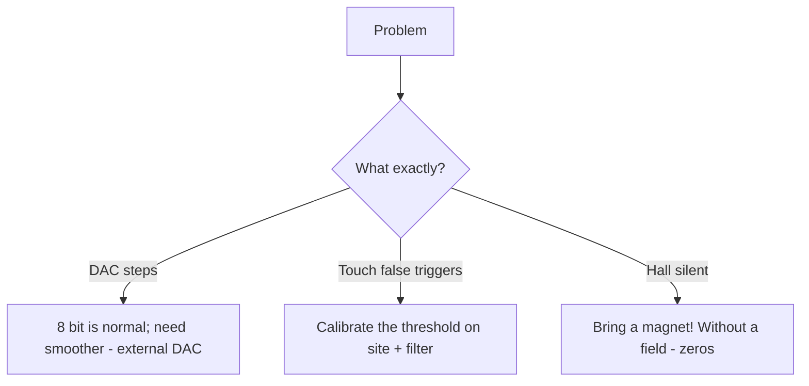

# DAC / Touch / Hall / Temp

![[assets/img/placeholder.png]]

ESP32 Classic has a unique set: **2x DAC 8 bit (25/26)**, **10x touch (T0-T9)**, a **Hall sensor**, a built-in **temp sensor**. S3/C3 have no DAC!

> [!warning] No DAC on S3/C3/C6
> When porting audio/circuits from Classic - replace the DAC with an [[04-Interfaces/04-I2S.en | I2S DAC]] (MAX98357A) or PWM + RC filter.

## Purpose

DAC / Touch / Hall / Temp - Touch T0-T9; Connection table; Sigma-delta modulator (S2/S3) - 1-bit DAC + filter. ESP32 Classic has a unique set: 2x DAC 8 bit (25/26), 10x touch (T0-T9), Hall sensor, built-in temp sensor. S3/C3 have no DAC! Sigma-delta modulator (S2/S3) - 1-bit DAC + filter.

## DAC

| Parameter | Value |
| --- | --- |
| Pins | GPIO25 (DAC1), GPIO26 (DAC2) |
| Resolution | 8 bit (0-255 to 0-3.3V) |
| Speed | up to ~1 MHz (cosine generator) |

## Touch T0-T9

| Touch | GPIO | Touch | GPIO |
| --- | --- | --- | --- |
| T0 | 4 | T5 | 12 |
| T1 | 0 | T6 | 14 |
| T2 | 2 | T7 | 27 |
| T3 | 15 | T8 | 33 |
| T4 | 13 | T9 | 32 |

Works through foil/a coin + wire, sensitivity by threshold. Works as a wakeup from [[07-Timers/03-Sleep-ULP.en | deep-sleep]].

## Connection table

| ESP32 | Component | Note |
| --- | --- | --- |
| GPIO25 | speaker through 100uF + 120 Ohm resistor | DAC audio (quiet, for tests) |
| GPIO33 (T8) | foil button | touch, wire <20 cm |
| GPIO4 (T0) | foil wakeup button | touch-wakeup |

## Code

**Arduino (DAC + touch):**

```cpp
#define TOUCH_PIN T8
int thr = 40;
void setup() {
  Serial.begin(115200);
  dacWrite(25, 128);  // 1.65В
  touchAttachInterrupt(TOUCH_PIN, [](){ Serial.println("touch"); }, thr);
}
void loop() {
  Serial.println(touchRead(TOUCH_PIN));
  delay(500);
}
```

**ESP-IDF:**

```c
#include "driver/dac.h"
#include "driver/touch_pad.h"
void app_main(void) {
    dac_output_enable(DAC_CHANNEL_1);
    dac_output_voltage(DAC_CHANNEL_1, 128);
    touch_pad_init();
    touch_pad_config(TOUCH_PAD_NUM8, 500);
}
```

**MicroPython:**

```python
from machine import DAC, Pin, TouchPad
import esp32
dac = DAC(Pin(25)); dac.write(128)
t = TouchPad(Pin(33)); print(t.read())
print(esp32.hall_sensor())
print((esp32.raw_temperature() - 32) * 5 / 9)  # °C (грубо)
```

## Sigma-delta modulator (S2/S3) - 1-bit DAC + filter

S3 has no hardware DAC (S2 has 2x 8-bit, like Classic), but it has a **Sigma-Delta Modulator (SDM)**: a 1-bit high-frequency stream whose duty equals the analog value. After an RC filter you get a "DAC" on any GPIO.

| Parameter | Value |
| --- | --- |
| Channels | up to 8 (S2/S3) |
| Pins | any GPIO (through the matrix) |
| Modulation frequency | up to ~10 MHz (divider from 80 MHz) |
| Filter | RC: 10k + 100nF (cutoff ~160 Hz) for slow signals; 1k + 10nF for audio tests |
| Effective resolution | ~8 bit on slow signals |

Circuit: `GPIO --[10k]--+--[100nF]--GND`, output from the junction point. Ripple ~10-30 mV - fine for brightness/offset control, for audio better an [[04-Interfaces/04-I2S.en | I2S DAC]].

**ESP-IDF (S3, SDM):**

```c
#include "driver/sdm.h"
sdm_channel_handle_t ch;
void app_main(void) {
    sdm_config_t cfg = {.clk_src = SDM_CLK_SRC_DEFAULT,
                        .sample_rate_hz = 1000000,  // 1 МГц потік
                        .gpio_num = 4};
    sdm_new_channel(&cfg, &ch);
    sdm_channel_enable(ch);
    // 0..255 -> щільність: -128..127 у знакових одиницях API
    sdm_channel_set_pulse_density(ch, 60);  // ~75% заповнення
}
```

**Arduino (S2/S3 - LEDC as a substitute where SDM is not in core):**

```cpp
// Якщо SDM недоступний у твоєму core — ШІМ + RC дає той самий ефект:
ledcSetup(0, 100000, 8);       // 100 кГц, 8 біт; Arduino-ESP32 2.x! У 3.x: ledcAttach(4, 100000, 8) - див. 99-Additions/07-Versions
ledcAttachPin(4, 0);
ledcWrite(0, 192);             // 75% -> ~2.5В після RC 10к+100нФ
```

**MicroPython:** there is no hardware SDM module - use `PWM(Pin(4), freq=100000, duty=768)` + RC filter, or [[04-Interfaces/04-I2S.en | I2S]].

## Touch thresholds, moisture and film

Touch measures the pad capacitance: a finger adds ~5-20 pF. The baseline value drifts with temperature/moisture/film - so **the threshold must be relative, not a constant**.

| Factor | Effect | Fix |
| --- | --- | --- |
| Film/glass 1-3 mm | signal drops 2-5 times | enlarge the pad (a 15-20 mm coin), lower the threshold |
| Moisture/condensation | baseline "drifts" up, false triggers | calibrate the baseline at start + moving average; seal the film edge |
| Long wire > 20 cm | antenna, picks up WiFi noise | short wire, shield; lower sensitivity |
| Power from a USB charger | floating GND = noise | touch the case GND during tests; RC filter |

Adaptive threshold algorithm: `baseline` = average over 10 s with no touch; trigger when `value < baseline * 0.8` (the touch value **drops** on touch!). Hysteresis: release when `value > baseline * 0.9`.

**Arduino (adaptive threshold):**

```cpp
#define TP T8
long base = 0;
void calibrate() {
  long s = 0; for (int i = 0; i < 50; i++) { s += touchRead(TP); delay(20); }
  base = s / 50;
  Serial.printf("baseline=%ld thr_on=%ld thr_off=%ld\n", base, base*8/10, base*9/10);
}
void setup() { Serial.begin(115200); calibrate(); }
void loop() {
  int v = touchRead(TP);
  static bool pressed = false;
  if (!pressed && v < base * 8 / 10) { pressed = true; Serial.println("PRESS"); }
  if (pressed && v > base * 9 / 10) { pressed = false; Serial.println("RELEASE"); }
  // повільне підтягування baseline (компенсація вологи):
  if (!pressed) base = (base * 99 + v) / 100;
  delay(50);
}
```

**ESP-IDF:** `touch_pad_set_thresh(TOUCH_PAD_NUM8, base*8/10)` + filter `touch_pad_filter_start(10)`; moisture protection - periodic baseline recalculation in a timer.

**MicroPython:**

```python
from machine import TouchPad, Pin
t = TouchPad(Pin(33))
base = sum(t.read() for _ in range(50)) // 50
thr = base * 8 // 10
while True:
    v = t.read()
    print(v, "PRESS" if v < thr else "-")
```

## Wakeup on touch with threshold

The touch controller works in [[07-Timers/03-Sleep-ULP.en | deep-sleep]] - an ideal button with zero current (~5-10 uA).

**Arduino:**

```cpp
void setup() {
  Serial.begin(115200);
  touchSleepWakeUpEnable(T8, 40);  // T8 < 40 = будити
  // Калібруй число 40 під свою площадку: виведи touchRead у звичайному режимі,
  // візьми ~70% від значення «без дотику».
  esp_sleep_enable_touchpad_wakeup();
  Serial.println("sleep...");
  esp_deep_sleep_start();
}
void loop() {}
```

**ESP-IDF:**

```c
#include "driver/touch_pad.h"
#include "esp_sleep.h"
void app_main(void) {
    touch_pad_init();
    touch_pad_config(TOUCH_PAD_NUM8, 500);       // початковий поріг, уточни виміром
    touch_pad_filter_start(10);
    esp_sleep_enable_touchpad_wakeup();
    esp_deep_sleep_start();
    // Після wakeup: esp_sleep_get_touchpad_wakeup_status() покаже який пад розбудив
}
```

**MicroPython:**

```python
import esp32
from machine import TouchPad, Pin, deepsleep
esp32.wake_on_touch(True)
t = TouchPad(Pin(33))
t.config(400)  # поріг: підбери як 70% від холостого читання
deepsleep(60000)  # прокинеться раніше, якщо торкнутися T8
```

Checklist: 1) measure the idle and pressed values; 2) threshold = middle between them; 3) verify wakeup with wet hands (moisture shifts both); 4) if two pads are near - space the pads >= 15 mm apart, otherwise cross-triggers.

### Mermaid: DAC/touch/hall glitching



## Common issues

| # | Issue | Why it is bad | How to do it right |
| --- | --- | --- | --- |
| 1 | Expecting 12 bit from DAC | It is 8 bit there | External MCP4725 for precision |
| 2 | Touch threshold out of thin air | False/dead | Calibration + hysteresis |
| 3 | Hall with no magnet | Zeros are normal | Test with neodymium |
| 4 | DAC + WiFi noise | Ripple on the output | RC filter + separate analog |

## Official sources

- [ESP32 DAC (ESP-IDF)](https://docs.espressif.com/projects/esp-idf/en/latest/esp32/api-reference/peripherals/dac.html) - channels 25/26.
- [Touch Sensor Guide](https://docs.espressif.com/projects/esp-idf/en/latest/esp32/api-reference/peripherals/touch_pad.html) - thresholds, filters.

## See also

- [[EN/Home.en]]
- [[EN/01-Hardware/01-ESP32-Classic.en]]
- [[06-Analog/01-ADC.en | ADC]]
- [[07-Timers/03-Sleep-ULP.en | Sleep and ULP]]
- [[03-GPIO/04-Interrupts-PWM.en | PWM]]
- [[03-GPIO/04-Interrupts-PWM.en | Buttons]]
- [[03-GPIO/01-GPIO-Overview.en | GPIO overview]]
