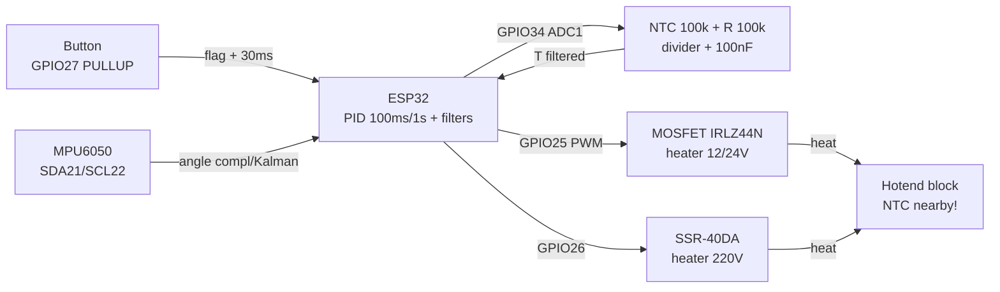

# PID controller and filters - PID, Kalman, averaging, debounce, hysteresis

> [!info] Purpose
> A note about "smart" control: a **PID controller** (sous-vide, incubator, 3D-printer hotend), **filters** (moving average, median, complementary vs Kalman for the MPU6050 angle), **button debounce** (timer vs interrupt+flag), **thermostat hysteresis**. Final example: hotend 100k NTC + MOSFET heater + PID + SSR.

## Purpose

In short: hold a physical value (temperature, angle, speed) exactly at the setpoint with no oscillation and no overshoot. Typical tasks: sous-vide 60.0 °C ±0.2 °C, incubator 37.8 °C, hotend 210 °C for PLA, copter angle stabilization with MPU6050, clean button signal with no bounce.

| Parameter | Value |
| --- | --- |
| Interface | Analog (NTC on ADC1), I2C (MPU6050), GPIO (button, SSR/MOSFET through LEDC-PWM) |
| Module power supply | 3.3V (NTC divider, MPU6050), heater - separate 12/24V or 220V through SSR! |
| Signal levels | 3.3V (ESP32 is not 5V-tolerant; drive SSR through a transistor/optocoupler) |
| Compatibility | ESP32 / S3 / C3 (ADC1 GPIO32-39 with WiFi on) |

Navigation: ADC [[06-Analog/01-ADC.en | ADC]], interrupts/PWM [[EN/03-GPIO/04-Interrupts-PWM.en]], drivers/heaters [[EN/11-Vivid/04-L298N-TB6612-A4988-Buzzer.en]], temperature sensors [[EN/10-Sensors/11-NTC-PT100-MAX6675-LM35.en]], start [[EN/Home.en]].

## Characteristics

| Method | Formula / idea | Where to apply | Starting parameters | Note |
| --- | --- | --- | --- | --- |
| P (proportional) | `Kp x e` - the further from target, the harder we push | Fast response | Kp: heater 2-10 (PWM/°C) | Alone gives a static error |
| I (integral) | `Ki x integral of e` - picks up the error "tail" | Remove the static error | Ki: 0.05-0.5; limit the integral! | Without anti-windup - a giant overheat |
| D (derivative) | `Kd x de/dt` - brakes on approach | Remove overshoot/oscillation | Kd: 5-50; filter the D term! | Amplifies noise - filter the input |
| Anti-windup | Integral clamp + conditional integration | Any PID with saturation (0-100% PWM) | `i_max = 30-50%` of output | Mandatory with relay/SSR (binary output!) |
| Moving average | Mean of last N (N=8-64) | Smooth NTC/current noise | N=16 for temperature at 1 Hz | Adds N/2 samples of delay |
| Median | Middle of N after sorting (N=3-11) | Throw out outliers/spikes | N=5 for ADC | Costlier than mean, but cuts spikes |
| Complementary | `alpha x (gyro) + (1-alpha) x (accel)`, alpha about 0.96-0.98 | MPU6050 angle on ESP32 (cheap!) | alpha=0.98, dt from timer | 5 lines of code, enough for 90% of tasks |
| Kalman (1D) | Prediction + correction with covariances Q/R | Precise angle under vibration | Q=0.001, R=0.03 (start) | More complex; gain vs complementary ~10-20% |
| Hysteresis | On at T<target-D, off at T>target+D | Thermostat on relay/SSR (no PID) | D=0.5-2 °C | Saves the relay from chattering |
| Debounce | Ignore changes <20-50 ms | Any mechanical button | 30 ms; flag from ISR + handling in loop | Never - `delay()` in ISR! |

> [!tip] Where to start for hotend/sous-vide
> Starter PID set for a 40 W heater: Kp=4, Ki=0.15, Kd=20, PID period 1 s (for SSR) or 100 ms (for MOSFET-PWM 20 kHz), integral limit ±30%, input filter - median 5 + average 8. Next - autotune (relay method) and manual fine-tuning.

![[assets/img/pid-filters-scheme.png|600]]
*Fig. Hotend bench: 100k NTC divider on ADC + MOSFET/SSR heater on PWM + button with debounce + MPU6050 for angle.*

## 1. PID controller: P / I / D terms and anti-windup

Discrete form (positional, for ESP32):

```text
e[k]  = setpoint − measured[k]        // помилка
P     = Kp × e[k]
I[k]  = clamp(I[k−1] + Ki × e[k] × dt, −I_MAX, +I_MAX)   // anti-windup клампом!
D     = Kd × (e[k] − e[k−1]) / dt     // або −Kd×d(meas)/dt (derivative on measurement)
u[k]  = clamp(P + I[k] + D, U_MIN, U_MAX)              // 0–255 PWM або 0–100%
```

- **P** - "force": large Kp - fast but oscillation and overshoot; small - crawls and falls short (static error).
- **I** - "memory": eats the static error, but when the output saturates (heating at 100% while temperature is still low) the integral "winds up" sky-high, giving 10-20 °C of overshoot. Fix - **anti-windup**: integral clamp + no integration when the output hits the limit (conditional integration) + reset I on setpoint change.
- **D** - "brake": watches the approach speed and cuts power in advance. Amplifies ADC noise - so D only after a filter (median+average) or "D on measurement", not on error (so a setpoint jump gives no kick).
- **Period dt** is a constant! Call PID strictly on a timer (heating: 100-1000 ms; motor: 5-20 ms). A floating `dt` from `millis()` means oscillation.

Tuning in 15 minutes (relay/empirical method):

1. Ki=Kd=0, raise Kp to stable oscillation (Ku) with period Tu.
2. Set Kp=0.6xKu, Ki=2xKp/Tuxdt, Kd=KpxTu/8/dt (Ziegler-Nichols, start).
3. Halve on overshoot >2 °C; add a D filter when the output trembles.

Application examples:

- **Sous-vide:** setpoint 60 °C, 500 W heater through SSR, PID period 1 s (SSR dislikes kHz PWM!), emergency hysteresis +5 °C.
- **Incubator:** 37.8 °C, 60 W lamp/heater + fan, two sensors (top/bottom), narrow I-limit (±15%) - overheating kills the brood.
- **3D hotend:** 210 °C, 40 W 12/24V cartridge through MOSFET, 100k thermistor, PWM 20-50 Hz (slow - inertia!), Marlin autotune `M303` as a Kp/Ki/Kd reference.

## 2. Complementary vs Kalman (MPU6050 angle) - overview

Task: the accelerometer gives an absolute angle but noisy in motion; the gyroscope gives smooth rate but drifts. Fuse both.

**Complementary (recommended to start):**

```text
angle += gyro_rate × dt                 // прогноз за гіроскопом
angle  = α × angle + (1−α) × accel_angle // корекція за акселерометром, α=0.98
```

Pros: 5 lines, 0 libraries, computed in microseconds, dt from `micros()`. Cons: alpha is hand-tuned; under heavy vibration the accelerometer lies - complementary believes it by (1-alpha).

**Kalman 1D (when complementary is not enough):** state = [angle, gyro bias]; covariance prediction Q (process noise), correction with R (measurement noise). Gives the optimal weight automatically, holds copter/scooter vibrations better. Price: ~40 lines, 2x2 matrices, Q/R tuning (start Q=0.001, R=0.03). ESP32 computes it easily (tens of microseconds).

Selection rule: platform/manipulator/incubator-lid tilt angle - complementary; flight/balancing under motor vibration - Kalman + MPU6050 vibration isolation (foam!).

## 3. Moving average + median (chain for NTC)

Raw ESP32 ADC is noisy at ±20-50 counts (±0.3-0.5 °C on NTC) + once a second a "spike" arrives from WiFi. Chain:

1. **Median 5** - cuts spikes (sort the last 5, take the middle).
2. **Moving average 8-16** - smooths white noise.
3. Feed the filtered value to PID; raw goes only to the log once a second for diagnostics.

Ring buffer with no `memmove`: index `(i+1)%N`, running sum (subtract old, add new) - O(1). Rate: read temperature at 10 Hz, feed the filter at 1-2 Hz to PID - heating is slow, faster is not needed.

## 4. Button debounce - in depth (timer vs interrupt+flag)

A mechanical contact bounces for 5-20 ms: one press = 10-50 edges. Options:

- **Timer polling (recommended):** every 10 ms read the pin; accept the state if identical 3 times in a row (30 ms). Simple, deterministic, 0 ISR problems. For 1-4 buttons - ideal.
- **Interrupt + flag:** ISR only sets `volatile bool pressed=true` (and a timestamp!), handling in loop with a `millis()-last>30` check. Never in ISR: `delay()`, `Serial.print()`, ADC reads, I2C! Plus: wakeup from light-sleep on a button. Minus: beginners hang logic in ISR and catch WDT.
- **Hardware:** RC 10k + 100 nF or a 74HC14 Schmitt trigger - when the button is 5 m of wire away in a workshop (shielding there too!).

Pull the button to 3.3V with an internal pull-up (`INPUT_PULLUP`), close to GND; long lines - external 4.7k + 100 nF capacitor near the ESP32.

## 5. Thermostat hysteresis (when PID is not needed)

A relay/SSR on 220V dislikes PWM: for a simple incubator or heater a "fork" is enough: turn on at T < 37.3, turn off at T > 38.3 (setpoint 37.8 ± 0.5). The relay clicks once per minutes, not seconds, and lives for years. PID wins where ±0.2 °C is needed (sous-vide, hotend); hysteresis where ±1 °C is fine and simplicity/reliability matters. Combination: PID controls, and an emergency +5 °C hysteresis cuts heating independently (safety!).

## Module pin legend (hotend bench: NTC + MOSFET/SSR + button + MPU6050)

| Pin / node | Type | To ESP32 | Note |
| --- | --- | --- | --- |
| NTC 100k (hotend) + R 100k to 3V3 | Analog divider | GPIO34 (ADC1 CH6, input only!) | Divider middle to GPIO34 + 100 nF to GND; Beta 3950, table/Steinhart-Hart in code |
| MOSFET IRLZ44N (G/D/S) | Power switch NO | G to GPIO25 through 220 Ohm (+10k to GND) | D to 12/24V heater, S to GND; heatsink from 3 A; logic-level Vgs! |
| SSR-40DA (+/- control) | Solid-state relay | + to GPIO26 through 1k (or through 2N2222), - to GND | 220V heater load; snubber/heatsink; 3-32V DC control |
| "Start/Stop" button | Digital | GPIO27 to button to GND (`INPUT_PULLUP`) | Debounce 30 ms; +100 nF to GND on long wires |
| MPU6050 VCC/GND/SDA/SCL | I2C | 3V3/GND/GPIO21/GPIO22 + 4.7k pull-up | Address 0x68 (AD0=GND); vibration isolation - foam! |
| 12/24V heater power supply | Power | Separate PSU, GND common with ESP32 at one point | Schottky diode on inductive load; fuse! |

> [!danger] 220V through SSR - safety
> Put the power part (220V) in a separate case, covered terminal blocks, fuse + 240 °C thermal fuse on the hotend block, emergency hysteresis in code + an independent thermostat. ESP32 and humans must never touch 220V.

## Connection diagram

| ESP32 DevKit | Node | Note |
| --- | --- | --- |
| 3V3 | NTC divider top (R 100k), MPU6050 VCC | Split analog and digital, 100 nF near each |
| GND | NTC bottom through thermistor, MOSFET S, SSR -, button, MPU6050 GND | Star at one point near the board |
| GPIO34 | NTC divider middle | ADC1 (works with WiFi!), attenuation 11 dB |
| GPIO25 | MOSFET Gate through 220 Ohm | LEDC-PWM 20-50 Hz for the heater; 10k Gate to GND |
| GPIO26 | SSR + (through 1k / transistor) | PID period 1 s for SSR (slow switch!) |
| GPIO27 | Button to GND | `INPUT_PULLUP`, debounce 30 ms |
| GPIO21/22 | MPU6050 SDA/SCL | I2C 400 kHz, 4.7k pull-up to 3.3V |

![[assets/img/pid-filters-scheme.png|600]]
*Fig. Overall diagram: NTC on GPIO34 + MOSFET/SSR heating + button + MPU6050 on one ESP32.*

### ASCII diagram

```text
ESP32 DevKit                Hotend-стенд
─────────────                ────────────
3V3 ──┬───────────────────►  R 100к ──┬──► GPIO34 (ADC1!)
      │                               │
      │                          NTC 100к (hotend, до блоку)
      │                               │
GND ──┴───────────────────   GND ─────┘ (+100нФ GPIO34→GND!)

GPIO25 ──220 Ом──► G-IRLZ44N (10к G→GND!)  D ──► Нагрівач 12/24V ──► БЖ+
                          S ──► GND (спільний, радіатор на FET!)
GPIO26 ──1к──► SSR+ (SSR−→GND) ~~ 220V ТЕН ~~ 220V (корпус! запобіжник!)
GPIO27 ──► Кнопка ──► GND (INPUT_PULLUP, +100нФ, дебаунс 30мс)
GPIO21 ──► SDA MPU6050 │ GPIO22 ──► SCL (pull-up 4.7к до 3V3, addr 0x68)

MOSFET: швидкий ШІМ 20-50Гц (PID 100мс). SSR: повільний (PID 1с, time-proportioning)!
```

### Mermaid



## Arduino code (PID hotend + median/average + debounce + emergency hysteresis)

```cpp
// Hotend 210 °C: NTC100к на GPIO34 + MOSFET GPIO25 + кнопка GPIO27.
// Бібліотека: br3ttb/Arduino-PID-Library (v1.2.1). Період PID 100 мс.
#include <PID_v1.h>
#define NTC_PIN 34
#define HEAT_PIN 25
#define BTN_PIN 27
double Setpoint = 210, Input = 25, Output = 0;
// Старт для 40Вт-картриджа: Kp=4, Ki=0.15, Kd=20. Далі автотюнінг!
double Kp = 4, Ki = 0.15, Kd = 20;
PID pid(&Input, &Output, &Setpoint, Kp, Ki, Kd, DIRECT);
// --- Фільтр: медіана 5 + середнє 8 ---
float adc_buf[8]; uint8_t abi = 0;
float median5(float v) {
  static float w[5]; static uint8_t i = 0;
  w[i++ % 5] = v;
  float s[5]; memcpy(s, w, sizeof(s));
  for (uint8_t a = 0; a < 4; a++) for (uint8_t b = a + 1; b < 5; b++)
    if (s[b] < s[a]) { float t = s[a]; s[a] = s[b]; s[b] = t; }
  return s[2];
}
float ntcTemp() {  // Beta 3950, R0=100к, дільник 100к до 3V3, ADC 12біт
  int raw = analogRead(NTC_PIN);
  float v = median5(raw);
  adc_buf[abi++ % 8] = v;
  float m = 0; for (uint8_t i = 0; i < 8; i++) m += adc_buf[i];
  m /= 8.0;
  float R = 100000.0 * (4095.0 / m - 1.0);  // верх R до 3V3!
  float T = 1.0 / (1.0 / 298.15 + log(R / 100000.0) / 3950.0) - 273.15;
  return T;
}
// --- Дебаунс опитуванням: 3×10мс ---
bool btnPressed() {
  static uint8_t cnt = 0; static bool ready = true;
  static unsigned long t = 0;
  if (millis() - t < 10) return false;
  t = millis();
  if (digitalRead(BTN_PIN) == LOW) { if (++cnt >= 3 && ready) { ready = false; cnt = 0; return true; } }
  else { cnt = 0; ready = true; }
  return false;
}
bool heating = false;
void setup() {
  Serial.begin(115200);
  analogReadResolution(12); analogSetAttenuation(ADC_11db);
  pinMode(HEAT_PIN, OUTPUT); pinMode(BTN_PIN, INPUT_PULLUP);
  pid.SetMode(AUTOMATIC); pid.SetOutputLimits(0, 255);
  pid.SetSampleTime(100);  // = dt! строго 100 мс
}
void loop() {
  if (btnPressed()) { heating = !heating; Serial.println(heating ? "START" : "STOP"); }
  Input = ntcTemp();
  if (Input > Setpoint + 15) { analogWrite(HEAT_PIN, 0);  // АВАРІЙНИЙ гістерезис!
    Serial.println("АВАРІЯ: перегрів!"); delay(1000); return; }
  if (heating) { pid.Compute(); analogWrite(HEAT_PIN, (int)Output); }
  else analogWrite(HEAT_PIN, 0);
  static unsigned long l = 0;
  if (millis() - l > 500) { l = millis(); Serial.printf("T=%.1f U=%.0f\n", Input, Output); }
  delay(50);
}
```

## ESP-IDF code (PID + LEDC-PWM + ISR button with flag)

```c
// Концепт IDF: ADC-oneshot (GPIO34) + LEDC 20 Гц (GPIO25) + ISR кнопки (GPIO27).
// Повні приклади: adc_oneshot_read + ledc_basic. dt PID — esp_timer 100 мс!
#include "driver/gpio.h"
#include "driver/ledc.h"
#define HEAT_GPIO 25
#define BTN_GPIO 27
static volatile bool btn_flag = false;
static volatile uint32_t btn_last = 0;
static void IRAM_ATTR btn_isr(void *a) {
    uint32_t now = xTaskGetTickCountFromISR();  // мітка, БЕЗ delay/print/ADC!
    if (now - btn_last > pdMS_TO_TICKS(30)) { btn_flag = true; btn_last = now; }
}
void app_main(void) {
    // ADC1 oneshot GPIO34, atten 12дБ; LEDC timer 20 Гц/10 біт, канал на GPIO25.
    // esp_timer_create(100 мс) → PID step: read_filt → P/I(D по виміру) →
    // anti-windup кламп I ±30% → ledc_set_duty_and_update().
    gpio_install_isr_service(0);
    gpio_set_direction(BTN_GPIO, GPIO_MODE_INPUT);
    gpio_set_pull_mode(BTN_GPIO, GPIO_PULLUP_ONLY);
    gpio_set_intr_type(BTN_GPIO, GPIO_INTR_NEGEDGE);
    gpio_isr_handler_add(BTN_GPIO, btn_isr, NULL);
    while (1) {
        if (btn_flag) { btn_flag = false; /* toggle heating */ }
        vTaskDelay(pdMS_TO_TICKS(50));
    }
}
```

## MicroPython code (hysteresis thermostat + complementary MPU6050 angle)

```python
# Варіант A: простий термостат-інкубатор 37.8 ±0.5 (без PID — гістерезис!).
from machine import Pin, ADC
import time
adc = ADC(Pin(34)); adc.atten(ADC.ATTN_11DB); adc.width(ADC.WIDTH_12BIT)
heat = Pin(26, Pin.OUT)   # SSR через 1к/транзистор
btn = Pin(27, Pin.IN, Pin.PULL_UP)
SET, D = 37.8, 0.5
def temp_c():
    import math
    raw = sorted([adc.read() for _ in range(5)])[2]  # медіана 5
    R = 100000 * (4095 / max(raw, 1) - 1)
    return 1 / (1 / 298.15 + math.log(R / 100000) / 3950) - 273.15
on = False
last, st = 0, [1, 1, 1]
while True:
    now = time.ticks_ms()
    if time.ticks_diff(now, last) > 10:  # дебаунс 3×10мс
        last = now
        st = st[1:] + [btn.value()]
        if st == [0, 0, 0] and on is False:
            on = True; print("START")
        if st == [1, 1, 1] and on is True and btn.value() == 1:
            pass
    t = temp_c()
    if on:
        if t < SET - D: heat.on()
        elif t > SET + D: heat.off()  # гістерезис: реле не цьокотить
        if t > SET + 5: heat.off(); print("АВАРІЯ!")
    else:
        heat.off()
    time.sleep(0.5)
```

```python
# Варіант B: кут MPU6050 complementary (α=0.98), I2C 21/22.
from machine import I2C, Pin
import time, math
i2c = I2C(0, sda=Pin(21), scl=Pin(22), freq=400000)
A = 0x68
def r16(reg):
    h, l = i2c.readfrom_mem(A, reg, 1)[0], i2c.readfrom_mem(A, reg + 1, 1)[0]
    v = h << 8 | l
    return v - 65536 if v > 32767 else v
i2c.writeto_mem(A, 0x6B, b"\x00")  # wake up
angle, prev = 0.0, time.ticks_us()
ALPHA = 0.98
while True:
    now = time.ticks_us()
    dt = time.ticks_diff(now, prev) / 1e6; prev = now
    ax, az = r16(0x3B), r16(0x3F)
    gx = r16(0x43) / 131.0  # ±250°/с
    acc_a = math.degrees(math.atan2(ax, az))
    angle = ALPHA * (angle + gx * dt) + (1 - ALPHA) * acc_a
    print("Кут: %.1f" % angle)
    time.sleep(0.02)
```

More about environments: [[00-Start/05-Environment-Choice.en | Environment choice]].

## Common issues

| # | Symptom | Cause | Fix |
| --- | --- | --- | --- |
| 1 | Overshoot +10-20 °C after reaching setpoint | Integral windup (heated at 100%, I wound up) | Clamp I at ±30% of output, conditional integration (no integration at saturation), reset I on setpoint change |
| 2 | Oscillation ±3-5 °C around setpoint | Kp too large / dt floats / D with no filter | Reduce Kp x0.6, strict timer dt (esp_timer/SetSampleTime), D on measurement + median at input |
| 3 | Output trembles 0-100% every second | ADC noise in the D term, Kd too large | Median 5 + average 8, Kd /2, D filter (first order), check 100 nF on NTC |
| 4 | SSR clicks/heats up, heater blinks | kHz PWM on SSR (slow switch!) | For SSR - time-proportioning with 1 s period (window), for MOSFET - LEDC 20-50 Hz; not the other way! |
| 5 | Temperature "drifts" 2-3 °C with WiFi | ADC2 instead of ADC1; divider self-heating; wrong Beta | Only ADC1 (GPIO32-39) with WiFi; divider R 1% 100k; Beta from the thermistor datasheet (3950/3435!), calibration in boiling water/ice |
| 6 | Button gives 5-10 triggers per press | Bounce with no debounce; logic in ISR | Debounce 30 ms (3x10 ms or flag+time), only flag+timestamp in ISR; RC 10k/100nF on long lines |
| 7 | MPU6050 angle drifts/jumps under vibration | Gyro drift; accelerometer believes vibration | Complementary alpha=0.98 + gyro zero calibration; Kalman with motors; MPU on foam, dt from micros (not delay!) |
| 8 | MOSFET boils / half-open | Non-logic FET (IRF540 instead of IRLZ44N), no heatsink | Only logic-level (IRLZ44N/AOD4184), 10k Gate to GND, heatsink from 3 A, PWM <=50 Hz for heating |

## Official sources

- [Arduino PID Library - br3ttb (PID_v1 code, API)](https://github.com/br3ttb/Arduino-PID-Library) - `SetSampleTime/SetOutputLimits`, DIRECT/REVERSE modes.
- [ESP-IDF ADC - channels, attenuation, oneshot/continuous, calibration](https://docs.espressif.com/projects/esp-idf/en/latest/esp32/api-reference/peripherals/adc/index.html) - why only ADC1 with WiFi.
- [ESP-IDF GPIO - interrupts, pull-up/down, ISR service](https://docs.espressif.com/projects/esp-idf/en/latest/esp32/api-reference/peripherals/gpio.html) - `gpio_isr_handler_add`, IRAM flags.
- [ESP-IDF LEDC - PWM for MOSFET heater (frequency/resolution)](https://docs.espressif.com/projects/esp-idf/en/latest/esp32/api-reference/peripherals/ledc.html) - `ledc_set_duty_and_update`, frequency choice.

## See also

- [[EN/Home.en]] - reference start page
- [[06-Analog/01-ADC.en | ADC]] - ESP32 ADC: channels, attenuation, calibration, ADC2/WiFi conflict
- [[EN/11-Vivid/04-L298N-TB6612-A4988-Buzzer.en]] - power switches and drivers (MOSFET/SSR practice)
- [[EN/03-GPIO/04-Interrupts-PWM.en]] - interrupts and PWM (ISR flags, LEDC timers)
- [[EN/10-Sensors/11-NTC-PT100-MAX6675-LM35.en]] - temperature sensors (NTC tables, MAX6675)
