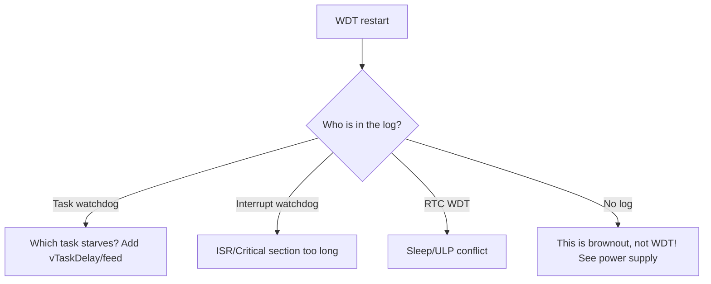

# WDT - watchdog timers

![[assets/img/placeholder.png]]

Two levels: **Task WDT** (loop/task hang) and **RTC WDT** (whole chip hang in sleep). Do not confuse with [[07-Timers/03-Sleep-ULP.en | sleep-wakeup]].

> [!danger] WDT is not a crutch for delay()
> If Task WDT fires - look for a blocking `while` / starving task, not a bigger timeout up to 30 s.

## Purpose

WDT - watchdog timers - Comparison; Typical panic causes; Connection table (panic indication). If Task WDT fires - look for a blocking while / starving task, not a bigger timeout up to 30 s. 1. Task watchdog got triggered + task register dump to UART0. Kinds - Task WDT, Interrupt WDT, RTC WDT; each is fixed its own way (see the mermaid diagram).

## Comparison

| Parameter | Task WDT (MWDT0/1) | RTC WDT |
| --- | --- | --- |
| What it watches | loop + registered tasks | CPU + RTC in sleep |
| Timeout default | 5 s (Arduino) | ~9 s |
| Action | panic + reboot | reset |
| Feed | automatically in idle / manually | automatically |
| When to disable | never for long | only in a critical section |

## Typical panic causes

| Log | Cause | Fix |
| --- | --- | --- |
| `Task watchdog got triggered. The following tasks did not reset the watchdog in time: loopTask` | `delay(10000)` / `while(1)` with no yield | split into chunks + `vTaskDelay` / `yield()` |
| `Guru Meditation ... LoadProhibited` after WDT | task stack overflow | enlarge stack in `xTaskCreate` |
| reboot every ~9 s in deep-sleep | RTC WDT + long hold | shorten RTC operations |

## Connection table (panic indication)

| ESP32 | Component | Note |
| --- | --- | --- |
| GPIO2 | LED | on in setup(), off on panic - reboot cycle visible |
| U0 TX/RX | USB-UART | read the panic log for diagnostics |

## Code - feed and setup

**Arduino:**

```cpp
#include "esp_task_wdt.h"
void setup() {
  Serial.begin(115200);
  esp_task_wdt_init(10, true);  // 10 с, panic=true
  esp_task_wdt_add(NULL);       // стежити за loopTask
}
void loop() {
  // довга робота шматками:
  for (int i = 0; i < 5; i++) { /* chunk */ esp_task_wdt_reset(); delay(1000); }
}
```

**ESP-IDF:**

```c
#include "esp_task_wdt.h"
void app_main(void) {
    esp_task_wdt_config_t c = {.timeout_ms=10000,.idle_core_mask=0,.trigger_panic=true};
    esp_task_wdt_init(&c);
    // у своєму task: esp_task_wdt_add(NULL); ... esp_task_wdt_reset();
}
```

**MicroPython:**

```python
from machine import WDT
w = WDT(timeout=10000)
while True:
    # робота
    w.feed()
```

## Task-WDT vs RTC-WDT vs MWDT0/1 - full picture

| Watchdog | Where it lives | What it watches | Clocking | Action on trigger |
| --- | --- | --- | --- | --- |
| Task WDT | core SW add-on over MWDT | registered tasks (loopTask, + own) | APB | panic + reboot (if `trigger_panic`) or callback |
| MWDT0 | Timer Group 0 | same, HW level | APB (80 MHz) | interrupt to reset |
| MWDT1 | Timer Group 1 | same, second copy (IDF takes one for Task WDT) | APB | interrupt to reset |
| RTC WDT | RTC domain | CPU + RTC in sleep /ULP hang | slow clock (~150 kHz) | chip reset |
| INT WDT | interrupts | interrupt starvation (ISR cannot keep up) | CPU clock | panic (on by default) |

Hierarchy in practice: your `loop()` feeds **Task WDT** - Task WDT feeds **MWDT0** - **RTC WDT** separately covers sleep. So `delay(10000)` kills exactly the Task level, and a hung ULP in deep-sleep kills the RTC level.

Who is watched by default:

| Environment | Watched | Timeout default |
| --- | --- | --- |
| Arduino | loopTask + IDLE0/1 | 5 s |
| ESP-IDF | IDLE0/IDLE1 (+ own after `esp_task_wdt_add`) | 5 s (`CONFIG_ESP_TASK_WDT_TIMEOUT_S`) |
| MicroPython | main task | set in `WDT(timeout=...)` |

> [!warning] IDLE watching
> Task WDT by default watches **IDLE tasks**. If your higher-priority task spins forever with no `vTaskDelay` - IDLE starves to WDT panic, while your code "works". Fix: `vTaskDelay(1)` in loops.

## Timeout calculation

Formula: `timeout > longest_atomic_chunk + WiFi_margin`.

| Scenario | Longest chunk | Recommended timeout |
| --- | --- | --- |
| Blink + sensors | <100 ms | 5 s (default) |
| HTTP request in loop | 3-8 s (bad server) | 10-15 s **or** move to a separate task |
| Writing 512 KB to SD | 2-5 s | 10 s + `esp_task_wdt_reset()` between blocks |
| OTA 1 MB over WiFi | 10-60 s | feed in the `ArduinoOTA.onProgress` callback / separate task |
| WiFi STA connect | up to 10 s | 15 s during connect, then back to 5 s |

MWDT HW calculation (when setting up Timer Group manually):

```text
timeout_с = (prescaler × reload) / 80_000_000
приклад: prescaler=40000, reload=200000 → (40000×200000)/80М = 100 с — забагато!
практика: prescaler=500, reload=20000 → (500×20000)/80М = 0.125 с — сторож фази
```

Code with periodic feeding of a long operation:

```cpp
// Довгий запис SD шматками з годуванням:
void bigWrite(File &f, const uint8_t *buf, size_t n) {
  const size_t CH = 4096;
  for (size_t o = 0; o < n; o += CH) {
    f.write(buf + o, min(CH, n - o));
    esp_task_wdt_reset();  // годуй кожен чанк
    yield();               // дай IDLE подихати
  }
  f.flush();
}
```

## Panic handler + coredump

What happens on Task-WDT panic:

1. `Task watchdog got triggered` + task register dump to UART0.
2. `Guru Meditation` to reboot (if panic=true).
3. With coredump configured - write to flash/NVS for offline analysis.

| Where to write coredump | menuconfig | When |
| --- | --- | --- |
| UART (default) | `ESP_COREDUMP_ENABLE_TO_UART` | bench, quick view |
| Flash (64 KB partition) | `..._TO_FLASH` + `coredump` partition in partitions | field device with no UART |
| Off | `..._TO_NONE` | release short on flash |

Parsing a flash coredump:

```bash
# 1. Злити розділ:
esptool.py --port /dev/ttyUSB0 read_flash 0x110000 0x10000 core.bin
# (адресу свого розділу coredump дивись в partitions.csv)
# 2. Декодувати:
esp-coredump.py info_corefile -t elf -c core.bin firmware.elf
# 3. Побачиш стек задачі-винуватця — зазвичай while(1) без yield або deadlock на м'ютексі
```

Minimal panic callback (record the cause before reboot):

```c
#include "esp_task_wdt.h"
#include "esp_system.h"
static void wdt_user_handler(void *arg) {
    // Сюди потрапляємо в контексті переривання: тільки швидке!
    // Наприклад: записати прапор в RTC-пам'ять, моргнути LED неможливо — ISR!
}
void app_main(void) {
    esp_task_wdt_config_t c = {.timeout_ms=10000,.idle_core_mask=(1<<0)|(1<<1),.trigger_panic=true};
    esp_task_wdt_init(&c);
    esp_task_wdt_add_user("myguard", &wdt_user_handler);  // іменований сторож
}
```

Reading the last reset cause in code (telemetry):

```cpp
#include "esp_system.h"
void setup() {
  Serial.begin(115200);
  auto r = esp_reset_reason();
  if (r == ESP_RST_TASK_WDT) Serial.println("попередній reset: Task WDT!");
  else if (r == ESP_RST_INT_WDT) Serial.println("попередній reset: INT WDT!");
  else if (r == ESP_RST_WDT) Serial.println("попередній reset: RTC/MWDT!");
}
```

## Pitfalls with WiFi tasks

| Pitfall | Symptom | Fix |
| --- | --- | --- |
| `WiFi.begin()` blocks loop up to 10 s | WDT panic exactly at start/reconnect | timeout 15 s during connect or WiFi in a separate task |
| `client.readString()` waits for the server forever | panic after 5 s | `client.setTimeout(3000)` + chunked reads with `esp_task_wdt_reset()` |
| BLE-scan + WiFi at once | IDLE starves, INT WDT fires | separate in time: scan to pause to WiFi send |
| `ESP-NOW` callback does heavy work (SD/HTTP) | WDT in WiFi-task | callback only sets a flag/queue, heavy work in loop task |
| Two cores: task on Core 0 forgotten to add | `esp_task_wdt_add` called only in loop (Core 1), Core 0 unwatched | add explicitly in every long-lived task |
| `disableLoopWDT()` forever | hang with no reboot, "board is silent" | disable precisely around one operation, then `enableLoopWDT()` |

WiFi-task template with own feeding:

```cpp
void wifiTask(void *p) {
  esp_task_wdt_add(NULL);  // наглядати за цим task
  for (;;) {
    if (WiFi.status() != WL_CONNECTED) {
      WiFi.reconnect();
      for (int i = 0; i < 20 && WiFi.status() != WL_CONNECTED; i++) {
        vTaskDelay(pdMS_TO_TICKS(500));
        esp_task_wdt_reset();
      }
    }
    esp_task_wdt_reset();
    vTaskDelay(pdMS_TO_TICKS(1000));
  }
}
// в setup: xTaskCreatePinnedToCore(wifiTask, "wifi", 4096, NULL, 3, NULL, 0);
```

> [!tip] Rule of thumb
> WDT fired means a **diagnosis**, not an enemy. Raising the timeout without finding the blocking spot turns a fast clear panic into a slow unclear hang. See [[09-Firmware/06-FreeRTOS-Patterns.en | FreeRTOS patterns]] and [[09-Firmware/05-JTAG-Debug.en | debugging]].

## Interrupt-WDT vs Task-WDT - deep comparison

| Parameter | Interrupt WDT (IWDT) | Task WDT (TWDT) |
| --- | --- | --- |
| HW base | MWDT Timer Group 1 | MWDT Timer Group 0 |
| Who feeds | FreeRTOS tick-ISR of each core | IDLE-task of each core + subscribed tasks |
| What it catches | blocked interrupts: long critical section, ISR that never returns, disabled interrupts | task that never gives CPU back: `while(1)` with no yield, IDLE starvation, deadlock |
| Timeout default | `CONFIG_ESP_INT_WDT_TIMEOUT_MS` = 300 ms (800 ms with PSRAM!) | `CONFIG_ESP_TASK_WDT_TIMEOUT_S` = 5 s |
| 1st stage | panic `Interrupt wdt timeout on CPUx` + backtrace | warning + backtrace (or panic with `CONFIG_ESP_TASK_WDT_PANIC`) |
| 2nd stage | hard chip reset (if panic-handler hangs) | reset (with panic=true) |
| Timeout rule | >= 2x tick period (at 100 Hz tick - minimum 20 ms, take 300 ms) | > longest atomic chunk + WiFi margin |
| Typical culprits | `portENTER_CRITICAL` for seconds, `SPI.transfer` in ISR, `Serial.print` in ISR | `delay(10000)` in loop, `client.readString()` with no timeout, tight loop with no `vTaskDelay` |

Log diagnostics:

| Log | Which WDT | What to do |
| --- | --- | --- |
| `Guru Meditation ... Interrupt wdt timeout on CPU0` + backtrace in ISR/`spi_device_transmit` | IWDT | move heavy work out of ISR into a task (queue!), shorten the critical section |
| `Task watchdog got triggered ... IDLE0 ... Tasks currently running: main` | TWDT, IDLE0 starvation | `main` spins with no yield - add `vTaskDelay(1)` |
| `... IDLE1 ... CPU 1: wifi` | TWDT, IDLE1 starvation | WiFi-task priority choked IDLE - lower the priority or add pauses |
| `... loopTask` | TWDT, loop hung | look for a blocking `while`/`delay` in `loop()` |
| Both in turn | cascade: first TWDT brakes, then ISR cannot keep up | fix the root cause (TWDT), IWDT will fade on its own |

menuconfig matrix (Component config to ESP System Settings):

| Option | Default | For production | For bench |
| --- | --- | --- | --- |
| `CONFIG_ESP_INT_WDT` | y | y (always!) | y |
| `CONFIG_ESP_INT_WDT_TIMEOUT_MS` | 300 | 300 (with PSRAM - 800) | 1000 (to keep up with debug) |
| `CONFIG_ESP_TASK_WDT_EN` | y | y | y |
| `CONFIG_ESP_TASK_WDT_INIT` | y (auto at start) | y | y |
| `CONFIG_ESP_TASK_WDT_PANIC` | n (warning only) | **y** (restart instead of rotten hang) | n (watch warning + live chip) |
| `CONFIG_ESP_TASK_WDT_TIMEOUT_S` | 5 | 5-10 | 10-30 |

> [!warning] JTAG disables both WDTs on breakpoints
> OpenOCD stops MWDT on every halt - firmware under the debugger "never falls on WDT", but falls without the debugger. Do not trust behavior under JTAG: run stress with no debugger. See [[09-Firmware/05-JTAG-Debug.en | Debugging]].

## Custom panic handler - record the cause before reboot

Context: the panic handler runs from an interrupt/cache-like state - **only IRAM-safe, no malloc/logging to flash**.

| API | Purpose | Context limits |
| --- | --- | --- |
| `esp_task_wdt_isr_user_handler()` (weak symbol - override in your code) | called in ISR on TWDT-timeout | only fast: flag to RTC memory, register, variable rewrite |
| `esp_task_wdt_add_user(name, &h)` + `esp_task_wdt_reset_user(h)` | granular watching of a function/code path | reset only with own handle |
| `esp_reset_reason()` on next boot | read the cause (for telemetry) | call at `setup()`/`app_main` start |
| `esp_coredump_to_flash` + `coredump` partition | offline stack of the culprit | needs a partition in partitions (64 KB) |

```c
#include "esp_task_wdt.h"
#include "esp_system.h"
#include "esp_attr.h"

// 1. Причина в RTC-пам'ять (переживе reboot!):
RTC_NOINIT_ATTR uint32_t wdt_crash_magic;
RTC_NOINIT_ATTR uint32_t wdt_crash_pc;

// 2. ISR-колбек: тільки запис, ніяких Serial/print/malloc!
void esp_task_wdt_isr_user_handler(void) {
  wdt_crash_magic = 0xDEADBEEF;
  // PC дістань з фрейму, якщо вмієш; мінімум — сам факт спрацювання
}

// 3. При старті — відправка телеметрії:
void report_last_crash(void) {
  auto r = esp_reset_reason();
  if (r == ESP_RST_TASK_WDT || r == ESP_RST_INT_WDT || r == ESP_RST_WDT) {
    // відправ на сервер: причина + magic + uptime + версія firmwares
  }
  if (wdt_crash_magic == 0xDEADBEEF) {
    // був саме TWDT-ISR — цінний біт для статистики парку пристроїв
    wdt_crash_magic = 0;
  }
}
```

Granular watching of subsystems (finds the culprit down to the function):

```c
esp_task_wdt_user_handle_t uh_sensor, uh_net;
void app_main(void) {
  esp_task_wdt_config_t c = {.timeout_ms = 8000, .idle_core_mask = 3, .trigger_panic = true};
  esp_task_wdt_init(&c);
  esp_task_wdt_add_user("sensor", &uh_sensor);
  esp_task_wdt_add_user("net", &uh_net);
}
void sensor_task(void *p) {
  for (;;) {
    read_sensors_blocking();       // якщо зависне тут — у panic-лозі буде "sensor"!
    esp_task_wdt_reset_user(uh_sensor);
    vTaskDelay(pdMS_TO_TICKS(100));
  }
}
```

## Brownout + WDT interaction

Brownout-detector (BOD) is a separate voltage watchdog, but symptoms are confused with WDT: random reboots under WiFi-TX.

| Detector | Threshold default | Action | Log |
| --- | --- | --- | --- |
| BOD Level 1-3 (`CONFIG_BROWNOUT_DET_LVL`) | ~2.4-2.7V (tunable) | chip reset | `Brownout detector was triggered` |
| Task WDT | 5 s | warning/panic | `Task watchdog got triggered` |
| RTC WDT | ~9 s | reset | silent reset, cause `ESP_RST_WDT` |

Separation matrix:

| Symptom | BOD | WDT |
| --- | --- | --- |
| Reboot only on WiFi-TX / SD write + WiFi | **yes (90%)** | no |
| Reboot after exactly N seconds at a specific code spot | no | **yes** |
| `Brownout detector was triggered` in the log | **yes** | no |
| Depends on power cable/wire length | **yes** | no |
| Depends on `delay`/`while` length | no | **yes** |

Fixing the BOD+WDT pair together (typical battery/cheap-LDO device):

1. 470 uF electrolytic + 100 nF ceramic near 3V3 (swallows WiFi peaks of 240-500 mA).
2. Thick short power wires; AMS1117 clones - first suspects. See [[02-Power-Supply/01-Power-Rails.en | Power supply]].
3. `CONFIG_BROWNOUT_DET=y` in production - a clean BOD-reset with a log beats rotten work on the edge.
4. Do NOT raise the WDT-timeout to "survive" sagging - it masks BOD as a hang.

```cpp
// Розрізнення BOD vs WDT програмно (телеметрія парку):
#include "esp_system.h"
void setup() {
  Serial.begin(115200);
  switch (esp_reset_reason()) {
    case ESP_RST_BROWNOUT: Serial.println("BOD: чини живлення!"); break;
    case ESP_RST_TASK_WDT: Serial.println("TWDT: шукай блокуючий код"); break;
    case ESP_RST_INT_WDT: Serial.println("IWDT: довга критсекція/ISR"); break;
    case ESP_RST_WDT: Serial.println("RTC/MWDT: сон/бут"); break;
    default: break;
  }
}
```

## RTC-slow-memory cause storage

`RTC_NOINIT_ATTR` (8 KB RTC slow, survives deep-sleep and WDT-reset, but NOT power-off):

| Attribute | Survives WDT-reset | Survives deep-sleep | Survives power-off | Size |
| --- | --- | --- | --- | --- |
| plain DRAM variable | no | no | no | all RAM |
| `RTC_DATA_ATTR` | yes | yes (if RTC memory not off) | no | part of 8 KB |
| `RTC_NOINIT_ATTR` | yes (even with no init!) | yes | no | part of 8 KB |
| NVS | yes | yes | yes | flash (slower, wear!) |

"Black box" template:

```cpp
#include "esp_attr.h"
struct CrashLog { uint32_t magic; uint32_t reason; uint32_t uptime; uint32_t task_id; };
RTC_NOINIT_ATTR CrashLog crashlog;

void save_crash(uint32_t why) {
  crashlog.magic = 0xC0FFEE;
  crashlog.reason = why;
  crashlog.uptime = millis();
}
void setup() {
  if (crashlog.magic == 0xC0FFEE) {
    Serial.printf("LAST CRASH: why=%lu uptime=%lu\n", crashlog.reason, crashlog.uptime);
    crashlog.magic = 0;  // прочитали — стерли
  }
}
```

> [!warning] RTC variable init
> `RTC_NOINIT_ATTR` is NOT zeroed on reset - garbage after first power-on! Always a `magic` check. `RTC_DATA_ATTR` zeroes on power-on but also lives through reset - fits a reboot counter better.

## Watchdog for every task - TaskGuard pattern

One global WDT says "someone hung". The TaskGuard pattern says **who exactly and where**.

```cpp
#include "esp_task_wdt.h"
// Кожна довгоживуча задача: add при старті, reset у циклі, delete при смерті.
void guardedTask(void *arg) {
  esp_task_wdt_add(NULL);  // підписати СЕБЕ
  for (;;) {
    // --- атомарний шматок < timeout ---
    do_chunk_of_work();
    esp_task_wdt_reset();  // погодував
    vTaskDelay(pdMS_TO_TICKS(10));  // дай IDLE подихати (обов'язково!)
  }
  // esp_task_wdt_delete(NULL);  // при виході
}
```

Subscription matrix for a typical project:

| Task | Timeout | Feed-at | Comment |
| --- | --- | --- | --- |
| loopTask | 5 s | every loop iteration | Arduino default - do not touch |
| sensorTask | 8 s | after every bus poll | I2C wedge (see [[04-Interfaces/03-I2C.en | I2C]]) must not hang the whole board |
| netTask (HTTP/MQTT) | 15 s | in onProgress callback + between requests | server may think for 10 s - not a hang |
| otaTask | 60 s | in onProgress | only during OTA, then delete the task |
| audioTask (I2S) | 5 s | every DMA block | underrun is also a form of starvation |

Temporary pinpoint disable (only around ONE operation!):

```cpp
// Довге стирання flash-сектора: розшир timeout, потім поверни:
esp_task_wdt_reconfigure(&(esp_task_wdt_config_t){.timeout_ms = 30000, .idle_core_mask = 3, .trigger_panic = true});
erase_big_area();
esp_task_wdt_reconfigure(&(esp_task_wdt_config_t){.timeout_ms = 5000, .idle_core_mask = 3, .trigger_panic = true});
```

> [!danger] `disableLoopWDT()` forever = blind device
> A device with no WDT hangs silently in the field with no log. Allowed only pinpoint (see above) or for a 30-second bench run. In release WDT is always on with `trigger_panic=true`.

### External WDT chips: TPS3823 / MAX6369 (when built-ins are not enough)

| Chip | Window | Kick | When |
| --- | --- | --- | --- |
| TPS3823 | Fixed (200 ms - 1.6 s) | Pulse on WDI | Cheap watch over power+code |
| MAX6369 | Programmable (1 ms - 60 s!) | Pulse, has window mode | Long sleep cycles with control |
| TPL5110 (see 07-04!) | Not WDT, a power timer | DONE | 35 nA instead of sleep |

```text
Схема: WDO чипа → EN/RESET ESP32 (через діод АБО з кнопкою!);
WDI ← GPIO-«я живий» з головного циклу (НЕ з ISR!).
Віконний режим MAX6369: занадто ранній kick — теж рестарт (ловить «занадто швидкі» цикли!).
```

## Official Espressif sources

- ESP-IDF Programming Guide - Watchdogs (IWDT/TWDT/RTC_WDT, CONFIG_ESP_INT_WDT_TIMEOUT_MS, CONFIG_ESP_TASK_WDT_TIMEOUT_S, esp_task_wdt_add_user, esp_task_wdt_isr_user_handler, timeout stages, JTAG & watchdogs).
- ESP-IDF Programming Guide - Brownout / Power Management (BOD levels, CONFIG_BROWNOUT_DET_LVL).
- ESP-IDF Programming Guide - RTC / Sleep (RTC_NOINIT_ATTR, RTC slow memory 8 KB).
- ESP32 Technical Reference Manual - Watchdog Timers (MWDT0/1, RWDT stages, write-protect).
- ESP-IDF examples: system/task_watchdog.

### Mermaid: which WDT fired



- MAX6369 Datasheet (Analog Devices, PDF search): [MAX6369 search](https://www.alldatasheet.com/view.jsp?Searchword=MAX6369) - WDT with 1 ms-60 s window.

## See also

- [[EN/Home.en]]
- [[EN/01-Hardware/01-ESP32-Classic.en]]
- [[07-Timers/01-Timers-MCPWM-PCNT-RMT.en | Timers]]
- [[07-Timers/03-Sleep-ULP.en | Sleep and ULP]]
- [[09-Firmware/05-JTAG-Debug.en | Debugging]]
- [[03-GPIO/04-Interrupts-PWM.en | Interrupts]]
- [[05-Radio/01-WiFi-STA-AP.en | WiFi]]
