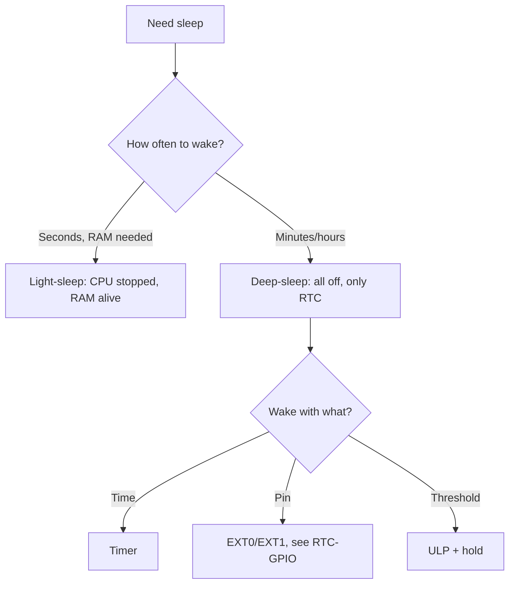

# Sleep and ULP

![[assets/img/placeholder.png]]

Three modes: **Modem-sleep** (WiFi off, CPU alive), **Light-sleep** (CPU paused, RAM alive), **Deep-sleep** (all off, only RTC, ~10 uA).

> [!info] For battery - deep-sleep only
> Light/Modem are milliamps. A year on Li-ion means deep-sleep + wakeup on timer/EXT/RTC only.

## Purpose

Sleep and ULP - Currents and wakeup; Connection table - battery node; Code - deep-sleep 10 s. Three modes: Modem-sleep (WiFi off, CPU alive), Light-sleep (CPU paused, RAM alive), Deep-sleep (all off, only RTC, ~10 uA). Own current of AMS1117 is ~5 mA. For deep-sleep take HT7333 / XC6206 / TPS737 with microamp Iq.

## Currents and wakeup

| Mode | Current | RAM | Wakeup |
| --- | --- | --- | --- |
| Active + WiFi | 100-240 mA | + | - |
| Modem-sleep | 10-30 mA | + | WiFi DTIM |
| Light-sleep | 0.8-2 mA | + | GPIO, UART, timer, touch |
| Deep-sleep | ~10 uA (+150 uA ULP) | - (only RTC mem 8KB) | EXT0/EXT1, timer, touch, ULP |

| Wakeup | Pins | Note |
| --- | --- | --- |
| EXT0 | 1x [[EN/03-GPIO/05-RTC-GPIO.en]] | HIGH/LOW level |
| EXT1 | RTC GPIO mask | ANY_HIGH / ALL_LOW |
| Timer | - | `esp_sleep_enable_timer_wakeup(us)` |
| Touch | T0-T9 | threshold |
| ULP | RTC + [[06-Analog/01-ADC.en | ADC]]/I2C | ULP assembler program |

## Connection table - battery node

| ESP32 | Component | Note |
| --- | --- | --- |
| GPIO32 | button to GND | EXT0 wakeup LOW |
| GPIO33 | LED/relay through transistor | [[03-GPIO/05-RTC-GPIO.en | hold]] in sleep |
| GPIO36 | battery through divider | measure before sleep |
| 3V3 | Li-ion 18650 + LDO HT7333 | LDO with Iq <5 uA! AMS1117 does not fit |

> [!warning] AMS1117 kills the battery
> Own current of AMS1117 is ~5 mA. For deep-sleep take HT7333 / XC6206 / TPS737 with microamp Iq.

## Code - deep-sleep 10 s

**Arduino:**

```cpp
#define BTN 32
void setup() {
  Serial.begin(115200);
  Serial.printf("wakeup: %d\n", esp_sleep_get_wakeup_cause());
  esp_sleep_enable_timer_wakeup(10 * 1000000ULL);
  esp_sleep_enable_ext0_wakeup((gpio_num_t)BTN, 0);
  Serial.println("sleep...");
  Serial.flush();
  esp_deep_sleep_start();
}
void loop() {}
```

**ESP-IDF:**

```c
#include "esp_sleep.h"
#include "driver/rtc_io.h"
void app_main(void) {
    esp_sleep_enable_timer_wakeup(10 * 1000000ULL);
    esp_sleep_enable_ext0_wakeup(32, 0);
    rtc_gpio_hold_en(33);
    esp_deep_sleep_start();
}
```

**MicroPython:**

```python
from machine import Pin, deepsleep
import esp32
print("wake:", esp32.wake_reason())
esp32.wake_on_ext0(pin=Pin(32), level=esp32.WAKEUP_ALL_LOW)
deepsleep(10000)
```

## Touch-wakeup thresholds

| Parameter | Value / advice |
| --- | --- |
| Threshold range | 0 to (depends on `touch_pad_set_voltage`), typically threshold = 1/2-2/3 of baseline |
| Calibration | measure baseline 10 times at start (dry board), threshold = baseline x 0.7 |
| Drift | moisture/temperature shift baseline by 10-30% - recalibrate every wakeup |
| Filter | median of 3-5 measurements, ignore single spikes |
| Board | touch traces short, no ground-pour under the electrode |

```cpp
#include "driver/touch_pad.h"
void touch_wake_init(void) {
  touch_pad_init();
  touch_pad_set_fsm_mode(TOUCH_FSM_MODE_TIMER);
  touch_pad_set_voltage(TOUCH_HVOLT_2V7, TOUCH_LVOLT_0V5, TOUCH_HVOLT_ATTEN_1V);
  touch_pad_config(TOUCH_PAD_NUM9, 0);
  uint16_t base = 0;
  for (int i = 0; i < 10; i++) { uint16_t v; touch_pad_read(TOUCH_PAD_NUM9, &v); base += v; delay(20); }
  base /= 10;
  touch_pad_set_thresh(TOUCH_PAD_NUM9, base * 0.7);
  esp_sleep_enable_touchpad_wakeup();
}
```

> [!tip] Touch through the case
> A 10x10 mm foil electrode under 2 mm plastic works; under metal - no. Between the electrode and MCU - a series 1k R against ESD.

## Timer-wakeup drift

| RTC clock source | Precision | Drift per day | When |
| --- | --- | --- | --- |
| Internal RC (~150 kHz) | ±5-10% | hours | default, no crystal |
| External 32.768 kHz | ±20 ppm | ~2 s | precise logger, scheduled watering |

```text
RC-генератор:  10 хв сну → реально 9–11 хв (не для годинника!)
32к-кварц:     10 хв сну → 10 хв ± 0.01 с
```

Practice: a "once per 10 min" logger on RC is acceptable (timestamp via NTP after wakeup, see [[15-Protocols/03-mDNS-NTP-TLS.en | NTP]]). Watering "at 07:00" needs only a 32.768 kHz crystal or [[10-Sensors/14-DS3231-Encoder-Keypad-Joystick.en | DS3231]] as an external alarm.

```cpp
// Самокалібрування періоду:
RTC_DATA_ATTR uint64_t real_us = 600 * 1000000ULL;
void sleep_calibrated(uint64_t want_us) {
  int64_t t0 = esp_timer_get_time();
  esp_sleep_enable_timer_wakeup(real_us);
  esp_light_sleep_start();
  int64_t fact = esp_timer_get_time() - t0;
  real_us = real_us * want_us / (uint64_t)fact;
}
```

## ULP-RISC-V example (S2/S3!)

On S2/S3 ULP is a full **RISC-V coprocessor** (not Classic FSM assembler): written in C, has access to RTC memory, ADC, I2C-bit:

| ULP generation | Chips | Language | Memory | Features |
| --- | --- | --- | --- | --- |
| ULP FSM | Classic | ULP assembler | 8 KB RTC slow | I/O + ADC primitives |
| ULP RISC-V | S2, S3 | C (RV32IMC) | 8 KB RTC slow | loops, arrays, `ulp_riscv_adc_read` |
| LP-core | C6 (LP-Core 32-bit) | C | LP SRAM | faster, I2C/SPI-LP drivers |

Example: ULP-RISC-V on S3 measures ADC every 100 ms in deep-sleep, wakes on threshold:

```c
// ulp/main.c — код ULP (компонується окремо через ulp-ldf):
#include "ulp_riscv.h"
#include "ulp_riscv_adc.h"
#define THRESH 2000
int main(void) {
    ulp_riscv_adc_cfg_t cfg = {
        .channel = ADC_CHANNEL_0, .width = ADC_BITWIDTH_12,
    };
    ulp_riscv_adc_init(&cfg);
    for (;;) {
        int v = ulp_riscv_adc_read(&cfg);
        if (v > THRESH) {
            ulp_riscv_wakeup_main_cpu();  // будимо!
            break;
        }
        ulp_riscv_delay_cycles(100 * 8000);  // ~100 мс на 8 МГц ULP
    }
    return 0;
}
```

```c
// app_main.c — головний CPU:
#include "ulp_riscv.h"
extern const uint8_t ulp_main_bin_start[] asm("_binary_ulp_main_bin_start");
void app_main(void) {
    esp_sleep_wakeup_cause_t cause = esp_sleep_get_wakeup_cause();
    if (cause == ESP_SLEEP_WAKEUP_ULP)
        printf("ULP розбудило: поріг перевищено!\n");
    ulp_riscv_load_binary(ulp_main_bin_start, ...);
    ulp_riscv_run();
    esp_sleep_enable_ulp_wakeup();
    esp_deep_sleep_start();
}
```

> [!warning] ULP memory
> 8 KB RTC slow is both code and data. Large arrays/printf inside ULP mean overflow. Exchange variables with CPU only as `RTC_SLOW_ATTR`. See [[06-Analog/01-ADC.en | ADC]].

## LP-core C6

| LP-core C6 parameter | Value |
| --- | --- |
| Architecture | 32-bit RISC-V, up to ~20 MHz |
| Deep-sleep power | ~150-300 uA with RTC |
| LP peripherals | LP-I2C, LP-UART, LP-SPI, ADC, touch |
| Wakeup sources | LP-timer, GPIO, ADC threshold with no HP-CPU |

When to take LP-core instead of periodic HP wakeup:

| Pattern | Average current | Conclusion |
| --- | --- | --- |
| HP wakes once per 10 s for 0.5 s WiFi-off | ~0.6 mA | simpler, no LP |
| LP-core samples sensor at 1 Hz, HP sleeps for hours | ~0.2 mA | LP wins |
| LP-core + threshold to HP only on event | ~0.15 mA | max autonomy |

Minimal LP-blink (C6, IDF `esp_lp_core`):

```c
// lp_core/main.c:
#include "ulp_lp_core_lp_adc.h"
int main(void) {
    // ... семплінг датчика, запис у LP_SHARED_MEM ...
    if (sensor_over_thresh())
        ulp_lp_core_wakeup_main_cpu();
    return 0;
}
```

## Measuring 10 uA by method

| Step | Action | Why |
| --- | --- | --- |
| 1 | Remove/disable AMS1117, power through HT7333/XC6206 (Iq <5 uA) | otherwise you measure the regulator, not ESP32 |
| 2 | Disable USB-UART (CP2102 eats ~mA even in idle) | power 3.3V directly into 3V3/GND pins |
| 3 | 10 Ohm shunt in the 3V3 break + oscilloscope | 10 uA x 10 Ohm = 100 uV - visible; 240 mA peaks visible too |
| 4 | Or Nordic PPK2 / Joulescope / uCurrent | gold standard, ready current graphs |
| 5 | Profile: sleep to WiFi peak to sleep | compute average: `Iavg = (IsleepxTsleep + ItxxTtx) / T` |

Battery calculation example:

```text
Цикл: сон 600 с × 12 мкА + WiFi 3 с × 120 мА
Заряд: 12мкА×600с + 120мА×3с = 7.2 + 360 = 367 мА·с
Середній: 367/603 ≈ 0.61 мА
18650 3000 мА·г / 0.61 мА ≈ 4900 год ≈ 200 діб
Висновок: домінує WiFi-сесія — скорочуй її, а не вичавлюй 8 замість 12 мкА сну.
```

Checklist "why not 10 uA but 2 mA":

| Leak | How much it eats | Fix |
| --- | --- | --- |
| GPIO not in hold, LED glowing | 1-5 mA | `rtc_gpio_hold_en()`, LED through transistor |
| Battery divider always connected | 0.1-1 mA | divider through MOSFET, enable at measure moment |
| Floating inputs | 0.1-0.5 mA | unused GPIO to pull-up/down or output LOW |
| USB-UART not off | 0.5-15 mA | UART power jumper on the board |
| AMS1117 LDO | ~5 mA own | replace with HT7333/XC6206 |

## ULP-FSM assembler - Classic example (S0/S2!)

On Classic ULP is a 4-bit FSM with its own assembler (not C!). Registers: R0-R3 (16 bit), timer, ADC, I2C-bit, GPIO.

| Instruction | What it does | Example |
| --- | --- | --- |
| `MOVE Rd, imm/val` | write | `MOVE R0, 2000` |
| `ADD/SUB/AND/OR/LSH/RSH` | ALU | `ADD R0, R1, R2` |
| `LD/ST` | RTC memory | `ST R0, R3, 0` (offset!) |
| `ADC R0, SAR_SEL, MUX` | ADC measure | `ADC R0, 0, 1` |
| `TSENS R0, wait` | chip temperature | `TSENS R0, 100` |
| `I2C_RD/I2C_WR` | bit-bang I2C | sensor polling in sleep! |
| `JUMPR/JUMPS stage, thresh, cond` | conditional jump between stages | FSM heart |
| `STAGE_RST / STAGE_INC` | stage S0-S7 control | hysteresis with no CPU! |
| `WAKE` | wake the HP-CPU | `WAKE` + `HALT` |
| `HALT` | sleep to next run | program end |

Stages S0-S7 are a hardware hysteresis counter: `JUMPS` increments/resets the stage on condition. Classic: wake only if the threshold is exceeded 3 times in a row (spike filter with not a single line of C!).

Full example: ADC monitoring with S0/S2 hysteresis + wakeup (from the IDF ULP example, adapted):

```asm
    /* ULP-FSM: прокидаємось періодично, міряємо ADC, рахуємо перевищення */
    .global entry
entry:
    MOVE R3, 0                 /* R3 = адреса змінної лічильника в RTC slow */
    LD R0, R3, 0               /* R0 = лічильник перевищень (з пам'яті) */
    ADC R1, 0, 1               /* R1 = ADC канал (SAR 0, mux 1 = GPIO36) */
    MOVE R2, 2000              /* поріг */
    SUB R2, R1, R2             /* R2 = value - thresh (знак!) */
    JUMPS wake_up, 1, LT       /* якщо value < thresh → стадія S1, скинути лічильник */
    /* value >= thresh: інкремент стадії */
    STAGE_INC 1
    JUMPS over3, 2, GE         /* стадія >= S2 (третє перевищення поспіль!) → будити */
    HALT                       /* ще не 3 рази — спати */

over3:
    ST R0, R3, 0               /* зберегти стан (опц.) */
    WAKE                       /* будимо HP-CPU! причина ESP_SLEEP_WAKEUP_ULP */
    STAGE_RST                  /* скинути стадії */
    HALT

wake_up:
    STAGE_RST                  /* сплеск закінчився — скинути */
    MOVE R0, 0
    ST R0, R3, 0
    HALT
```

Launch from the HP-CPU side (IDF):

```c
#include "esp_sleep.h"
#include "driver/rtc_io.h"
#include "ulp.h"  // Classic ULP driver
extern const uint8_t ulp_bin_start[] asm("_binary_ulp_main_bin_start");
void app_main(void) {
  ulp_load_binary(0, ulp_bin_start, (ulp_bin_end - ulp_bin_start) / sizeof(uint32_t));
  ulp_set_wakeup_period(0, 100000);  // кожні 100 мс
  ESP_ERROR_CHECK(ulp_run((&ulp_entry - RTC_SLOW_MEM) / sizeof(uint32_t)));
  ESP_ERROR_CHECK(esp_sleep_enable_ulp_wakeup());
  esp_deep_sleep_start();
}
```

> [!warning] FSM limits: 8 KB slow memory, no multiply/divide, no float
> Complex math (Kalman filter, FFT) goes only on HP-CPU after wakeup or on ULP-RISC-V (S2/S3) / LP-core (C6). FSM is for thresholds, counters, I2C polling.

## RTC-memory map - what lives where

| Region | Classic size | HP access | ULP access | Survives deep-sleep | Purpose |
| --- | --- | --- | --- | --- | --- |
| RTC FAST | 8 KB | yes | no | yes (if not off) | deep-sleep stub, fast wakeup variables |
| RTC SLOW | 8 KB | yes | **yes (ULP code+data!)** | yes | ULP program + exchange variables |
| RTC registers / STORE0-7 | 8x32 bit | yes | no | yes | wakeup cause, magic numbers |
| DRAM (HP) | ~320 KB | yes | no | **no** - fades! | plain variables (lost in deep-sleep) |

SLOW-memory layout with ULP-FSM (layout example):

```text
0x5000_0000  +------------------+
             | ULP код (entry)  |  <- ulp_load_binary(0, ...)
             +------------------+
             | лічильник (R3=0) |  <- ST/LD R3,0
             +------------------+
             | поріг / калібр.  |  <- константи, що HP оновлює перед сном
             +------------------+
             | кільце семплів   |  <- ULP пише, HP читає після wakeup
0x5000_1FFF  +------------------+  (8 КБ межа!)
```

HP to ULP exchange only through `RTC_SLOW_ATTR` / `RTC_DATA_ATTR`:

```c
RTC_SLOW_ATTR uint16_t ulp_samples[64];  // ULP пише (ST), HP читає після WAKE
RTC_SLOW_ATTR uint16_t ulp_thresh = 2000;  // HP пише перед сном, ULP читає (LD)
```

> [!danger] Address mismatch = silent ULP death
> ULP addresses are word offsets from SLOW start (`ulp_load_binary(0,...)`), and HP addresses are byte pointers. One word off = ULP writes into its own code. Check the ULP binary `.map` after every change!

## Wakeup-stub - code in the first milliseconds after deep-sleep

A stub (`esp_wake_deep_sleep`) runs in RTC FAST before the bootloader loads: it decides whether to load the whole firmware (expensive, ~100 ms + 30 mA) or quickly handle and sleep on (cheap, ~1 ms).

| Approach | Active time | Current | When |
| --- | --- | --- | --- |
| Plain wakeup to `setup()` | ~100-500 ms (bootloader + WiFi) | 30-150 mA | rare wakeups (once per 10 min) |
| Stub: check to back to sleep | ~0.5-2 ms | ~15 mA | frequent events (button bounce, ULP samples) |
| Stub + fast ADC to decision | ~2-5 ms | ~15-30 mA | threshold detector with no full boot |

```c
// RTC_IRAM_ATTR — обов'язково! Тільки RTC-функції всередині!
#include "esp_sleep.h"
#include "driver/rtc_io.h"
RTC_IRAM_ATTR void esp_wake_deep_sleep(void) {
  // Приклад: порахувати пробудження, 9 з 10 разів — одразу спати
  static RTC_NOINIT_ATTR uint32_t cnt;
  if (++cnt < 10) {
    // швидкий сон без download firmwares:
    esp_deep_sleep_enable_timer_wakeup(1000000ULL);
    esp_deep_sleep_start();  // повернення сюди неможливе — це нормально
  }
  // 10-те пробудження: вийти зі stub → звичайний boot → setup()
  esp_default_wake_deep_sleep();
}
```

> [!warning] Forbidden in stub: flash reads, UART-print, WiFi, malloc, float
> A violation = exception at a stage with no panic-handler yet. Rule: stub is 20 lines max, only RTC_IO/timer/counter.

## Light-sleep with WiFi - DTIM and modem-sleep in detail

| WiFi saving mode | Average current | Connection alive? | RX delay |
| --- | --- | --- | --- |
| Active (no sleep) | 100-160 mA | yes | 0 |
| Modem-sleep (auto) | 15-30 mA | yes (DTIM sync) | up to DTIM period |
| Modem + Light-sleep auto (`esp_pm`) | 2-10 mA | yes | DTIM + CPU wakeup time |
| Light-sleep manual (WiFi off) | 0.8-2 mA | **no** | reconnect seconds |
| Deep-sleep | 10 uA | no | full boot + connect |

DTIM calculation (key to battery with live WiFi!):

```text
AP beacon: кожні 102.4 мс (100 TU). DTIM-період тип. 1–3 → delivery кожні 100–300 мс.
Станція прокидається тільки на DTIM-beacon, звіряє TIM-біт, забирає буферизовані пакети.
Iavg ≈ (Isleep×Tdtim + Irx×Trx) / Tdtim.
Приклад: DTIM=3 (307 мс), сон 1.5 мА, RX 60 мА × 3 мс:
Iavg = (1.5×304 + 60×3)/307 ≈ (456+180)/307 ≈ 2.07 мА.
Збільш DTIM на роутері до 5–10 → Iavg падає до ~1.6 мА ціною затримки ping до 1 с.
```

Modem + auto-light-sleep code (connection alive, minimal current):

```c
#include "esp_wifi.h"
#include "esp_pm.h"
// 1. Power management: auto-light-sleep при простої
esp_pm_config_t pm = {.max_freq_mhz = 80, .min_freq_mhz = 10, .light_sleep_enable = true};
esp_pm_configure(&pm);
// 2. WiFi modem-sleep:
esp_wifi_set_ps(WIFI_PS_MIN_MODEM);  // DTIM-синхронізація (економний)
// Альтернатива: WIFI_PS_MAX_MODEM — агресивніший сон, більша затримка.
// 3. DTIM налаштовується НА РОУТЕРІ (beacon interval / DTIM period), не на ESP32!
```

> [!warning] DFS/APB vs UART in light-sleep
> With auto-light-sleep the APB frequency jumps, so UART baud drifts. For console/GPS with live WiFi sleep: `UART_SCLK_REF_TICK` or `esp_pm_lock` during critical exchange. See [[04-Interfaces/01-UART.en | UART]].

## Measuring 10 uA with oscilloscope + year-battery math

Measurement circuit (no pricey PPK2 - a plain oscilloscope!):

```text
Лабораторник 3.3В --[шунт 10 Ом]--+--> 3V3 ESP32 (голий module, UART відключений!)
                                  |
Осцилограф CH1 -- диференціально --+  (або два канали A-B math)
                                  |
GND ------------------------------+--> GND ESP32

10 мкА × 10 Ом = 100 мкВ (межа чутливості — бери 100 Ом шунт для фази сну:
100 мкА... ні: 10 мкА × 100 Ом = 1 мВ — вже видно! Але падіння 240мА×100Ом=24В?! —
тому ДВА шунти: 100 Ом (сон, з перемичкою-байпасом для піків) АБО active-пробник струму.
Практика: шунт 10 Ом + підсилення ×100 (INA219/INA226 module) + осцилограф.
```

Procedure:

1. Flash `deep_sleep_start` with no WiFi, no UART pull-ups, GPIO in hold.
2. Scope CH: sleep - flat line ~100 uV (10 uA), periodically a 240 mA x 0.3 s peak (if WiFi session).
3. Cursor measurement: `Isleep` (base), `Itx` (peak), `Ttx` (width), `T` (period).
4. Average formula: `Iavg = (Isleepx(T-Ttx) + ItxxTtx) / T`.

Year-battery calculation (full example):

```text
Дано: 18650 3400 мА·г, саморозряд 3%/рік, LDO HT7333 Iq=4 мкА, Isleep=14 мкА (10 ESP+4 LDO),
цикл: кожні 600 с — пробудження + WiFi 2.5 с × 110 мА середнє + датчик 0.2 с × 20 мА.
Заряд за цикл: 14мкА×600с + 110мА×2.5с + 20мА×0.2с = 8.4 + 275 + 4 = 287 мА·с.
Iavg = 287/600 ≈ 0.479 мА.
Корисна ємність: 3400 × 0.97 (саморозряд) × 0.85 (ККД LDO+мороз+старіння) ≈ 2800 мА·г.
Час: 2800 / 0.479 ≈ 5845 год ≈ 243 доби ≈ 8 місяців.
Щоб дотягнути до РОКУ: цикл 1200 с (раз на 20 хв) → Iavg ≈ 0.25 мА → 2800/0.25 = 11200 год ≈ 466 діб. ✓
АБО: 2×18650 паралельно (6800) при циклі 600 с → 5600/0.479 ≈ 16 місяців. ✓
```

Table "what eats the year" (parameter sensitivity):

| Parameter change | Iavg | Life on 3400 mA-h | Conclusion |
| --- | --- | --- | --- |
| Base: 600 s cycle, WiFi 2.5 s | 0.48 mA | 8 mo. | starting point |
| WiFi session 1.0 s (static IP + fast server!) | 0.21 mA | ~18 mo. | **cheapest win** |
| 1200 s cycle | 0.25 mA | ~15 mo. | twice rarer - twice longer |
| AMS1117 instead of HT7333 (+5 mA!) | 5.5 mA | ~25 days | LDO decides everything |
| USB-UART not off (+2 mA) | 2.5 mA | ~1.5 mo. | UART power jumper! |
| Battery divider always on (+0.3 mA) | 0.78 mA | ~5 mo. | divider through MOSFET |
| BLE advertising instead of WiFi (0.3 s x 15 mA) | 0.03 mA | ~10 years (limit - self-discharge!) | for beacons - BLE only, see [[05-Radio/02-BLE-Bluetooth.en | BLE]] |

> [!tip] Static IP saves SECONDS
> DHCP-handshake is 1-3 s of active radio (~100 mA). Static IP + `esp_wifi_set_ps` + fast closing `esp_deep_sleep_start` right after server ACK is the main autonomy lever. See [[05-Radio/01-WiFi-STA-AP.en | WiFi]] and [[02-Power-Supply/04-Batteries-TP4056.en | Batteries]].

## Official Espressif sources

- ESP-IDF Programming Guide - Sleep Modes (esp_sleep_enable_X_wakeup, power domains, flash DPD vs power-down, console-UART handling, GPIO hold).
- ESP-IDF Programming Guide - ULP Coprocessor FSM (Classic assembler: STAGE_INC/JUMPS/WAKE/HALT) and ULP-RISC-V (S2/S3, C firmware).
- ESP-IDF Programming Guide - Power Management (esp_pm_configure, light_sleep_enable, DFS), WiFi Power Save (MIN/MAX_MODEM, DTIM).
- ESP32 Technical Reference Manual - RTC Controller / ULP / RTC Memory Map / SAR ADC in sleep.
- ESP-IDF examples: system/deep_sleep, system/light_sleep, ulp/adc, wifi/power_save.
- ESP Hardware Design Guidelines - LDO Iq requirements, 32 kHz crystal layout, deep-sleep current measurement.

### Mermaid: sleep mode choice



## Common issues

| # | Issue | Why it is bad | How to do it right |
| --- | --- | --- | --- |
| 1 | WiFi not off before sleep | +50 mA "in sleep" | WiFi.stop() before sleep |
| 2 | Variables lost | Deep-sleep clears RAM | RTC_DATA_ATTR / NVS |
| 3 | Peripherals alive | mA instead of uA | Disable all + hold |
| 4 | Wake cause not read | Unknown why it woke | esp_sleep_get_wakeup_cause() |
| 5 | ULP with no measure | 100+ uA surprise | Current budget in advance |

- TPS737 Datasheet (TI): <https://www.ti.com/product/TPS737> - LDO with microamp Iq.
- PPK2 Power Profiler Kit II (Nordic): <https://www.nordicsemi.com/Products/Development-hardware/Power-Profiler-Kit-2> - sleep current measurement.

## See also

- [[EN/Home.en]]
- [[EN/01-Hardware/01-ESP32-Classic.en]]
- [[EN/03-GPIO/05-RTC-GPIO.en]]
- [[06-Analog/01-ADC.en | ADC]]
- [[07-Timers/02-WDT.en | WDT]]
- [[05-Radio/03-ESP-NOW.en | ESP-NOW]]
- [[02-Power-Supply/01-Power-Rails.en | Power supply]]
