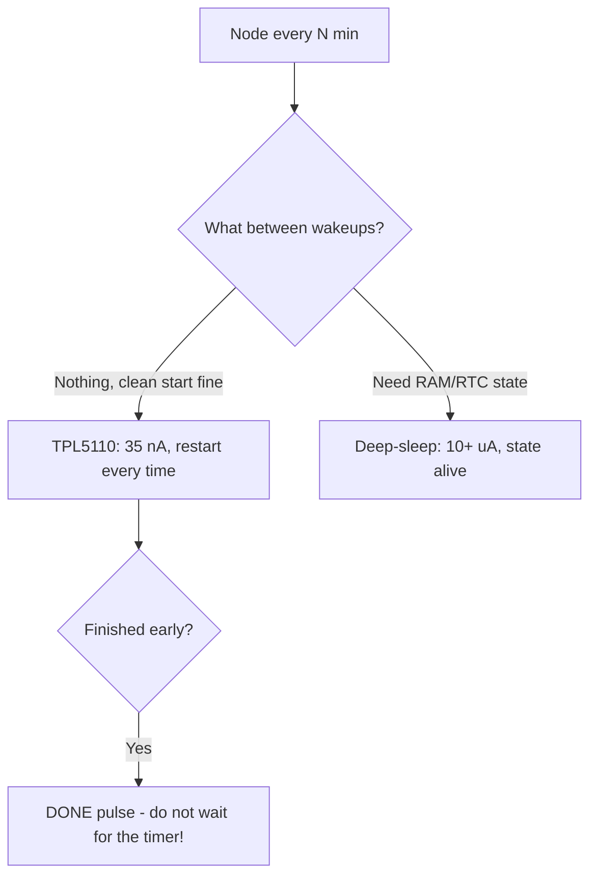

# TPL5110/TPL5111: nanotimer - 35 nA instead of sleep

## Purpose

ESP32 deep-sleep is 10-150 uA. TPL5110 is 35 nA: a timer switch that PHYSICALLY cuts ESP32 power and turns it on on schedule. For a "woke once an hour" node - years on 18650 instead of months. Price: a full restart every time (RAM clean!).

Base: start - [[EN/Home.en]], sleep - [[07-Timers/03-Sleep-ULP.en | Sleep]], consumption - [[02-Power-Supply/03-Power-Consumption.en | Consumption]], batteries - [[EN/02-Power-Supply/04-Batteries-TP4056.en]].

![[assets/img/tpl5110-nanotimer-power-scheme.png|600]]
*Fig. TPL5110 breaks ESP32 power with a MOSFET switch; DONE turns off early; interval by resistor.*

## Characteristics

| Parameter | TPL5110 | TPL5111 |
| --- | --- | --- |
| Own current | 35 nA | 35 nA |
| Interval | By resistor (100s to 2 h) | + manual start button |
| Switch | External MOSFET (any current!) | Same |
| DONE | Present (early turn-off) | Present |
| Price | $1-2 (module board) | $1-2 |

```text
Схема (класика):
  LiPo+ ──► [MOSFET P-канальний] ──► VIN ESP32-плати
  TPL5110: DRV ─► затвор MOSFET; DONE ◄── GPIO25 ESP32; DELAY/M ──► резистор на GND
  Робота: таймер спрацював → MOSFET відкрився → ESP32 бутиться → робить справу →
          GPIO25 імпульс DONE → MOSFET закрився → 35 нА до наступного разу.
  Інтервал резистором: R ≈ T / (0.1с/кОм)-шкала з даташиту (перевірити таблицею!).
```

### Mermaid: TPL or deep-sleep



## Code (Arduino - DONE pulse)

```cpp
// ESP32 під TPL5110: зробити справу → DONE → спати до таймера
#define DONE_PIN 25
void setup() {
  pinMode(DONE_PIN, OUTPUT);
  readSensorAndPublish();   // вся робота тут (RAM щоразу чиста!)
  digitalWrite(DONE_PIN, HIGH); delay(50);  // DONE! TPL відрубує живлення
  digitalWrite(DONE_PIN, LOW);
  esp_deep_sleep_start();   // страховка, якщо DONE не дійшов
}
void loop() {}
```

## Common issues

| # | Issue | Why it is bad | How to do it right |
| --- | --- | --- | --- |
| 1 | Expecting RTC memory | Power is cut - RAM clean! | State in NVS/flash |
| 2 | DONE never sent | Waits the whole interval for nothing | DONE right after work |
| 3 | MOSFET with no margin | Heats up/sags on WiFi peaks | P-channel with Rds x2 margin |
| 4 | Interval resistor "by eye" | Period drifts twofold | Datasheet table + measurement |
| 5 | TPL + OTA | Overwrite mid-flash | OTA only with no TPL (jumper!) |
| 6 | Button with no debounce (5111) | Double start | RC at the input |

## Official sources

- [TPL5110/TPL5111 datasheet (TI)](https://www.ti.com/product/TPL5110) - intervals, DONE, diagrams.
- [Adafruit TPL5110 Breakout guide](https://learn.adafruit.com/adafruit-tpl5110-low-power-timer-breakout) - practice, resistors.

## Interval table (DELAY/M - GND resistor)

| Interval | R (landmark) | Comment |
| --- | --- | --- |
| 100 s | ~15 kOhm | Practice minimum |
| 10 min | ~90 kOhm | Weather sensors |
| 30 min | ~270 kOhm | Parked tracker |
| 1 h | ~530 kOhm | IoT classic |
| 2 h | ~1 MOhm | Scale maximum |

> Exact values come from the datasheet graph (spread ±20%!). Calibrate the measured period by trimming; temperature drifts.

## MOSFET switch choice

| Parameter | Requirement | Example |
| --- | --- | --- |
| Type | P-channel, logic level | AO3401, SI2301 |
| Rds(on) | < 50 mOhm (drop < 0.1V at 2A!) | AO3401: 28 mOhm |
| Vgs(th) | < -1.5V (opens from TPL!) | Check the curve, not just the number |
| Current | With x2 margin over WiFi peak (4A+) | 2A peak to 4A+ switch |

```text
TPL5111 + кнопка (ручний launch між таймерами):
  Кнопка ──► DELAY/M через RC (антибрязк 100нФ!) → примусовий цикл зараз.
  Використання: «показати дані зараз» без чекання години.
```

### ESP-IDF fragment (DONE + deep-sleep insurance)

```c
// DONE на GPIO25, далі — спати щоб там не було
gpio_set_direction(GPIO_NUM_25, GPIO_MODE_OUTPUT);
gpio_set_level(GPIO_NUM_25, 1);
esp_rom_delay_us(50000);
gpio_set_level(GPIO_NUM_25, 0);
esp_deep_sleep_start();  // якщо TPL не відрубав (наприклад, на столі без нього)
```

## TPL5111: manual button + status LED

```text
Відмінність 5111: вхід MANUAL — кнопка примусового циклу + вихід для LED
(блимає під час активного вікна — видно, що вузол живий!).
Схема кнопки: кнопка ──[10к pull-down]──► MANUAL; паралельно 100нФ (антибрязк!).
Застосування: лічильник відвідувачів («натисни і йди»), ручний опит датчика,
перезапуск завислого циклу без розбору корпусу.
```

## NVS cycle counter (state with no RAM!)

```cpp
// ESP32 під TPL: рахувати пробудження через NVS (RTC-пам'ять теж чиста!)
#include <Preferences.h>
Preferences p;
void setup() {
  p.begin("tpl", false);
  uint32_t n = p.getUInt("n", 0) + 1;
  p.putUInt("n", n);
  // кожне 10-те пробудження — повна передача, решта — тільки вимір
  if (n % 10 == 0) fullReport(); else quickMeasure();
  pinMode(25, OUTPUT); digitalWrite(25, HIGH); delay(50);
  digitalWrite(25, LOW);  // DONE
}
void loop() {}
```

## See also

- [[Home.en | Home]]
- [[07-Timers/03-Sleep-ULP.en | Sleep/ULP]]
- [[07-Timers/02-WDT.en | WDT]]
- [[02-Power-Supply/03-Power-Consumption.en | Consumption]]
- [[02-Power-Supply/04-Batteries-TP4056.en | Batteries]]
- [[08-Memory/01-Partitions-NVS.en | NVS (state with no RAM)]]
