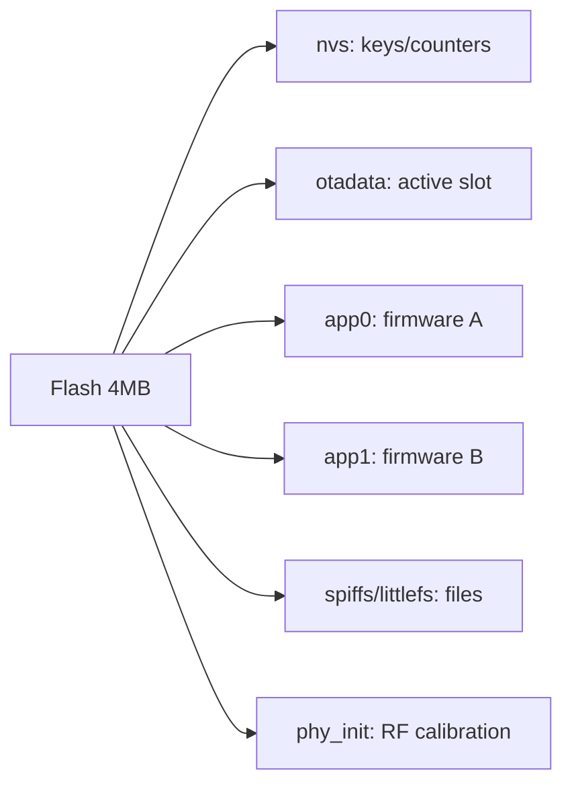

# Partitions and NVS on ESP32

The partition table defines the ESP32 [[Home.en | flash memory]] layout: where NVS, OTA data, `app0/app1` firmware and filesystems live. Without understanding partitions you cannot configure [[01-Hardware/06-Flash-PSRAM.en | flash size]], OTA or LittleFS.

> [!important]
> The partition table is flashed at address `0x8000` separately from the firmware. Changing the CSV requires a full `erase + flash`.

![[assets/img/partitions-nvs-layout-scheme.png|600]]
*Fig. 4 MB layout: factory/ota_0/ota_1/nvs/otadata/spiffs; NVS - key-value storage with wear leveling.*

## Purpose

Partitions and NVS on ESP32 - default 4 MB layout, custom partition CSV, NVS key-value storage. The partition table is flashed at address 0x8000 separately from the firmware. Changing the CSV requires a full erase + flash. Total: 0x9000 + 20K + 8K + 2x1280K + 1408K + 64K = 4096K. Verified with esptool.py + gen_esp32part.py.

## 1. Default 4 MB layout

The standard `default_4MB` scheme (Arduino / IDF `default.csv`):

| Name | Type / SubType | Offset | Size | Purpose |
| --- | --- | --- | --- | --- |
| `nvs` | data / nvs | `0x9000` | 20 KB | Key-value storage [[08-Memory/01-Partitions-NVS.en | NVS]] |
| `otadata` | data / ota | `0xe000` | 8 KB | Active OTA slot selection |
| `app0` | app / ota_0 | `0x10000` | 1280 KB | Firmware slot 0 |
| `app1` | app / ota_1 | `0x150000` | 1280 KB | Firmware slot 1 |
| `spiffs` | data / spiffs | `0x290000` | 1408 KB | Filesystem |
| `coredump` | data / coredump | `0x3F0000` | 64 KB | Crash dumps (IDF) |

> [!note]
> Total: `0x9000 + 20K + 8K + 2x1280K + 1408K + 64K = 4096K`. Verified with `esptool.py` + `gen_esp32part.py`.

Other popular schemes for 4 MB:

| Scheme | app0/app1 | SPIFFS/LittleFS | When to use |
| --- | --- | --- | --- |
| `default` | 1280 KB x 2 | ~1.4 MB | Universal, [[08-Memory/03-OTA.en | OTA]] works |
| `minimal` | 1920 KB x 1 (no OTA) | - | Tight firmware without OTA |
| `no_ota` | 1 x ~2.5 MB | ~1.3 MB | Large firmware, no OTA needed |
| `huge_app` | 1 x 3 MB | - | IDF projects with ML/TFLite |
| `custom` | arbitrary | arbitrary | See below |

## 2. Custom partition CSV

The `partitions_custom.csv` file is plain CSV:

```csv
# Name,   Type, SubType, Offset,  Size, Flags
nvs,      data, nvs,     0x9000,  0x6000,
otadata,  data, ota,     0xf000,  0x2000,
app0,     app,  ota_0,   0x10000, 0x1E0000,
app1,     app,  ota_1,   0x1F0000,0x1E0000,
littlefs, data, spiffs,  0x3D0000,0x30000,
coredump, data, coredump,0x400000,0x10000,
```

> [!tip]
> The `app0/app1` addresses must be aligned to `0x10000` (64 KB). NVS size must be a multiple of 4 KB (4096-byte sector).

Attaching a custom scheme:

| Framework | How to attach |
| --- | --- |
| ESP-IDF | `idf.py menuconfig` → Partition Table → Custom → specify the CSV |
| Arduino IDE | Tools → Partition Scheme → selection or `boards.txt` |
| PlatformIO | `board_build.partitions = partitions_custom.csv` in `platformio.ini` |

Verifying the table:

```bash
gen_esp32part.py partitions_custom.csv --verify
gen_esp32part.py partitions_custom.csv partitions_custom.bin
esptool.py --chip esp32 -p /dev/ttyUSB0 write_flash 0x8000 partitions_custom.bin
```

## 3. NVS - key-value storage

NVS (Non-Volatile Storage) stores key-value pairs in [[Home.en | flash]] with wear leveling and power-loss protection. Limits: key up to 15 characters, namespace up to 15 characters, values: `u8/i32/u64/str/blob`.

| Parameter | Value |
| --- | --- |
| Sector | 4096 bytes, minimum 3 sectors (12 KB) |
| Wear | wear leveling, about 100,000 flash cycles |
| Encryption | optional via [[08-Memory/04-Secure-Boot-Encrypt.en | Flash Encryption]] |
| Multithreading | thread-safe in IDF, in Arduino - through `Preferences` |

> [!warning]
> NVS is **not** for writes every second (counters, logs). For that - RAM + periodic `commit()`, or a [[08-Memory/02-Filesystem.en | filesystem]].

### 3.1 ESP-IDF (C, nvs API)

```c
#include "nvs_flash.h"
#include "nvs.h"

void app_main(void) {
    esp_err_t err = nvs_flash_init();
    if (err == ESP_ERR_NVS_NO_FREE_PAGES || err == ESP_ERR_NVS_NEW_VERSION_FOUND) {
        nvs_flash_erase();          // перший launch після зміни partitions
        nvs_flash_init();
    }
    nvs_handle_t h;
    nvs_open("storage", NVS_READWRITE, &h);

    int32_t boot_count = 0;
    nvs_get_i32(h, "boot_count", &boot_count);  // якщо нема — залишиться 0
    boot_count++;
    nvs_set_i32(h, "boot_count", &boot_count);
    nvs_set_str(h, "device", "esp32-node-01");
    nvs_commit(h);                  // обов'язково!
    nvs_close(h);
}
```

### 3.2 Arduino (Preferences)

```cpp
#include <Preferences.h>
Preferences prefs;

void setup() {
  Serial.begin(115200);
  prefs.begin("storage", false);          // false = read-write
  uint32_t boot = prefs.getUInt("boot", 0);
  boot++;
  prefs.putUInt("boot", boot);
  prefs.putString("device", "esp32-node-01");
  Serial.printf("Boot #%lu\n", boot);
  prefs.end();
}
void loop() {}
```

### 3.3 MicroPython (NVS via esp32)

```python
from esp32 import NVS
import machine

nvs = NVS("storage")
try:
    boot = nvs.get_i32("boot")
except OSError:
    boot = 0                      # key ще не створено
nvs.set_i32("boot", boot + 1)
nvs.commit()
print("Boot #", boot + 1)
```

## 4. Common operations and errors

| Command / Action | Purpose |
| --- | --- |
| `idf.py partition-table` | Show the current layout |
| `esptool.py read_flash 0x8000 0x1000 pt.bin` | Read the table from the device |
| `nvs_flash_erase()` | Erase NVS (after resizing) |
| `prefs.clear()` | Clear a namespace in Arduino |
| `nvs.commit()` / `nvs_commit()` | Persist a write |

| Error | Cause and fix |
| --- | --- |
| `NVS_NO_FREE_PAGES` | Partitions changed → `nvs_flash_erase()` |
| `Value too long` | Key over 15 characters → shorten it |
| `Not found` in `get` | Key does not exist → pass a default |
| Firmware does not start after custom CSV | app0 not at `0x10000` → fix the offset |

> [!caution]
> `erase_flash` wipes **everything including NVS**. Back up calibrations with `read_flash` before erasing.

### Mermaid: what lives where



## Common issues

| # | Issue | Why it is bad | The right way |
| --- | --- | --- | --- |
| 1 | CSV changed without erase | Old table at 0x8000 | Full erase + flash |
| 2 | NVS as an every-cycle counter | Worn out in months | RTC memory / write less often |
| 3 | No otadata | OTA impossible | Two app slots + otadata |
| 4 | App size bigger than the slot | Truncated firmware | Count for the .bin + margin |

## Official sources

- [Partition Tables (ESP-IDF)](https://docs.espressif.com/projects/esp-idf/en/latest/esp32/api-guides/partition-tables.html) - types, CSV, offsets.
- [NVS Guide](https://docs.espressif.com/projects/esp-idf/en/latest/esp32/api-reference/storage/nvs_flash.html) - keys, namespaces.

## See also

- [[EN/Home.en]]
- [[EN/01-Hardware/06-Flash-PSRAM.en]]
- [[08-Memory/02-Filesystem.en | Filesystems]]
- [[08-Memory/03-OTA.en | OTA]]
- [[EN/08-Memory/04-Secure-Boot-Encrypt.en]]
- [[09-Firmware/01-ESP-IDF-setup]]
- [[09-Firmware/02-Arduino-PlatformIO]]
- [[09-Firmware/04-Esptool-Flash]]
