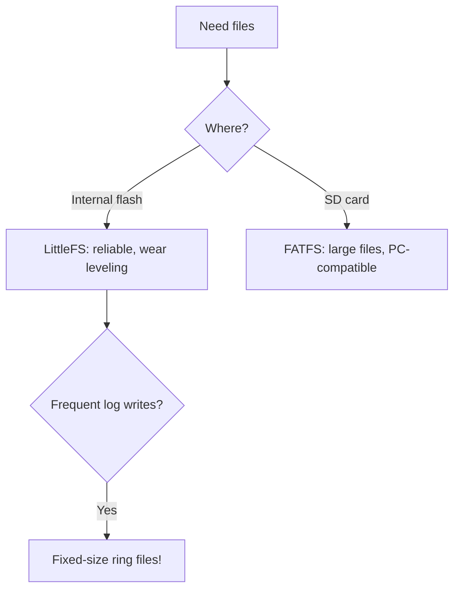

# ESP32 Filesystems

Internal [[Home.en | flash]] (through partitions) or an external SD card give the ESP32 real files: configs, logs, web pages, OTA images. The FS choice affects reliability, speed and wear. Related to the [[01-Hardware/06-Flash-PSRAM.en | flash type]] and the [[08-Memory/01-Partitions-NVS.en | partition layout]].

> [!important]
> SPIFFS is **deprecated** in Arduino-ESP32 >= 2.x and IDF >= 5.x. New projects - **LittleFS** only.

![[assets/img/filesystem-littlefs-fat-scheme.png|600]]
*Fig. LittleFS (internal) vs FATFS (SD): mounting, wear, size limits.*

## Purpose

ESP32 filesystems - filesystem comparison, partition layout for the FS, formatting and mounting. Internal flash (through partitions) or an external SD card give the ESP32 real files: configs, logs, web pages, OTA images. The FS choice affects reliability, speed and wear. Related to [[EN/01-Hardware/06-Flash-PSRAM.en]] and [[EN/08-Memory/01-Partitions-NVS.en]]. SPIFFS is deprecated in Arduino-ESP32 >= 2.x and IDF >= 5.x. New projects - LittleFS only.

## 1. Filesystem comparison

| Criterion | LittleFS ✅ | SPIFFS ⚠️ | FAT (FFat) | SD (SDMMC/SPI) |
| --- | --- | --- | --- | --- |
| Purpose | Internal flash | Internal flash (legacy) | Internal flash / USB | External card |
| Power-loss reliability | High (journaling, COW) | Low (corruption on write) | Medium | Medium |
| Write speed | Fast | Slow, degrades over time | Medium | Fastest (SDMMC 4-bit) |
| Subdirectories | Yes | No (flat) | Yes | Yes |
| Flash wear (wear leveling) | Yes, dynamic | Yes, weak | Yes (through the WL driver) | Card controller |
| Max volume | Partition size (up to about 3 MB) | Same | Same | Up to 32 GB (SDHC) |
| IDF 5.x support | Yes (`littlefs` component) | Removed | Yes (`fatfs`) | Yes |
| Arduino support | `LittleFS.h` | `SPIFFS.h` (legacy) | `FFat.h` | `SD.h` / `SD_MMC.h` |

> [!note]
> For web content (HTML/CSS/JS) and configs take LittleFS. For large logs or the camera - an SD card.

## 2. Partition layout for the FS

| FS | SubType in CSV | Example row |
| --- | --- | --- |
| LittleFS / SPIFFS | `spiffs` | `littlefs, data, spiffs, 0x3D0000, 0x30000,` |
| FAT | `fat` | `storage, data, fat, 0x3D0000, 0x100000,` |
| NVS | `nvs` | Do not confuse with a filesystem! |

> [!tip]
> Typical LittleFS size: 256 KB - 1.5 MB. Below 128 KB formatting often fails.

## 3. Formatting and mounting

### ESP-IDF - LittleFS

```c
#include "esp_littlefs.h"
esp_vfs_littlefs_conf_t conf = {
    .base_path = "/littlefs",
    .partition_label = "littlefs",
    .format_if_mount_failed = true,   // автоформат при першому старті
    .dont_mount = false,
};
esp_vfs_littlefs_register(&conf);
size_t total, used;
esp_littlefs_info("littlefs", &total, &used);
```

### Arduino - LittleFS

```cpp
#include <LittleFS.h>
void setup() {
  Serial.begin(115200);
  if (!LittleFS.begin(true)) {          // true = format on fail
    Serial.println("LittleFS mount failed!");
    return;
  }
  Serial.printf("Total %u, used %u\n", LittleFS.totalBytes(), LittleFS.usedBytes());
}
void loop() {}
```

### MicroPython - built-in FAT / LittleFS

```python
import os, machine
# Внутрішня flash вже змонтована як /
print(os.listdir("/"))
print(os.statvfs("/"))   # (bsize, frsize, blocks, bfree, ...)
# SD-карта по SPI:
# import sdcard
# spi = machine.SPI(1, sck=machine.Pin(18), mosi=machine.Pin(23), miso=machine.Pin(19))
# sd = sdcard.SDCard(spi, machine.Pin(5))
# os.mount(sd, "/sd")
```

## 4. Writing and reading files

### ESP-IDF (POSIX API over VFS)

```c
FILE *f = fopen("/littlefs/config.txt", "w");
fprintf(f, "ssid=%s\n", "MyWiFi");
fclose(f);
char buf[64];
f = fopen("/littlefs/config.txt", "r");
fgets(buf, sizeof(buf), f);
fclose(f);
```

### Arduino (LittleFS + SD)

```cpp
#include <LittleFS.h>
void write_read_demo() {
  File f = LittleFS.open("/config.txt", "w");
  f.println("ssid=MyWiFi");
  f.close();
  f = LittleFS.open("/config.txt", "r");
  while (f.available()) Serial.write(f.read());
  f.close();
}
// SD по SDMMC (1-bit за замовчуванням на більшості плат):
// #include <SD_MMC.h>
// SD_MMC.begin("/sdcard", true);
```

### MicroPython

```python
with open("/config.txt", "w") as f:
    f.write("ssid=MyWiFi\n")
with open("/config.txt") as f:
    print(f.read())
```

## 5. Flash wear and lifetime

| Factor | Effect | Recommendation |
| --- | --- | --- |
| NOR flash rewrite cycles | about 100,000 per sector | Do not write logs to flash every second |
| Sector size | 4096 bytes | Write in buffers of 512 B or more, less often |
| LittleFS wear leveling | Even | Works automatically |
| Frequent counters | Kill a single sector | Keep in RTC RAM, write once an hour |
| Logs | Fast wear | Logs go to an SD card or a server, not flash |

> [!warning]
> Writing to the same file every 5 s kills the partition in months. Strategy: cache in RAM → `flush()` every 10 min → file rotation.

Estimate: 100,000 cycles x 10 min interval ≈ 1,000,000 min ≈ **1.9 years** minimum; with wear leveling over 1 MB - several times more.

## 6. Commands and diagnostics

| Command | What it does |
| --- | --- |
| `mklittlefs -c data/ -s 0x30000 image.bin` | Build a LittleFS image for flashing |
| `esptool.py write_flash 0x3D0000 littlefs.bin` | Flash the image at the offset from the CSV |
| `idf.py menuconfig` → LittleFS | Configure base_path, auto-format |
| `LittleFS.format()` | Format from Arduino |
| `os.statvfs("/")` | Free space in MicroPython |

### Mermaid: picking the FS



## Common issues

| # | Issue | Why it is bad | The right way |
| --- | --- | --- | --- |
| 1 | SPIFFS in a new project | Deprecated, fragile | LittleFS |
| 2 | Appending to one log for years | Sector wear | Ring / rotation |
| 3 | No pull-up on SD-DAT | Floats in idle | Pull-up mandatory |
| 4 | OTA image in the same FS | No space/conflict | Separate partition |

## Official sources

- [LittleFS + FATFS (ESP-IDF Storage)](https://docs.espressif.com/projects/esp-idf/en/latest/esp32/api-reference/storage/index.html) - mounting, VFS.
- [Wear Levelling Guide](https://docs.espressif.com/projects/esp-idf/en/latest/esp32/api-reference/storage/wear-levelling.html) - flash wear.

## See also

- [[EN/Home.en]]
- [[EN/01-Hardware/06-Flash-PSRAM.en]]
- [[EN/08-Memory/01-Partitions-NVS.en]]
- [[08-Memory/03-OTA.en | OTA]]
- [[EN/08-Memory/04-Secure-Boot-Encrypt.en]]
- [[09-Firmware/02-Arduino-PlatformIO]]
- [[09-Firmware/03-MicroPython | MicroPython]]
- [[09-Firmware/04-Esptool-Flash]]
