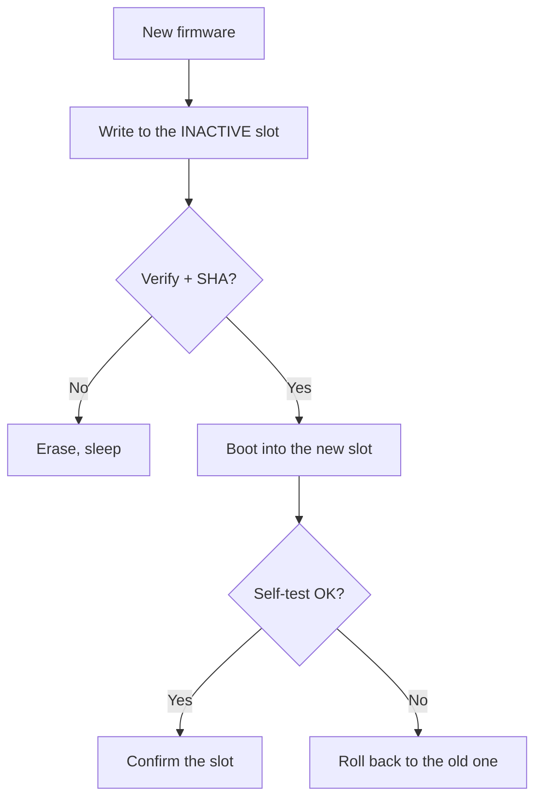

# OTA Updates on ESP32

OTA (Over-The-Air) updates firmware without a cable - over Wi-Fi. ESP32 has **two OTA slots** `app0/app1`: the new firmware is written to the inactive slot, then a switch happens. Related to [[08-Memory/01-Partitions-NVS.en | partitions]], [[01-Hardware/06-Flash-PSRAM.en | flash size]] and [[Home.en | security]].

> [!important]
> Without an `otadata` partition and two `app` slots OTA is impossible. The `minimal`/`huge_app` single-slot schemes do not support OTA.

![[assets/img/ota-dualbank-rollback-scheme.png|600]]
*Fig. Two slots app0/app1 + otadata: write, verify, boot, self-test, rollback on failure.*

## Purpose

ESP32 OTA updates - dual OTA slots, OTA method comparison, AsyncElegantOTA (Arduino) quick start. Without an otadata partition and two app slots OTA is impossible. The minimal/huge_app single-slot schemes do not support OTA. The coredump partition helps diagnose why the new slot crashed and rolled back.

## 1. How the two OTA slots work

| Step | What happens |
| --- | --- |
| 1 | `app0` runs, `otadata` points to `ota_0` |
| 2 | New firmware downloads → written to `app1` |
| 3 | Image SHA/MD5 check |
| 4 | `otadata` switches to `ota_1`, reboot |
| 5 | `app1` starts → `esp_ota_mark_app_valid()` confirms it |
| 6 | If `app1` crashes → **rollback** to `app0` |

```text
 ┌────────┐   boot    ┌──────────┐
 │otadata │ ────────► │ app0 *   │  активний
 │ ota_0  │           │ app1     │  ціль OTA
 └────────┘           └──────────┘
```

> [!note]
> The `coredump` partition helps diagnose why the new slot crashed and rolled back.

## 2. OTA method comparison

| Method | Transport | Pros | Cons | When to use |
| --- | --- | --- | --- | --- |
| ArduinoOTA | UDP/TCP, Arduino IDE | Simple, no server | No encryption, LAN only | Home development |
| AsyncElegantOTA | HTTP, browser | Web UI, drag and drop | Needs access to the IP | Field debugging |
| HTTPS OTA (IDF) | TLS + HTTP | Encryption, server infrastructure | More complex, needs a certificate | Production |
| MQTT OTA | MQTT chunks | Works through NAT, little traffic | Slower, needs a broker | Device fleet |
| BLE OTA | BLE GATT | No Wi-Fi | Very slow | S3/C3 without a network |

## 3. AsyncElegantOTA (Arduino) - quick start

```cpp
#include <WiFi.h>
#include <AsyncTCP.h>
#include <ESPAsyncWebServer.h>
#include <AsyncElegantOTA.h>
AsyncWebServer server(80);

void setup() {
  Serial.begin(115200);
  WiFi.begin("SSID", "PASS");
  while (WiFi.status() != WL_CONNECTED) delay(300);
  Serial.println(WiFi.localIP());
  server.on("/", HTTP_GET, [](AsyncWebServerRequest *req){ req->send(200, "text/plain", "OTA ready"); });
  AsyncElegantOTA.begin(&server);   // UI на http://<ip>/update
  server.begin();
}
void loop() { AsyncElegantOTA.loop(); }
```

> [!tip]
> Always set a password: `AsyncElegantOTA.begin(&server, "admin", "secret");` - otherwise anyone on the network reflashes the device.

## 4. ESP-IDF HTTPS OTA

```c
#include "esp_https_ota.h"
esp_http_client_config_t config = {
    .url = "https://example.com/firmware.bin",
    .cert_pem = server_cert_pem_start,   // вбудований CA
    .timeout_ms = 10000,
};
esp_err_t r = esp_https_ota(&config);
if (r == ESP_OK) {
    esp_restart();   // перемикання на новий слот + reboot
}
```

Extended variant with a version callback and rollback:

```c
esp_ota_handle_t h; const esp_partition_t *p;
// ... esp_https_ota_begin() + esp_https_ota_perform() в циклі ...
esp_ota_mark_app_valid_cancel_rollback();  // підтвердити після self-test
```

## 5. MicroPython OTA (HTTP)

```python
import urequests, machine, esp32
url = "https://example.com/firmware.bin"   # або .py скрипти
r = urequests.get(url)
with open("/update.bin", "wb") as f:
    f.write(r.content)
# далі: перевірка хешу + machine.reset() / кастомний bootloader
print("downloaded", len(r.content))
```

> [!warning]
> Stock MicroPython has no A/B slots out of the box - OTA usually means updating `.py` files or a full reflash through the `ota` module of a specific build. For a reliable fleet prefer IDF/Arduino.

## 6. Rollback and security

| Mechanism | How it works |
| --- | --- |
| `CONFIG_BOOTLOADER_APP_ROLLBACK_ENABLE` | IDF rolls back automatically when the new firmware crashes |
| `esp_ota_mark_app_valid()` | Confirm after self-test (sensors, Wi-Fi OK) |
| `esp_ota_mark_app_invalid_rollback_and_reboot()` | Forced rollback |
| Secure Boot + signature | Rejects unsigned images (see [[08-Memory/04-Secure-Boot-Encrypt.en | Secure Boot]]) |

OTA security checklist:

| # | Requirement |
| --- | --- |
| 1 | HTTPS (TLS) only, no plain HTTP in production |
| 2 | Password / token on the `/update` endpoint |
| 3 | Image signature (RSA/ECDSA) + Secure Boot V2 |
| 4 | Version grows monotonically (anti-downgrade) |
| 5 | Watchdog + self-test before `mark_valid` |

> [!caution]
> An open `/update` without a password on a public network = instant fleet compromise. Always close it with authentication.

### Mermaid: OTA cycle with rollback



## Common issues

| # | Issue | Why it is bad | The right way |
| --- | --- | --- | --- |
| 1 | Single app slot | Nowhere to write | factory + 2 slots |
| 2 | No verify | Broken image turns into a brick | SHA + self-test |
| 3 | OTA at 20% battery | Power cut mid-write | Only above 50% / on charger |
| 4 | Careless downgrade | Anti-rollback bricks | Versions only go up |

## Official sources

- [OTA Guide (ESP-IDF)](https://docs.espressif.com/projects/esp-idf/en/latest/esp32/api-reference/system/ota.html) - slots, rollback.
- [AsyncElegantOTA (GitHub)](https://github.com/ayushsharma82/AsyncElegantOTA) - Arduino quick start.

## See also

- [[EN/Home.en]]
- [[EN/01-Hardware/06-Flash-PSRAM.en]]
- [[EN/08-Memory/01-Partitions-NVS.en]]
- [[08-Memory/02-Filesystem.en | Filesystems]]
- [[EN/08-Memory/04-Secure-Boot-Encrypt.en]]
- [[09-Firmware/01-ESP-IDF-setup]]
- [[09-Firmware/02-Arduino-PlatformIO]]
- [[09-Firmware/04-Esptool-Flash]]
