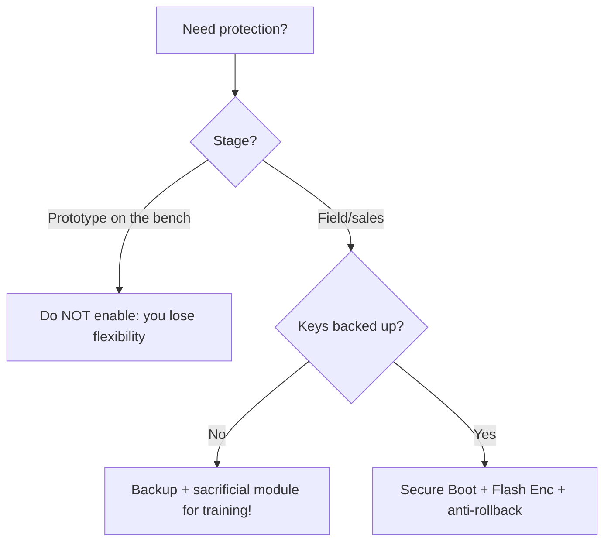

# Secure Boot and Flash Encryption

ESP32 firmware protection rests on three pillars: **eFuse** (one-time bits), **Secure Boot V2** (signature verification) and **Flash Encryption** (encryption of [[Home.en | flash]]). Together they cover [[08-Memory/03-OTA.en | OTA]] and physical access. The price is **irreversibility**: a mistake = a brick.

> [!caution]
> eFuse bits burn **forever**. Enabling Secure Boot / Encryption on a test sample without a key backup destroys the device for development. Train on a sacrificial module.

![[assets/img/secureboot-flashenc-scheme.png|600]]
*Fig. Chain of trust: eFuse, Secure Boot V2 (signature), XTS-AES flash encryption.*

## Purpose

Secure Boot and Flash Encryption - eFuse hardware root of trust, Flash Encryption, Secure Boot V2. After Release mode esptool.py read_flash returns ciphertext. Make backups before enabling. Covers Secure Boot V2 (signature verification), Flash encryption (XTS-AES) and irreversible eFuse bits.

## 1. eFuse - hardware root of trust

| eFuse block | What it stores | One-time? |
| --- | --- | --- |
| `BLOCK_KEY0` | Flash encryption key (256 bit) | Yes, written once |
| `BLOCK_KEY1` | Secure Boot V2 key (ECDSA/RSA) | Yes |
| `FLASH_CRYPT_CNT` | Encryption enable counter | Yes (odd = ON) |
| `SECURE_BOOT_EN` | Secure Boot flag | Yes |
| `DIS_DOWNLOAD_MODE` | UART download ban | Yes |
| `DIS_USB_JTAG` | USB-JTAG ban (S3) | Yes |
| `MAC`, calibration | Factory data | No (written at the factory) |

Inspection (IDF):

```bash
espefuse.py --port /dev/ttyUSB0 summary
espefuse.py --port /dev/ttyUSB0 dump
```

> [!note]
> `espefuse.py` reads without destroying. Writing (`burn_key`, `burn_efuse`) is the point of no return.

## 2. Flash Encryption

| Parameter | ESP32 (classic) | ESP32-S3 / C3 / S2 |
| --- | --- | --- |
| Algorithm | AES-256-XTS | AES-256-XTS |
| Key | eFuse BLOCK_KEY0, generated by the device | Same |
| Mode | Release / Development | Release / Development |
| Encrypted | app + NVS (optional) | Same + PSRAM (S3, optional) |

Enabling (Development mode for tests):

```bash
idf.py menuconfig
# Security features → Enable flash encryption on boot
#                   → Development (NOT SECURE) — дозволяє перепрошивання
idf.py build flash monitor
# Перше download: key генерується, flash шифрується на місці
```

| Mode | Reflashing | Security | When |
| --- | --- | --- | --- |
| Development | Allowed (key in RAM) | Low, for tests | Lab |
| Release | Only encrypted images / OTA | High | Production |

> [!important]
> After Release mode `esptool.py read_flash` returns **ciphertext**. Make backups before enabling.

## 3. Secure Boot V2

Verifies the RSA-3072 / ECDSA-P256 signature of the bootloader + app before start.

| Step | Action |
| --- | --- |
| 1 | `espsecure.py generate_signing_key --version 2 secure_boot_key.pem` - generate the key **on an offline machine** |
| 2 | `idf.py menuconfig` → Secure Boot V2 → specify the key |
| 3 | `idf.py build` - images are signed automatically |
| 4 | First boot - key digest is burned into eFuse |
| 5 | Later boots - signature verification |

```bash
espsecure.py generate_signing_key --version 2 --scheme ecdsa256 signing.pem
espsecure.py sign_data --version 2 --keyfile signing.pem -o app-signed.bin build/app.bin
espsecure.py verify_signature --version 2 --keyfile signing.pem app-signed.bin
```

Signing in Arduino/PlatformIO:

```ini
; platformio.ini — підпис app для Secure Boot (key лежить поза репо!)
board_build.signing_key = keys/signing.pem
```

MicroPython: stock builds are not signed for Secure Boot - for a protected fleet build your own firmware through IDF + `mpy-cross`, then sign it.

## 4. Consequences of irreversibility

| Action | Consequence |
| --- | --- |
| Burned `SECURE_BOOT_EN` without saving `signing.pem` | No new firmware ever starts - the device is frozen |
| `FLASH_CRYPT_CNT` in Release + lost key | Data cannot be decrypted, only module replacement |
| `DIS_DOWNLOAD_MODE` | No UART flashing, OTA only |
| `DIS_USB_JTAG` + Secure Boot | No [[09-Firmware/05-JTAG-Debug | JTAG debugging]] |
| eFuse read lock (`RD_DIS`) | Even you cannot read the keys |

> [!warning]
> Order for production: 1) key backup in HSM/safe, 2) test on 3+ devices in Development, 3) only then Release on the batch.

## 5. When to enable and when not

| Scenario | Secure Boot | Flash Encryption |
| --- | --- | --- |
| Home prototype, learning | No | No |
| Commercial product with [[08-Memory/03-OTA.en | OTA]] | Yes | Yes |
| Device with personal data / API keys in [[08-Memory/01-Partitions-NVS.en | NVS]] | Yes | Yes (encrypt NVS) |
| Mass fleet in public places | Yes (V2, ECDSA) | Yes (Release) |
| Active development + [[09-Firmware/05-JTAG-Debug | JTAG]] | No (blocks debugging) | Development or off |

Release checklist:

| # | Check |
| --- | --- |
| 1 | Keys copied to 2 independent storages |
| 2 | OTA tested with signed images |
| 3 | `espefuse.py summary` shows the expected bits |
| 4 | Rollback version (anti-downgrade) set |
| 5 | UART console off or password-protected |

### Mermaid: enable or not



## Common issues

| # | Issue | Why it is bad | The right way |
| --- | --- | --- | --- |
| 1 | eFuse on a live unit at once | Brick without backup | Sacrificial module first |
| 2 | Signing key lost | New firmware cannot be signed | HSM/safe + copies |
| 3 | JTAG needed but closed | No debugging | Debug BEFORE sealing |
| 4 | Version down on rollback | Anti-rollback triggers | Versions only go up |

## Official sources

- [Secure Boot V2 (ESP-IDF)](https://docs.espressif.com/projects/esp-idf/en/latest/esp32/security/secure-boot-v2.html) - keys, signing.
- [Flash Encryption Guide](https://docs.espressif.com/projects/esp-idf/en/latest/esp32/security/flash-encryption.html) - XTS-AES, eFuse.

## See also

- [[EN/Home.en]]
- [[EN/01-Hardware/06-Flash-PSRAM.en]]
- [[EN/08-Memory/01-Partitions-NVS.en]]
- [[08-Memory/02-Filesystem.en | Filesystems]]
- [[08-Memory/03-OTA.en | OTA]]
- [[09-Firmware/01-ESP-IDF-setup]]
- [[09-Firmware/04-Esptool-Flash]]
- [[09-Firmware/05-JTAG-Debug]]
