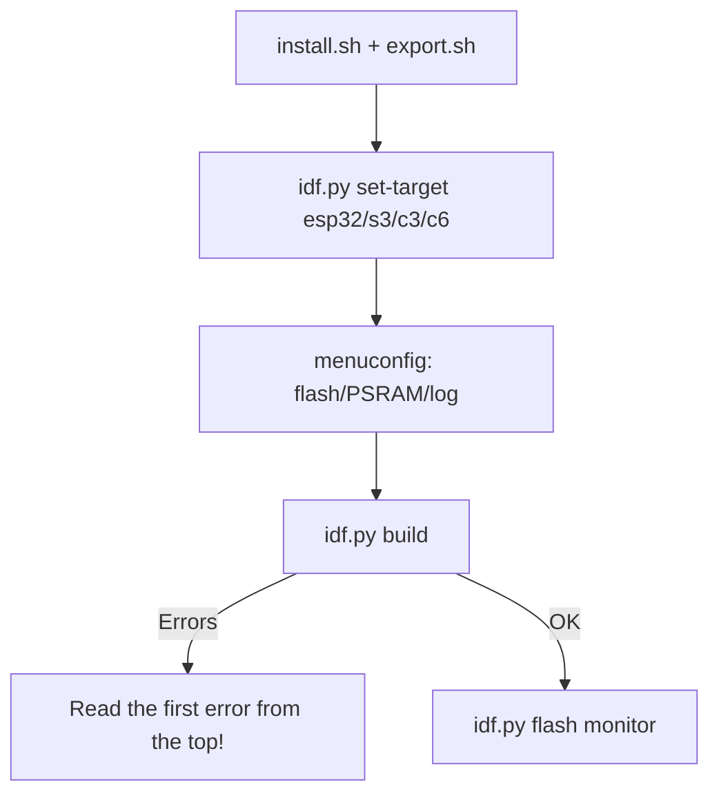

# ESP-IDF Setup 5.x

ESP-IDF is the official Espressif framework: maximum control, FreeRTOS, [[08-Memory/01-Partitions-NVS.en | partitions]], [[08-Memory/03-OTA.en | OTA]], [[08-Memory/04-Secure-Boot-Encrypt.en | Secure Boot]]. It is more complex than Arduino but mandatory for production. It runs on the same [[Home.en | hardware]] and [[01-Hardware/06-Flash-PSRAM.en | flash]].

> [!NOTE]
> IDF 5.x requires Python 3.8+, CMake 3.16+, Git. ESP32-C6/H2 are supported since IDF 5.1+.

![[assets/img/idf-setup-build-scheme.png|600]]
*Fig. IDF cycle: install → export → set-target → menuconfig → build → flash → monitor.*

## Purpose

ESP-IDF Setup 5.x - install; Linux (Ubuntu/Debian); Windows. ESP-IDF is the official Espressif framework: maximum control, FreeRTOS, [[EN/08-Memory/01-Partitions-NVS.en]], [[08-Memory/03-OTA.en | OTA]], [[EN/08-Memory/04-Secure-Boot-Encrypt.en]]. It is more complex than Arduino but mandatory for production. It runs on the same hardware and [[EN/01-Hardware/06-Flash-PSRAM.en]]. IDF 5.x requires Python 3.8+, CMake 3.16+, Git. ESP32-C6/H2 are supported since IDF 5.1+.

## 1. Installation

### Linux (Ubuntu/Debian)

```bash
sudo apt install git wget flex bison gperf python3 python3-pip python3-venv \
  cmake ninja-build ccache libffi-dev libssl-dev dfu-util libusb-1.0-0
mkdir -p ~/esp && cd ~/esp
git clone --recursive https://github.com/espressif/esp-idf.git -b v5.3
cd esp-idf && ./install.sh esp32,esp32s3,esp32c3
source export.sh   # кожна нова сесія терміналу!
```

### Windows

| Option | When to use |
| --- | --- |
| **Offline Installer** (`esp-idf-tools-setup`) | Beginners, everything out of the box |
| **VS Code Extension** (Espressif IDF) | Convenient development + one-click flash |
| Manual (as on Linux, via PowerShell) | Experienced users |

After the offline installer: the `ESP-IDF 5.x CMD` shortcut already contains `export`.

> [!TIP]
> Add an alias: `alias idf='source ~/esp/esp-idf/export.sh'`. Check: `idf.py --version`.

| Check command | Expected result |
| --- | --- |
| `python3 --version` | ≥ 3.8 |
| `cmake --version` | ≥ 3.16 |
| `idf.py --version` | v5.x |
| `esptool.py version` | ≥ 4.x |

## 2. First project: blink

```bash
idf.py create-project blink
cd blink
idf.py set-target esp32s3        # або esp32 / esp32c3
idf.py menuconfig                # configuration (див. нижче)
idf.py build                     # компіляція
idf.py -p /dev/ttyUSB0 flash     # прошивка
idf.py -p /dev/ttyUSB0 monitor   # serial 115200 + логи
# все разом:
idf.py -p /dev/ttyUSB0 flash monitor
```

Code in `main/blink_example_main.c` (shortened):

```c
#include "freertos/FreeRTOS.h"
#include "freertos/task.h"
#include "driver/gpio.h"
#define LED_GPIO 2
void app_main(void) {
    gpio_reset_pin(LED_GPIO);
    gpio_set_direction(LED_GPIO, GPIO_MODE_OUTPUT);
    while (1) {
        gpio_set_level(LED_GPIO, 1);
        vTaskDelay(pdMS_TO_TICKS(500));
        gpio_set_level(LED_GPIO, 0);
        vTaskDelay(pdMS_TO_TICKS(500));
    }
}
```

Exit the monitor with `Ctrl+]`. Build artifacts live in `build/`.

## 3. menuconfig - key sections

| Section | What to configure |
| --- | --- |
| Serial flasher config | Flash size (4/8/16 MB), mode DIO/QIO, freq 40/80 MHz |
| Partition Table | Single factory / Two OTA / Custom CSV ([[08-Memory/01-Partitions-NVS.en | details]]) |
| Component config → FreeRTOS | Tick rate 1000 Hz, stack check |
| Component config → ESP System | Log level, panic handler |
| Component config → Wi-Fi / BT | Buffers, power-save |
| Security features | Secure Boot, Flash Encryption ([[08-Memory/04-Secure-Boot-Encrypt.en | details]]) |

> [!WARNING]
> A wrong Flash size in menuconfig (for example 4 MB instead of 8 MB) means an invisible half of memory and broken OTA. Compare with the chip marking.

## 4. idf.py command table

| Command | Purpose |
| --- | --- |
| `idf.py create-project <name>` | New project |
| `idf.py set-target esp32s3` | Change chip (wipes build/) |
| `idf.py menuconfig` | TUI configurator |
| `idf.py build` | Compile |
| `idf.py flash` | Flash firmware (port from `menuconfig` or `-p`) |
| `idf.py monitor` | Serial monitor, logs, `Ctrl+]` to exit |
| `idf.py erase-flash` | Full erase of [[01-Hardware/06-Flash-PSRAM.en | flash]] |
| `idf.py partition-table` | Show the partitions layout |
| `idf.py size` | App/DRAM/IRAM size per component |
| `idf.py fullclean` | Remove build/ completely |

## 5. JTAG debugging (brief)

Built-in USB-JTAG on S3/C3/H2 or an external ESP-Prog:

```bash
openocd -f board/esp32s3-builtin.cfg
# в іншому терміналі:
xtensa-esp32s3-elf-gdb build/blink.elf -ex "target remote :3333"
(gdb) mon reset halt
(gdb) flushregs
(gdb) thb app_main
(gdb) c
```

> [!TIP]
> Full analysis is in [[09-Firmware/05-JTAG-Debug.en | JTAG-Debug]]. For a start `monitor` + `ESP_LOGI` is enough.

## 6. Common issues

| Issue | Fix |
| --- | --- |
| `No such file: export.sh` | Open via the IDF CMD shortcut or `source ~/esp/esp-idf/export.sh` |
| `Failed to connect` | Hold BOOT, see [[09-Firmware/04-Esptool-Flash.en | Esptool-Flash]] |
| `cmake version too old` | Update CMake to 3.16 or newer |
| `Partition too small` | Enlarge the app partition or remove components |

### Mermaid: first project



## Official sources

- [ESP-IDF Get Started](https://docs.espressif.com/projects/esp-idf/en/latest/esp32/get-started/index.html) - install, first project.
- [IDF Component Manager](https://docs.espressif.com/projects/idf-component-manager/) - dependencies.

## See also

- [[EN/Home.en]]
- [[EN/01-Hardware/06-Flash-PSRAM.en]]
- [[EN/08-Memory/01-Partitions-NVS.en]]
- [[08-Memory/03-OTA.en | OTA]]
- [[EN/08-Memory/04-Secure-Boot-Encrypt.en]]
- [[EN/09-Firmware/02-Arduino-PlatformIO.en]]
- [[EN/09-Firmware/04-Esptool-Flash.en]]
- [[EN/09-Firmware/05-JTAG-Debug.en]]
