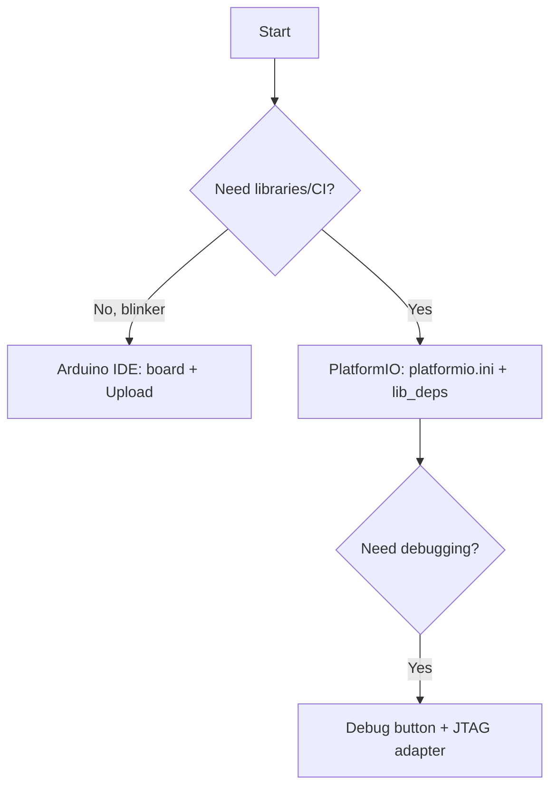

# Arduino IDE and PlatformIO for ESP32

The Arduino layer is the fastest path from an idea to a blinking LED: thousands of libraries, `setup()/loop()`, one-click flashing. PlatformIO gives the same plus sane dependencies and [[09-Firmware/05-JTAG-Debug.en | debugging]]. Both run on the same [[Home.en | hardware]] and [[01-Hardware/06-Flash-PSRAM.en | flash]].

> [!NOTE]
> Arduino-ESP32 3.x is based on IDF 5.x. Old 2.x sketches may need migration (`LED_BUILTIN`, ADC API).

![[assets/img/arduino-pio-flow-scheme.png|600]]
*Fig. Arduino/PIO flow: core/ini → libraries → Upload → Monitor; JTAG button in PIO.*

## Purpose

Arduino IDE and PlatformIO for ESP32 - Arduino IDE: ESP32 core install; first sketch + Serial Monitor; PlatformIO: project from scratch. Arduino-ESP32 3.x is based on IDF 5.x. Old 2.x sketches may need migration (LED_BUILTIN, ADC API). 5. LittleFS / NVS / OTA in Arduino.

## 1. Arduino IDE: ESP32 core install

Stable URL (File → Preferences → Additional boards manager URLs):

```text
https://espressif.github.io/arduino-esp32/package_esp32_index.json
```

| Step | Action |
| --- | --- |
| 1 | Paste the URL, OK |
| 2 | Tools → Board → Boards Manager → find `esp32` → Install |
| 3 | Select the board: `ESP32 Dev Module` / `ESP32-S3 Dev Module` / `XIAO_ESP32C3` |
| 4 | USB CDC On Boot → Enabled (for S3/C3, else no Serial) |
| 5 | Partition Scheme → `Default 4MB with spiffs` (see [[08-Memory/01-Partitions-NVS.en | partitions]]) |
| 6 | Upload Speed → `921600` (or `460800` on errors) |

> [!TIP]
> On Linux add yourself to `dialout`: `sudo usermod -aG dialout $USER` + relogin. Else the port stays grey.

## 2. First sketch + Serial Monitor

```cpp
void setup() {
  Serial.begin(115200);
  while (!Serial) delay(10);
  pinMode(LED_BUILTIN, OUTPUT);
  Serial.println("Hello ESP32!");
}
void loop() {
  digitalWrite(LED_BUILTIN, !digitalRead(LED_BUILTIN));
  Serial.println("blink");
  delay(500);
}
```

| Monitor parameter | Value |
| --- | --- |
| Baud | `115200` (standard IDF/Arduino log rate) |
| Line ending | `Both NL & CR` for commands |
| Port | `/dev/ttyUSB0` (CP2102/CH340) or `/dev/ttyACM0` (native USB S3/C3) |

## 3. PlatformIO: project from scratch

Structure + `platformio.ini`:

```ini
[env:esp32dev]
platform = espressif32
board = esp32dev
framework = arduino
monitor_speed = 115200
upload_speed = 921600
board_build.partitions = default_4MB.csv      ; кастом: partitions_custom.csv
lib_deps =
  bblanchon/ArduinoJson @ ^7.0.0
  madhephaestus/ESP32Encoder @ ^0.11.0
build_flags =
  -DCORE_DEBUG_LEVEL=3
```

| PlatformIO command | Purpose |
| --- | --- |
| `pio run` | Build |
| `pio run -t upload` | Flash firmware |
| `pio device monitor -b 115200` | Serial monitor |
| `pio run -t erase` | Erase [[01-Hardware/06-Flash-PSRAM.en | flash]] |
| `pio pkg install -l <lib>` | Add a library |
| `pio boards esp32` | Board list |

Code in `src/main.cpp` - the same Arduino style:

```cpp
#include <Arduino.h>
#include <Preferences.h>   // NVS key-value, див. [[08-Memory/01-Partitions-NVS|NVS]]
Preferences prefs;
void setup() {
  Serial.begin(115200);
  prefs.begin("cfg", false);
  Serial.printf("boot=%u\n", prefs.getUInt("boot", 0));
}
void loop() { delay(1000); }
```

## 4. Libraries: hygiene rules

| Rule | Why |
| --- | --- |
| Pin versions (`@ ^x.y.z`) | Updates break the build silently |
| Prefer `lib_deps` over manual copying | Reproducibility |
| Check the architecture (`esp32` in `library.json`) | AVR libraries will not fit |
| Large dependencies (AsyncWebServer) - from the registry, not ZIP | ZIP never updates |

> [!WARNING]
> Conflict of `ESPAsyncWebServer` (legacy) vs `ESPAsyncWebServer2` under Arduino 3.x - take a fork with IDF 5 support, else hundreds of compile errors.

## 5. LittleFS / NVS / OTA in Arduino

```cpp
#include <LittleFS.h>   // деталі: [[08-Memory/02-Filesystem|Файлові системи]]
#include <ArduinoOTA.h> // деталі: [[08-Memory/03-OTA|OTA]]
void setupOTA() {
  ArduinoOTA.setHostname("esp32-lab");
  ArduinoOTA.setPassword("secret");
  ArduinoOTA.begin();
}
```

MicroPython equivalent for comparison (details - [[09-Firmware/03-MicroPython.en | MicroPython]]):

```python
from machine import Pin
led = Pin(2, Pin.OUT)
led.value(not led.value())
```

## 6. Common upload issues

| Issue | Fix (details - [[09-Firmware/04-Esptool-Flash.en | Esptool-Flash]]) |
| --- | --- |
| `Failed to connect` | Hold BOOT, lower `upload_speed` to 115200 |
| `MD5 mismatch` | Bad cable / power supply, erase flash |
| `No serial data received` | Wrong port, or native USB without `USB CDC On Boot` |
| `Sketch too big` | Change Partition Scheme to `Huge APP` / remove libraries |

### Mermaid: Arduino or PlatformIO



## Official sources

- [Arduino-ESP32 (GitHub)](https://github.com/espressif/arduino-esp32) - core, boards, 2.x to 3.x migration.
- [PlatformIO Espressif32](https://docs.platformio.org/en/latest/platforms/espressif32.html) - boards, options, debugging.

## See also

- [[EN/Home.en]]
- [[EN/01-Hardware/06-Flash-PSRAM.en]]
- [[EN/08-Memory/01-Partitions-NVS.en]]
- [[08-Memory/02-Filesystem.en | Filesystems]]
- [[08-Memory/03-OTA.en | OTA]]
- [[EN/09-Firmware/01-ESP-IDF-Setup.en]]
- [[09-Firmware/03-MicroPython.en | MicroPython]]
- [[EN/09-Firmware/04-Esptool-Flash.en]]
- [[EN/09-Firmware/05-JTAG-Debug.en]]
