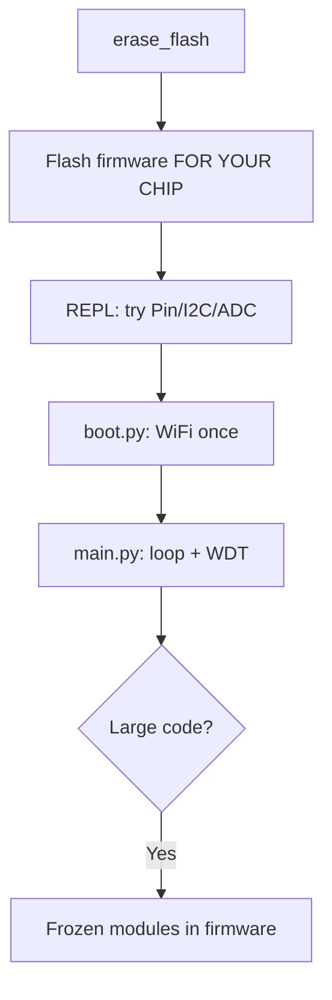

# MicroPython on ESP32

MicroPython is Python 3 directly on the [[Home.en | microcontroller]]: REPL over USB, `boot.py/main.py`, fast prototypes with no compilation. The price is slower execution than C and less free RAM (part eaten by the interpreter + [[01-Hardware/06-Flash-PSRAM.en | PSRAM]] settings).

> [!NOTE]
> Take official builds from `micropython.org/download/esp32/` for your chip: `ESP32`, `ESP32-S3`, `ESP32-C3` - images are **incompatible** across chips.

![[assets/img/micropython-flash-tools-scheme.png|600]]
*Fig. MicroPython: erase → firmware.bin → Thonny/mpremote → boot.py/main.py → REPL.*

## Purpose

MicroPython on ESP32 - firmware flashing via esptool; Thonny: first connection; boot.py and main.py. Baud in Thonny is usually auto. If you see garbage - check that the monitor in [[EN/09-Firmware/02-Arduino-PlatformIO.en]] is closed: two processes cannot hold one port. 4. Hardware: Pin / I2C / ADC / PWM.

## 1. Firmware flashing via esptool

| Step | Command |
| --- | --- |
| 1. Erase flash | `esptool.py --chip esp32 -p /dev/ttyUSB0 erase_flash` |
| 2. Write MicroPython | `esptool.py --chip esp32 -p /dev/ttyUSB0 -b 460800 write_flash -z 0x1000 ESP32_GENERIC-20241129-v1.24.1.bin` |
| 3. S3 (different offset!) | `write_flash -z 0x0 ESP32_GENERIC_S3-...bin` |
| 4. Check | Press EN, open the port at 115200, a `>>>` prompt should appear |

> [!WARNING]
> Offset `0x1000` is for classic ESP32; for S3/C3 it is `0x0`. A wrong offset means silence in the terminal. Compare with the README on the download page.

Firmware file table:

| Chip | File | Offset |
| --- | --- | --- |
| ESP32 | `ESP32_GENERIC-*.bin` | `0x1000` |
| ESP32-S3 | `ESP32_GENERIC_S3-*.bin` | `0x0` |
| ESP32-C3 | `ESP32_GENERIC_C3-*.bin` | `0x0` |

## 2. Thonny: first connection

| Step | Action |
| --- | --- |
| 1 | Install Thonny, Tools → Options → Interpreter → MicroPython (ESP32) |
| 2 | Select port `/dev/ttyUSB0` / `COM3` |
| 3 | Stop/Restart → the REPL `>>>` appears |
| 4 | View → Files - on-device file panel |

> [!TIP]
> Baud in Thonny is usually auto. If you see garbage - check that the monitor in [[09-Firmware/02-Arduino-PlatformIO.en | other IDE]] is closed: two processes cannot hold one port.

## 3. boot.py and main.py

| File | When it runs | What to put there |
| --- | --- | --- |
| `boot.py` | First, on every boot | Wi-Fi, hostname, watchdog |
| `main.py` | After `boot.py` | Main program loop |

```python
# boot.py — мінімальний мережевий старт
import network, time
wlan = network.WLAN(network.STA_IF)
wlan.active(True)
wlan.connect("SSID", "PASS")
for _ in range(20):
    if wlan.isconnected():
        break
    time.sleep(0.5)
print("net:", wlan.ifconfig() if wlan.isconnected() else "OFFLINE")
```

```python
# main.py — блималка + REPL-доступність
from machine import Pin
import time
led = Pin(2, Pin.OUT)
while True:
    led.value(not led.value())
    time.sleep(0.5)
```

> [!CAUTION]
> An endless `while True` with no pauses blocks the watchdog. Add `time.sleep()` or `wdt.feed()`.

## 4. Hardware: Pin / I2C / ADC / PWM

```python
from machine import Pin, I2C, ADC, PWM
# GPIO (порівняйте з Arduino digitalWrite / IDF gpio_set_level)
led = Pin(2, Pin.OUT)
btn = Pin(0, Pin.IN, Pin.PULL_UP)
led.value(1)
# I2C сканер (SDA=21, SCL=22 на більшості DevKit)
i2c = I2C(0, scl=Pin(22), sda=Pin(21), freq=400000)
print("i2c:", [hex(a) for a in i2c.scan()])
# ADC (attenuation обов'язкова для 3.3 В!)
adc = ADC(Pin(34))
adc.atten(ADC.ATTN_11DB)
print("adc:", adc.read())
# PWM / Servo-ish
pwm = PWM(Pin(5), freq=1000, duty=512)
```

ESP-IDF equivalent (C) for reference:

```c
gpio_set_level(GPIO_NUM_2, 1);   // vs Pin(2).value(1)
```

Arduino equivalent:

```cpp
digitalWrite(2, HIGH);           // vs Pin(2).value(1)
```

## 5. Network and packages (mpipkg / mip)

```python
import network
ap = network.WLAN(network.AP_IF)   # точка доступу для налаштування
ap.active(True)
ap.config(essid="ESP32-SETUP", password="12345678")
# installation пакетів (MicroPython ≥ 1.20: mip замість upip)
import mip
mip.install("umqtt.simple")
mip.install("github:org/repo/package")
```

| Tool | Command | When |
| --- | --- | --- |
| `mip` (new) | `mip.install("umqtt.simple")` | MicroPython 1.20+ |
| `upip` (old) | `upip.install("micropython-umqtt.simple")` | Old builds |
| `mpy-cross` | Compile `.py` → `.mpy` | Save RAM/flash |
| `rshell/ampy` | Copy files from CLI | Without Thonny |

> [!NOTE]
> Packages land in `/lib`. For [[08-Memory/02-Filesystem.en | flash savings]] compile heavy modules to `.mpy`.

## 6. Common issues

| Issue | Fix |
| --- | --- |
| No `>>>`, silence | Wrong offset / foreign chip binary, reflash (see [[09-Firmware/04-Esptool-Flash.en | Esptool]]) |
| `ENOMEM` | Too many imports, compile to `.mpy`, drop buffers |
| `OSError: [Errno 19] ENODEV` on I2C | Wrong pins / no 4.7k pull-up |
| Wi-Fi does not connect | 5 GHz network (ESP32 is 2.4 GHz only!), long password |
| REPL hangs in `main.py` | `Ctrl+C` in Thonny, rename `main.py` via the Files panel |

### Mermaid: start with MicroPython



## Official sources

- [MicroPython ESP32](https://docs.micropython.org/en/latest/esp32/quickref.html) - peripheral quickref.
- [mpremote / Thonny](https://docs.micropython.org/en/latest/reference/mpremote.html) - board workflow.

## See also

- [[EN/Home.en]]
- [[EN/01-Hardware/06-Flash-PSRAM.en]]
- [[EN/08-Memory/01-Partitions-NVS.en]]
- [[08-Memory/02-Filesystem.en | Filesystems]]
- [[EN/09-Firmware/01-ESP-IDF-Setup.en]]
- [[EN/09-Firmware/02-Arduino-PlatformIO.en]]
- [[EN/09-Firmware/04-Esptool-Flash.en]]
- [[EN/09-Firmware/05-JTAG-Debug.en]]
