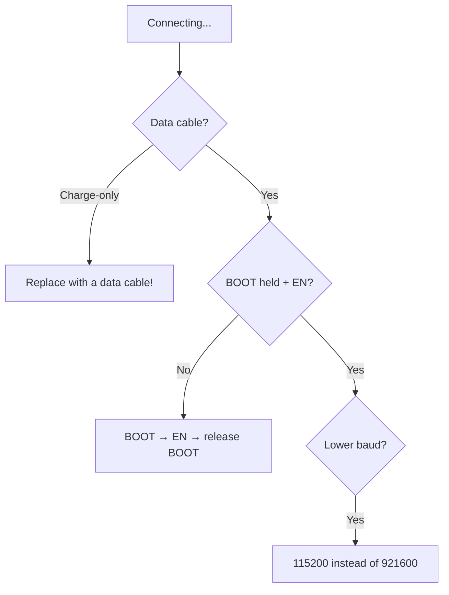

# Esptool and Flash Programming

`esptool.py` is the low-level Espressif flasher: erase, write, read [[01-Hardware/06-Flash-PSRAM.en | flash]], `chip_id`, speed changes. Under the hood it is used by [[09-Firmware/01-ESP-IDF-Setup.en | IDF]], [[09-Firmware/02-Arduino-PlatformIO.en | Arduino/PlatformIO]] and [[09-Firmware/03-MicroPython.en | MicroPython]]. This note is a field reference for when it "does not connect".

> [!IMPORTANT]
> 90% of esptool problems are a cable (charge-only with no data), weak power or a busy port, not the ESP32 itself.

![[assets/img/esptool-flash-verify-scheme.png|600]]
*Fig. esptool: download mode (BOOT+EN) → erase → write by offsets → verify → flash_id.*

## Purpose

Esptool and flash programming - BOOT + EN buttons and modes; base esptool commands; error and fix table. 90% of esptool problems are a cable (charge-only with no data), weak power or a busy port, not the ESP32 itself. Do not mix bootloader.bin from one project with app.bin from another - IDF revisions and flash config must match.

## 1. BOOT + EN buttons and modes

| State | GPIO0 (BOOT) | EN (RST) | Mode |
| --- | --- | --- | --- |
| Run | HIGH (released) | HIGH | Firmware execution |
| Download | LOW (hold) → press EN → release EN | pulse | UART download |
| Auto-reset | DTR/RTS control automatically | automatic | Flash with no hands (most DevKits) |

Manual sequence:

```text
1. Hold BOOT
2. Press and release EN
3. Release BOOT
4. esptool.py write_flash ...
```

> [!TIP]
> Boards with no auto-reset (bare modules, homemade PCBs) need the manual sequence. Add the capacitor circuit (see section 5).

USB-UART wiring diagram:

| USB-UART | ESP32 |
| --- | --- |
| 3V3 | 3V3 (current 500 mA or more!) |
| GND | GND |
| TX | RX0 (GPIO3) |
| RX | TX0 (GPIO1) |
| DTR → 100 nF → EN | auto-reset |
| RTS → 100 nF → GPIO0 | auto-reset |
| GPIO0 → button → GND | manual BOOT |
| EN → button → GND (+ RC 10k/100nF) | manual reset |

## 2. Base esptool commands

```bash
# хто на дроті?
esptool.py --chip esp32 -p /dev/ttyUSB0 chip_id
esptool.py --chip esp32 -p /dev/ttyUSB0 flash_id      # розмір/виробник flash
# повне стирання (лікує 80% «цеглин»)
esptool.py --chip esp32 -p /dev/ttyUSB0 erase_flash
# запис firmware (приклад IDF: bootloader + partitions + app)
esptool.py --chip esp32 -p /dev/ttyUSB0 -b 460800 write_flash -z \
  0x1000 build/bootloader/bootloader.bin \
  0x8000 build/partition_table/partition-table.bin \
  0x10000 build/app.bin
# бекап flash 4 МБ
esptool.py --chip esp32 -p /dev/ttyUSB0 -b 460800 read_flash 0x0 0x400000 backup.bin
# верифікація
esptool.py --chip esp32 -p /dev/ttyUSB0 verify_flash 0x10000 build/app.bin
```

Speed table:

| Baud | When |
| --- | --- |
| `115200` | Reliable minimum, bad cables, long wires |
| `460800` | Golden middle for daily work |
| `921600` | Fast if the chip and bridge (CP2102) cope |
| `1500000+` | Only short quality cables, not for diagnostics |

IDF / Arduino / MicroPython equivalents (all call esptool anyway):

```bash
idf.py -p /dev/ttyUSB0 -b 460800 flash          # IDF
pio run -t upload --upload-port /dev/ttyUSB0    # PlatformIO
# MicroPython: write_flash -z 0x1000 mpy.bin (див. [[09-Firmware/03-MicroPython|MicroPython]])
```

## 3. Error and fix table

| Issue | Cause | Fix |
| --- | --- | --- |
| `Failed to connect to ESP32: Timed out waiting for packet header` | Did not enter download mode | Hold BOOT + EN, check auto-reset, lower `-b 115200` |
| `Timed out waiting for packet content` | Bad cable / supply sag | Short data cable, separate 5V/1A supply, 470 uF capacitor on 3V3 |
| `MD5 of file does not match data in flash!` / `MD5 mismatch` | Corrupt data during write | `-b 115200`, `erase_flash`, another USB port with no hub |
| `Serial data received...` / garbage | Port busy with a monitor | Close `idf.py monitor` / Arduino Serial / Thonny |
| `Permission denied: /dev/ttyUSB0` | No rights / no driver | `usermod -aG dialout`, CP210x/CH340 driver, relogin |
| `Wrong --chip, detected ESP32-S3` | Wrong `--chip` | Set the right one: `--chip esp32s3` / `auto` |
| `Partition table invalid` | Broken offset 0x8000 | Rewrite `partition-table.bin`, check CSV ([[08-Memory/01-Partitions-NVS.en | Partitions]]) |
| Reboot loop after flash | Wrong bootloader / flash mode | `erase_flash` + full `write_flash` from one build, DIO 40M |

> [!CAUTION]
> Do not mix `bootloader.bin` from one project with `app.bin` from another - IDF revisions and flash config must match.

## 4. Read / backup / NVS

```bash
# тільки NVS (20 КБ з 0x9000 за default-розкладкою)
esptool.py -p /dev/ttyUSB0 read_flash 0x9000 0x5000 nvs_backup.bin
# тільки partition table
esptool.py -p /dev/ttyUSB0 read_flash 0x8000 0x1000 pt.bin
gen_esp32part.py pt.bin pt.csv   # декодувати
```

## 5. Auto-reset circuit with a capacitor

Classic problem of cheap boards: EN jumps before GPIO0 manages to fall.

```text
DTR ──||── EN        (100 нФ, вже є на DevKit)
RTS ──||── GPIO0     (100 нФ, вже є на DevKit)
EN ──[10к]── 3V3
EN ──||── GND        (add 100 nF-1 µF on glitches)
GPIO0 ──[10k]── 3V3
3V3 ──||── GND       (electrolytic 100-470 µF near module!)
```

| Symptom | Fix |
| --- | --- |
| `Failed to connect` on a homemade board | Capacitor EN to GND 100 nF + 10k pull-up |
| Reboot on Wi-Fi start | 470 uF electrolytic on the supply |
| Works only with BOOT held | No DTR/RTS circuits - flash manually or solder them |

### Mermaid: does not connect



## Official sources

- [esptool.py (GitHub)](https://github.com/espressif/esptool) - commands, offsets, baud.
- [ESP32 Boot Mode Selection](https://docs.espressif.com/projects/esptool/en/latest/esp32/advanced-topics/boot-mode-selection.html) - strapping.

## See also

- [[EN/Home.en]]
- [[EN/01-Hardware/06-Flash-PSRAM.en]]
- [[EN/08-Memory/01-Partitions-NVS.en]]
- [[08-Memory/02-Filesystem.en | Filesystems]]
- [[08-Memory/03-OTA.en | OTA]]
- [[EN/09-Firmware/01-ESP-IDF-Setup.en]]
- [[EN/09-Firmware/02-Arduino-PlatformIO.en]]
- [[09-Firmware/03-MicroPython.en | MicroPython]]
- [[EN/09-Firmware/05-JTAG-Debug.en]]
