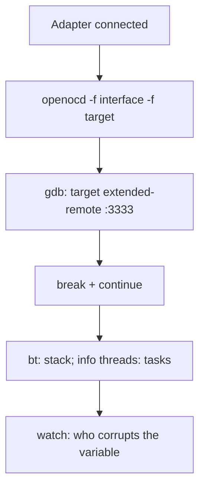

# JTAG Debugging on ESP32

Serial logs show *what* crashed. JTAG shows *where*: breakpoints, step execution, registers, FreeRTOS task stacks. Required for hangs, HardFaults, task races. It works on the same [[Home.en | hardware]], independent of [[09-Firmware/02-Arduino-PlatformIO.en | Arduino]] or [[09-Firmware/01-ESP-IDF-Setup.en | IDF]].

> [!IMPORTANT]
> After enabling [[08-Memory/04-Secure-Boot-Encrypt.en | Secure Boot + DIS_USB_JTAG]] JTAG closes forever. Debug before burning eFuse.

![[assets/img/jtag-openocd-gdb-scheme.png|600]]
*Fig. JTAG chain: TDI/TDO/TCK/TMS → OpenOCD → GDB: breakpoints, stack, registers.*

## Purpose

JTAG debugging on ESP32 - JTAG adapter options; OpenOCD: launch; GDB: breakpoints and stack. After enabling [[EN/08-Memory/04-Secure-Boot-Encrypt.en]] JTAG closes forever. Debug before burning eFuse. GPIO12-15 on ESP32 are strapping pins. Pull resistors of the JTAG adapter can break boot: turn the adapter off during normal flashing via [[EN/09-Firmware/04-Esptool-Flash.en]] if the board does not start.

## 1. JTAG adapter options

| Adapter | Chips | Speed | When to take |
| --- | --- | --- | --- |
| **Builtin USB-JTAG** (S3/C3/H2) | S3/C3/H2 | Up to about 1 Mbit | Free, enough for 90% of tasks |
| **ESP-Prog** (FT2232) | All | Stable | Espressif classic, JTAG + UART in one |
| FT2232H mini modules | All | Good | Cheaper than ESP-Prog |
| FT4232H mini modules | All | Good | 4 channels: JTAG + 3x UART/SPI - one adapter for the whole bench |
| ESP32 classic (no builtin) | ESP32/S2 | External only | External adapter mandatory |

JTAG pin table (external adapter):

| JTAG | ESP32 pin | ESP32-S3 pin | Note |
| --- | --- | --- | --- |
| TCK | GPIO13 | GPIO39 | Clock |
| TMS | GPIO14 | GPIO40 | Mode |
| TDI | GPIO12 | GPIO41 | Data input |
| TDO | GPIO15 | GPIO42 | Data output |
| GND | GND | GND | Common ground **mandatory** |
| VREF | 3V3 | 3V3 | Reference voltage |

> [!WARNING]
> GPIO12-15 on ESP32 are strapping pins. Pull resistors of the JTAG adapter can break boot: turn the adapter off during normal flashing via [[09-Firmware/04-Esptool-Flash.en | esptool]] if the board does not start.

Builtin USB-JTAG (S3): a USB cable into the `USB` port (not `UART`!) is enough + no driver needed, the device shows up as two interfaces (JTAG + CDC).

### JTAG-ESP-PROG and ESP-Bridge - the Espressif branded pair

| Item | What it is |
| --- | --- |
| JTAG-ESP-PROG (board) | Factory Espressif adapter: FT2232H (JTAG) + CP2102N (UART) on one board, 3.3/5 V power jumpers |
| ESP-Bridge (firmware) | Turns any ESP32-S2/S3 into a USB-JTAG/UART bridge: firmware from ESP-IDF examples, then a normal adapter |

> A homemade bridge from S3 is cheaper than ESP-Prog, but JTAG stability is lower - for daily debugging take real FTDI hardware.

## 2. OpenOCD: launch

```bash
# S3 builtin:
openocd -f board/esp32s3-builtin.cfg
# ESP-Prog + ESP32 classic:
openocd -f interface/ftdi/esp32_devkitj_v1.cfg -f target/esp32.cfg
# S3 + ESP-Prog:
openocd -f interface/ftdi/esp32_devkitj_v1.cfg -f target/esp32s3.cfg
# C3 builtin:
openocd -f board/esp32c3-builtin.cfg
```

Expected output: `Info: esp32s3: Target halted...`. If `JTAG scan chain interrogation failed` - check power, GND, TCK/TMS/TDI/TDO order.

| Config | Purpose |
| --- | --- |
| `board/esp32s3-builtin.cfg` | S3/C3 over USB |
| `interface/ftdi/esp32_devkitj_v1.cfg` | ESP-Prog |
| `target/esp32.cfg` / `esp32s3.cfg` / `esp32c3.cfg` | Target chip |
| `-c "adapter speed 20000"` | Lower speed on long wires |

## 3. GDB: breakpoints and stack

```bash
xtensa-esp32-elf-gdb build/app.elf -ex "target remote :3333"
# для S3 / C3 замінити префікс:
# xtensa-esp32s3-elf-gdb / riscv32-esp-elf-gdb
```

| GDB command | What it does |
| --- | --- |
| `mon reset halt` | Reset and stop the CPU |
| `flushregs` | Refresh registers after halt |
| `thb app_main` | Hardware break at start |
| `c` | Continue |
| `bt` | Call stack (where it hung) |
| `info threads` | FreeRTOS task list |
| `thread 3` + `bt` | Stack of one task |
| `p x` / `x/16xw 0x3FFB0000` | Variable / memory dump |
| `mon esp appimage_offset 0x10000` | App offset (with OTA slots) |

Typical session:

```text
(gdb) mon reset halt
(gdb) flushregs
(gdb) thb app_main
(gdb) c
Breakpoint 1, app_main () at main/app_main.c:17
(gdb) n            # наступний рядок
(gdb) bt           # де ми
(gdb) info threads # хто ще живе
```

> [!TIP]
> Build with `-g` (IDF does it by default in Debug). With no symbols GDB shows only addresses.

## 4. PlatformIO: one-button debugging

```ini
[env:esp32dev]
platform = espressif32
board = esp32dev
framework = arduino
debug_tool = esp-prog
debug_speed = 12000
debug_init_break = thb app_main
build_type = debug
```

| Action | How |
| --- | --- |
| Start debugging | Run icon → Debug (F5 in VS Code) |
| Breakpoint | Click left of the line number |
| Steps | Step Over / Into on the panel |
| WATCH | Add a variable to the Watch panel |

For builtin JTAG (S3):

```ini
debug_tool = esp-builtin
```

## 5. Arduino (gdb stub) and MicroPython

Minimal stack trace with no JTAG hardware:

```cpp
// Arduino-ESP32: вбудований GDB stub по Serial
#include <esp_gdbstub.h>
void setup() {
  Serial.begin(115200);
  gdbstub_init();   // при panic - керування через gdb по UART
}
```

```python
# MicroPython: програмний трейс замість JTAG
import sys, micropython
micropython.alloc_emergency_exception_buf(100)
try:
    1 // 0
except Exception as e:
    sys.print_exception(e)   # стек в REPL
```

ESP-IDF: `idf.py monitor` + `CONFIG_ESP_SYSTEM_PANIC_PRINT_HALT` gives registers with no JTAG; `coredump` in [[08-Memory/01-Partitions-NVS.en | partition]] + `esp-coredump.py info_corefile` is post-mortem analysis.

## 6. Common issues

| Symptom | Fix |
| --- | --- |
| `Target not examined` | No target power / TDI and TDO swapped |
| `JTAG scan failed` | Lower `adapter speed`, shorter wires (under 10 cm), common GND |
| GDB shows `??` | Wrong `.elf` (rebuilt after flash) - rebuild and reflash together |
| Breakpoints do not hit in flash | Few HW breaks (2 pcs) - set `thb` precisely |
| S3 not visible as JTAG | Cable in the UART port instead of USB; check `dmesg`, another cable |

### Mermaid: first debug session



## Official sources

- [JTAG Debugging (ESP-IDF)](https://docs.espressif.com/projects/esp-idf/en/latest/esp32/api-guides/jtag-debugging/index.html) - OpenOCD, GDB.
- [ESP-Prog Guide](https://docs.espressif.com/projects/esp-dev-kits/en/latest/other/esp-prog/user_guide.html) - hardware, jumpers.

## See also

- [[EN/Home.en]]
- [[EN/01-Hardware/06-Flash-PSRAM.en]]
- [[EN/08-Memory/01-Partitions-NVS.en]]
- [[EN/08-Memory/04-Secure-Boot-Encrypt.en]]
- [[EN/09-Firmware/01-ESP-IDF-Setup.en]]
- [[EN/09-Firmware/02-Arduino-PlatformIO.en]]
- [[09-Firmware/03-MicroPython.en | MicroPython]]
- [[EN/09-Firmware/04-Esptool-Flash.en]]
