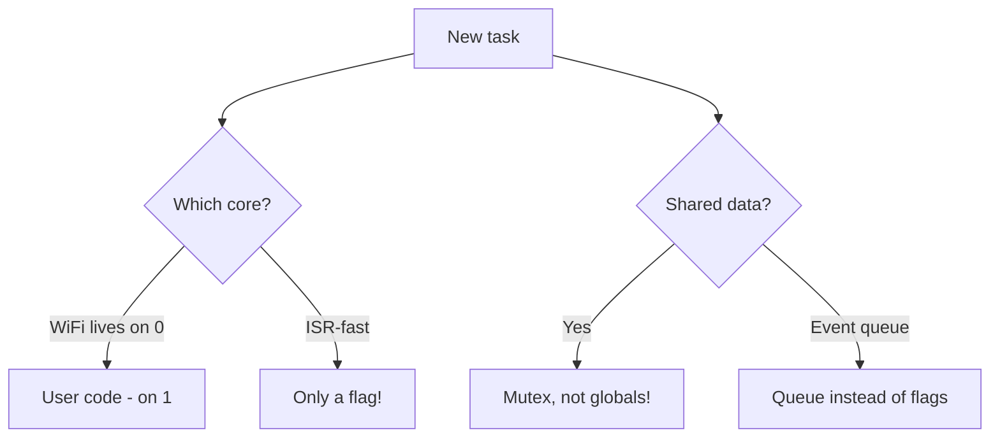

# FreeRTOS Patterns on ESP32

## Purpose

FreeRTOS in ESP-IDF is an SMP core (two cores on ESP32/S3) on top of which Wi-Fi, BT, TCP/IP and the whole `app_main` live. This note is a collection of proven patterns: how to split logic into tasks, not starve IDLE, how queues differ from direct notifications, when to take event groups and timers, how to pin tasks to cores (because Wi-Fi lives on core 0!), how to feed the watchdog, how to sleep via tickless idle + light sleep, what is allowed in ISR (IRAM, no `printf`), how to cure priority inversion with mutexes and how not to walk into a deadlock. The final example is a WiFi-MQTT state machine on `switch/enum`. The base start is [[EN/09-Firmware/01-ESP-IDF-Setup.en]], background supervision is [[07-Timers/02-WDT.en | WDT]], sleep is [[07-Timers/03-Sleep-ULP.en | Sleep/ULP]], updates are [[08-Memory/03-OTA.en | OTA]].

> [!NOTE]
> ESP-IDF starts FreeRTOS automatically. Never call `vTaskStartScheduler()` yourself - your entry point is `app_main()`, which already runs in the `main` task with priority 1.

![[assets/img/freertos-patterns-scheme.png|600]]
*Fig. FreeRTOS patterns: tasks, queues, mutexes, timers and core pinning.*

## 1. Tasks and priorities: do not starve IDLE

| Concept | Meaning on ESP-IDF | Rule |
| --- | --- | --- |
| `tskIDLE_PRIORITY` = 0 | Each core has its own IDLE task | Never put worker tasks on 0 without need |
| `configMAX_PRIORITIES` = 25 | Range 0-24 | Keep application logic at 2-10 |
| Wi-Fi/BT priority | High (20+) on core 0 | Do not compete with them at priority 23 |
| `vTaskDelay()` / blocking | Gives CPU away | Every task loop must block |
| `while(1){}` with no yield | IDLE hunger → TWDT reset | Forbidden, see [[07-Timers/02-WDT.en | WDT]] |
| Task stack | Given in **bytes** (not words!) | Sensors 2048-3072, network 4096-8192 |

> [!WARNING]
> The IDLE task feeds the Task Watchdog and cleans memory of deleted tasks. A task with higher priority that never blocks starves IDLE - you get `Task watchdog got triggered ... IDLE0`.

ESP-IDF code - task creation with and without pinning:

```c
#include "freertos/FreeRTOS.h"
#include "freertos/task.h"

void sensor_task(void *arg) {
    TickType_t last = xTaskGetTickCount();
    for (;;) {
        // 1. читання сенсора
        // 2. відправка в чергу
        xTaskDelayUntil(&last, pdMS_TO_TICKS(100)); // строга періодика 10 Гц
    }
}

void app_main(void) {
    // мережева задача на APP_CPU, сенсорна - без affinity (мігрує)
    xTaskCreatePinnedToCore(sensor_task, "sensor", 3072, NULL, 5, NULL, 1);
    xTaskCreate(sensor_task, "sensor_any", 3072, NULL, 5, NULL); // tskNO_AFFINITY
}
```

Arduino code - FreeRTOS is available right in the sketch:

```cpp
void TaskBlink(void *arg) {
  for (;;) {
    digitalWrite(LED_BUILTIN, !digitalRead(LED_BUILTIN));
    vTaskDelay(pdMS_TO_TICKS(500));
  }
}

void setup() {
  pinMode(LED_BUILTIN, OUTPUT);
  // Arduino loop() сам є задачею з пріоритетом 1 на ядрі 1
  xTaskCreatePinnedToCore(TaskBlink, "blink", 2048, NULL, 2, NULL, 1);
}
void loop() {
  vTaskDelay(pdMS_TO_TICKS(1000)); // не голодувати IDLE!
}
```

MicroPython code - few threads, emulate with cooperative style:

```python
import _thread, time
from machine import Pin
led = Pin(2, Pin.OUT)
def blink():
    while True:
        led.value(not led.value())
        time.sleep(0.5)  # аналог vTaskDelay - віддає GIL
_thread.start_new_thread(blink, ())
while True:
    time.sleep(1)
```

## 2. Queues vs direct notifications (task notifications)

| Criterion | `xQueue` | `xTaskNotify*` / `ulTaskNotifyTake` |
| --- | --- | --- |
| Speed | Slower (copy + blocking) | Fastest IPC, about 45% faster |
| Memory | Buffer for N items | 32-bit value in TCB, 0 RAM |
| Many senders | Yes, many producers | No, 1:1 (one receiver strictly) |
| Many receivers | Yes (but each item to one) | No |
| Data | Any struct (copy) | 32 bits or a pointer (no copy) |
| From ISR | `xQueueSendFromISR()` | `vTaskNotifyGiveFromISR()` - lighter |
| When to take | Sensor to processing, commands, logger | Signal "event fired", GPIO event |

> [!TIP]
> Rule of thumb: data flow - queue; event signal - notification. Do not pull a 256-byte struct through a notification as a stack pointer - the pointer goes stale.

ESP-IDF code - queue from sensor to network:

```c
QueueHandle_t q;
typedef struct { float temp; float hum; uint32_t seq; } sample_t;

void sensor_task(void *arg) {
    sample_t s = {0};
    for (;;) {
        s.temp = 25.0f; s.seq++;
        xQueueSend(q, &s, pdMS_TO_TICKS(50)); // timeout, не block forever
        vTaskDelay(pdMS_TO_TICKS(1000));
    }
}
void net_task(void *arg) {
    sample_t s;
    for (;;) {
        if (xQueueReceive(q, &s, portMAX_DELAY) == pdTRUE) {
            // publish MQTT
        }
    }
}
void app_main(void) {
    q = xQueueCreate(16, sizeof(sample_t));
    xTaskCreatePinnedToCore(sensor_task, "sens", 3072, NULL, 5, NULL, 1);
    xTaskCreatePinnedToCore(net_task, "net", 4096, NULL, 6, NULL, 1);
}
```

ESP-IDF code - direct notification from a button ISR:

```c
TaskHandle_t btn_task_h = NULL;
void IRAM_ATTR gpio_isr(void *arg) {
    BaseType_t hp = pdFALSE;
    vTaskNotifyGiveFromISR(btn_task_h, &hp);
    portYIELD_FROM_ISR(hp);
}
void btn_task(void *arg) {
    for (;;) {
        ulTaskNotifyTake(pdTRUE, portMAX_DELAY); // спати до натискання
        // debounce + дія
    }
}
```

## 3. Event Groups: flags to "wait for many events"

| Property | Value |
| --- | --- |
| Size | 24 user bits (upper 8 are service) |
| Operations | `xEventGroupSetBits/WaitBits/ClearBits`, `...FromISR` |
| Wait modes | `pdTRUE` - wait for ALL bits, `pdFALSE` - ANY bit |
| Auto-clear | `xClearOnExit=pdTRUE` - bits die on exit |
| When to take | Wi-Fi connected + MQTT connected + NTP sync to start |
| When NOT to take | Data transfer (take a queue!), counters (take a semaphore) |

```c
#include "freertos/event_groups.h"
#define BIT_WIFI_OK BIT0
#define BIT_MQTT_OK BIT1
#define BIT_NTP_OK  BIT2
EventGroupHandle_t ev;

void logic_task(void *arg) {
    EventBits_t b = xEventGroupWaitBits(ev, BIT_WIFI_OK | BIT_MQTT_OK | BIT_NTP_OK,
        pdTRUE, pdTRUE, portMAX_DELAY); // всі + очистити
    // старт основної логіки
    for (;;) { vTaskDelay(pdMS_TO_TICKS(1000)); }
}
void wifi_cb(void) { xEventGroupSetBits(ev, BIT_WIFI_OK); }
void app_main(void) {
    ev = xEventGroupCreate();
    xTaskCreate(logic_task, "logic", 4096, NULL, 5, NULL);
}
```

## 4. Software timers (Timer Service)

| Parameter | Value |
| --- | --- |
| Daemon task `Tmr Svc` | Priority `CONFIG_FREERTOS_TIMER_TASK_PRIORITY` (usually 1-2), core 0 |
| Precision | Tick level (1 ms at 1000 Hz), not for microseconds |
| One-shot vs auto-reload | `pdFALSE` / `pdTRUE` |
| Callback context | Timer task - **do not block**, only SetBits/Send |
| Heavy work | From callback - `xQueueSend()`, work - in a task |
| Alternative | `esp_timer` (more precise, us, ISR dispatch) - see [[07-Timers/01-Timers-MCPWM-PCNT-RMT.en | Timers]] |

```c
#include "freertos/timers.h"
TimerHandle_t t;
void tmr_cb(TimerHandle_t h) {
    // тільки швидке: дати семафор / нотифікацію
}
void app_main(void) {
    t = xTimerCreate("poll", pdMS_TO_TICKS(5000), pdTRUE, NULL, tmr_cb);
    xTimerStart(t, 0);
}
```

Arduino equivalent (simpler via `Ticker` style or `millis()`):

```cpp
uint32_t last = 0;
void loop() {
  if (millis() - last > 5000) { last = millis(); pollSensors(); }
}
```

## 5. Pinning to cores: Wi-Fi lives on 0

| Core | Who lives there | What to pin |
| --- | --- | --- |
| Core 0 = PRO_CPU | Wi-Fi, BT, TCP/IP, `esp_timer`, Timer Service | Do NOT put heavy loops here |
| Core 1 = APP_CPU | `app_main`, Arduino `loop()` | Sensors, display, logic, MQTT-publish |
| `tskNO_AFFINITY` | Migration between cores | OK for light tasks, worse cache |
| `CONFIG_FREERTOS_UNICORE` | Core 0 only (C3/S2 are single-core) | Pinning ignored, code must build anyway |
| FPU trap | A task that touched `float` auto-pins | Do not wonder at migration artifacts |

> [!CAUTION]
> A heavy loop with `float` math on Core 0 + active Wi-Fi means ping jitter and MQTT drops. Measure with `vTaskGetRunTimeStats()`.

```c
// Правило: мережа-споживач на 1, Wi-Fi не чіпаємо
xTaskCreatePinnedToCore(mqtt_task, "mqtt", 6144, NULL, 6, NULL, 1);
xTaskCreatePinnedToCore(display_task, "disp", 4096, NULL, 4, NULL, 1);
// ISR-сервіс і системне - хай лишаються на 0
```

Typical project priority table:

| Task | Core | Priority | Stack |
| --- | --- | --- | --- |
| IDLE | 0/1 | 0 | system |
| `loop` / `main` | 1 | 1 | 8 KB |
| Buttons/LED | 1 | 2-3 | 2 KB |
| Sensors I2C | 1 | 5 | 3 KB |
| Display/LVGL | 1 | 4 | 4-8 KB |
| MQTT-publish | 1 | 6 | 6 KB |
| TWDT-guard | any | 7+ | 2 KB |

## 6. Task watchdog (TWDT): feed on time

| Parameter | Value |
| --- | --- |
| What it watches | IDLE0/IDLE1 by default, + your subscriptions |
| Timeout | `CONFIG_ESP_TASK_WDT_TIMEOUT_S` (typically 5 s) |
| Subscribe | `esp_task_wdt_add(NULL)` - current task |
| Feed | `esp_task_wdt_reset()` in the loop |
| Panic mode | `CONFIG_ESP_TASK_WDT_PANIC` - panic instead of warning |
| Long operations | `erase_flash`, bulk-write - raise timeout or unsubscribe for a while |

```c
#include "esp_task_wdt.h"
void heavy_task(void *arg) {
    esp_task_wdt_add(NULL);
    for (;;) {
        do_chunk_of_work();          // < 5 с!
        esp_task_wdt_reset();        // погодувати
        vTaskDelay(pdMS_TO_TICKS(10)); // дати IDLE подихати
    }
}
```

> [!TIP]
> Log `Task watchdog got triggered ... Tasks currently running: main` means the `main`/`loop` task spins with no `delay`. Details - [[07-Timers/02-WDT.en | WDT]].

## 7. Tickless idle + light sleep: sleep between ticks

| Option | What it does |
| --- | --- |
| `CONFIG_FREERTOS_USE_TICKLESS_IDLE` | Stops the periodic tick, sets a timer for the nearest deadline |
| `esp_pm_configure()` + `ESP_PM_CPU_FREQ_MAX` | DFS + auto entry into light sleep |
| Wi-Fi modem-sleep | Radio wakes on beacon, CPU sleeps |
| `esp_light_sleep_start()` | Manual entry, wake from GPIO/UART/timer |
| Sleep ban | `esp_pm_lock_acquire()` for a sensitive operation (I2S, RMT-tx) |

```c
#include "esp_pm.h"
void app_main(void) {
    esp_pm_config_t cfg = {
        .max_freq_mhz = 240,
        .min_freq_mhz = 40,
        .light_sleep_enable = true, // tickless + light sleep
    };
    esp_pm_configure(&cfg);
    xTaskCreate(sensor_task, "sens", 3072, NULL, 5, NULL);
}
```

> [!WARNING]
> Light sleep powers down APB peripherals. Logging at the sleep moment can give garbage - flush UART (`fflush(stdout)`) before sleep.

## 8. ISR rules: IRAM, no printf

| Rule | Why |
| --- | --- |
| `IRAM_ATTR` on the handler | Flash may be unavailable (cache off during write) |
| Only `...FromISR()` API | Plain calls assert or deadlock |
| No `printf` / `ESP_LOGx` | `printf` takes a mutex and walks into flash, crash |
| Short: under 10 us | Long work - defer to a task via queue/semaphore |
| `portYIELD_FROM_ISR(hp)` | Ask for reschedule if a higher priority woke |
| Shared data | `volatile` + critical section or atomic |

```c
static QueueHandle_t isr_q;
void IRAM_ATTR pulse_isr(void *arg) {
    uint32_t t = xTaskGetTickCountFromISR();
    BaseType_t hp = pdFALSE;
    xQueueSendFromISR(isr_q, &t, &hp);
    if (hp) portYIELD_FROM_ISR(hp);
}
// Погано в ISR: printf, vTaskDelay, xQueueSend (без FromISR), malloc, ESP_LOGI
```

MicroPython comparison (ISR = hard IRQ, even stricter):

```python
from machine import Pin
def cb(p):
    # тільки прапорець! ніяких print/i2c/alloc
    global flag
    flag = True
btn = Pin(0, Pin.IN, Pin.PULL_UP)
btn.irq(trigger=Pin.IRQ_FALLING, handler=cb)
```

## 9. Priority inversion + mutex: priority inheritance

| Primitive | Mutual exclusion | Priority inheritance | ISR | When |
| --- | --- | --- | --- | --- |
| `xSemaphoreCreateMutex()` | Yes | Yes (main feature) | No | Shared I2C/SPI, logger |
| Binary semaphore | No (sync) | No | Yes (Give) | ISR to task signal |
| Counting semaphore | No (N resources) | No | Yes | Buffer pool |
| Recursive mutex | Yes (same owner N times) | Yes | No | Rare, better refactor |
| Spinlock `portMUX` | Yes (short ISR sections) | N/A | Yes | 2-3 instructions, not tasks! |

Inversion scenario: L(2) holds a mutex, H(8) blocks on the mutex, M(5) preempts L, H waits though more important than M. A FreeRTOS mutex briefly raises L to 8 (inheritance) - M does not fit in.

```c
SemaphoreHandle_t i2c_mtx;
void task_a(void *arg) {
    for (;;) {
        if (xSemaphoreTake(i2c_mtx, pdMS_TO_TICKS(100)) == pdTRUE) {
            i2c_read_sensor();       // критична секція коротка!
            xSemaphoreGive(i2c_mtx);
        }
        vTaskDelay(pdMS_TO_TICKS(50));
    }
}
void app_main(void) {
    i2c_mtx = xSemaphoreCreateMutex();
    xTaskCreate(task_a, "a", 3072, NULL, 5, NULL);
}
```

## 10. Deadlock anti-patterns

| Anti-pattern | Replace with |
| --- | --- |
| Two mutexes in different order (A to B in one task, B to A in another) | Global lock order: always A then B |
| `Take` with no timeout (`portMAX_DELAY`) on an app mutex | 50-100 ms timeout + counter + `ESP_LOGW` |
| Blocking call inside a critical section | Move `vTaskDelay/xQueueReceive` outside `ENTER_CRITICAL` |
| `vTaskDelete()` of a foreign task that holds a mutex | `stop_requested` flag + `vTaskDelete(NULL)` (self-delete) |
| Wi-Fi callback that waits for a task it blocked itself | Event bits instead of waiting |
| Recursive `Take` of a plain mutex twice | Recursive mutex or drop nesting |

```c
// Правильний порядок: завжди bus_mtx -> log_mtx, ніколи навпаки
xSemaphoreTake(bus_mtx, pdMS_TO_TICKS(100));
xSemaphoreTake(log_mtx, pdMS_TO_TICKS(100));
// ... робота ...
xSemaphoreGive(log_mtx);
xSemaphoreGive(bus_mtx);
```

## 11. WiFi-MQTT state machine on switch/enum (full example)

| State | Entry | Exit |
| --- | --- | --- |
| `ST_WIFI_DOWN` | Start / drop | `esp_wifi_connect()` |
| `ST_WIFI_UP` | `WIFI_EVENT_STA_CONNECTED` | Start MQTT |
| `ST_MQTT_DOWN` | MQTT disconnect | `esp_mqtt_client_reconnect()` with backoff |
| `ST_MQTT_UP` | `MQTT_EVENT_CONNECTED` | Publish/Subscribe loop |
| Any | `WIFI_EVENT_STA_DISCONNECTED` | To `ST_WIFI_DOWN`, stop publish |

```c
typedef enum { ST_WIFI_DOWN, ST_WIFI_UP, ST_MQTT_DOWN, ST_MQTT_UP } conn_state_t;
static conn_state_t st = ST_WIFI_DOWN;
static uint8_t retry = 0;

void conn_task(void *arg) {
    for (;;) {
        switch (st) {
        case ST_WIFI_DOWN:
            esp_wifi_connect();
            // перехід по event-у в обробнику подій:
            break;
        case ST_WIFI_UP:
            mqtt_app_start(); // один раз
            st = ST_MQTT_DOWN;
            break;
        case ST_MQTT_DOWN:
            retry++;
            vTaskDelay(pdMS_TO_TICKS(retry < 5 ? 2000 : 15000)); // backoff
            break;
        case ST_MQTT_UP:
            mqtt_publish_heartbeat();
            vTaskDelay(pdMS_TO_TICKS(10000));
            break;
        }
    }
}
// В event-хендлері тільки перемикання:
// WIFI_EVENT_STA_CONNECTED -> st = ST_WIFI_UP; retry = 0;
// WIFI_EVENT_STA_DISCONNECTED -> st = ST_WIFI_DOWN;
// MQTT_EVENT_CONNECTED -> st = ST_MQTT_UP; retry = 0;
// MQTT_EVENT_DISCONNECTED -> st = (wifi_ok ? ST_MQTT_DOWN : ST_WIFI_DOWN);
```

Arduino version of the same machine:

```cpp
enum ConnState { WIFI_DOWN, WIFI_UP, MQTT_DOWN, MQTT_UP };
ConnState st = WIFI_DOWN;
void loop() {
  switch (st) {
    case WIFI_DOWN: if (WiFi.status() == WL_CONNECTED) st = WIFI_UP; else WiFi.reconnect(); break;
    case WIFI_UP: mqtt_connect_once(); st = MQTT_DOWN; break;
    case MQTT_DOWN: if (mqtt.connected()) st = MQTT_UP; break;
    case MQTT_UP: if (!mqtt.connected()) st = WIFI_DOWN; else mqtt.loop(); break;
  }
  delay(100);
}
```

MicroPython version (`uasyncio` - see [[09-Firmware/08-Tooling-Deep.en | Tooling-Deep]]):

```python
import asyncio, network
ST_WIFI_DOWN, ST_MQTT_DOWN, ST_MQTT_UP = 0, 1, 2
async def conn():
    st = ST_WIFI_DOWN
    wlan = network.WLAN(network.STA_IF)
    wlan.active(True)
    while True:
        if st == ST_WIFI_DOWN:
            if not wlan.isconnected(): wlan.connect("SSID", "PASS")
            else: st = ST_MQTT_DOWN
        elif st == ST_MQTT_DOWN:
            try:
                # mqtt.connect() ...
                st = ST_MQTT_UP
            except OSError: pass
        elif st == ST_MQTT_UP:
            # await mqtt.ping()
            pass
        await asyncio.sleep(2)
```

## 12. Common issues

| Symptom | Cause | Fix |
| --- | --- | --- |
| `Task watchdog got triggered ... IDLE0` | Loop with no `vTaskDelay` / blocking | Add `vTaskDelay` or a blocking `xQueueReceive` |
| `Stack overflow in task sensor` | Small stack, large buffer on stack | Grow the stack, `uxTaskGetStackHighWaterMark()`, move buffer to static/heap |
| `Interrupt wdt timeout on CPU0` | Long critical section / ISR | Shorten ISR, move work to a task |
| Guru Meditation `LoadProhibited` in queue | Pointer to local stack via notification | Copy data into the queue, not a pointer |
| Wi-Fi drops under CPU0 load | Heavy task on PRO_CPU | Re-pin to core 1 |
| `assert failed: xQueueGenericSend` from ISR | Non-FromISR call | Only `...FromISR()` + `portYIELD_FROM_ISR` |
| Crash in ISR on `ESP_LOGI` | Logger walks into flash/mutex | Flag + deferred logging in a task |
| Deadlock of two tasks | Different mutex order | Single order + `Take` timeouts |
| MQTT does not reconnect | No machine, `while(!connect)` blocks IDLE | State machine with backoff (sec. 11) |
| `float` slows / strange migration | FPU auto-pins the task | Compute float on one core deliberately |

## Official sources

- [ESP-IDF - FreeRTOS Overview (SMP, priorities, affinity)](https://docs.espressif.com/projects/esp-idf/en/stable/esp32/api-reference/system/freertos.html)
- [ESP-IDF - FreeRTOS IDF (tasks, scheduler, critical sections)](https://docs.espressif.com/projects/esp-idf/en/stable/esp32/api-reference/system/freertos_idf.html)
- [ESP-IDF - Watchdogs (IWDT/TWDT, task subscription)](https://docs.espressif.com/projects/esp-idf/en/stable/esp32/api-reference/system/wdts.html)
- [ESP-IDF - Sleep Modes (light sleep, wakeup)](https://docs.espressif.com/projects/esp-idf/en/stable/esp32/api-reference/system/sleep_modes.html)
- [FreeRTOS - Official Book / Docs (queues, semaphores, timers)](https://www.freertos.org/Documentation/RTOS_book.html)

### Mermaid: where a task should live



## See also

- [[EN/Home.en]]
- [[EN/09-Firmware/01-ESP-IDF-Setup.en]]
- [[EN/09-Firmware/02-Arduino-PlatformIO.en]]
- [[09-Firmware/03-MicroPython.en | MicroPython]]
- [[EN/09-Firmware/07-Testing-CI.en]]
- [[EN/09-Firmware/08-Tooling-Deep.en]]
- [[EN/07-Timers/02-WDT.en]]
- [[08-Memory/03-OTA.en | OTA]]
