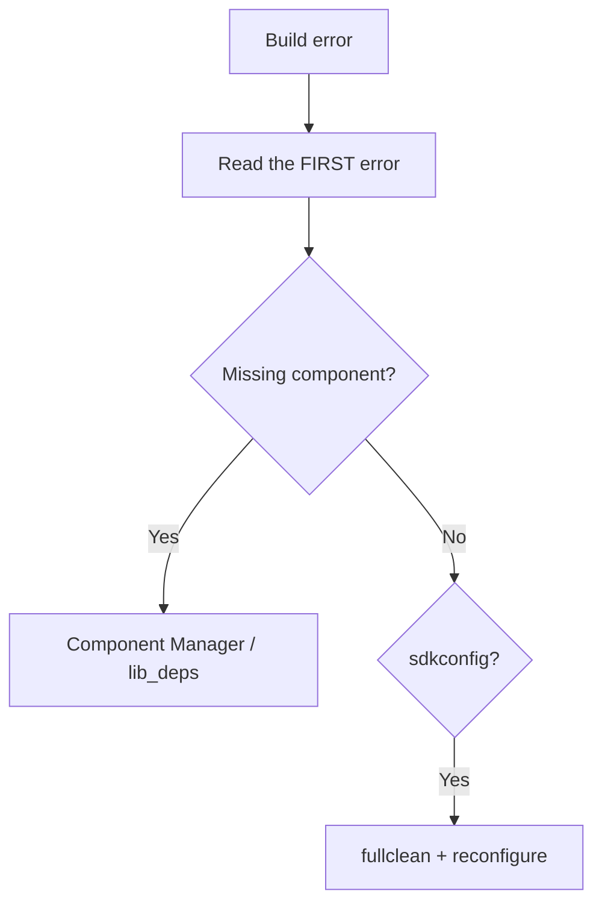

# Deep Toolchain: IDF Components, PlatformIO, MicroPython

## Purpose

When `blink` works, real engineering starts: own components with `idf_component.yml`, reproducible configs via `sdkconfig.defaults`, minimal CMake with no magic, one `platformio.ini` for many boards with `extra_scripts` + `monitor_filters` + OTA upload, and for MicroPython - frozen modules, `mpy-cross` compiler, `ulab` number crusher (numpy!), `asyncio`/`uasyncio` server and an honest talk about performance (Viper/emitter - overview, with caveats). The base is [[EN/09-Firmware/01-ESP-IDF-Setup.en]], the quick start is [[EN/09-Firmware/02-Arduino-PlatformIO.en]], the interpreter is [[09-Firmware/03-MicroPython.en | MicroPython]], multitasking is [[EN/09-Firmware/06-FreeRTOS-Patterns.en]], quality is [[EN/09-Firmware/07-Testing-CI.en]].

> [!NOTE]
> Reproducibility rule: clone to one command to the same binary. This is given by `sdkconfig.defaults` + `dependencies.lock` + pinned `platform = espressif32@x.y.z`.

![[assets/img/tooling-deep-scheme.png|600]]
*Fig. Deep toolchain: Component Manager, sdkconfig profiles, PlatformIO matrix, MicroPython frozen and ulab.*

## 1. IDF Component Manager: dependencies as in npm, only for C

| Concept | Where | What it does |
| --- | --- | --- |
| Manifest `idf_component.yml` | Root of each component | Declares name, version, dependencies |
| Registry `components.espressif.com` | Cloud | `idf.py add-dependency espressif/mqtt^1.3` |
| `managed_components/` | Generated | Do not commit! Only `dependencies.lock` |
| `dependencies.lock` | Project root | Pins exact versions - commit mandatory |
| `idf.py create-manifest` | CLI | Manifest template for `main`/own component |
| `idf.py update-dependencies` | CLI | Pull new versions per ranges |
| `IDF_COMPONENT_MANAGER=0` | Env | Disable manager (offline/vendoring) |

Version range table:

| Entry | Meaning |
| --- | --- |
| `example/cmp: ">=1.0.0"` | Any newer than 1.0.0 |
| `example/cmp: "^1.2.3"` | `>=1.2.3, <2.0.0` (recommended) |
| `example/cmp: "~1.2.3"` | `>=1.2.3, <1.3.0` |
| `example/cmp: "<=3.3.3"` | No newer than 3.3.3 |
| `test_component: {git: ..., path: ...}` | Dependency from a Git monorepo |

ESP-IDF code - own component `components/sensor_hub/idf_component.yml`:

```yaml
version: "2.1.0"
description: "I2C sensor hub for weather station"
url: "https://github.com/org/esp-sensor-hub"
targets:
  - esp32
  - esp32s3
  - esp32c3
dependencies:
  idf: ">=5.1"
  espressif/mqtt: "^1.3.0"
  bblanchon/arduinojson: null  # тільки для прикладу, зазвичай C-компоненти
```

ESP-IDF code - adding a dependency:

```bash
idf.py create-manifest --component=sensor_hub
idf.py add-dependency --component=sensor_hub espressif/mqtt^1.3.0
idf.py reconfigure          # менеджер скачає в managed_components/
cat dependencies.lock       # перевірити піни
```

> [!TIP]
> Put your own component that overrides a system one (for example your own `mqtt`) in `components/` - priority: project > `managed_components` > IDF. But do not abuse it: IDF updates pass you by.

Arduino comparison code (PlatformIO libraries - registry analog):

```ini
lib_deps =
  bblanchon/ArduinoJson @ ^7.0.0
  madhephaestus/ESP32Encoder @ ^0.11.0
```

MicroPython comparison code (`mip` packages - see [[09-Firmware/03-MicroPython.en | MicroPython]]):

```python
import mip
mip.install("umqtt.simple")
```

## 2. sdkconfig.defaults: config as code

| File | Commit? | Purpose |
| --- | --- | --- |
| `sdkconfig` | No (artifact!) | Generated `menuconfig`, full dump |
| `sdkconfig.defaults` | Yes | Your deliberate overrides, 10-30 lines |
| `sdkconfig.defaults.esp32s3` | Yes | Target-specific (PSRAM, USB) |
| `sdkconfig.defaults.prod` / `.debug` | Yes | Profiles: prod vs rig |
| `sdkconfig.old` | No | Backup after `set-target` |
| `SDKCONFIG_DEFAULTS` (CMake) | Yes | Glue of many defaults files |

Code - `sdkconfig.defaults` for a weather station:

```ini
# --- target ---
CONFIG_IDF_TARGET="esp32s3"
# --- flash/PSRAM ---
CONFIG_ESPTOOLPY_FLASHSIZE_16MB=y
CONFIG_SPIRAM=y
CONFIG_SPIRAM_SIZE_8MB=y
# --- FreeRTOS ---
CONFIG_FREERTOS_HZ=1000
CONFIG_FREERTOS_IDLE_TASK_STACKSIZE=2048
# --- логи: прод тихий ---
CONFIG_LOG_DEFAULT_LEVEL_INFO=y
CONFIG_LOG_MAXIMUM_LEVEL_INFO=y
# --- OTA + rollback ---
CONFIG_BOOTLOADER_APP_ROLLBACK_ENABLE=y
CONFIG_PARTITION_TABLE_TWO_OTA=y
# --- Wi-Fi ---
CONFIG_ESP_WIFI_STATIC_RX_BUFFER_NUM=8
CONFIG_ESP_WIFI_DYNAMIC_RX_BUFFER_NUM=16
```

Code - profile glue in the project `CMakeLists.txt`:

```cmake
cmake_minimum_required(VERSION 3.22)
include($ENV{IDF_PATH}/tools/cmake/project.cmake)
# прод: спільне + платне
set(SDKCONFIG_DEFAULTS "sdkconfig.defaults;sdkconfig.defaults.${IDF_TARGET}")
project(weather-station)
```

Common option table:

| Option | Effect |
| --- | --- |
| `CONFIG_COMPILER_OPTIMIZATION_SIZE=y` | `-Os`, less flash, a bit slower |
| `CONFIG_COMPILER_OPTIMIZATION_PERF=y` | `-O2`, faster, more flash |
| `CONFIG_ESP_TASK_WDT_TIMEOUT_S=10` | Longer TWDT for flash erase |
| `CONFIG_PM_ENABLE=y` + `CONFIG_FREERTOS_USE_TICKLESS_IDLE=y` | Light sleep between ticks |
| `CONFIG_ESP_SLEEP_POWER_DOWN_FLASH=y` | Power down flash in light sleep (careful!) |

> [!WARNING]
> Committed `sdkconfig` instead of `sdkconfig.defaults` means conflicts on every `menuconfig` and unreproducible builds. Add `sdkconfig` to `.gitignore`.

## 3. CMake minimum: three files, no magic

| File | Minimum |
| --- | --- |
| Root `CMakeLists.txt` | 3 lines: `cmake_minimum_required` + `include(project.cmake)` + `project()` |
| `main/CMakeLists.txt` | `idf_component_register(SRCS ... REQUIRES ...)` |
| `components/foo/CMakeLists.txt` | Same + `INCLUDE_DIRS` |
| `Kconfig` / `Kconfig.projbuild` | Optional, `menuconfig` items |
| `project_include.cmake` | Rare, global flags before configuration |

Code - root `CMakeLists.txt`:

```cmake
cmake_minimum_required(VERSION 3.22)
include($ENV{IDF_PATH}/tools/cmake/project.cmake)
project(weather-station)
```

Code - `main/CMakeLists.txt`:

```cmake
idf_component_register(
  SRCS "main.c" "wifi_app.c" "mqtt_app.c"
  INCLUDE_DIRS "."
  REQUIRES esp_wifi esp_netif mqtt nvs_flash sensor_hub
  PRIV_REQUIRES esp_timer)
```

Code - `components/sensor_hub/CMakeLists.txt` with conditional build:

```cmake
set(srcs "hub.c" "hub_i2c.c")
if(CONFIG_SENSOR_HUB_ENABLE_BME280)
  list(APPEND srcs "bme280_convert.c")
endif()
idf_component_register(SRCS "${srcs}"
                       INCLUDE_DIRS "include"
                       REQUIRES driver log)
# придушити чужий warning, не чіпаючи апстрим:
target_compile_options(${COMPONENT_LIB} PRIVATE -Wno-unused-variable)
```

`REQUIRES` vs `PRIV_REQUIRES` table:

| Where the include is | Where to write |
| --- | --- |
| Public `.h` includes `mqtt_client.h` | `REQUIRES mqtt` |
| Only `.c` includes `esp_timer.h` | `PRIV_REQUIRES esp_timer` |
| `driver/i2c.h` in both | `REQUIRES driver` |
| Nothing foreign | May skip both (common components resolve themselves) |

## 4. PlatformIO: one ini for many boards + scripts + filters + OTA

| Feature | Option | Why |
| --- | --- | --- |
| Board matrix | `[env:esp32dev]`, `[env:esp32s3]`, `[env:xiao_c3]` | One code, three binaries |
| Shared | `[env]` + `extends` | No duplicate `framework/monitor_speed` |
| Script | `extra_scripts = pre:scripts/version.py` | Git version into `build_flags` |
| Monitor filters | `monitor_filters = esp32_exception_decoder, colorize, time` | Readable crash dumps |
| Filesystem | `board_build.filesystem = littlefs` | `pio run -t uploadfs` |
| OTA upload | `upload_protocol = espota` + `upload_port` | Firmware over Wi-Fi |
| Partitions | `board_build.partitions = partitions_16MB.csv` | Custom for OTA |

Code - `platformio.ini` for three boards:

```ini
[env]
framework = arduino
monitor_speed = 115200
upload_speed = 921600
monitor_filters = esp32_exception_decoder, colorize, time, log2file
lib_deps =
  bblanchon/ArduinoJson @ ^7.0.0
extra_scripts = pre:scripts/version.py

[env:esp32dev]
platform = espressif32 @ 6.7.0
board = esp32dev
board_build.partitions = default_4MB.csv
build_flags =
  ${env.build_flags}
  -DCORE_DEBUG_LEVEL=3
  -DBOARD_ESP32DEV=1

[env:esp32s3]
platform = espressif32 @ 6.7.0
board = esp32-s3-devkitc-1
board_build.filesystem = littlefs
board_build.partitions = partitions_16MB.csv
build_flags =
  ${env.build_flags}
  -DCORE_DEBUG_LEVEL=3
  -DBOARD_HAS_PSRAM
  -mfix-esp32-psram-cache-issue

[env:xiao_c3]
platform = espressif32 @ 6.7.0
board = seeed_xiao_esp32c3
board_build.partitions = default_4MB.csv
build_flags =
  ${env.build_flags}
  -DCORE_DEBUG_LEVEL=1

[env:ota_lab]
extends = env:esp32s3
upload_protocol = espota
upload_port = esp32-lab.local
upload_flags =
  --port=3232
  --auth=${sysenv.OTA_PASS}
```

Code - `scripts/version.py` (git version, see [[09-Firmware/07-Testing-CI.en | Testing-CI]]):

```python
# scripts/version.py - pre-скрипт PlatformIO
import subprocess
Import("env")
try:
    sha = subprocess.check_output(["git", "rev-parse", "--short", "HEAD"]).decode().strip()
    ver = open("version.txt").read().strip()
except Exception:
    sha, ver = "nogit", "0.0.0"
env.Append(CPPDEFINES=[("FW_VERSION", f'\\"{ver}+g{sha}\\"')])
print(f"[version] FW_VERSION={ver}+g{sha}")
```

Code - OTA upload from CLI:

```bash
pio run -e esp32s3 -t upload                 # по USB
pio run -e ota_lab -t upload                 # по Wi-Fi (espota)
pio run -e esp32s3 -t uploadfs               # тільки LittleFS
pio run -e esp32s3 -t erase                  # стерти flash
pio device monitor -e esp32s3                # з exception_decoder
```

> [!TIP]
> `monitor_filters = esp32_exception_decoder` turns `Backtrace: 0x400d...` into function names. Without it crash debugging is fortune-telling.

## 5. MicroPython: frozen modules (library inside firmware)

| Approach | Where the code lives | Pros / cons |
| --- | --- | --- |
| `main.py` on FS | Flash FS | Easy to edit, eats RAM, password visible |
| `.mpy` (mpy-cross) | Flash FS | Less RAM, faster import |
| Frozen module | Inside firmware itself (ROM) | 0 RAM for parsing, never erased, harder build |
| `mip` package | `/lib` | Fast to install, needs network |

Code - freeze your own driver in your own MicroPython build:

```bash
# ports/esp32/modules/bme280_frozen.py  <- ваш файл
# ports/esp32/boards/ESP32_GENERIC/manifest.py:
freeze("$(PORT_DIR)/modules", "bme280_frozen.py")
freeze("$(MPY_DIR)/drivers/dht", "dht.py")
make BOARD=ESP32_GENERIC
```

```python
# після firmwares такої збірки:
import bme280_frozen  # імпорт з ROM, без файлів на FS
print(bme280_frozen.__file__)  # frozen, шляху нема
```

> [!WARNING]
> A frozen module cannot be edited over USB - only a firmware rebuild. Keep the stable core there (`convert`, `protocol`), and experiments in `/lib` on FS.

## 6. MicroPython: mpy-cross (compile - save RAM)

| Command | Effect |
| --- | --- |
| `mpy-cross app.py` | `app.mpy` - bytecode, less RAM on import |
| `mpy-cross -mcache-lookup-bc app.py` | Faster method calls (bigger file) |
| `mpy-cross -march=xtensawin` | Architecture tuning for ESP32 |
| `ampy put app.mpy /lib/app.mpy` | Upload to board |
| CI gate | `mpy-cross` catches syntax errors before the board |

```bash
pip install mpy-cross
mpy-cross -o lib/bme280.mpy lib/bme280.py
ls -la lib/   # .mpy зазвичай на 30-50% менше в RAM при імпорті
ampy -p /dev/ttyUSB0 put lib/bme280.mpy /lib/bme280.mpy
```

MicroPython code - gain check:

```python
import micropython, gc
gc.collect(); print("free:", gc.mem_free())
import bme280        # .py-версія: більше RAM
# import bme280 mpy-версія після заміни: менше RAM на 1-3 КБ
gc.collect(); print("free:", gc.mem_free())
```

## 7. MicroPython: ulab (numpy! on a microcontroller)

| Feature | Example |
| --- | --- |
| `ulab.numpy.array` | `int16/float` vectors instead of Python lists |
| Whole-array arithmetic | `(a - baseline) * scale` at C speed |
| `ulab.numpy.fft`, `linalg` | Vibration/sound spectrum on board |
| `ulab.utils` | `frombuffer` - sensor DMA buffer to array with no copy |
| Where to get | Custom build with `USER_C_MODULES=.../micropython-ulab` or Wokwi emulator |

MicroPython + ulab code - sensor smoothing:

```python
try:
    from ulab import numpy as np
    HAS_ULAB = True
except ImportError:
    HAS_ULAB = False

def smooth_py(data, w=8):
    return [sum(data[i:i+w])/w for i in range(len(data)-w)]

if HAS_ULAB:
    from ulab import numpy as np
    def smooth_fast(raw):
        a = np.array(raw, dtype=np.float)
        k = np.ones(8, dtype=np.float) / 8.0
        return np.convolve(a, k, mode="valid")
```

ESP-IDF comparison code (same in C, zero magic):

```c
float smooth_c(const float *x, int n, int w) {
    float acc = 0;
    for (int i = 0; i < w; i++) acc += x[i];
    return acc / w;
}
```

> [!NOTE]
> `ulab` is not in the stock `micropython.org` firmware - a build with the module or a ready build from `micropython-builder` is needed. Check `import ulab` at start and fall back to pure Python.

## 8. MicroPython: asyncio (uasyncio server with no threads)

| Pattern | When |
| --- | --- |
| `asyncio.gather()` | Sensor + network + LED in parallel |
| `asyncio.sleep()` | Instead of `time.sleep()` - does not block others |
| `start_server()` | HTTP/JSON status page |
| `asyncio.Queue` queue | Sensor to network (FreeRTOS queue analog) |
| Watchdog | `wdt.feed()` in a separate coroutine |

MicroPython code - `uasyncio` HTTP server + sensor:

```python
import asyncio
from machine import Pin, I2C
led = Pin(2, Pin.OUT)
last_temp = 25.0

async def blink():
    while True:
        led.value(not led.value())
        await asyncio.sleep(0.5)

async def poll():
    global last_temp
    while True:
        last_temp = 25.0  # тут: read bme280
        await asyncio.sleep(5)

async def serve(reader, writer):
    body = f'{{"temp": {last_temp}}}'
    hdr = "HTTP/1.0 200 OK\r\nContent-Type: application/json\r\n\r\n"
    await writer.awrite(hdr + body)
    await writer.aclose()

async def main():
    asyncio.create_task(blink())
    asyncio.create_task(poll())
    await asyncio.start_server(serve, "0.0.0.0", 80)
    while True: await asyncio.sleep(3600)

asyncio.run(main())
```

ESP-IDF comparison code (same topology with tasks):

```c
// blink_task + poll_task + http_server_task + QueueHandle_t q
// uasyncio-кооператив ~ FreeRTOS-задачі з пріоритетом 1 і yield на sleep
```

## 9. MicroPython performance: Viper/emitter - overview + caveats

| Trick | Gain | Price / caveat |
| --- | --- | --- |
| `@micropython.native` | x2-5 on loops | More flash, worse tracebacks |
| `@micropython.viper` | x5-20 on bits/registers | Only int/ptr types, no try/except inside, easy segfault |
| `emit=native` emitter in `mpy-cross` | Automatic native | Less predictable than a decorator |
| `ulab` instead of loops | x10-100 | Custom firmware needed |
| `framebuf` / `memoryview` | 0 buffer copies | Harder code |
| Move to a C module | Maximum | No longer MicroPython, an IDF component |

Code - when decorators fit and when not:

```python
import micropython

@micropython.native
def crc_native(data: bytes) -> int:  # ОК: чистий цикл
    c = 0xFFFF
    for b in data:
        c ^= b
        for _ in range(8):
            c = (c >> 1) ^ (0xA001 if c & 1 else 0)
    return c

# @micropython.viper
# def bitbang_viper(...):  # НЕБЕЗПЕЧНО: прямі GPIO-регістри,
#   ...                    # один невірний ptr = hard fault
#   ...                    # краще RMT/PIO-периферія з IDF!
```

> [!CAUTION]
> `viper` with wrong types (`ptr32` to a missing address) hangs the board with no traceback - only JTAG/OpenOCD shows the cause. Rule: `native` is allowed, `viper` only after measuring `time.ticks_diff()` before/after and keeping a pure fallback. Debug details - [[09-Firmware/05-JTAG-Debug.en | JTAG-Debug]].

Table "what to speed up":

| Task | Tool |
| --- | --- |
| CRC/filters over an array | `ulab` or `native` |
| NMEA/JSON parsing | Keep Python, tune the algorithm |
| 1 MHz+ bit-bang | Not Python at all - RMT/SPI peripherals |
| 60 fps display | `framebuf` + C driver, not Python loops |
| HTTP server | `uasyncio`, not threads |

## 10. Tick measurement: CCOUNT instead of feelings

| Tool | What it gives |
| --- | --- |
| `CCOUNT` (Xtensa) | Core tick counter, read in one instruction |
| `esp_timer_get_time()` | Microseconds for long sections |
| GPIO marker + logic analyzer | ISR time on the analyzer |

```c
// Вимір ділянки в тактах (Xtensa):
static inline uint32_t get_ccount(void) {
    uint32_t v;
    __asm__ __volatile__("rsr.ccount %0" : "=a"(v));
    return v;
}
uint32_t t0 = get_ccount();
gpio_set_level(PIN, 1);
uint32_t cost = get_ccount() - t0;  // тактів!
```

| Rule | Explanation |
| --- | --- |
| Measure in release | Debug with no optimization lies by times |
| Warm the cache | First run is slower |
| Average over 100 | Interrupts spoil single shots |
| IRAM for hot code | Code from flash slows on cache misses (`IRAM_ATTR`) |

## 11. Driver template: esp_err_t and descriptor

| Item | Convention |
| --- | --- |
| Descriptor | State struct, no globals |
| Init | WHO_AM_I read, else `ESP_ERR_NOT_FOUND` |
| Codes | Standard `esp_err_t`, own from `ESP_ERR_INVALID_*` |
| Logs | `ESP_LOGI/ESP_LOGE` with driver tag |

```c
typedef struct {
    i2c_port_t port;
    uint8_t addr;
    int32_t calib[3];
    bool present;
} sensor_t;

esp_err_t sensor_init(sensor_t *dev) {
    uint8_t id = 0;
    esp_err_t r = i2c_read_reg(dev->port, dev->addr, REG_ID, &id);
    if (r != ESP_OK) return r;
    if (id != EXPECTED_ID) return ESP_ERR_NOT_FOUND;
    dev->present = true;
    return ESP_OK;
}
```

```text
Правила:
  верхній код логує ESP_LOGE з тегом, а не мовчить;
  повторні помилки шини - лічильник + ресет шини;
  адреса і піни - в Kconfig/menuconfig, не в коді!
```

## 12. Common issues

| Symptom | Cause | Fix |
| --- | --- | --- |
| `Component not found: espressif/mqtt` | No `idf_component.yml` / offline | `idf.py create-manifest`, `update-dependencies`, check network |
| `dependencies.lock` conflict in PR | Two branches raised different versions | `idf.py update-dependencies`, commit lock |
| `sdkconfig` noise in repo | Committed an artifact | `git rm --cached sdkconfig`, keep `sdkconfig.defaults` |
| `set-target` wiped the config | Normal behavior, `sdkconfig.old` | Restore needed lines to `sdkconfig.defaults.*` |
| `REQUIRES` cycle A to B | Both include each other public `.h` | Split shared into component C, or `PRIV_REQUIRES` + forward-decl |
| PIO: `board not found: esp32-s3-devkitc-1` | Old platform | `platform = espressif32 @ 6.7.0` or new board name from registry |
| PIO: `partition too big` | Custom CSV not picked up | `board_build.partitions = ...csv`, `pio run -t erase` |
| PIO OTA: `No response` | Wrong port/password, board asleep | `upload_port = *.local`, `--auth`, wake the board |
| MP: `ImportError: no module ulab` | Stock firmware with no ulab | Custom build or pure Python fallback |
| MP: `ENOMEM` after frozen+mpy | Too many modules in RAM | Frozen for core, `.mpy` for the rest, drop duplicates from `/lib` |
| MP: `uasyncio` hangs | `time.sleep()` inside a coroutine | Only `await asyncio.sleep()`, blocking calls separate |

## Official sources

- [ESP-IDF - Component Manager (idf_component.yml, registry)](https://docs.espressif.com/projects/esp-idf/en/stable/esp32/api-guides/tools/idf-component-manager.html)
- [ESP-IDF - Build System (CMake, REQUIRES, sdkconfig.defaults)](https://docs.espressif.com/projects/esp-idf/en/stable/esp32/api-guides/build-system.html)
- [PlatformIO - Espressif32 platform (envs, partitions, OTA, FS)](https://docs.platformio.org/en/latest/platforms/espressif32.html)
- [MicroPython - Quick reference ESP32 (Pin/I2C/WDT/sleep)](https://docs.micropython.org/en/latest/esp32/quickref.html)
- [micropython-ulab - numpy for MicroPython (GitHub)](https://github.com/v923z/micropython-ulab)

### Mermaid: where to dig on build problems



## See also

- [[EN/Home.en]]
- [[EN/09-Firmware/01-ESP-IDF-Setup.en]]
- [[EN/09-Firmware/02-Arduino-PlatformIO.en]]
- [[09-Firmware/03-MicroPython.en | MicroPython]]
- [[EN/09-Firmware/06-FreeRTOS-Patterns.en]]
- [[EN/09-Firmware/07-Testing-CI.en]]
- [[EN/07-Timers/02-WDT.en]]
- [[08-Memory/03-OTA.en | OTA]]
