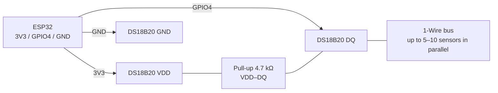

# DS18B20 - digital temperature sensor (Dallas 1-Wire)

## Purpose

DS18B20 - digital temperature sensor with true Dallas 1-Wire bus: each instance has a unique 64-bit ROM code, so dozens of sensors work on one GPIO line. Packages: TO-92, cable sleeve (waterproof), SOP-8. Applications: heated floors, boilers, outdoor weather stations, aquariums, freezers.

## Characteristics

| Parameter | Value |
| --- | --- |
| Measurement range | −55…+125 °C |
| Accuracy | ±0.5 °C (−10…+85 °C) |
| Resolution | 9-12 bits (0.5 / 0.25 / 0.125 / 0.0625 °C) |
| Conversion time | 94 ms (9 bit) … 750 ms (12 bit) |
| Power supply | 3.0-5.5 V (3.3 V from ESP32 recommended) |
| Current | ~1 mA active, ~750 nA idle |
| Protocol | Dallas 1-Wire, speed 16.3 kbps (overdrive 142) |
| Unique code | 64-bit ROM, up to ~100+ devices on bus (practically 5-10) |
| Parasitic power | Yes (from DQ line), but NOT recommended with ESP32 |

> Parasitic power (2 wires: DQ + GND) requires a strong pull-up (MOSFET) during conversion and causes failures on ESP32. Always run a third VCC wire.

## Pinout

| Pin (TO-92, flat side toward you, left to right) | Function | Note |
| --- | --- | --- |
| 1 - GND | Ground | Common GND |
| 2 - DQ | 1-Wire data | GPIO + 4.7 kΩ pull-up to VCC |
| 3 - VDD | 3.3 V supply | Do NOT leave floating; do not use parasitic mode |

Waterproof sleeve colors: red - VCC, yellow/white - DQ, black - GND (verify with multimeter, variations exist!).

## Wiring diagram

| ESP32 | DS18B20 module | Note |
| --- | --- | --- |
| 3V3 | VDD | Normal (not parasitic) power |
| GPIO4 | DQ | Any GPIO; one pin for whole bus |
| GND | GND | Common ground |
| - | DQ-VDD | Pull-up 4.7 kΩ (one per bus, near ESP32) |

Multiple sensors: all DQ in parallel on one GPIO, all VDD on 3V3, all GND on GND. One 4.7 kΩ pull-up (for length >10 m or >5 sensors - 2.2 kΩ). Cable: twisted pair, DQ + GND in one pair, up to ~30-50 m at 3.3 V.

### ASCII schema

```text
ESP32 DevKit              DS18B20 (TO-92 / sleeve)
------------              ------------------------
3V3 ────────────────────► VDD (3) / red
GND ────────────────────► GND (1) / black
GPIO4 ──────────────────► DQ (2) / yellow-white
                          VDD ◄──[4.7 kΩ]──► DQ (one per bus, near ESP32)
                          VDD ◄──[100 nF]──► GND (for long bus, near ESP32)
Bus: all DQ parallel on GPIO4; DQ+GND — one twisted pair
Do not use parasitic power (VDD to GND)!
```

### Mermaid



![[assets/img/ds18b20-1wire.png|500]]
*Fig. DS18B20 - three-wire 1-Wire bus, one 4.7 kΩ pull-up, twisted pair DQ+GND. Photo space - see [[assets/README]].*

## ESP-IDF code

```c
#include "ds18x20.h"  // esp-idf-lib component
#include "onewire.h"
#include "freertos/FreeRTOS.h"
#include "freertos/task.h"
#include "esp_log.h"

#define ONEWIRE_GPIO GPIO_NUM_4
static const char *TAG = "ds18b20";

void app_main(void)
{
    onewire_handle_t owb;
    onewire_config_t cfg = ONEWIRE_CONFIG_DEFAULT();
    onewire_new_bus(&cfg, ONEWIRE_GPIO, &owb);

    onewire_addr_t addr[4];
    int found = 0;
    onewire_search(owb, addr, 4, &found);
    ESP_LOGI(TAG, "Sensors found: %d", found);

    for (;;) {
        ds18x20_request_t req = DS18X20_REQUEST_DEFAULT();
        ds18x20_convert_and_read(owb, DS18X20_RESOLUTION_12BIT, addr, found, NULL);
        for (int i = 0; i < found; i++) {
            float t = 0;
            ds18x20_read_temperature(owb, addr[i], &t);
            ESP_LOGI(TAG, "[%d] %.2f C", i, t);
        }
        vTaskDelay(pdMS_TO_TICKS(1000));
    }
}
```

> For old API (esp-idf-lib before v5): `ds18x20_scan_devices()`, `ds18x20_measure_and_read_multi()` - see component README.

## Arduino code

```cpp
#include <OneWire.h>
#include <DallasTemperature.h>

#define ONE_WIRE_PIN 4
OneWire oneWire(ONE_WIRE_PIN);
DallasTemperature sensors(&oneWire);

void setup() {
  Serial.begin(115200);
  sensors.begin();
  Serial.printf("Sensors: %d\n", sensors.getDeviceCount());
  sensors.setResolution(12); // 9..12 bits
}

void loop() {
  sensors.requestTemperatures();
  Serial.printf("T0 = %.2f C\n", sensors.getTempCByIndex(0));
  // By address (stable with multiple sensors):
  // DeviceAddress addr; sensors.getAddress(addr, 0);
  // Serial.println(sensors.getTempC(addr));
  delay(1000);
}
```

## MicroPython code

```python
from machine import Pin
import onewire, ds18x20
import time

ow = onewire.OneWire(Pin(4))
ds = ds18x20.DS18X20(ow)
roms = ds.scan()
print("Found:", len(roms), [r.hex() for r in roms])

while True:
    ds.convert_temp()
    time.sleep_ms(750)  # 12 bits
    for rom in roms:
        print(rom.hex(), "{:.2f} C".format(ds.read_temp(rom)))
    time.sleep(1)
```

## Common issues

1. **Parasitic power (VDD to GND)** → −127 °C or CRC-error on ESP32. Connect VDD to 3V3 with separate wire.
2. **No 4.7 kΩ pull-up** → bus silent, `getDeviceCount() = 0`. One DQ→VCC resistor is mandatory.
3. **Values 85 °C or −127 °C** → 85 = POR register value (conversion not finished); −127 = no response. Increase conversion delay, check power.
4. **Sensor index "drifts" with several DS18B20** → `getTempCByIndex()` depends on search order. Work by ROM addresses, save them in NVS/config.
5. **Long bus + 4.7 kΩ too weak** → CRC errors. Reduce to 2.2 kΩ, use twisted pair, add 100 nF near ESP32.
6. **5 V supply + DQ directly to GPIO** → 5 V on input (ESP32 not 5V-tolerant). Power sensor from 3V3.
7. **Reading more often than conversion time** → repeats old value. Wait 750 ms at 12 bits or reduce resolution.

## Official sources

- DS18B20 Datasheet (Analog/Maxim) - `check manually` (analog.com site blocks automatic requests).
- [DS18B20 - live photo (Adafruit)](https://www.adafruit.com/product/374) - product page with photo and documentation.
- [DS18B20 + ESP32 tutorial with code (RNT)](https://randomnerdtutorials.com/esp32-ds18b20-temperature-arduino-ide/) - single and multiple sensors on bus, example.
- [DS18B20 1-Wire breakdown with code (LME)](https://lastminuteengineers.com/ds18b20-arduino-tutorial/) - protocol, resolution, examples.

## See also

- [[EN/03-GPIO/01-GPIO-Overview.en]]
- [[EN/04-Interfaces/03-I2C.en|I2C]]
- [[EN/01-DHT11-DHT22.en]]
- [[EN/03-BME280-BMP280-SHT31.en]]
- [[EN/03-GPIO/04-Interrupts-PWM.en]]
- [[EN/06-INA219-HX711-BH1750.en]]
