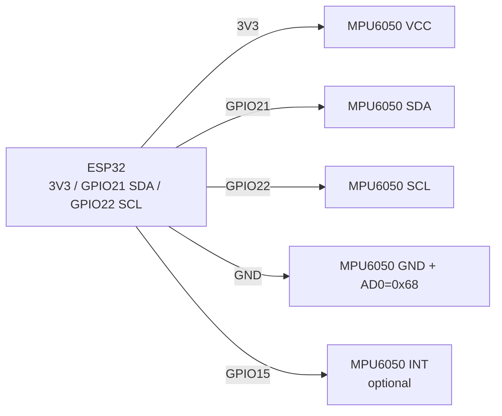

# MPU6050 - accelerometer + gyroscope (I2C)

## Purpose

MPU6050 - 6-axis IMU (3-axis accelerometer + 3-axis gyroscope) with built-in DMP (Digital Motion Processor). Uses: tilt measurement, self-balancing robots, pedometers, stabilization, motion/fall detection, compass template (with HMC5883L on AUX). Interface - I2C 400 kHz (addresses 0x68/0x69), power 2.4-3.5V, motion interrupt wakes ESP32 from sleep.

## Specifications

| Parameter | Value |
| --- | --- |
| Accelerometer | ±2 / ±4 / ±8 / ±16 g, 16 bit |
| Gyroscope | ±250 / ±500 / ±1000 / ±2000 °/s, 16 bit |
| Temperature | Built-in sensor, ±1 °C (rough) |
| Interface | I2C up to 400 kHz; AUX I2C for external magnetometer |
| I2C address | 0x68 (AD0→GND), 0x69 (AD0→VCC) |
| DMP | Hardware fusion (quaternion), InvenSense firmware |
| Interrupt | INT - data-ready, motion-detect, FIFO-overflow |
| Power supply | 2.375-3.46 V (GY-521 modules with LDO → 3.3-5 V) |
| Current | ~3.9 mA active, ~5 µA sleep |

## Pinout

| GY-521 module pin | Purpose | Note |
| --- | --- | --- |
| VCC | Power supply 3.3-5 V | From ESP32 3V3 (recommended) |
| GND | Ground | Common GND |
| SCL | I2C clock | GPIO22 + pull-up (on module) |
| SDA | I2C data | GPIO21 + pull-up (on module) |
| XDA / XCL | AUX I2C | For HMC5883L, usually not needed |
| AD0 | Address select | GND → 0x68; VCC → 0x69 |
| INT | Interrupt | To GPIO (e.g. GPIO15), data-ready / motion |
| - | - | Module already has LDO + 4.7 kΩ pull-up |

## Wiring diagram

| ESP32 | MPU6050 module | Note |
| --- | --- | --- |
| 3V3 | VCC | Power supply 3.3 V |
| GND | GND | Common ground, short wires |
| GPIO22 | SCL | Hardware I2C, 400 kHz possible |
| GPIO21 | SDA | Hardware I2C |
| GND | AD0 | Address 0x68 (default); to 3V3 → 0x69 on conflict |
| GPIO15 | INT | Optional; for data-ready / wake-on-motion |

> Two MPU6050 on same bus: one AD0→GND (0x68), other AD0→VCC (0x69).

### ASCII-схема

```text
ESP32 DevKit            GY-521 / MPU6050 (I2C)
------------            ----------------------
3V3 ──────────────────► VCC
GND ──────────────────► GND + AD0 (= 0x68)
GPIO22 ───────────────► SCL (pull-up 4.7 kΩ on module)
GPIO21 ───────────────► SDA (pull-up 4.7 kΩ on module)
GPIO15 ───────────────► INT (optional, data-ready / motion)
Second MPU: AD0 ──► 3V3 (= 0x69) on same bus
Short wires, module near ESP32 (vibration!)
```

### Mermaid



![[assets/img/mpu6050-i2c.png|500]]
*Fig. MPU6050 - I2C bus, address via AD0, interrupt INT on GPIO15. Photo location - see [[assets/README]].*

## ESP-IDF code

```c
#include "mpu6050.h"  // esp-idf-lib
#include "driver/i2c.h"
#include "esp_log.h"
#include <math.h>

#define I2C_PORT I2C_NUM_0
static const char *TAG = "mpu";

void app_main(void)
{
    i2c_config_t cfg = {
        .mode = I2C_MODE_MASTER,
        .sda_io_num = GPIO_NUM_21, .scl_io_num = GPIO_NUM_22,
        .sda_pullup_en = GPIO_PULLUP_ENABLE,
        .scl_pullup_en = GPIO_PULLUP_ENABLE,
        .master.clk_speed = 400000,
    };
    i2c_param_config(I2C_PORT, &cfg);
    i2c_driver_install(I2C_PORT, cfg.mode, 0, 0, 0);

    mpu6050_handle_t dev;
    mpu6050_init(&dev, I2C_PORT, MPU6050_I2C_ADDRESS_LOW); // 0x68
    mpu6050_set_accl_scale(&dev, MPU6050_ACCL_SCALE_4G);
    mpu6050_set_gyro_scale(&dev, MPU6050_GYRO_SCALE_500DPS);

    float alpha = 0.96f, angle = 0;
    int64_t prev = esp_timer_get_time();
    for (;;) {
        mpu6050_accl_t a; mpu6050_gyro_t g;
        mpu6050_get_accl(&dev, &a); mpu6050_get_gyro(&dev, &g);
        float acc_angle = atan2f(a.y, a.z) * 57.2958f;
        int64_t now = esp_timer_get_time();
        float dt = (now - prev) / 1e6f; prev = now;
        angle = alpha * (angle + g.x * dt) + (1 - alpha) * acc_angle;
        ESP_LOGI(TAG, "pitch=%.1f", angle);
        vTaskDelay(pdMS_TO_TICKS(10));
    }
}
```

## Arduino code

```cpp
#include <Wire.h>
#include <MPU6050.h>  // ElectronicCats / jarzebski

MPU6050 mpu;
float angle = 0;
uint32_t prev = 0;

void setup() {
  Serial.begin(115200);
  Wire.begin(21, 22);
  Wire.setClock(400000);
  mpu.initialize();
  if (!mpu.testConnection()) Serial.println("MPU6050 не відповідає!");
  mpu.setFullScaleAccelRange(MPU6050_ACCEL_FS_4);
  mpu.setFullScaleGyroRange(MPU6050_GYRO_FS_500);
  prev = millis();
}

void loop() {
  int16_t ax, ay, az, gx, gy, gz;
  mpu.getMotion6(&ax, &ay, &az, &gx, &gy, &gz);
  float accAngle = atan2((float)ay, (float)az) * 57.2958;
  float dt = (millis() - prev) / 1000.0; prev = millis();
  angle = 0.96 * (angle + (gx / 65.5) * dt) + 0.04 * accAngle; // complementary
  Serial.printf("pitch=%.1f\n", angle);
  delay(10);
}
```

## MicroPython code

```python
from machine import I2C, Pin
import time, math
from mpu6050 import MPU6050  # драйвер з micropython-mpu6050

i2c = I2C(0, scl=Pin(22), sda=Pin(21), freq=400000)
print("I2C:", [hex(a) for a in i2c.scan()])
mpu = MPU6050(i2c, addr=0x68)

angle, prev = 0.0, time.ticks_ms()
while True:
    ax, ay, az = mpu.accel.xyz  # g
    gx, gy, gz = mpu.gyro.xyz   # deg/s
    acc_angle = math.degrees(math.atan2(ay, az))
    now = time.ticks_ms()
    dt = time.ticks_diff(now, prev) / 1000.0
    prev = now
    angle = 0.96 * (angle + gx * dt) + 0.04 * acc_angle
    print("pitch={:.1f}".format(angle))
    time.sleep_ms(10)
```

## DMP vs complementary filter

| Approach | Pros | Cons |
| --- | --- | --- |
| DMP (built-in) | Quaternion on chip, offloads CPU | Closed firmware 281 bytes, FIFO-overflow bugs, complex driver |
| Complementary filter | 5 lines of code, deterministic | Needs stable `dt`, sensitive to vibration |
| Kalman | Best on vibration | Heavier CPU, Q/R tuning |

> For 90% tasks (tilt, self-balance) a complementary filter with alpha 0.95-0.98 and gyroscope zero calibration is sufficient.

## Common issues

1. **Wrong address (AD0)** → `testConnection() = false`. Check `i2c.scan()`: 0x68 vs 0x69.
2. **5 V power to logic without LDO** → bare MPU6050 maximum 3.46 V. GY-521 has LDO - then 5 V allowed, but 3.3 V is better.
3. **Gyroscope zero drift** → angle "drifts". Calibrate offset at rest (100-500 sample average).
4. **FIFO overflow in DMP** → garbage quaternions. Read FIFO on time or return to complementary filter.
5. **I2C 100 kHz + 1 kHz samples** → too slow. Raise to 400 kHz, short wires.
6. **Вібрації моторів** → шум акселерометра. Гумові демпфери, LPF (DLPF_CFG), нижча alpha акселерометра.
7. **INT not pulled up / not configured** → phantom wake-on-motion triggers. Set motion-detect threshold and INT polarity.

## Official sources

- MPU-6050 Product Page (TDK InvenSense) - page moved; content not found.
- [MPU-6050 - live photo (Adafruit)](https://www.adafruit.com/product/3886) - product page with photo and documentation.
- [Туторіал MPU-6050 + ESP32 with кодом (RNT)](https://randomnerdtutorials.com/esp32-mpu-6050-accelerometer-gyroscope-arduino/) - акселерометр and гіроскоп, example.
- [MPU6050 breakdown with code (LME)](https://lastminuteengineers.com/mpu6050-accel-gyro-arduino-tutorial/) - registers, sensitivity, examples.

## See also

- [[04-Interfaces/03-I2C.en | I2C]]
- [[03-GPIO/04-Interrupts-PWM.en | Interrupts and PWM]]
- [[03-GPIO/01-GPIO-Overview.en | GPIO overview]]
- [[04-Interfaces/02-SPI.en | SPI]]
- [[06-Analog/01-ADC | ADC]]
- [[EN/03-BME280-BMP280-SHT31.en]]
