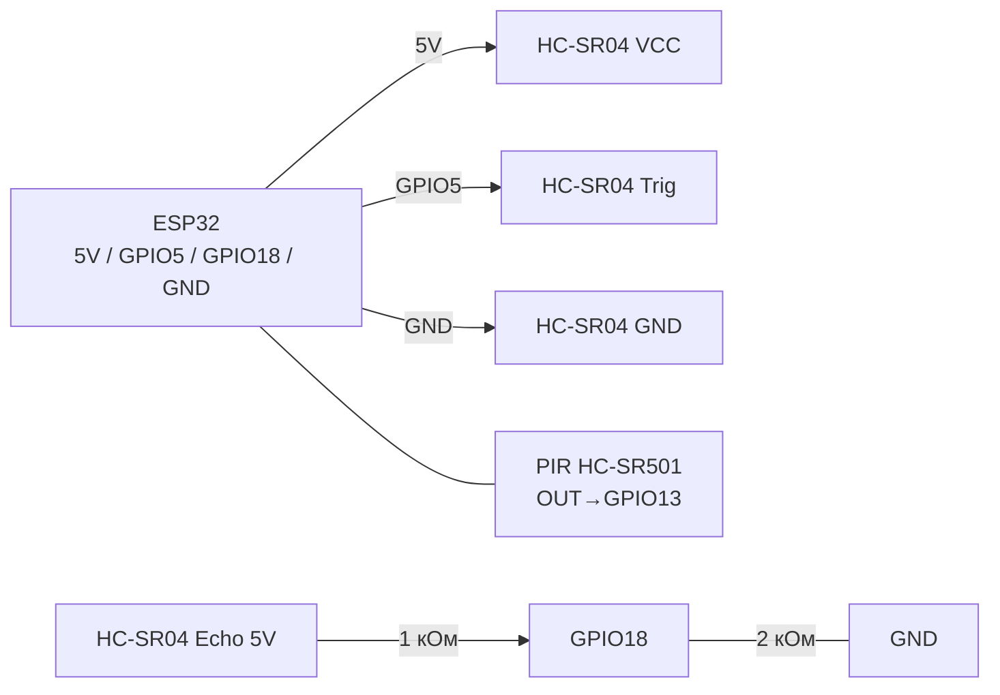

# HC-SR04 (ultrasound) and PIR HC-SR501 (motion)

## Purpose

HC-SR04 - ультразвуковий далекомір (2-400 см) for вимірювання відстані, рівня рідини, парктроніків, роботів-уникачів перешкод. PIR HC-SR501 - пасивний ІЧ-детектор руху людини (до ~7 м, кут ~110°) for освітлення, сигналізації, економії енергії (пробудження with deep-sleep). HC-SR04 живиться 5V (Echo - via дільник!), PIR - 5-12V with виходом 3.3V.

## Specifications

| Параметр | HC-SR04 | PIR HC-SR501 |
| --- | --- | --- |
| Принцип | Echo 40 кГц, час прольоту | Піроелектрик + лінза Френеля |
| Діапазон | 2-400 см (точно 2-200) | до 7 м, кут <110° |
| Точність | ±3 мм (ідеально), реально ±1 см | Бінарний: рух є/немає |
| Живлення | 5 in (логіка Trig 5 in, Echo 5 in!) | 5-12 in (вихід 3.3 in, сумісний with ESP32) |
| Струм | 15 мА | 65 мкА (очікування) |
| Вихід | Trig (вхід), Echo (імпульс 150 мкс-25 мс) | OUT 3.3 in, утримання H/L перемичка |
| Регулювання | - | Sx: чутливість; Tx: час утримання 0.3-300 с |

> HC-SR04 живиться from 5 in, but Echo видає 5 in - ESP32 not 5V-tolerant! Обов'язковий дільник 1 кОм / 2 кОм. PIR HC-SR501 має on борту стабілізатор 3.3 in and вихід 3.3 in - підключається безпосередньо.

## Pinout

| HC-SR04 | Призначення |
| --- | --- |
| VCC | 5 in (from VIN/VU або зовнішні 5 in) |
| Trig | launch (10 мкс HIGH), вхід 5 in - ESP32 3.3 in вистачає |
| Echo | Імпульс шириною ∝ відстані, 5 in → via дільник in GPIO |
| GND | Спільна земля |

| HC-SR501 | Призначення |
| --- | --- |
| VCC | 5 in (4.5-12 in), стабілізатор on борту |
| OUT | 3.3 in логіка → безпосередньо in GPIO |
| GND | Спільна земля |
| Sx / Tx | Потенціометри чутливості / часу |
| Jumper H/L | H - повторний тригер, L - одиничний |

## Wiring diagram

| ESP32 | HC-SR04 | Примітка |
| --- | --- | --- |
| 5V (VIN/VU) | VCC | 5 in обов'язково (from 3.3 in not працює/бреше) |
| GPIO5 | Trig | Вихід ESP32 3.3 in → Trig спрацьовує (поріг ~2 in) |
| GPIO18 | Echo via дільник | Echo → 1 кОм → GPIO; GPIO → 2 кОм → GND (on GPIO ~3.3 in) |
| GND | GND | Спільна земля |

| ESP32 | HC-SR501 | Примітка |
| --- | --- | --- |
| 5V (VIN/VU) | VCC | 5 in for стабільної роботи реле часу |
| GPIO13 | OUT | Безпосередньо, 3.3 in-сумісний; for пробудження - RTC-GPIO |
| GND | GND | Спільна земля |

Формула відстані: `distance_cm = echo_us / 58.0` (або `echo_us * 0.0343 / 2`). Пояснення: звук ~343 м/с → 29.1 мкс/мм in один бік, туди-назад 58.2 мкс/см.

### ASCII-схема

```text
ESP32 DevKit            HC-SR04 (5 В!) + дільник Echo
------------            -----------------------------
5V (VIN/VU) ──────────► VCC (5 В обов'язково!)
GND ──────────────────► GND
GPIO5 ────────────────► Trig (3.3 В вистачає, поріг ~2 В)
Echo (5 В) ──[1 кОм]──► GPIO18 ──[2 кОм]──► GND (на GPIO ~3.3 В)
PIR HC-SR501: 5V ──► VCC, GND ──► GND, OUT (3.3 В) ──► GPIO13
PIR для пробудження — тільки RTC-GPIO (напр. GPIO13/15)
Без дільника Echo безпосередньо в GPIO — ЗАБОРОНЕНО!
```

### Mermaid



![[assets/img/hcsr04-divider.png|500]]
*Рис. HC-SR04 - живлення 5 in, Echo via дільник 1к/2к, PIR безпосередньо on GPIO13. Місце під фото - див. [[assets/README]].*

## ESP-IDF code

```c
#include "driver/gpio.h"
#include "esp_timer.h"
#include "freertos/FreeRTOS.h"
#include "freertos/task.h"
#include "esp_log.h"

#define TRIG GPIO_NUM_5
#define ECHO GPIO_NUM_18
#define PIR  GPIO_NUM_13
static const char *TAG = "range";

static float hc_sr04_read_cm(void)
{
    gpio_set_level(TRIG, 0);
    esp_rom_delay_us(5);
    gpio_set_level(TRIG, 1);
    esp_rom_delay_us(10);
    gpio_set_level(TRIG, 0);
    // чекати rising
    int64_t t0 = esp_timer_get_time();
    while (!gpio_get_level(ECHO)) {
        if (esp_timer_get_time() - t0 > 30000) return -1;
    }
    int64_t start = esp_timer_get_time();
    while (gpio_get_level(ECHO)) {
        if (esp_timer_get_time() - start > 30000) return -1; // ~5 м макс
    }
    int64_t us = esp_timer_get_time() - start;
    return us / 58.0f;
}

void app_main(void)
{
    gpio_set_direction(TRIG, GPIO_MODE_OUTPUT);
    gpio_set_direction(ECHO, GPIO_MODE_INPUT);
    gpio_set_direction(PIR, GPIO_MODE_INPUT);
    for (;;) {
        float d = hc_sr04_read_cm();
        int motion = gpio_get_level(PIR);
        ESP_LOGI(TAG, "dist=%.1f cm  pir=%d", d, motion);
        vTaskDelay(pdMS_TO_TICKS(200));
    }
}
```

## Arduino code

```cpp
#define TRIG 5
#define ECHO 18
#define PIR  13

void setup() {
  Serial.begin(115200);
  pinMode(TRIG, OUTPUT);
  pinMode(ECHO, INPUT);
  pinMode(PIR, INPUT);
}

float readCm() {
  digitalWrite(TRIG, LOW); delayMicroseconds(5);
  digitalWrite(TRIG, HIGH); delayMicroseconds(10);
  digitalWrite(TRIG, LOW);
  unsigned long us = pulseIn(ECHO, HIGH, 30000); // таймаут 30 мс
  if (us == 0) return -1;
  return us / 58.0;
}

void loop() {
  Serial.printf("dist=%.1f cm  pir=%d\n", readCm(), digitalRead(PIR));
  delay(200);
}
```

## MicroPython code

```python
from machine import Pin
import time

trig = Pin(5, Pin.OUT)
echo = Pin(18, Pin.IN)
pir = Pin(13, Pin.IN)

def read_cm():
    trig.value(0); time.sleep_us(5)
    trig.value(1); time.sleep_us(10)
    trig.value(0)
    t0 = time.ticks_us()
    while not echo.value():
        if time.ticks_diff(time.ticks_us(), t0) > 30000:
            return -1
    start = time.ticks_us()
    while echo.value():
        if time.ticks_diff(time.ticks_us(), start) > 30000:
            return -1
    us = time.ticks_diff(time.ticks_us(), start)
    return us / 58.0

while True:
    print("dist={:.1f} cm  pir={}".format(read_cm(), pir.value()))
    time.sleep_ms(200)
```

## Common issues

1. **Echo 5 in безпосередньо in GPIO** → деградація/згоряння входу ESP32. Дільник 1 кОм/2 кОм обов'язковий.
2. **Живлення HC-SR04 from 3.3 in** → занижені/нульові покази. Тільки 5 in.
3. **without таймауту `pulseIn` / циклу очікування** → зависання at відсутності echo (відкрите небо). Завжди таймаут 25-30 мс.
4. **М'які/похилі поверхні** → echo губиться (тканина, килим, кут >15°). for таких цілей - ToF-лазер VL53L0X.
5. **PIR хибні спрацювання** → протяги, батареї, сонячні зайчики. Зменшити Sx, направити лінзу вниз, прогрів 30-60 с після ввімкнення.
6. **PIR not бачить крізь скло** → ІЧ not проходить via скло. Тільки пряма видимість.
7. **Декілька HC-SR04 одночасно** → перехресні echo. Опитувати per черзі with паузою ≥60 мс.

## Official sources

- [Туторіал HC-SR04 + ESP32 with кодом (RNT)](https://randomnerdtutorials.com/esp32-hc-sr04-ultrasonic-arduino/) - вимірювання відстані, example.
- [how працює HC-SR04 with кодом (LME)](https://lastminuteengineers.com/arduino-sr04-ultrasonic-sensor-tutorial/) - принцип, таймінги, приклади.
- [Туторіал PIR + ESP32 with кодом (RNT)](https://randomnerdtutorials.com/esp32-pir-motion-sensor-interrupts-timers/) - переривання and таймери.
- [how працює HC-SR501 PIR with кодом (LME)](https://lastminuteengineers.com/pir-sensor-arduino-tutorial/) - налаштування чутливості and затримки.

## See also

- [[03-GPIO/01-GPIO-Overview.en | GPIO overview]]
- [[03-GPIO/04-Interrupts-PWM.en | Interrupts and PWM]]
- [[06-Analog/01-ADC | ADC]]
- [[04-Interfaces/03-I2C.en | I2C]]
- [[04-Interfaces/02-SPI.en | SPI]]
- [[11-Vivid/04-L298N-TB6612-A4988-Buzzer | Motors / Buzzer]]

```text

## ESP-IDF code (PIR wake-up)

```c

// Пробудження with deep-sleep per PIR on RTC-GPIO:
// esp_sleep_enable_ext0_wakeup(GPIO_NUM_13, 1);
// esp_deep_sleep_start();

```
