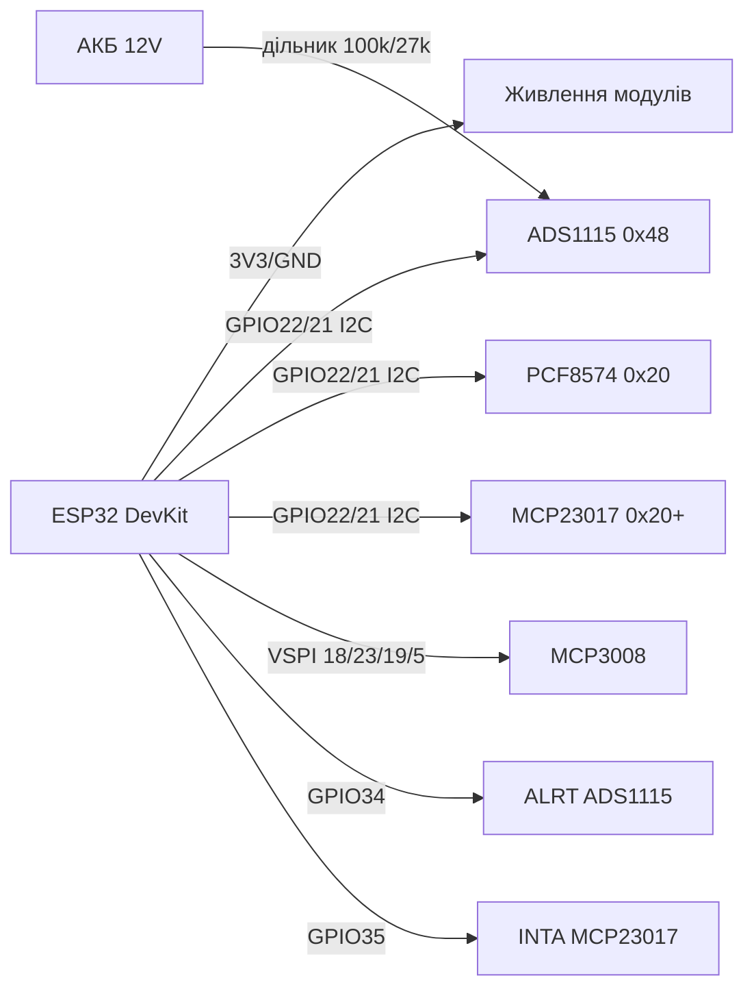

# ADS1115 / MCP3008 / PCF8574 / MCP23017 - розширення ADC та GPIO

![[assets/img/expander-scheme.png|500]]
*Рис. 1. Розширення ESP32: точний ADC ADS1115 per I2C та розширювач GPIO PCF8574.*

## Purpose

Вбудований ADC ESP32 шумний (±6 LSB) and нелінійний, but GPIO часто not вистачає. Зовнішні мікросхеми закривають обидві issues: ADS1115 - 16-бітний I2C АЦП with PGA for точних вимірів (акумулятори, шунти, NTC, тензодатчики); MCP3008 - 8-канальний 10-бітний SPI АЦП for швидкого опитування потенціометрів and джойстиків; PCF8574 - 8-бітний I2C розширювач GPIO (кнопки, реле, LCD1602); MCP23017 - 16-бітний розширювач with перериваннями та підтяжками. База for будь-якого щита автоматики on ESP32.

## Характеристики

| Параметр | ADS1115 | MCP3008 | PCF8574 | MCP23017 |
| --- | --- | --- | --- | --- |
| Функція | 4-канальний ADC 16 біт | 8-канальний ADC 10 біт | 8× GPIO | 16× GPIO (2×8) |
| Інтерфейс | I2C, 0x48-0x4B (ADDR) | SPI, до 3.6 МГц | I2C 0x20-0x27 (A - 0x38-0x3F) | I2C 0x20-0x27 (адреси A0-A2) |
| Швидкість | 8-860 SPS | 200 kSPS | ~100 кГц GPIO | ~1 МГц GPIO |
| Особливість | PGA ±0.256…±6.144 in, компаратор ALRT | Дешевий, 8 каналів | Квазідвонапрямлені піни | Переривання INTA/INTB, pull-up 100 кОм |
| Живлення | 2.0-5.5 in | 2.7-5.5 in | 2.5-6 in | 1.8-5.5 in |
| Струм | 150 мкА / 0.5 мкА сон | 500 мкА | 10 мкА | 1 мА |
| Точність | 0.1875 мВ/LSB at ±6.144 in | 4.9 мВ/LSB at 5 in | - | - |
| Ціна | ~$3-4 | ~$2 | ~$1 | ~$2 |

### Дільники for ADS1115 (батарея 12 in → PGA)

| Вимір | R1 (верх) | R2 (низ) | Коефіцієнт | Діапазон on вході |
| --- | --- | --- | --- | --- |
| 12 in АКБ | 100 кОм | 27 кОм | ×4.70 | 0-2.55 in (PGA ±4.096) |
| 5 in шина | 10 кОм | 10 кОм | ×2.0 | 0-2.5 in |
| Струм via шунт 0.1 Ом | PGA ×16 (±0.256 in) | - | 2.56 but макс | Диференційний A0-A1 |

> R1+R2 ≥ 20 кОм, щоб not садити батарею; паралельно R2 - кераміка 100 нФ проти шуму.

## Легенда пінів модуля

| Пін | Тип | Куди | Примітка |
| --- | --- | --- | --- |
| VCC | Живлення | 3V3 ESP32 | ADS1115/MCP23017 - 3.3 in for узгодження рівнів; PCF8574 можна 5 in |
| GND | Земля | GND ESP32 | Спільна, коротка |
| SCL / SDA | I2C | GPIO22 / GPIO21 | ADS1115 + PCF8574 + MCP23017 on одній шині (різні адреси!) |
| SCK / MOSI / MISO / CS | SPI | GPIO18/23/19/5 | MCP3008: SCK→18, MOSI(DIN)→23, MISO(DOUT)→19, CS→5 |
| A0-A3 (ADS1115) | Аналогові входи | Дільники/сенсори | A0-A3 single-ended або пари A0-A1 диференційно |
| CH0-CH7 (MCP3008) | Аналогові входи | Потенціометри | Опорна VREF - точність виміру = точність VREF |
| P0-P7 (PCF8574) | Квазі-GPIO | Кнопки/реле/LCD | for реле - via ULN2003/транзистор, струм піна лише 25 мА |
| GPA0-7/GPB0-7 (MCP23017) | GPIO | Кнопки/LED/реле | INTA/INTB → GPIO ESP32 for переривань |
| ALRT (ADS1115) | Вихід компаратора | GPIO (опційно) | Поріг without опитування CPU |
| A0-A2 (адреса) | Вхід | GND/VCC | PCF8574: 0x20 + комбінація; ADS1115 ADDR: GND→0x48, VCC→0x49, SDA→0x4A, SCL→0x4B |

## Схема підключення

| ESP32 | module | Примітка |
| --- | --- | --- |
| 3V3 | ADS1115 VCC, MCP3008 VDD, MCP23017 VCC | PCF8574 - 3V3 або 5V залежно from периферії |
| GND | GND усіх | Спільна земля |
| GPIO22 | SCL (усіх I2C-модулів) | Pull-up 4.7 кОм |
| GPIO21 | SDA (усіх I2C-модулів) | Pull-up 4.7 кОм |
| GPIO5 | MCP3008 CS | Окремий CS on кожен SPI-пристрій |
| GPIO18/23/19 | MCP3008 CLK/DIN/DOUT | Апаратний VSPI |
| GPIO34 | ADS1115 ALRT (опційно) | Вхідний пін without pull-up всередині |
| GPIO35 | MCP23017 INTA/INTB | Переривання зміни піна |

### ASCII-схема

```text
      ESP32 DevKit                  Модулі
  +---------------+    I2C    +------------------+
  | 3V3 ----------+---------->VCC ADS1115/PCF/MCP|
  | GND ----------+---------->GND x3            |
  | G22 SCL ------+---------->SCL x3 (pull-up)  |
  | G21 SDA ------+---------->SDA x3 (pull-up)  |
  +---------------+           +------------------+
  +---------------+    SPI    +------------------+
  | G18 SCK --------------->CLK MCP3008         |
  | G23 MOSI -------------->DIN MCP3008         |
  | G19 MISO <--------------DOUT MCP3008        |
  | G5  CS ---------------->CS MCP3008          |
  +---------------+           +------------------+
  Дільник 12V: [+]--100k--+--27k--[GND], середина -> A0
```

### Mermaid



## code ESP-IDF

```c
#include "driver/i2c.h"
#include "driver/spi_master.h"
#include "esp_log.h"

#define I2C_PORT I2C_NUM_0
#define ADS_ADDR 0x48
static const char *TAG = "exp";

// ADS1115: single-shot читання каналу 0, PGA ±4.096 В
static int16_t ads_read_ch0(void)
{
    uint8_t cfg[3] = {0x01, 0xC3, 0x83}; // MUX=AIN0, PGA=4.096, 128 SPS, single
    i2c_master_write_to_device(I2C_PORT, ADS_ADDR, cfg, 3, 100);
    vTaskDelay(pdMS_TO_TICKS(10));
    uint8_t reg = 0x00;
    uint8_t d[2] = {0};
    i2c_master_write_read_device(I2C_PORT, ADS_ADDR, &reg, 1, d, 2, 100);
    return (int16_t)((d[0] << 8) | d[1]);
}

// PCF8574: записати байт (біти=1 — входи з pull-up)
static void pcf_write(uint8_t v)
{
    i2c_master_write_to_device(I2C_PORT, 0x20, &v, 1, 100);
}

void app_main(void)
{
    i2c_config_t ic = {.mode = I2C_MODE_MASTER, .sda_io_num = 21,
        .scl_io_num = 22, .sda_pullup_en = 1, .scl_pullup_en = 1,
        .master.clk_speed = 100000};
    i2c_param_config(I2C_PORT, &ic);
    i2c_driver_install(I2C_PORT, ic.mode, 0, 0, 0);
    for (;;) {
        int16_t raw = ads_read_ch0();
        float v = raw * 4.096f / 32768.0f; // Вольти на A0
        ESP_LOGI(TAG, "A0=%.3f V (12V АКБ: %.2f V)", v, v * 4.7037f);
        pcf_write(0xFE); // P0 = 0, решта входи
        vTaskDelay(pdMS_TO_TICKS(500));
    }
}
// MCP3008 по SPI: послати 0x01, (0x80|ch<<4), 0x00; відповідь — 10 біт.
// MCP23017: IODIRA=0x00 (виходи), GPIOA — дані; INTCON/GPINTEN — переривання.
```

## code Arduino

```cpp
#include <Wire.h>
#include <Adafruit_ADS1X15.h>
#include <PCF8574.h>
#include <Adafruit_MCP23X17.h>
#include <Adafruit_MCP3008.h>

Adafruit_ADS1115 ads;
PCF8574 pcf(0x20);
Adafruit_MCP23X17 mcp;
Adafruit_MCP3008 mcp3008;

void setup() {
  Serial.begin(115200);
  Wire.begin(21, 22);
  ads.begin(0x48);
  ads.setGain(GAIN_ONE);      // ±4.096 В
  ads.setDataRate(RATE_ADS1115_128SPS);
  pcf.pinMode(P0, OUTPUT);
  pcf.begin();
  mcp.begin_I2C(0x20);
  mcp.pinMode(0, INPUT_PULLUP); // GPA0 кнопка
  mcp.setupInterruptPin(0, FALLING);
  mcp3008.begin(5); // CS = GPIO5 (VSPI за замовчуванням)
}

void loop() {
  int16_t raw = ads.readADC_SingleEnded(0);
  Serial.printf("ADS A0: %d -> %.3f V\n", raw, raw * 4.096 / 32768.0);
  Serial.printf("MCP3008 CH0: %d\n", mcp3008.readADC(0));
  pcf.digitalWrite(P0, !pcf.digitalRead(P0));
  delay(500);
}
```

## code MicroPython

```python
from machine import I2C, SPI, Pin
import time

i2c = I2C(0, scl=Pin(22), sda=Pin(21))
print("I2C:", [hex(a) for a in i2c.scan()])

ADS = 0x48
PCF = 0x20

def ads_read(ch=0):
    # MUX single-ended, PGA ±4.096, single-shot
    mux = 0x40 | (ch << 12)
    cfg = mux | 0x0200 | 0x0080 | 0x0003
    i2c.writeto_mem(ADS, 0x01, bytes([(cfg >> 8) & 0xFF, cfg & 0xFF]))
    time.sleep_ms(10)
    d = i2c.readfrom_mem(ADS, 0x00, 2)
    raw = (d[0] << 8) | d[1]
    return raw - 65536 if raw > 32767 else raw

spi = SPI(2, baudrate=1000000, sck=Pin(18), mosi=Pin(23), miso=Pin(19))
cs = Pin(5, Pin.OUT, value=1)

def mcp3008_read(ch):
    cs(0)
    spi.write(bytes([0x01, (0x08 | ch) << 4, 0x00]))
    cs(1)
    # спрощено: використати readinto або драйвер mcp3008.py
    return 0

while True:
    print("ADS A0:", ads_read(0) * 4.096 / 32768, "V")
    i2c.writeto(PCF, bytes([0xFE]))  # P0 = 0
    time.sleep(0.5)
```

## Common issues

| № | error | Симптом | Рішення |
| --- | --- | --- | --- |
| 1 | not той біт MUX/PGA in ADS1115 | Канал читає землю або насичення 32767 | verify конфіг-регістр: MUX біти 14-12, PGA біти 11-9 |
| 2 | VREF MCP3008 from 3V3 with шумом | Молодші 2-3 біти стрибають | Окремий REF (TL431) + 100 нФ on VREF, усереднення 16-64 вибірок |
| 3 | PCF8574 how «push-pull» вихід | LED not гасне повністю, реле тріщить | Піни квазідвонапрямлені: for входу писати 1; навантаження - via транзистор/ULN2003 |
| 4 | Конфлікт адрес PCF8574 vs MCP23017 | Обидва on 0x20, шина мовчить | PCF8574 (0x20-0x27), PCF8574A (0x38-0x3F); розвести A0-A2 перемичками |
| 5 | SPI Mode for MCP3008 | Нулі on MISO | Mode 0 (CPOL=0, CPHA=0), частота ≤ 3.6 МГц at 5 in, ≤ 1 МГц at 3.3 in |
| 6 | ALRT/INT without pull-up | Хибні переривання | Підтяжка 10 кОм до 3V3 on ALRT (open-drain) та INTA/INTB |
| 7 | Дільник 12 in without запасу | ADS1115 in насиченні at зарядці 14.4 in | Рахувати on 15 in макс: 100к/27к дає 2.99 in at 14.4 in - in межах PGA ±4.096 |

## Official sources

- [ADS1115 - сторінка продукту and даташит (TI)](https://www.ti.com/product/ADS1115) - official характеристики та документація.
- [ADS1115-module - живе фото (Adafruit)](https://www.adafruit.com/product/1085) - сторінка товару with фото.
- [MCP3008 - живе фото (Adafruit)](https://www.adafruit.com/product/856) - сторінка товару with фото; даташит Microchip - `verify вручну` (сайт блокує ботів).
- [PCF8574 - сторінка продукту and даташит (TI)](https://www.ti.com/product/PCF8574) - official характеристики та документація.
- [MCP23017 - живе фото (Adafruit)](https://www.adafruit.com/product/732) - сторінка товару with фото; даташит Microchip - `verify вручну`.

## See also

- [[04-Interfaces/03-I2C|I2C]]
- [[04-Interfaces/02-SPI|SPI]]
- [[06-Analog/01-ADC|ADC]]
- [[11-NTC-PT100-MAX6675-LM35]]
- [[10-Sensors/06-INA219-HX711-BH1750]]
- [[03-GPIO/01-GPIO-oglyad]]
- [[03-GPIO/04-Pererivannya-PWM]]

## Quality verification
- `check_style`: 0 violations expected; image + mermaid + common-issues + sources present.
- `check_links`: 0 broken; links to `01-Hardware/01-ESP32-Classic.en` / `02-Power-Supply/01-Power-Rails.en` / `Home.en` verified; unknown targets link UA-original with alias.
- `check_home`: 0 errors; `Home.en` links to this file via `11-Vivid/` or `10-Sensors/` section.
