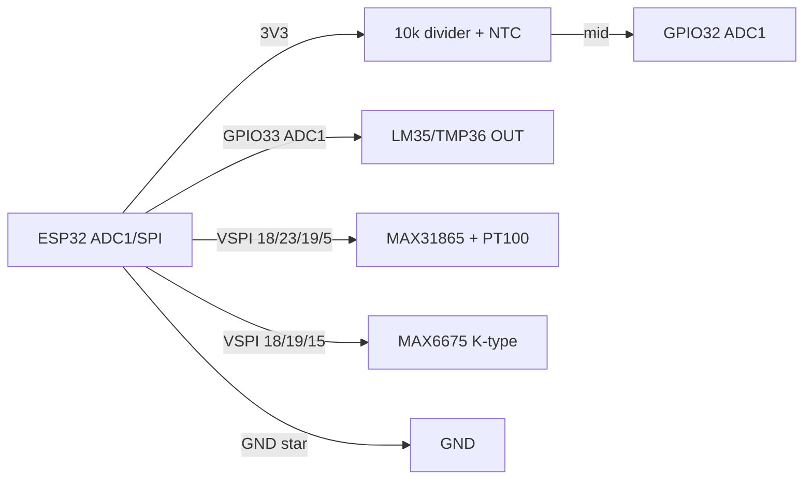

# NTC / PT100 / MAX6675 / LM35 - analog temperature sensors

![[assets/img/temp-analog-scheme.png|500]]
*Fig. 1. Analog temperature sensors: NTC divider on ADC and MAX6675 thermocouple via SPI.*

## Purpose

Analog and resistive temperature sensors for tasks where digital DS18B20/SHT40 do not fit: high temperatures (furnace, 3D printer, soldering iron), aggressive environments, galvanic simplicity. NTC 10k - thermistor in divider on ADC for boilers and greenhouses. PT100 + MAX31865 - platinum reference −200…+850 °C for industry. MAX6675 - ready SPI K-thermocouple module 0…1024 °C for ovens and hotends. LM35/TMP36 - linear sensors 10 mV/°C for simple indicators. All read via ESP32 ADC or SPI.

> Warning: ESP32 ADC2 does not work simultaneously with Wi-Fi! Analog sensors must hang only on ADC1 pins (GPIO32-39).

## Characteristics

| Parameter | NTC 10k (3950) | PT100 + MAX31865 | MAX6675 (K-type) | LM35 / TMP36 |
| --- | --- | --- | --- | --- |
| Range | −40…+125 °C | −200…+850 °C | 0…+1024 °C | −55…+150 °C / −40…+125 °C |
| Accuracy | ±1 % (≈ ±0.5 °C with calibration) | ±0.5 °C (class A) | ±2 °C + thermocouple error | ±0.5 °C / ±1 °C |
| Output | Resistance 10k at 25 °C, B=3950 | Resistance 100 Ω at 0 °C | SPI 12 bit, 0.25 °C/LSB | 10 mV/°C (LM35: 0 mV at 0 °C; TMP36: 500 mV at 0 °C) |
| Interface | ADC via divider | SPI (MAX31865) | SPI read-only | ADC direct |
| Supply | 3.3 V (divider) | 3.3 V | 3.3-5 V | 4-30 V (LM35) / 2.7-5.5 V (TMP36) |
| Current | < 0.5 mA | 1 mA | 50 mA | 60 µA |
| Price | ~$0.5 | ~$8-12 (module+probe) | ~$4-5 | ~$1 |

### Steinhart-Hart formula for NTC (simplified B-parameter)

```text
R = R0 * exp(B * (1/T - 1/T0)),  T in kelvin
T = 1 / (1/T0 + ln(R/R0)/B)
R0 = 10000 Ω, T0 = 298.15 K, B = 3950
R = Rseries * ADCmax/ADC - Rseries  (top Rseries=10k to 3V3)
```

## Module pin legend

| Pin | Type | To | Note |
| --- | --- | --- | --- |
| NTC pin 1 | Analog | 3V3 via 10 kΩ (top divider) | Exact 10k 1 % metal-film resistor |
| NTC pin 2 | Analog | GND + node to ADC | Divider midpoint → GPIO32-35 (ADC1!) + 100 nF to GND |
| PT100 (2/3/4 wires) | Resistance | F+ / F− / RTD± MAX31865 | 3-wire - compromise; 4-wire - maximum accuracy |
| MAX31865 SCK/SDI/SDO/CS | SPI | GPIO18/23/19/5 | Separate CS; DRDY → GPIO optional |
| MAX6675 SCK/SO/CS | SPI read-only | GPIO18/19/5 (MOSI not needed) | SO → MISO; poll not more than 4 Hz (220 ms conversion) |
| LM35 OUT | Analog 10 mV/°C | GPIO32-39 (ADC1) | At 150 °C - 1.5 V, within ADC; long cables - shield |
| TMP36 OUT | Analog | GPIO32-39 (ADC1) | 750 mV at 25 °C; negative temperatures - no divider |

## Wiring diagram

| ESP32 | Module | Note |
| --- | --- | --- |
| 3V3 | NTC divider top (10 kΩ), MAX31865 VCC, MAX6675 VCC | LM35 - from 5 V for full range |
| GND | NTC bottom, GND all modules, cable shield | Analog ground short, star |
| GPIO32 (ADC1_CH4) | NTC divider midpoint / LM35 OUT | Only ADC1! GPIO32-39; attenuation 11 dB |
| GPIO33 (ADC1_CH5) | TMP36 OUT (second channel) | Calibrate with `esp_adc_cal` |
| GPIO18/23/19/5 | MAX31865 SCK/SDI/SDO/CS | Hardware VSPI |
| GPIO15 | MAX6675 CS (second device) | Its own CS per SPI module; SCK/SO shared |
| GPIO34 | MAX6675 SO via MISO (shared) | Or separate SPI host HSPI |

### ASCII schema

```text
   NTC divider (ADC1!)              MAX6675 (SPI)
   3V3 --[10k 1%]--+                ESP32  <->  MAX6675
                   |                G18 SCK --> SCK
                   +--> G32 (ADC1)  G19 MISO <- SO
                   |                G5  CS  --> CS
   NTC --+---------+                (MOSI not needed)
         |         |
        GND   [100nF]                   PT100 -> MAX31865
                                       F+/F-/RTD per 3-wire scheme
```

### Mermaid



## ESP-IDF code

```c
#include <math.h>
#include "driver/adc.h"
#include "esp_adc_cal.h"
#include "driver/spi_master.h"
#include "esp_log.h"

static const char *TAG = "temp";
#define NTC_RSER 10000.0f
#define NTC_R0   10000.0f
#define NTC_B    3950.0f

static float ntc_to_c(int mv)
{
    float v = mv / 1000.0f;
    float r = NTC_RSER * v / (3.3f - v); // top 10k to 3V3
    float t = 1.0f / (1.0f / 298.15f + logf(r / NTC_R0) / NTC_B) - 273.15f;
    return t;
}

// MAX6675: 16 bits, D15 dummy, D14–D3 data 0.25 C/LSB, D2 = thermocouple disconnected
static float max6675_read(spi_device_handle_t dev)
{
    uint8_t rx[2] = {0};
    spi_transaction_t t = {.length = 16, .rx_buffer = rx};
    ESP_ERROR_CHECK(spi_device_transmit(dev, &t));
    uint16_t v = (rx[0] << 8) | rx[1];
    if (v & 0x04) { ESP_LOGW(TAG, "Thermocouple disconnected!"); return NAN; }
    return ((v >> 3) & 0xFFF) * 0.25f;
}

void app_main(void)
{
    adc1_config_width(ADC_WIDTH_BIT_12);
    adc1_config_channel_atten(ADC1_CHANNEL_4, ADC_ATTEN_DB_11); // GPIO32
    esp_adc_cal_characteristics_t cal;
    esp_adc_cal_characterize(ADC_UNIT_1, ADC_ATTEN_DB_11, ADC_WIDTH_BIT_12, 1100, &cal);
    for (;;) {
        uint32_t mv = 0;
        esp_adc_cal_get_voltage(ADC1_CHANNEL_4, &cal, &mv);
        // average 64 samples for noise:
        ESP_LOGI(TAG, "NTC: %.1f C (ADC %lu mV)", ntc_to_c((int)mv), mv);
        vTaskDelay(pdMS_TO_TICKS(1000));
    }
}
```

## Arduino code

```cpp
#include <SPI.h>
#include <max6675.h>
#include <Adafruit_MAX31865.h>

// NTC on GPIO32 (ADC1), LM35 on GPIO33
#define NTC_PIN 32
#define LM35_PIN 33

// MAX6675: SCK=18, SO=19, CS=15
MAX6675 tc(18, 15, 19);
// PT100: CS=5, driver 3-wire
Adafruit_MAX31865 pt100(5, 23, 19, 18);

float readNTC() {
  long sum = 0;
  for (int i = 0; i < 64; i++) { sum += analogRead(NTC_PIN); delay(2); }
  float adc = sum / 64.0;
  float v = adc * 3.3 / 4095.0;
  float r = 10000.0 * v / (3.3 - v);
  return 1.0 / (1.0 / 298.15 + log(r / 10000.0) / 3950.0) - 273.15;
}

void setup() {
  Serial.begin(115200);
  analogReadResolution(12);
  analogSetAttenuation(ADC_11db);
  pt100.begin(MAX31865_3WIRE);
}

void loop() {
  Serial.printf("NTC=%.1f C  LM35=%.1f C  K-type=%.1f C  PT100=%.1f C\n",
    readNTC(), analogReadMilliVolts(LM35_PIN) / 10.0,
    tc.readCelsius(), pt100.temperature(100.0, 430.0));
  delay(1000); // MAX6675 not more often than 4 Hz!
}
```

## MicroPython code

```python
from machine import ADC, Pin, SPI
import time
import math

ntc = ADC(Pin(32)); ntc.atten(ADC.ATTN_11DB); ntc.width(ADC.WIDTH_12BIT)
lm35 = ADC(Pin(33)); lm35.atten(ADC.ATTN_11DB); lm35.width(ADC.WIDTH_12BIT)

def read_ntc():
    s = sum(ntc.read() for _ in range(64)) / 64
    v = s * 3.3 / 4095
    r = 10000 * v / (3.3 - v)
    return 1 / (1 / 298.15 + math.log(r / 10000) / 3950) - 273.15

spi = SPI(2, baudrate=1000000, sck=Pin(18), miso=Pin(19))
cs = Pin(15, Pin.OUT, value=1)

def read_max6675():
    cs(0); d = spi.read(2); cs(1)
    v = (d[0] << 8) | d[1]
    if v & 0x04:
        return None  # thermocouple disconnected
    return ((v >> 3) & 0xFFF) * 0.25

while True:
    print("NTC={:.1f} LM35={:.1f} K={}".format(
        read_ntc(), lm35.read() * 3.3 / 4095 * 100, read_max6675()))
    time.sleep(1)
```

## Common issues

| No. | Error | Symptom | Solution |
| --- | --- | --- | --- |
| 1 | NTC/LM35 on ADC2 (GPIO0/2/4/12-15/25-27) + Wi-Fi | Readings 4095 or zero with Wi-Fi on | Use only ADC1 (GPIO32-39); ADC2 unavailable with Wi-Fi |
| 2 | Without `esp_adc_cal` calibration | Error ±10 % at range edges | Calibrate eFuse (`characterize`), average 64 samples |
| 3 | Divider resistor 5 % carbon | Shift 2-3 °C | Metal-film 10k 1 % + measure actual resistance with multimeter |
| 4 | MAX6675 poll faster than 4 Hz | Old data, jumps | Pause ≥ 250 ms between reads (conversion 220 ms) |
| 5 | MAX6675 D2 bit ignored | 0 °C instead of fault on disconnect | Check `v & 0x04` - thermocouple disconnected |
| 6 | PT100 2-wire without compensation | +1-2 °C from cable resistance | 3- or 4-wire scheme; Rref 430 Ω 0.1 % |
| 7 | Long analog cables without shield | Noise ±5 °C near relays/motors | Twisted pair + shield to GND, 100 nF near ADC, median of 16 samples |

## Official sources

- [LM35 - product page and datasheet (TI)](https://www.ti.com/product/LM35) - official specifications and documentation.
- [MAX31865 PT100 amplifier - live photo (Adafruit)](https://www.adafruit.com/product/3328) - product page with photo; MAX31865/MAX6675 datasheet (Analog/Maxim) - `check manually` (site blocks bots).
- [MAX6675 + thermocouple breakdown with code (LME)](https://lastminuteengineers.com/max6675-thermocouple-arduino-tutorial/) - connection, cold-junction compensation.
- NTC R-T tables - `check manually` (per specific thermistor datasheet).

## See also

- [[EN/10-Sensors/02-DS18B20.en|DS18B20]]
- [[EN/10-Sensors/01-DHT11-DHT22.en]]
- [[EN/10-Sensors/09-ADS1115-MCP3008-PCF8574-MCP23017.en]]
- [[06-Analog/01-ADC|ADC]]
- [[EN/04-Interfaces/02-SPI.en|SPI]]
- [[EN/04-Interfaces/03-I2C.en|I2C]]
- [[EN/10-Sensors/03-BME280-BMP280-SHT31.en]]
