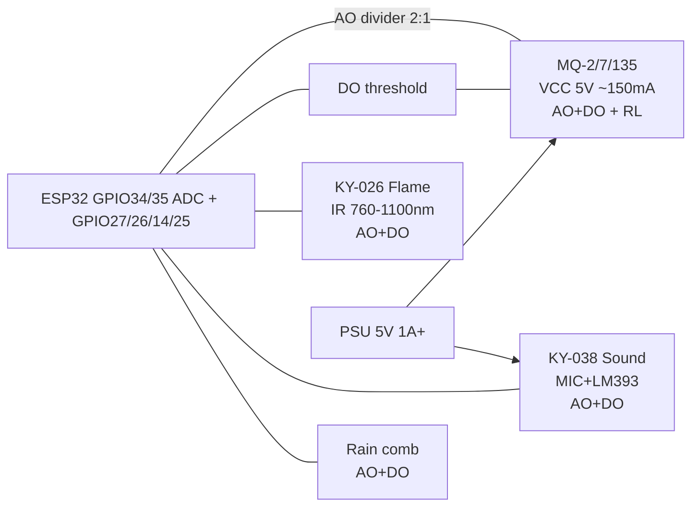

# MQ-2, MQ-7, MQ-135, Flame KY-026, Sound KY-038, Rain

## Purpose

Gas and environmental sensors for simple monitoring: MQ-2 (smoke/propane/butane), MQ-7 (CO), MQ-135 (NH3, benzene, smoke), flame detector KY-026 (IR 760-1100 nm), sound module KY-038 (LM393 comparator + MIC), rain detector (comb + comparator). All have analog AO and digital DO outputs; MQ requires 5 V and 24-48 h heating. Applications: fire alarm, gas leak, sound event trigger, rain detection for covers.

> MQ modules need a 5 V 1 A+ supply; do not feed directly from ESP32 3V3. AO never directly to GPIO without divider!

## Characteristics

| Parameter | MQ-2 | MQ-7 | MQ-135 |
| --- | --- | --- | --- |
| Target gas | Smoke, H2, LPG, CH4, CO | CO | NH3, benzene, smoke |
| Heater voltage | 5 V ±0.1 V | 5 V ±0.1 V | 5 V ±0.1 V |
| Heater current | ~150 mA | ~150 mA | ~150 mA |
| Resistance (clean air) R0 | ~10 kΩ (adjustable) | ~30 kΩ | ~20 kΩ |
| Load resistor RL | 5 kΩ (recommended) | 20 kΩ | 20 kΩ |
| Operating temp | −20…+50 °C | −20…+50 °C | −20…+50 °C |
| Warm-up time | 24-48 h | 24-48 h | 24-48 h |
| Response / recovery | < 10 s / < 30 s | < 30 s | — |

| KY-026 Flame | Function |
| --- | --- |
| VCC / GND | 3.3 V / GND (5 V allowed) |
| AO | IR amplitude (candle flame ~1-2 m visible on AO) |
| DO | LOW on flame (threshold by potentiometer) |
| Sensitivity | Angle ~60°, range up to 1-3 m (lencer/candle) |

| KY-038 Sound | Function |
| --- | --- |
| VCC / GND | 5 V better (larger MIC reserve), GND common |
| AO | Sound envelope → [[06-Analog/01-ADC|ADC]] (quiet ~1.6 V, shout ~3 V) |
| DO | LOW/HIGH pulse on loud burst (clap, knock) |
| Potentiometer | DO threshold |

| Rain (comb + comparator) | Function |
| --- | --- |
| VCC / GND | 3.3-5 V; for longevity power via GPIO only during measurement |
| AO (+/- plate) | Analog: dry ~3 V, wet ~0.5-1 V |
| DO | LOW - wet / rain |
| Comb | Do not immerse connector, only nickel-plated comb; dry after rain |

## Module pin legend

| Pin / Jumper / LED | Function | Note |
| --- | --- | --- |
| VCC | Power | 5 V (MQ); 5 V better (KY-038); 3.3-5 V (KY-026, Rain) |
| GND | Ground | Common ground |
| AO | Analog output | 0-5 V; divider 20k/10k to 3.3 V for ESP32 |
| DO | Digital output | LOW = event; pull-up if open-drain |
| Jumper / LED | PWR + DO-LED indication | - |

## Wiring diagram

| ESP32 | MQ module | KY-026 | KY-038 | Rain | Note |
| --- | --- | --- | --- | --- | --- |
| 5V (VIN/VU) | VCC | - | VCC (5 V) | - | MQ only 5 V, current 150 mA × N |
| 3V3 | - | VCC | - | VCC | KY-026/Rain logic can be 3.3 V |
| GND | GND | GND | GND | GND | Common ground mandatory |
| GPIO34 (ADC1_CH6) | AO via divider | - | - | - | Divider 20 kΩ / 10 kΩ (5 V → 3.3 V) |
| GPIO35 (ADC1_CH7) | - | AO | AO (via divider if 5 V) | AO | [[06-Analog/01-ADC|ADC]] |
| GPIO27 | DO via divider | DO | - | - | [[EN/03-GPIO/04-Interrupts-PWM.en]] for events |
| GPIO26 | - | - | DO | DO | Edge interrupt |

### ASCII schema

```text
                ESP32-DevKitC
              +------------------+
  5V (VIN) ---| 5V        GPIO34 |---< 10k >---+---< 20k >--- AO (MQ, 0-5V)
              |                  |             |              (divider 2:1 => 0-3.3V)
  3V3 --------| 3V3       GPIO35 |--- AO (KY-026 Flame / Rain)
              |                  |
  GND --------| GND          GND |--- GND (MQ / KY-026 / KY-038 / Rain)
              |           GPIO27 |---< divider >--- DO (MQ)
              |           GPIO14 |--- DO (KY-026, LOW=flame)
              |           GPIO26 |--- DO (KY-038, sound burst)
              |           GPIO25 |--- DO (Rain, LOW=wet)
              +------------------+

  MQ module: VCC=5V, warm-up 24-48h!  KY-038: VCC=5V for MIC reserve.
  AO never directly from 5V module to GPIO without divider!
```

### Mermaid



## ESP-IDF code

```c
#include "driver/adc.h"
#include "driver/gpio.h"
#include "esp_log.h"
#include "freertos/FreeRTOS.h"
#include "freertos/task.h"

#define MQ_AO_CH   ADC1_CHANNEL_6  // GPIO34
#define FLAME_DO   GPIO_NUM_14
#define SOUND_DO   GPIO_NUM_26
#define MQ_DO      GPIO_NUM_27
static const char *TAG = "gas";

// Rs/R0 baseline: calibrate on clean air after warm-up!
static float mq_ratio(int raw) {
    float v = raw * 3.3f / 4095.0f;       // voltage on GPIO (after divider!)
    float v_sensor = v * 1.5f;            // restore 0-5V scale (divider 2:1)
    if (v_sensor >= 5.0f) v_sensor = 4.99f;
    const float RL = 5.0f;                // kΩ, MQ-2
    float rs = RL * (5.0f - v_sensor) / v_sensor;
    return rs; // divide by R0 (measured on clean air) => Rs/R0
}

void app_main(void) {
    adc1_config_width(ADC_WIDTH_BIT_12);
    adc1_config_channel_atten(MQ_AO_CH, ADC_ATTEN_DB_11);
    gpio_config_t io_conf = { .mode = GPIO_MODE_INPUT, .pin_bit_mask = (1ULL<<FLAME_DO)|(1ULL<<SOUND_DO)|(1ULL<<MQ_DO) };
    gpio_config(&io_conf);
    for (;;) {
        int raw = adc1_get_raw(MQ_AO_CH);
        float ratio = mq_ratio(raw);
        ESP_LOGI(TAG, "MQ Rs/R0 = %.2f (raw %d)", ratio, raw);
        if (!gpio_get_level(FLAME_DO)) ESP_LOGW(TAG, "Flame detected!");
        if (!gpio_get_level(SOUND_DO)) ESP_LOGW(TAG, "Sound event!");
        vTaskDelay(pdMS_TO_TICKS(500));
    }
}
```

## Arduino code

```cpp
#include <Wire.h>

#define MQ_AO A0
#define FLAME_DO 14
#define SOUND_DO 26
#define MQ_DO 27

void setup() {
  Serial.begin(115200);
  pinMode(FLAME_DO, INPUT_PULLUP);
  pinMode(SOUND_DO, INPUT_PULLUP);
  pinMode(MQ_DO, INPUT_PULLUP);
}

void loop() {
  int raw = analogRead(MQ_AO);
  float v = raw * 3.3 / 4095.0;
  float v5 = v * 1.5; // restore 5V scale
  float rs = 5.0 * (5.0 - v5) / v5;
  Serial.printf("MQ Rs=%.1f kΩ (raw=%d)\n", rs, raw);
  if (digitalRead(FLAME_DO) == LOW) Serial.println("FLAME!");
  if (digitalRead(SOUND_DO) == LOW) Serial.println("SOUND!");
  delay(500);
}
```

## MicroPython code

```python
from machine import ADC, Pin
import time

mq = ADC(Pin(34)); mq.atten(ADC.ATTN_11DB); mq.width(ADC.WIDTH_12BIT)
flame = Pin(14, Pin.IN, Pin.PULL_UP)
sound = Pin(26, Pin.IN, Pin.PULL_UP)

def mq_ratio(raw):
    v = raw * 3.3 / 4095
    v5 = v * 1.5
    if v5 >= 5.0: v5 = 4.99
    rs = 5.0 * (5.0 - v5) / v5
    return rs

while True:
    raw = mq.read()
    print("MQ Rs=%.2f" % mq_ratio(raw))
    if flame.value() == 0: print("FLAME")
    if sound.value() == 0: print("SOUND")
    time.sleep(0.5)
```

## Calibration on clean air

1. Warm up MQ for 24-48 h on clean air (outdoor or well-ventilated chamber).
2. Measure AO voltage with multimeter or ESP32; compute R = RL*(5V - V)/V.
3. Set R0 = measured R (this is baseline).
4. During operation compute Rs/R0 = ratio; alarms at > 1.5-2.0 (gas present).
5. For MQ-7 (CO): use 1.2 V heater cycle (on 60 s / off 90 s) for accurate CO reading.

## Common issues

| No. | Error | Symptom | Solution |
| --- | --- | --- | --- |
| 1 | MQ fed from 3V3 or ESP32 VIN | No heater, no response | Use 5 V 1 A+ external PSU; MQ draws ~150 mA |
| 2 | No warm-up 24-48 h | R0 unstable, false alarms | Warm up; do not move during calibration |
| 3 | AO from 5 V module directly to ESP32 GPIO | 5 V on input, damage | Divider 20k/10k to 3.3 V or 10k/10k for 5V→3.3V |
| 4 | DO threshold too sensitive / too low | False triggers | Adjust potentiometer; use software debounce |
| 5 | MQ-7 without heater cycle | CO reading error | Cycle heater 1.2 V on 60 s / off 90 s |
| 6 | Silicones / lacquers near MQ | SnO2 poisoning forever | Do not paint / seal near sensor |

## Official sources

- [Sound sensor KY-038 with code (LME)](https://lastminuteengineers.com/sound-sensor-arduino-tutorial/) - analog and digital outputs, examples.
- MQ-2/MQ-7/MQ-135 Datasheet (Winsen/Hanwei) - `check manually`.
- KY-026 Flame Datasheet (module manufacturer) - `check manually`.
- LM393 Datasheet (TI): <https://www.ti.com/product/LM393> - dual comparator (thresholds DO).

## See also

- [[06-Analog/01-ADC|ADC]]
- [[EN/03-GPIO/04-Interrupts-PWM.en]]
- [[EN/03-GPIO/01-GPIO-Overview.en]]
- [[EN/04-Interfaces/03-I2C.en|I2C]]
- [[EN/04-Interfaces/02-SPI.en|SPI]]
- [[EN/04-Interfaces/01-UART.en|UART]]
- [[EN/10-Sensors/06-INA219-HX711-BH1750.en]]
- [[EN/Home.en]]
