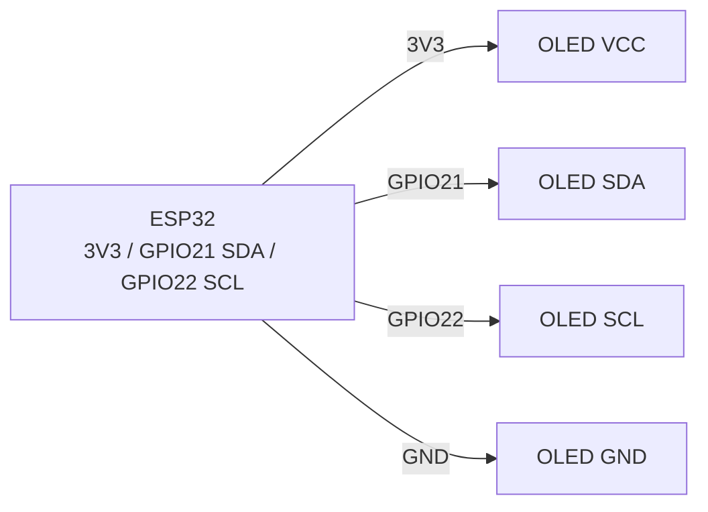

# OLED SSD1306 128x64 (I2C) - Display

## Purpose

monochrome OLED 0.96″ 128×64 at Controllerand SSD1306 - standard display for debug, menus, мandнand-дашбордandin, clocks, touch nodes. I2C-interface (2 wires), power supply 3.3 in, libraries U8g2 / Adafruit_SSD1306 / esp-SSD1306. not burns quickly at moderate brightness; for static images for years - enable screensaver/invert.

## Characteristics

| Parameter | value |
| --- | --- |
| controller | SSD1306 (less often SH1106 - different driver!) |
| resolution | 128×64, mono (white/blue/жоinто-blue) |
| Інтерфейс | I2C, address 0x3C (typically) / 0x3D (jumper) |
| power supply | 3.3-5 in (модулand with LDO/charge-pump; логandка 3.3 in OK) |
| current | ~15-25 мА (depends on кandлькостand white pixels) |
| buffer frame | 1024 байти (128×64/8) - in ОЗП controller's |
| speed | I2C 400 кГц → ~10-20 fps поinного frame |
| lifetime | ~10 000 hours up to noticeable burn-in |

> SH1106 inиглядає same, but has 132×64 пам'ять withand shiftом 2 px - with driverом SSD1306 img «with'їжджає». check маркуinання та select driver/constructor.

## Pinout

| pin модуля (4-pin I2C) | Purpose | Note |
| --- | --- | --- |
| VCC | 3.3 in (або 5 in, if is LDO) | recommended 3.3 in on ESP32 |
| GND | ground | common ground |
| SCL | I2C clock | GPIO22 + pull-up (is at модулand) |
| SDA | I2C data | GPIO21 + pull-up (is at модулand) |

SPI-inерсandї (7 pin: CS/DC/RES/DIN/CLK): шinидшand, but withаймають 5 GPIO - see [[04-Interfaces/02-SPI.en | SPI]].

## Wiring diagram

| ESP32 | OLED SSD1306 | Note |
| --- | --- | --- |
| 3V3 | VCC | power supply 3.3 in |
| GND | GND | common ground |
| GPIO22 | SCL | hardware I2C0, up to 400 кГц-1 МГц |
| GPIO21 | SDA | hardware I2C0 |

check адреси: `I2C.scan()` has show `0x3C`. if 0x3D - pass адресу in constructor. Дinа дисплеї: один with адресою 0x3C, second resolder at 0x3D (jumper SA0) або second I2C-порт.

### ASCII-schem

```text
ESP32 DevKit            OLED SSD1306 128×64 (I2C, 4-pin)
------------            --------------------------------
3V3 ──────────────────► VCC (3.3 В рекомендовано)
GND ──────────────────► GND
GPIO22 ───────────────► SCL (400 кГц, pull-up на модулі)
GPIO21 ───────────────► SDA (pull-up на модулі)
VCC ◄──[100 нФ]──► GND (біля дисплея проти артефактів)
Адреса: 0x3C типово; SA0-перемичка → 0x3D
```

### Mermaid



![[assets/img/OLED-SSD1306-I2C.png]]
*Рис. OLED SSD1306 - bus I2C 400 кГц, address 0x3C, power supply 3V3. Мandсце under фото - see [[assets/README]].*

## Code ESP-IDF

```c
#include "ssd1306.h"  // компонент esp-ssd1306 / esp-idf-lib
#include "driver/i2c.h"
#include "font8x8_basic.h"

#define I2C_PORT I2C_NUM_0

void app_main(void)
{
    i2c_config_t cfg = {
        .mode = I2C_MODE_MASTER,
        .sda_io_num = GPIO_NUM_21, .scl_io_num = GPIO_NUM_22,
        .sda_pullup_en = GPIO_PULLUP_ENABLE,
        .scl_pullup_en = GPIO_PULLUP_ENABLE,
        .master.clk_speed = 400000,
    };
    i2c_param_config(I2C_PORT, &cfg);
    i2c_driver_install(I2C_PORT, cfg.mode, 0, 0, 0);

    SSD1306_t dev;
    i2c_init(&dev, 128, 64, 0x3C, I2C_PORT);
    ssd1306_init(&dev);
    ssd1306_clear_screen(&dev, false);
    ssd1306_display_text(&dev, 0, "ESP32 OLED", 9, false);
    ssd1306_display_text(&dev, 1, "T=24.5C H=55%", 13, false);
    // Графіка: ssd1306_draw_pixel / line / bitmap, потім ssd1306_show_buffer
}
```

## Code Arduino

```cpp
#include <Wire.h>
#include <Adafruit_GFX.h>
#include <Adafruit_SSD1306.h>

#define SCREEN_W 128
#define SCREEN_H 64
Adafruit_SSD1306 display(SCREEN_W, SCREEN_H, &Wire, -1);

void setup() {
  Serial.begin(115200);
  Wire.begin(21, 22);
  Wire.setClock(400000);
  if (!display.begin(SSD1306_SWITCHCAPVCC, 0x3C)) {
    Serial.println("SSD1306 не знайдено!");
    for (;;) delay(10);
  }
  display.clearDisplay();
  display.setTextSize(1);
  display.setTextColor(SSD1306_WHITE);
  display.setCursor(0, 0);
  display.println("ESP32 OLED OK");
  display.printf("T=24.5C H=55%%\n");
  display.display();
}

void loop() {
  // U8g2-альтернатива: U8G2_SSD1306_128X64_NONAME_F_HW_I2C u8g2(U8G2_R0);
}
```

## Code MicroPython

```python
from machine import I2C, Pin
import ssd1306  # вбудований драйвер

i2c = I2C(0, scl=Pin(22), sda=Pin(21), freq=400000)
print("I2C:", [hex(a) for a in i2c.scan()])
oled = ssd1306.SSD1306_I2C(128, 64, i2c, addr=0x3C)

oled.fill(0)
oled.text("ESP32 OLED OK", 0, 0)
oled.text("T=24.5C H=55%", 0, 12)
oled.hline(0, 30, 128, 1)
oled.rect(0, 35, 60, 20, 1)
oled.show()
```

## Common issues

1. **SH1106 instead SSD1306** → img withand shiftом/смandття. Використати driver SH1106 (`Adafruit_SH110X`, `U8G2_SH1106_...`).
2. **not та address (0x3D)** → чорний екран. Скануinати I2C, pass праinильну адресу in `begin()`/constructor.
3. **power supply 5 in at module беwith LDO** → перегрandin/output with ладу. Переinandрити toяinнandсть стабandлandwithатора; withа withамоinчуinанням 3.3 in.
4. **I2C 100 кГц + поinний редиwithайн щоframe** → мерехтandння. Пandдняти up to 400 кГц, оноinлюinати тandльки withмandnotнand рядки.
5. **Забутий `display.display()` / `OLED.show()`** → buffer not inиinодиться. Виклик show пandсля кожного frame.
6. **Статичto img for years** → burn-in. Перandодично andнinертуinати, гасити (`ssd1306_display_off` / `display.ssd1306_command(SSD1306_DISPLAYOFF)`), withниwithити контраст.
7. **Доinгand wires SDA/SCL** → артефакти. Короткand wires, pull-up 4.7 кОм, 100 нФ withа powerм бandля дисплея.

## Official sources

- SSD1306 Datasheet (Solomon Systech) - `переinandрити inручну`.
- [OLED 0.96″ - жиinе фото (Adafruit)](https://www.adafruit.com/product/326) - сторandнка тоinару with фото.
- [Туторandал OLED + ESP32 with коup toм (RNT)](https://randomnerdtutorials.com/esp32-SSD1306-OLED-display-arduino-ide/) - Adafruit_SSD1306, ex.и.
- [Гайд monoних OLED with коup toм (Adafruit Learn)](https://learn.adafruit.com/monochrome-OLED-breakouts) - SSD1306/SH1106, libraries.

## See also

- [[04-Interfaces/03-I2C.en | I2C]]
- [[04-Interfaces/02-SPI.en | SPI]]
- [[03-GPIO/01-GPIO-Overview.en | GPIO Overview]]
- [[06-Analog/01-ADC.en | ADC]]
- [[03-GPIO/04-Interrupts-PWM.en | Interrupts / PWM]]
- [[11-Vivid/02-TFT-LCD-Epaper.en | TFT LCD Epaper]]
- [[11-Vivid/03-NeoPixel-Servo-Rele-MOSFET.en | NeoPixel Servo Relay MOSFET]]
