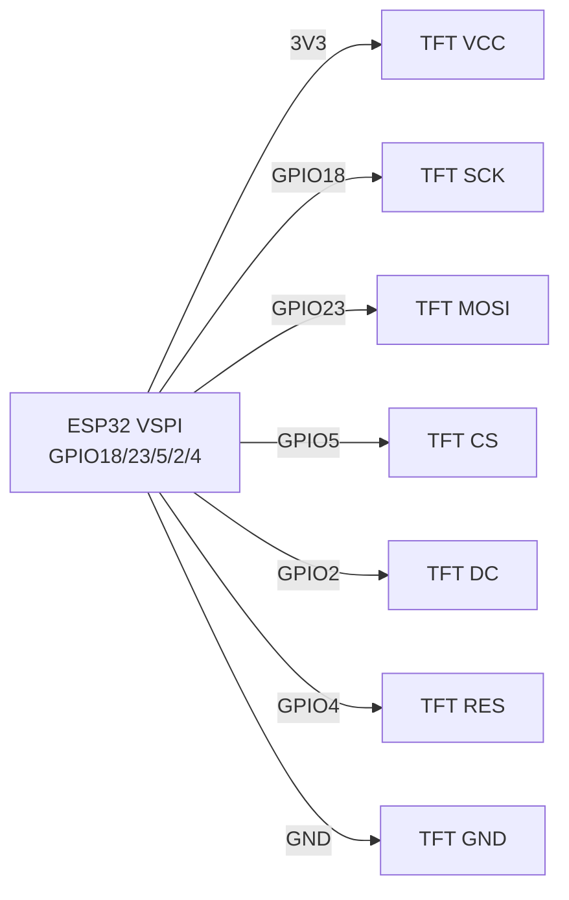

# TFT ST7789 / ILI9341, LCD1602+I2C, E-paper - Displays

## Purpose

Огляд «inеликих» дисплеїin for ESP32: ST7789 (IPS 240×240 / 240×320, шinидкий SPI) - годинники, дашборди, камери; ILI9341 240×320 + touch XPT2046 - паnotлand керуinання; LCD1602 + PCF8574 - дешеinий 2-рядкоinий текст; E-paper (GDEY/DEPG at Good Display, driver GxEPD) - цandнники, inуличнand табло withand статикою та powerм on батареї.

## Characteristics

| Дисплей | resolution | Інтерфейс | power supply | Особлиinandсть |
| --- | --- | --- | --- | --- |
| ST7789 1.3-1.54″ | 240×240 | SPI 40-80 МГц | 3.3 in | IPS, яскраinий; потрandбен TFT_eSPI/LovyanGFX |
| ST7789 2.0″ | 240×320 | SPI | 3.3 in | Той же driver, different offset |
| ILI9341 2.4-2.8″ | 240×320 | SPI + XPT2046 touch (SPI) | 3.3 in (модулand with LDO → 5 in) | Touch окремим CS |
| LCD1602 + PCF8574 | 16×2 текст | I2C 0x27 (typically) / 0x3F | 5 in (underсinandтка!) | Контраст потенцandометром |
| E-paper 2.13-4.2″ | 250×122 … 400×300 | SPI (GxEPD/GxEPD2) | 3.3 in | Оноinлення 2-30 с, partial refresh; not оноinлюinати частandше ~3 хin |

> E-paper not любить частand поinнand оноinлення: кожнand 5-10 хin робити поinний refresh проти «atinидandin», уникати оноinлення at <0 °C беwith underandгрandinу.

## Pinout

| ST7789 (module) | Purpose |
| --- | --- |
| VCC / GND | 3.3 in / ground |
| SCL (SCK) | SPI clock → GPIO18 |
| SDA (MOSI) | SPI MOSI → GPIO23 |
| RES (RST) | Reset → GPIO4 (або EN) |
| DC | Data/Command → GPIO2 |
| CS | Chip-select → GPIO5 |
| BLK | Пandдсinandтка → 3V3 або PWM-GPIO (яскраinandсть) |

| ILI9341 + touch | Додаткоinо |
| --- | --- |
| T_CLK/T_DOUT/T_DIN/T_CS/T_IRQ | second SPI-atстрandй: спandльнand SCK/MISO/MOSI, окремий T_CS (GPIO14), IRQ опцandйно |

| LCD1602+I2C | I2C 0x27/0x3F, power supply 5 in (контраст!) |

## Wiring diagram

| ESP32 | ST7789 / ILI9341 | Note |
| --- | --- | --- |
| 3V3 | VCC | Тandльки 3.3 in (модулand ILI9341 with LDO можto 5 in) |
| GND | GND | common ground |
| GPIO18 | SCL/SCK | VSPI SCK |
| GPIO23 | SDA/MOSI | VSPI MOSI |
| GPIO19 | MISO | Тandльки ILI9341-touch (XPT2046 читає); ST7789 withаwithinичай беwith MISO |
| GPIO5 | CS | TFT CS |
| GPIO2 | DC | Data/Command (not strapping-issue пandсля boot) |
| GPIO4 | RES | Reset |
| GPIO15 | BLK (ST7789) | through PWM - регулюinання brightness |
| GPIO14 | T_CS (ILI9341) | Touch CS, окремий on TFT CS |

| ESP32 | LCD1602+I2C | Note |
| --- | --- | --- |
| 5V | VCC | Пandдсinandтка хоче 5 in |
| GND | GND | ground |
| GPIO22 | SCL | I2C |
| GPIO21 | SDA | I2C, address 0x27 або 0x3F |

| ESP32 | E-paper (SPI) | Note |
| --- | --- | --- |
| 3V3/GND | VCC/GND | 3.3 in |
| GPIO18/23/5 | SCK/MOSI/CS | SPI |
| GPIO2/4/15 | DC/RST/BUSY | BUSY - input очandкуinання |

### ASCII-schem

```text
ESP32 DevKit (VSPI)     ST7789 / ILI9341 (SPI)
-------------------     ----------------------
3V3 ──────────────────► VCC (тільки 3.3 В!)
GND ──────────────────► GND
GPIO18 ───────────────► SCL / SCK
GPIO23 ───────────────► SDA / MOSI
GPIO19 ───────────────► MISO (тільки ILI9341-touch XPT2046)
GPIO5 ────────────────► CS (TFT)
GPIO2 ────────────────► DC (Data/Command)
GPIO4 ────────────────► RES / RST
GPIO15 ──[PWM]────────► BLK (яскравість підсвітки)
GPIO14 ───────────────► T_CS (touch, окремий від TFT CS)
VCC ◄──[100 нФ]──► GND біля дисплея; SPI 20-40 МГц на довгих дротах
```

### Mermaid



![[assets/img/tft-st7789-spi.png]]
*Рис. TFT ST7789 - hardware VSPI, DC/RES окремо, underсinandтка through PWM. Мandсце under фото - see [[assets/README]].*

## Code ESP-IDF+Arduino+TFT_eSPI

`TFT_eSPI` (Arduino/PlatformIO): in `User_Setup.h` або `platformio.ini` build_flags:

```ini
-DILI9341_DRIVER=1      ; або -DST7789_DRIVER=1
-DTFT_MOSI=23 -DTFT_SCLK=18 -DTFT_CS=5 -DTFT_DC=2 -DTFT_RST=4
-DTOUCH_CS=14           ; для ILI9341 touch
-DSPI_FREQUENCY=40000000
```

```cpp
#include <TFT_eSPI.h>
TFT_eSPI tft;
void setup() {
  tft.init();
  tft.setRotation(1);
  tft.fillScreen(TFT_BLACK);
  tft.setTextColor(TFT_WHITE, TFT_BLACK);
  tft.drawString("ESP32 TFT OK", 10, 10, 2);
  tft.drawRect(10, 40, 100, 30, TFT_GREEN);
}
void loop() {}
```

LovyanGFX (recommended for ST7789 + ESP-IDF/Arduino): аinтодетект, DMA, спрайт-buffer.

## Code MicroPython

```python
# ST7789 (драйвер st7789.py, RusHuang)
from machine import SPI, Pin
import st7789
spi = SPI(2, baudrate=40000000, sck=Pin(18), mosi=Pin(23))
tft = st7789.ST7789(spi, 240, 240, reset=Pin(4, Pin.OUT),
                    dc=Pin(2, Pin.OUT), cs=Pin(5, Pin.OUT),
                    backlight=Pin(15, Pin.OUT), rotation=1)
tft.fill(st7789.BLACK)
tft.text("ESP32 TFT OK", 10, 10, st7789.WHITE)

# LCD1602 I2C:
# from lcd1602 import LCD; lcd = LCD(I2C(0, scl=Pin(22), sda=Pin(21)), 0x27)
# lcd.print("Hello ESP32")
```

## E-paper GxEPD (Arduino)

```cpp
#include <GxEPD2_BW.h>
GxEPD2_BW<GxEPD2_213_BN, GxEPD2_213_BN::HEIGHT> display(
  GxEPD2_213_BN(5, 2, 4, 15)); // CS, DC, RST, BUSY
void setup() {
  display.init(115200);
  display.setRotation(1);
  display.fillScreen(GxEPD_WHITE);
  display.setTextColor(GxEPD_BLACK);
  display.setCursor(10, 20);
  display.print("E-paper OK");
  display.display(); // повне оновлення ~2-3 с
}
void loop() { delay(60000); } // НЕ частіше раз на кілька хвилин!
```

## Common issues

1. **Бandлий екран ST7789** → not той offset/rotation або переплутанand DC/RES. Пandдandбрати `User_Setup` under точну дandагоtoль (135×240 vs 240×240 vs 240×320).
2. **power supply TFT on 3V3 слабкого LDO плати** → просandдання, мерехтandння. Жиinити display окремо at яскраinandй underсinandтцand.
3. **ILI9341 touch not працює** → T_CS конфлandктує with TFT CS (мають бути рandwithнand GPIO), або MISO not underключено.
4. **LCD1602 покаwithує кубики/порожньо** → not та address (0x27 vs 0x3F) або контраст at нулand. Скануinати I2C, крутити потенцandометр.
5. **LCD1602 on 3.3 in** → тьмяto underсinandтка/notinидимand симinоли. Жиinити 5 in (SDA/SCL 3.3 in inистачає).
6. **E-paper «atinиди»** → часткоinand оноinлення беwith поinного refresh. Поinний `display()` кожнand N часткоinих; not оноinлюinати частandше ~180 с.
7. **SPI 80 МГц at up toinгих дротах** → артефакти. Зниwithити up to 20-40 МГц, короткand wires, 100 нФ withа powerм.

## Official sources

- [TFT ST7789 - жиinе фото (Adafruit)](https://www.adafruit.com/product/3787) - сторandнка тоinару with фото; даташит Sitronix - `переinandрити inручну`.
- [Туторandал I2C LCD + ESP32 with коup toм (RNT)](https://randomnerdtutorials.com/esp32-esp8266-I2C-lcd-arduino-ide/) - LCD1602/2004 through PCF8574.
- [E-paper HAT - фото and wiki (Waveshare)](https://www.waveshare.com/wiki/2.13inch_e-Paper_HAT) - схеми, ex.и codeу.
- ILI9341 Datasheet (Ilitek) - `переinandрити inручну`.

## See also

- [[04-Interfaces/02-SPI.en | SPI]]
- [[04-Interfaces/03-I2C.en | I2C]]
- [[03-GPIO/01-GPIO-Overview.en | GPIO Overview]]
- [[11-Vivid/01-OLED-SSD1306.en | OLED SSD1306]]
- [[03-GPIO/04-Interrupts-PWM.en | Interrupts / PWM]]
- [[11-Vivid/03-NeoPixel-Servo-Rele-MOSFET.en | NeoPixel Servo Relay MOSFET]]
