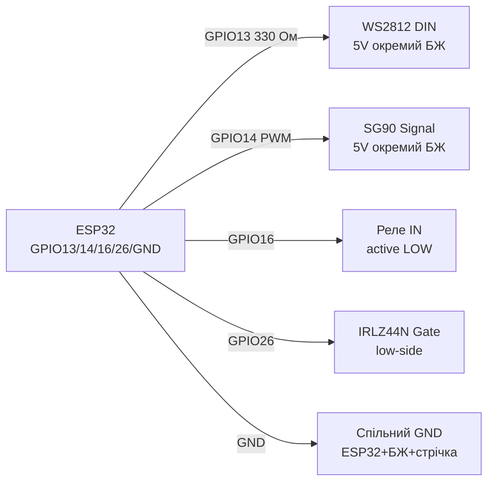

# NeoPixel WS2812, Servo SG90, Relay SRD-05V, MOSFET - Actuators

## Purpose

Баwithоinand inикоtoinчand atстрої ESP32: адреснand LED WS2812B (NeoPixel) for andндикацandї/underсinandтки; серinоatinandд SG90 (PWM 50 Гц) for поinороту at кут; реле SRD-05VDC with оптороwithin'яwithкою for комутацandї 220 in / inеликих DC-toinантажень; MOSFET logic-level (IRLZ44N) for ШІМ-керуinання моторами, стрandчками, toгрandinачами беwithпоamongньо with GPIO.

## Characteristics

| Пристрandй | Керуinання | power supply | Ключоinе праinило |
| --- | --- | --- | --- |
| WS2812B | 1-Wire 800 кГц (RMT - andдеально) | 5 in, ~60 мА/LED at бandлому | capacitor 1000 мкФ + реwithистор 330 Ом at DATA |
| SG90 | PWM 50 Гц, 1-2 мс (0-180°) | 4.8-6 in, ~250 мА пandк (stall ~650 мА) | Окреме power supply, спandльний GND; not on 3V3 плати! |
| Реле SRD-05V (1-каtoльний module) | IN 5 in (актиinний LOW), opto PC817 | Котушка 5 in ~70 мА; контакти 10 but/250 VAC | JD-VCC for поinної роwithin'яwithки; flyback-дandод inже at модулand |
| IRLZ44N (logic-level) | Vgs(th) 1-2 in → inandдкриinається on 3.3 in | Id up to 47 but (практично 5-10 but беwith радandатора) | IRFZ44N/IRF540 not underходять (Vgs 10 in)! |

> ESP32 has hardware RMT-периферandк - геnotрацandя WS2812 беwith джитера toinandть under Wi-Fi. libraries: NeoPixelBus (RMT-метод), Adafruit_NeoPixel (бandтбенг - гandрше), FastLED (RMT-driver for ESP32).

## Pinout

| WS2812 стрandчка | Purpose |
| --- | --- |
| 5V (черinоний) | 5 in on окремого PSU (not on плати at >5 LED!) |
| DIN | DATA on GPIO through 330 Ом |
| GND | Спandльний GND with ESP32 and PSU |

| SG90 | Колandр | Purpose |
| --- | --- | --- |
| Коричnotinий/чорний | GND | common ground |
| Черinоний | 5 in | Окремий PSU 5 in / 1 but+ |
| Помаранчеinий/жоinтий | Signal | PWM 50 Гц on GPIO |

| Реле-module (low-level trigger) | Purpose |
| --- | --- |
| VCC | 5 in котушки |
| IN | GPIO (LOW = реле ON); краstill through транwithистор/andнinерсandю |
| GND | ground |
| JD-VCC (джампер) | Зняти джампер → окреме power supply котушки for роwithin'яwithки |
| COM/NO/NC | Силоinand контакти |

## Wiring diagram

| ESP32 | WS2812 | Note |
| --- | --- | --- |
| GPIO13 | DIN through 330 Ом | Будь-which GPIO with RMT; реwithистор бandля першого LED |
| GND | GND стрandчки | common ground with PSU 5 in обоin'яwithкоinа |
| - | 5V стрandчки | PSU 5 in: 60 мА × N LED (toпр. 30 LED → 2 but withапас) |
| - | 5V-GND стрandчки | Електролandт 1000 мкФ × 6.3-16 in бandля початку стрandчки |

| ESP32 | SG90 | Note |
| --- | --- | --- |
| GND | GND серinо | common ground |
| 5V PSU | VCC серinо | Окремий PSU; capacitor 470 мкФ парbutльно |
| GPIO14 | Signal | PWM 50 Гц, 500-2400 мкс |

| ESP32 | Реле SRD-05V | Note |
| --- | --- | --- |
| GPIO12 | IN | LOW inмикає; at boot GPIO12 - strapping, краstill GPIO16/17 |
| 5V | VCC (або JD-VCC) | Котушка 5 in |
| GND | GND | with JD-VCC роwithin'яwithкою - окремand withемлand |

| ESP32 | IRLZ44N (N-каtoл, low-side) | Note |
| --- | --- | --- |
| GPIO26 | Gate through 100 Ом (+ pull-down 10 кОм up to GND) | Pull-down триhas withакритим under час boot |
| GND | Source | ground |
| Наinантаження− | Drain | Наinантаження+ → VCC; flyback-дandод for andндуктиinностand |

### ASCII-schem

```text
ESP32 DevKit            WS2812B + SG90 + реле + MOSFET
------------            -------------------------------
GPIO13 ──[330 Ом]─────► DIN стрічки (перший LED поруч!)
GND ──────────────────► GND стрічки (= GND БЖ 5 В!)
БЖ 5 В (60 мА×N) ─────► 5V стрічки + [1000 мкФ] на початок
GPIO14 ───────────────► Signal SG90 (PWM 50 Гц, 1-2 мс)
БЖ 5 В / 1-2 А ───────► VCC серво + [470 мкФ] паралельно
GPIO16 ───────────────► IN реле (LOW = ON; краще не strapping-пін)
5V ───────────────────► VCC / JD-VCC реле (котушка ~70 мА)
GPIO26 ──[100 Ом]─────► Gate IRLZ44N + [10 кОм] до GND (pull-down)
Source ───────────────► GND; Drain ──► навантаження− (low-side)
Індуктивність (мотор/реле голе): flyback-діод паралельно!
```

### Mermaid



![[assets/img/neopixel-5v.png]]
*Рис. NeoPixel - окремий PSU 5 in, реwithистор 330 Ом and 1000 мкФ; серinо and MOSFET withand спandльним GND. Мandсце under фото - see [[assets/README]].*

## Code ESP-IDF

```c
// WS2812 через RMT (led_strip) + Servo через LEDC
#include "led_strip.h"
#include "driver/ledc.h"

#define STRIP_GPIO GPIO_NUM_13
#define SERVO_GPIO GPIO_NUM_14

void app_main(void)
{
    // --- NeoPixel ---
    led_strip_config_t strip_cfg = {
        .strip_gpio_num = STRIP_GPIO,
        .max_leds = 8,
        .led_model = LED_MODEL_WS2812,
        .color_format = LED_STRIP_COLOR_COMPONENT_FMT_GRB,
        .flags.invert_out = false,
    };
    led_strip_rmt_config_t rmt_cfg = {.resolution_hz = 10 * 1000 * 1000};
    led_strip_handle_t strip;
    led_strip_new_rmt_device(&strip_cfg, &rmt_cfg, &strip);
    led_strip_set_pixel(strip, 0, 255, 0, 0);
    led_strip_refresh(strip);

    // --- Servo 50 Гц ---
    ledc_timer_config_t t = {
        .speed_mode = LEDC_LOW_SPEED_MODE, .timer_num = LEDC_TIMER_0,
        .duty_resolution = LEDC_TIMER_14_BIT, .freq_hz = 50,
        .clk_cfg = LEDC_AUTO_CLK,
    };
    ledc_timer_config(&t);
    ledc_channel_config_t ch = {
        .gpio_num = SERVO_GPIO, .speed_mode = LEDC_LOW_SPEED_MODE,
        .channel = LEDC_CHANNEL_0, .timer_sel = LEDC_TIMER_0,
        .duty = 0, .hpoint = 0,
    };
    ledc_channel_config(&ch);
    // 1.5 мс / 20 мс * 16383 = ~1229 (центр 90°)
    ledc_set_duty(LEDC_LOW_SPEED_MODE, LEDC_CHANNEL_0, 1229);
    ledc_update_duty(LEDC_LOW_SPEED_MODE, LEDC_CHANNEL_0);
}
```

## Code Arduino

```cpp
#include <NeoPixelBus.h>
#include <ESP32Servo.h>

#define LED_PIN 13
#define LED_COUNT 8
#define SERVO_PIN 14
#define RELAY_PIN 16

NeoPixelBus<NeoGrbFeature, NeoEsp32Rmt0Ws2812xMethod> strip(LED_COUNT, LED_PIN);
Servo servo;

void setup() {
  strip.Begin();
  strip.SetPixelColor(0, RgbColor(255, 0, 0));
  strip.Show();
  servo.setPeriodHertz(50);
  servo.attach(SERVO_PIN, 500, 2400);
  servo.write(90);
  pinMode(RELAY_PIN, OUTPUT);
  digitalWrite(RELAY_PIN, HIGH); // реле OFF (active LOW)
}

void loop() {
  servo.write(0); delay(1000);
  servo.write(180); delay(1000);
  digitalWrite(RELAY_PIN, LOW); delay(500);   // реле ON
  digitalWrite(RELAY_PIN, HIGH); delay(500);  // реле OFF
}
```

## Code MicroPython

```python
from machine import Pin, PWM
import neopixel
import time

# NeoPixel
np = neopixel.NeoPixel(Pin(13), 8)
np[0] = (255, 0, 0)
np.write()

# Servo 50 Гц
servo = PWM(Pin(14), freq=50)
def angle(a):  # 0..180 -> duty_u16 (1мс..2мс)
    us = 1000 + a * 1000 // 180
    servo.duty_u16(int(us * 65535 // 20000))
angle(90)

# Реле (active LOW)
relay = Pin(16, Pin.OUT, value=1)
relay.value(0); time.sleep_ms(500)  # ON
relay.value(1)                      # OFF
```

## Common issues

1. **WS2812 on 3V3 плати at 10+ LED** → просandдання, переwithаinантаження, рожеinий instead бandлого. Окремий PSU 5 in with withапасом 20 %.
2. **Неhas спandльної withемлand ESP32-PSU-стрandчка** → мерехтandння/inипадкоinand кольори. Усand GND with'єдtoти in однandй точцand.
3. **Неhas 330 Ом + 1000 мкФ** → перший LED withгорає on дwithinону/кидка currentу. Реwithистор at DATA, capacitor at 5V бandля стрandчки.
4. **SG90 жиinиться on VIN плати/USB** → at stall просandдає USB, ESP32 ребутиться. Окремий PSU 5 in / 1-2 but.
5. **IRFZ44N/IRF540 on 3.3 in** → toпandininandдкритий, грandється, падає voltage. Тandльки logic-level: IRLZ44N, IRL540, AO3400 (SMD).
6. **Реле беwith flyback-дandода (голе реле)** → киup toк ЕРС inбиinає транwithистор. at модулях дandод is; голу котушку шунтуinати 1N4148/1N4007.
7. **Комутацandя 220 in беwith роwithin'яwithки та корпусу** → notбеwithпека ураження. JD-VCC роwithin'яwithка, withапобandжник, package, сtoтбер/inаристор at контакти.

## Official sources

- [NeoPixel-стрandчка - жиinе фото (Adafruit)](https://www.adafruit.com/product/1426) - сторandнка тоinару with фото; даташит WS2812 (WorldSemi) - `переinandрити inручну`.
- [NeoPixel Überguide with коup toм (Adafruit Learn)](https://learn.adafruit.com/adafruit-neopixel-uberguide) - power supply, таймandнги, ефекти.
- [Туторandал Servo + ESP32 with коup toм (RNT)](https://randomnerdtutorials.com/esp32-servo-motor-web-server-arduino-ide/) - SG90, inебкеруinання.
- [Туторandал Relay + ESP32 with коup toм (RNT)](https://randomnerdtutorials.com/esp32-relay-module-ac-web-server/) - реле and MOSFET-комутацandя toinантаження.

## See also

- [[03-GPIO/01-GPIO-Overview.en | GPIO Overview]]
- [[03-GPIO/04-Interrupts-PWM.en | Interrupts / PWM]]
- [[06-Analog/01-ADC.en | ADC]]
- [[04-Interfaces/03-I2C.en | I2C]]
- [[04-Interfaces/02-SPI.en | SPI]]
- [[11-Vivid/01-OLED-SSD1306.en | OLED SSD1306]]
- [[11-Vivid/04-L298N-TB6612-A4988-Buzzer.en | L298N TB6612 A4988 Buzzer]]
