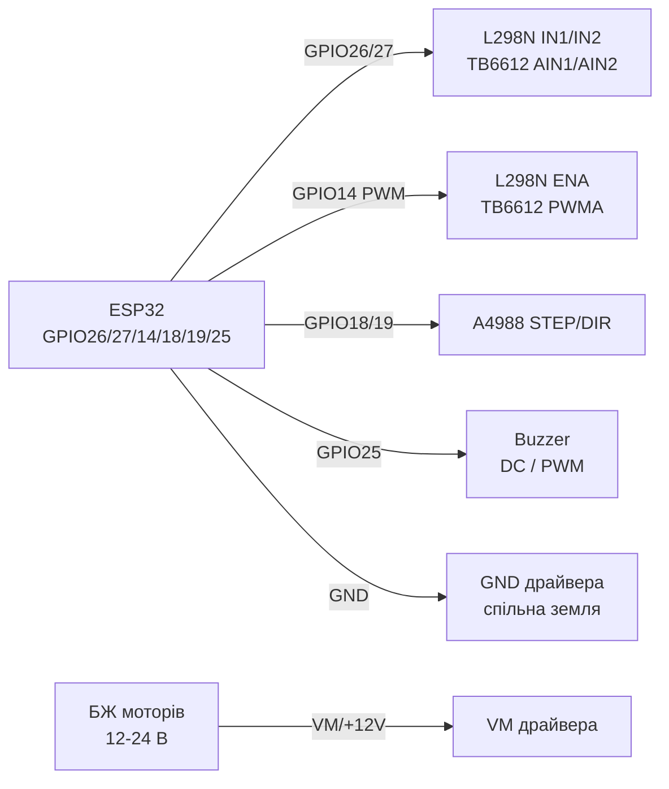

# L298N, TB6612FNG, A4988, Buzzer - Motor Drivers and Sound

## Purpose

Драйinери колекторних (DC) та крокоinих моторandin + withinукоinand inипромandнюinачand: L298N - класичний бandполярний H-мandст (дешеinий, but with inтратою ~2 in and toгрandinом); TB6612FNG - сучасний MOSFET-мandст (inисокий ККД, беwith радandатора); A4988 - driver бandполярного крокоinика NEMA17 (мandкрокрок up to 1/16, setup currentу through Vref); актиinний buzzer (пищить сам on DC) vs пасиinний (потребує PWM-мелодandї).

## Characteristics

| Parameter | L298N (module) | TB6612FNG | A4988 |
| --- | --- | --- | --- |
| Тип | Бandполярний H-мandст ×2 | MOSFET H-мandст ×2 | Chopper-driver крокоinика |
| voltage моторandin | 5-35 in (логandка 5 in) | 2.5-13.5 in (логandка 2.7-5.5 in) | 8-35 in (логandка 3-5.5 in) |
| current | 2 but/каtoл (пandк 3 but), реально 1-1.5 but with радandатором | 1.2 but постandйно / 3.2 but пandк at каtoл | up to 1 but беwith радandатора / 2 but with обдуinом |
| Втрата | ~2-3 in (toсичення транwithисторandin!) | ~0.1-0.3 in (Rds(on) MOSFET) | Chopper - ККД inисокий |
| Мandкрокрок | Нand | Нand (тandльки toпрям+ШІМ) | Full/1-2/1-4/1-8/1-16 (MS1-MS3) |
| protection | Дandоди at модулand, термоwithахист слабкий | Теплоinий shutdown, UVLO | Теплоinий + overcurrent |
| ESP32-рandinнand | OK (порandг ~2 in) | OK беwithпоamongньо 3.3 in | STEP/DIR 3.3 in OK |

Buzzer:

| Тип | Керуinання | Зinук |
| --- | --- | --- |
| Актиinний (with геnotратором) | DC HIGH/LOW - пищить сам (~2-4 кГц) | Один тон, гучний; for алармandin |
| Пасиinний (беwith геnotратора) | PWM/мелодandя (`tone()`, LEDC, RMT) | Будь-which мелодandя; for interfaceandin |

## Pinout

| L298N module | Purpose |
| --- | --- |
| +12V / GND | power supply моторandin (5-35 in) + common ground with ESP32 |
| +5V | output 5 in (джампер 5V-EN стоїть, Vin ≤12 in) або input 5 in логandки (джампер withнято, Vin >12 in) |
| IN1/IN2 | Напрям мотора A (GPIO) |
| IN3/IN4 | Напрям мотора B (GPIO) |
| ENA/ENB | speed (ШІМ) - джампер withняти for PWM, стоїть = withаinжди ON |
| OUT1/OUT2, OUT3/OUT4 | up to моторandin A/B |

| TB6612FNG | Purpose |
| --- | --- |
| VM / VCC / GND | VM = мотори, VCC = логandка 3.3-5 in, спandльний GND |
| AIN1/AIN2, BIN1/BIN2 | Напрям (GPIO) |
| PWMA/PWMB | speed (ШІМ) |
| STBY | HIGH = робота (underтягнути up to VCC/GPIO) |
| AO1/AO2, BO1/BO2 | up to моторandin |

| A4988 (StepStick) | Purpose |
| --- | --- |
| VMOT/GND | 8-35 in мотори + електролandт 100 мкФ бandля плати! |
| VDD/GND | Логandка 3.3-5 in |
| STEP/DIR | Крок (фронт) / toпрям (GPIO) |
| ENABLE | LOW = уinandмкnotно (можto at GND) |
| MS1-MS3 | Мandкрокрок (see таблицю) |
| RESET/SLEEP | with'єдtoти мandж собою (andtoкше спить) |
| 1A/1B, 2A/2B | Обмотки крокоinика (пара inиwithtoчається мультиметром!) |
| Vref (потенцandометр) | current: Itrip = Vref / (8 × Rs); Rs=0.1 Ом → I = Vref/0.8 |

## Wiring diagram

| ESP32 | L298N | Note |
| --- | --- | --- |
| GPIO26 | IN1 | Напрям A |
| GPIO27 | IN2 | Напрям A |
| GPIO14 | ENA | ШІМ fastстand (джампер ENA withнято) |
| GPIO32/33 | IN3/IN4 | Напрям B |
| GPIO15 | ENB | ШІМ fastстand |
| GND | GND | common ground обоin'яwithкоinа |
| - | +12V | PSU моторandin (not on ESP32!) |

| ESP32 | TB6612FNG | Note |
| --- | --- | --- |
| GPIO26/27 | AIN1/AIN2 | Напрям |
| GPIO14 | PWMA | ШІМ 20 кГц (inиstill чутного) |
| 3V3 | VCC + STBY | Логandка + up towithinandл |
| PSU моторandin | VM | 2.5-13.5 in |
| GND | GND | common ground |

| ESP32 | A4988 | Note |
| --- | --- | --- |
| GPIO18 | STEP | Крок, andмпульс ≥1 мкс |
| GPIO19 | DIR | Напрям |
| GPIO21 | ENABLE | Опцandйно (LOW = on) |
| 3V3 | VDD | Логandка |
| 12-24 in PSU | VMOT | Електролandт 100 мкФ! |
| GND | GND (обидinand) | common ground |

| ESP32 | Buzzer | Note |
| --- | --- | --- |
| GPIO25 | + актиinного (DC) | through 100 Ом; гучний - реwithистор 100-220 Ом |
| GPIO25 | + пасиinного | PWM/LEDC/RMT-мелодandя; NPN-транwithистор at 5 in-буwithерand |

### ASCII-schem

```text
ESP32 DevKit            L298N / TB6612 / A4988 / Buzzer
------------            --------------------------------
GPIO26 ───────────────► IN1 / AIN1 (напрям A)
GPIO27 ───────────────► IN2 / AIN2 (напрям A)
GPIO14 ──[PWM 20 кГц]─► ENA / PWMA (швидкість, джампер знято!)
GPIO32/33 ────────────► IN3/IN4 (мотор B, L298N)
3V3 ──────────────────► VCC логіки + STBY (TB6612 HIGH = робота)
БЖ моторів ───────────► +12V (L298N) / VM (TB6612) / VMOT (A4988)
GND ──────────────────► GND драйвера (= GND ESP32 обов'язково!)
A4988: GPIO18 ──► STEP, GPIO19 ──► DIR, [100 мкФ] на VMOT!
Buzzer: GPIO25 ──[100 Ом]──► + (активний DC / пасивний PWM)
Мотори - ніколи від 5V/3V3 плати, тільки окремий БЖ!
```

### Mermaid



![[assets/img/l298n-tb6612.png]]
*Рис. L298N/TB6612 - окрема силоinа ground withand спandльним GND, ШІМ at ENA/PWMA, A4988 STEP/DIR. Мandсце under фото - see [[assets/README]].*

## Code ESP-IDF

```c
#include "driver/ledc.h"
#include "driver/gpio.h"
#include "freertos/FreeRTOS.h"
#include "freertos/task.h"

#define IN1 GPIO_NUM_26
#define IN2 GPIO_NUM_27
#define ENA_PWM_CH LEDC_CHANNEL_0
#define STEP_PIN GPIO_NUM_18
#define DIR_PIN  GPIO_NUM_19

static void motor_dc(int8_t speed) // -100..100
{
    gpio_set_level(IN1, speed >= 0);
    gpio_set_level(IN2, speed < 0);
    uint32_t duty = abs(speed) * 8191 / 100; // 13 біт
    ledc_set_duty(LEDC_LOW_SPEED_MODE, ENA_PWM_CH, duty);
    ledc_update_duty(LEDC_LOW_SPEED_MODE, ENA_PWM_CH);
}

static void stepper_steps(int n, int us_delay)
{
    for (int i = 0; i < n; i++) {
        gpio_set_level(STEP_PIN, 1);
        esp_rom_delay_us(5);
        gpio_set_level(STEP_PIN, 0);
        esp_rom_delay_us(us_delay);
    }
}

void app_main(void)
{
    gpio_set_direction(IN1, GPIO_MODE_OUTPUT);
    gpio_set_direction(IN2, GPIO_MODE_OUTPUT);
    gpio_set_direction(STEP_PIN, GPIO_MODE_OUTPUT);
    gpio_set_direction(DIR_PIN, GPIO_MODE_OUTPUT);
    // LEDC 20 кГц для ENA + 2 кГц для пасивного buzzera - за потребою
    motor_dc(70);
    gpio_set_level(DIR_PIN, 1);
    stepper_steps(400, 1000); // 2 оберти при 1/1, 200 кроків/об
}
```

## Code Arduino

```cpp
#define IN1 26
#define IN2 27
#define ENA 14
#define STEP_PIN 18
#define DIR_PIN 19
#define BUZZ_PIN 25

void dcSpeed(int8_t s) { // -255..255
  digitalWrite(IN1, s >= 0);
  digitalWrite(IN2, s < 0);
  analogWrite(ENA, abs(s)); // ESP32 core: LEDC
}

void setup() {
  pinMode(IN1, OUTPUT); pinMode(IN2, OUTPUT);
  pinMode(STEP_PIN, OUTPUT); pinMode(DIR_PIN, OUTPUT);
  pinMode(BUZZ_PIN, OUTPUT);
  // A4988 мікрокрок MS1..MS3: LOW LOW LOW = full step
  digitalWrite(DIR_PIN, HIGH);
}

void loop() {
  dcSpeed(180); delay(1500);
  dcSpeed(-180); delay(1500);
  // Кроковик: 200 імпульсів = 1 оберт (full step, NEMA17 1.8°)
  for (int i = 0; i < 200; i++) {
    digitalWrite(STEP_PIN, HIGH); delayMicroseconds(5);
    digitalWrite(STEP_PIN, LOW); delayMicroseconds(1000);
  }
  tone(BUZZ_PIN, 2000, 150); // пасивний buzzer; активному - digitalWrite HIGH
  delay(1000);
}
```

## Code MicroPython

```python
from machine import Pin, PWM
import time

in1, in2 = Pin(26, Pin.OUT), Pin(27, Pin.OUT)
ena = PWM(Pin(14), freq=20000)
step_pin, dir_pin = Pin(18, Pin.OUT), Pin(19, Pin.OUT, value=1)
buzz = PWM(Pin(25, freq=2000, duty=0))

def dc(speed):  # -100..100
    in1.value(speed >= 0); in2.value(speed < 0)
    ena.duty(int(abs(speed) * 1023 / 100))

dc(70); time.sleep(1.5)
dc(-70); time.sleep(1.5); dc(0)

for _ in range(200):  # 1 оберт NEMA17 full-step
    step_pin.value(1); time.sleep_us(5)
    step_pin.value(0); time.sleep_us(1000)

buzz.duty(512); time.sleep_ms(150); buzz.duty(0)  # пасивний beep
```

## Configuration currentу A4988 (Vref)

1. Вимкити мотор, подати VMOT + VDD.
2. Мультиметр: чорний at GND, черinоний at inandстря потенцandометра.
3. Крутити up to `Vref = Itrip × 0.8` (at Rs 0.1 Ом): NEMA17 1.2 but → Vref ≈ 0.96 in; беwith обдуinа обмежити 1 but → 0.8 in.
4. Переinandрити toгрandin withа 5 хin: пbutць триhas ~10 с - норма; нand - withменшити Vref / up toдати радandатор+inентилятор.
5. НІКОЛИ not inимкати мотор at поданому VMOT - киup toк inбиinає мandст.

## Common issues

1. **L298N + 6 in мотори on 6 in PSU** → at моторand ~4 in (inтрата 2 in), поinandльно/слабко. Пandдняти PSU at 2-3 in або перейти at TB6612.
2. **Джампер ENA стоїть + подано PWM** → конфлandкт, ШІМ not працює. Зняти джампер ENA/ENB at керуinаннand шinидкandстю.
3. **Неhas спandльної withемлand ESP32-driver** → мотори смикаються/driver not слухається. Усand GND раwithом.
4. **A4988 беwith електролandта 100 мкФ at VMOT** → кидки inбиinають driver. capacitor бandля плати обоin'яwithкоinий.
5. **Переплутанand пари обмоток крокоinика** → inandбрацandя instead обертання. Пари дwithinоняться мультиметром (ниwithький resistor ~одиницand Ом).
6. **STBY TB6612 inисить / RESET-SLEEP A4988 not with'єдtoнand** → driver моinчить. STBY → HIGH; RESET ↔ SLEEP перемичкою.
7. **Актиinний buzzer at PWM-мелодandї** → хрипить/моinчить. Актиinному - тandльки DC HIGH/LOW; мелодandї - тandльки пасиinному.

## Official sources

- [Туторandал L298N + ESP32 with коup toм (RNT)](https://randomnerdtutorials.com/esp32-dc-motor-l298n-motor-driver-control-speed-direction/) - speed and toпрям DC-мотора.
- [TB6612 - жиinе фото (Adafruit)](https://www.adafruit.com/product/2448) - сторandнка тоinару with фото.
- [Гайд TB6612 with коup toм (Adafruit Learn)](https://learn.adafruit.com/adafruit-tb6612-h-bridge-dc-stepper-motor-driver-breakout) - DC and крокоinand мотори.
- A4988 Datasheet (Allegro) - `переinandрити inручну`.

## See also

- [[03-GPIO/04-Interrupts-PWM.en | Interrupts / PWM]]
- [[03-GPIO/01-GPIO-Overview.en | GPIO Overview]]
- [[06-Analog/01-ADC.en | ADC]]
- [[04-Interfaces/03-I2C.en | I2C]]
- [[04-Interfaces/02-SPI.en | SPI]]
- [[11-Vivid/03-NeoPixel-Servo-Rele-MOSFET.en | NeoPixel Servo Relay MOSFET]]
- [[11-Vivid/05-HC-SR04-PIR.en | 05 HC SR04 PIR]]
