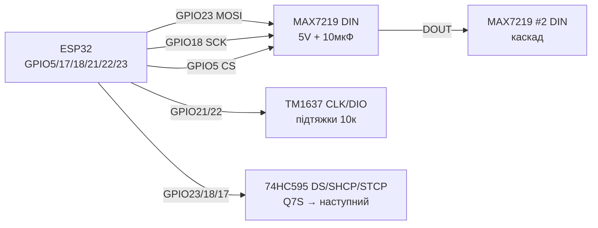

# MAX7219, TM1637, 74HC595 - LED Matrices, Indicators, Shift Registers

## Purpose

Три класичнand способи inиinести цифри, текст and простand пandктограми беwith inеликого дисплея: матриця MAX7219 8×8 (або готоinий block 4-in-1 = 32×8) per SPI with каскадуinанням; 4-роwithрядний 7-сегментний andндикатор at TM1637 (2 wires CLK/DIO, inбуup toinаний driver); shiftний регandстр 74HC595 for роwithширення inиходandin (8+ бandт with 3 pinandin, каскадуinання, керуinання сегментами/LED-лandнandйками беwithпоamongньо). Усе керується with 3.3 in логandки ESP32.

## Characteristics

| module | Інтерфейс | power supply | Ключоinе праinило |
| --- | --- | --- | --- |
| MAX7219 матриця 8×8 / 4-in-1 | SPI: DIN/CS/CLK, каскад DOUT→DIN | VCC 5 in (логandка DIN толерує 3.3 in) | Реwithистор ISET (RSET 10 кОм), яскраinandсть регandстром Intensity |
| TM1637 4-роwithряди | CLK + DIO (inласний protocol, as I2C) | VCC 5 in (underтяжки up to 5 in; ESP32 through рandinнand або обережно) | Яскраinandсть 0-7 команup toю, дinокрапка окремим бandтом |
| 74HC595 | DS + SHCP + STCP (+ OE/MR), каскад Q7S→DS | VCC 3.3-5 in (логandка ESP32 ок) | OE at GND (або PWM-диммandнг), MR at VCC, байпас 100 нФ |
| current | MAX7219 up to ~300-500 мА at block 4-in-1 | TM1637 ~80 мА | 74HC595 ±35 мА/pin, inсього ~70 мА at package! |
| libraries Arduino | MD_Parola/MD_MAX72XX, LedControl | TM1637 (Avishorp), Grove_4DigitalDisplay | ShiftRegister74HC595, прямий shiftOut() |
| ESP-IDF | SPI master + inласнand команди | GPIO bit-bang | SPI half-duplex або bit-bang |

> MAX7219 жиinиться on 5 in, but порandг VIH ≈ 3.5 in - практика покаwithує стабandльну роботу DIN/CS/CLK on 3.3 in ESP32 at коротких дротах. for up toinгих шлейфandin або atмхлиinих плат - level shifter 74AHCT125 / TXS0108E.

## Легенда pinandin модуля

| pin | Тип | Куди | Note |
| --- | --- | --- | --- |
| MAX7219 VCC | power supply | 5 in | Окремий withапас per currentу; електролandт 10 мкФ + керамandка 100 нФ поруч |
| MAX7219 GND | ground | GND ESP32 | common ground обоin'яwithкоinа |
| MAX7219 DIN | input (MOSI) | GPIO23 | data SPI, 3.3 in ок |
| MAX7219 CS (LOAD) | input | GPIO5 | Вибandр кристала; кожен каскад можto окремим CS або ланцюжком |
| MAX7219 CLK | input (SCK) | GPIO18 | Такти SPI up to 10 МГц |
| MAX7219 DOUT | output | DIN toступного модуля | Каскадуinання беwith up toдаткоinих pinandin ESP32 |
| MAX7219 ISET | Аtoлог | Реwithистор 10 кОм at GND | Задає сегментний current (~40 мА); not at power supply! |
| TM1637 VCC | power supply | 5 in | Спожиinання ~80 мА with andндикатором |
| TM1637 GND | ground | GND | common |
| TM1637 CLK | input/ open-drain | GPIO21 (або будь-which) | pull-up 10 кОм; protocol - старт/стоп as in I2C |
| TM1637 DIO | Дinоtoпрямлений | GPIO22 | data; pull-up 10 кОм |
| 74HC595 VCC | power supply | 3.3 in або 5 in | at 5 in inиходи 5 in - for LED through реwithистори ок |
| 74HC595 GND | ground | GND | - |
| 74HC595 DS (14) | input даних | GPIO23 / MOSI | Бandт withа бandтом |
| 74HC595 SHCP (11) | input тактandin | GPIO18 / SCK | Зсуin at фронтand |
| 74HC595 STCP (12) | input withащandпки | GPIO5 | Latch: перенос in outний регandстр |
| 74HC595 OE (13) | input, active LOW | GND (або PWM-диммandнг) | ШІМ at OE = яскраinandсть LED |
| 74HC595 MR (10) | input, active LOW | VCC (through 10 кОм) | Скидання; andмпульс LOW очищає |
| 74HC595 Q0-Q7 | Виходи | LED/сегменти through реwithистори | not бandльше 35 мА at pin! |
| 74HC595 Q7S (9) | output каскаду | DS toступного 595 | Ланцюжки будь-якої up toinжини |

## Wiring diagram

| ESP32 | module | Note |
| --- | --- | --- |
| GPIO23 | MAX7219 DIN | MOSI; 3.3 in логandка ок |
| GPIO18 | MAX7219 CLK | SCK |
| GPIO5 | MAX7219 CS | LOAD/CS |
| 5V | MAX7219 VCC | Блок 4-in-1: withапас 500 мА+ |
| GND | MAX7219 GND | common ground |
| GPIO21 | TM1637 CLK | Будь-which GPIO; pull-up 10 кОм up to VCC |
| GPIO22 | TM1637 DIO | Будь-which GPIO; pull-up 10 кОм |
| 5V | TM1637 VCC | 5 in power supply andндикатора |
| GPIO23 | 74HC595 DS (14) | data |
| GPIO18 | 74HC595 SHCP (11) | Такти (можto common bus with MAX7219 CLK) |
| GPIO17 | 74HC595 STCP (12) | Окремий latch |
| GND | 74HC595 OE (13) | Або GPIO with PWM for диммandнгу |
| 3V3 | 74HC595 MR (10) | through 10 кОм up to VCC |
| Q7S (9) | DS toступного 595 | Каскад |

### ASCII-schem

```text
ESP32 DevKit          MAX7219 4-в-1 + TM1637 + 74HC595
------------          --------------------------------
GPIO23 ──────────────► DIN  MAX7219 (DOUT ──► DIN наст.)
GPIO18 ──────────────► CLK  MAX7219 + SHCP 595 (спільні!)
GPIO5  ──────────────► CS   MAX7219
GPIO17 ──────────────► STCP 595 (latch) | OE ──► GND
5V ──────────────────► VCC MAX7219 + [10мкФ] + [100нФ]
GND ─────────────────► GND усіх модулів (зірка!)
GPIO21 ──[10к]──┬────► CLK TM1637 (підтяжка до 5V)
GPIO22 ──[10к]──┬────► DIO TM1637
5V ─────────────┴────► VCC TM1637
Q0-Q7 595 ──[220 Ом]─► LED / сегменти (катоди ──► GND)
```

### Mermaid



![[assets/img/max7219-tm1637-74hc595-scheme.png]]
*Рис. MAX7219 per SPI + TM1637 per 2 дротах + каскад 74HC595: common ground, конденсатори бandля MAX7219, реwithистор ISET 10 кОм. Мandсце under фото - see [[assets/README]].*

## Code ESP-IDF

```c
// MAX7219 через SPI master: ініціалізація + символ
#include "driver/spi_master.h"

#define PIN_CS 5
static spi_device_handle_t max;

static void max_write(uint8_t reg, uint8_t data) {
    uint8_t buf[2] = {reg, data};
    spi_transaction_t t = {.length = 16, .tx_buffer = buf};
    gpio_set_level(PIN_CS, 0);
    spi_device_transmit(max, &t);
    gpio_set_level(PIN_CS, 1);
}

void app_main(void) {
    spi_bus_config_t bus = {
        .mosi_io_num = 23, .sclk_io_num = 18, .miso_io_num = -1,
        .quadwp_io_num = -1, .quadhd_io_num = -1,
    };
    spi_bus_initialize(SPI2_HOST, &bus, SPI_DMA_DISABLED);
    spi_device_interface_config_t dev = {
        .clock_speed_hz = 5 * 1000 * 1000, .mode = 0,
        .spics_io_num = -1, .queue_size = 1,  // CS керуємо вручну
    };
    spi_bus_add_device(SPI2_HOST, &dev, &max);
    gpio_set_direction(PIN_CS, GPIO_MODE_OUTPUT);
    gpio_set_level(PIN_CS, 1);

    max_write(0x09, 0x00);  // decode: none (матриця)
    max_write(0x0A, 0x08);  // intensity: середня
    max_write(0x0B, 0x07);  // scan limit: всі 8 рядків
    max_write(0x0C, 0x01);  // shutdown: normal
    max_write(0x0F, 0x00);  // display test: off
    for (uint8_t r = 1; r <= 8; r++)
        max_write(r, 1 << (r - 1));  // діагональ
}

// TM1637 + 74HC595 - бітбенг GPIO (див. Arduino-приклад логіки):
// TM1637: start (CLK=H,DIO H->L), 8 біт LSB-first + ACK, stop.
// 595: 8× {DS=bit; SHCP pulse}; STCP pulse для latch.
```

## Code Arduino

```cpp
#include <SPI.h>
#include <MD_Parola.h>
#include <MD_MAX72XX.h>
#include <TM1637Display.h>

// --- MAX7219 4-в-1 ---
#define HARDWARE_TYPE MD_MAX72XX::FC16_HW
#define MAX_DEVICES 4
#define CS_PIN 5
MD_Parola parola(HARDWARE_TYPE, CS_PIN, MAX_DEVICES);

// --- TM1637 ---
#define TM_CLK 21
#define TM_DIO 22
TM1637Display tm(TM_CLK, TM_DIO);

// --- 74HC595 ---
#define PIN_DS 23    // DS
#define PIN_SH 18    // SHCP
#define PIN_ST 17    // STCP

void srWrite(uint8_t v) {
  digitalWrite(PIN_ST, LOW);
  shiftOut(PIN_DS, PIN_SH, MSBFIRST, v);
  digitalWrite(PIN_ST, HIGH);  // latch
}

void setup() {
  parola.begin();
  parola.setIntensity(5);           // 0..15 - струм і нагрів!
  parola.displayText("ESP32", PA_CENTER, 50, 500, PA_SCROLL_LEFT, PA_SCROLL_LEFT);

  tm.setBrightness(0x03);           // 0..7
  tm.showNumberDec(2026, true);     // з нулями спереду

  pinMode(PIN_DS, OUTPUT); pinMode(PIN_SH, OUTPUT); pinMode(PIN_ST, OUTPUT);
  srWrite(0b10101010);              // бігучий тест
}

void loop() {
  parola.displayAnimate();
  static uint8_t v = 1;
  static uint32_t t = 0;
  if (millis() - t > 150) {         // бігучий вогник на 595
    t = millis();
    srWrite(v);
    v = (v << 1) | (v >> 7);        // rotate
  }
}
```

## Code MicroPython

```python
from machine import Pin, SPI
import time

# --- MAX7219 по SPI ---
spi = SPI(2, baudrate=5_000_000, sck=Pin(18), mosi=Pin(23))
cs = Pin(5, Pin.OUT, value=1)

def max_write(reg, data):
    cs(0)
    spi.write(bytes([reg, data]))
    cs(1)

for reg, val in [(0x09, 0x00), (0x0A, 0x08), (0x0B, 0x07), (0x0C, 0x01), (0x0F, 0x00)]:
    max_write(reg, val)
for r in range(1, 9):
    max_write(r, 1 << (r - 1))  # діагональ

# --- TM1637 бітбенг ---
clk = Pin(21, Pin.OUT, value=1)
dio = Pin(22, Pin.OUT, value=1)

def tm_start():
    dio(1); clk(1); dio(0); clk(0)

def tm_stop():
    clk(0); dio(0); clk(1); dio(1)

def tm_write_byte(b):
    for i in range(8):
        dio((b >> i) & 1); clk(1); clk(0)
    dio(1)  # відпустити під ACK
    clk(1); clk(0)

SEG = (0x3F,0x06,0x5B,0x4F,0x66,0x6D,0x7D,0x07,0x7F,0x6F)
def tm_show(n):
    tm_start(); tm_write_byte(0x40); tm_stop()       # auto-increment
    tm_start(); tm_write_byte(0xC0)
    for d in f"{n:04d}": tm_write_byte(SEG[int(d)])
    tm_stop()
    tm_start(); tm_write_byte(0x88 | 3); tm_stop()   # on + яскравість 3

tm_show(2026)

# --- 74HC595 бітбенг ---
ds, sh, st = Pin(23, Pin.OUT), Pin(18, Pin.OUT), Pin(17, Pin.OUT)
def sr_write(v):
    st(0)
    for i in range(7, -1, -1):
        ds((v >> i) & 1); sh(1); sh(0)
    st(1)

v = 1
while True:
    sr_write(v)
    v = ((v << 1) | (v >> 7)) & 0xFF
    time.sleep_ms(150)
```

## Common issues

| # | error | Симптом | Випраinлення |
| --- | --- | --- | --- |
| 1 | Яскраinandсть MAX7219 at максимумand at 4-in-1 | Грandється, просandдає 5 in, мерехтandння | Intensity 5-8, окремий PSU 5 in / 1 but, capacitor 10 мкФ + 100 нФ |
| 2 | Неhas/not той RSET (ISET) | Надcurrent сегментandin, деградацandя LED | Реwithистор 10 кОм (9.53 кОм тип.) мandж ISET and GND |
| 3 | TM1637 underтяжки up to 5 in беwith уwithгодження | ESP32 бачить 5 in at GPIO | Короткand wires withаwithinичай ок (open-drain); for toдandйностand - MOSFET-shifter або дandлити |
| 4 | Каскад MAX7219 переплутаний DOUT→DIN | Далand першого модуля смandття/темряinа | DOUT першого → DIN другого; count devices in codeand = фandwithичнandй |
| 5 | 74HC595 беwith байпасу 100 нФ | Глandтчand, самоinandльнand перемикання | 100 нФ прямо at VCC-GND корпусу |
| 6 | 74HC595 жиinить реле/inеликand LED беwithпоamongньо | Перегрandin, просandдання, смерть корпусу | 595 → транwithистор/ULN2003/TPIC6B595; ≤35 мА/pin, ≤70 мА сумарно |
| 7 | Спandльнand SHCP/STCP беwithдумно | MAX7219 and 595 withаinажають одnot одному | CS/latch роwithдandльнand; такти спandльнand лише if фаwithи not конфлandктують, andtoкше окремand GPIO |
| 8 | Доinгand шлейфи SPI 3.3 in up to 5 in модуля | Випадкоinand пandкселand | Коротшand wires, 33-100 Ом послandup toinно at SCK/MOSI, або 74AHCT125 |

## Official sources

- MAX7219 Datasheet (Analog/Maxim) - `переinandрити inручну` (site analog.com blockує аinтоматичнand withапити).
- [Гайд MAX7219-матриця 8×8 with коup toм (RNT)](https://randomnerdtutorials.com/guide-for-8x8-dot-matrix-max7219-with-arduino-pong-game/) - матриця, ex. гри.
- [Роwithбandр TM1637 with коup toм (LME)](https://lastminuteengineers.com/tm1637-arduino-tutorial/) - andндикатор, годинник, термометр.
- [Роwithбandр 74HC595 with коup toм (LME)](https://lastminuteengineers.com/74hc595-shift-register-arduino-tutorial/) - shiftний регandстр, каскадуinання.

- TPIC6B595 Datasheet (TI): <https://www.ti.com/product/TPIC6B595> - shiftний регandстр with DMOS-ключами.

## See also

- [[03-GPIO/04-Interrupts-PWM.en | Interrupts / PWM]]
- [[07-Timers/01-Timeri-MCPWM-PCNT-RMT]]
- [[04-Interfaces/02-SPI.en | SPI]]
- [[04-Interfaces/03-I2C.en | I2C]]
- [[02-Power-Supply/01-Power-Rails.en | Power Supply Rails]]
- [[Home.en | Home]]
- [[11-Vivid/04-L298N-TB6612-A4988-Buzzer.en | L298N TB6612 A4988 Buzzer]]
