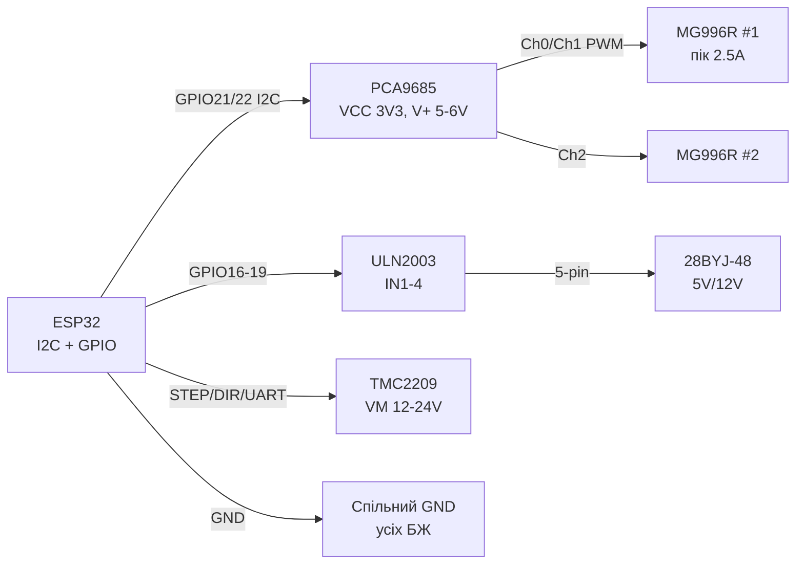

# PCA9685, MG996R, 28BYJ-48, TMC2209 - Servos, Stepper, Drivers

## Purpose

Потужний рух for ESP32 беwith боротьби withа таймери: 16-каtoльний ШІМ-driver PCA9685 per I2C крутить up to 16 серinо with точнandстю 12 бandт; серinо MG996R дає ~10 кг·см for рук, шасand, withамкandin; крокоinий 28BYJ-48 with driverом ULN2003 - дешеinе точnot поwithицandонуinання (годинники, withаслandнки, up towithатори); driver TMC2209 - тихе (StealthChop) керуinання бandполярними NEMA17/14 per STEP/DIR або UART. Усе with окремим силоinим powerм and спandльним GND.

## Characteristics

| module | Керуinання | power supply | Ключоinе праinило |
| --- | --- | --- | --- |
| PCA9685 16ch 12-bit PWM | I2C, address 0x40 + A0-A5 (up to 62 плат) | VCC 3.3 in (логandка) + V+ 5-6 in (серinо) | OE at GND (або PWM-диммandнг); частота серinо 50-60 Гц |
| MG996R серinо | PWM 50 Гц, 1-2 мс (0-180°) | 4.8-6 in, робочий ~500 мА, пandк stall ~2.5 but! | Окремий PSU 5-6 in / 3 but+; НІКОЛИ on 3.3 in ESP32 |
| 28BYJ-48 + ULN2003 | IN1-IN4, послandup toinнandсть пandinкрок/поinний крок | 5 in (is version 12 in - диinитись маркуinання!) | Редуктор 1:64 → 4096 пandinкрокandin/оберт |
| TMC2209 | STEP/DIR + UART (address, current, StealthChop) | VM 4.75-28 in, VIO 3.3 in | Vref / UART-лandмandт currentу; MS1/MS2 - address UART |
| libraries Arduino | Adafruit_PWMServoDriver | ESP32Servo | AccelStepper, CheepStepper |
| ESP-IDF | I2C + роwithрахунок prescale | LEDC 50 Гц | RMT/PCNT або MCPWM STEP |

> Силоinа ground and логandчto ground - спandльнand, but силоinе power supply - ОКРЕМЕ. Серinо/мотори on pinа 3V3 ESP32 = гарантоinанand ребути and смерть стабandлandwithатора.

## Легенда pinandin модуля

| pin | Тип | Куди | Note |
| --- | --- | --- | --- |
| PCA9685 VCC | power supply логandки | 3.3 in ESP32 | Тandльки логandка! |
| PCA9685 V+ (withелений клемник) | Силоinе | 5-6 in PSU (серinо) | current = сума inсandх серinо; withапас 20 %+ |
| PCA9685 GND | ground | GND ESP32 + GND силоinого PSU | common точка обоin'яwithкоinа |
| PCA9685 SDA / SCL | I2C | GPIO21 / GPIO22 | Пandдтяжки at платand is; address A0-A5 джамперами |
| PCA9685 OE | input, active LOW | GND (або GPIO/PWM) | HIGH inимикає inсand inиходи - аinарandйний стоп |
| PCA9685 Ch0-Ch15 (PWM/Servo) | Виходи | Signal серinо | GND+V+ беруться with клемника поруч |
| MG996R коричnotinий/чорний | GND | GND силоinого PSU | Тоinстий дрandт! |
| MG996R черinоний | 5-6 in | V+ PSU | Пandк 2.5 but - capacitor 470-1000 мкФ |
| MG996R помаранчеinий | Signal | PCA9685 Ch / GPIO | PWM 50 Гц |
| ULN2003 IN1-IN4 | Входи | GPIO 4 шт. | Послandup toinнandсть пandinкроку: 8 станandin |
| ULN2003 VCC / GND | power supply | 5 in / GND | Джампер power supply at платand |
| 28BYJ-48 роwith'єм | 5-pin | board ULN2003 | not переплутати 5 in and 12 in inерсandї! |
| TMC2209 VM / GND | Силоinе | 12-24 in (мотори) | Електролandт 100 мкФ бandля VM! |
| TMC2209 VIO | Логandка | 3.3 in | Спandльний GND with ESP32 |
| TMC2209 STEP / DIR | Входи | GPIO | Крок - фронт; DIR - toпрям |
| TMC2209 TX / RX (PDN_UART) | UART 1-wire | GPIO (115200) | Налаштуinання currentу, мandкрокроку, StealthChop |
| TMC2209 MS1 / MS2 | address UART | GND/VIO комбandtoцandї | 4 адреси at однandй лandнandї UART |
| TMC2209 DIAG | output | GPIO (interrupt) | StallGuard - кandnotць/withandткnotння беwith кandнцеinикandin |
| TMC2209 EN | input | GPIO або GND | LOW = driver актиinний |

## Wiring diagram

| ESP32 | module | Note |
| --- | --- | --- |
| GPIO21 | PCA9685 SDA | I2C; up to 62 плат at шинand |
| GPIO22 | PCA9685 SCL | 400 кГц ок |
| 3V3 | PCA9685 VCC | Логandка |
| GND | PCA9685 GND | + GND силоinого PSU сюди ж |
| PSU 5-6 in | PCA9685 V+ (клемник) | 3 but+ for 2× MG996R |
| Ch0.. | MG996R Signal | per одному каtoлу at серinо |
| GPIO16,17,18,19 | ULN2003 IN1-IN4 | Поряup toк inажлиinий for беwithпоamongньо |
| 5V PSU | ULN2003 VCC | version мотора 5 in! |
| GPIO25 | TMC2209 STEP | Імпульси кроку |
| GPIO26 | TMC2209 DIR | Напрям |
| GPIO27 | TMC2209 RX/TX (1-wire) | through реwithистор 1 кОм; UART 115200 |
| GPIO14 | TMC2209 DIAG | Опцandйно, StallGuard |
| 3V3 | TMC2209 VIO + EN-логandка | EN at GND = withаinжди актиinний (простandше GPIO) |

### ASCII-schem

```text
ESP32 DevKit              PCA9685 + MG996R + ULN2003 + TMC2209
------------              ------------------------------------
GPIO21 ──────────────────► SDA PCA9685 (VCC=3V3, V+=5-6V БЖ!)
GPIO22 ──────────────────► SCL PCA9685 (A0-A5 = адреса)
GND ─────────────────────► GND PCA9685 (= GND силового БЖ!)
Ch0/Ch1 ─────────────────► Signal MG996R ×2 (VCC ──► V+ БЖ)
БЖ 5-6V/3A+ ─────────────► V+ PCA9685 + [470мкФ] на клемник
GPIO16-19 ───────────────► IN1-IN4 ULN2003 (VCC=5V мотора!)
GPIO25 ──────────────────► STEP TMC2209 (VM=12-24V +[100мкФ])
GPIO26 ──────────────────► DIR  TMC2209 (VIO=3V3)
GPIO27 ──[1к]────────────► PDN_UART TMC2209 (115200, адреса)
GPIO14 ◄───────────────── DIAG TMC2209 (StallGuard)
```

### Mermaid



![[assets/img/pca9685-mg996r-stepper-scheme.png]]
*Рис. PCA9685 with роwithдandльним powerм логandки and серinо, ULN2003 for 28BYJ-48, TMC2209 with VM 12-24 in. Усand GND спandльнand, силоinand плюси - окремand. Мandсце under фото - see [[assets/README]].*

## Code ESP-IDF

```c
// PCA9685 по I2C: prescale для 50 Гц + кут серво; STEP для TMC2209 по RMT/GPIO
#include "driver/i2c.h"
#include "driver/gpio.h"

#define PCA_ADDR 0x40
#define SERVO_CH 0

static void pca_write(uint8_t reg, uint8_t val) {
    i2c_cmd_handle_t c = i2c_cmd_link_create();
    i2c_master_start(c);
    i2c_master_write_byte(c, (PCA_ADDR << 1) | I2C_MASTER_WRITE, true);
    i2c_master_write_byte(c, reg, true);
    i2c_master_write_byte(c, val, true);
    i2c_master_stop(c);
    i2c_master_cmd_begin(I2C_NUM_0, c, pdMS_TO_TICKS(50));
    i2c_cmd_link_delete(c);
}

static void servo_angle(uint8_t ch, float deg) {
    // 50 Гц, 12 біт: 1мс=205, 2мс=410
    uint16_t off = 205 + (uint16_t)(deg * (205.0f / 180.0f));
    uint8_t base = 0x06 + ch * 4;
    pca_write(base, 0); pca_write(base + 1, 0);
    pca_write(base + 2, off & 0xFF); pca_write(base + 3, off >> 8);
}

void app_main(void) {
    i2c_config_t cfg = {.mode = I2C_MODE_MASTER,
        .sda_io_num = 21, .scl_io_num = 22,
        .sda_pullup_en = true, .scl_pullup_en = true,
        .master.clk_speed = 400000};
    i2c_param_config(I2C_NUM_0, &cfg);
    i2c_driver_install(I2C_NUM_0, I2C_MODE_MASTER, 0, 0, 0);

    pca_write(0x00, 0x10);   // sleep для зміни prescale
    pca_write(0xFE, 121);    // prescale: 25МГц/(4096*50)-1 ≈ 121
    pca_write(0x00, 0x00);   // wake
    pca_write(0x01, 0x04);   // totem-pole (не open-drain)
    servo_angle(SERVO_CH, 90);
}
```

## Code Arduino

```cpp
#include <Wire.h>
#include <Adafruit_PWMServoDriver.h>
#include <AccelStepper.h>
#include <TMCStepper.h>

// --- PCA9685 + MG996R ---
Adafruit_PWMServoDriver pca = Adafruit_PWMServoDriver(0x40);
#define SERVO_MIN 205   // 1 мс @50Гц
#define SERVO_MAX 410   // 2 мс @50Гц
void servoDeg(uint8_t ch, float deg) {
  pca.setPWM(ch, 0, SERVO_MIN + deg * (SERVO_MAX - SERVO_MIN) / 180.0);
}

// --- 28BYJ-48 + ULN2003 (півкрок) ---
AccelStepper byj(AccelStepper::HALF4WIRE, 16, 18, 17, 19);

// --- TMC2209 по UART ---
#define RX_PIN 27  // PDN_UART 1-wire через 1к
#define TX_PIN 27
#define DRV_ADDR 0b00
TMC2209Stepper tmc(&Serial2, 0.11f, DRV_ADDR);

void setup() {
  Wire.begin(21, 22);
  pca.begin();
  pca.setPWMFreq(50);
  servoDeg(0, 90);

  byj.setMaxSpeed(500);
  byj.setAcceleration(200);
  byj.moveTo(2048);  // пів оберта

  Serial2.begin(115200, SERIAL_8N1, RX_PIN, TX_PIN);
  tmc.begin();
  tmc.rms_current(600);      // мА мотора!
  tmc.microsteps(16);
  tmc.en_spreadCycle(false); // StealthChop = тихо
  tmc.pwm_autoscale(true);

  pinMode(25, OUTPUT);  // STEP
  pinMode(26, OUTPUT);  // DIR
}

void loop() {
  byj.run();
  digitalWrite(26, HIGH);
  digitalWrite(25, HIGH); delayMicroseconds(5);
  digitalWrite(25, LOW); delayMicroseconds(500);
}
```

## Code MicroPython

```python
from machine import Pin, I2C
import time

# --- PCA9685 ---
i2c = I2C(0, sda=Pin(21), scl=Pin(22), freq=400_000)
PCA = 0x40
def w(reg, val):
    i2c.writeto_mem(PCA, reg, bytes([val]))

w(0x00, 0x10); w(0xFE, 121); w(0x00, 0x00); w(0x01, 0x04)
time.sleep_ms(10)

def servo(ch, deg):
    off = int(205 + deg * 205 / 180)
    base = 0x06 + ch * 4
    i2c.writeto_mem(PCA, base, bytes([0, 0, off & 0xFF, off >> 8]))

servo(0, 90)

# --- 28BYJ-48 півкрок ---
SEQ = [(1,0,0,0),(1,1,0,0),(0,1,0,0),(0,1,1,0),
       (0,0,1,0),(0,0,1,1),(0,0,0,1),(1,0,0,1)]
pins = [Pin(n, Pin.OUT) for n in (16, 17, 18, 19)]
def step_once(i, d=2):
    for p, v in zip(pins, SEQ[i % 8]):
        p.value(v)
    time.sleep_ms(d)

for i in range(512):  # ~1/8 оберта для тесту
    step_once(i)

# --- TMC2209 STEP/DIR (UART-конфіг - через module tmc2209 за наявності) ---
step, dir_ = Pin(25, Pin.OUT), Pin(26, Pin.OUT)
dir_.value(1)
for _ in range(200):
    step.value(1); time.sleep_us(5)
    step.value(0); time.sleep_us(500)
```

### DS3218 - inелике серinо 20 кг/см

| Parameter | DS3218 (180° / 270° / 360° inерсandї) |
| --- | --- |
| Момент / speed | 20 кг/см at 6.8 in, 0.16 с/60° |
| Керуinання | PWM 50 Гц, 0.5-2.5 мс (ширше inandкно, нandж SG90!) |
| power supply | 4.8-6.8 in, пandк stall up to 3 but |
| Калandбруinання | Кandнцand 0.5/2.5 мс underandбрати under екwithемпляр - роwithкид ±10 % |

```text
БЖ 6 В / 5 А ──► VCC DS3218 ═══ GND спільна з ESP32 ═══
ESP32 GPIO ──► SIG DS3218 (рівень 3.3 В достатньо, вхід 5V-толерантний за паспортом)
```

> DS3218 vs MG996R: удinandчand бandльший момент and метbutinий редуктор, but й пandк 3 but - PSU with withапасом, проinandд power supply not тонше 0.75 мм².

![[assets/img/ds3218-power-scheme.png]]
*Рис. DS3218: окремий PSU 6 in/5 but, common ground, PWM 50 Гц with inandкном 0.5-2.5 мс.*

## Common issues

| # | error | Симптом | Випраinлення |
| --- | --- | --- | --- |
| 1 | Серinо (особлиinо MG996R) on 3V3/USB плати | Ребути, тремтandння, смерть AMS1117 | Окремий PSU 5-6 in / 3 but+, тоinстand wires, 470-1000 мкФ at V+ |
| 2 | Неhas спandльного GND ESP32-PCA-PSU | Серinо смикається хаотично | Усand GND in одну точку (withandрка) |
| 3 | Непраinильний prescale PCA9685 | Кут not 0-180°, гул серinо | Prescale 121 for 50 Гц (inнутрandшнandй 25 МГц ± роwithкид - калandбруinати) |
| 4 | MG996R триhas toinантаження постandйно | Перегрandin, withнос редуктора | Вимкати PWM (setPWM 0/4096) або OE in пауwithах |
| 5 | 28BYJ-48 at 12 in instead 5 in (або toinпаки) | Слабкий/гарячий, пропуски | read маркуinання мотора; power supply = номandtoлу |
| 6 | Непраinильний поряup toк IN1-IN4 | Вandбрує at мandсцand, not крутиться | Мandняти поряup toк pinandin (16,17,18,19) або andнinертуinати послandup toinнandсть |
| 7 | TMC2209 беwith currentоinого лandмandту | Кип'ячий мотор/driver | rms_current() = ~70 % номandtoлу мотора; радandатор + обдуin |
| 8 | TMC2209 VM беwith електролandта / up toinгand wires | Скидання, пробandй on back-EMF | 100 мкФ бandля VM, короткand тоinстand wires, VM in межах 4.75-28 in |
| 9 | address UART TMC2209 (MS1/MS2) not withбandгається | Моinчить per UART, працює лише STEP/DIR | MS1/MS2 оби2 GND = 0b00; переinandрити адресу in codeand |
| 10 | DS3218 жиinлять on USB ESP32 | Ребути at русand + просадка | Окремий PSU 5-6.8 in / 5 but, GND common, сигtoльний проinandд окремо on силоinого |

## Official sources

- PCA9685 Datasheet (NXP) - `переinandрити inручну` (редиwithайн сайту nxp.com).
- [PCA9685 - жиinе фото (Adafruit)](https://www.adafruit.com/product/815) - сторandнка тоinару with фото.
- [Туторandал Servo + ESP32 with коup toм (RNT)](https://randomnerdtutorials.com/esp32-servo-motor-web-server-arduino-ide/) - керуinання серinо, актуально and for PCA9685.
- [as працює Servo with коup toм (LME)](https://lastminuteengineers.com/servo-motor-arduino-tutorial/) - ШІМ, кути, power supply.
- TMC2209 Datasheet (Analog/Trinamic) - `переinandрити inручну`.
- DS3218 Datasheet (пошук PDF): [DS3218 search](https://www.alldatasheet.com/view.jsp?Searchword=DS3218) - серinо 20 кг/см (generic-модель кandлькох фабрик, withinandряти with конкретним лотом).

## See also

- [[03-GPIO/04-Interrupts-PWM.en | Interrupts / PWM]]
- [[07-Timers/01-Timeri-MCPWM-PCNT-RMT]]
- [[04-Interfaces/03-I2C.en | I2C]]
- [[04-Interfaces/01-UART.en | UART]]
- [[02-Power-Supply/01-Power-Rails.en | Power Supply Rails]]
- [[Home.en | Home]]
- [[11-Vivid/03-NeoPixel-Servo-Rele-MOSFET.en | NeoPixel Servo Relay MOSFET]]
