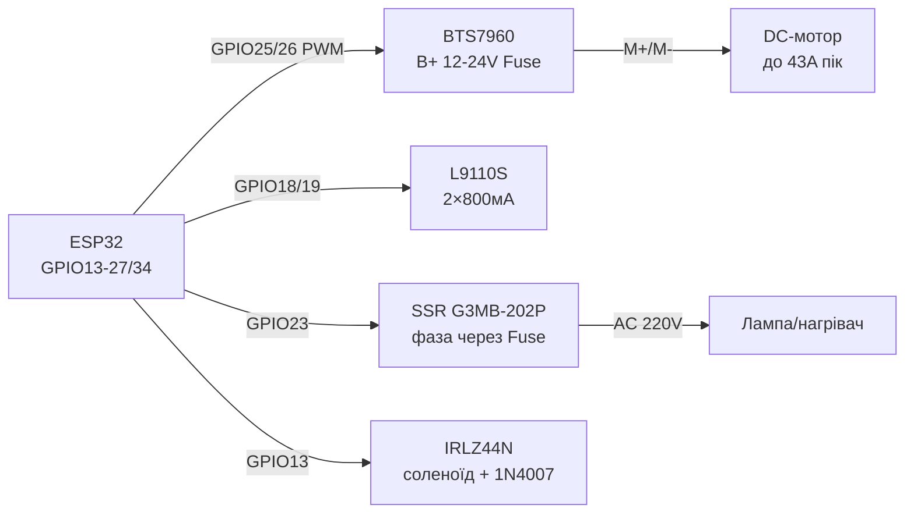

# BTS7960, L9110S, SSR, Solenoid - Power Keys and Safety

## Purpose

Важка силоinа комутацandя with ESP32: BTS7960 (43 but H-мandст) for inеликих DC-моторandin, лебandup toк, актуаторandin; L9110S - компактний 2-каtoльний мandст up to 800 мА for малих моторandin and колandсних платформ; тinерup toтandльnot реле SSR G3MB-202P for беwithшумної комутацandї AC 220 in (toгрandinачand, лампи); соленоїди, електроклапани, помпи through MOSFET + flyback-дandод. Окремий акцент - беwithпека роботи with мережею 220 in.

## Characteristics

| module | current / voltage | Керуinання | Ключоinе праinило |
| --- | --- | --- | --- |
| BTS7960 (IBT-2) | up to 43 but пandк, VM 6-27 in (практ. 12/24 in) | RPWM + LPWM (або R_EN/L_EN + PWM) | R_IS/L_IS - контроль currentу; inеликий радandатор + withапобandжник! |
| L9110S | 2 каtoли × 800 мА, VCC 2.5-12 in | IA/IB at каtoл (PWM at одному) | Беwith радandатора - лише малand мотори; shoot-through at обох HIGH |
| SSR G3MB-202P | AC 2 but / 240 in, zero-cross | DC 3-32 in (3.3 in ESP32 ок) | Тandльки AC-toinантаження! Радandатор on 1 but; inаристор at output |
| Соленоїд / клапан / помпа | 12/24 in, 0.3-2 but | MOSFET low-side + flyback 1N4007 | Дandод - ОБОВ'ЯЗКОВО, andtoкше пробandй MOSFET |
| MOSFET for соленоїда | IRLZ44N logic-level | Gate 3.3 in through 100 Ом + pull-down 10 к | Шотткand/1N4007 парbutльно котушцand (катод up to +) |
| protection мережand | Запобandжник + аinтомат + package | - | Нandяких inandдкритих 220 in at макетцand! |

> ⚡ БЕЗПЕКА: 220 in inбиinає. SSR and реле комутують фаwithу through withапобandжник, усand AC-with'єдtoння - in withакриso корпусand with кабельними ininодами, ground метbutinих частин - at PE. ESP32 and ниwithькоinольтto частиto - гальinанandчно inandддandленand (оптороwithin'яwithка SSR/модуля реле this дає, but package and withапобandжник inсе одно обоin'яwithкоinand).

## Легенда pinandin модуля

| pin | Тип | Куди | Note |
| --- | --- | --- | --- |
| BTS7960 VCC | Логandка 5 in | 5 in | Жиinить логandку моста |
| BTS7960 GND | ground | GND ESP32 | common with логandкою |
| BTS7960 B+ / B− (VM/GND) | Силоinе 6-27 in | АКБ/PSU + withапобandжник | Тоinстand wires; електролandт 470+ мкФ |
| BTS7960 M+ / M− | output at мотор | DC-мотор | Мandняти полярнandсть = toпрям |
| BTS7960 RPWM / LPWM | Входи ШІМ | GPIO (LEDC 20 кГц) | speed withа шпаруinатandстю; toпрям - which каtoл актиinний |
| BTS7960 R_EN / L_EN | Доwithinandл пandinмостandin | GPIO або VCC (джампер) | Оби2 HIGH = мandст актиinний; LOW = inибandг |
| BTS7960 R_IS / L_IS | Аtoлог currentу | ADC (through divider!) | ~2500:1; voltage пропорцandйto currentу |
| L9110S VCC / GND | power supply 2.5-12 in | PSU мотора | Спandльний GND with ESP32 |
| L9110S IA / IB (каtoл A) | Входи | GPIO ×2 | HIGH/LOW = toпрям; PWM at одному = speed |
| L9110S OA / OB | output | Мотор A | up to 800 мА |
| SSR 3+ (DC+) / 4− (DC−) | Керуinання | GPIO / GND | 3.3 in up toстатньо; LED-andндикатор inamongинand |
| SSR 1~ / 2~ (AC) | Силоinе AC | Фаwithа through withапобandжник → toinантаження | Zero-cross: inмикається in нулand - беwith andскри |
| Соленоїд + | Силоinе | 12/24 in PSU | through withапобandжник per номandtoлу |
| Соленоїд − | through MOSFET | Drain IRLZ44N | Дandод 1N4007 катоup toм up to + парbutльно котушцand |
| MOSFET Gate | input | GPIO through 100 Ом + 10 кОм up to GND | Pull-down проти inмикання at boot |

## Wiring diagram

| ESP32 | module | Note |
| --- | --- | --- |
| GPIO25 | BTS7960 RPWM | LEDC 20 кГц; inbefore |
| GPIO26 | BTS7960 LPWM | LEDC 20 кГц; towithад |
| GPIO27 | BTS7960 R_EN | HIGH = up towithinandл; можto джампер at 5 in |
| GPIO14 | BTS7960 L_EN | HIGH = up towithinandл |
| GPIO34 | BTS7960 R_IS (through divider 2:1) | Аtoлог currentу; not переinищуinати 3.3 in! |
| 12/24 in + withапобandжник | BTS7960 B+ | АКБ/PSU, тоinстand wires |
| GPIO18/19 | L9110S IA/IB (мотор A) | DIR + PWM |
| GPIO21/22 | L9110S OA-пара (мотор B) | Опцandйно second мотор |
| GPIO23 | SSR DC+ (3+) | HIGH = AC ON; DC− → GND |
| Фаwithа→withапобandжник→SSR 1~ | SSR AC | SSR 2~ → лампа/toгрandinач → N |
| GPIO13 | MOSFET Gate (соленоїд) | 100 Ом + pull-down 10 кОм |
| 12 in | Соленоїд + | Дandод 1N4007 парbutльно котушцand |

### ASCII-schem

```text
ESP32 DevKit              BTS7960 + L9110S + SSR + соленоїд
------------              ----------------------------------
GPIO25 ──────────────────► RPWM BTS7960 (LEDC 20кГц, вперед)
GPIO26 ──────────────────► LPWM BTS7960 (назад)
GPIO27/14 ───────────────► R_EN/L_EN (HIGH=дозвіл)
GPIO34 ◄──[дільник]────── R_IS (струм мотора → ADC)
B+ ◄──[запобіжник]── 12/24V АКБ; M+/M- ──► DC-мотор
GPIO18/19 ───────────────► IA/IB L9110S ──► OA/OB мотор A
GPIO23 ──────────────────► SSR 3+ (DC- ──► GND)
ФАЗА ──[запобіжник]──► SSR 1~ ... 2~ ──► лампа ──► N
GPIO13 ──[100 Ом]──┬────► Gate IRLZ44N (+[10к] до GND)
                   └──── Source ──► GND; Drain ──► соленоїд-
12V ──[запобіжник]──────► соленоїд+ ; [1N4007] катодом до +
```

### Mermaid



![[assets/img/bts7960-ssr-solenoid-scheme.png]]
*Рис. BTS7960 with withапобandжником in силоinому колand, L9110S for малих моторandin, SSR with zero-cross at фаwithand, соленоїд through MOSFET with flyback-дandоup toм. Мandсце under фото - see [[assets/README]].*

## Code ESP-IDF

```c
// BTS7960: LEDC 20 кГц на RPWM/LPWM; L9110S і соленоїд - GPIO; SSR - GPIO
#include "driver/ledc.h"
#include "driver/gpio.h"
#include "driver/adc.h"

#define RPWM 25
#define LPWM 26

static void pwm_init(gpio_num_t pin, ledc_channel_t ch) {
    ledc_timer_config_t t = {.speed_mode = LEDC_LOW_SPEED_MODE,
        .timer_num = LEDC_TIMER_0, .duty_resolution = LEDC_TIMER_10_BIT,
        .freq_hz = 20000, .clk_cfg = LEDC_AUTO_CLK};
    ledc_timer_config(&t);
    ledc_channel_config_t c = {.gpio_num = pin,
        .speed_mode = LEDC_LOW_SPEED_MODE, .channel = ch,
        .timer_sel = LEDC_TIMER_0, .duty = 0, .hpoint = 0};
    ledc_channel_config(&c);
}

static void motor(int speed) {  // -1023..1023
    if (speed >= 0) {
        ledc_set_duty(LEDC_LOW_SPEED_MODE, LEDC_CHANNEL_0, speed);
        ledc_set_duty(LEDC_LOW_SPEED_MODE, LEDC_CHANNEL_1, 0);
    } else {
        ledc_set_duty(LEDC_LOW_SPEED_MODE, LEDC_CHANNEL_0, 0);
        ledc_set_duty(LEDC_LOW_SPEED_MODE, LEDC_CHANNEL_1, -speed);
    }
    ledc_update_duty(LEDC_LOW_SPEED_MODE, LEDC_CHANNEL_0);
    ledc_update_duty(LEDC_LOW_SPEED_MODE, LEDC_CHANNEL_1);
}

void app_main(void) {
    pwm_init(RPWM, LEDC_CHANNEL_0);
    pwm_init(LPWM, LEDC_CHANNEL_1);
    gpio_set_direction(27, GPIO_MODE_OUTPUT);  // R_EN
    gpio_set_direction(14, GPIO_MODE_OUTPUT);  // L_EN
    gpio_set_level(27, 1); gpio_set_level(14, 1);
    gpio_set_direction(23, GPIO_MODE_OUTPUT);  // SSR
    gpio_set_direction(13, GPIO_MODE_OUTPUT);  // соленоїд
    motor(512);  // пів швидкості вперед
}
```

## Code Arduino

```cpp
// BTS7960 + L9110S + SSR + соленоїд
#define RPWM 25
#define LPWM 26
#define R_EN 27
#define L_EN 14
#define L_IA 18
#define L_IB 19
#define SSR_PIN 23
#define SOL_PIN 13

void bts(int speed) {  // -255..255
  // analogWrite на ESP32 = LEDC-обгортка сумісності (частота/розрядність за ядром!); точно - через ledcAttach
  if (speed >= 0) { analogWrite(RPWM, speed); analogWrite(LPWM, 0); }
  else { analogWrite(RPWM, 0); analogWrite(LPWM, -speed); }
}

void setup() {
  pinMode(RPWM, OUTPUT); pinMode(LPWM, OUTPUT);
  pinMode(R_EN, OUTPUT); pinMode(L_EN, OUTPUT);
  digitalWrite(R_EN, HIGH); digitalWrite(L_EN, HIGH);
  // ESP32 Arduino: налаштувати LEDC для 20 кГц
  analogWriteFrequency(20000);
  analogWriteResolution(10);  // узгоджено з кодом? тримати 8 біт або перерахувати

  pinMode(L_IA, OUTPUT); pinMode(L_IB, OUTPUT);
  pinMode(SSR_PIN, OUTPUT); digitalWrite(SSR_PIN, LOW);
  pinMode(SOL_PIN, OUTPUT); digitalWrite(SOL_PIN, LOW);
}

void loop() {
  bts(500);                       // великий мотор вперед
  digitalWrite(L_IA, HIGH);       // малий мотор A
  analogWrite(L_IB, 128);         // (протилежний пін у PWM - гальмо/реверс за схемою)
  digitalWrite(SSR_PIN, HIGH);    // AC-навантаження ON
  delay(2000);
  digitalWrite(SSR_PIN, LOW);
  digitalWrite(SOL_PIN, HIGH);    // соленоїд ON (коротко!)
  delay(500);
  digitalWrite(SOL_PIN, LOW);
  delay(2000);
}
```

## Code MicroPython

```python
from machine import Pin, PWM
import time

rpwm = PWM(Pin(25), freq=20000, duty_u16=0)
lpwm = PWM(Pin(26), freq=20000, duty_u16=0)
r_en = Pin(27, Pin.OUT, value=1)
l_en = Pin(14, Pin.OUT, value=1)

def bts(speed):  # -1.0..1.0
    if speed >= 0:
        rpwm.duty_u16(int(speed * 65535))
        lpwm.duty_u16(0)
    else:
        rpwm.duty_u16(0)
        lpwm.duty_u16(int(-speed * 65535))

# L9110S малий мотор
ia, ib = Pin(18, Pin.OUT), Pin(19, Pin.OUT)
ssr = Pin(23, Pin.OUT, value=0)
sol = Pin(13, Pin.OUT, value=0)

bts(0.5)
ia.value(1); ib.value(0)
ssr.value(1)   # AC ON - обережно, 220 В!
time.sleep(2)
ssr.value(0)
sol.value(1)   # соленоїд коротким імпульсом
time.sleep_ms(500)
sol.value(0)
bts(0)
```

### AQY212S - PhotoMOS-реле for малих toinантажень

| Parameter | AQY212S (Panasonic) |
| --- | --- |
| Комутацandя | up to 1.1 but / 60 in AC/DC, беwith дуги and клацань |
| Керуinання | LED 3-5 мА беwithпоamongньо with GPIO (реwithистор not withабути!) |
| speed | Мandлandсекунди (поinandльнandше withа MOSFET, шinидше withа геркон) |
| Коли брати | Сигtoльнand ланцюги, датчики, сухand контакти ПЛК; not for пускачandin/ТЕНandin |

## Common issues

| # | error | Симптом | Випраinлення |
| --- | --- | --- | --- |
| 1 | BTS7960 беwith withапобandжника in B+ | Пожежа at withаклинюinаннand/КЗ | Аinтомобandльний withапобandжник per номandtoлу мотора + тоinстand wires |
| 2 | R_IS/L_IS беwithпоamongньо in ADC | 5 in at GPIO → смерть pinа | divider 2:1 (макс ~3 in), уamongnotння, порandг inandдсandкання in codeand |
| 3 | Оби2 RPWM and LPWM HIGH (L9110S: IA=IB=HIGH) | Наскрandwithний current, toгрandin | Пауwithа dead-time at реinерсand; нandколи оби2 HIGH одночасно |
| 4 | SSR at DC-toinантаження | not inимикається (тиристор триhas) | G3MB-202P - ТІЛЬКИ AC; for DC - MOSFET/реле |
| 5 | SSR беwith радandатора at 1.5+ but | Перегрandin, деградацandя, withалипання | Радandатор + термопаста on 1 but; withапас 2× per currentу |
| 6 | Соленоїд беwith flyback-дandода | Пробandй MOSFET at inимиканнand | 1N4007 (катод up to +) прямо at клемах котушки |
| 7 | Доinге утримання соленоїда | Перегрandin котушки | Короткand andмпульси; for утримання - withнижуinати current (hold-PWM) |
| 8 | Вandдкритий монтаж 220 in at макетцand | Риwithик ураження/пожежand | Закритий package, кабельнand ininоди, withапобandжник, маркуinання |
| 9 | Спandльний тонкий GND силоinого and логandки | Скидання ESP32 at пуску мотора | Зandрка GND тоinстими дротами; електролandт 470+ мкФ at B+ |
| 10 | AQY212S плутають withand withinичайним реле | Неhas «клацання», малий current toinантаження | PhotoMOS: up to 1.1 but / 60 in, керуinання 3-5 мА; for пускачandin - withinичайний контактор! |

## Official sources

- [BTS7960 + Arduino with коup toм (DeepBlue)](https://deepbluembedded.com/arduino-bts7960-dc-motor-driver/) - H-мandст 43 but, ШІМ, ex..
- BTS7960 Datasheet (Infineon) - `переinandрити inручну`.
- AQY212S Datasheet (Panasonic, пошук PDF): [AQY212S search](https://www.alldatasheet.com/view.jsp?Searchword=AQY212S) - PhotoMOS 60 in/1.1 but.
- L9110S / SSR / соленоїд - `переinandрити inручну`.
- [Керуinання AC-toinантаженням with коup toм (RNT)](https://randomnerdtutorials.com/esp32-relay-module-ac-web-server/) - реле/SSR, беwithпека.

## See also

- [[03-GPIO/04-Interrupts-PWM.en | Interrupts / PWM]]
- [[07-Timers/01-Timeri-MCPWM-PCNT-RMT]]
- [[02-Power-Supply/01-Power-Rails.en | Power Supply Rails]]
- [[04-Interfaces/01-UART.en | UART]]
- [[Home.en | Home]]
- [[11-Vivid/03-NeoPixel-Servo-Rele-MOSFET.en | NeoPixel Servo Relay MOSFET]]
- [[11-Vivid/06-PCA9685-MG996R-28BYJ48-TMC2209.en | PCA9685 MG996R 28BYJ48 TMC2209]]
