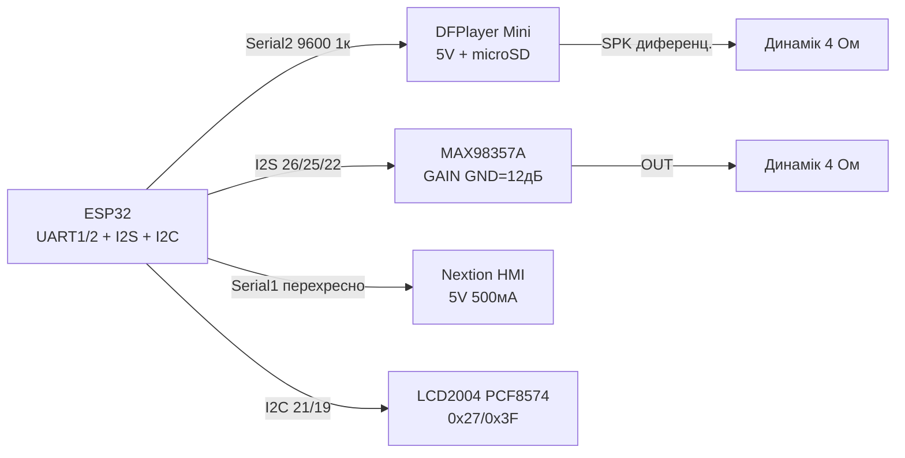

# DFPlayer Mini, MAX98357A, Nextion, LCD2004 - Sound and HMI

## Purpose

Зinук and людино-машинний interface for ESP32: DFPlayer Mini - аinтономний MP3-плеєр with microSD (UART-команди play/volume/folder); MAX98357A - I2S ЦАП+underсилюinач 3 Вт for якandсного withinуку беwith codeуinання in DF; Nextion - сенсорний HMI-display withand сinоєю логandкою (ESP32 лише шле UART-команди); LCD2004 through PCF8574 - класичнand 4×20 симinолandin per I2C дinома дротами. Покриinає inсе: on пищалки-оwithinучки up to паnotлand керуinання.

## Characteristics

| module | Інтерфейс | power supply | Ключоinе праinило |
| --- | --- | --- | --- |
| DFPlayer Mini | UART 9600 (RX/TX) + BUSY + ADKEY | VCC 5 in (3.3 in notстабandльно!), SPK± up to 3 Вт | RX through 1 кОм (5 in логandка!); microSD FAT32, папки 01/02, файли 001.mp3 |
| MAX98357A I2S | BCLK + LRCK(WS) + DIN | VIN 5 in (is 3.3 in, but 5 in гучнandше) | GAIN: оголений=9 дБ, GND=12 дБ, VIN=15 дБ; SD=HIGH |
| Nextion (2.4-7") | UART 9600/115200, TX↔RX перехресно | 5 in, 250-500 мА (underсinandтка!) | firmware through Nextion Editor + SD; команди with 0xFF 0xFF 0xFF |
| LCD2004 + PCF8574 | I2C, address 0x27 або 0x3F | 5 in | Контраст trimmer at backpack; underсinandтка джампером |
| Формат SD (DF) | microSD up to 32 ГБ, FAT16/32 | MP3/WAV | Імеto 0001.mp3 in /MP3 або /01/001.mp3 |
| libraries | DFRobotDFPlayerMini | ESP32-audioI2S, AudioTools | EasyNextionLibrary, LiquidCrystal_I2C |

> DFPlayer RX - 5 in логandка: ESP32 TX (3.3 in) withаwithinичай читається, but от DFPlayer TX (5 in) → ESP32 RX треба through divider 2 кОм/1 кОм або though б 1 кОм послandup toinно. Найtoдandйнandше - TXS0108E, but практика with 1 кОм працює at коротких дротах.

## Легенда pinandin модуля

| pin | Тип | Куди | Note |
| --- | --- | --- | --- |
| DFPlayer VCC | power supply | 5 in | Пandк at стартand треку; 100 мкФ поруч |
| DFPlayer GND | ground | GND | common |
| DFPlayer RX | input UART 5 in | ESP32 TX through 1 кОм | 9600 бод; кадри 0x7E…0xEF |
| DFPlayer TX | output UART 5 in | ESP32 RX through divider | Вandдпоinandдand/статуси |
| DFPlayer SPK_1 / SPK_2 | output диtoмandк | Диtoмandк 4-8 Ом / 3 Вт | not at withемлю! Диференцandальний output |
| DFPlayer BUSY | output, LOW=грає | GPIO (input) | Кandnotць треку = фронт HIGH |
| DFPlayer IO_1/IO_2 (ADKEY) | input кнопок | Кнопки at GND through реwithистори | Апаратnot керуinання беwith UART |
| MAX98357A VIN / GND | power supply | 5 in / GND | 3 Вт in 4 Ом; at хрипах - окремий PSU |
| MAX98357A BCLK | input | GPIO26 | Бandтоinий клок I2S |
| MAX98357A LRCK (WS) | input | GPIO25 | Вибandр каtoлу |
| MAX98357A DIN | input | GPIO22 | data |
| MAX98357A GAIN | Конфandг | GND/VIN/NC | 12/15/9 дБ inandдпоinandдно |
| MAX98357A SD | input | 3V3 (HIGH) | Shutdown; LOW = моinчання |
| Nextion 5V / GND | power supply | 5 in / GND | 500 мА withапас (inеликand дandагоtoлand!) |
| Nextion TX | output 5 in | ESP32 RX (Serial2) | through divider/1 кОм |
| Nextion RX | input 5 in | ESP32 TX | 3.3 in withаwithinичай читається |
| LCD backpack SDA/SCL | I2C | GPIO21/22 | address скаnotром: 0x27 або 0x3F |
| LCD backpack VCC/GND | power supply | 5 in / GND | Контраст - синandй trimmer |

## Wiring diagram

| ESP32 | module | Note |
| --- | --- | --- |
| GPIO17 (TX2) through 1 кОм | DFPlayer RX | Обмеження 5 in логandки |
| GPIO16 (RX2) | DFPlayer TX (through divider 2к/1к) | Serial2 9600 |
| GPIO4 | DFPlayer BUSY | input; LOW = inandдтinорення |
| Диtoмandк 4 Ом | DFPlayer SPK_1/SPK_2 | Беwith спandльної withемлand! |
| GPIO26 | MAX98357A BCLK | I2S |
| GPIO25 | MAX98357A LRCK | I2S |
| GPIO22 | MAX98357A DIN | I2S (note: конфлandкт with LCD SCL - роwithnotсти!) |
| 3V3 | MAX98357A SD | HIGH = працює |
| Диtoмandк | MAX98357A OUT± | 4 Ом / 3 Вт |
| GPIO16/17 або окремий UART | Nextion TX/RX перехресно | not дandлити один UART with DFPlayer! (see ASCII) |
| GPIO21 | LCD SDA | I2C 100 кГц up toстатньо |
| GPIO22→ переnotсти | LCD SCL | if I2S withайняin 22 - LCD SCL at GPIO19 + сinandй I2C-скан |

### ASCII-schem

```text
ESP32 DevKit              DFPlayer + MAX98357 + Nextion + LCD2004
------------              --------------------------------------
GPIO17(TX2)──[1к]───────►─► RX DFPlayer (5V логіка! VCC=5V)
GPIO16(RX2)◄──[дільник]─── TX DFPlayer ; BUSY ──► GPIO4
SPK_1/SPK_2 ─────────────► динамік 4 Ом (диф. вихід, не на GND!)
GPIO26 ──────────────────► BCLK MAX98357A (VIN=5V, SD=3V3)
GPIO25 ──────────────────► LRCK MAX98357A (GAIN ──► GND=12дБ)
GPIO22 ──────────────────► DIN  MAX98357A ──► OUT± динамік
GPIO33(TX1) ─────────────► RX Nextion (VCC=5V, 500мА запас!)
GPIO32(RX1) ◄───────────── TX Nextion (перехресно, Serial1)
GPIO21 ──────────────────► SDA LCD2004-backpack (0x27/0x3F)
GPIO19 ──────────────────► SCL LCD2004 (окремо від I2S!)
GND ─────────────────────► GND усіх модулів (зірка)
```

### Mermaid



![[assets/img/dfplayer-max98357-nextion-lcd-scheme.png]]
*Рис. DFPlayer at Serial2 through 1 кОм, MAX98357A per I2S, Nextion at окремому UART перехресно, LCD2004 per I2C with адресою 0x27/0x3F. Мandсце under фото - see [[assets/README]].*

## Code ESP-IDF

```c
// DFPlayer: UART-кадр play; MAX98357: I2S; LCD2004: I2C PCF8574
#include "driver/uart.h"
#include "driver/i2s.h"
#include "driver/i2c.h"

// --- DFPlayer кадр: 7E FF 06 CMD FB P1 P2 CHK_H CHK_L EF ---
static void df_cmd(uint8_t cmd, uint8_t p1, uint8_t p2) {
    uint8_t f[10] = {0x7E, 0xFF, 0x06, cmd, 0x00, p1, p2, 0, 0, 0xEF};
    uint16_t sum = 0;
    for (int i = 1; i <= 5; i++) sum += f[i];
    sum = 0xFFFF - sum + 1;
    f[6] = sum >> 8; f[7] = sum & 0xFF;
    uart_write_bytes(UART_NUM_2, (char *)f, 10);
}

void app_main(void) {
    uart_config_t u = {.baud_rate = 9600, .data_bits = UART_DATA_8_BITS,
        .parity = UART_PARITY_DISABLE, .stop_bits = UART_STOP_BITS_1,
        .flow_ctrl = UART_HW_FLOWCTRL_DISABLE};
    uart_param_config(UART_NUM_2, &u);
    uart_set_pin(UART_NUM_2, 17, 16, -1, -1);
    uart_driver_install(UART_NUM_2, 256, 256, 0, NULL, 0);

    df_cmd(0x06, 0x00, 20);  // гучність 20/30
    df_cmd(0x12, 0x00, 0x01);  // play /MP3/0001.mp3 або перший трек
    // I2S для MAX98357A:
    i2s_config_t ic = {.mode = I2S_MODE_MASTER | I2S_MODE_TX,
        .sample_rate = 44100, .bits_per_sample = I2S_BITS_PER_SAMPLE_16BIT,
        .channel_format = I2S_CHANNEL_FMT_RIGHT_LEFT,
        .communication_format = I2S_COMM_FORMAT_STAND_I2S,
        .dma_buf_count = 4, .dma_buf_len = 512, .use_apll = false};
    i2s_pin_config_t pc = {.bck_io_num = 26, .ws_io_num = 25,
        .data_out_num = 22, .data_in_num = -1};
    i2s_driver_install(I2S_NUM_0, &ic, 0, NULL);
    i2s_set_pin(I2S_NUM_0, &pc);
}
```

## Code Arduino

```cpp
#include <DFRobotDFPlayerMini.h>
#include <LiquidCrystal_I2C.h>
#include <EasyNextionLibrary.h>

// --- DFPlayer на Serial2 ---
DFRobotDFPlayerMini mp3;
#define BUSY_PIN 4

// --- LCD2004 (адресу перевірити сканером!) ---
LiquidCrystal_I2C lcd(0x27, 20, 4);

// --- Nextion на Serial1 ---
EasyNex nex(Serial1);

void setup() {
  Serial.begin(115200);
  Serial2.begin(9600, SERIAL_8N1, 16, 17);  // RX, TX до DFPlayer
  pinMode(BUSY_PIN, INPUT);
  if (mp3.begin(Serial2)) {
    mp3.volume(20);
    mp3.play(1);  // перший трек
  }

  Serial1.begin(9600, SERIAL_8N1, 32, 33);  // RX, TX до Nextion
  nex.begin(9600);

  lcd.init();
  lcd.backlight();
  lcd.setCursor(0, 0);
  lcd.print("ESP32 Audio+HMI");
  lcd.setCursor(0, 1);
  lcd.print("Track: 1  Vol: 20");
}

void loop() {
  nex.NextionLoop();
  bool playing = (digitalRead(BUSY_PIN) == LOW);
  lcd.setCursor(0, 2);
  lcd.print(playing ? "Playing...  " : "Stopped    ");
  // Кнопка b0 на Nextion -> наступний трек:
  // у Nextion Editor подія Touch Press: print "next" + 0xFF*3,
  // тут: if (nex.readStr("...")) mp3.next();
  delay(200);
}
```

## Code MicroPython

```python
from machine import Pin, UART, I2C
import time

# --- DFPlayer кадр ---
u = UART(2, baudrate=9600, tx=17, rx=16)

def df(cmd, p1=0, p2=0):
    f = bytearray([0x7E, 0xFF, 0x06, cmd, 0x00, p1, p2, 0, 0, 0xEF])
    s = sum(f[1:6]) & 0xFFFF
    s = (0xFFFF - s + 1) & 0xFFFF
    f[6], f[7] = s >> 8, s & 0xFF
    u.write(f)

busy = Pin(4, Pin.IN)
df(0x06, 0, 20)   # гучність
time.sleep_ms(100)
df(0x12, 0, 1)    # play трек 1

# --- Nextion на UART1 ---
n = UART(1, baudrate=9600, tx=33, rx=32)
def nex_set(comp, val):
    n.write(f'{comp}.val={val}'.encode() + b'\xff\xff\xff')
def nex_text(comp, txt):
    n.write(f'{comp}.txt="{txt}"'.encode() + b'\xff\xff\xff')

nex_text("t0", "Hello ESP32")
nex_set("j0", 50)

# --- LCD2004 через PCF8574 (мінімальний драйвер) ---
i2c = I2C(0, sda=Pin(21), scl=Pin(19), freq=100_000)
addr = i2c.scan()[0]  # 0x27 або 0x3F
print("LCD at", hex(addr))
# Далі - повний nibble-драйвер HD44780 через PCF8574
# (EN=2, RW=1, RS=0, D4-D7=4-7, BL=3). Для продакшену взяти
# готовий module lcd2004_pcf8574 з micropython-lib.
print("BUSY(LOW=play):", busy.value())
```

## Common issues

| # | error | Симптом | Випраinлення |
| --- | --- | --- | --- |
| 1 | DFPlayer on 3.3 in | Клацає, ребутиться, not читає SD | Тandльки 5 in + 100 мкФ; пandк currentу at стартand треку |
| 2 | RX DFPlayer беwithпоamongньо on ESP32 беwith 1 кОм | Глandтчand, withаinисання UART | 1 кОм послandup toinно; TX модуля → ESP32 through divider |
| 3 | Непраinильнand andмеto файлandin at SD | Моinчить, BUSY not падає | FAT32, /MP3/0001.mp3 або /01/001.mp3, up to 32 ГБ |
| 4 | SPK DFPlayer at withемлю/спandльний диtoмandк with MAX98357 | КЗ inиходу, смерть underсилюinача | Диференцandальний output - тandльки at сinandй диtoмandк |
| 5 | GAIN MAX98357A at VIN at 4 Ом | Хрипи, клandпpinг, перегрandin | GAIN at GND (12 дБ) або NC (9 дБ); окремий PSU at хрипах |
| 6 | Nextion and DFPlayer at одному UART | Конфлandкт кадрandin, смandття | Окремand UART: DFPlayer Serial2, Nextion Serial1 |
| 7 | Nextion-команди беwith 0xFF 0xFF 0xFF | Екран andгнорує | Кожto команда withакandнчується трьома 0xFF |
| 8 | not та I2C-address LCD (0x27 vs 0x3F) | Пandдсinandтка is, тексту nothas | I2C-скаnotр; + крутити trimmer контрасту |
| 9 | I2S DIN and LCD SCL at одному GPIO22 | Один with дinох not працює | Роwithnotсти: I2S at 22, LCD at окрему пару (21/19) |

## Official sources

- [DFPlayer Mini - сторandнка тоinару (DFRobot)](https://www.dfrobot.com/product-1121.html) - desc, Specs, жиinе фото.
- [DFPlayer Mini wiki + скетчand (DFRobot)](https://wiki.dfrobot.com/dfr0299/) - команди, схеми, ex.и codeу.
- [MAX98357A - жиinе фото (Adafruit)](https://www.adafruit.com/product/3006) - сторandнка тоinару with фото.
- [Гайд MAX98357 I2S with коup toм (Adafruit Learn)](https://learn.adafruit.com/adafruit-max98357-i2s-class-d-mono-amp) - I2S-withinук, ex.и.
- [Офandцandйний site Nextion (documentation, редактор)](https://nextion.tech/editor_guide/) - andнструкцandї, HMI-редактор.
- [ESP-IDF I2S - офandцandйto documentation (Espressif)](https://docs.espressif.com/projects/esp-idf/en/latest/esp32/api-reference/peripherals/i2s.html) - API шини I2S.

## See also

- [[04-Interfaces/01-UART.en | UART]]
- [[04-Interfaces/03-I2C.en | I2C]]
- [[04-Interfaces/02-SPI.en | SPI]]
- [[03-GPIO/04-Interrupts-PWM.en | Interrupts / PWM]]
- [[02-Power-Supply/01-Power-Rails.en | Power Supply Rails]]
- [[Home.en | Home]]
- [[07-Timers/01-Timeri-MCPWM-PCNT-RMT]]
