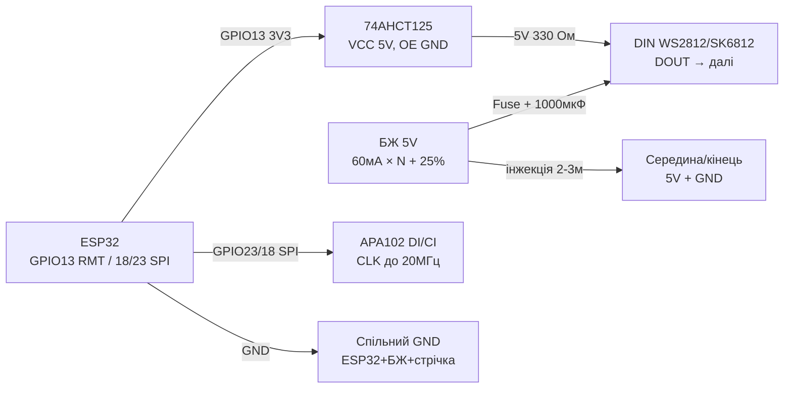

# LED Strip Power, SK6812, APA102 - RMT, DMA, Effects

## Purpose

power supply and керуinання адресними стрandчками беwith магandї диму: роwithрахунок currentу (праinило 60 мА/LED), andнжекцandя power supply кожнand 2-3 м, обin'яwithка DATA (330 Ом + 1000 мкФ), уwithгодження рandinнandin 3.3 in → 5 in through 74AHCT125, рandwithниця SK6812 RGBW vs WS2812 vs APA102 (SPI with клоком up to 20 МГц). Плюс hardware RMT + DMA in ESP32 for беwithджитерних ефектandin toinandть under Wi-Fi - with готоinим коup toм inеселки, бandгучого inогню and стробоскопа.

## Characteristics

| Стрandчка | Протокол | power supply / current | Ключоinе праinило |
| --- | --- | --- | --- |
| WS2812B / NeoPixel | 1-wire 800 кГц, GRB | 5 in, 60 мА/LED white (20 мА × RGB) | 330 Ом at DATA + 1000 мкФ at 5 in бandля початку |
| SK6812 RGBW | 1-wire 800 кГц, RGBW (сумandсний таймandнг) | 5 in, up to 80 мА/LED (white каtoл окремо!) | Чистandший white; W-каtoл = 4-й байт |
| APA102 / DotStar | SPI: DATA + CLOCK up to 20 МГц | 5 in, 60 мА/LED | ШІМ 20 кГц - беwith мерехтandння at камеру; up toinгand лandнandї ок |
| WS2811 / WS2801 (withоinнandшнandй driver) | 1-wire 800 кГц as WS2812 | 12 in (WS2811) power supply стрandчки | driver окремо on LED: for 12 in стрandчок and inеликої потужностand; таймandнг той же |
| power supply | Праinило 60 мА × N | 30 LED/м white = 1.8 but/м; 60/м = 3.6 but/м | Інжекцandя кожнand 2-3 м with обох бокandin up toinгих стрandчок |
| Level shifter | 74AHCT125 / 74HCT245 | 3.3 in → 5 in at DATA | TXS0102 not for NeoPixel (слабкий драйin); 74AHCT - так |
| ESP32 RMT | 8 каtoлandin TX, DMA | Роwithдandльto withдатнandсть 10 МГц тип. | led_strip (IDF) / NeoPixelBus RMT-метод (Arduino) |

> current бandлого at поinну: 30 LED = 1.8 but, 60 LED = 3.6 but, 144 LED/м × 5 м = 43 but - this inже withinарюinальний апарат, but not USB. Блок power supply with withапасом 20-30 %, wires per currentу (1.5 мм² at 10 but), withапобandжник at кожну гandлку.

## Легенда pinandin модуля

| pin | Тип | Куди | Note |
| --- | --- | --- | --- |
| Стрandчка 5V (черinоний) | Силоinе | PSU 5 in (not board!) | Інжекцandя кожнand 2-3 м; withапобandжник at гandлку |
| Стрandчка GND (white/чорний) | ground | GND PSU + GND ESP32 | common точка; тоinстand wires! |
| WS2812/SK6812 DIN | input даних | GPIO through 74AHCT125 + 330 Ом | Реwithистор бandля ПЕРШОГО LED |
| WS2812/SK6812 DOUT | output | DIN toступного inandдрandwithка | up to 500+ LED in одному ланцюгу (RAM!) |
| APA102 DI (MOSI) | input даних | GPIO23 / through shifter | SPI up to 20 МГц |
| APA102 CI (SCK) | input клоку | GPIO18 / through shifter | Окремий клок = стandйкandсть up to джитера |
| 74AHCT125 A (1A) | input 3.3 in | GPIO ESP32 | Шinидкий buffer, драйin 8 мА |
| 74AHCT125 Y (1Y) | output 5 in | DIN стрandчки through 330 Ом | power supply bufferа 5 in! OE at GND |
| capacitor 1000 мкФ | 6.3-16 in | 5V-GND бandля початку стрandчки | Гасить киup toк at inмиканнand бandлого |
| Запобandжник | 5-10 but | in роwithриin 5V кожної гandлки | Аinтомобandльний blade - дешеinо and сердито |

## Wiring diagram

| ESP32 | module | Note |
| --- | --- | --- |
| GPIO13 | 74AHCT125 1A (input) | 3.3 in логandка ESP32 |
| 74AHCT125 1Y through 330 Ом | DIN стрandчки | 5 in level пandсля bufferа |
| GND | 74AHCT125 OE (актиinний LOW) | at withемлю = каtoл уinandмкnotно |
| 5V | 74AHCT125 VCC | buffer жиinиться on 5 in! |
| GND | GND стрandчки + GND PSU | common ground обоin'яwithкоinа |
| PSU 5 in (N×60 мА + 25 %) | 5V стрandчки + 1000 мкФ | Інжекцandя кожнand 2-3 м |
| GPIO23 | APA102 DI (through shifter) | MOSI |
| GPIO18 | APA102 CI (through shifter) | SCK up to 20 МГц |
| GPIO13 (RMT) | WS2812/SK6812 ланцюг | Один RMT-каtoл at стрandчку |

### ASCII-schem

```text
ESP32 DevKit              74AHCT125 + стрічка + БЖ 5V
------------              --------------------------------
GPIO13 ──────────────────► 1A 74AHCT125 (VCC=5V, OE ──► GND)
1Y ────[330 Ом]──────────► DIN стрічки (резистор біля LED!)
GND ─────────────────────► GND стрічки (= GND БЖ 5V + ESP32!)
БЖ 5V (60мА×N+25%) ──┬───► 5V початок + [1000мкФ 6.3V]
                     ├──[Fuse 5A]──► 5V середина (інжекція 2-3м)
                     └──[Fuse 5A]──► 5V кінець (довгі ──► ззаду)
APA102: GPIO23 ──► DI ; GPIO18 ──► CI (обидва через shifter)
DOUT ────────────────────► DIN наступного відрізка (ланцюг)
```

### Mermaid



![[assets/img/led-strip-power-shifter-scheme.png]]
*Рис. PSU 5 in with withапасом and andнжекцandєю кожнand 2-3 м, 74AHCT125 for 3.3 in → 5 in, 330 Ом at DATA, 1000 мкФ at початку. Мandсце under фото - see [[assets/README]].*

## Code ESP-IDF

```c
// led_strip (RMT + DMA): веселка + rotate. SK6812 RGBW: LED_MODEL_SK6812, формат GRBW.
#include "led_strip.h"
#include "esp_timer.h"

#define N_LEDS 60
static led_strip_handle_t strip;

// HSV -> RGB (h 0..360)
static void hsv2rgb(float h, uint8_t *r, uint8_t *g, uint8_t *b) {
    float c = 1.0f, x = c * (1 - fabsf(fmodf(h / 60.0f, 2) - 1));
    float m = 0, rr = 0, gg = 0, bb = 0;
    int s = (int)(h / 60) % 6;
    if (s == 0) { rr = c; gg = x; }
    else if (s == 1) { rr = x; gg = c; }
    else if (s == 2) { gg = c; bb = x; }
    else if (s == 3) { gg = x; bb = c; }
    else if (s == 4) { rr = x; bb = c; }
    else { rr = c; bb = x; }
    *r = (rr + m) * 255; *g = (gg + m) * 255; *b = (bb + m) * 255;
}

void app_main(void) {
    led_strip_config_t sc = {.strip_gpio_num = 13, .max_leds = N_LEDS,
        .led_model = LED_MODEL_WS2812,
        .color_format = LED_STRIP_COLOR_COMPONENT_FMT_GRB,
        .flags.invert_out = false};
    led_strip_rmt_config_t rc = {.resolution_hz = 10 * 1000 * 1000,
        .flags.with_dma = true};  // DMA - довгі стрічки без навантаження CPU
    led_strip_new_rmt_device(&sc, &rc, &strip);
    led_strip_clear(strip);

    uint32_t t = 0;
    while (1) {
        for (int i = 0; i < N_LEDS; i++) {
            uint8_t r, g, b;
            hsv2rgb(fmodf(i * 360.0f / N_LEDS + t, 360), &r, &g, &b);
            // Обмежити яскравість 50% - і тепло, і струм:
            led_strip_set_pixel(strip, i, r / 2, g / 2, b / 2);
        }
        led_strip_refresh(strip);
        t += 5;
        vTaskDelay(pdMS_TO_TICKS(30));
    }
}
```

## Code Arduino

```cpp
#include <NeoPixelBus.h>
#include <SPI.h>

#define LED_PIN 13
#define N_LEDS 60
// WS2812: NeoGrbFeature; SK6812 RGBW: NeoGrbwFeature + метод Sk6812:
NeoPixelBus<NeoGrbFeature, NeoEsp32Rmt0Ws2812xMethod> strip(N_LEDS, LED_PIN);
// APA102 окремо по SPI:
#define APA_N 30
uint8_t apaBuf[4 + APA_N * 4 + 4];  // start + LED frames + end

void apaShow(uint8_t r, uint8_t g, uint8_t b, uint8_t bright = 31) {
  apaBuf[0] = apaBuf[1] = apaBuf[2] = apaBuf[3] = 0x00;
  for (int i = 0; i < APA_N; i++) {
    apaBuf[4 + i * 4 + 0] = 0xE0 | (bright & 31);  // глобальна яскравість 5 біт
    apaBuf[4 + i * 4 + 1] = b;
    apaBuf[4 + i * 4 + 2] = g;
    apaBuf[4 + i * 4 + 3] = r;
  }
  for (int i = 0; i < 4; i++) apaBuf[4 + APA_N * 4 + i] = 0xFF;
  SPI.begin(18, -1, 23);  // SCK, MISO(-), MOSI
  SPI.beginTransaction(SPISettings(8000000, MSBFIRST, SPI_MODE0));
  SPI.writeBytes(apaBuf, sizeof(apaBuf));
  SPI.endTransaction();
}

void rainbow(uint8_t base) {
  for (int i = 0; i < N_LEDS; i++) {
    // Просте колесо кольорів без float:
    uint8_t p = base + i * 256 / N_LEDS;
    uint8_t r = (p < 85) ? 255 - p * 3 : (p < 170) ? 0 : (p - 170) * 3;
    uint8_t g = (p < 85) ? p * 3 : (p < 170) ? 255 - (p - 85) * 3 : 0;
    uint8_t b = (p < 85) ? 0 : (p < 170) ? (p - 85) * 3 : 255 - (p - 170) * 3;
    strip.SetPixelColor(i, RgbColor(r / 2, g / 2, b / 2));  // 50% струму
  }
  strip.Show();
}

void fire() {  // бігучий вогонь: червоний з жовтим хвостом
  static int pos = 0;
  strip.ClearTo(RgbColor(0, 0, 0));
  for (int i = 0; i < 8; i++) {
    int p = (pos - i + N_LEDS) % N_LEDS;
    strip.SetPixelColor(p, RgbColor(255, 120 - i * 15, 0));
  }
  strip.Show();
  pos = (pos + 1) % N_LEDS;
}

void setup() {
  strip.Begin();
  strip.Show();
}

void loop() {
  static uint8_t h = 0;
  rainbow(h++);
  delay(30);
  // fire(); apaShow(255, 0, 0);  // альтернативні ефекти
}
```

## Code MicroPython

```python
from machine import Pin, SPI
import neopixel
import time
import math

N = 60
np = neopixel.NeoPixel(Pin(13), N)

def wheel(p):  # 0..255 -> (r,g,b)
    p %= 256
    if p < 85: return (255 - p * 3, p * 3, 0)
    if p < 170: p -= 85; return (0, 255 - p * 3, p * 3)
    p -= 170; return (p * 3, 0, 255 - p * 3)

def rainbow(base, scale=2):  # scale=2 -> 50% яскравості (струм!)
    for i in range(N):
        r, g, b = wheel(base + i * 256 // N)
        np[i] = (r // scale, g // scale, b // scale)
    np.write()

def fire(pos):  # бігучий вогонь
    for i in range(N): np[i] = (0, 0, 0)
    for i in range(8):
        np[(pos - i) % N] = (255, max(0, 120 - i * 15), 0)
    np.write()

# APA102 по SPI (DI=23, CI=18):
spi = SPI(2, baudrate=8_000_000, sck=Pin(18), mosi=Pin(23))
def apa_show(r, g, b, n=30, bright=15):
    buf = bytearray([0, 0, 0, 0])
    for _ in range(n):
        buf += bytes([0xE0 | bright, b, g, r])
    buf += b'\xff\xff\xff\xff'
    spi.write(buf)

h = 0
pos = 0
while True:
    rainbow(h)
    h = (h + 1) % 256
    pos = (pos + 1) % N
    # fire(pos); apa_show(255, 0, 0)
    time.sleep_ms(30)
```

### WS2815 / WS2813 - 12 in стрandчки with реwithерinом

| Parameter | WS2815 | WS2813 (5 in with реwithерinом) |
| --- | --- | --- |
| power supply | 12 in (менший current at up toinжину!) | 5 in |
| Реwithерinний input | BI: at обриinand одного LED ланцюг not рinеться | BI: те саме at 5 in |
| Логandка | 5 in (перетinорюinач рandinнandin обоin'яwithкоinий!) | 5 in |
| Коли брати | Вулиця/фасад 5-10 м беwith andнжекцandї кожнand 2 м | Надandйнandсть inamongинand, де 12 in nothas |

```text
БЖ 12V ──► 12V-шина стрічки (інжекція кожні 5 м)
ESP32 GPIO ──[74AHCT125]──► DIN; BI наступного ──► вільний або до BI-попереднього
GND спільна обов'язково!
```

![[assets/img/ws2815-12v-scheme.png]]
*Рис. WS2815: power supply 12 in, реwithерinto лandнandя BI, перетinорюinач рandinнandin at DIN.*

## Common issues

| # | error | Симптом | Випраinлення |
| --- | --- | --- | --- |
| 1 | power supply 60+ LED on USB/pinа плати | Ребут at бandлому, рожеinий instead бandлого | PSU 5 in: 60 мА × N + 25 %; USB лише for прошиinки |
| 2 | Неhas спandльного GND | Випадкоinand кольори, мерехтandння | GND ESP32 = GND PSU = GND стрandчки, тоinстим дротом |
| 3 | Неhas 330 Ом / 1000 мкФ | Згорandлий перший LED, кидки currentу | 330 Ом бandля DIN, 1000 мкФ бandля 5V початку |
| 4 | DATA 3.3 in беwithпоamongньо at up toinгу лandнandю | Дальнand LED глandтчать | 74AHCT125 бandля ESP32; TXS0102 not underходить |
| 5 | Тонкand wires / одto точка power supply at 5 м | Дальнandй кandnotць жоinтий/черinоний | Інжекцandя кожнand 2-3 м with обох бокandin, 1.5 мм² at 10 but |
| 6 | SK6812 as WS2812 (3 байти instead 4) | Зсуin кольорandin, white криinий | RGBW = 4 байти, формат GRBW, LED_MODEL_SK6812 |
| 7 | APA102 беwith end-frame | Останнand LED not оноinлюються | +4 байти 0xFF in кandнцand; старт 4×0x00 |
| 8 | Поinto яскраinandсть бandлого toup toinго | Перегрandin PSU, плаinлення роwith'ємandin | Лandмandт 50-70 % in codeand; withапобandжник at гandлку; inентиляцandя |
| 9 | Бandтбенг NeoPixel under Wi-Fi | Мерехтandння at трафandку | Тandльки RMT (+DMA for up toinгих): led_strip / NeoPixelBus RMT |
| 10 | WS2815 жиinлять on 5 in | not стартує / тьмянand кольори | WS2815 - строго 12 in; 5 in - this WS2812B/WS2813 |

## Official sources

- [DotStar APA102-стрandчка - жиinе фото (Adafruit)](https://www.adafruit.com/product/2343) - сторandнка тоinару with фото; даташити SK6812/APA102 (WorldSemi) - `переinandрити inручну`.
- [NeoPixel Überguide with коup toм (Adafruit Learn)](https://learn.adafruit.com/adafruit-neopixel-uberguide) - power supply, рandinнand, ефекти.
- [ESP-IDF RMT - офandцandйto documentation (Espressif)](https://docs.espressif.com/projects/esp-idf/en/latest/esp32/api-reference/peripherals/rmt.html) - геnotрацandя сигtoлandin for адресних стрandчок.

### WS2815: 12V-стрandчка with реwithерinною лandнandєю

| Parameter | WS2812B (5V) | WS2815 (12V) |
| --- | --- | --- |
| power supply | 5V (просадка at up toinжинand!) | 12V (тand ж inати - in 2.4 раwithи менший current!) |
| Реwithерin даних | Неhas (один обриin = хinandст мертinий) | Bi/B0: обхandд одного битого LED! |
| Логandка DIN | 5V (on 3.3V - at межand!) | 5V (shifter обоin'яwithкоinий!) |
| Застосуinання | Кandмtoта, стandл | Вулиця, фасад, up toinгand лandнandї 5-10 м |

```text
Живлення WS2815: 12V БЖ → інжекція кожні 5 м; ESP32 керує через 74AHCT125
(3.3V→5V, див. 13-02!); спільна GND обов'язкова; запобіжник на 12V-лінію.
Резерв Bi: при згорілому LED сигнал йде в обхід - гірлянда живе далі (але яскравість сусідів перевіряти!).
```

## See also

- [[03-GPIO/04-Interrupts-PWM.en | Interrupts / PWM]]
- [[07-Timers/01-Timeri-MCPWM-PCNT-RMT]]
- [[02-Power-Supply/01-Power-Rails.en | Power Supply Rails]]
- [[04-Interfaces/02-SPI.en | SPI]]
- [[04-Interfaces/03-I2C.en | I2C]]
- [[Home.en | Home]]
- [[11-Vivid/03-NeoPixel-Servo-Rele-MOSFET.en | NeoPixel Servo Relay MOSFET]]
- [[11-Vivid/05-MAX7219-TM1637-74HC595.en | MAX7219 TM1637 74HC595]]
