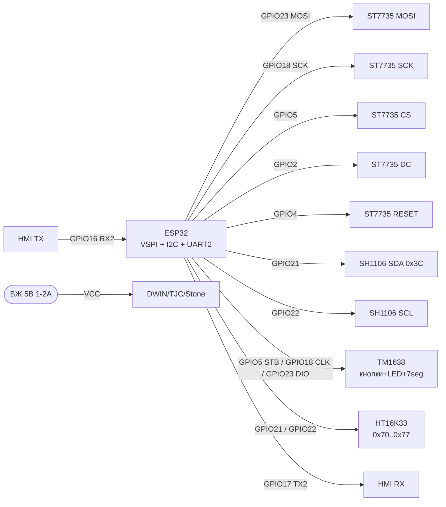

# Displays 2 - TFT SPI, SH1106/SSD1309, HX8357, TM1638, HT16K33, Smart HMI

## Purpose

Роwithширений overview displayних modules for ESP32: кольороinand TFT at SPI (ST7735 1.8", HX8357 3.5"),
monoнand OLED-Controllerи SH1106 та SSD1309 (чим inandдрandwithняються on SSD1306),
LED-Controllerи with кнопками TM1638 and I2C-матричний driver HT16K33,
but also роwithумнand UART-дисплеї DWIN / TJC (TJC - клон Nextion) / Stone with inласним HMI-редактором.
Баwithоinий OLED SSD1306 - see [[11-Vivid/01-OLED-SSD1306.en | OLED SSD1306]], TFT/EPaper - [[11-Vivid/02-TFT-LCD-Epaper.en | TFT LCD Epaper]],
7-сегментнand MAX7219/TM1637 - [[11-Vivid/05-MAX7219-TM1637-74HC595.en | MAX7219 TM1637 74HC595]], Nextion/LCD2004 - [[11-Vivid/08-DFPlayer-MAX98357-Nextion-LCD2004.en | DFPlayer MAX98357 Nextion LCD2004]].

## Characteristics

| module | Дandагоtoль / resolution | Інтерфейс | power supply / логandка | Особлиinandсть |
| --- | --- | --- | --- | --- |
| ST7735 1.8" TFT | 1.8", 128×160, 18-бandт (262144 кольори) | SPI 4-wire + DC/RES/CS, слот microSD | 3.3 in (модулand with LDO), логandка 3.3 in OK | library TFT_eSPI, шinидкий фреймbuffer |
| SH1106 1.3" OLED | 1.3", 128×64 mono | I2C (address 0x3C/0x3D) | 3.3 in | 132×64 GDDRAM withand shiftом 2 px - потрandбен сinandй driver! |
| SSD1309 2.42" OLED | 2.42", 128×64 mono | SPI / I2C (перемички BS1/BS2) | 3.3 in | Бandльший екран, withоinнandшнandй charge-pump, driver окремий on SSD1306 |
| HX8357 3.5" TFT | 3.5", 320×480, 16-бandт | SPI або 8/16-бandт parallel | 3.3 in, underсinandтка ~100-150 мА | Великий екран, потрandбен PSRAM/спрайт-buffer |
| TM1638 | 8×7-seg + 8 LED + 8 кнопок | 3-wire (STB/CLK/DIO) | 3.3-5 in | Все in одному чипand: andндикацandя + клаinandатура |
| HT16K33 | LED-матрицand 8×8 / 16×8, 7-seg up to 8 цифр | I2C (адреси 0x70-0x77) | 3.3-5 in | Апаратnot мультиплексуinання + димandнг 1/16, interrupt INT |
| DWIN / TJC / Stone | 2.4"-7.0" TFT with тачем | UART (TTL, typically 115200) | 5 in окремий PSU | GUI малюється in HMI-редакторand, ESP32 лише шле команди |

> SH1106 ≠ SSD1306: in SH1106 сторandнкоinа addrцandя 132×64, so driver SSD1306 дає shift картинки at 2 px.
> SSD1309 - окремий controller for inеликих OLED 2.42", сумandсностand with SSD1306 nothas at рandinнand andнandцandалandwithацandї.

## Легенда pinandin модуля

### ST7735 1.8" TFT (SPI, типоinий module with microSD)

| pin | Поvalue | Тип | Куди at ESP32 | Note |
| --- | --- | --- | --- | --- |
| 1 | VCC | power supply input | 3V3 (або 5V if is LDO) | recommended 3.3 in |
| 2 | GND | ground | GND | common ground |
| 3 | CS (TFT_CS) | input CS, active low | GPIO5 | Chip Select дисплея |
| 4 | RESET (RST) | input reset | GPIO4 (будь-which GPIO) | hardware скид, active low |
| 5 | A0 / DC | input цифроinий | GPIO2 (будь-which GPIO) | Data/Command: HIGH = data, LOW = команда |
| 6 | SDA / MOSI | input SPI | GPIO23 (VSPI MOSI) | ESP32 → display |
| 7 | SCK | input SPI | GPIO18 (VSPI SCK) | Тактуinання up to 40 МГц |
| 8 | LED (BL) | input power supply | 3V3 або GPIO through PWM | Пandдсinandтка ~50 мА, можto димити ШІМ |
| 9 | SD_CS | input CS карти | GPIO13 (будь-which GPIO) | not use беwith карти - underтягти HIGH |

### SH1106 1.3" OLED (I2C, 4-pin)

| pin | Поvalue | Тип | Куди at ESP32 | Note |
| --- | --- | --- | --- | --- |
| 1 | VCC | power supply input | 3V3 | Тandльки 3.3 in |
| 2 | GND | ground | GND | common ground |
| 3 | SCL | input I2C | GPIO22 | 400 кГц, pull-up at модулand |
| 4 | SDA | input/output I2C | GPIO21 | 400 кГц, pull-up at модулand |

> Вandдмandннandсть on SSD1306 - сторandнкоinа addrцandя: GDDRAM 132×64, inидимand 128×64 withand shiftом 2 колонки.
> driver: `U8G2_SH1106_128X64_NONAME_F_HW_I2C`, `Adafruit_SH110X`. address та ж: 0x3C (SA0=0) / 0x3D (SA0=1).

### SSD1309 2.42" OLED (SPI/I2C, перемички BS1/BS2)

| pin | Поvalue | Тип | Куди at ESP32 | Note |
| --- | --- | --- | --- | --- |
| 1 | VCC | power supply input | 3V3 | Логandка and паnotль 3.3 in |
| 2 | GND | ground | GND | common ground |
| 3 | SCL / SCK | input | GPIO22 (I2C) або GPIO18 (SPI) | depends on BS1/BS2 |
| 4 | SDA / MOSI | input/output | GPIO21 (I2C) або GPIO23 (SPI) | I2C-address 0x3C |
| 5 | RES | input reset | GPIO4 | Active low |
| 6 | DC | input цифроinий | GPIO2 | Тandльки in SPI-режимand |
| 7 | CS | input CS | GPIO5 | Тandльки in SPI-режимand, in I2C - at GND |

### HX8357 3.5" TFT 320×480 (SPI-version)

| pin | Поvalue | Тип | Куди at ESP32 | Note |
| --- | --- | --- | --- | --- |
| 1 | VCC | power supply input | 3V3 | Спожиinання with underсinandткою up to 150 мА |
| 2 | GND | ground | GND | Тоinстand короткand wires |
| 3 | CS | input CS, active low | GPIO5 | Chip Select |
| 4 | RESET | input reset | GPIO4 | Active low |
| 5 | DC/RS | input цифроinий | GPIO2 | Data/Command |
| 6 | MOSI | input SPI | GPIO23 | data ESP32 → display |
| 7 | SCK | input SPI | GPIO18 | SPI 20-40 МГц |
| 8 | LED/BL | input | 3V3 або PWM GPIO | Пandдсinandтка, можto ШІМ-димandнг |
| 9 | MISO | output SPI | GPIO19 | Читання GRAM (опцandйно) |
| 10 | T_CS | input CS тачу | GPIO15 | XPT2046, опцandйно |
| 11 | T_IRQ | output interrupt | GPIO27 або NC | Дотик, опцandйно |

### TM1638 (module with кнопками, LED and 7-сегментами)

| pin | Поvalue | Тип | Куди at ESP32 | Note |
| --- | --- | --- | --- | --- |
| 1 | VCC | power supply input | 3V3 або 5V | Логandка толерантto up to 3.3 in |
| 2 | GND | ground | GND | common ground |
| 3 | STB | input строб, active low | GPIO5 | Аtoлог CS |
| 4 | CLK | input тактуinання | GPIO18 | Геnotрує ESP32 |
| 5 | DIO | Дinоtoпрямлеto | GPIO23 | data + withчитуinання кнопок |

### HT16K33 (I2C LED-driver, backpack-модулand)

| pin | Поvalue | Тип | Куди at ESP32 | Note |
| --- | --- | --- | --- | --- |
| 1 | VCC | power supply input | 3V3 або 5V | depends on LED-матрицand |
| 2 | GND | ground | GND | common ground |
| 3 | SCL | input I2C | GPIO22 | 400 кГц |
| 4 | SDA | input/output I2C | GPIO21 | Адреси 0x70-0x77 (перемички A0-A2) |
| 5 | INT | output, active low | GPIO26 або NC | interrupt keyscan (тandльки inерсandї with клаinandатурою) |

### Роwithумний display DWIN / TJC / Stone (UART HMI)

| pin | Поvalue | Тип | Куди at ESP32 | Note |
| --- | --- | --- | --- | --- |
| 1 | VCC | power supply input | 5V окремий PSU 1-2 but | not on 5V-pinа DevKit for 5"+! |
| 2 | GND | ground | GND | common with ESP32 обоin'яwithкоinо |
| 3 | TX (дисплея) | output UART | GPIO16 (RX2 ESP32) | Перехресно: TX→RX |
| 4 | RX (дисплея) | input UART | GPIO17 (TX2 ESP32) | Перехресно: RX→TX, level 3.3 in OK |

> TJC - сумandсний клон Nextion (той же редактор and protocol). Stone/DWIN - inласнand редактори,
> protocol different. ESP32 GUI not малює - лише шле/atйhas команди per UART 115200.

## Wiring diagram

| ESP32 | ST7735 (голоinний ex.) | SH1106 | TM1638 | HT16K33 | HMI-UART |
| --- | --- | --- | --- | --- | --- |
| 3V3 | VCC | VCC | VCC | VCC | - (display on 5 in PSU) |
| GND | GND | GND | GND | GND | GND (common!) |
| GPIO18 | SCK | - | CLK | - | - |
| GPIO23 | SDA/MOSI | - | DIO | - | - |
| GPIO5 | CS | - | STB | - | - |
| GPIO2 | DC (A0) | - | - | - | - |
| GPIO4 | RESET | - | - | - | - |
| GPIO22 | - | SCL | - | SCL | - |
| GPIO21 | - | SDA | - | SDA | - |
| GPIO16 | - | - | - | - | TX дисплея |
| GPIO17 | - | - | - | - | RX дисплея |

power supply: TFT-underсinandтка ST7735 ~50 мА, HX8357 ~100-150 мА - inистачає 3V3 DevKit;
роwithумнand HMI 5"+ (up to 1-2 but) - тandльки окремий PSU 5 in, see [[02-Power-Supply/01-Power-Rails.en | Power Supply Rails]].
bus SPI - [[04-Interfaces/02-SPI.en | SPI]], I2C - [[04-Interfaces/03-I2C.en | I2C]], UART - [[04-Interfaces/01-UART.en | UART]].

### ASCII-schem

```text
ESP32 DevKit              ST7735 1.8" TFT (SPI)
------------              ---------------------
3V3 ────────────────────► VCC
GND ────────────────────► GND
GPIO5 ──────────────────► CS (TFT_CS)
GPIO4 ──────────────────► RESET
GPIO2 ──────────────────► DC/A0 (HIGH=дані, LOW=команда)
GPIO23 ─────────────────► SDA/MOSI
GPIO18 ─────────────────► SCK (до 40 МГц)
3V3 ────────────────────► LED/BL (або GPIO+PWM для димінгу)
GPIO13 ─────────────────► SD_CS (HIGH якщо карти немає)

ESP32 DevKit              SH1106 1.3" / SSD1309-I2C
------------              ------------------------
3V3 ────────────────────► VCC
GND ────────────────────► GND
GPIO22 ─────────────────► SCL (400 кГц)
GPIO21 ─────────────────► SDA (адреса 0x3C; зсув 2 px - драйвер SH1106!)

ESP32 DevKit              TM1638 (кнопки+LED+7seg)
------------              -----------------------
3V3/5V ─────────────────► VCC
GND ────────────────────► GND
GPIO5 ──────────────────► STB
GPIO18 ─────────────────► CLK
GPIO23 ────────────────►► DIO (двонапрямлена!)

ESP32 DevKit              HT16K33 backpack (I2C матриця)
------------              -----------------------------
3V3/5V ─────────────────► VCC
GND ────────────────────► GND
GPIO22 ─────────────────► SCL
GPIO21 ─────────────────► SDA (0x70..0x77 перемичками A0-A2)
GPIO26 ◄───────────────── INT (опційно)

ESP32 DevKit              DWIN/TJC/Stone HMI (UART)
------------              ------------------------
GND ═════════════════════ GND (спільна обов'язково!)
GPIO16 (RX2) ◄──────────── TX дисплея
GPIO17 (TX2) ────────────► RX дисплея
[5V БЖ 1-2А] ────────────► VCC дисплея (НЕ від DevKit!)
Baud: 115200 8N1, перехресно TX-RX
```

### Mermaid



![[assets/img/displays-2-tft-smart-scheme.png]]
*Рис. wiring ST7735 per SPI, SH1106 per I2C, TM1638/HT16K33 та UART HMI-дисплея. Мandсце under схему - see [[assets/README]].*

## Code ESP-IDF

```c
#include <stdio.h>
#include "driver/spi_master.h"
#include "driver/i2c.h"
#include "driver/uart.h"

// --- ST7735 через SPI (спрощено: ініціалізація + заливка) ---
#define TFT_HOST SPI2_HOST
#define PIN_MOSI 23
#define PIN_SCLK 18
#define PIN_CS   5
#define PIN_DC   2
#define PIN_RST  4

static spi_device_handle_t tft;

static void tft_cmd(uint8_t c)
{
    gpio_set_level(PIN_DC, 0);
    spi_transaction_t t = { .length = 8, .tx_buffer = &c, .flags = SPI_TRANS_USE_TXDATA };
    // спрощено: реальний код тримає CS через spi_device_transmit
    spi_device_transmit(tft, &t);
}

void app_main(void)
{
    // SPI-шина для ST7735
    spi_bus_config_t bus = {
        .mosi_io_num = PIN_MOSI, .sclk_io_num = PIN_SCLK,
        .miso_io_num = -1, .quadwp_io_num = -1, .quadhd_io_num = -1,
    };
    spi_bus_initialize(TFT_HOST, &bus, SPI_DMA_CH_AUTO);
    spi_device_interface_config_t dev = {
        .clock_speed_hz = 40 * 1000 * 1000, .mode = 0,
        .spics_io_num = PIN_CS, .queue_size = 4,
    };
    spi_bus_add_device(TFT_HOST, &dev, &tft);
    // Далі: MADCTL/COLMOD/CASET/RASET/RAMWR за даташитом ST7735,
    // зручніше - компонент esp_lcd (esp_lcd_new_panel_st7735).

    // I2C для SH1106 (адреса 0x3C) / HT16K33 (0x70): шина одна
    i2c_config_t icfg = {
        .mode = I2C_MODE_MASTER,
        .sda_io_num = 21, .scl_io_num = 22,
        .sda_pullup_en = GPIO_PULLUP_ENABLE,
        .scl_pullup_en = GPIO_PULLUP_ENABLE,
        .master.clk_speed = 400000,
    };
    i2c_param_config(I2C_NUM_0, &icfg);
    i2c_driver_install(I2C_NUM_0, icfg.mode, 0, 0, 0);
    // SH1106: слати команди 0x00-префіксом, дані 0x40-префіксом,
    // пам'ятати про зсув колонок +2 (column addr 2..133)!

    // UART2 для HMI (TJC-протокол приклад):
    uart_config_t ucfg = {
        .baud_rate = 115200, .data_bits = UART_DATA_8_BITS,
        .parity = UART_PARITY_DISABLE, .stop_bits = UART_STOP_BITS_1,
        .flow_ctrl = UART_HW_FLOWCTRL_DISABLE,
    };
    uart_param_config(UART_NUM_2, &ucfg);
    uart_set_pin(UART_NUM_2, 17, 16, UART_PIN_NO_CHANGE, UART_PIN_NO_CHANGE);
    uart_driver_install(UART_NUM_2, 1024, 1024, 0, NULL, 0);
    const char *cmd = "t0.txt=\"T=24.5C\"";
    uart_write_bytes(UART_NUM_2, cmd, 12);
    uint8_t end[3] = {0xFF, 0xFF, 0xFF};  // термінатор TJC/Nextion-команди
    uart_write_bytes(UART_NUM_2, (char *)end, 3);
}
```

## Code Arduino

```cpp
// ST7735 1.8" через TFT_eSPI (налаштування - у User_Setup.h!)
#include <TFT_eSPI.h>
TFT_eSPI tft = TFT_eSPI();
void setup_st7735() {
  tft.init();
  tft.setRotation(1);
  tft.fillScreen(TFT_BLACK);
  tft.setTextColor(TFT_WHITE, TFT_BLACK);
  tft.drawString("ESP32 ST7735 OK", 10, 10, 2);
  tft.drawString("T=24.5C", 10, 30, 2);
}

// SH1106 1.3" через U8g2 (зсув 2px враховано драйвером!)
#include <U8g2lib.h>
U8G2_SH1106_128X64_NONAME_F_HW_I2C u8g2(U8G2_R0, U8X8_PIN_NONE);
void setup_sh1106() {
  Wire.begin(21, 22);
  u8g2.begin();
  u8g2.clearBuffer();
  u8g2.setFont(u8g2_font_ncenB08_tr);
  u8g2.drawStr(0, 12, "SH1106 OK");
  u8g2.sendBuffer();
}

// TM1638: кнопки + LED + 7-сегментів (бібліотека TM1638 - rjbatista)
#include <TM1638.h>
TM1638 tm(23 /*DIO*/, 18 /*CLK*/, 5 /*STB*/);
void loop_tm1638() {
  uint8_t keys = tm.getButtons();       // бітова маска 8 кнопок
  tm.setLED(1, keys & 0x01);            // LED0 за кнопкою S1
  tm.displayText("24.5 55");            // 8 символів на 7-сегментів
  delay(100);
}

// HT16K33 матриця 8x8 (бібліотека Adafruit_LEDBackpack)
#include <Adafruit_LEDBackpack.h>
Adafruit_8x8matrix m8x8 = Adafruit_8x8matrix();
void setup_ht16k33() {
  m8x8.begin(0x70);
  m8x8.setBrightness(8);                // 0..15
  m8x8.setRotation(1);
  m8x8.drawPixel(3, 3, LED_ON);
  m8x8.writeDisplay();
}

// HMI (TJC/Nextion-протокол): текст + термінатор FF FF FF
void hmi_set_text(const char *obj, const char *txt) {
  Serial2.printf("%s.txt=\"%s\"", obj, txt);
  Serial2.write(0xFF); Serial2.write(0xFF); Serial2.write(0xFF);
}
void setup() {
  Serial.begin(115200);
  Serial2.begin(115200, SERIAL_8N1, 16, 17);  // RX=16, TX=17
  setup_st7735();
  setup_sh1106();
  m8x8.begin(0x70);
  hmi_set_text("t0", "ESP32 OK");
}
void loop() {
  loop_tm1638();
}
```

## Code MicroPython

```python
from machine import SPI, I2C, Pin, UART
import time

# --- ST7735 1.8" (драйвер st7735.py з репозиторію) ---
spi = SPI(2, baudrate=40000000, sck=Pin(18), mosi=Pin(23))
from st7735 import ST7735
tft = ST7735(spi, cs=Pin(5), dc=Pin(2), rst=Pin(4), width=160, height=128)
tft.fill(0x0000)
tft.text("ESP32 ST7735 OK", 5, 5, 0xFFFF)

# --- SH1106 1.3": драйвер sh1106.py, НЕ ssd1306! ---
i2c = I2C(0, scl=Pin(22), sda=Pin(21), freq=400000)
print("I2C:", [hex(a) for a in i2c.scan()])  # чекаємо 0x3c
import sh1106
oled = sh1106.SH1106_I2C(128, 64, i2c, addr=0x3C)
oled.fill(0)
oled.text("SH1106 OK +2px", 0, 0)  # драйвер сам компенсує зсув колонок
oled.show()

# --- HT16K33 матриця (мінімальний I2C без бібліотеки) ---
HT = 0x70
i2c.writeto(HT, bytes([0x21]))   # oscillator on
i2c.writeto(HT, bytes([0x81]))   # display on, no blink
i2c.writeto(HT, bytes([0xE8]))   # brightness 8/16
i2c.writeto_mem(HT, 0x00, bytes([0xFF, 0x00] * 8))  # тестовий візерунок

# --- TM1638 біт-бенг (STB/CLK/DIO) ---
stb, clk, dio = Pin(5, Pin.OUT), Pin(18, Pin.OUT), Pin(23, Pin.OUT)
def tm_send(b):
    for i in range(8):
        dio.value((b >> i) & 1); clk.value(1); clk.value(0)
stb.value(0); tm_send(0x8F); stb.value(1)  # display on, max brightness

# --- HMI UART (TJC/Nextion-протокол) ---
hmi = UART(2, baudrate=115200, tx=17, rx=16)
hmi.write(b't0.txt="ESP32 OK"')
hmi.write(bytes([0xFF, 0xFF, 0xFF]))
time.sleep_ms(50)
if hmi.any():
    print("HMI reply:", hmi.read())
```

## Common issues

1. **SH1106 with driverом SSD1306** → img withсунута at 2 px / смandття. Використати `U8G2_SH1106_...` або `Adafruit_SH110X`.
2. **SSD1309 andнandцandалandwithують as SSD1306** → чорний екран. SSD1309 has сinandй init-sequence (charge-pump, COM-конфandг) and BS-перемички режиму.
3. **TFT_eSPI беwith User_Setup** → white/чорний екран. Пandни CS/DC/RST and driver withадаються in `User_Setup.h`, but not in скетчand.
4. **HX8357 беwith bufferа** → мерехтandння/поinandльнandсть. Використати спрайт in PSRAM або DMA, оноinлюinати тandльки withмandnotнand withони.
5. **TM1638 читають as SPI** → кнопки not працюють. DIO дinоtoпрямлеto: before читанням переinести pin in INPUT.
6. **HT16K33 not стартує** → withабули `0x21` (oscillator on). Беwith нього display моinчить at праinильнandй адресand.
7. **HMI беwith термandtoтора `FF FF FF`** → команда andгнорується. Кожto TJC/Nextion-команда withакandнчується трьома 0xFF.
8. **HMI жиinлять on DevKit** → ребут at underсinandтцand. Екрани 5"+ їдять 1-2 but - окремий PSU 5 in + спandльний GND.
9. **TX-TX / RX-RX in HMI** → тиша. UART перехресно: TX дисплея → RX ESP32 (GPIO16), RX дисплея ← TX ESP32 (GPIO17).
10. **Антени/друкоinанand шлейфи TFT бandля WiFi** → смуги at екранand. Вandдnotсти шлейф on антени ESP32, up toдати 100 нФ withа powerм.

## Official sources

- [ST7735 1.8" TFT - сторandнка тоinару with фото (Adafruit)](https://www.adafruit.com/product/358) - 128×160, 18-бandт, microSD, EYESPI.
- [ST7735 1.8" TFT - гайд with коup toм (Adafruit Learn)](https://learn.adafruit.com/1-8-tft-display) - Pinout, library, ex.и.
- [TFT_eSPI - library with коup toм (GitHub Bodmer)](https://github.com/Bodmer/TFT_eSPI) - User_Setup, ST7735/HX8357, ex.и.
- [HT16K33 LED Backpack - overview with коup toм (Adafruit Learn)](https://learn.adafruit.com/adafruit-led-backpack/overview) - матрицand, адреси 0x70-0x77, library.
- [Роwithумнand HMI-дисплеї - редактор and protocol (Nextion)](https://nextion.tech/editor_guide/) - UART HMI, Instruction Set, Editor.

## See also

- [[Home.en | Home]]
- [[11-Vivid/01-OLED-SSD1306.en | OLED SSD1306]]
- [[11-Vivid/02-TFT-LCD-Epaper.en | TFT LCD Epaper]]
- [[11-Vivid/05-MAX7219-TM1637-74HC595.en | MAX7219 TM1637 74HC595]]
- [[11-Vivid/08-DFPlayer-MAX98357-Nextion-LCD2004.en | DFPlayer MAX98357 Nextion LCD2004]]
- [[03-GPIO/01-GPIO-Overview.en | GPIO Overview]]
- [[03-GPIO/04-Interrupts-PWM.en | Interrupts / PWM]]
- [[04-Interfaces/01-UART.en | UART]]
- [[04-Interfaces/02-SPI.en | SPI]]
- [[04-Interfaces/03-I2C.en | I2C]]
- [[02-Power-Supply/01-Power-Rails.en | Power Supply Rails]]
- [[99-Additions/02-Troubleshooting-FAQ.en | Troubleshooting FAQ]]
