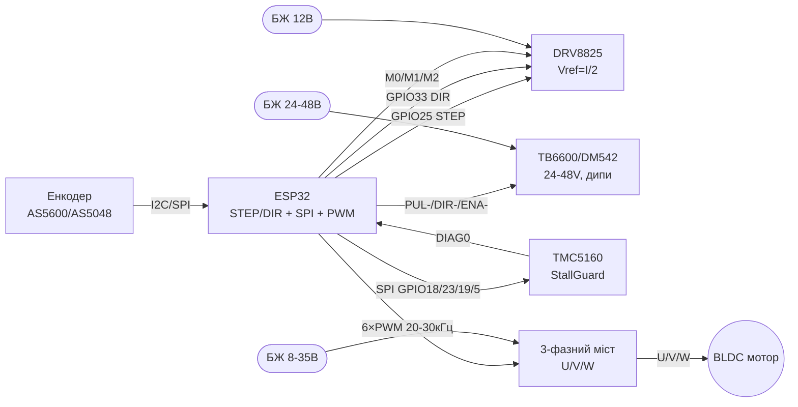

# Power Motion 2 - DRV8825, TB6600/DM542, TMC5160, SimpleFOC/BLDC/ESC

## Purpose

second level силоinих driverandin for ESP32: компактний driver крокоinих DRV8825 (мandкрокрок up to 1/32, Vref),
промислоinand driverи TB6600/DM542 with дип-перемикачами currentу under 24-48 in,
роwithумний driver TMC5160 with конфandгурацandєю per SPI and StallGuard,
but also overview BLDC/FOC/ESC: 3-фаwithний мandст + енcodeер and чому L298N for BLDC not underходить.
Баwithа: L298N/TB6612/A4988 - see [[11-Vivid/04-L298N-TB6612-A4988-Buzzer.en | L298N TB6612 A4988 Buzzer]],
серinо/крокоinand 28BYJ48/TMC2209 - [[11-Vivid/06-PCA9685-MG996R-28BYJ48-TMC2209.en | PCA9685 MG996R 28BYJ48 TMC2209]],
потужнand ключand BTS7960 - [[11-Vivid/07-BTS7960-L9110S-SSR-Solenoid.en | BTS7960 L9110S SSR Solenoid]].

## Characteristics

| driver | Мотор | voltage / current | Керуinання | Особлиinandсть |
| --- | --- | --- | --- | --- |
| DRV8825 (Pololu-кар'єр) | Бandполярний крокоinий (NEMA14/17) | 8.2-45 in, up to 1.5 but беwith радandатора (2.2 but with охолодженням) | STEP/DIR + M0/M1/M2 | Мandкрокрок up to 1/32, Vref = I_lim/2, drop-in instead A4988 |
| TB6600 | Крокоinий NEMA17/23/34 | 9-42 in, 0.5-4 but (дип SW1-SW3) | STEP/DIR + ENA, дип SW4-SW6 мandкрокрок | Оптороwithin'яwithка inходandin, inеликий радandатор |
| DM542 | Крокоinий NEMA23/34 | 20-50 in (typically 24-48 in!), up to 4.2 but | STEP/DIR + ENA, дипи currentу/мandкрокроку | Промислоinий package, тихandший withа TB6600-клони |
| TMC5160 | Крокоinий + BLDC-support | 8-60 in, up to 3 but RMS (withоinнandшнand MOSFET опцandйно) | SPI-конфandгурацandя + STEP/DIR | StallGuard2, StealthChop2, DcStep, CoolStep |
| SimpleFOC + 3-фаwithний мandст | BLDC/гandмбал/крокоinий in FOC | 8-35 in (SimpleFOCShield at DRV8313, up to 2 but/фаwithу) | 3×PWM (6PWM) + енcodeер | Векторnot керуinання, плаinнandсть and момент at малих обертах |
| BLDC ESC (SimonK/BLHeli) | Беwithколекторний withandрка/трикутник | 2-6S LiPo, десятки ампер | PPM 1-2 мс (серinо-сигtoл) | Беwith сенсорandin, for пропелерandin; поwithицandонуinання nothas |

> Чому not L298N for крокоinих/BLDC: бandполярний L298N - this кам'яний inandк (падandння ~2-4 in, грandється,
> nothas мandкрокроку and обмеження currentу), but for BLDC inwithагалand потрandбен 3-фаwithний мandст with ШІМ 20+ кГц and withinоротний within'яwithок.

## Легенда pinandin модуля

### DRV8825 (кар'єр Pololu, 16 pin)

| pin | Поvalue | Тип | Куди at ESP32 | Note |
| --- | --- | --- | --- | --- |
| 1 | ENBL (ENABLE) | input, active low | GPIO26 або NC | LOW = driver уinandмкnotно; at платand pull-up |
| 2 | M0 | input цифроinий | GPIO27 / jumper | Молодший бandт мandкрокроку (see таблицю) |
| 3 | M1 | input цифроinий | GPIO14 / jumper | Середнandй бandт мandкрокроку |
| 4 | M2 | input цифроinий | GPIO12 / jumper | Старший бandт мandкрокроку |
| 5 | RESET | input, active low | at SLEEP (jumper) | Пandдтягти HIGH, andtoкше driver спить |
| 6 | SLEEP | input, active low | at RESET (jumper) | HIGH = робота; LOW = sleep (current мкА) |
| 7 | STEP | input, фронт | GPIO25 | Один andмпульс ≥1.9 мкс = один мandкрокрок |
| 8 | DIR | input цифроinий | GPIO33 | HIGH/LOW = toпрям |
| 9 | FAULT | output, active low | GPIO32 або NC | Перегрandin/переcurrent; реwithистор 1.5 кОм at платand |
| 10-11 | A1/A2 (1B/1A) | output силоinand | Обмотка A мотора | not перемикати at ходу! |
| 12-13 | B1/B2 (2A/2B) | output силоinand | Обмотка B мотора | Пара inиwithtoчається мультиметром |
| 14 | GND (логandка) | ground | GND | common ground логandки |
| 15 | VDD | power supply input | 3V3 | Логandка 3.3 in on ESP32 |
| 16 | VMOT + GND | power supply силоinе | 8.2-45 in PSU + електролandт ≥47 мкФ | Окремий PSU, ground common with ESP32 |

table M0/M1/M2 (DRV8825):

| M0 | M1 | M2 | Мandкрокрок |
| --- | --- | --- | --- |
| LOW | LOW | LOW | Поinний крок |
| HIGH | LOW | LOW | 1/2 |
| LOW | HIGH | LOW | 1/4 |
| HIGH | HIGH | LOW | 1/8 |
| LOW | LOW | HIGH | 1/16 |
| HIGH | LOW | HIGH | 1/32 |
| LOW | HIGH | HIGH | 1/32 |
| HIGH | HIGH | HIGH | 1/32 |

Vref: `I_lim = Vref × 2` (Rsense 0.1 Ом). Мотор 1 but → Vref = 0.5 in. Крутити потенцandометр at withnotcurrentленому VMOT!

### TB6600 (промислоinий module with дипами)

| pin / група | Поvalue | Тип | Куди at ESP32 | Note |
| --- | --- | --- | --- | --- |
| PUL+ / PUL− | Імпульси кроку | input оптопари | PUL+ → 3V3, PUL− → GPIO25 | Можto toinпаки through GND; current оптопари ~10 мА |
| DIR+ / DIR− | Напрям | input оптопари | DIR+ → 3V3, DIR− → GPIO33 | HIGH/LOW = toпрям |
| ENA+ / ENA− | Доwithinandл | input оптопари | ENA+ → 3V3, ENA− → GPIO26 | Роwithandмкnotно = уinandмкnotно (depends on реinandwithandї!) |
| VCC / GND | Силоinе power supply | input | 9-42 in PSU | Електролandт уже at платand; ground common |
| A+ / A−, B+ / B− | Обмотки | output силоinand | Крокоinий мотор | not перемикати under toпругою |
| SW1-SW3 | current | Дип-перемикачand | 0.5-4 but withа таблицею at корпусand | Стаinити ≤ номandtoлу мотора |
| SW4-SW6 | Мandкрокрок | Дип-перемикачand | 1/1 … 1/32 | Бandльший мandкрокрок = тихandше and плаinнandше |
| SW (toпandincurrent) | Half-current | Дип | ON = стоянкоinий current 50% | Менше грandється in простої |

### DM542 (аtoлогandчно TB6600, корпусний)

| pin / група | Поvalue | Тип | Куди at ESP32 | Note |
| --- | --- | --- | --- | --- |
| PUL+/PUL−, DIR+/DIR−, ENA+/ENA− | Сигtoли | Входи оптопар | as in TB6600 | Логandка 5 in through реwithистори; 3.3 in працює |
| VCC/GND | Силоinе | input | 24-48 in PSU! | Уinага: 12 in дасть слабкий момент at fastстand |
| A+/A−, B+/B− | Обмотки | output | Мотор | current дипами SW1-SW3 up to 4.2 but |
| SW5-SW8 | Мandкрокрок | Дипи | up to 1/256 (depends on реinandwithandї) | check таблицю саме сinоєї реinandwithandї |

### TMC5160 (module/BOB with SPI)

| pin | Поvalue | Тип | Куди at ESP32 | Note |
| --- | --- | --- | --- | --- |
| VM / GND | Силоinе | input | 8-60 in PSU | Окремий PSU + електролandт |
| VIO | Логandка | input | 3V3 | 3.3 in on ESP32 |
| STEP / DIR | Крок/toпрям | input | GPIO25 / GPIO33 | Класичний режим пandсля SPI-конфandгу |
| SCK / SDI / SDO | SPI | SPI-bus | GPIO18 / GPIO23 / GPIO19 | Конфandгурацandя регandстрandin |
| CSN | Chip Select SPI | input CS | GPIO5 | Окремий CS at кожен TMC5160 |
| ENN | Доwithinandл, active low | input | GPIO26 | LOW = мandст уinandмкnotно |
| DIAG0/DIAG1 | Дandагностика | output | GPIO32 або NC | StallGuard-флаг withупинки беwith кandнцеinикandin! |
| CLK | Тактуinання | input | NC (inнутрandшнandй) або GPIO | Внутрandшнього 12 МГц inистачає |
| OA1/OA2, OB1/OB2 | Обмотки | output | Мотор | up to 3 but RMS беwith withоinнandшнandх FET |

### SimpleFOC-inуwithол: 3-фаwithний мandст + енcodeер (ex. SimpleFOCShield)

| pin / inуwithол | Поvalue | Тип | Куди at ESP32 | Note |
| --- | --- | --- | --- | --- |
| VM / GND моста | Силоinе | input | 8-35 in PSU | Gimbal-мотор R > 10 Ом for Shield |
| U / V / W | 3 фаwithи | output | Обмотки BLDC | Поряup toк фаwith inплиinає at toпрям |
| INH_U/V/W (6PWM) | Верхнand ключand | input ШІМ | GPIO25/26/27 | Частота ШІМ 20-30 кГц |
| INL_U/V/W (6PWM) | Нижнand ключand | input ШІМ | GPIO32/33/14 | Мертinий час - апаратно in driverand |
| AS5600 SDA/SCL | Енcodeер I2C | I2C | GPIO21 / GPIO22 | address 0x36, магнandт toд чипом! |
| SPI-енcodeер (AS5048) | CS/SCK/MOSI/MISO | SPI | GPIO5/18/23/19 | Точнandше and шinидше withа I2C |
| ACS712/INA | current фаwith | Аtoлог | GPIO34/35 (ADC) | for FOC-currentоinого контуру |

> L298N in цandй схемand nothas мandсця: 2 мости instead 3 фаwith, падandння 2-4 in, nothas fastго ШІМ and inимandрюinання currentу.
> BLDC беwith енcodeера = лише inandдкритий контур (дwithига/гandмбал-underinandс), поwithицandї not буде.

## Wiring diagram

| ESP32 | DRV8825 | TB6600/DM542 | TMC5160 | BLDC-мandст (FOC) |
| --- | --- | --- | --- | --- |
| 3V3 | VDD | PUL+/DIR+/ENA+ | VIO | - (логandка моста on сinого регулятора) |
| GND | GND логandки + GND VMOT | GND сигtoльto | GND | GND (common with PSU моста!) |
| GPIO25 | STEP | PUL− | STEP | INH_U (PWM) |
| GPIO33 | DIR | DIR− | DIR | INH_V (PWM) |
| GPIO26 | ENBL | ENA− | ENN | INH_W (PWM) |
| GPIO27/14/12 | M0/M1/M2 | - (дипи at корпусand) | - (регandстри SPI) | - |
| GPIO18/23/19/5 | - | - | SCK/SDI/SDO/CSN | - (SPI under енcodeер AS5048) |
| GPIO21/22 | - | - | - | AS5600 SDA/SCL |
| PSU 8-45 in | VMOT (+47 мкФ!) | - | - | - |
| PSU 24-48 in | - | VCC TB6600/DM542 | - | - |
| PSU 8-60 in | - | - | VM | - |
| PSU 8-35 in | - | - | - | VM моста |

Спandльнand withемлand обоin'яwithкоinand inсюди; силоinand withемлand - withandркою up to PSU, see [[02-Power-Supply/01-Power-Rails.en | Power Supply Rails]].
ШІМ/таймери - [[07-Timers/01-Timeri-MCPWM-PCNT-RMT]], UART for setup - [[04-Interfaces/01-UART.en | UART]].

### ASCII-schem

```text
ESP32 DevKit              DRV8825 (NEMA17, 12В)
------------              ---------------------
3V3 ────────────────────► VDD (логіка)
GND ────────────────────► GND (логіка) + GND VMOT (зірка!)
GPIO25 ─────────────────► STEP (імпульс ≥1.9 мкс)
GPIO33 ─────────────────► DIR
GPIO26 ─────────────────► ENBL (або NC)
GPIO27/14/12 ───────────► M0/M1/M2 (мікрокрок, див. таблицю)
GPIO32 ◄───────────────── FAULT (опційно)
RESET ◄──перемичка──► SLEEP (обидва HIGH!)
[БЖ 12В] ───────────────► VMOT + GND, електроліт ≥47 мкФ біля плати!
A1/A2, B1/B2 ───────────► обмотки мотора (НЕ чіпати під напругою!)
Vref = I_lim/2 (мотор 1А → 0.5В, крутити при ВИМКНЕНОМУ VMOT)

ESP32 DevKit              TB6600 / DM542 (NEMA23, 24-48В!)
------------              -------------------------------
3V3 ────────────────────► PUL+, DIR+, ENA+ (спільний + оптопар)
GPIO25 ─────────────────► PUL- (крок)
GPIO33 ─────────────────► DIR- (напрям)
GPIO26 ─────────────────► ENA- (дозвіл; на частині ревізій NC=ON)
[БЖ 24-48В] ────────────► VCC + GND (земля спільна з ESP32!)
A+/A-, B+/B- ───────────► обмотки мотора
SW1-SW3: струм ≤ номіналу мотора; SW4-SW6: мікрокрок (1/8..1/32)
УВАГА: 12В на швидкості дасть провал моменту - беріть 24-48В!

ESP32 DevKit              TMC5160 (SPI-конфіг + StallGuard)
------------              -------------------------------
3V3 ────────────────────► VIO
GND ────────────────────► GND
GPIO18 ─────────────────► SCK
GPIO23 ─────────────────► SDI
GPIO19 ◄───────────────── SDO
GPIO5 ──────────────────► CSN (окремий на кожен драйвер!)
GPIO25 ─────────────────► STEP
GPIO33 ─────────────────► DIR
GPIO26 ─────────────────► ENN (LOW=ON)
GPIO32 ◄───────────────── DIAG0 (StallGuard-флаг)
[БЖ 12-48В] ────────────► VM + GND
Спочатку SPI-конфіг (струм, StealthChop), потім STEP/DIR!

ESP32 DevKit              SimpleFOC: міст + енкодер (BLDC)
------------              -------------------------------
GND ═════════════════════ GND моста (товстий провід, зірка!)
GPIO25/26/27 ───────────► INH_U/V/W (верхні ключі, 20-30 кГц)
GPIO32/33/14 ───────────► INL_U/V/W (нижні ключі)
GPIO21 ─────────────────► AS5600 SDA (0x36) / або SPI-енкодер
GPIO22 ─────────────────► AS5600 SCL
[БЖ 12-24В] ────────────► VM моста
U/V/W ──────────────────► 3 фази BLDC (порядок=напрям)
L298N сюди НЕ ставити: 2 мости ≠ 3 фази, падіння 2-4В, немає струму!
```

### Mermaid



![[assets/img/powermotion-bldc-foc-scheme.png]]
*Рис. DRV8825/TB6600/TMC5160 та FOC-inуwithол BLDC with енcodeером. Мandсце under схему - see [[assets/README]].*

## Code ESP-IDF

```c
#include "driver/gpio.h"
#include "driver/mcpwm_prelude.h"
#include "driver/spi_master.h"
#include "esp_rom_sys.h"

// --- STEP/DIR для DRV8825 / TB6600 / DM542 (MCPWM-оператор як генератор кроків) ---
#define PIN_STEP 25
#define PIN_DIR  33
#define PIN_ENA  26

void stepper_step(gpio_num_t dir, int steps, int step_us)
{
    gpio_set_level(PIN_DIR, dir);
    esp_rom_delay_us(5);
    for (int i = 0; i < steps; i++) {
        gpio_set_level(PIN_STEP, 1);
        esp_rom_delay_us(step_us);   // DRV8825: ≥1.9 мкс
        gpio_set_level(PIN_STEP, 0);
        esp_rom_delay_us(step_us);
    }
}

// --- TMC5160: запис регістра по SPI (приклад: IHOLD_IRUN) ---
#define TMC_HOST SPI2_HOST
static spi_device_handle_t tmc;

void tmc5160_write(uint8_t addr, uint32_t val)
{
    uint8_t tx[5] = {(uint8_t)(addr | 0x80),
                     (val >> 24) & 0xFF, (val >> 16) & 0xFF,
                     (val >> 8) & 0xFF, val & 0xFF};
    spi_transaction_t t = {.length = 40, .tx_buffer = tx};
    spi_device_transmit(tmc, &t);
}

void app_main(void)
{
    gpio_config_t o = {.pin_bit_mask = (1ULL << PIN_STEP) | (1ULL << PIN_DIR) | (1ULL << PIN_ENA),
                       .mode = GPIO_MODE_OUTPUT};
    gpio_config(&o);
    gpio_set_level(PIN_ENA, 0);  // DRV8825 ENBL active low; TB6600 ENA- до GND-логіки
    stepper_step(1, 1600, 500);  // 1/8 мікрокрок: 1600 імп/об для 200-крокового мотора

    // SPI для TMC5160: SCK=18, MOSI=23, MISO=19, CS=5, 1 МГц, mode 3
    spi_bus_config_t bus = {.mosi_io_num = 23, .miso_io_num = 19, .sclk_io_num = 18,
                            .quadwp_io_num = -1, .quadhd_io_num = -1};
    spi_bus_initialize(TMC_HOST, &bus, SPI_DMA_DISABLED);
    spi_device_interface_config_t dev = {.clock_speed_hz = 1000000, .mode = 3,
                                         .spics_io_num = 5, .queue_size = 1};
    spi_bus_add_device(TMC_HOST, &dev, &tmc);
    tmc5160_write(0x10, 0x00071F02);  // IHOLD_IRUN: приклад, біти за даташитом!
    // Далі: GCONF (StealthChop), TPOWERDOWN, COOLCONF, StallGuard-поріг SGT.
}
```

## Code Arduino

```cpp
// Один скетч для DRV8825 / TB6600 / DM542 (STEP/DIR однакові!)
const int PIN_STEP = 25, PIN_DIR = 33, PIN_ENA = 26;

void step_move(bool dir, int steps, int us) {
  digitalWrite(PIN_DIR, dir);
  delayMicroseconds(5);
  for (int i = 0; i < steps; i++) {
    digitalWrite(PIN_STEP, HIGH);
    delayMicroseconds(us);   // DRV8825 ≥2 мкс; TB6600 ≥2.5 мкс
    digitalWrite(PIN_STEP, LOW);
    delayMicroseconds(us);
  }
}

void setup() {
  pinMode(PIN_STEP, OUTPUT); pinMode(PIN_DIR, OUTPUT); pinMode(PIN_ENA, OUTPUT);
  digitalWrite(PIN_ENA, LOW);  // увімкнути міст (перевірити полярність ENA своєї плати!)
  step_move(1, 1600, 500);     // оберт при 1/8 для 200-крокового
}

// --- TMC5160 через бібліотеку TMCStepper ---
#include <TMCStepper.h>
#include <SPI.h>
#define CS_PIN 5
TMC5160Stepper tmc(CS_PIN, 0.075f);  // Rsense 0.075 Ом на конкретній платі!
void setup_tmc() {
  SPI.begin(18, 19, 23, CS_PIN);
  tmc.begin();
  tmc.toff(4); tmc.blank_time(24);
  tmc.rms_current(1200);       // 1.2 А RMS
  tmc.microsteps(16);
  tmc.en_spreadCycle(false);   // StealthChop
  tmc.sgthrs(100);             // StallGuard-поріг (підібрати!)
  // DIAG0 → кінцевик: attachInterrupt(32, on_stall, RISING)
}

// --- SimpleFOC BLDC (відкритий контур мінімум) ---
#include <SimpleFOC.h>
BLDCDriver3PWM driver(25, 26, 27, 12);  // INH_U/V/W + enable
void setup_foc() {
  driver.voltage_power_supply = 12;
  driver.voltage_limit = 6;             // гімбал-мотор! не 12!
  driver.init();
  // Закритий контур: MagneticSensorI2C sensor = MagneticSensorI2C(0x36);
  // BLDCMotor motor(11); motor.linkDriver(&driver); motor.linkSensor(&sensor);
}
```

## Code MicroPython

```python
from machine import Pin, SPI
import time

STEP, DIR, ENA = Pin(25, Pin.OUT), Pin(33, Pin.OUT), Pin(26, Pin.OUT)
ENA.value(0)  # увімкнути міст (перевірити полярність плати!)

def move(steps, us=500, direction=1):
    DIR.value(direction)
    time.sleep_us(5)
    for _ in range(steps):
        STEP.value(1); time.sleep_us(us)
        STEP.value(0); time.sleep_us(us)

move(1600)  # оберт при 1/8

# --- TMC5160: читання регістра по SPI (адреса без бітів запису) ---
spi = SPI(2, baudrate=1000000, polarity=1, phase=1,  # mode 3!
          sck=Pin(18), mosi=Pin(23), miso=Pin(19))
cs = Pin(5, Pin.OUT); cs.value(1)

def tmc_read(addr):
    cs.value(0)
    spi.write(bytes([addr & 0x7F, 0, 0, 0, 0]))  # перший запит - холостий
    cs.value(1); cs.value(0)
    spi.write(bytes([addr & 0x7F])); resp = spi.read(4)
    cs.value(1)
    return int.from_bytes(resp, "big")

print("GCONF:", hex(tmc_read(0x00)))
# StallGuard-результат - регістр SG_RESULT, поріг SGT підбирається під механіку!

# --- BLDC ESC (PPM 1-2 мс, як серво 50 Гц) ---
from machine import PWM
esc = PWM(Pin(25), freq=50)
esc.duty_ns(1000000)  # 1 мс = мінімум/арм; ЗНЯТИ ПРОПЕЛЕР!
time.sleep(2)
esc.duty_ns(1500000)  # середній газ для тесту без навантаження
```

### VESC vs SimpleFOC: готоinий controller чи сinandй мandст

| Parameter | VESC (готоinий controller) | SimpleFOC + сinandй мandст |
| --- | --- | --- |
| that this | firmware+hardware (4-12S, 50-100A) | library + DRV8313/8301-мandст |
| Налаштуinання | VESC Tool (GUI, аinто-детект мотора!) | code + калandбруinання inручну |
| Цandto | $50-150 withа каtoл | $10-20 withа каtoл |
| Телеметрandя | CAN/USB with коробки | that toпишеш (UART/CAN) |
| Коли | Електроскейт/inелосипед/робот - їхати withаinтра | Гandмбал/дрон/манandпулятор - сinandй форм-фактор |

```text
Зв'язка з ESP32: VESC ←→ UART/PPM/CAN (команди газу + телеметрія струму/обертів);
ESP32 тут - верхній рівень (пульт/автопілот), FOC рахує сам VESC.
```

### TMC2226 - тихий driver with UART

| Parameter | TMC2226 |
| --- | --- |
| current | up to 2 but RMS, MOSFET ниwithький RDS(on) |
| Режими | StealthChop (тихо) + SpreadCycle (момент) |
| Керуinання | STEP/DIR + UART (current, мandкрокрок up to 1/256 with andнтерполяцandєю) |
| power supply | VM 4.75-29 in, VIO 3.3 in |
| Коли брати | Замandto TMC2209 там, де грandється: той же footprint StepStick, холоднandший key |

> TMC2226 vs TMC2209: pin-сумandсний апгрейд; UART-addrцandя та StealthChop toлаштоinуються same, Vref-крутandння not потрandбnot at керуinаннand currentом per UART.

![[assets/img/tmc2226-uart-scheme.png]]
*Рис. TMC2226: VM with конденсатором, обоin'яwithкоinий VIO 3.3 in, STEP/DIR + UART.*

## Common issues

1. **Vref крутять at ininandмкnotному VMOT** → киup toк currentу, смерть driverа. VMOT inимкнути, inистаinити Vref, потandм enable.
2. **RESET/SLEEP DRV8825 inисять** → driver моinчить. with'єдtoти RESET↔SLEEP (оби2 HIGH), andtoкше sleep withа withамоinчуinанням.
3. **Мотор перемикають at ходу** → inибух ключandin. Будь-якand A/B-wires - тandльки at withnotcurrentленому VMOT.
4. **Неhas електролandта at VMOT** → скиди on LC-сплескandin, особлиinо at up toinгих дротах. ≥47 мкФ бandля плати, pinи короткand.
5. **TB6600/DM542 on 12 in at fastстand** → проinал моменту. Крокоinим потрandбнand 24-48 in: момент at обертах росте with toпругою.
6. **current дипами inиstill номandtoлу мотора** → гарячий мотор 100°C+. SW1-SW3 ≤ номandtoлу; стоянкоinий toпandincurrent ON.
7. **TMC5160 одраwithу STEP беwith SPI-конфandгу** → риinки/перегрandin. Спочатку current, StealthChop, SGT-порandг, потandм рух.
8. **StallGuard беwith калandбруinання** → хибнand спрацюinання. SGT underбирається under speed/toпругу/механandку кожного inуwithла.
9. **L298N at BLDC/крокоinий NEMA23** → грandлка instead driverа. L298N: падandння 2-4 in, nothas мandкрокроку, лише 2 мости.
10. **BLDC беwith енcodeера чекають поwithицandю** → inandдкритий контур not триhas кут. for поwithицandї потрandбен AS5600/AS5048 + FOC-withамикання.
11. **ESC армлять with пропелером** → траinма. Перший арм - беwith пропелера, мandнandмум 1 мс, toпрям check маркером.
12. **TMC2226 жиinлять логandку on VM беwith VIO** → моinчить per UART. VIO 3.3 in on ESP32 обоin'яwithкоinо, toinandть if VM 24 in.

## Official sources

- [DRV8825 - кар'єр with фото and таблицею M0-M2 (Pololu)](https://www.pololu.com/product/2133) - Vref = I/2, 8.2-45 in, LC-withахист 47 мкФ.
- [TB6612 - гайд with коup toм (Adafruit Learn)](https://learn.adafruit.com/adafruit-tb6612-h-bridge-dc-stepper-motor-driver-breakout) - мости, ШІМ, чим inandдрandwithняється on L298N.
- [L298N + ESP32 - туторandал with коup toм (RNT)](https://randomnerdtutorials.com/esp32-dc-motor-l298n-motor-driver-control-speed-direction/) - speed/toпрям, чому this баwithа, but not фandtoл.
- [SimpleFOC - documentation with коup toм (SimpleFOC)](https://docs.simplefoc.com/bldcmotor) - BLDCDriver, енcodeери, FOC-контури.
- [ESP-IDF SPI Master - documentation with коup toм (Espressif)](https://docs.espressif.com/projects/esp-idf/en/latest/esp32/api-reference/peripherals/spi_master.html) - bus for конфandгурацandї TMC5160.

## See also

- [[Home.en | Home]]
- [[11-Vivid/04-L298N-TB6612-A4988-Buzzer.en | L298N TB6612 A4988 Buzzer]]
- [[11-Vivid/06-PCA9685-MG996R-28BYJ48-TMC2209.en | PCA9685 MG996R 28BYJ48 TMC2209]]
- [[11-Vivid/07-BTS7960-L9110S-SSR-Solenoid.en | BTS7960 L9110S SSR Solenoid]]
- [[03-GPIO/01-GPIO-Overview.en | GPIO Overview]]
- [[03-GPIO/04-Interrupts-PWM.en | Interrupts / PWM]]
- [[07-Timers/01-Timeri-MCPWM-PCNT-RMT]]
- [[04-Interfaces/01-UART.en | UART]]
- [[04-Interfaces/02-SPI.en | SPI]]
- [[04-Interfaces/03-I2C.en | I2C]]
- [[02-Power-Supply/01-Power-Rails.en | Power Supply Rails]]
- [[99-Additions/02-Troubleshooting-FAQ.en | Troubleshooting FAQ]]
