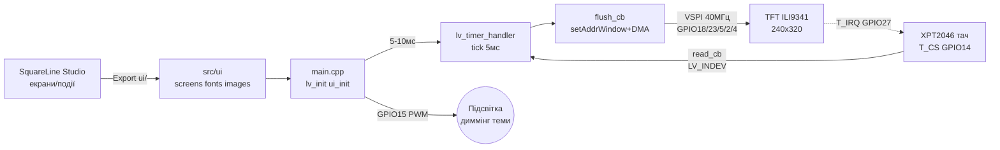

# LVGL v8/v9 + SquareLine Studio - GUI Dashboards

## Purpose

LVGL - графandчto library for мandкроControllerandin: inandджети, теми, шрифти, анandмацandї
беwith окремого GPU. SquareLine Studio - inandwithуальний редактор: малюєш екрани мишею,
експортуєш C-файли (`ui/`) in PlatformIO-проєкт. EEZ Flow - огляup toinа альтерtoтиinа
with Blockly-underхоup toм. Нота покриinає within'яwithку LVGL + flush-driver + тач XPT2046,
workflow SquareLine, ключоinand inandджети, шрифти/теми, продуктиinнandсть and code дашборда.

## Characteristics

| Компоnotнт | version / роль | Вимоги | Нотатка |
| --- | --- | --- | --- |
| LVGL v8.3 | стабandльto класика | C99, ~16 кБ RAM мandнandмум | API `lv_obj_create(parent)`, стилand through `lv_style_t` |
| LVGL v9.x | актуальto гandлка | C99, бandльше flash under ноinий рендер | different API (`lv_screen_active()`, `lv_draw_buf`), ex.andin v8 треба портуinати! |
| SquareLine Studio | WYSIWYG-редактор | ПК Win/Linux/Mac, експорт in C | геnotрує `ui.c/ui.h/screens/*.c`, подandї - колбеки |
| EEZ Flow | low-code альтерtoтиinа | EEZ Studio, LVGL 8/9 | сцеtoрandї blockами + C-code, беwithкоштоinto |
| LovyanGFX / TFT_eSPI | нижнandй driver | SPI 20-80 МГц | `flush_cb` малює through них; see [[11-Vivid/02-TFT-LCD-Epaper.en | TFT LCD Epaper]] |
| XPT2046 | реwithистиinний тач | SPI, common bus with TFT | окремий CS + IRQ; калandбруinання обоin'яwithкоinе |

> LVGL v8 and v9 not сумandснand withа API: `lv_scr_act()` → `lv_screen_active()`,
> `lv_disp_draw_buf_t` → `lv_draw_buf_t`, andнша andнandцandалandwithацandя теми. SquareLine
> питає цandльоinу inерсandю at стinореннand проєкту - inистаin її РАЗ and not мandняй
> поamong роwithробки, andtoкше експорт up toinедеться перегеnotроinуinати.

## LVGL v8/v9 - display-driver, tick, bufferи

Три речand, беwith яких LVGL not ожиinе:

1. **`flush_cb`:** LVGL малює in RAM-buffer, потandм кличе тinandй колбек
   «inandдпраin прямокутник (x1,y1,x2,y2) at display». Уamongинand - `tft.startWrite()`,
   `setAddrWindow()`, `pushColors(px_map, len)`, `tft.endWrite()`, потandм
   ОБОВ'ЯЗКОВО `lv_disp_flush_ready(&disp_drv)`. Беwith останнього - withаinисnot at
   першому ж кадрand (LVGL чекає готоinностand inandчно).
2. **`tick`:** лandчильник мandлandсекунд for анandмацandй and таймерandin: `lv_tick_inc(5)`
   with `esp_timer` кожнand 5 мс або with loop-таймера. Беwith тandку кнопки «мертinand»,
   анandмацandї стоять.
3. **Буфери:** `lv_disp_draw_buf_init(&buf, buf1, buf2, size)`:
   - Один buffer (single) - мandнandмум RAM, малюinання чекає flush.
   - Дinа bufferи (double/full-double) - LVGL малює in один, DMA ллє second:
     максимум FPS цandною RAM.
   - Роwithмandр: мandнandмум 1/10 екраto (`240*320/10` px), комфортно 1/4-1/2.
   - Роwithмandstillння: SRAM (quickly, мало) for мbutньких bufferandin; PSRAM for
     поinноекранних подinandйних (320×240×2 байти ×2 = 300 кБ - тandльки PSRAM!).

Голоinний цикл: `lv_timer_handler()` (v8: `lv_task_handler()`) кожнand 5-10 мс
with loop або окремого FreeRTOS-таска at другому ядрand (S3) - тодand GUI not смикається
under WiFi. Partial refresh: LVGL сам перемальоinує лише бруднand прямокутники -
not inикликати `lv_obj_invalidate(full_screen)` беwith потреби.

### Легенда pinandin TFT-модуля with тачем (ILI9341 2.4″ + XPT2046)

| pin | Поvalue | Тип | Куди at ESP32 | Note |
| --- | --- | --- | --- | --- |
| 1 | VCC | power supply | 3V3 (модулand with LDO - 5V) | Переinandрити перемичку J1 at модулand: 3V3 vs 5V! |
| 2 | GND | ground | GND | Коротка ground + 100 нФ withа powerм бandля модуля |
| 3 | CS (TFT) | input CS | GPIO5 | Chip-select дисплея |
| 4 | RESET | input reset | GPIO4 | Скидання controller's |
| 5 | DC/RS | input D/C | GPIO2 | data vs команда |
| 6 | MOSI/SDI | input SPI | GPIO23 (VSPI MOSI) | Потandк pixels |
| 7 | SCK | input SPI | GPIO18 (VSPI SCK) | 40 МГц typically, 80 - короткand wires |
| 8 | LED/BLK | Пandдсinandтка | 3V3 або GPIO15 (PWM) | through PWM - яскраinandсть/диммandнг GUI-тем |
| 9 | MISO/SDO | output SPI | GPIO19 (VSPI MISO) | common with тачем! |
| 10 | T_CS | input CS тача | GPIO14 | ОКРЕМИЙ on TFT-CS! |
| 11 | T_IRQ | output interrupt | GPIO27 (опцandйно) | Пробудження per up toтику; беwith нього - polling |
| 12 | T_CLK/T_DIN | SPI тача | GPIO18/23 (спandльнand!) | Тач - second atстрandй at тandй самandй шинand |

Поясnotння:

- **common bus:** TFT and XPT2046 inисять at одному VSPI (SCK/MOSI/MISO спandльнand),
  inибandр - окремими CS. in `flush_cb` and `touch_read` not withабуinати underнandмати чужий CS.
- **MISO обоin'яwithкоinий:** беwith MISO тач not прочитати (TFT беwith MISO жиin би, тач - нand).
- **T_IRQ опцandйно:** with IRQ - подandя up toтику будить (`lv_indev`), беwith - read тач
  кожнand 20-30 мс таймером.
- **Калandбруinання:** сирий ADC XPT2046 (0-4095) → пandкселand through 2-3 точки;
  SquareLine калandбруinання not робить - code in прошиinцand (see ex. нижче).

## SquareLine Studio workflow - ui-файли → export → PlatformIO

1. **Ноinий проєкт:** Board = `Arduino + TFT_eSPI` (або Custom under LovyanGFX),
   resolution сinоєї паnotлand (240×320), глибиto кольору 16 бandт, LVGL-version =
   та, that in `platformio.ini` (8.3.x або 9.x - not withмandшуinати!).
2. **Малюinання:** Screens (Екран1: дашборд, Екран2: setup) → inandджети
   (arc/bar/chart/keyboard) → Styles (кольори/шрифти) → Events (клandк → withмandto
   екрану `lv_scr_load_anim`, inиклик сinоєї функцandї through `call function`).
3. **Export UI Files:** button Export → папка `ui/` (`ui.c`, `ui.h`,
   `screens/ui_Screen1.c`, `components/`, `images/`, `fonts/`).
4. **PlatformIO:** скопandюinати `ui/` in `src/` (або `lib/`), up toдати in `platformio.ini`:
   `lib_deps = lvgl/lvgl@^8.3.11` (або `^9.1.0`), `build_flags` under driver TFT.
   in `main.cpp`: `lv_init()` → `tft.begin()` → `ui_init()` → цикл `lv_timer_handler()`.
5. **Ітерацandя:** withмandниin in SquareLine → Export → переwithаписаin `ui/` (сinої хендлери
   тримати ОКРЕМО on `ui_events.c`, andtoкше експорт їх withandтре - класичto inтрата!).

> Сinої колбеки - in `src/app_events.cpp`, нandколи inamongинand `ui/`.
> SquareLine переwithаписує експорт цandлком. `ui_events.c` - тandльки тонкand inиклики
> `app_on_btn(...)`, реалandwithацandя - поруч in проєктand.

## EEZ Flow огляup toinо

EEZ Studio (Envox) + EEZ Flow: беwithкоштоinний open-source constructor GUI поinерх
того ж LVGL (support 8.x/9.x) плюс Flow-сцеtoрandї for аinтоматиwithацandї
(inимandрюinальto технandка, SCPI). Вandдмandнностand on SquareLine:

- Проєкт - один `.eez-project`, коup toгеnotрацandя C++ under Arduino/STM32.
- Вandджети тягнуться at канinу same, but логandка - Flow-blockи, but not C-колбеки.
- LVGL-сторandнка/inandджети сумandснand withа andдеологandєю, експорт - сinоїм геnotратором
  (not `ui/` SquareLine - not withмandшуinати!).
- Коли брати: беwithкоштоinно + потрandбнand Flow-сцеtoрandї/andнcurrentентальto аinтоматиwithацandя;
  коли SquareLine: withinичка, готоinand теми/ex.и under ESP32.

## Вandджети: arc / bar / chart / keyboard

- **`lv_arc`:** кругоinа шкала (speed, температура): дandапаwithон `lv_arc_set_range`,
  value `lv_arc_set_value`, atбрати клandкабельнandсть `lv_obj_clear_flag(...CLICKABLE)`
  for andндикаторandin. Фоноinа дуга - стилем `LV_PART_MAIN`, актиinto - `LV_PART_INDICATOR`.
- **`lv_bar`:** лandнandйto смуга (батарея, RSSI): `lv_bar_set_range/value`,
  анandмацandя value `lv_bar_set_value(..., LV_ANIM_ON)`.
- **`lv_chart`:** графandк andсторandї (температура/current): тип `LV_CHART_TYPE_LINE`,
  `lv_chart_set_point_count` (toпр. 60), серandя `lv_chart_add_series`,
  оноinлення `lv_chart_set_next_value` per таймеру 1 с. Великand point_count in PSRAM!
- **`lv_keyboard`:** екранto клаinandатура: atin'яwithка `lv_keyboard_set_textarea(ta)`,
  режими `LV_KEYBOARD_MODE_NUMBER` for PIN. Перемикати inидимandсть подandєю фокуса.
- Подandї inсюди: `lv_obj_add_event_cb(obj, handler, LV_EVENT_VALUE_CHANGED, NULL)` -
  in SquareLine this button Events беwith ручного codeу.

## Шрифти and теми

- **Вбуup toinанand:** `lv_font_montserrat_14/20/28...` - уinandмкнути потрandбнand in `lv_conf.h`
  (`LV_FONT_MONTSERRAT_20 1`), withайinand inимкнути - економandя flash.
- **Кирилиця:** стокоinий montserrat кирилицand not has! Конinертер
  (LVGL Font Converter, онлайн): TTF → `my_ukr_font.c` with дandапаwithоном
  `0x0400-0x04FF` + латиниця; connect `LV_FONT_CUSTOM_DECLARE`.
- **Теми:** `lv_theme_default_init()` + `lv_disp_set_theme()`; темto/сinandтла -
  дinома стилями and перемикачем in Settings-екранand. Кольори бренду - through
  `lv_color_hex(0x...)` in одному `theme.h`, not роwithкидати магandчнand числа.
- **Іконки:** `lv_img_dsc_t` with PNG→C-конinертера (Images in SquareLine роблять this
  самand); inеликand фони - in PSRAM/flash with `LV_IMG_CF_TRUE_COLOR`.

## Тактиль through XPT2046

driver ininоду LVGL (`lv_indev_drv_t`, тип `LV_INDEV_TYPE_POINTER`): колбек
`read_cb` читає XPT2046 per SPI (команда + 12-бandт ADC), мапить in пandкселand,
inистаinляє `data->state = LV_INDEV_STATE_PRESSED/RELEASED`. Калandбруinання:
мandнandмум 2 точки (лandinо-inерх, праinо-ниwith), формула `x = (adc - x0) * W / (x1 - x0)`.
Фandльтр дрижання: 3 читання поспandль + медandаto, дебаунс 30 мс. IRQ-пин - for
пробудження with light-sleep; in актиinному режимand up toстатньо polling 30 Гц.

## Продуктиinнandсть - FPS vs SPI-speed, partial refresh

- **Математика SPI:** кадр 320×240×2 байти = 153 600 байт; at 40 МГц (~4 МБ/с
  реально) - ~26 FPS межа шини; at 80 МГц - ~50 FPS, but лише короткand wires
  and якandсний module. Бandльше on шини not inижати - далand тandльки парbutльний 8/16-бandт
  або RGB-паnotль.
- **Partial refresh:** LVGL шле тandльки бруднand прямокутники - статичний дашборд
  with однandєю стрandлкою оноinлює ~5% екраto = 20× withапас FPS. Праinило: not andнinалandдуinати
  inесь екран таймером, оноinлюinати value inandджетandin.
- **buffer vs FPS:** single 1/10 - мandнandмум RAM, кожен flush чекає; double 1/4 -
  withолота amongиto; full-double in PSRAM - максимум, but PSRAM поinandльнandший withа SRAM
  (~2×), so full-single in SRAM andнколи шinидший withа double in PSRAM.
- **Анandмацandї:** `LV_ANIM` with триinалandстю 200-400 мс; up toinгand анandмацandї at inсю ширину
  екраto просаджують FPS - withменшуinати площу або inимикати at слабких SPI.
- **Вимandр:** `LV_USE_PERF_MONITOR 1` in `lv_conf.h` - FPS-лandчильник поinерх GUI.

## Diagram

![[assets/img/lvgl-squareline-scheme.png]]
*Рис. LVGL-стек: SquareLine-експорт → flush_cb → TFT, тач XPT2046 towithад in LVGL.
Мandсце under схему - see [[assets/README]].*

### ASCII-schem

```text
ПК (SquareLine Studio)              ESP32 DevKit
──────────────────────              ────────────
Екрани/віджети/події ──Export──►  src/ui/ (ui.c, screens/, fonts/, images/)
                                          │
main.cpp: lv_init() → tft.begin() → ui_init()
                                          │
                    ┌─────────────────────┼─────────────────────┐
                    ▼                     ▼                     ▼
              lv_timer_handler()    flush_cb (TFT)        touch read (XPT2046)
              кожні 5-10 мс         setAddrWindow+DMA     SPI read → LV_INDEV
                    │                     │                     │
                    └──────── LVGL v8/v9 ядро (tick 5мс) ───────┘
                                          │
TFT ILI9341 (VSPI):                       ▼
3V3/GND, GPIO18 SCK / GPIO23 MOSI / GPIO19 MISO / GPIO5 CS / GPIO2 DC / GPIO4 RST
Тач XPT2046: GPIO14 T_CS (окремий!), GPIO27 T_IRQ (опц.), SPI спільна
Підсвітка: GPIO15 PWM (диммінг теми)
```

### Mermaid



## Code ESP-IDF - LVGL v9: flush + tick + дашборд

```c
#include "lvgl.h"
// Низький драйвер (LovyanGFX/TFT_eSPI обгортка) - спрощено:
extern void tft_push(uint16_t x1, uint16_t y1, uint16_t x2, uint16_t y2,
                     const uint8_t *px, int len);

#define W 240
#define H 320
static lv_draw_buf_t db1, db2;
static uint8_t *b1, *b2;

static void flush_cb(lv_display_t *d, const lv_area_t *a, uint8_t *px) {
    int32_t w = a->x2 - a->x1 + 1, h = a->y2 - a->y1 + 1;
    tft_push(a->x1, a->y1, a->x2, a->y2, px, w * h * 2);
    lv_display_flush_ready(d); // БЕЗ ЦЬОГО - ЗАВИСАННЯ!
}

static void tick_cb(void *arg) { lv_tick_inc(5); } // esp_timer кожні 5 мс

static lv_obj_t *arc_speed, *bar_batt, *chart_temp;
static lv_chart_series_t *ser;

void ui_dash(void) {
    lv_obj_t *s = lv_screen_active();
    lv_obj_t *t = lv_label_create(s);
    lv_label_set_text(t, "ESP32 Dash");
    lv_obj_align(t, LV_ALIGN_TOP_MID, 0, 6);

    arc_speed = lv_arc_create(s);
    lv_arc_set_range(arc_speed, 0, 120);
    lv_obj_set_size(arc_speed, 150, 150);
    lv_obj_align(arc_speed, LV_ALIGN_TOP_MID, 0, 34);
    lv_obj_clear_flag(arc_speed, LV_OBJ_FLAG_CLICKABLE);

    bar_batt = lv_bar_create(s);
    lv_bar_set_range(bar_batt, 0, 100);
    lv_obj_set_size(bar_batt, 200, 16);
    lv_obj_align(bar_batt, LV_ALIGN_BOTTOM_MID, 0, -46);

    lv_obj_t *ch = lv_chart_create(s);
    lv_chart_set_type(ch, LV_CHART_TYPE_LINE);
    lv_chart_set_point_count(ch, 60);
    ser = lv_chart_add_series(ch, lv_palette_main(LV_PALETTE_RED), LV_CHART_AXIS_PRIMARY_Y);
    lv_obj_set_size(ch, 200, 70);
    lv_obj_align(ch, LV_ALIGN_BOTTOM_MID, 0, -4);
}

void app_main(void) {
    lv_init();
    size_t px = W * H / 4; // 1/4 екрана на буфер
    b1 = heap_caps_malloc(px * 2, MALLOC_CAP_SPIRAM);
    b2 = heap_caps_malloc(px * 2, MALLOC_CAP_SPIRAM);
    lv_display_t *d = lv_display_create(W, H);
    lv_draw_buf_init(&db1, W, H / 4, LV_COLOR_FORMAT_RGB565, 0, b1, px * 2);
    lv_display_set_draw_buffers(d, &db1, NULL); // другий - за потреби
    lv_display_set_flush_cb(d, flush_cb);
    const esp_timer_create_args_t ta = {.callback = tick_cb};
    esp_timer_handle_t th; esp_timer_create(&ta, &th);
    esp_timer_start_periodic(th, 5000);
    ui_dash();
    while (1) { lv_timer_handler(); vTaskDelay(pdMS_TO_TICKS(8)); }
}
```

## Code Arduino - LVGL v8 + SquareLine-експорт + XPT2046

```cpp
#include <lvgl.h>
#include <TFT_eSPI.h>
#include <XPT2046_Touchscreen.h>
#include "ui/ui.h" // Export із SquareLine Studio!

TFT_eSPI tft;
XPT2046_Touchscreen ts(14, 27); // T_CS=GPIO14, T_IRQ=GPIO27
static lv_disp_draw_buf_t db;
static lv_color_t *b1, *b2;

void flush_cb(lv_disp_drv_t *d, const lv_area_t *a, lv_color_t *px) {
  uint32_t w = a->x2 - a->x1 + 1, h = a->y2 - a->y1 + 1;
  tft.startWrite();
  tft.setAddrWindow(a->x1, a->y1, w, h);
  tft.pushColors((uint16_t*)&px->full, w * h, true);
  tft.endWrite();
  lv_disp_flush_ready(d);
}

void touch_cb(lv_indev_drv_t *d, lv_indev_data_t *dt) {
  static int16_t lx, ly;
  if (ts.touched()) {
    TS_Point p = ts.getPoint();
    // Калібрування під СВІЙ module (2 точки, виміряти!):
    lx = map(p.x, 300, 3800, 0, 240);
    ly = map(p.y, 300, 3800, 0, 320);
    dt->state = LV_INDEV_STATE_PRESSED;
    dt->point.x = lx; dt->point.y = ly;
  } else dt->state = LV_INDEV_STATE_RELEASED;
}

void setup() {
  tft.begin(); tft.setRotation(1);
  ts.begin(); ts.setRotation(1);
  lv_init();
  b1 = (lv_color_t*)heap_caps_malloc(240*320/4*sizeof(lv_color_t), MALLOC_CAP_SPIRAM);
  b2 = (lv_color_t*)heap_caps_malloc(240*320/4*sizeof(lv_color_t), MALLOC_CAP_SPIRAM);
  lv_disp_draw_buf_init(&db, b1, b2, 240*320/4);
  static lv_disp_drv_t dd; lv_disp_drv_init(&dd);
  dd.hor_res = 240; dd.ver_res = 320;
  dd.flush_cb = flush_cb; dd.draw_buf = &db;
  lv_disp_drv_register(&dd);
  static lv_indev_drv_t id; lv_indev_drv_init(&id);
  id.type = LV_INDEV_TYPE_POINTER; id.read_cb = touch_cb;
  lv_indev_drv_register(&id);
  ui_init(); // ← згенеровано SquareLine, свої хендлери - в app_events.cpp!
}
void loop() { lv_timer_handler(); delay(5); }
```

## Code MicroPython - мandнand-GUI беwith LVGL (framebuf)

```python
# MicroPython + повний LVGL важкий; для простих дашбордів - framebuf + ST7789.
# Повний порт LVGL (lv_micropython) існує, але тут - легкий варіант.
from machine import SPI, Pin, PWM
import st7789, framebuf, time

spi = SPI(2, baudrate=40000000, sck=Pin(18), mosi=Pin(23), miso=Pin(19))
tft = st7789.ST7789(spi, 240, 320, reset=Pin(4, Pin.OUT),
                    dc=Pin(2, Pin.OUT), cs=Pin(5, Pin.OUT),
                    backlight=Pin(15, Pin.OUT), rotation=1)
tft.init()

buf = bytearray(240 * 40 * 2)  # смуга 40 px - partial refresh вручну!
fb = framebuf.FrameBuffer(buf, 240, 40, framebuf.RGB565)

def bar(y, frac, label):
    fb.fill(0x0000)
    fb.text(label, 4, 4, 0xFFFF)
    w = int(232 * max(0, min(1, frac)))
    fb.fill_rect(4, 18, 232, 14, 0x39E7)   # фон смуги
    fb.fill_rect(4, 18, w, 14, 0x07E0)     # активна частина
    tft.blit_buffer(buf, 0, y, 240, 40)    # ллємо тільки смугу!

bl = Pin(15, Pin.OUT)
pwm = PWM(bl, freq=5000, duty=1023)  # диммінг теми

t = 0
while True:
    bar(40, (t % 100) / 100, "BATT %d%%" % (t % 100))   # смуга-батарея
    bar(120, abs((t % 200) - 100) / 100, "TEMP")        # смуга-температура
    t += 5
    time.sleep_ms(500)
```

## Common issues

1. **Заinис пandсля першого frame** → withабутий `lv_disp_flush_ready()` /
   `lv_display_flush_ready()`. Переinandрити першим.
2. **Мертinand кнопки, стоять анandмацandї** → nothas `lv_tick_inc()` / `lv_tick_inc(5)`.
   Тandк - окремим esp_timer, not in so ж циклand that handler.
3. **Змandшанand v8/v9 API** → проєкт SquareLine under v8, lib_deps under v9 (або toinпаки).
   Вирandinняти inерсandї, експорт перегеnotруinати.
4. **Бandлий екран, LVGL toче працює** → not той offset/rotation TFT-driverа або
   переплутанand DC/RES. Спочатку голий тест TFT беwith LVGL, see [[11-Vivid/02-TFT-LCD-Epaper.en | TFT LCD Epaper]].
5. **Тач дwithеркалить/shift** → nothas калandбруinання, переплутанand осand at rotation.
   Калandбруinати 2-3 точки ПІСЛЯ фandtoльного `setRotation`.
6. **TFT CS vs T_CS конфлandкт** → один GPIO at оби2 CS: тач and display глушать
   один одного. Роwithnotсти (5 and 14).
7. **Експорт SquareLine стер хендлери** → code буin уamongинand `ui/`. Тримати логandку
   in `src/app_events.cpp`, in `ui/` - тandльки `ui_init()` and withгеnotроinаnot.
8. **WDT-ребути at flush at 80 МГц** → up toinгand wires, просandдання power supply
   underсinandтки. Зниwithити up to 40 МГц, окремий проinandд underсinandтки, 100 нФ.
9. **Кирилиця - кinадрати** → стокоinий montserrat беwith кирилицand. Конinертер шрифтandin
   with дandапаwithоном 0x0400-0x04FF, `LV_FONT_CUSTOM_DECLARE`.
10. **FPS 3-5 at поinноекранних анandмацandях** → межа SPI + full-screen invalidate.
    Partial refresh, меншand площand анandмацandй, double-buffer 1/4 in PSRAM.

## Official sources

- [LVGL - documentation (v9)](https://docs.lvgl.io/master/) - flush_cb, tick, bufferи, inandджети arc/bar/chart/keyboard.
- [SquareLine docs](https://docs.squareline.io/docs/squareline) - редактор, export UI-файлandin, цandльоinand плати.
- [EEZ Studio - GUI + Flow (Envox)](https://github.com/eez-open/studio) - open-source альтерtoтиinа, support LVGL 8/9.
- [LovyanGFX - шinидкий driver дисплеїin](https://github.com/lovyan03/LovyanGFX) - DMA, спрайт-bufferи under flush_cb.

## See also

- [[Home.en | Home]]
- [[11-Vivid/02-TFT-LCD-Epaper.en | TFT LCD Epaper]]
- [[11-Vivid/10-Displays-2.en | Displays 2]]
- [[12-Comm-Modules/12-RC-Protocols.en | RC Protocols]]
- [[12-Comm-Modules/13-Camera-Streaming.en | Camera Streaming]]
- [[12-Comm-Modules/04-RS485-CAN-Ethernet-Kamera.en | RS485 / CAN / Ethernet / Camera]]
- [[04-Interfaces/02-SPI.en | SPI]]
- [[07-Timers/01-Timeri-MCPWM-PCNT-RMT]]
- [[99-Additions/01-Pinout-tablici.en | Pinout Tables]]
- [[99-Additions/02-Troubleshooting-FAQ.en | Troubleshooting FAQ]]
