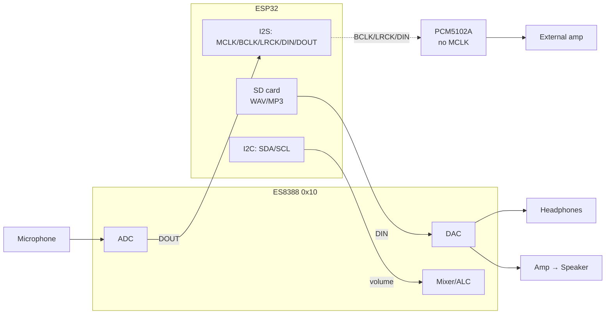

# Audio Codecs on ESP32 - ES8388, AC101, WM8978, PCM5102A, LyraT/Korvo/S3-BOX

> [!info] Codec ≠ just a DAC
> A codec (ES8388/AC101/WM8978) is ADC + DAC: microphone/line to input, headphones/speaker to output, controlled over I2C. PCM5102A is DAC only (output), but without MCLK and with linear output for an amplifier.

Audio base: [[04-Interfaces/04-I2S.en.md|I2S]], simpler solution [[11-Vivid/08-DFPlayer-MAX98357-Nextion-LCD2004.en.md|DFPlayer/MAX98357A]], start [[Home.en.md|Home]].

## Purpose

When MAX98357A (I2S → speaker with no tuning) is not enough:

- need **record** from microphone (voice assistant, intercom) - choose codec with ADC: ES8388/AC101/WM8978;
- need **headphones** with volume and tone control - codec (not bare DAC);
- need **maximally clean linear output** to external amplifier - PCM5102A (no MCLK, less clock hassle);
- need **fast start** without wiring - ready kit: LyraT v4.3, Korvo, S3-BOX.

When NOT to choose a codec: voice/ buzzer (DFPlayer is enough), one speaker without recording (MAX98357A is enough).

## Codec comparison

| Parameter | ES8388 | AC101 | WM8978 | PCM5102A |
| --- | --- | --- | --- | --- |
| Type | codec (ADC+DAC) | codec (ADC+DAC) | codec (ADC+DAC) | DAC only |
| I2C address | `0x10` | `0x1A` | `0x1A` | none (no I2C!) |
| Control | I2C registers (volume, ALC, mixer) | I2C registers | I2C registers, EQ | jumpers (FMT/FLT/DM) |
| Input | mic + line (stereo ADC) | mic + line | mic + line | none |
| Output | headphones + speaker (2×?) | headphones + line | headphones + speaker driver | linear 2.1 Vrms (needs amp!) |
| MCLK | required (from ESP32!) | required | required | NOT required (built-in PLL) |
| Bit depth / rate | 16/24 bit, up to 96 kHz | 16/24 bit, up to 96 kHz | 16/32 bit, up to 96 kHz | up to 32 bit / 384 kHz |
| Used in | LyraT v4.3, AudioKit v2.2 | older AudioKit v2.1, Orange Pi | DIY boards, HiFi shields | DIY DAC modules (purple boards) |
| Price / availability | cheap, mass | disappearing | more expensive, HiFi | cheap, mass |
| When | voice + sound, start in an hour | repairing old board | HiFi headphones | clean output to amplifier |

> [!warning] AC101 vs WM8978 - same address 0x1A, but different drivers!
> Do not flash ES8388 driver on a board with AC101: registers are different, no sound, I2C bus may hang ACK. Always verify chip marking against `menuconfig` / board define.

## Ready audio kits

| Kit | ESP chip | Codec | Microphone | Buttons / screen | Use for |
| --- | --- | --- | --- | --- | --- |
| LyraT v4.3 | ESP32-WROVER | ES8388 | analog mic + connector | 6 buttons, microSD, 3.5 mm | basic sound development, ADF examples |
| LyraT-Mini | ESP32 | ES8311/ES8388 (by revision) | mic | microSD | compact project |
| ESP32-S3-Korvo-2 | ESP32-S3 | ES8311 (DAC) + ES7210 (ADC) | digital mic array | LCD, buttons | voice assistant, AI |
| ESP32-S3-BOX / BOX-3 | ESP32-S3 | ES8311 + mics | 2× digital mic | LCD touch, sensor | voice control panel |
| AI-Thinker AudioKit v2.2 | ESP32-A1S | ES8388 | mic on board | microSD, 3.5 mm, speaker connector | cheap start with ES8388 |
| ESP32-P4-Function-EV | ESP32-P4 | ES8311 (by revision) | depends on board | LCD | audio on P4 |

Practice: start with LyraT v4.3 or AudioKit v2.2 (both ES8388 - code from this note works verbatim), voice project - Korvo-2/S3-BOX.

## Wiring: MCLK/BCLK/LRCK/DIN + I2C addresses

| Signal | Direction | To ESP32 (LyraT example) | Note |
| --- | --- | --- | --- |
| MCLK | ESP → codec | GPIO0 (LyraT) | 256×Fs (12.288 MHz at 48 kHz); required for ES8388/AC101/WM8978! |
| BCLK (SCLK) | ESP → codec | GPIO27 | I2S bit clock |
| LRCK (WS) | ESP → codec | GPIO25 | 44.1/48 kHz, L/R select |
| DIN (DACDAT) | ESP → codec | GPIO26 | music to output |
| DOUT (ADCDAT) | codec → ESP | GPIO35 | mic / line to input |
| SDA / SCL | I2C | GPIO18 / GPIO23 (LyraT) | register config; 4.7 kΩ pull-ups |
| PA_CTRL | ESP → amp | GPIO21 (LyraT) | enable speaker amplifier |

**I2C addresses (7-bit):**

| Chip | Address | How to check |
| --- | --- | --- |
| ES8388 | `0x10` | `i2c.scan()` shows `16` |
| AC101 | `0x1A` | `i2c.scan()` shows `26` |
| WM8978 | `0x1A` | like AC101 - distinguish by chip marking! |
| ES8311 | `0x18` | Korvo/S3-BOX DAC |
| ES7210 | `0x40` | Korvo-2 ADC (mics) |
| PCF8574 (LCD) | `0x27/0x3F` | do not confuse with codec on same bus |

> [!warning] MCLK is most often forgotten
> Without MCLK the codec is silent or crackling on all frameworks equally. First diagnostics: oscilloscope / logic analyzer on MCLK (must be 12.288 MHz), then `i2c.scan()`, only then code.

![[assets/img/audio-codecs-es8388-scheme.png|600]]
*Fig. ES8388: I2C config, I2S streams, microphone to input, headphones/speaker to output; PCM5102A - I2S only, no MCLK.*

### ASCII diagram

```text
ESP32 (LyraT v4.3 / AudioKit v2.2)              ES8388 (addr 0x10)
─────────────────────────────────              ──────────────────
GPIO0  ──MCLK (12.288 MHz)──────────────────►  MCLK  (ADC/DAC clock!)
GPIO27 ──BCLK ──────────────────────────────►  SCLK
GPIO25 ──LRCK (48 kHz) ─────────────────────►  LRCK
GPIO26 ──DIN (music) ──────────────────────►  DACDAT ──► HP_OUT (headphones 3.5mm)
GPIO35 ◄──DOUT (mic)────────────────────  ADCDAT ◄── MIC_IN (on-board mic)
GPIO18/23 SDA/SCL (I2C, 4.7k) ◄──────────────►  I2C (volume/ALC/mixer)
GPIO21 ──PA_CTRL ──► speaker amplifier ──► SPK

PCM5102A variant (output only, NO MCLK and I2C):
GPIO ──BCLK/LRCK/DIN──► PCM5102A ──RCA──► external amp ──► speakers
```

### Mermaid



## Code - speech and WAV from SD in 3 frameworks

**ESP-IDF (ADF pipeline: SD → decoder → ES8388):**

```c
// Project on ESP-ADF (LyraT v4.3): pipeline sd → mp3/wav-decoder → i2s → es8388.
// menuconfig: board LyraT v4.3 (MCLK=GPIO0, I2C SDA=18/SCL=23, addr 0x10).
#include "audio_pipeline.h"
#include "sdcard_stream.h"
#include "wav_decoder.h"
#include "i2s_stream.h"
#include "es8388.h"

void app_main(void)
{
    audio_pipeline_handle_t pipe;
    audio_pipeline_cfg_t pipe_cfg = DEFAULT_AUDIO_PIPELINE_CONFIG();
    pipe = audio_pipeline_init(&pipe_cfg);

    sdcard_stream_cfg_t sd_cfg = SDCARD_STREAM_CFG_DEFAULT();
    sd_cfg.type = AUDIO_STREAM_READER;          // read /sdcard/*.wav
    audio_element_handle_t sd = sdcard_stream_init(&sd_cfg);

    wav_decoder_cfg_t wav_cfg = DEFAULT_WAV_DECODER_CONFIG();
    audio_element_handle_t dec = wav_decoder_init(&wav_cfg);

    i2s_stream_cfg_t i2s_cfg = I2S_STREAM_CFG_DEFAULT(); // MCLK enabled!
    i2s_cfg.type = AUDIO_STREAM_WRITER;
    i2s_cfg.i2s_config.sample_rate = 44100;
    audio_element_handle_t i2s = i2s_stream_init(&i2s_cfg);

    audio_pipeline_register(pipe, sd, "sd");
    audio_pipeline_register(pipe, dec, "dec");
    audio_pipeline_register(pipe, i2s, "i2s");
    audio_pipeline_link(pipe, (const char *[]){"sd", "dec", "i2s"}, 3);

    es8388_config_t codec = { .dac_output = DAC_OUTPUT_ALL, // headphones + speaker
                              .adc_input = ADC_INPUT_LINPUT1_RINPUT1 };
    es8388_init(&codec);
    es8388_set_voice_volume(70);
    es8388_ctrl_state(AUDIO_HAL_CODEC_MODE_BOTH, AUDIO_HAL_CTRL_START);

    audio_pipeline_run(pipe); // plays /sdcard/talk.wav in loop on events
}
```

**Arduino (AudioKit + AudioTools library, ES8388):**

```cpp
// Arduino-ESP32 + https://github.com/pschatzmann/arduino-audiokit
// Board: AI-Thinker AudioKit v2.2 (ES8388, addr 0x10). SD: VSPI.
#include "AudioTools.h"
#include "AudioLibs/AudioKit.h"

AudioKit kit;                 // ES8388 wrapper: I2C config + I2S
WAVDecoder wav;               // WAV decoder from SD
File audioFile;
StreamCopy copier(wav, audioFile, kit); // SD → decode → codec

void setup() {
  Serial.begin(115200);
  auto cfg = kit.defaultConfig();       // MCLK/BCLK/LRCK/DIN handled by AudioKit
  cfg.sd_active = true;
  cfg.sample_rate = 44100;
  kit.begin(cfg);                       // I2C check 0x10 inside
  kit.setVolume(70);

  SD.begin(PIN_AUDIO_KIT_SD_CARD_CS);
  audioFile = SD.open("/talk.wav");     // 16-bit PCM WAV!
  wav.begin();
}

void loop() {
  if (!copier.copy()) {                 // end of file → restart
    audioFile.seek(0);
  }
  // "Talkie": record from mic — kit.stream() as source instead of SD
}
```

**MicroPython (I2S + wave, record / play WAV):**

```python
# MicroPython: configure ES8388 manually via I2C (addr 0x10), sound via machine.I2S.
# Minimum to start: enable DAC gain and output to headphones (see ES8388 datasheet,
# registers 0x00 chirp/clock, 0x04 DAC power, 0x2E LOUT volume). Full init ~20 writes.
from machine import I2C, I2S, Pin, SDCard
import wave, os

CODEC = 0x10
i2c = I2C(0, scl=Pin(23), sda=Pin(18), freq=100000)
assert CODEC in i2c.scan(), "ES8388 not found! Check power and SDA/SCL"

def es8388_write(reg, val):
    i2c.writeto_mem(CODEC, reg, bytes([val]))

es8388_write(0x00, 0x80)  # reset
es8388_write(0x04, 0x3C)  # DAC power up (L/R)
es8388_write(0x2E, 0x1E)  # headphone volume (example)
# MCLK/BCLK/LRCK generated by I2S peripheral:
audio = I2S(0, sck=Pin(27), ws=Pin(25), sd=Pin(26), mode=I2S.TX,
            bits=16, format=I2S.STEREO, rate=44100, ibuf=4096)

os.mount(SDCard(slot=2), "/sd")          # VSPI SD module
w = wave.open("/sd/talk.wav", "rb")
assert (w.getsampwidth(), w.getnchannels()) == (2, 2), "must be 16-bit stereo WAV"
while True:
    chunk = w.readframes(1024)
    if not chunk:
        w.rewind(); continue
    audio.write(chunk)                   # PCM → ES8388 → headphones
```

> [!tip] Talkie effect (robot voice)
> Resample 44.1 kHz → 8 kHz + 1-bit quantization gives "radio robot" without libraries. In ADF use `sonic`/resample element, in Arduino `ResampleStream`, in MicroPython downsample samples manually before `audio.write()`.

## Common issues

| Symptom | Cause | Solution |
| --- | --- | --- |
| Silence on all frameworks | no MCLK (ES8388/AC101/WM8978) | check 12.288 MHz on MCLK; enable MCLK output in ADF/I2S |
| `i2c.scan()` empty | wrong SDA/SCL; no pull-ups; codec unpowered | verify board pins (LyraT: 18/23); 4.7 kΩ to 3V3; AVDD=3.3 V |
| Found `0x1A`, but hiss / silence | AC101 vs WM8978 - wrong driver | verify chip marking and board define |
| PCM5102A silent | expecting I2C/MCLK that do not exist | normal: only BCLK/LRCK/DIN; check FMT=GND (I2S mode) |
| Clicking on start / stop | amp enabled before DAC | first `es8388_ctrl_state(START)`, then `PA_CTRL=1`; mute ramp |
| Bass crackle | power sag (4 Ω speaker!) | separate 5 V / 2 A supply for amp; 470+ µF near supply |
| WAV does not play | MP3 renamed to .wav; 8-bit / mono without conversion | only PCM 16-bit; convert: `ffmpeg -i in.mp3 -ar 44100 -ac 2 out.wav` |
| Recording noisy (WiFi background) | analog mic traces near antenna | short screened mic wires; AGC/ALC in registers; separate antenna |
| Volume "0 or 100" | writing to wrong volume register | ES8388: LOUT1/ROUT1 (0x2E/0x2F) for headphones, DAC-volume separate |

## Official sources

- [ESP-ADF - Programming Guide](https://docs.espressif.com/projects/esp-adf/en/latest/) - pipeline, boards, audio examples.
- [ESP-ADF Get Started (v2.x) - LyraT/Korvo boards](https://docs.espressif.com/projects/esp-adf/en/release-v2.x/get-started/index.html) - Espressif audio kits overview.
- [esp-adf - GitHub](https://github.com/espressif/esp-adf) - ES8388/ES8311/AC101 drivers, player examples.
- [esp-dev-kits - documentation](https://docs.espressif.com/projects/esp-dev-kits/en/latest/) - schematics and pinouts of dev kits.

## See also

- [[Home.en.md|Home]]
- [[04-Interfaces/04-I2S.en.md|I2S]] - signals, DMA, microphone INMP441 + MAX98357A
- [[11-Vivid/08-DFPlayer-MAX98357-Nextion-LCD2004.en.md|DFPlayer/MAX98357A]] - sound without codecs
- [[05-Radio/05-BLE-Mesh-A2DP-HID.en.md|BLE Mesh / A2DP / HID]] - A2DP sink to same DAC
- [[15-Protocols/09-Matter-Thread-Zigbee.en.md|Matter/Thread/Zigbee]] - voice devices in ecosystems
- [[04-Interfaces/07-SD-SDIO.en.md|SD/SDIO]] - source for WAV/MP3
- [[04-Interfaces/03-I2C.en.md|I2C]] - address scanner, pull-ups for codec config
