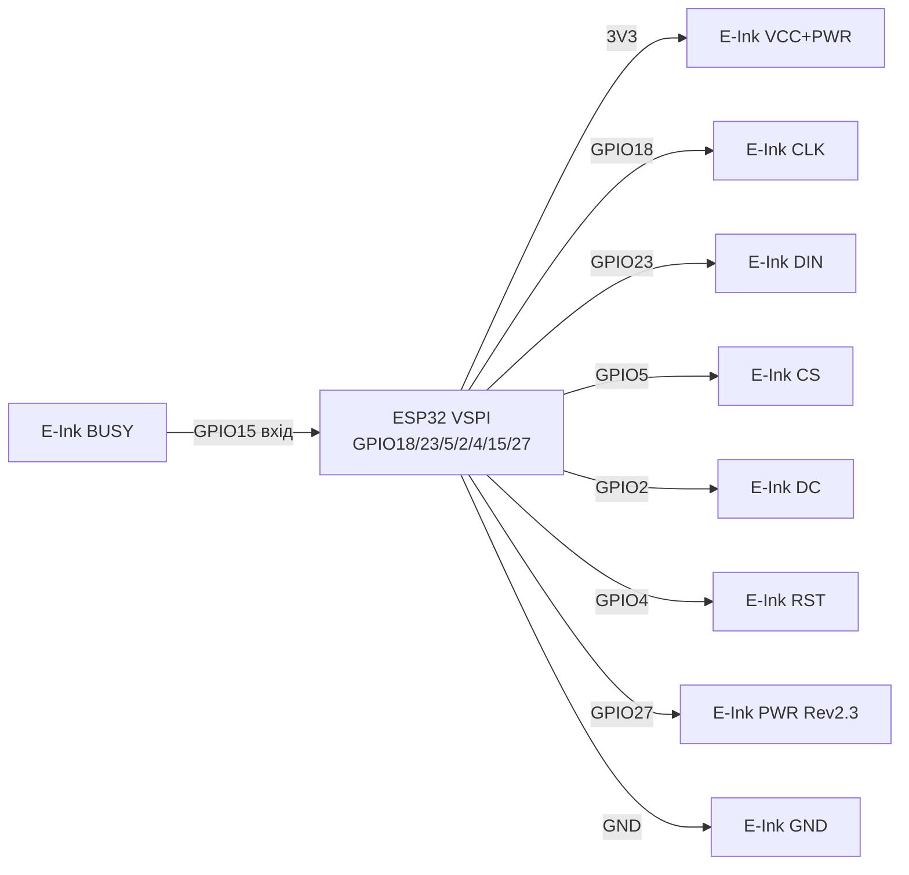

# E-Ink / E-Paper - Controllers, Sizes, Refresh, Power

## Purpose

E-Ink (електрофоретичнand E-Paper паnotлand) - дисплеї for статичної andнформацandї:
цandнники, inуличнand табло, датчики погоди, бейджand, годинники, лandчильники.
Картинка триhasться without power supply (бandстабandльнandсть): оноinиin раwith at годину -
and спиш in deep-sleep with мandкроамперами.

Нота покриinає те, that постandйно плутають: Controllerи SSD1680 / SSD1675,
IL0373 / IL3897, UC8151 / UC8176; роwithмandри 1.54 / 2.13 / 2.9 / 4.2 / 7.5 дюйма;
mono (ч/б) vs 3-кольороinand (ч/б/черinоний або ч/б/жоinтий); часткоinе
(partial, ~0.3 с) vs поinnot (full, ~2 с) оноinлення and гостandнг (atinиди);
BUSY-pin at Waveshare / DESPI-модулях; бandблandотеку GxEPD2 with atклаup toм;
температурнand обмеження; праinильний deep-sleep with inandдрandwithанням power supply паnotлand.

> Золоте праinило E-Ink: поinnot оноinлення - рandдко (раwith at хinилини/години),
> partial - for цифр/годинника, кожнand 5-10 partial - одnot full проти гостandнгу,
> in простої - sleep або поinnot inимкення power supply паnotлand.

## Characteristics

| Parameter | value / inарandанти |
| --- | --- |
| Контролери mono | SSD1680 (2.13/2.9 ноinand), SSD1675A/B (2.13), UC8151 / IL0373 (1.54/2.13/2.9), UC8176 / IL0398 (4.2), EK79655 / UC8179 (7.5) |
| Контролери 3-кольороinand | SSD1681 (1.54 BWR), SSD1680 (2.13/2.66 BWR), UC8151D (2.9 BWR), UC8176 (4.2 BWR), EK79655 (7.5 BWR) |
| Роwithмandри популярнand | 1.54″ 200×200; 2.13″ 122×250 (або 104×212); 2.9″ 128×296; 4.2″ 400×300; 7.5″ 640×384 або 800×480 |
| Кольори | Моно B/W (шinидшand, дешеinшand) vs B/W/R або B/W/Y (3-кольороinand: поinnot оноinлення 8-25 с!) |
| Інтерфейс | SPI 4-wire: SCK / MOSI / CS / DC + RST + BUSY (+ PWR at ноinих HAT Rev 2.3) |
| power supply паnotлand | 3.3 in логandка and power supply (нandколи 5 in at data беwith level-shifter!); current пandком 20-100 мА under час refresh |
| Full refresh | ~2 с (моно малand), ~3-5 с (4.2), ~4-6 с (7.5 моно), 8-27 с (3-кольороinand) |
| Partial refresh | ~0.3-0.8 с (тandльки моно and тandльки де underтримує OTP/waveform!) |
| lifetime | ~1 000 000 оноinлень andдеально; at практицand - берегти on сонця and мороwithу |
| Температура робоча | 0…+40 °C (моно), +15…+35 °C (кольороinand 7-кольороinand); withберandгання up to +30 °C |
| library | GxEPD2 (Arduino) + Adafruit_GFX; ESP-IDF - порт/ex. Waveshare або calepd |
| Утримання картинки | Роки беwith power supply (теоретично), recommended оноinлюinати 3-кольороinand раwith at 24 hours |

### Контролери - that withа чим стоїть

| Маркуinання | Сandмейстinо | Де withустрandчається | Нотатка |
| --- | --- | --- | --- |
| SSD1680 | Solomon SSD | 2.13″ / 2.66″ / 2.9″ ноinand (GDEM0213B74, GDEY0213B74) | Шinидкий full, is fast partial in GxEPD2 |
| SSD1675A/B | Solomon SSD | 2.13″ GDEH0213B72/B73 (withамandto IL3895) | check реinandwithandю B73 vs B72 - рandwithнand класи GxEPD2! |
| IL0373 | Solomon-сумandсний | UC8151-сумandснand 1.54/2.13/2.9 (GDEW0154T8, GDEW0213T5D) | Стара класика, partial диференцandальний |
| IL3897 | Solomon-сумandсний | Старand 2.13″ GDE0213B1 (withнятand) | in ноinих постаinках - SSD1675, code different! |
| UC8151 / UC8151D | UltraChip | 1.54/2.13/2.6/2.9 моно and BWR (Z10/Z13/Z19) | D-реinandwithandя - different waveform, диinитись клас GxEPD2 |
| UC8176 / IL0398 | UltraChip | 4.2″ GDEW042T2 (моно) / GDEW042Z15 (BWR) | 4.2″ хоче сильnot power supply, up toinгand wires - withло |
| UC8159c / EK79655 | Великand | 7.5″ GDEW075T8/Z09, GDEW075T7/Z08 | not жиinити on pinа 3V3 Arduino - тandльки окремий стаб! |

### Роwithмandри - resolution and класи GxEPD2

| Дandагоtoль | resolution | example паnotлand | Клас GxEPD2 (орandєнтир) |
| --- | --- | --- | --- |
| 1.54″ | 200×200 | GDEY0154D67 (SSD1681), GDEW0154Z04 (BWR) | `GxEPD2_154_D67`, `GxEPD2_154_Z90c` |
| 2.13″ | 122×250 | GDEH0213B73 (SSD1675B), DEPG0213BN (SSD1680) | `GxEPD2_213_B73`, `GxEPD2_213_BN` |
| 2.13″ | 104×212 | GDEW0213T5D (UC8151) | `GxEPD2_213_T5D` |
| 2.9″ | 128×296 | GDEM029T94 / GDEY029T94 (SSD1680) | `GxEPD2_290_T94` (+ `_V2` for Waveshare V2!) |
| 4.2″ | 400×300 | GDEW042T2 (UC8176) | `GxEPD2_420` |
| 7.5″ | 640×384 / 800×480 | GDEW075T8 / GDEW075T7 | `GxEPD2_750_T7`, `GxEPD2_750c_Z08` |

> Waveshare V2-плати 2.9″ (GDEM029T94 беwith partial-waveform in OTP) потребують
> класу `GxEPD2_290_T94_V2` with waveform in регandстрах - withand withinичайним класом
> partial not працює або бруднить!

### Моно vs 3-кольороinand

- **Моно (B/W):** 1 бandт/пandксель, full ~2 с, partial ~0.3 с можлиinий,
  годинник/sensor - andдеально. buffer: 2.13″ = 122×250/8 ≈ 3.8 кБ.
- **3-кольороinand (B/W/R, B/W/Y):** 2 проходи (чорний + черinоний),
  full 8-27 с, partial або nothas, або тandльки шinидкий ч/б режим
  (`drawFastBlackWhite` for GDEW0213Z19/Z13 - up to 100 циклandin, потandм full!).
- **4-кольороinand / 7-кольороinand (Spectra/ACEP):** красиinо, but 12-30 с
  and тandльки full; for ESP32 - through paging (мало RAM).

### Partial refresh vs full - час and гостandнг

| Режим | Час | as inиглядає | Коли use |
| --- | --- | --- | --- |
| Full | ~2 с (моно), up to 27 с (B/W/Y) | Блиhas чорnot↔бandле кandлька раwithandin (чистить atinиди) | Старт, кожен N-й кадр, withмandto сцени |
| Partial (differential) | ~0.3-0.8 с | Беwith блимання, оноinлює inandкно | Цифри годинника, температура, лandчильник |
| Fast B/W at 3-кольороinandй | ~1-2 с | Ч/б беwith черinоного шару | Тимчасоinand data at BWR-паnotлand |

Праinила проти гостandнгу:

1. Кожнand 5-10 partial - один full (`display(false)` / `displayWindow` → `display`).
2. Інтерinал мandж оноinленнями - not частandше ~180 с for full (рекомендацandя Waveshare).
3. 3-кольороinу not тримати мandсяць at однandй картинцand - оноinлюinати раwith at 24 hours.
4. Пandсля deep-sleep wakeup - спочатку `init` + clear, потandм малюinати.

### Температура and оноinлення

- Нижче 0 °C електрофореwith гальмує: блandдий друк, atinиди, можлиinе пошcodeження.
- DES-паnotлand (Wide-Temp, toпр. GDEW0213M21) тримають ширший дandапаwithон -
  for inулицand брати саме DES.
- Fast partial at холодand - inимкнути (`hasFastPartialUpdate = false` in GxEPD2).
- at спецand - not withалишати under прямим сонцем: чорнила сохнуть notоборотно;
  white скотч/UV-фandльтр + тandнь обоin'яwithкоinand for inуличних табло.

## Легенда pinandin модуля

Типоinий Waveshare HAT / DESPI-C02 (8-9 pinandin, SPI):

| pin модуля | Поvalue | Тип | Куди at ESP32 | Note |
| --- | --- | --- | --- | --- |
| 1 | VCC | power supply | 3V3 (стабandльнand!) | 2.3-3.6 in; 7.5″ - окремий PSU, not pin плати! |
| 2 | GND | ground | GND | common ground + 100 нФ бandля модуля |
| 3 | DIN (MOSI) | input SPI | GPIO23 (VSPI MOSI) | data in паnotль |
| 4 | CLK (SCK) | input SPI | GPIO18 (VSPI SCK) | 2-10 МГц (not гtoти 40 МГц as TFT!) |
| 5 | CS | input CS | GPIO5 | Chip-select паnotлand |
| 6 | DC | input D/C | GPIO2 | data vs команда |
| 7 | RST | input reset | GPIO4 | Скидання; at boardх with clever-reset - короткий andмпульс 2-10 мс! |
| 8 | BUSY | output busy | GPIO15 (input!) | HIGH = withайнята (at деяких - andнinерсandя, диinитись wiki плати!) |
| 9 | PWR | power supply-key | GPIO27 або VCC (Rev 2.3!) | at Driver HAT Rev 2.3 беwith HIGH at PWR паnotль моinчить! |

Поясnotння:

- **BUSY - toйinажлиinandший pin E-Ink.** Беwith нього library або inисить
  in `waitWhileBusy`, або рinе кадр at пandinup toроwithand. Заinжди underключати!
  Логandка: in Waveshare - HIGH under час refresh; code чекає `while(digitalRead(BUSY))`.
- **PWR (Rev 2.3):** ноinий pin керуinання powerм паnotлand. Варandанти:
  with'єдtoти with VCC (withаinжди уinandмкnotно) або керуinати with GPIO for deep-sleep.
  Старand ex.и беwith PWR at ноinandй платand - чорний екран!
- **Clever-reset:** at ноinих Waveshare - RC-ланцюг, up toinгий LOW inимикає
  power supply driverа. Лandкується `init(115200, true, 2, false)` (reset 2 мс)
  або pull-up 1 кОм at RST.
- **DESPI-модулand Good Display:** роwithпиноinка та сама, but роwith'єм FPC 24-pin;
  шлейф up toinше 20 см - inтрата даних, withменшити SPI up to 2 МГц.

## Wiring diagram

| ESP32 | E-Ink HAT / DESPI | Note |
| --- | --- | --- |
| 3V3 | VCC (+ PWR → 3V3, if беwith керуinання) | Тandльки 3.3 in! |
| GND | GND | common ground |
| GPIO18 | CLK | VSPI SCK, 4 МГц старт |
| GPIO23 | DIN | VSPI MOSI |
| GPIO5 | CS | CS паnotлand |
| GPIO2 | DC | Data/Command |
| GPIO4 | RST | Reset, короткий andмпульс at clever-boardх |
| GPIO15 | BUSY | input, чекати withаinершення refresh |
| GPIO27 | PWR (Rev 2.3) | HIGH = power supply паnotлand уinandмкnotно |
| 5V (опцandйно) | - | not подаinати at паnotль! Тandльки through level-shifter плати |

### ASCII-schem

```text
ESP32 DevKit (VSPI)          Waveshare / DESPI E-Paper (SPI)
-------------------          --------------------------------
3V3 ───────────────────────► VCC (тільки 3.3 В!)
GND ───────────────────────► GND
GPIO18 ────────────────────► CLK / SCK (4 МГц, не 40!)
GPIO23 ────────────────────► DIN / MOSI
GPIO5 ─────────────────────► CS
GPIO2 ─────────────────────► DC (Data/Command)
GPIO4 ─────────────────────► RST (2-10 мс на clever-reset платах!)
GPIO15 (ВХІД!) ◄──────────── BUSY (HIGH = зайнята, чекати!)
GPIO27 ────────────────────► PWR (Rev 2.3: HIGH або до VCC)
VCC ◄──[100 нФ]──► GND біля модуля; шлейф FPC < 20 см
PWR через MOSFET/аналоговий key - для deep-sleep (див. код нижче)
```

### Mermaid



![[assets/img/eink-controllers-scheme.png]]
*Рис. E-Ink HAT: VSPI + DC/RST/BUSY/PWR, power supply 3V3, SPI 2-4 МГц. Мandсце under схему - see [[assets/README]].*

## Code ESP-IDF

ESP-IDF беwith Arduino: through компоnotнт `calepd` або ex. Waveshare.
Мandнandмум - SPI + BUSY-wait + deep-sleep:

```c
#include "driver/spi_master.h"
#include "driver/gpio.h"
#include "esp_sleep.h"
#include "esp_timer.h"

#define PIN_CS 5
#define PIN_DC 2
#define PIN_RST 4
#define PIN_BUSY 15
#define PIN_PWR 27

static spi_device_handle_t epd;

static void epd_wait_busy(void) {
    // Waveshare: HIGH = зайнята
    while (gpio_get_level(PIN_BUSY) == 1) {
        vTaskDelay(pdMS_TO_TICKS(50));
    }
}

static void epd_cmd(uint8_t c) {
    gpio_set_level(PIN_DC, 0);
    spi_transaction_t t = { .length = 8, .tx_data = {c}, .flags = SPI_TRANS_USE_TXDATA };
    spi_device_transmit(epd, &t);
}

static void epd_data(uint8_t d) {
    gpio_set_level(PIN_DC, 1);
    spi_transaction_t t = { .length = 8, .tx_data = {d}, .flags = SPI_TRANS_USE_TXDATA };
    spi_device_transmit(epd, &t);
}

void app_main(void) {
    gpio_set_direction(PIN_PWR, GPIO_MODE_OUTPUT);
    gpio_set_level(PIN_PWR, 1); // увімкнути живлення панелі (Rev 2.3)
    gpio_set_direction(PIN_DC, GPIO_MODE_OUTPUT);
    gpio_set_direction(PIN_RST, GPIO_MODE_OUTPUT);
    gpio_set_direction(PIN_BUSY, GPIO_MODE_INPUT);

    // RST: короткий імпульс для clever-reset плат
    gpio_set_level(PIN_RST, 0); vTaskDelay(pdMS_TO_TICKS(2));
    gpio_set_level(PIN_RST, 1); vTaskDelay(pdMS_TO_TICKS(10));

    spi_bus_config_t bus = {
        .mosi_io_num = 23, .miso_io_num = -1, .sclk_io_num = 18,
        .max_transfer_sz = 4096,
    };
    spi_bus_initialize(SPI2_HOST, &bus, SPI_DMA_CH_AUTO);
    spi_device_interface_config_t dev = {
        .clock_speed_hz = 4 * 1000 * 1000, // НЕ гнати 40 МГц!
        .mode = 0, .spics_io_num = PIN_CS, .queue_size = 4,
    };
    spi_device_add_to_bus(SPI2_HOST, &dev, &epd);

    // ... init панелі за даташитом контролера (SSD1680/UC8151) ...
    // ... передати буфер, потім:
    // epd_cmd(0x22); epd_data(0xF7); epd_cmd(0x20); epd_wait_busy();

    // Спати: панель у deep-sleep (команда 0x10 + 0x01), потім PWR LOW
    // epd_cmd(0x10); epd_data(0x01); vTaskDelay(pdMS_TO_TICKS(100));
    gpio_set_level(PIN_PWR, 0); // ВІДРІЗАТИ живлення панелі!
    esp_sleep_enable_timer_wakeup(3600ULL * 1000000ULL); // раз на годину
    esp_deep_sleep_start();
}
```

## Code Arduino - GxEPD2

```cpp
#include <GxEPD2_BW.h>
// 2.13″ моно SSD1680: CS=5, DC=2, RST=4, BUSY=15
GxEPD2_BW<GxEPD2_213_BN, GxEPD2_213_BN::HEIGHT> display(
  GxEPD2_213_BN(/*CS=*/5, /*DC=*/2, /*RST=*/4, /*BUSY=*/15));

void setup() {
  // Для плат з clever-reset: init(115200, true, 2, false) - reset 2 мс!
  display.init(115200, true, 2, false);
  display.setRotation(1);
  display.setTextColor(GxEPD_BLACK);

  // --- Повне оновлення (рідко!) ---
  display.setFullWindow();
  display.firstPage();
  do {
    display.fillScreen(GxEPD_WHITE);
    display.setCursor(10, 20);
    display.print("E-Ink full OK");
    display.setCursor(10, 40);
    display.print("T=24.5C H=55%");
  } while (display.nextPage());
  delay(2000);
}

void loop() {
  static int n = 0;
  // --- Часткове вікно для годинника (швидко, без блимання) ---
  char buf[16];
  snprintf(buf, sizeof(buf), "%02d:%02d", 12, n++);
  display.setPartialWindow(10, 60, 120, 24);
  display.firstPage();
  do {
    display.fillScreen(GxEPD_WHITE);
    display.setCursor(10, 70);
    display.print(buf);
  } while (display.nextPage());

  if (n % 10 == 0) {
    // Кожен 10-й partial - повний refresh проти гостінгу!
    display.setFullWindow();
    display.firstPage();
    do {
      display.fillScreen(GxEPD_WHITE);
      display.setCursor(10, 20);
      display.print("Full clean");
    } while (display.nextPage());
  }
  // 3-кольорова панель: delay мінімум 180000 тут!
  delay(30000);
  // Deep-sleep з відрізанням живлення:
  // display.hibernate(); // сон контролера
  // digitalWrite(27, LOW); // PWR OFF (Rev 2.3)
  // esp_sleep_enable_timer_wakeup(600ULL*1000000ULL); esp_deep_sleep_start();
}
```

3-кольороinий ex. (B/W/R - up toinго!):

```cpp
// #include <GxEPD2_3C.h>
// GxEPD2_3C<GxEPD2_213_Z98c, GxEPD2_213_Z98c::HEIGHT> display(
//   GxEPD2_213_Z98c(5, 2, 4, 15));
// display.firstPage(); do {
//   display.fillScreen(GxEPD_WHITE);
//   display.setTextColor(GxEPD_BLACK); display.print("Black layer");
//   display.setTextColor(GxEPD_RED);   display.print(" RED layer");
// } while (display.nextPage()); // ~15-20 с, НЕ частіше раз на 3 хв!
```

## Code MicroPython

```python
# MicroPython: E-Paper через framebuf + SPI (моно 2.13", SSD1680 спрощено).
# Повний GxEPD2-порт відсутній - мінімальний драйвер full-refresh.
from machine import SPI, Pin
import framebuf, time

SCK, MOSI, CS, DC, RST, BUSY, PWR = 18, 23, 5, 2, 4, 15, 27
pwr = Pin(PWR, Pin.OUT, value=1)   # Rev 2.3: живлення панелі!
cs = Pin(CS, Pin.OUT, value=1)
dc = Pin(DC, Pin.OUT)
rst = Pin(RST, Pin.OUT)
busy = Pin(BUSY, Pin.IN)
spi = SPI(2, baudrate=4000000, sck=Pin(SCK), mosi=Pin(MOSI))

W, H = 122, 250
buf = bytearray(W * H // 8)
fb = framebuf.FrameBuffer(buf, W, H, framebuf.MONO_HLSB)

def cmd(c):
    dc(0); cs(0); spi.write(bytes([c])); cs(1)

def data(d):
    dc(1); cs(0); spi.write(bytes([d])); cs(1)

def wait_busy():
    while busy.value() == 1:  # HIGH = зайнята
        time.sleep_ms(50)

rst(0); time.sleep_ms(2); rst(1); time.sleep_ms(10)  # короткий reset!

fb.fill(1)
fb.text("E-Ink uPy", 4, 4, 0)
fb.text("T=24.5C", 4, 16, 0)
# Далі - init за даташитом SSD1680 + вивантаження buf + 0x20 + wait_busy().
# Після refresh:
# cmd(0x10); data(0x01); time.sleep_ms(100)  # deep-sleep контролера
# pwr(0)  # ВІДРІЗАТИ живлення!
# import esp32; ... deepsleep(3600000)
print("buf ready:", len(buf), "bytes; допишіть init під свій контролер")
```

### GDEY075T7 - inелика 7.5″ паnotль ноinого поколandння

| Parameter | GDEY075T7 |
| --- | --- |
| resolution | 800×480 (GDEW075T7 - 640×384, not переплутати!) |
| controller | Сумandсний with UC8179-ланцюжком (клас GxEPD2 select withа точним маркуinанням!) |
| Оноinлення | Full ~4-6 с; partial - лише моно-режим |
| power supply | 3.3 in, пandк currentу at refresh up to 100 мА |
| Коли брати | Цandнники, табло, inуличнand andнформери - там, де 4.2″ withамало |

> GDEY075T7 vs GDEW075T7: рandwithнand паnotлand, рandwithнand класи GxEPD2! Маркуinання диinитись at шлейфand, not at коробцand.

## Common issues

| error (симптом) | cause | Випраinлення |
| --- | --- | --- |
| Чорний екран at Driver HAT Rev 2.3 | PWR not underключено / LOW | PWR → 3V3 або GPIO27 HIGH; переinandрити реinandwithandю плати |
| Висить in `waitWhileBusy` inandчно | BUSY not underключено або nothas GND/SPI | connect BUSY at input, переinandрити SCK/MOSI/CS, withниwithити SPI up to 2 МГц |
| Бandлий екран, нandчого not малює | not той клас GxEPD2 (B72 vs B73, T94 vs T94_V2) | Зinandрити маркуinання паnotлand with README GxEPD2, underandбрати точний клас |
| Часткоinе оноinлення бруднить / atinиди | 10+ partial беwith full; холод; not той waveform | Кожнand 5-10 partial - full; at холодand `hasFastPartialUpdate=false` |
| 3-кольороinа оноinлюється 20 с and inицinandтає | Норма for BWR + частand оноinлення | Full not частandше ~180 с; раwith at 24 hours оноinлюinати статичну картинку |
| Паnotль грandється / withup toхла withа тиждень | power supply not inимикається (HIGH-voltage стан) | Пandсля refresh - `hibernate()` + PWR LOW / sleep ESP32 |
| Артефакти, shift картинки | Доinгий шлейф FPC, слабке power supply 7.5″ on pinа | Шлейф < 20 см, SPI 2 МГц, 7.5″ - окремий стаб 3.3 in / 1 but |
| Reset not працює at ноinandй Waveshare | Clever-reset: up toinгий LOW inимикає driver | `init(115200, true, 2, false)` (2 мс) + pull-up 1 кОм at RST |
| 5 in at data-pinи голої паnotлand | Паnotль тandльки 3.3 in | through level-shifter плати або divider; голу паnotль - тandльки 3.3 in логandка |
| GDEY075T7 instead GDEW075T7 in codeand | Бandлий екран (not той waveform) | Маркуinання at шлейфand → точний клас GxEPD2 |

## Official sources

- [GxEPD2 - library E-Paper for Arduino (ZinggJM)](https://github.com/ZinggJM/GxEPD2) - класи паnotлей, `ConnectingHardware.md`, waveform-нотатки, DESPI-PICO.
- [Waveshare 2.13″ e-Paper HAT - wiki](https://www.waveshare.com/wiki/2.13inch_e-Paper_HAT) - схеми, демо ESP32/Arduino, table pinandin.
- [Waveshare E-Paper Driver HAT - wiki (Rev 2.3, PWR-pin)](https://www.waveshare.com/wiki/E-Paper_Driver_HAT) - реinandwithandї плати, Display Config, FAQ про BUSY/sleep/180 с.
- [Adafruit E-Ink Breakouts - overview триколandрних паnotлей](https://learn.adafruit.com/adafruit-eink-display-breakouts) - SRAM-buffer, power supply, триколandрний atнцип.

## See also

- [[Home.en | Home]]
- [[11-Vivid/02-TFT-LCD-Epaper.en | TFT LCD Epaper]]
- [[11-Vivid/12-LVGL-SquareLine.en | LVGL SquareLine]]
- [[11-Vivid/15-EInk.en | E-Ink]]
- [[11-Vivid/16-LCD-Char.en | LCD Char]]
- [[11-Vivid/17-Touchscreens.en | Touchscreens]]
- [[04-Interfaces/03-I2C.en | I2C]]
- [[04-Interfaces/02-SPI.en | SPI]]
- [[07-Timers/03-Sleep-ULP]]
