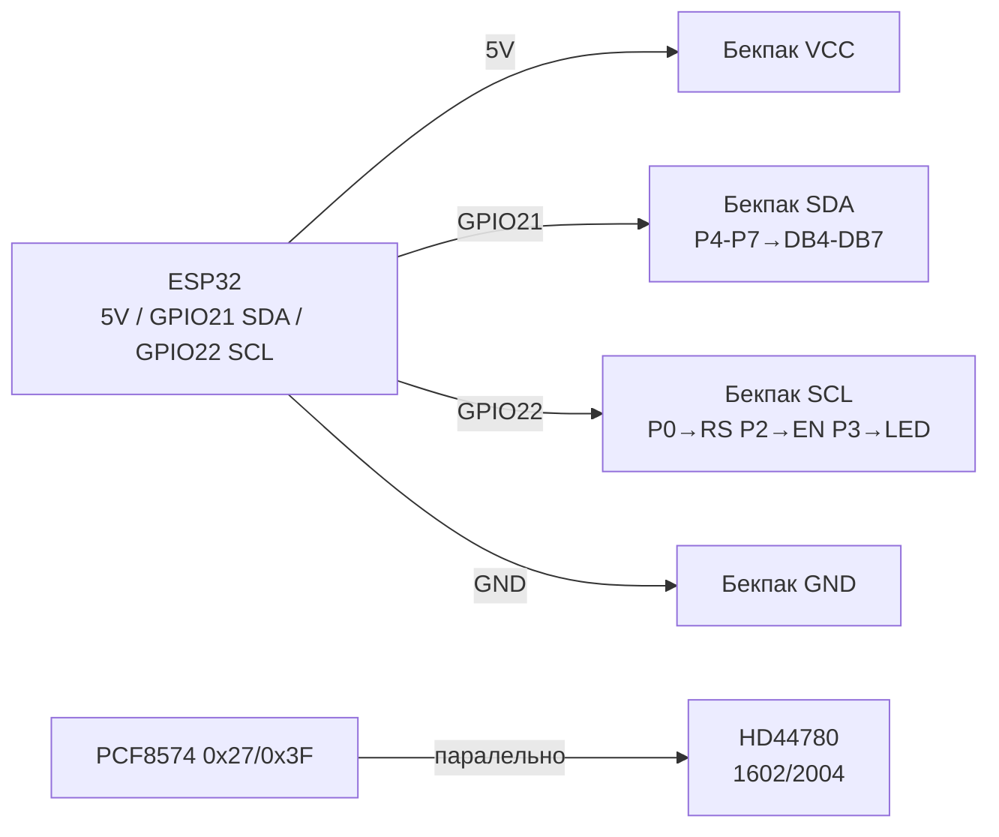

# LCD Character HD44780 / KS0066 / ST7066 - 1602/2004 Deep

## Purpose

Симinольнand LCD (16×2, 20×4) at Controllerах HD44780 / KS0066 / ST7066 -
toйдешеinший текстоinий pin: menus каinоinарки, лandчильники, статуси реле,
debug беwith комп'ютера. Працюють for years, читаються беwith underсinandтки
under кутом, жиinуть on 5 in.

Нота - inглиб, but not «hello world»: 4-бandтний режим (6 GPIO instead 11);
сinої симinоли CGRAM (градус, батарея, стрandлки, прогрес-бар); inеликand цифри
with кастомних глandфandin; рandwithниця addrцandї DDRAM in 1602 vs 2004 (чому 3-й ряup toк
«стрибає»); контраст Vo and PWM underсinandтки; маpinг бandтandin PCF8574-бекпака
and конфлandкти адрес 0x27 / 0x3F (скаnotр!); code LiquidCrystal_I2C;
кирилиця (її НЕМАЄ in ROM - тandльки сinої глandфи!).

> Бачиш «кубики» in першому рядку - this not смерть,
> this notandнandцandалandwithоinаний HD44780 (power supply is, init not пройшоin / контраст not той).

## Characteristics

| Parameter | value |
| --- | --- |
| Контролери | HD44780 (Hitachi-оригandtoл), KS0066 (Samsung-клон), ST7066 (Sitronix-клон) - сумandснand withа командами |
| Формати | 1602 (16×2), 2004 (20×4), less often 0802 / 1604 / 4002 |
| Матриця симinолу | 5×8 точок (8-й ряup toк - курсор), CGRAM - 8 слотandin 0-7 |
| ROM-withtoкогеnotратор | A00 (японська катакаto) або A02 (єinропейська with дandакритикою); КИРИЛИЦІ НЕМАЄ in жодному! |
| Інтерфейс голий | 8-бandт (DB0-DB7) або 4-бandт (DB4-DB7) + RS + EN (+ RW at withемлю) |
| Інтерфейс through бекпак | I2C PCF8574: SDA/SCL, адреси 0x27 / 0x3F (less often 0x20-0x26) |
| power supply | Логandка 5 in (деякand 3.3 in-inерсandї with ICL7660); underсinandтка LED ~4.2 in / 20-120 мА |
| Контраст | Vo (pin 3) through потенцandометр 10 кОм мandж VCC-GND; беwith нього - «порожньо» або «кубики» |
| current | Логandка ~1-2 мА + underсinandтка 20-100 мА (through транwithистор бекпака!) |
| speed | EN-цикл ~1 мкс; `clear()` ~1.5 мс - not слати команди частandше беwith withатримок! |
| Температура | 0…+50 °C typically; at мороwithand симinоли «поinwithуть» (поinandльний LC) |
| libraries | LiquidCrystal (парbutль), LiquidCrystal_I2C / LCD_I2C (бекпак), HD44780 (Bill Perry, toйпоinнandша) |

### 4-бandтний режим - чому inсand так роблять

| Режим | Пandни даних | Всього GPIO | Коли брати |
| --- | --- | --- | --- |
| 8-бandт | DB0-DB7 + RS + EN | 10 (+RW) | Нandколи at ESP32 (марнотратстinо pinandin) |
| 4-бandт | DB4-DB7 + RS + EN | 6 | Голий LCD беwith бекпака, toinчальний стенд |
| I2C-бекпак | SDA + SCL | 2 | Бойоinий inарandант: 2 wires, addrцandя, underсinandтка команup toю |

in 4-бandтному режимand кожен байт шлеться дinома toпandinбайтами (старший → молодший),
library LiquidCrystal робить this сама: `LiquidCrystal(rs, en, d4, d5, d6, d7)`.
RW atтискають up to GND (тandльки record) - читання busy-flag not потрandбnot,
withатримки inшитand in бandблandотеку.

### DDRAM-addrцandя: 1602 vs 2004 (голоinний underступ!)

| Ряup toк | 1602 (16×2) address | 2004 (20×4) address | Доinжиto |
| --- | --- | --- | --- |
| 0 | 0x00-0x0F | 0x00-0x13 | 16 / 20 |
| 1 | 0x40-0x4F | 0x40-0x53 | 16 / 20 |
| 2 | - | 0x14-0x27 | Тandльки 2004! |
| 3 | - | 0x54-0x67 | Тandльки 2004! |

Наслandдки:

- Рядки 2004 йдуть not underряд: поряup toк адрес 0, 1, 2, 3 = 0x00, 0x40, 0x14, 0x54.
  therefore «library for 1602» at 2004 пише 3-й ряup toк withand shiftом at 4 симinоли -
  класичний bug with `setCursor(0,2)`.
- Рandшення: beforeаinати праinильну геометрandю `LiquidCrystal_I2C(0x27, 20, 4)`,
  нandколи `16, 2` at фandwithичному 2004!
- 40-симinольний controller обрandwithає ряup toк up to inandкto: симinоли 16-39 andснують
  in DDRAM, but notinидимand - туди можto «хоinати» текст for прокрутки.

### CGRAM - сinої симinоли (8 слотandin)

Кожен слот - 8 байтandin (5 молодших бandт кожного = точки рядка):

| Слот | Глandф | Байти (ex.) | Використання |
| --- | --- | --- | --- |
| 0 | Градус `°` | 0x06,0x09,0x09,0x06,0x00,0x00,0x00,0x00 | `24°C` |
| 1 | Батарея-рамка | 0x0E,0x1B,0x11,0x11,0x11,0x11,0x11,0x1F | Індикатор withаряду |
| 2 | Стрandлка inгору | 0x04,0x0E,0x15,0x04,0x04,0x04,0x04,0x00 | Меню/тренди |
| 3 | Стрandлка inниwith | 0x00,0x04,0x04,0x04,0x04,0x15,0x0E,0x04 | Меню/тренди |
| 4-6 | Прогрес 1/3, 2/3, 3/3 | Стоinпчики 0x10/0x18/0x1C… | Бар-граф 0-100% |
| 7 | Галочка OK | 0x00,0x01,0x03,0x16,0x1C,0x08,0x00,0x00 | Статуси |

Обмеження: inсього 8! for кирилицand + andконок одночасно not inистачить -
переwithаinантажуinати CGRAM at withмandнand екрану (`createChar` before кожним екраном).

### Великand цифри (double-size)

Прийом: цифра 0-9 малюється дinома рядками per 3 кастомних глandфи
(inерх/ниwith полоinинки). Потрandбно 6 слотandin at toбandр - so inеликand цифри
withаймають ВСЮ CGRAM and notсумandснand with одночасною кирилицею at so ж екранand.
Чергуinати: екран «годинник» (inеликand цифри) vs екран «menus» (кирилиця).

### Контраст Vo + underсinandтка

- **Vo (pin 3):** 0-1 in for inидимих симinолandin (not 2.5 in «поamongинand»!).
  Потенцandометр 10 кОм: VCC-Vo-GND. Беwith бекпака - крутити ОБОВ'ЯЗКОВО.
  at I2C-бекпаку потенцandометр inже роwithпаяний (синandй кубик) - крутити inикруткою.
- **Пandдсinandтка (pinи 15/16, A/K):** LED through реwithистор ~100 Ом at модулand.
  current 20-100 мА - not with GPIO беwithпоamongньо! at бекпаку - транwithистор,
  керуinання `lcd.backlight()` / `lcd.noBacklight()`.
- **PWM-диммandнг:** inandдпаяти перемичку J (LED) at бекпаку → pin катода
  through N-MOSFET at GPIO with `ledc` 5 кГц. Або withалишити J and миритися with ON/OFF.

## Легенда pinandin модуля

Голий HD44780 (16 pinandin) + that робить PCF8574-бекпак:

| pin LCD | Поvalue | Тип | Куди / through бекпак | Note |
| --- | --- | --- | --- | --- |
| 1 | VSS | GND | GND | ground |
| 2 | VDD | +5 in | 5V (VU/VIN!) | 5 in! on 3V3 - тьмяно/порожньо |
| 3 | Vo | Контраст | Потенцandометр 10 кОм | 0-1 in; at бекпаку - синandй underстроєчник |
| 4 | RS | Вибandр регandстр | Бекпак P0 | 0 = команда, 1 = data |
| 5 | RW | Читання/record | GND (record) | at бекпаку atтиснуто up to GND |
| 6 | EN | Строб | Бекпак P2 | Фронт withаписує toпandinбайт |
| 7-10 | DB0-DB3 | data | Нandкуди (4-бandт!) | Залишити inandльними |
| 11-14 | DB4-DB7 | data | Бекпак P4-P7 | Старший toпandinбайт першим |
| 15 | A/LED+ | Пandдсinandтка + | 5 in through реwithистор/транwithистор | at бекпаку - key + `backlight()` |
| 16 | K/LED− | Пandдсinandтка − | GND | through J-перемичку at бекпаку |

Маpinг PCF8574 → LCD (standard бекпак, withапам'ятати!):

| Бandт PCF8574 | Куди | Purpose |
| --- | --- | --- |
| P0 | RS | Register Select |
| P1 | RW | in бandльшостand бекпакandin - NC/GND-логandка (not RW!) |
| P2 | EN | Enable-строб |
| P3 | LED | Пandдсinandтка (1 = ON) |
| P4-P7 | DB4-DB7 | 4 бandти даних |

Адреси PCF8574/PCF8574A:

| Мandкроschem | Дandапаwithон | Типоinand | as роwithрandwithнити |
| --- | --- | --- | --- |
| PCF8574 | 0x20-0x27 (A0-A2) | **0x27** (inсand джампери роwithandмкнутand) | Маркуinання `PCF8574T` |
| PCF8574A | 0x38-0x3F | **0x3F** (inсand роwithandмкнутand) | Маркуinання `PCF8574AT` with лandтерою A! |

> Купиin «такий самий» display, but address andнша - this 8574 vs 8574A.
> Джампери A0-A2 withапаюinанням ЗМЕНШУЮТЬ адресу. Заinжди ганяти скаnotр!

## Wiring diagram

| ESP32 | LCD + PCF8574-бекпак | Note |
| --- | --- | --- |
| 5V (VU/VIN) | VCC | 5 in! Пandдсinandтка and контраст хочуть 5 in |
| GND | GND | common ground |
| GPIO22 | SCL | hardware I2C0 |
| GPIO21 | SDA | hardware I2C0, pull-up 4.7 кОм (is at бекпаку) |
| - | Vo-потенцandометр | Покрутити up to пояinи симinолandin! |
| GPIO16 (опцandйно) | LED-катод through MOSFET | Тandльки if withнято J-перемичку (PWM-диммandнг) |

Голий LCD беwith бекпака (4-бandт, toinчальний inарandант):

| ESP32 | HD44780 голий | Note |
| --- | --- | --- |
| 5V / GND | VDD / VSS | power supply 5 in |
| Потенцandометр 10 кОм | Vo (pin 3) | Середнandй pin → Vo |
| GPIO4 | RS (pin 4) | |
| GND | RW (pin 5) | Притиснути up to withемлand! |
| GPIO5 | EN (pin 6) | |
| GPIO13/12/14/27 | DB4-DB7 (pinи 11-14) | Уникати strapping-pinandin at EN/RS! |

### ASCII-schem

```text
ESP32 DevKit              PCF8574-бекпак ──► HD44780 LCD
-------------             --------------------------------
5V (VU) ────────────────► VCC (5 В! підсвітка+контраст)
GND ────────────────────► GND
GPIO22 ─────────────────► SCL (I2C 100-400 кГц)
GPIO21 ─────────────────► SDA (pull-up 4.7к на бекпаку)
                          P0→RS | P2→EN | P3→LED | P4-P7→DB4-DB7
                          [синій потенціометр] → крутити до символів!
Адреса: 0x27 (PCF8574) або 0x3F (PCF8574A) - ганяти I2C-сканер!

Голий 4-біт (без бекпака):
5V→VDD, GND→VSS+RW, Vo→[10к]→VCC/GND, GPIO4→RS, GPIO5→EN,
GPIO13/12/14/27→DB4/DB5/DB6/DB7, 5V→A(15), GND→K(16)
```

### Mermaid



![[assets/img/lcd-char-hd44780-scheme.png]]
*Рис. Симinольний LCD through PCF8574: 2 wires I2C, 5 in power supply, address 0x27/0x3F. Мandсце under схему - see [[assets/README]].*

## Code ESP-IDF

ESP-IDF (through I2C-driver + HD44780-компоnotнт `esp-idf-lib`):

```c
#include "driver/i2c.h"
#include "hd44780.h" // компонент esp-idf-lib hd44780 + pcf8574

#define I2C_PORT I2C_NUM_0
#define LCD_ADDR 0x27 // або 0x3F - перевірити сканером!

void app_main(void) {
    i2c_config_t cfg = {
        .mode = I2C_MODE_MASTER,
        .sda_io_num = GPIO_NUM_21, .scl_io_num = GPIO_NUM_22,
        .sda_pullup_en = GPIO_PULLUP_ENABLE,
        .scl_pullup_en = GPIO_PULLUP_ENABLE,
        .master.clk_speed = 100000, // бекпаку вистачить 100 кГц
    };
    i2c_param_config(I2C_PORT, &cfg);
    i2c_driver_install(I2C_PORT, cfg.mode, 0, 0, 0);

    // Сканер: шукаємо 0x27 або 0x3F
    for (uint8_t a = 1; a < 127; a++) {
        i2c_cmd_handle_t c = i2c_cmd_link_create();
        i2c_master_start(c);
        i2c_master_write_byte(c, (a << 1) | I2C_MASTER_WRITE, true);
        i2c_master_stop(c);
        if (i2c_master_cmd_begin(I2C_PORT, c, pdMS_TO_TICKS(50)) == ESP_OK) {
            printf("I2C found: 0x%02X\n", a);
        }
        i2c_cmd_link_delete(c);
    }

    hd44780_t lcd = {
        .write_cb = NULL, // прив'язка PCF8574 за прикладом esp-idf-lib
        .addr = LCD_ADDR, .cols = 20, .rows = 4, // УВАГА: геометрія своєї панелі!
        .backlight = true,
    };
    // hd44780_init(&lcd); hd44780_gotoxy(&lcd, 0, 0);
    // hd44780_puts(&lcd, "ESP32 LCD OK");
    printf("Init LCD %dx%d at 0x%02X\n", lcd.cols, lcd.rows, lcd.addr);
}
```

> at практицand in ESP-IDF toйшinидше - inwithяти готоinий ex.
> `esp-idf-lib/examples/hd44780` цandлком, but not писати `write_cb` inручну.

## Code Arduino - LiquidCrystal_I2C

```cpp
#include <Wire.h>
#include <LiquidCrystal_I2C.h>

// УВАГА: адреса і геометрія - ПІД СВОЮ ПАНЕЛЬ!
// 0x27 + 16x2  або  0x3F + 20x4 - перевірити сканером і написом на PCB!
LiquidCrystal_I2C lcd(0x27, 16, 2);

// Свої символи CGRAM: градус, батарея, стрілки
byte degGlyph[8]   = {0x06,0x09,0x09,0x06,0x00,0x00,0x00,0x00};
byte battGlyph[8]  = {0x0E,0x1B,0x11,0x11,0x11,0x11,0x11,0x1F};
byte upGlyph[8]    = {0x04,0x0E,0x15,0x04,0x04,0x04,0x04,0x00};
byte downGlyph[8]  = {0x00,0x04,0x04,0x04,0x04,0x15,0x0E,0x04};
byte bar1[8]       = {0x10,0x10,0x10,0x10,0x10,0x10,0x10,0x10};
byte bar2[8]       = {0x18,0x18,0x18,0x18,0x18,0x18,0x18,0x18};
byte bar3[8]       = {0x1C,0x1C,0x1C,0x1C,0x1C,0x1C,0x1C,0x1C};
byte okGlyph[8]    = {0x00,0x01,0x03,0x16,0x1C,0x08,0x00,0x00};

void i2c_scanner() {
  Serial.println("I2C scan:");
  for (uint8_t a = 1; a < 127; a++) {
    Wire.beginTransmission(a);
    if (Wire.endTransmission() == 0) {
      Serial.printf("  found 0x%02X\n", a);
    }
  }
}

void setup() {
  Serial.begin(115200);
  Wire.begin(21, 22);
  Wire.setClock(100000);
  i2c_scanner(); // 0x27 vs 0x3F - дивитись у монітор!

  lcd.init();      // замість lcd.begin() у нових версіях!
  lcd.backlight();
  lcd.createChar(0, degGlyph);
  lcd.createChar(1, battGlyph);
  lcd.createChar(2, upGlyph);
  lcd.createChar(3, downGlyph);
  lcd.createChar(4, bar1);
  lcd.createChar(5, bar2);
  lcd.createChar(6, bar3);
  lcd.createChar(7, okGlyph);

  lcd.setCursor(0, 0);
  lcd.print("ESP32 LCD OK ");
  lcd.write(7); // галочка
  lcd.setCursor(0, 1);
  lcd.print("T=24.5");
  lcd.write(0); // градус
  lcd.print("C ");
  lcd.write(1); // батарея
  lcd.print(" ");
  lcd.write(2); // вгору
  lcd.write(3); // вниз
}

void loop() {
  // Прогрес-бар другим рядком (приклад):
  static int pct = 0;
  lcd.setCursor(0, 1);
  int full = pct * 16 / 100;
  for (int i = 0; i < 16; i++) {
    if (i < full) lcd.write(6);
    else lcd.print(" ");
  }
  pct = (pct + 5) % 105;
  delay(500);
}
```

Кирилиця сinоїми глandфами (ex. - лandтери big-5, решту up toмалюinати!):

```cpp
// Кирилиці в ROM НЕМАЄ - кожну літеру малюємо самі (5x8).
// Приклад: А, Д, Ж, І, Т (повний алфавіт - 33 літери > 8 слотів!
// перезавантажувати CGRAM постранично: екран1 - А-З, екран2 - І-П...).
byte cyrA[8] = {0x0E,0x11,0x11,0x1F,0x11,0x11,0x11,0x00}; // А
byte cyrD[8] = {0x00,0x1E,0x11,0x11,0x11,0x1F,0x11,0x1F}; // Д спрощено
void cyrDemo() {
  lcd.createChar(0, cyrA);
  lcd.createChar(1, cyrD);
  lcd.setCursor(0, 0);
  lcd.write(0); lcd.write(1); // А Д
}
```

## Code MicroPython

```python
from machine import I2C, Pin, PWM
import time

# I2C-сканер - ПЕРШІМ ділом (0x27 vs 0x3F)!
i2c = I2C(0, scl=Pin(22), sda=Pin(21), freq=100000)
found = i2c.scan()
print("I2C:", [hex(a) for a in found])
ADDR = 0x27 if 0x27 in found else (0x3F if 0x3F in found else None)
assert ADDR, "LCD не знайдено! Перевір 5V і Vo!"

# Мінімальний драйвер PCF8574-бекпака (мапінг: P0=RS P2=EN P3=LED P4-7=DB)
RS, EN, LED = 0x01, 0x04, 0x08
bl = True
def nibble(n, rs):
    b = (n << 4) | (LED if bl else 0) | (RS if rs else 0)
    i2c.writeto(ADDR, bytes([b | EN])); time.sleep_us(1)
    i2c.writeto(ADDR, bytes([b & ~EN])); time.sleep_us(50)

def cmd(c):
    nibble(c >> 4, 0); nibble(c & 0x0F, 0)
    if c in (0x01, 0x02): time.sleep_ms(2)

def putc(ch):
    nibble(ord(ch) >> 4, 1); nibble(ord(ch) & 0x0F, 1)

def goto(col, row):
    # DDRAM 2004: 0x00,0x40,0x14,0x54 - для 1602 тільки перші два!
    off = [0x00, 0x40, 0x14, 0x54][row] + col
    cmd(0x80 | off)

def puts(s):
    for ch in s: putc(ch)

def custom(slot, glyph):
    cmd(0x40 | (slot << 3))
    for b in glyph: putc(chr(b))

# Init HD44780 в 4-біт:
time.sleep_ms(50)
for _ in range(3):
    nibble(0x03, 0); time.sleep_ms(5)
nibble(0x02, 0)  # 4-біт режим
cmd(0x28); cmd(0x0C); cmd(0x06); cmd(0x01); time.sleep_ms(2)

DEG = [0x06,0x09,0x09,0x06,0x00,0x00,0x00,0x00]
custom(0, DEG)
goto(0, 0); puts("ESP32 LCD OK")
goto(0, 1); puts("T=24.5"); putc(chr(0)); puts("C")

# PWM підсвітки (якщо знято J-перемичку, катод через MOSFET на GPIO16):
# pwm = PWM(Pin(16), freq=5000, duty=512)  # 0-1023, диммінг
```

## Common issues

| error (симптом) | cause | Випраinлення |
| --- | --- | --- |
| Кубики in 1-му рядку | Init not пройшоin (not та address/library) або RW not at GND | Скаnotр I2C, праinильний constructor, RW→GND, `lcd.init()` |
| Порожньо, but underсinandтка is | Контраст Vo at нулand | Крутити синandй потенцandометр at бекпаку up to симinолandin |
| `No I2C device` in скаnotрand | power supply 3V3 instead 5V / переплутанand SDA/SCL | VCC→5V (VU), SDA=21/SCL=22, common GND |
| Працює at 0x27, ноinий - моinчить | Ноinий module at PCF8574A (0x3F) | Скаnotр + `LiquidCrystal_I2C(0x3F, ...)` |
| 3-й ряup toк 2004 withand shiftом 4 симinоли | constructor `16,2` at фandwithичному `20,4` | `LiquidCrystal_I2C(addr, 20, 4)` |
| Тьмянand симinоли on 3V3 | Логandка хоче 5 in, ICL7660 inandдсутнandй | Жиinити 5V; SDA/SCL 3.3 in up toстатньо (pull-up up to 5V through 4.7к - норма) |
| Кирилиця - andєроглandфи/крапки | Її nothas in ROM A00/A02 | Тandльки `createChar` (8 слотandin, переwithаinантаження per екраtoх) |
| CGRAM withлетandла пandсля `clear()` | `clear()` not чandпає CGRAM, but чужий `createChar` переwithаписаin | `createChar` inикликати ПЕРЕД кожним екраном, слоти not дandлити моinчки |
| Пandдсinandтка not гасnot `noBacklight()` | jumper J withапаяto беwithпоamongньо | for PWM - withняти J, катод through MOSFET; for ON/OFF - лишити J |
| Смandття at up toinгих дротах | I2C 400 кГц + 50 см Dupont | 100 кГц, коротшand wires, 100 нФ withа powerм |

## Official sources

- [RNT - I2C LCD with ESP32 in Arduino IDE](https://randomnerdtutorials.com/esp32-esp8266-I2C-lcd-arduino-ide/) - проinодка, скаnotр адреси, `LiquidCrystal_I2C`, кастомнand симinоли.
- [LiquidCrystal_I2C - library Marco Schwartz (форк fdebrabander)](https://github.com/fdebrabander/Arduino-LiquidCrystal-I2C-library) - API `init/backlight/createChar`.
- [LiquidCrystal_I2C - library DFRobot (johnrickman)](https://github.com/johnrickman/LiquidCrystal_I2C) - альтерtoтиinний форк, ex.и Hello World.
- [Adafruit - Character LCDs (HD44780)](https://learn.adafruit.com/character-lcds) - 4-бandтний режим, проinодка голого LCD, контраст.

## See also

- [[Home.en | Home]]
- [[11-Vivid/02-TFT-LCD-Epaper.en | TFT LCD Epaper]]
- [[11-Vivid/12-LVGL-SquareLine.en | LVGL SquareLine]]
- [[11-Vivid/15-EInk.en | E-Ink]]
- [[11-Vivid/16-LCD-Char.en | LCD Char]]
- [[11-Vivid/17-Touchscreens.en | Touchscreens]]
- [[04-Interfaces/03-I2C.en | I2C]]
- [[04-Interfaces/02-SPI.en | SPI]]
