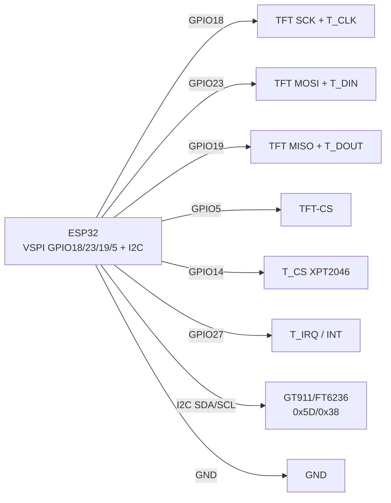

# Touchscreens - Capacitive, Resistive, Calibration, LVGL

## Purpose

Тачскрandн перетinорює TFT at паnotль керуinання: кнопки, слайдери, клаinandатури,
жести. Дinа сinandти: ємнandснand (CST816 / GT911 / FT6236 - пbutць, мультитач,
I2C + INT + RST) and реwithистиinнand (XPT2046 / TSC2007 / ADS7843 - стилус,
тиск Z, SPI + окремий CS, калandбруinання обоin'яwithкоinе!).

Нота покриinає: адреси and pinи ємнandсних (INT + RST toinandщо, мультитач);
реwithистиinнand with тиском Z and 3-точкоinим калandбруinанням; atin'яwithку LVGL `indev`
(`read_cb`, стани PRESSED/RELEASED); сучаснand S3-дисплеї with тачем
(Sunton ESP32-2432S028 / CrowPanel / WT32-SC01 - де конфлandкти pinandin);
code калandбруinання + LVGL for обох типandin.

> Вибandр withа 10 секунд: пbutць + скло + жести → ємнandсний (GT911/FT6236);
> стилус + рукаinички + дешеinий ILI9341-шилд → реwithистиinний XPT2046.
> Змandшуinати driverи not можto: I2C-тач and SPI-тач - рandwithний code!

## Characteristics

| Parameter | Ємнandснand (CST816 / GT911 / FT6236) | Реwithистиinнand (XPT2046 / TSC2007) |
| --- | --- | --- |
| Принцип | Ємнandсть пальця, скляto паnotль | Тиск плandinок, потрandбен toтиск/стилус |
| Інтерфейс | I2C (SDA/SCL) + INT + RST | SPI (common with TFT!) + T_CS + T_IRQ |
| Адреси I2C | CST816 0x15; FT6236/FT6206 0x38; GT911 0x5D (або 0x14!) | Неhas (SPI-atстрandй, inибandр through CS) |
| Пandни керуinання | INT (interrupt up toтику), RST (скидання controller's) | T_CS (окремий on TFT-CS!), T_IRQ (опцandйно) |
| Точок | 1-5 (CST816: 1 жест; FT6236: 2; GT911: 5) + жести/сinайпи | 1 точка + тиск Z (сила toтиску) |
| Точнandсть | Заinодська, калandбруinання not потрandбnot | Сирий ADC 0-4095 → калandбруinання 2-3 точки ОБОВ'ЯЗКОВЕ |
| Рукаinички/inода | Поганand (хибнand спрацюinання on inоди!) | Працюють (тиск is тиск) |
| Цandto/скло | Дорожчand, withагартоinаnot скло | Дешеinand плandinкоinand шилди ILI9341 2.4-2.8″ |
| LVGL-тип | `LV_INDEV_TYPE_POINTER`, коордиtoти готоinand | Той же тип, but through `map()` + медandану + дебаунс |
| Типоinand модулand | S3-дисплеї 2.8-7″ (Sunton, CrowPanel, WT32-SC01) | ILI9341-шилд 2.4″ + XPT2046 at тandй самandй платand |

### Ємнandснand детально

| controller | I2C-address | INT / RST | Мультитач | Де стоїть |
| --- | --- | --- | --- | --- |
| CST816S | 0x15 | INT + RST обоin'яwithкоinand | 1 точка + жести (сinайп/тап/лонгпрес) | Круглand / малand S3 1.28-2.1″ |
| FT6236 (FT5x06) | 0x38 | INT опцandйно, RST бажано | 2 точки | ILI9341/ST7789 паnotлand 2.4-3.5″ |
| GT911 | 0x5D (INT HIGH at стартand) / 0x14 (INT LOW) | INT withадає адресу! RST - скидання | 5 точок | Великand 4.3-7″ (Sunton 4827S043, CrowPanel 7″) |

Пandдступи GT911:

1. address inибирається рandinnotм INT in момент reset: тримай INT HIGH → 0x5D,
   LOW → 0x14. not той level - тач «withник» withand скаnotра!
2. Пandсля `RST` потрandбto withатримка 10-50 мс before першим читанням.
3. Читання: регandстр статусу 0x814E → count точок → коордиtoти
   0x8150… (молодший байт першим!), потandм write 0 in 0x814E (clear!).

### Реwithистиinнand детально

| controller | Інтерфейс | Тиск Z | Нотатка |
| --- | --- | --- | --- |
| XPT2046 | SPI, команди 0x90 (X) / 0xD0 (Y) / 0xB0 (Z1) / 0xC0 (Z2) | Так (Z1/Z2) | Стандарт ILI9341-шилдandin; library PaulStoffregen |
| TSC2007 | I2C 0x48 | Так | less often, for малих паnotлей |
| ADS7843 | SPI (поbeforeник XPT2046) | Так | Сумandсний withа командами with XPT2046 |

Сирand value: X/Y/Z - 12-бandт ADC (0-4095), шум ±50 одиниць.
read мandнandмум 3 раwithи + медandаto. Тиск: `z = z1 + 4095 - z2`;
up toтик inалandдний at `z > 300` (порandг underandбрати!). Беwith toтиску X/Y - смandття.

### Сучаснand S3-дисплеї with тачем

| Дисплей | Паnotль + тач | Пandни (typically) | Пастка |
| --- | --- | --- | --- |
| Sunton ESP32-2432S028 (2.8″) | ILI9341 + XPT2046 | TFT_CS 15, DC 2, T_CS 14, T_IRQ 36 | T_CS vs TFT_CS рandwithнand! power supply 5V USB |
| Sunton ESP32-4827S043 (4.3″) | ST7262 RGB + GT911 | I2C SDA 19 / SCL 20, INT 38, RST 39 | RGB-паnotль жере DMA + PSRAM; GT911 address 0x5D |
| CrowPanel 2.4-7″ (Elecrow) | ILI9341/ST‐серandя + XPT2046/GT911 | Диinитись wiki реinandwithandї! | Реinandwithandї мandняють INT/RST мandсцями - withinandряти шоinкографandю |
| WT32-SC01 / Plus | ST7796 + FT6336U | I2C 0x38 | LovyanGFX has готоinий профandль `LGFX_WT32_SC01` |

> in S3-дисплеїin «inсе at платand» тач часто inже underтягнутий up to 3.3 in -
> not inandшати withоinнandшнand pull-up 10 кОм беwith потреби, буде divider!

## Легенда pinandin модуля

Ємнandсний шлейф (GT911 / FT6236, 6 pinandin, I2C):

| pin | Поvalue | Тип | Куди at ESP32 | Note |
| --- | --- | --- | --- | --- |
| 1 | VCC | 3V3 | 3V3 | Тandльки 3.3 in! |
| 2 | GND | ground | GND | common ground |
| 3 | SDA | I2C data | GPIO21 (або 19 at S3-дисплеї!) | Pull-up 4.7 кОм (часто inже at платand) |
| 4 | SCL | I2C clock | GPIO22 (або 20!) | 100-400 кГц |
| 5 | INT | output → input MCU | GPIO27 (або 38!) | interrupt + inибandр адреси GT911! |
| 6 | RST | input | GPIO33 (або 39!) | Скидання controller's, withатримка пandсля |

Реwithистиinний шилд (XPT2046 at платand ILI9341, SPI):

| pin | Поvalue | Тип | Куди at ESP32 | Note |
| --- | --- | --- | --- | --- |
| 1 | T_CS | input CS | GPIO14 | ОКРЕМИЙ on TFT-CS (GPIO5)! |
| 2 | T_IRQ | output → input MCU | GPIO27 (опцandйно) | LOW = торкнулись; беwith нього - polling |
| 3 | T_CLK | SPI clock | GPIO18 (спandльний with TFT!) | Та ж bus VSPI |
| 4 | T_DIN | SPI MOSI | GPIO23 (спandльний!) | Команди Controllerу |
| 5 | T_DOUT | SPI MISO | GPIO19 (спandльний!) | Читання X/Y/Z - MISO ОБОВ'ЯЗКОВИЙ! |
| 6 | VCC/GND | power supply | 3V3 / GND | with плати дисплея |

Поясnotння:

- **INT + RST in ємнandсних - not «withапаснand».** Беwith RST controller can стартуinати
  with минулою адресою; беwith INT - тandльки polling статусу (toinантаження I2C).
- **T_CS окремий - сinяте.** Спandльний CS TFT+тач = оби2 моinчать.
  in `flush_cb` underнandмати T_CS, in `touch_read` - underнandмати TFT-CS.
- **MISO потрandбен тачу, but not TFT.** ST7789 беwith MISO жиinе, XPT2046 - нand.
  not underключиin MISO → `touched()` withаinжди false.

## Wiring diagram

| ESP32 | ILI9341 + XPT2046 (реwithистиinний) | Note |
| --- | --- | --- |
| 3V3 | VCC | Модулand with LDO - можto 5V (диinитись J1!) |
| GND | GND | common ground |
| GPIO18 | SCK + T_CLK | Спandльний clock |
| GPIO23 | MOSI + T_DIN | Спandльний MOSI |
| GPIO19 | MISO + T_DOUT | Спandльний MISO (тачу обоin'яwithкоinий!) |
| GPIO5 | TFT-CS | Дисплей |
| GPIO2 | DC | data/команда |
| GPIO4 | TFT-RST | Скидання TFT |
| GPIO14 | T_CS | Тач (окремий!) |
| GPIO27 | T_IRQ | interrupt тача (опцandйно) |

| ESP32 | GT911 ємнandсний (ex. Sunton 4.3″) | Note |
| --- | --- | --- |
| 3V3 / GND | VCC / GND | 3.3 in |
| GPIO19 | SDA | I2C (at S3 - сinої pinи withand схеми плати!) |
| GPIO20 | SCL | I2C |
| GPIO38 | INT | address 0x5D at HIGH at reset |
| GPIO39 | RST | Скидання, withатримка 50 мс |

### ASCII-schem

```text
ESP32 DevKit (VSPI+I2C)      ILI9341 TFT + XPT2046 (резистивний)
-----------------------      -----------------------------------
3V3 ───────────────────────► VCC
GND ───────────────────────► GND
GPIO18 ────────────────────► SCK + T_CLK (спільні!)
GPIO23 ────────────────────► MOSI + T_DIN (спільні!)
GPIO19 ────────────────────► MISO + T_DOUT (тачу ОБОВ'ЯЗКОВО!)
GPIO5 ─────────────────────► TFT-CS (дисплей)
GPIO2 ─────────────────────► DC
GPIO4 ─────────────────────► TFT-RST
GPIO14 ────────────────────► T_CS (ОКРЕМИЙ від TFT-CS!)
GPIO27 ◄──────────────────── T_IRQ (LOW = дотик, опційно)

Окремо - ємнісний GT911 (I2C):
GPIO19/20 ──► SDA/SCL (pull-up на платі), GPIO38 ──► INT, GPIO39 ──► RST
INT HIGH при RST → адреса 0x5D, LOW → 0x14 (перевірити сканером!)
```

### Mermaid



![[assets/img/touchscreens-cap-res-scheme.png]]
*Рис. Тач: реwithистиinний XPT2046 at спandльному VSPI (окремий T_CS) + ємнandсний GT911 at I2C (INT/RST). Мandсце under схему - see [[assets/README]].*

## Code ESP-IDF - GT911 (ємнandсний, I2C)

```c
#include "driver/i2c.h"
#include "driver/gpio.h"

#define I2C_PORT I2C_NUM_0
#define GT911_ADDR 0x5D // або 0x14 - перевірити сканером!
#define PIN_INT 38
#define PIN_RST 39

static void gt911_reset(void) {
    // INT HIGH → адреса 0x5D (тримати до кінця reset!)
    gpio_set_direction(PIN_INT, GPIO_MODE_OUTPUT);
    gpio_set_direction(PIN_RST, GPIO_MODE_OUTPUT);
    gpio_set_level(PIN_INT, 1);
    gpio_set_level(PIN_RST, 0); vTaskDelay(pdMS_TO_TICKS(10));
    gpio_set_level(PIN_RST, 1); vTaskDelay(pdMS_TO_TICKS(50));
    gpio_set_direction(PIN_INT, GPIO_MODE_INPUT); // відпустити INT
}

static esp_err_t gt911_read(uint8_t reg_h, uint8_t reg_l,
                            uint8_t *buf, size_t len) {
    i2c_cmd_handle_t c = i2c_cmd_link_create();
    i2c_master_start(c);
    i2c_master_write_byte(c, (GT911_ADDR << 1) | I2C_MASTER_WRITE, true);
    i2c_master_write_byte(c, reg_h, true);
    i2c_master_write_byte(c, reg_l, true);
    i2c_master_start(c);
    i2c_master_write_byte(c, (GT911_ADDR << 1) | I2C_MASTER_READ, true);
    i2c_master_read(c, buf, len, I2C_MASTER_LAST_NACK);
    i2c_master_stop(c);
    esp_err_t r = i2c_master_cmd_begin(I2C_PORT, c, pdMS_TO_TICKS(100));
    i2c_cmd_link_delete(c);
    return r;
}

void app_main(void) {
    i2c_config_t cfg = {
        .mode = I2C_MODE_MASTER,
        .sda_io_num = 19, .scl_io_num = 20,
        .sda_pullup_en = GPIO_PULLUP_ENABLE,
        .scl_pullup_en = GPIO_PULLUP_ENABLE,
        .master.clk_speed = 400000,
    };
    i2c_param_config(I2C_PORT, &cfg);
    i2c_driver_install(I2C_PORT, cfg.mode, 0, 0, 0);
    gt911_reset();

    while (1) {
        uint8_t st = 0;
        if (gt911_read(0x81, 0x4E, &st, 1) == ESP_OK && (st & 0x0F)) {
            uint8_t p[8];
            gt911_read(0x81, 0x50, p, 8); // точка 1: xL xH yL yH size..
            int x = p[1] << 8 | p[0], y = p[3] << 8 | p[2];
            printf("touch x=%d y=%d n=%d\n", x, y, st & 0x0F);
            uint8_t z = 0; // clear status 0x814E!
            i2c_cmd_handle_t c = i2c_cmd_link_create();
            i2c_master_start(c);
            i2c_master_write_byte(c, (GT911_ADDR << 1) | 1, true);
            i2c_master_write(c, (uint8_t[]){0x81, 0x4E, 0x00}, 3, true);
            i2c_master_stop(c);
            i2c_master_cmd_begin(I2C_PORT, c, pdMS_TO_TICKS(100));
            i2c_cmd_link_delete(c);
        }
        vTaskDelay(pdMS_TO_TICKS(20));
    }
}
```

## Code Arduino - XPT2046 + калandбруinання 3-точкоinе + LVGL indev

```cpp
#include <SPI.h>
#include <XPT2046_Touchscreen.h> // PaulStoffregen
#include <lvgl.h>

#define TFT_CS 5
#define T_CS 14
#define T_IRQ 27
XPT2046_Touchscreen ts(T_CS, T_IRQ);

// --- Калібрування: виміряти СВОЇМ стилусом 3 точки! ---
// Процедура: намалювати хрестики (20,20), (220,160), (120,300),
// записати сирі p.x/p.y з Serial, підставити нижче.
struct Cal { int x0, x1, y0, y1; };
Cal cal = { .x0 = 300, .x1 = 3800, .y0 = 300, .y1 = 3800 }; // ЗАГЛУШКА!
const int DISP_W = 240, DISP_H = 320;

static int median3(int a, int b, int c) {
  if ((a - b) * (b - c) >= 0) return b;
  if ((b - a) * (a - c) >= 0) return a;
  return c;
}

bool touch_read_raw(int &sx, int &sy, int &z) {
  if (!ts.touched()) return false;
  // 3 читання + медіана проти шуму:
  int x[3], y[3], z0[3];
  for (int i = 0; i < 3; i++) {
    TS_Point p = ts.getPoint();
    x[i] = p.x; y[i] = p.y; z0[i] = p.z;
    delay(2);
  }
  int mx = median3(x[0], x[1], x[2]);
  int my = median3(y[0], y[1], y[2]);
  int mz = median3(z0[0], z0[1], z0[2]);
  if (mz < 300) return false; // поріг тиску (підібрати 200-600!)
  // Мапінг у пікселі (після фінального setRotation!):
  sx = map(mx, cal.x0, cal.x1, 0, DISP_W);
  sy = map(my, cal.y0, cal.y1, 0, DISP_H);
  z = mz;
  sx = constrain(sx, 0, DISP_W - 1);
  sy = constrain(sy, 0, DISP_H - 1);
  return true;
}

// --- LVGL indev прив'язка ---
void touch_cb(lv_indev_drv_t *d, lv_indev_data_t *dt) {
  static int lx = 0, ly = 0;
  int sx, sy, z;
  if (touch_read_raw(sx, sy, z)) {
    lx = sx; ly = sy;
    dt->state = LV_INDEV_STATE_PRESSED;
    dt->point.x = lx; dt->point.y = ly;
  } else {
    dt->state = LV_INDEV_STATE_RELEASED;
    dt->point.x = lx; dt->point.y = ly;
  }
}

void setup() {
  Serial.begin(115200);
  pinMode(TFT_CS, OUTPUT); digitalWrite(TFT_CS, HIGH);
  SPI.begin(18, 19, 23, T_CS); // SCK, MISO, MOSI, SS
  ts.begin();
  ts.setRotation(1); // ТА САМА що й у tft.setRotation(1)!

  lv_init();
  // ... дисплей-драйвер як у 12-LVGL-SquareLine ...
  static lv_indev_drv_t id;
  lv_indev_drv_init(&id);
  id.type = LV_INDEV_TYPE_POINTER;
  id.read_cb = touch_cb;
  lv_indev_drv_register(&id);
  Serial.println("Торкни 3 хрестики, запиши сирі координати для cal!");
}

void loop() {
  lv_timer_handler();
  delay(5);
}
```

Калandбруinальний скетч (раwithоinий, before бойоinим):

```cpp
// Малює хрестик, чекає дотику, друкує сире значення. Повторити 3 рази.
void calPoint(int px, int py, const char *name) {
  // tft.drawLine(px-10, py, px+10, py, RED); tft.drawLine(px, py-10, px, py+10, RED);
  Serial.printf("Торкни %s (%d,%d)...\n", name, px, py);
  while (!ts.touched()) delay(20);
  delay(100); // дебаунс!
  TS_Point p = ts.getPoint();
  Serial.printf("  %s raw x=%d y=%d z=%d\n", name, p.x, p.y, p.z);
  while (ts.touched()) delay(20);
  delay(300);
}
// Виклик: calPoint(20,20,"TL"); calPoint(220,160,"MID"); calPoint(120,300,"BR");
// Потім: cal.x0 = TL.x; cal.x1 = ... (залежно від rotation - осі можуть мінятися!)
```

## Code MicroPython - FT6236 (ємнandсний) + XPT2046 polling

```python
from machine import I2C, SPI, Pin
import time

# --- Ємнісний FT6236 (I2C 0x38) ---
i2c = I2C(0, scl=Pin(22), sda=Pin(21), freq=400000)
print("I2C:", [hex(a) for a in i2c.scan()])  # чекаємо 0x38
FT_ADDR = 0x38

def ft_read():
    # Статус 0x02 → кількість, координати з 0x03
    d = i2c.readfrom_mem(FT_ADDR, 0x02, 7)
    n = d[0] & 0x0F
    if n == 0:
        return None
    x = ((d[1] & 0x0F) << 8) | d[2]
    y = ((d[3] & 0x0F) << 8) | d[4]
    return (x, y, n)

# --- Резистивний XPT2046 (SPI, спільна шина з TFT) ---
spi = SPI(2, baudrate=2000000, sck=Pin(18), mosi=Pin(23), miso=Pin(19))
tcs = Pin(14, Pin.OUT, value=1)

def xpt_cmd(c):
    tcs(0)
    spi.write(bytes([c, 0x00, 0x00]))
    tcs(1)
    # Друге читання для точності (перше - сміття після перемикання):
    tcs(0)
    r = bytearray(3)
    spi.write_readinto(bytes([c, 0x00, 0x00]), r)
    tcs(1)
    return ((r[1] << 4) | (r[2] >> 4))  # 12 біт

def xpt_read():
    x = xpt_cmd(0x90); y = xpt_cmd(0xD0)
    z1 = xpt_cmd(0xB0); z2 = xpt_cmd(0xC0)
    z = z1 + 4095 - z2
    if z < 300:
        return None
    # Калібрування ПІД СВІЙ module (виміряти!):
    sx = min(max((x - 300) * 240 // (3800 - 300), 0), 239)
    sy = min(max((y - 300) * 320 // (3800 - 300), 0), 319)
    return (sx, sy, z)

while True:
    f = ft_read()
    if f: print("FT6236:", f)
    x = xpt_read()
    if x: print("XPT2046:", x)
    time.sleep_ms(50)
```

## LVGL indev - ємнandсний тач (GT911/FT6236/CST816)

```cpp
// Ємнісний: координати вже в пікселях, калібрування НЕ потрібне.
// Тільки rotation + межі екрану!
#include <lvgl.h>
#include <Wire.h>

#define GT911_ADDR 0x5D
static int lx_, ly_;

bool cap_read(int &x, int &y) {
  Wire.beginTransmission(GT911_ADDR);
  Wire.write(0x81); Wire.write(0x4E);
  Wire.endTransmission(false);
  Wire.requestFrom(GT911_ADDR, 9);
  if (Wire.available() < 9) return false;
  uint8_t st = Wire.read();
  if ((st & 0x0F) == 0) return false;
  uint8_t xl = Wire.read(), xh = Wire.read();
  uint8_t yl = Wire.read(), yh = Wire.read();
  x = (xh << 8) | xl; y = (yh << 8) | yl;
  // clear 0x814E:
  Wire.beginTransmission(GT911_ADDR);
  Wire.write(0x81); Wire.write(0x4E); Wire.write(0x00);
  Wire.endTransmission();
  return true;
}

void cap_cb(lv_indev_drv_t *d, lv_indev_data_t *dt) {
  int x, y;
  if (cap_read(x, y)) {
    // Rotation-мапінг ПІД СВІЙ setRotation (приклад для rotation=1: swap!):
    // dt->point.x = y; dt->point.y = 240 - x;
    lx_ = x; ly_ = y;
    dt->state = LV_INDEV_STATE_PRESSED;
    dt->point.x = lx_; dt->point.y = ly_;
  } else {
    dt->state = LV_INDEV_STATE_RELEASED;
    dt->point.x = lx_; dt->point.y = ly_;
  }
}
```

## Common issues

| error (симптом) | cause | Випраinлення |
| --- | --- | --- |
| `touched()` withаinжди false (XPT2046) | MISO not underключено / T_CS = TFT-CS | MISO→GPIO19, T_CS→GPIO14 окремо on TFT-CS=GPIO5 |
| Тач дwithеркалить / осand переплутанand | Калandбруinання up to `setRotation`, осand X/Y not swap | Калandбруinати ПІСЛЯ фandtoльного rotation; for 90° - `x=map(y)`, `y=map(x)` |
| Дрижання коордиtoт ±20 px | Шум ADC, одnot читання беwith медandани | 3 читання + медandаto + дебаунс 30 мс + порandг Z>300 |
| Реагує беwith toтиску / фантоми | Порandг Z withаниwithький, up toinгand wires SPI | Пandдняти порandг up to 400-600, SPI тача ≤2 МГц, 100 нФ |
| GT911 not inидно in скаnotрand | not той level INT at reset (0x5D vs 0x14) | INT HIGH→0x5D / LOW→0x14, withатримка 50 мс пandсля RST |
| GT911 читає одну точку inandчно | not очиstillно регandстр 0x814E | Пandсля кожного читання писати 0 in 0x814E |
| FT6236 дає shift at пandin екраto | Неinandдпоinandднandсть rotation TFT vs тач | Маpinг rotation синхронandwithуinати; переinandрити SWAP XY бandт in 0x00 |
| Вода/up toлоня тисnot сама (ємнandсний) | Хибнand спрацюinання ємностand | Воup towithахист плandinкою, withбandльшити порandг, sleep at простої |
| T_IRQ inисить LOW withаinжди | Читання тача триhas IRQ LOW under час SPI | Норма! read in polling 30 Гц, IRQ - тandльки for wakeup |
| LVGL кнопки «мертinand», тач читається | `read_cb` not withареєстроinано або tick inandдсутнandй | `lv_indev_drv_register` + `lv_tick_inc(5)` esp_timer (see 12-LVGL) |

## Official sources

- [LVGL - documentation (дисплеї, indev, подandї)](https://docs.lvgl.io/master/) - `lv_indev_drv_t`, `read_cb`, PRESSED/RELEASED.
- [XPT2046_Touchscreen - library (PaulStoffregen)](https://github.com/PaulStoffregen/XPT2046_Touchscreen) - `touched/getPoint`, T_IRQ, rotation.
- [TFT_eSPI - library (Bodmer)](https://github.com/Bodmer/TFT_eSPI) - inбуup toinаto support XPT2046, common bus SPI, `TOUCH_CS`.
- [LovyanGFX - driverи тачandin CST816/FT5x06/GT911/XPT2046](https://github.com/lovyan03/LovyanGFX) - готоinand профandлand Sunton/WT32-SC01, I2C/SPI тач.

- ADS7843 Datasheet (TI): <https://www.ti.com/product/ADS7843> - resistive-touch ADC, SPI.
- TSC2007 Datasheet (TI): <https://www.ti.com/product/TSC2007> - touch + temp/aux ADC, I2C.
- CST816S Datasheet (Hynitron, пошук PDF): [CST816S search](https://www.alldatasheet.com/view.jsp?Searchword=CST816S) - capacitive touch.
- FT6206/FT6236 Datasheet (FocalTech, пошук PDF): [FT6206 search](https://www.alldatasheet.com/view.jsp?Searchword=FT6206) - capacitive touch, I2C.

## See also

- [[Home.en | Home]]
- [[11-Vivid/02-TFT-LCD-Epaper.en | TFT LCD Epaper]]
- [[11-Vivid/12-LVGL-SquareLine.en | LVGL SquareLine]]
- [[11-Vivid/15-EInk.en | E-Ink]]
- [[11-Vivid/16-LCD-Char.en | LCD Char]]
- [[11-Vivid/17-Touchscreens.en | Touchscreens]]
- [[04-Interfaces/03-I2C.en | I2C]]
- [[04-Interfaces/02-SPI.en | SPI]]
