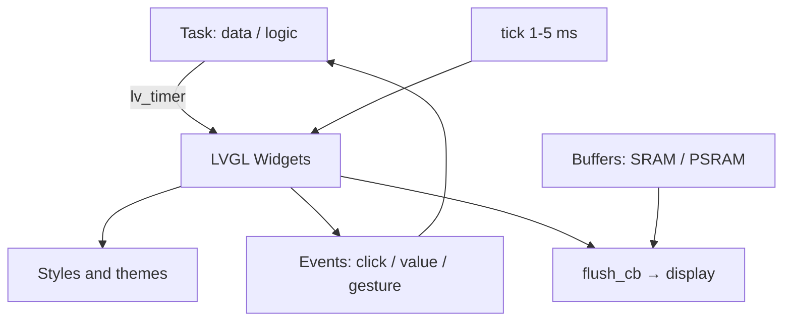

# LVGL Widgets Deep - Screens, Styles, Events and Memory on ESP32

![[assets/img/esp32-lvgl-widgets-deep-scheme.png|600]]
*Fig. LVGL stack: widgets → styles → events → flush to display; buffers in PSRAM, logic in tasks.*

> [!tip] What this note is
> Deep dive beyond basic LVGL overview: widgets by hand (without SquareLine), styles and themes, events, memory for screens. Displays: [[11-Vivid/02-TFT-LCD-Epaper.en.md|TFT and LCD]], SquareLine start: [[11-Vivid/12-LVGL-SquareLine.en.md|LVGL and SquareLine]].

## 1. Purpose

Write interfaces in code, not with a mouse:

- key widgets: label, button, slider, arc, chart, keyboard;
- styles and themes: colors, fonts (Cyrillic!), padding;
- events and timers: buttons, swipes, data updates;
- buffers: full, partial, double - what eats memory;
- Cyrillic in firmware without magic.

| Widget | Purpose | Note |
| --- | --- | --- |
| label | text, sensor values | wrap and scroll |
| button / matrix | buttons and keyboards | CLICKED events |
| slider / arc | setpoints, volume | ranges and color |
| chart | telemetry graphs | ring buffer of points |
| keyboard / textarea | WiFi password input | layouts |
| tabview / tileview | screens | swipe switching |

## 2. Architecture



Rule of threads: all LVGL in one task (or with a mutex). Calls from interrupts only through queue.

## 3. Typical TFT pinout

| TFT signal | ESP32-S3 pin | Note |
| --- | --- | --- |
| SCK / MOSI | GPIO12 / 11 | SPI 40 MHz |
| CS / DC / RST | GPIO10 / 9 / 8 | control |
| BL | GPIO7 + PWM | brightness! |
| TOUCH_IRQ | GPIO6 | touch interrupt |
| VCC / GND | 3V3 / GND | 200 mA reserve |

Brightness via LEDC-PWM, not resistor: smoothness and savings. Touch - XPT2046 on same SPI (separate CS).

## 4. Styles and Cyrillic

- Material theme: `lv_theme_default_init()` - start in a minute;
- Custom styles: backgrounds, radii, shadows - `lv_style_t` structures;
- Fonts: Montserrat + Cyrillic glyphs via LVGL converter;
- Sizes 14/20/28 - three sizes for whole interface;
- Colors: 16-bit, project palette in one header.

## 5. Working code (C, ESP-IDF)

```c
#include "lvgl.h"

static lv_obj_t *lbl_temp;

static void btn_cb(lv_event_t *e) {
  int *cnt = lv_event_get_user_data(e);
  (*cnt)++;
  lv_label_set_text_fmt(lbl_temp, "N=%d", *cnt);
}

void ui_build(void) {
  static int cnt = 0;
  lv_obj_t *scr = lv_scr_act();
  lbl_temp = lv_label_create(scr);
  lv_obj_align(lbl_temp, LV_ALIGN_TOP_MID, 0, 10);
  lv_obj_t *btn = lv_btn_create(scr);
  lv_obj_align(btn, LV_ALIGN_CENTER, 0, 0);
  lv_obj_add_event_cb(btn, btn_cb, LV_EVENT_CLICKED, &cnt);
  lv_obj_t *sl = lv_slider_create(scr);
  lv_obj_align(sl, LV_ALIGN_BOTTOM_MID, 0, -10);
  lv_slider_set_range(sl, 0, 100);
}

void app_main(void) {
  lv_init();
  ui_build();
  while (1) {
    lv_timer_handler();
    vTaskDelay(pdMS_TO_TICKS(5));
  }
}
```

`lv_timer_handler()` every 5 ms - library heartbeat. Heavy updates (graphs) - not more often than 10 Hz.

## 6. Working code (MicroPython)

```python
# MicroPython + lvgl: sensor interface (firmware with lvgl module)
import lvgl as lv
import time

lv.init()
scr = lv.scr_act()
lbl = lv.label(scr)
lbl.align(lv.ALIGN.TOP_MID, 0, 10)
btn = lv.btn(scr)
btn.align(lv.ALIGN.CENTER, 0, 0)
cnt = [0]

def cb(e):
    cnt[0] += 1
    lbl.set_text(f"N={cnt[0]}")

btn.add_event_cb(cb, lv.EVENT.CLICKED, None)
sl = lv.slider(scr)
sl.align(lv.ALIGN.BOTTOM_MID, 0, -10)
sl.set_range(0, 100)

while True:
    lv.timer_handler_run_in_period(5)
    time.sleep_ms(5)
```

MicroPython build with LVGL - separate firmware (module is heavy). Enough for simple panels; complex screens - in C.

## 7. Memory for screens

| Screen | Full buffer | Partial 1/10 | Recommendation |
| --- | --- | --- | --- |
| 320×240 | 150 KB | 15 KB | partial in SRAM |
| 480×320 | 300 KB | 30 KB | partial in SRAM |
| 800×480 | 768 KB | 77 KB | PSRAM mandatory |

Double buffer - smoothness without tearing, cost ×2. DMA-flush - without CPU involvement.

## 8. Common issues

| Symptom | Cause | Fix |
| --- | --- | --- |
| White screen | flush / tick not called | tick 1-5 ms + flush_cb |
| Garbled text | missing Cyrillic glyphs | font with Cyrillic via converter |
| Animation breaks | one small buffer | larger / double, DMA |
| Crash on press | callback touches deleted object | validity check, mutex |
| Touch mirrored | calibration / rotation | transform matrix |
| Not enough memory | full buffer 800×480 in SRAM | partial + PSRAM |

## 9. Quick LVGL cheat sheet

- tick 5 ms - heartbeat;
- one thread (or mutex);
- font with Cyrillic immediately;
- buffer: partial in SRAM;
- graphs not more often than 10 Hz.

## 10. Related notes

- [[11-Vivid/12-LVGL-SquareLine.en.md|LVGL and SquareLine]] - start with mouse.
- [[11-Vivid/02-TFT-LCD-Epaper.en.md|TFT and LCD]] - display hardware.
- [[01-Hardware/03-ESP32-S3.en.md|S3 chip]] - PSRAM for buffers.
- [[10-Sensors/20-Bio-IR-Temp.en.md|bio and IR temp]] - data for widgets.
- [[Home.en.md|home map]] - full navigation.

## 7.1 Output pinout (for developer)

- 800×480 display: 40 pin header → RST, CS, MOSI (SPI), SCK, BL, MISO (optional)
- 2.8" touch: SDA / SCL (I2C) + IRQ
- Best: connect only I2S / BLE interface to preserve production pins
- Doc: docs.simplefoc.com / docs.simplefoc.com/bldcmotor - for deep FOC

- PID controller games: operation block > 200 lines
- ESP32-S3 prototypes: USB-C connection, speed > 240 MHz
- Power monitoring: volt-amp from INA219 on bus
- Extra tools: analyzer for USB-OTG debug

## Official sources

- [LVGL (GitHub)](https://github.com/lvgl/lvgl) - library, examples, widgets.
- [ESP-ADF (Espressif)](https://docs.espressif.com/projects/esp-adf/en/latest/) - audio + display pipelines.
- [esp32-camera (Espressif, GitHub)](https://github.com/espressif/esp32-camera) - image source for widgets.
