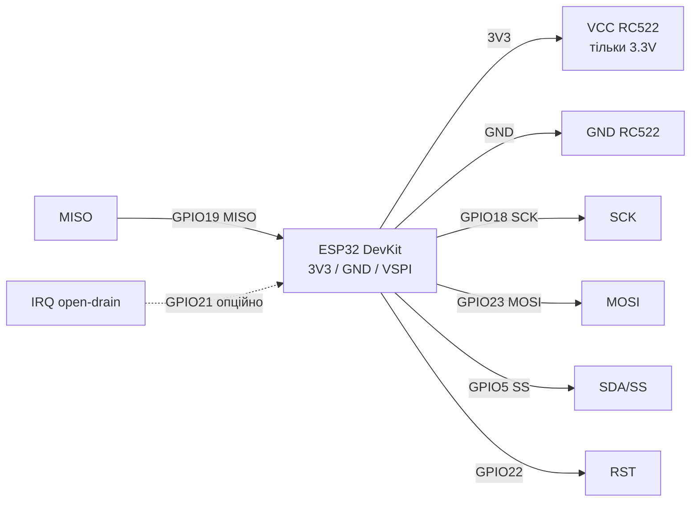

# RC522 RFID (MFRC522) - SPI 13.56 MHz

## Purpose

RC522 RFID (MFRC522): contactless tags 13.56 МГц over SPI - reading UID, sector access, lock/account control.

> [!warning] Critical: 3.3V only! NOT 5V! 5V power kills the chip.

Specifications: NXP MFRC522, 13.56 MHz, ISO14443A, SPI до 10 МГц. Applications - СКУД, мітки, оплата-прототипи; живлення строго 3.3V. Reading Mifare Classic card UIDs, working with sectors via KeyA/KeyB, range - a few centimeters. Libraries - MFRC522 for Arduino та and analogs for ESP-IDF/MicroPython.

![[assets/img/rc522-scheme.png|500]]
*Fig. RC522 - схема connection to ESP32 over VSPI, separate 3.3V power supply.*

Links to [[EN/Home.en]], [[04-Interfaces/02-SPI|SPI]], [[02-Power-Supply/01-Lancjugi-zhivlennya]], [[03-GPIO/01-GPIO-oglyad]], [[99-Additions/02-Troubleshooting-FAQ]], [[EN/12-Comm-Modules/02-NRF24-LoRa.en]].

## Purpose

RC522 RFID (MFRC522) - SPI 13.56 MHz - Module pin legend; ESP32 to RC522 connection; ASCII schematic. Critical: 3.3V only! NOT 5V! 5V power kills the chip. Specifications: NXP MFRC522, 13.56 MHz, ISO14443A, SPI до 10 МГц.

## Легенда пінів модуля

The RC522 module (board with MFRC522 chip) has 8 pins. Note: on some boards the first pin is labeled `SDA`, but in SPI mode this is `SS / NSS / CS` - do not confuse with I2C SDA.

| Pin | Label | Type | To ESP32 | Note |
| --- | --- | --- | --- | --- |
| 1 | VCC | Живлення вхід | 3V3 ESP32 (via окремий LDO for потреби) | 3.3V only! 5V kills the module instantly, logic also 3.3V |
| 2 | RST | Вхід, active low | GPIO22 (будь-which GPIO) | Reset: hold HIGH in operation, LOW pulse = reset; pull-up 10k to 3.3V |
| 3 | GND | Земля | GND | Common ground with ESP32, short wire |
| 4 | IRQ | Вихід, open-drain | GPIO21 або not підключати | Interrupt "card in field"; open-drain - needs pull-up 10k to 3.3V; can be omitted and poll in loop |
| 5 | MISO | Вихід SPI | GPIO19 (VSPI MISO) | Data from RC522 to ESP32 |
| 6 | MOSI | Вхід SPI | GPIO23 (VSPI MOSI) | Data from ESP32 to RC522 |
| 7 | SCK | Вхід SPI | GPIO18 (VSPI SCK) | SPI clock up to 10 MHz, wires <20 cm |
| 8 | SDA / SS | Вхід CS | GPIO5 (будь-which GPIO how CS) | this Slave Select (NSS): LOW = вибрано; signature SDA - спадщина from I2C-режиму чипа |

Pin details:

- **VCC 3.3V:** MFRC522 chip powered from 3.0-3.6V. RC522 board has no 5V→3.3V regulator, so 5V is forbidden - internal LDO breakdown and 13.56 MHz antenna degradation. If DevKit sags - separate LDO 3.3V 300 mA + electrolytic 10 µF + ceramic 100 nF near module, see [[02-Power-Supply/01-Lancjugi-zhivlennya]].
- **RST:** active low level. In library `MFRC522(SS, RST)` this pin initializes the chip during `PCD_Init()`. Without RST connection the module sometimes "hangs" after brownout.
- **GND:** common ground is mandatory. Long "tails" GND = SPI errors `Version 0x00/0xFF`.
- **IRQ:** open-drain output: pulls to ground itself, pulled up to 3.3V by external 10k resistor. Can be omitted entirely - then `PICC_IsNewCardPresent()` polls in `loop()`. Needed only for ESP32 sleep/wakeup by card, see [[03-GPIO/01-GPIO-oglyad]].
- **MISO / MOSI / SCK:** classic SPI, see [[04-Interfaces/02-SPI|SPI]]. Order `SPI.begin(SCK, MISO, MOSI, SS)` in Arduino - do not swap MISO/MOSI positions.
- **SDA (SS):** in SPI mode this is Chip Select. When only RC522 on bus - any free GPIO works (typically GPIO5). When NRF24/LoRa/SD also on bus - each has its own CS, SCK/MOSI/MISO shared.

## Підключення ESP32 до RC522

| ESP32 | RC522 | Note |
| --- | --- | --- |
| 3V3 | 3.3V | NOT 5V! |
| GND | GND | common ground |
| GPIO18 | SCK | VSPI SCK |
| GPIO23 | MOSI | VSPI MOSI |
| GPIO19 | MISO | VSPI MISO |
| GPIO5 | SDA (SS) | CS |
| GPIO22 | RST | Reset |
| GPIO21 | IRQ | optional pull-up 10k |

RST/IRQ details: RST active low, hold HIGH. IRQ open-drain for wakeup, see [[03-GPIO/01-GPIO-oglyad]].

### ASCII schematic

```text
ESP32 DevKit          RC522 (MFRC522)
────────────          ───────────────
3V3 ───────────────►  VCC (3.3V! NOT 5V!)
GND ────────────────  GND
GPIO18 (VSPI SCK) ──► SCK
GPIO23 (VSPI MOSI) ─► MOSI
GPIO19 (VSPI MISO) ◄── MISO
GPIO5  (CS) ───────►  SDA (SS)
GPIO22 ────────────►  RST
GPIO21 ────────────◄  IRQ (опційно, pull-up 10к до 3V3, можна NC)

Notes:
- SPI.begin(18, 19, 23, 5) // SCK, MISO, MOSI, SS
- Wire length < 20 cm, power + 100nF + 10µF near module
- IRQ can be omitted (leave free)
```

### Mermaid



## Code - читання UID

### Arduino

```cpp
#include <SPI.h>
#include <MFRC522.h>
#define SS_PIN 5
#define RST_PIN 22
MFRC522 rfid(SS_PIN, RST_PIN);
void setup() {
  Serial.begin(115200);
  SPI.begin(18, 19, 23, SS_PIN);
  rfid.PCD_Init();
  rfid.PCD_DumpVersionToSerial();
}
void loop() {
  if (!rfid.PICC_IsNewCardPresent() || !rfid.PICC_ReadCardSerial()) { delay(50); return; }
  Serial.print("UID:");
  for (byte i=0;i<rfid.uid.size;i++) { Serial.printf(" %02X", rfid.uid.uidByte[i]); }
  Serial.println();
  rfid.PICC_HaltA(); rfid.PCD_StopCrypto1();
}
```

### MicroPython

```python
from machine import Pin, SPI
from mfrc522 import MFRC522
rfid = MFRC522(sck=18, mosi=23, miso=19, rst=22, cs=5)
print("RC522 ready")
while True:
    stat, tag = rfid.request(rfid.REQIDL)
    if stat == rfid.OK:
        stat, uid = rfid.anticoll()
        print("UID:", uid)
```

### ESP-IDF

```c
// spi_bus_initialize VSPI_HOST: SCK=18 MISO=19 MOSI=23, mfrc522_init(SS=5, RST=22)
// mfrc522_picc_read_uid(uid, &len) в циклі з vTaskDelay(200ms)
```

### Power and stability - checklist

1. Check 3.3V at VCC pin with multimeter during card presentation (must not drop below 3.0V).
2. Place ceramic 100 nF + electrolytic 10 µF directly on VCC/GND of module.
3. Do not power RC522 from 3V3 pin with WiFi at max + bright LEDs - better separate LDO, see [[02-Power-Supply/01-Lancjugi-zhivlennya]].
4. Board antenna must not touch metal; read distance 2-4 cm for key fobs, 4-6 cm for cards.
5. If several devices on SPI bus - each has its own CS, and `SPI.begin()` called once, see [[04-Interfaces/02-SPI|SPI]].

| Symptom | Cause | Solution |
| --- | --- | --- |
| Version 0x00/0xFF | no SPI | check MOSI/MISO, wires <20cm |
| Читає via раз | power sag | 3.3V only + caps 100nF+10µF |
| Reboot at картці | weak LDO | separate LDO, see [[02-Power-Supply/01-Lancjugi-zhivlennya]] |
| IRQ not спрацьовує | no pull-up | 10k resistor to 3.3V or poll without IRQ |
| Плутанина SDA/SS | SDA label on board | SDA = SS/CS on GPIO5 |

## Official sources

- [MFRC522 - даташит (PDF, NXP)](https://www.nxp.com/docs/en/data-sheet/MFRC522.pdf) - registers, 13.56 MHz antenna.
- [MFRC522 - сторінка продукту with фото (NXP)](https://www.nxp.com/products/rfid-nfc/nfc-hf/nfc-readers/standard-performance-mifare-and-ntag-frontend:MFRC52202HN1) - specs, documents.
- [ESP32 + MFRC522 - туторіал with кодом (RNT)](https://randomnerdtutorials.com/esp32-mfrc522-rfid-reader-arduino/) - UID, read/write blocks.
- [RC522 - розбір модуля with фото (LME)](https://lastminuteengineers.com/how-rfid-works-rc522-arduino-tutorial/) - pins, Mifare 1K memory.

## See also

- [[EN/Home.en]]
- [[04-Interfaces/01-UART|UART]]
- [[04-Interfaces/02-SPI|SPI]]
- [[02-Power-Supply/01-Lancjugi-zhivlennya]]
- [[03-GPIO/01-GPIO-oglyad]]
- [[EN/12-Comm-Modules/01-RC522-RFID.en]]
- [[EN/12-Comm-Modules/02-NRF24-LoRa.en]]
- [[EN/12-Comm-Modules/03-SIM800L-GPS.en]]
- [[EN/12-Comm-Modules/04-RS485-CAN-Ethernet-Kamera.en]]
- [[99-Additions/01-Pinout-tablici]]
- [[99-Additions/02-Troubleshooting-FAQ]]
