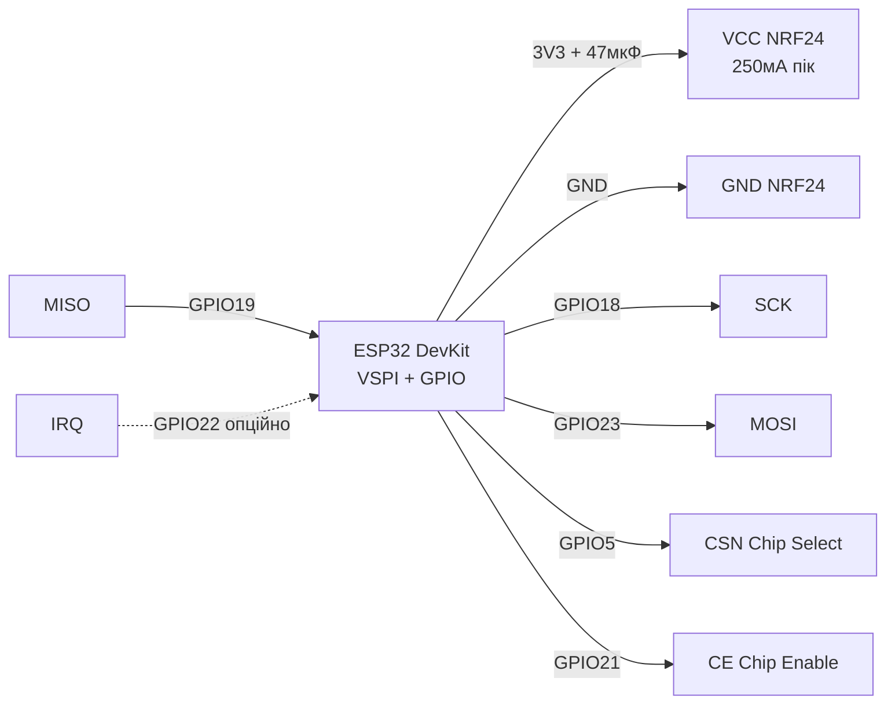
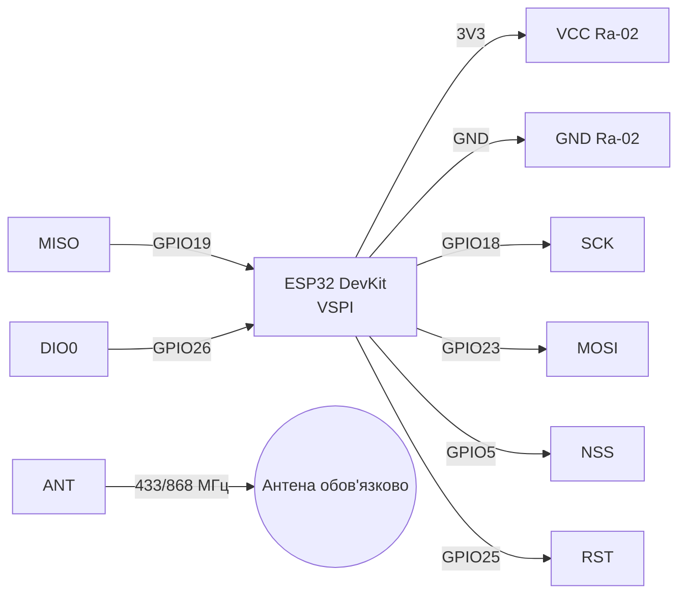

# NRF24L01+ та LoRa SX1276 (Ra-02)

> [!warning] Both modules - 3.3V only! NRF24 with PA+LNA draws up to 250 mA in TX - needs 10 µF capacitor. LoRa without antenna DO NOT turn on - output stage will burn!

Radio overview: [[05-Radio/01-WiFi-STA-AP]], bus [[04-Interfaces/02-SPI|SPI]], живлення [[02-Power-Supply/01-Lancjugi-zhivlennya]], піни [[03-GPIO/01-GPIO-oglyad]], diagnostics [[99-Additions/02-Troubleshooting-FAQ]], start [[EN/Home.en]].

## Purpose

NRF24L01+ та LoRa SX1276 (Ra-02) - NRF24L01+PA+LNA; Легенда пінів модуля NRF24L01; Підключення ESP32 до NRF24. Both modules - 3.3V only! NRF24 with PA+LNA draws up to 250 mA in TX - needs 10 µF capacitor. LoRa without antenna DO NOT turn on - output stage will burn! Radio overview: [[05-Radio/01-WiFi-STA-AP]], bus [[04-Interfaces/02-SPI|SPI]], живлення [[02-Power-Supply/01-Lancjugi-zhivlennya]], піни [[03-GPIO/01-GPIO-oglyad]], diagnostics [[99-Additions/02-Troubleshooting-FAQ]], start Home.

## 1. NRF24L01+PA+LNA

Specifications: 2.4 ГГц, Enhanced ShockBurst, 250 кбіт/1M/2M, PA+LNA + external antenna, range up to 1 km at 250 kbps in line of sight.
Power: 1.9-3.6V, peak 250 mA (PA+LNA). DevKit regulator cannot handle peaks - place electrolytic 10-47 µF + ceramic 100 nF directly on VCC/GND pins of module. Adapter board with AMS1117-3.3 for NRF24 - recommended solution.

![[assets/img/nrf24-wiring.png|500]]
*Fig. NRF24L01+PA+LNA - connection over SPI, конденсатор 10-100 мкФ прямо on VCC/GND.*

### Module pin legend NRF24L01

| Pin | Label | Type | To ESP32 | Note |
| --- | --- | --- | --- | --- |
| 1 | VCC | Живлення вхід | 3V3 (краще via адаптер AMS1117-3.3 from 5V) | Тільки 3.3V! Пік 250 мА in PA+LNA - вбудований LDO DevKit просідає without конденсатора |
| 2 | GND | Земля | GND | Спільна земля, короткі товсті дроти |
| 3 | CE | Вхід цифровий | GPIO21 (будь-which GPIO) | Chip Enable: HIGH = TX/RX режим, LOW = standby; this not Chip Select |
| 4 | CSN | Вхід CS, active low | GPIO5 (CS) | Chip Select Not: LOW on час SPI-транзакції; `RF24(CE, CSN)` |
| 5 | SCK | Вхід SPI | GPIO18 (VSPI SCK) | Тактування SPI до 10 МГц |
| 6 | MOSI | Вхід SPI | GPIO23 (VSPI MOSI) | ESP32 → NRF24 |
| 7 | MISO | Вихід SPI | GPIO19 (VSPI MISO) | NRF24 → ESP32 |
| 8 | IRQ | Вихід, active low | GPIO22 або not підключати | Переривання TX_DS / RX_DR / MAX_RT; можна опитувати without нього |

CE vs CSN - what's the difference:

- **CSN (Chip Select Not)** - стандартний CS шини SPI, див. [[04-Interfaces/02-SPI|SPI]]. Активний LOW лише on час байтів `SPI.transfer()`. Один on кожен пристрій шини.
- **CE (Chip Enable)** - керування радіо-автоматом Nordic: `LOW` = standby/sleep, імпульс `HIGH >10 мкс` = start TX, постійний `HIGH` = режим RX. therefore бібліотека приймає два піни: `RF24 radio(CE, CSN)`.
- Typical error - swap them: then initialization passes, but `write()` always `false`.

Why a 10-100 µF capacitor is needed:

1. PA (power amplifier) takes a pulse ~250 mA over microseconds - DevKit LDO with slow response sags to 2.6V and chip restarts.
2. Electrolytic 10-47 µF (for PA+LNA better 47-100 µF) + ceramic 100 nF soldered/inserted directly on VCC-GND module, pins as short as possible.
3. Without capacitor symptoms: `TX fail`, "radio sees registers but does not transmit", range 2 m instead of 500 m.
4. Ideal - NRF24 adapter board with AMS1117-3.3: powered from 5V, gives clean 3.3V with current reserve, already has electrolytics.

Standard NRF24 vs PA+LNA:

- **Standard (PCB antenna):** TX current ~12 mA, range 30-100 m, works from DevKit 3V3, 10 µF sufficient.
- **PA+LNA (external SMA antenna):** TX current up to 250 mA, range up to 1 km at 250 kbps, mandatory 47-100 µF or adapter, start with `RF24_PA_LOW`/`RF24_PA_MIN`, otherwise sag.
- Powering PA+LNA from ESP32 3V3 without capacitor - main reason "does not work" on forums. Power is power, and logic levels in both - 3.3V, see [[02-Power-Supply/01-Lancjugi-zhivlennya]] and [[03-GPIO/01-GPIO-oglyad]].

### Connecting ESP32 to NRF24

| ESP32 | NRF24L01 | Note |
| --- | --- | --- |
| 3V3 | VCC | 3.3V + конд. 10 мкФ, not 5V |
| GND | GND | common ground |
| GPIO18 | SCK | VSPI SCK |
| GPIO23 | MOSI | VSPI MOSI |
| GPIO19 | MISO | VSPI MISO |
| GPIO5 | CSN | Chip Select |
| GPIO21 | CE | Chip Enable, будь-which GPIO |
| GPIO22 | IRQ | опційно, active low |

### ASCII schematic (NRF24)

```text
ESP32 DevKit          NRF24L01+PA+LNA
────────────          ───────────────
3V3 ───────────────►  VCC (3.3V! + 47мкФ між VCC і GND прямо на модулі)
GND ────────────────  GND
GPIO18 (SCK) ──────►  SCK
GPIO23 (MOSI) ─────►  MOSI
GPIO19 (MISO) ◄─────  MISO
GPIO5  (CSN) ──────►  CSN
GPIO21 (CE) ───────►  CE
GPIO22 ────────────◄  IRQ (опційно, можна NC)
                      ANT ──► антена 2.4 ГГц SMA (для PA+LNA обов'язково накрутити!)

Конденсатор: (+) до VCC, (-) до GND, ноги < 5 мм
RF24 radio(21, 5); SPI.begin(18, 19, 23, 5);
```

### Mermaid (NRF24)



## 2. LoRa SX1276 Ra-02

Specifications: SX1276, частоти 433 / 868 / 915 МГц (версія плати фіксована!), потужність до +20 дБм, чутливість -148 дБм, LoRa + FSK/OOK.
Антана обов'язкова перед TX! without антени або with антеною not on ту частоту - КСХ > 3, перегрів PA. Живлення 3.3V, TX ~120 мА, RX ~12 мА.
Частоти in Україні: 433.05-434.79 МГц without ліцензії (10 мВт), 868 МГц - EU 863-870 МГц. not плутати версії Ra-02 433 vs 868.

### SX1278 / E32 / E22 - UART-модулі with прошивкою

| Позиція | that this | Відмінність from голої Ra-02 |
| --- | --- | --- |
| SX1278 | Той же кристал, that SX1276, але лише 433 МГц версія | Дешевший; for нових проєктів різниці with 1276 немає - беріть that є |
| E32-433T20D / E22-900T22S (Ebyte) | LoRa-модем with UART and AT-подібними командами | not треба писати LoRa-стек: шлеш байти in UART - вилітають in ефір; режими M0-M3 перемичкою |
| Коли брати Ebyte | Точка-точка without LoRaWAN: два модулі with однаковими параметрами (частота/канал/адреса) бачать один одного with коробки |

![[assets/img/lora-ra02-scheme.png|500]]
*Fig. LoRa Ra-02 - підключення SPI + DIO0/RST, антена on свою частоту обов'язкова до вмикання TX.*

### Module pin legend LoRa Ra-02

| Pin | Label | Type | To ESP32 | Note |
| --- | --- | --- | --- | --- |
| 1 | VCC | Живлення | 3V3 ESP32 | Тільки 3.3V, TX ~120 мА - бажано 10 мкФ on живленні |
| 2 | GND | Земля | GND | Земля + екран антени, спільна with ESP32 |
| 3 | SCK | Вхід SPI | GPIO18 | SPI SCK |
| 4 | MOSI | Вхід SPI | GPIO23 | SPI MOSI |
| 5 | MISO | Вихід SPI | GPIO19 | SPI MISO |
| 6 | NSS | Вхід CS | GPIO5 | Chip Select LoRa (аналог CSN in NRF24) |
| 7 | RST | Вхід reset | GPIO25 | Скидання SX1276, active low |
| 8 | DIO0 | Вихід цифра | GPIO26 | Переривання RX Done / TX Done - обов'язкове for бібліотеки LoRa |
| 9 | DIO1 | Вихід цифра | NC або GPIO | FIFO Level / CadDetected - for базового прикладу not потрібне |
| 10 | DIO2 | Вихід цифра | NC або GPIO | FHSS / CadDone - for базового прикладу not потрібне |
| 11 | ANT | ВЧ-вихід | Антена 433 або 868 МГц | Підключати ДО першого `LoRa.begin()`! without антени TX спалить PA |

Пояснення DIO and антени:

- **NSS vs DIO0:** NSS вибирає чип on SPI (how CSN), but DIO0 сигналізує «пакет прийнято/передано». without DIO0 бібліотека Sandeep Mistry висить in `endPacket()`. therefore DIO0 обов'язковий, but DIO1/DIO2 - опційні.
- **RST:** SX1276 скидається низьким імпульсом at `LoRa.setPins(NSS, RST, DIO0)`. not вішати RST on strap-піни ESP32 (GPIO0/2/12/15).
- **Антена обов'язкова:** передавач +20 дБм (100 мВт) without навантаження відбиває потужність назад in PA - перегрів and деградація. Правило: накрутив антену → потім живлення → потім TX. Антена строго on частоту плати: 433 МГц антена on 868 МГц платі = дальність метри and КСХ > 3.
- **Живлення:** 3.3V стабільне, піки TX 120 мА - вистачає DevKit, але електроліт 10-47 мкФ not завадить. Логіка 3.3V безпосередньо до ESP32, див. [[03-GPIO/01-GPIO-oglyad]].

### Connecting ESP32 to Ra-02

| ESP32 | Ra-02 SX1276 | Примітка |
| --- | --- | --- |
| 3V3 | 3.3V | тільки 3.3V |
| GND | GND | земля + екран антени |
| GPIO18 | SCK | SPI SCK |
| GPIO23 | MOSI | SPI MOSI |
| GPIO19 | MISO | SPI MISO |
| GPIO5 | NSS | CS |
| GPIO26 | DIO0 | переривання RX/TX done |
| GPIO25 | RST | reset |
| - | ANT | антена 433 або 868 МГц, обов'язково! |

### ASCII schematic (LoRa Ra-02)

```text
ESP32 DevKit          Ra-02 SX1276
────────────          ────────────
3V3 ───────────────►  VCC (3.3V)
GND ────────────────  GND
GPIO18 ────────────►  SCK
GPIO23 ────────────►  MOSI
GPIO19 ◄────────────  MISO
GPIO5 ─────────────►  NSS
GPIO25 ────────────►  RST
GPIO26 ◄────────────  DIO0 (обов'язково!)
                      DIO1 ── NC (опційно)
                      DIO2 ── NC (опційно)
                      ANT ──► антена 433/868 МГц (ДО вмикання!)

LoRa.setPins(5, 25, 26); SPI.begin(18, 19, 23, 5);
```

### Mermaid (LoRa Ra-02)



## Code

### NRF24 Arduino (RF24)

```cpp
#include <SPI.h>
#include <RF24.h>
RF24 radio(21, 5); // CE, CSN
const byte addr[6] = "ESP32";
void setup() {
  Serial.begin(115200);
  SPI.begin(18, 19, 23, 5);
  radio.begin();
  radio.setPALevel(RF24_PA_LOW); // почати з LOW, HIGH лише з добрим живленням
  radio.setDataRate(RF24_250KBPS);
  radio.openWritingPipe(addr);
}
void loop() {
  const char msg[] = "hello";
  bool ok = radio.write(&msg, sizeof(msg));
  Serial.println(ok ? "TX ok" : "TX fail");
  delay(500);
}
```

### NRF24 MicroPython (nrf24l01.py)

```python
from machine import Pin, SPI
from nrf24l01 import NRF24L01
spi = SPI(2, sck=Pin(18), mosi=Pin(23), miso=Pin(19))
radio = NRF24L01(spi, Pin(5), Pin(21), payload_size=32)
radio.open_tx_pipe(b"ESP32")
radio.send(b"hello")
```

### LoRa Arduino (LoRa by Sandeep Mistry)

```cpp
#include <SPI.h>
#include <LoRa.h>
#define NSS 5
#define RST 25
#define DIO0 26
void setup() {
  Serial.begin(115200);
  SPI.begin(18, 19, 23, NSS);
  LoRa.setPins(NSS, RST, DIO0);
  if (!LoRa.begin(433E6)) { Serial.println("LoRa init fail"); while(1); }
  LoRa.setSpreadingFactor(9);
  LoRa.setSignalBandwidth(125E3);
  LoRa.setCodingRate4(5);
}
void loop() {
  LoRa.beginPacket(); LoRa.print("hello"); LoRa.endPacket();
  delay(2000);
}
```

### LoRa MicroPython (sx127x)

```python
from machine import Pin, SPI
from sx127x import SX127x
spi = SPI(2, baudrate=8000000, sck=Pin(18), mosi=Pin(23), miso=Pin(19))
lora = SX127x(spi, pins={"ss":5, "reset":25, "dio0":26}, parameters={"frequency":433e6})
lora.send(b"hello")
```

### ESP-IDF (NRF24 / LoRa)

```c
// NRF24: esp-idf-nrf24 (nrf24_init(VSPI_HOST, CE=21, CSN=5)), LoRa: sx1276 driver
// LoRa: lora_init({spi_host=VSPI_HOST, nss=5, rst=25, dio0=26, freq=433e6})
```

### Поради with дальності and стабільності

1. NRF24: почати with `RF24_PA_MIN`, канал подалі from WiFi (напр. 108-й), швидкість 250 кбіт for дальності.
2. NRF24 PA+LNA: антена закручена до упору, блок живлення with запасом, `setPALevel(HIGH/MAX)` лише після конденсатора.
3. LoRa: SF9/BW125 for балансу, SF12 for максимуму дальності; антена вертикально, подалі from металу.
4. Обидва модулі - SPI, див. [[04-Interfaces/02-SPI|SPI]]; not ділити один CS між NRF24 and LoRa; живлення - [[02-Power-Supply/01-Lancjugi-zhivlennya]].
5. Два радіо on одній платі: рознести антени мінімум on 10 см, not вмикати TX одночасно.

| Symptom | Cause | Solution |
| --- | --- | --- |
| NRF24 TX fail завжди | немає конд. / слабке 3.3V | 10-47 мкФ on модулі, PA_LOW спочатку |
| LoRa init fail | переплутані NSS/RST/DIO0, not та частота | verify розпіновку, Ra-02 маркування 433/868 |
| Мала дальність | антена 2.4 ГГц on 433 МГц and навпаки | антена on свою частоту, земляний противаг |
| NRF24 гріється / ребутить ESP32 | PA+LNA without адаптера | адаптер AMS1117-3.3 from 5V 1A |
| LoRa зависає on endPacket | немає DIO0 | підключити DIO0 on GPIO26 |

## Official sources

- [SX1276 - даташит and документи (Semtech)](https://www.semtech.com/products/wireless-rf/lora-connect/sx1276) - LoRa-модем, link budget, фото.
- [ESP32 + LoRa - туторіал with кодом (RNT)](https://randomnerdtutorials.com/esp32-lora-rfm95-transceiver-arduino-ide/) - Sender/Receiver, антена обов'язково.
- [nRF24L01+ - розбір with фото and кодом (LME)](https://lastminuteengineers.com/nrf24l01-arduino-wireless-communication/) - Multiceiver, конденсатор on живлення.
- nRF24L01 (nordicsemi.com) - *verify вручну*: сайт блокує автозапити, шукати «nRF24L01 Product Specification».

## See also

- [[EN/Home.en]]
- [[04-Interfaces/01-UART|UART]]
- [[04-Interfaces/02-SPI|SPI]]
- [[02-Power-Supply/01-Lancjugi-zhivlennya]]
- [[03-GPIO/01-GPIO-oglyad]]
- [[05-Radio/01-WiFi-STA-AP]]
- [[EN/12-Comm-Modules/01-RC522-RFID.en]]
- [[EN/12-Comm-Modules/02-NRF24-LoRa.en]]
- [[EN/12-Comm-Modules/03-SIM800L-GPS.en]]
- [[EN/12-Comm-Modules/04-RS485-CAN-Ethernet-Kamera.en]]
- [[99-Additions/01-Pinout-tablici]]
- [[99-Additions/02-Troubleshooting-FAQ]]
