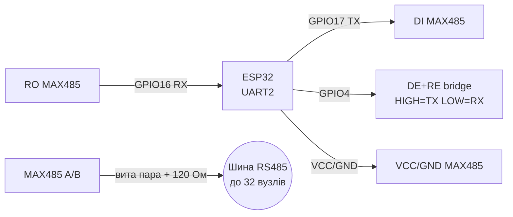
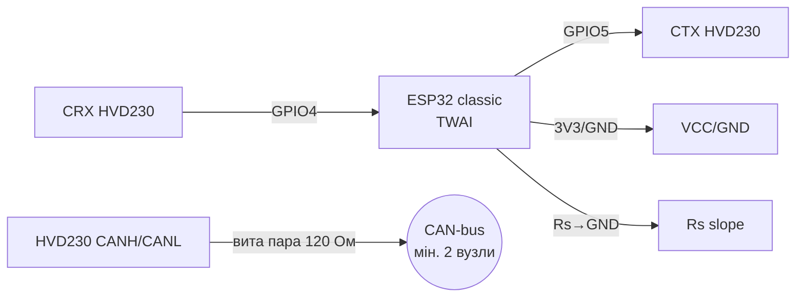
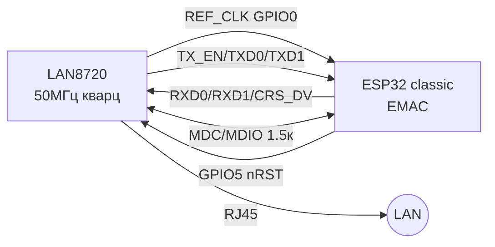
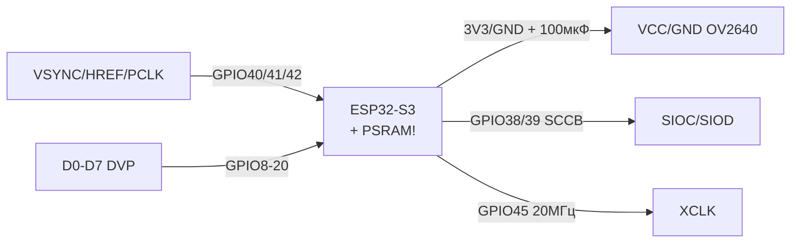

# RS485 / CAN / Ethernet / Камера

Навігація: UART [[04-Interfaces/01-UART|UART]], SPI [[04-Interfaces/02-SPI|SPI]], живлення [[02-Power-Supply/01-Lancjugi-zhivlennya]], піни [[99-Additions/01-Pinout-tablici]], diagnostics [[99-Additions/02-Troubleshooting-FAQ]], start [[EN/Home.en]], рівні [[13-Power-Modules/02-Level-Shifters]].

## Purpose

RS485 / CAN / Ethernet / Камера - RS485 - MAX485 (DE/RE); Легенда пінів модуля MAX485; ASCII-схема (MAX485). Навігація: UART [[04-Interfaces/01-UART|UART]], SPI [[04-Interfaces/02-SPI|SPI]], живлення [[02-Power-Supply/01-Lancjugi-zhivlennya]], піни [[99-Additions/01-Pinout-tablici]], diagnostics [[99-Additions/02-Troubleshooting-FAQ]], start Home, рівні 13-Power-Modules/02-Level-Shifters. MAX485: напівдуплекс, DE=Driver Enable HIGH=передача, RE=Receiver Enable LOW=прийом. Зазвичай DE+RE with'єднані and керуються одним GPIO. Термінатор 120 Ом on кінцях лінії A-B. Fail-safe bias 680 Ом for потреби.

## 1. RS485 - MAX485 (DE/RE)

MAX485: напівдуплекс, DE=Driver Enable HIGH=передача, RE=Receiver Enable LOW=прийом. Зазвичай DE+RE with'єднані and керуються одним GPIO. Термінатор 120 Ом on кінцях лінії A-B. Fail-safe bias 680 Ом for потреби.

![[assets/img/max485-de-re.png|500]]
*Fig. MAX485 - міст DE+RE on один GPIO, термінатор 120 Ом on кінцях лінії A/B.*

### Module pin legend MAX485

| Pin | Label | Type | To ESP32 | Note |
| --- | --- | --- | --- | --- |
| 1 | VCC | Живлення | 3V3 або 5V for версією плати | MAX485 - 5V, MAX3485 - 3.3V; verify маркування! |
| 2 | GND | Земля | GND | Спільна земля, for довгих ліній - третій провід GND між вузлами |
| 3 | DI | Вхід цифровий | GPIO17 (TX2) | Driver In: ESP32 TX → DI |
| 4 | RO | Вихід цифровий | GPIO16 (RX2) | Receiver Out: RO → ESP32 RX перехресно |
| 5 | DE | Вхід enable | GPIO4 (спільно with RE) | Driver Enable: HIGH = передача |
| 6 | RE | Вхід enable, active low | GPIO4 (спільно with DE) | Receiver Enable: LOW = прийом; with'єднати with DE перемичкою (bridge) |
| 7 | A | Диференційна лінія | Вита пара до A всіх вузлів | Неінвертуючий вивід, термінатор 120 Ом on кінцях |
| 8 | B | Диференційна лінія | Вита пара до B всіх вузлів | Інвертуючий вивід, термінатор 120 Ом on кінцях |

Пояснення DE+RE bridge and термінатора:

- **DE+RE bridge:** DE активний HIGH, RE активний LOW - therefore їх with'єднують разом on один GPIO: `HIGH` = передавач увімкнено / приймач вимкнено (TX), `LOW` = навпаки (RX). Економить пін and виключає колізію «обидва увімкнені». in коді: підняв GPIO → `write()` → `flush()` → затримка 100 мкс → опустив GPIO.
- **Термінатор 120 Ом:** резистор між A and B on двох крайніх вузлах лінії гасить відбиття сигналу. on середніх вузлах - not ставити! without термінаторів on 100+ м and 115200 бод - «тиша» або сміття.
- **Fail-safe bias:** пара 680 Ом (A до VCC, B до GND) тримає лінію in MARK коли всі передавачі мовчать. on коротких лініях зазвичай not потрібна.
- **Вита пара:** A/B вести витою парою (UTP), GND - окремим дротом. Довжина до 1200 м on 9600 бод, див. [[04-Interfaces/01-UART|UART]].

| ESP32 | MAX485 | Примітка |
| --- | --- | --- |
| GPIO16 (RX2) | RO | Receiver Out -> ESP32 RX |
| GPIO17 (TX2) | DI | ESP32 TX -> Driver In |
| GPIO4 | DE + RE | HIGH=TX, LOW=RX (зєднати DE до RE) |
| 3V3/5V | VCC | for версією плати (MAX485 5V, MAX3485 3.3V) |
| GND | GND | common ground |
| - | A / B | диференційна пара, вита пара, 120 Ом on кінцях |

### ASCII schematic (MAX485)

```text
ESP32 DevKit          MAX485 module              Лінія RS485
────────────          ────────────              ───────────
GPIO17 (TX2) ──────►  DI
GPIO16 (RX2) ◄──────  RO
GPIO4 ─────────────►  DE ─┐
                      RE ─┘ (bridge: з'єднати DE і RE разом!)
3V3/5V ────────────►  VCC (за версією плати)
GND ────────────────  GND ──────────────────── GND лінії (3-й провід)
                      A ──────────────────────► A (вита пара) ── [120 Ом] на кінцях
                      B ──────────────────────► B (вита пара) ── [120 Ом] на кінцях

TX: GPIO4=HIGH → write → flush → 100мкс → GPIO4=LOW
```

### Mermaid (MAX485)



### Arduino Modbus/RS485

```cpp
#define DE_RE 4
HardwareSerial rs(2);
void setup(){ pinMode(DE_RE, OUTPUT); digitalWrite(DE_RE, LOW); rs.begin(9600, SERIAL_8N1, 16, 17); }
void rsWrite(const uint8_t* d, int n){ digitalWrite(DE_RE, HIGH); delayMicroseconds(100); rs.write(d, n); rs.flush(); delayMicroseconds(100); digitalWrite(DE_RE, LOW); }
```

### MicroPython RS485

```python
from machine import Pin, UART
de = Pin(4, Pin.OUT, value=0)
rs = UART(2, baudrate=9600, rx=16, tx=17)
def rs_write(data):
    de.on(); rs.write(data); de.off()
```

### ESP-IDF RS485

```c
// uart_set_mode(UART_NUM_2, UART_MODE_RS485_HALF_DUPLEX); // DE/RE керує драйвер автоматично
```

### Ізольовані варіанти: MAX485-ISO / ADM2483 / ADM3057E

| Позиція | that this | Коли брати |
| --- | --- | --- |
| MAX485-ISO (готовий module) | MAX485 + ADuM1201 + ізольований DC-DC on одній платі | Довгі лінії між будівлями, різні землі - without роздумів |
| ADM2483 | RS485-трансивер with ізоляцією 2.5 кВ (один чип!) | Своя плата замість модуля |
| ADM3057E | Ізольований CAN-трансивер (аналог ISO1050) | CAN між шафами/будівлями |

```text
Логічна сторона (ESP32 GND) ║ ISO-бар'єр ║ Польова сторона (своя GND!)
ESP32 TX/RX/DE ──► ISO-трансивер ──► A/B в поле; живлення поля — окремий ізольований DC-DC (B0505S)
```

> without ізоляції різниця земель >5 in між вузлами = струм per екрану = вигорілі трансивери. Правило: різні будівлі/шафи - тільки ізольовані модулі.

## 2. CAN - SN65HVD230 / TJA1050

ESP32 classic має вбудований CAN (SJA1000-сумісний, тепер TWAI). SN65HVD230 - 3.3V трансивер (кращий вибір), TJA1050 - 5V. Швидкість до 1 Мбіт, термінатори 120 Ом with обох кінців. Піни CAN: будь-які GPIO via матрицю, типово RX=GPIO4 TX=GPIO5 або RX=21 TX=22.

![[assets/img/can-hvd230-bus.png|500]]
*Fig. SN65HVD230 - CAN-bus with термінаторами 120 Ом, Rs до землі for високої швидкості.*

### Module pin legend SN65HVD230

| Pin | Label | Type | To ESP32 | Note |
| --- | --- | --- | --- | --- |
| 1 | VCC | Живлення 3.3V | 3V3 ESP32 | Тільки 3.3V! Перевага над TJA1050 (5V) - пряме сполучення with ESP32 |
| 2 | GND | Земля | GND | Спільна земля |
| 3 | CTX | Вхід цифровий | GPIO5 (CAN TX) | ESP32 TX → CTX |
| 4 | CRX | Вихід цифровий | GPIO4 (CAN RX) | CRX → ESP32 RX |
| 5 | Rs | Вхід режиму | GND via 10к або безпосередньо | Резистор швидкості/slope: LOW (до GND) = high-speed до 1 Мбіт; 10к до GND = slope-режим; HIGH = standby |
| 6 | CANH | Диференційна bus | Вита пара CANH | High-лінія, 120 Ом on кінцях шини |
| 7 | CANL | Диференційна bus | Вита пара CANL | Low-лінія, 120 Ом on кінцях шини |

Пояснення Rs and шини:

- **Rs (slope resistor):** керує фронтами: Rs притягнутий до GND (0 Ом або 10к до землі) = круті фронти, швидкість до 1 Мбіт; Rs до VCC = standby/sleep. Типово for тестів - перемичка Rs→GND (high-speed). for ЕМС on довгих лініях - резистор 10к-50к до GND (пологі фронти, менше випромінювання).
- **CANH/CANL:** диференційна пара 120 Ом хвильовий опір, два термінатори per 120 Ом on кінцях (паралельно дають 60 Ом - так and перевіряють мультиметром вимкнену шину).
- **Мінімум 2 вузли:** один трансивер сам with собою not говорить - for тесту потрібні два ESP32+трансивери або один + CAN-аналізатор. Інакше `bus-off`, див. [[99-Additions/02-Troubleshooting-FAQ]].

| ESP32 | SN65HVD230 | Примітка |
| --- | --- | --- |
| 3V3 | VCC | 3.3V |
| GND | GND | земля |
| GPIO5 | CTX | CAN TX |
| GPIO4 | CRX | CAN RX |
| 3V3 (Rs) | Rs | LOW=high-speed, 10к до землі = slope |
| - | CANH/CANL | вита пара до шини, 120 Ом |

### ASCII schematic (CAN)

```text
ESP32 DevKit          SN65HVD230                 CAN-bus
────────────          ──────────                 ────────
3V3 ───────────────►  VCC (3.3V!)
GND ────────────────  GND
GPIO5 (TX) ────────►  CTX
GPIO4 (RX) ◄────────  CRX
GND ───[10к або 0]──  Rs (до GND = high-speed 1 Мбіт)
                      CANH ──► вита пара ──► CANH всіх вузлів ── [120 Ом] на кінцях
                      CANL ──► вита пара ──► CANL всіх вузлів ── [120 Ом] на кінцях

Вимкнена bus: між CANH-CANL ≈ 60 Ом (2×120 паралельно)
```

### Mermaid (CAN)



### Arduino TWAI

```cpp
#include "driver/twai.h"
void setup(){ twai_general_config_t g = TWAI_GENERAL_CONFIG_DEFAULT((gpio_num_t)5, (gpio_num_t)4, TWAI_MODE_NORMAL); twai_timing_config_t t = TWAI_TIMING_CONFIG_500KBITS(); twai_filter_config_t f = TWAI_FILTER_CONFIG_ACCEPT_ALL(); twai_driver_install(&g, &t, &f); twai_start(); }
```

### MicroPython / ESP-IDF: див. example TWAI in ESP-IDF examples/peripherals/twai

## 3. Ethernet LAN8720 RMII (тільки classic!)

> [!important] Ethernet RMII підтримує тільки ESP32 classic (D0WD). ESP32-S3/C3/C6/H2 Ethernet MAC або відсутній, або потребує SPI-модуля W5500. not купуй LAN8720 під S3!

![[assets/img/lan8720-rmii.png|500]]
*Fig. LAN8720 - RMII до ESP32 classic, 50 МГц REF_CLK, SMI MDC/MDIO.*

### Module pin legend LAN8720

| Pin | Label | Type | To ESP32 | Note |
| --- | --- | --- | --- | --- |
| 1 | VCC | Живлення 3.3V | 3V3 стабільне 300 мА | Чисте живлення, пульсації <50 мВ, інакше лінк падає |
| 2 | GND | Земля | GND | Коротка земля, екран RJ45 on корпус |
| 3 | TX0 (TXD0) | Вихід RMII | GPIO19 | Передача дані біт 0, синхронно with REF_CLK |
| 4 | TX1 (TXD1) | Вихід RMII | GPIO22 | Передача дані біт 1 |
| 5 | TX_EN | Вихід RMII | GPIO21 | Enable передачі |
| 6 | RX0 (RXD0) | Вхід RMII | GPIO25 | Прийом дані біт 0 |
| 7 | RX1 (RXD1) | Вхід RMII | GPIO26 | Прийом дані біт 1 |
| 8 | CRS_DV | Вхід RMII | GPIO27 | Carrier sense / Data valid |
| 9 | MDC | Вхід SMI | GPIO23 | SMI clock конфігурації PHY |
| 10 | MDIO | Двонапрямний SMI | GPIO18 + pull-up 1.5к | SMI дані, підтяжка обов'язкова |
| 11 | nRST | Вхід reset | GPIO5 | Скидання PHY, active low |
| 12 | REF_CLK | Вихід 50 МГц | GPIO0 | Кварц 50 МГц on платі PHY тактує MAC; strap GPIO0 - обережно at прошивці! |
| 13 | RJ45 | Мережа | Патч-корд | Лінки/активність LED on роз'ємі |

Пояснення RMII:

- **RMII vs MII:** RMII - урізана версія with тактом 50 МГц and 2-бітними busми TX/RX замість 4-бітних. Менше пінів, але таймінги жорсткіші - дроти Dupont not годяться, тільки плата типу WT32-ETH01 або коротка розводка.
- **REF_CLK 50 МГц:** генерує PHY with власного кварца and віддає ESP32 on GPIO0. without цього клоку MAC мовчить. Перевіряється осцилографом/логіканалізатором 50 МГц.
- **MDC/MDIO (SMI):** двопровідний менеджмент for налаштування швидкості/дуплексу PHY. MDIO without pull-up 1.5к not працює.
- **Тільки classic:** in ESP32-S3/C3 немає апаратного EMAC під RMII - for них брати SPI-Ethernet W5500. LAN8720 купувати лише під classic D0WD / WT32-ETH01.

| ESP32 | LAN8720 | Примітка |
| --- | --- | --- |
| GPIO0 | REF_CLK | 50 МГц from LAN8720 (nINT/REFCLK strap) |
| GPIO21 | TX_EN | RMII |
| GPIO19 | TXD0 | RMII |
| GPIO22 | TXD1 | RMII |
| GPIO25 | RXD0 | RMII |
| GPIO26 | RXD1 | RMII |
| GPIO27 | CRS_DV | RMII |
| GPIO23 | MDC | SMI clock |
| GPIO18 | MDIO | SMI data, pull-up 1.5к |
| GPIO5 | RST | reset PHY |
| 3V3/GND | VCC/GND | 3.3V стабільне |

### ASCII schematic (LAN8720)

```text
ESP32 classic           LAN8720 PHY
─────────────           ───────────
GPIO0 ◄──────────────  REF_CLK (50 МГц кварц на PHY!)
GPIO21 ◄─────────────  TX_EN
GPIO19 ◄─────────────  TXD0
GPIO22 ◄─────────────  TXD1
GPIO25 ─────────────►  RXD0
GPIO26 ─────────────►  RXD1
GPIO27 ─────────────►  CRS_DV
GPIO23 ─────────────►  MDC
GPIO18 ◄────────────►  MDIO (+ pull-up 1.5к до 3V3)
GPIO5 ──────────────►  nRST
3V3 ───────────────►  VCC
GND ────────────────  GND
                      RJ45 ──► патч-корд (LED link/act)

Тільки ESP32 classic! S3/C3 → W5500 по SPI.
```

### Mermaid (LAN8720)



ESP-IDF: `eth` + `esp_eth` example ethernet/basic. Arduino: ETH.begin() with WT32-ETH01 профілем.

## 4. Камера OV2640 (ESP32-S3 + PSRAM)

ESP32-CAM (classic) застаріла. Новий стандарт: ESP32-S3 with PSRAM (Freenove, Waveshare, Espressif S3-EYE). without PSRAM - тільки QQVGA, with PSRAM - UXGA + JPEG + WiFi-стрим. Камера їсть 150-250 мА in роботі - окремий конденсатор 47-100 мкФ.

![[assets/img/ov2640-s3-dvp.png|500]]
*Fig. OV2640 - DVP до ESP32-S3, XCLK 20 МГц, without PSRAM UXGA not працює.*

### Module pin legend OV2640 (DVP)

| Пін | Позначення | Тип | Куди on ESP32-S3 | Примітка |
| --- | --- | --- | --- | --- |
| 1 | VCC | Живлення 3.3V | 3V3 + конд. 47-100 мкФ | Струм 150-250 мА in стрімі, тонке живлення = brownout |
| 2 | GND | Земля | GND | Коротка земля |
| 3 | SIOC | Вхід SCCB clock | GPIO38 (I2C SCL) | SCCB - сумісний with I2C, configuration сенсора |
| 4 | SIOD | Двонапрямний SCCB data | GPIO39 (I2C SDA) | Регістри експозиції/балансу білого |
| 5 | VSYNC | Вихід кадр | GPIO40 | Кадрова синхронізація |
| 6 | HREF | Вихід рядок | GPIO41 | Рядкова синхронізація |
| 7 | PCLK | Вихід клок пікселів | GPIO42 | Піксельний клок, короткі доріжки |
| 8-15 | D0-D7 (Y2-Y9) | Вихід дані | GPIO8-GPIO20 for мапою плати | 8-бітна bus DVP, мапа залежить from плати (Freenove/Waveshare!) |
| 16 | XCLK | Вхід мастер-клок | GPIO45 | 20 МГц from S3 генерує сенсорний клок |
| 17 | PWDN | Вхід power-down | GPIO або GND | HIGH = сон; for роботи притягнути до GND |
| 18 | RESET | Вхід reset | GPIO або 3V3 | Active low; in роботі HIGH |

Пояснення:

- **SCCB SIOC/SIOD:** bus конфігурації Omnivision, електрично I2C. via неї задають роздільність (QQVGA→UXGA), JPEG/RAW, експозицію. without SCCB сенсор мовчить.
- **VSYNC/HREF/PCLK + D0-D7:** паралельна bus DVP: PCLK тактує кожен піксель, HREF обрамляє рядок, VSYNC - кадр. Довгі «соплі» on DVP = смуги/артефакти.
- **XCLK 20 МГц:** ESP32-S3 генерує мастер-клок сенсору. Нестабільний XCLK = плаваючі кольори.
- **PWDN/RESET:** PWDN in сон (HIGH), RESET скидання (LOW). on платах зазвичай підтягнуті правильно, але verify.
- **without PSRAM not працює UXGA:** кадр UXGA 1600×1200 JPEG ~300-500 кБ not влазить in 320 кБ SRAM S3. without PSRAM - лише QQVGA/QVGA або падіння with `fb alloc failed`. Купувати плату S3R8+ (8 МБ PSRAM), див. [[99-Additions/02-Troubleshooting-FAQ]].

| ESP32-S3 | OV2640 | Примітка |
| --- | --- | --- |
| GPIO8-20 | D0-D7/Y2-Y9 | дані DVP, for мапою плати |
| GPIO38 | SCCB SCL | I2C конфігурації |
| GPIO39 | SCCB SDA | I2C |
| GPIO40 | VSYNC | кадрова синхр. |
| GPIO41 | HREF | рядкова синхр. |
| GPIO42 | PCLK | піксельний клок |
| GPIO45 | XCLK | 20 МГц from S3 |
| 3V3/GND | VCC/GND | + окремий конд. |

### ASCII schematic (OV2640 + S3)

```text
ESP32-S3 (з PSRAM!)     OV2640 DVP
───────────────────     ──────────
3V3 ─────────────────►  VCC (+ 47-100мкФ до GND!)
GND ──────────────────  GND
GPIO38 ──────────────►  SIOC (SCCB SCL)
GPIO39 ◄────────────►  SIOD (SCCB SDA)
GPIO40 ◄─────────────  VSYNC
GPIO41 ◄─────────────  HREF
GPIO42 ◄─────────────  PCLK
GPIO8..20 ◄──────────  D0-D7 (за мапою плати!)
GPIO45 ─────────────►  XCLK (20 МГц)
GND ─────────────────  PWDN (у роботі LOW)
3V3 ─────────────────  RESET (у роботі HIGH)

Без PSRAM: лише QQVGA! Для UXGA+JPEG: плата S3R8/R16.
```

### Mermaid (OV2640)



Arduino: example CameraWebServer (вибрати CAMERA_MODEL_... + PSRAM). ESP-IDF: esp32-camera компонент. MicroPython: ov2640 драйвер обмежений, краще Arduino/IDF.

| Symptom | Cause | Solution |
| --- | --- | --- |
| RS485 тиша | DE/RE not перемикається | один GPIO on DE+RE, затримки flush |
| CAN bus-off | немає другого вузла/термінатора | мінімум 2 вузли + 2x120 Ом |
| LAN8720 not лінкується | S3 замість classic / REF_CLK | тільки classic, verify 50 МГц |
| Камера brownout | немає PSRAM / слабке живлення | плата S3R8+, конд. 100 мкФ |
| Камера fb alloc failed | немає PSRAM / UXGA without пам'яті | увімкнути PSRAM, знизити до QVGA |
| RS485 сміття on 115200 | немає термінатора / довга лінія | 120 Ом on кінцях, знизити до 9600 |

## Official sources

- [SN65HVD230 - даташит (TI)](https://www.ti.com/product/SN65HVD230) - CAN-трансивер 3.3V, standby-режим.
- [W5500 - документація and приклади with кодом (WIZnet)](https://docs.wiznet.io/Product/Chip/Ethernet/W5500) - даташит, ioLibrary (TCP/UDP/MQTT).
- [W5500 - сторінка продукту with фото (WIZnet)](https://wiznet.io/products/ethernet-chips/w5500) - модулі, плати.
- [ESP32-CAM - туторіал with кодом (RNT)](https://randomnerdtutorials.com/esp32-cam-video-streaming-face-recognition-arduino-ide/) - OV2640, CameraWebServer.

## See also

- [[EN/Home.en]]
- [[04-Interfaces/01-UART|UART]]
- [[04-Interfaces/02-SPI|SPI]]
- [[02-Power-Supply/01-Lancjugi-zhivlennya]]
- [[03-GPIO/01-GPIO-oglyad]]
- [[05-Radio/01-WiFi-STA-AP]]
- [[EN/12-Comm-Modules/01-RC522-RFID.en]]
- [[EN/12-Comm-Modules/02-NRF24-LoRa.en]]
- [[EN/12-Comm-Modules/03-SIM800L-GPS.en]]
- [[EN/12-Comm-Modules/04-RS485-CAN-Ethernet-Kamera.en]]
- [[13-Power-Modules/02-Level-Shifters]]
- [[99-Additions/01-Pinout-tablici]]
- [[99-Additions/02-Troubleshooting-FAQ]]
