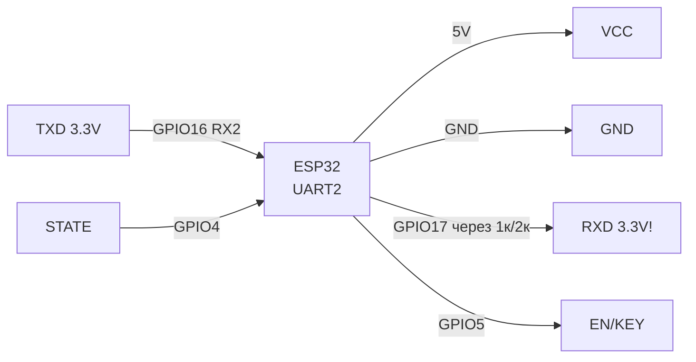
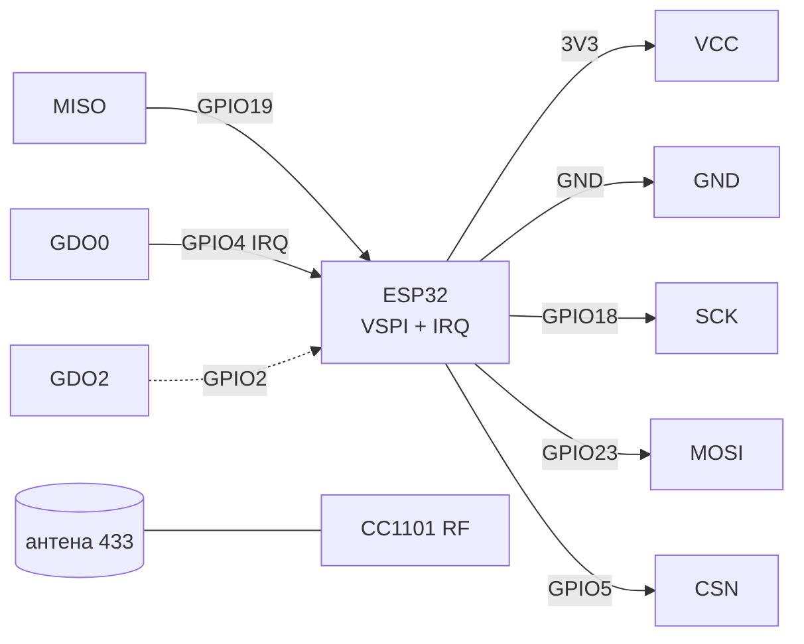
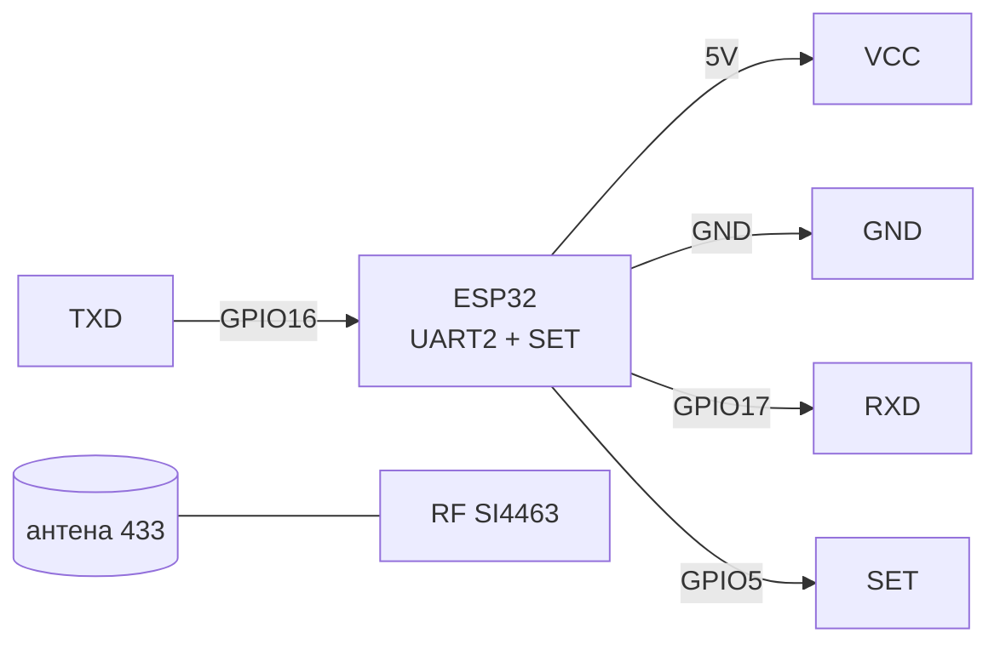

# HC-05 / HM-10 BLE / CC1101 / HC-12 - радіомодулі UART+SPI

> [!info] Призначення
> Нотатка про «довгі» радіоканали: **HC-05** (Bluetooth Classic SPP - послідовний порт per радіо), **HM-10** (BLE 4.0 on CC2541 - економний міст for телефону), **CC1101** (Sub-GHz трансивер 315/433/868/915 МГц per SPI - пакети, своя адресація), **HC-12** (готовий UART-міст 433 МГц on SI4463 - «прозорий» послідовний порт on 1 км). Усі чотири знімають проблему «немає Wi-Fi in полі».

Характеристики (порівняльна table):

| module | Стандарт | Інтерфейс | Живлення / логіка | Дальність | Швидкість |
| --- | --- | --- | --- | --- | --- |
| HC-05 (CSR BC417) | BT Classic 2.0 SPP | UART (завод. 9600, AT 38400) | VCC 5V (on платі LDO), логіка 3.3V! | 10 м (with антеною-доріжкою) | до 1382400 бод UART, реально 100-200 кбіт/с |
| HM-10 (CC2541) | BLE 4.0 | UART 9600 | VCC 3.3V (5V вбиває!) | 30-60 м | ~5-10 кБ/с (GATT notify) |
| CC1101 | Sub-GHz 315/433/868/915 | SPI + GDO0/GDO2 | 3.3V | 100-300 м (залежить from антени) | 0.6-600 кбіт/с, настроюється |
| HC-12 (SI4463) | 433 МГц FSK (пропрієтарно) | UART 9600 (1200-115200) | 3.3-5V, TX до 100 мВт (FU4) | 100-1000 м | 5 кбіт/с per ефіру типово (FU3) |

Навігація: UART [[04-Interfaces/01-UART|UART]], SPI [[04-Interfaces/02-SPI|SPI]], живлення [[02-Power-Supply/01-Lancjugi-zhivlennya]], базовий радіоогляд [[EN/12-Comm-Modules/02-NRF24-LoRa.en]], start [[EN/Home.en]].

## Purpose

HC-05 / HM-10 BLE / CC1101 / HC-12 - радіомодулі UART+SPI - HC-05 Bluetooth Classic (UART-міст SPP); Легенда пінів модуля HC-05; AT-команди HC-05 (базові, закінчення. HC-05 / HM-10 BLE / CC1101 / HC-12 - радіомодулі UART+SPI. Навігація: UART [[04-Interfaces/01-UART|UART]], SPI [[04-Interfaces/02-SPI|SPI]], живлення [[02-Power-Supply/01-Lancjugi-zhivlennya]], базовий радіоогляд 12-Comm-Modules/02-NRF24-LoRa, start Home.

## 1. HC-05 Bluetooth Classic (UART-міст SPP)

module-«модем»: після pairing with телефоном/ПК все, that приходить in UART, летить per радіо. Два режими: **DATA** (прозорий міст) and **AT** (configuration: ім'я, PIN, швидкість, роль master/slave).

Вхід in AT-режим: утримувати кнопку / подати HIGH on **EN (KEY)** ДО подачі живлення → LED блимає повільно (2 с), швидкість AT 38400. Якщо подати HIGH on EN під час роботи - «міні-AT» on робочій швидкості.

![[assets/img/hc05-scheme.png|500]]
*Fig. HC-05 - живлення 5V, логіка 3.3V via дільник on RX, EN for AT-режиму.*

### Module pin legend HC-05

| Пін | Тип | Куди | Примітка |
| --- | --- | --- | --- |
| VCC (5V) | Живлення вхід | 5V (VIN) | on платі LDO 3.3V; струм in pairing до 80 мА; див. [[02-Power-Supply/01-Lancjugi-zhivlennya]] |
| GND | Земля | GND | Спільна земля |
| TXD | Вихід UART, рівень 3.3V | GPIO16 (RX2 ESP32) | Безпосередньо, without дільника (3.3V ок) |
| RXD | Вхід UART, рівень 3.3V! | GPIO17 (TX2) via дільник 1к/2к | not подавати 5V TX безпосередньо - деградація CSR-чипа; дільник обов'язковий |
| EN / KEY | Вхід режиму | GPIO5 (або кнопка до 3V3) + живлення | HIGH до ввімкнення = AT 38400; HIGH під час роботи = міні-AT; LOW/NC = DATA-режим |
| STATE | Вихід статусу | GPIO4 (опційно) | HIGH = with'єднано (paired), LOW = очікування; зручно for LED/пробудження |

### AT-команди HC-05 (базові, закінчення `\r\n`, відповідь `OK`)

| Команда | Призначення | example відповіді |
| --- | --- | --- |
| `AT` | check зв'язку | `OK` |
| `AT+VERSION?` | Версія firmwares | `+VERSION:2.0-20100601` |
| `AT+NAME?` / `AT+NAME=MyESP` | Ім'я пристрою | `OK` |
| `AT+PSWD?` / `AT+PSWD=1234` | PIN pairing | `OK` |
| `AT+UART?` / `AT+UART=115200,0,0` | Швидкість, stop, parity | `OK` |
| `AT+ROLE?` / `AT+ROLE=0` | 0=slave, 1=master, 2=slave-loop | `OK` |
| `AT+CMODE=1` | Підключатись до будь-якої адреси (master) | `OK` |
| `AT+RESET` | Перезапуск with новими налаштуваннями | `OK` |

### ASCII schematic

```text
ESP32 DevKit              HC-05 (ZS-040)
─────────────              ─────────────
5V (VIN) ───────────────►  VCC 5V
GND ────────────────────   GND
GPIO16 (RX2) ◄──────────   TXD (3.3V, безпосередньо)
GPIO17 (TX2) ──[1к/2к]─►   RXD (3.3V! дільник обов'язково)
GPIO5 ─────────────────►   EN/KEY (HIGH перед живленням = AT 38400)
GPIO4 ◄─────────────────   STATE (HIGH=paired, опційно)

Дільник на RXD: GPIO17 --1к--+-- RXD, + --2к-- GND.
AT-режим: EN=HIGH → подати живлення → Serial2 38400 → "AT\r\n" → OK.
```

### Mermaid



## 2. HM-10 BLE 4.0 (CC2541)

BLE-міст for телефону (nRF Connect, BLE Terminal). Дешеві клони часто on CC2541 with прошивкою HM-10/HM-11. Увага: клони **CC41-A** відповідають `AT`, але ігнорують частину команд - перевіряти `AT+VERS?`.

> [!warning] HM-10 живиться ТІЛЬКИ 3.3V! Пін VCC 5V on деяких платах відсутній - подача 5V вбиває CC2541 миттєво.

![[assets/img/hm10-scheme.png|500]]
*Fig. HM-10 - живлення 3.3V безпосередньо, UART перехресно, BRK for пробудження.*

### Module pin legend HM-10

| Пін | Тип | Куди | Примітка |
| --- | --- | --- | --- |
| VCC (3.3V) | Живлення вхід | 3V3 ESP32 | Тільки 3.3V! 5V = смерть; струм ~10 мА, піки 20 мА |
| GND | Земля | GND | Спільна земля |
| TXD | Вихід UART 3.3V | GPIO16 (RX2) | Безпосередньо |
| RXD | Вхід UART 3.3V | GPIO17 (TX2) | Безпосередньо (обидва 3.3V - дільник not потрібен) |
| BRK / PIO0 | Вхід/вихід стану | GPIO5 (опційно) | on оригіналі - розрив with'єднання (LOW ≥100 мс); on клонах функція може бути відсутня |
| STATE | Вихід статусу | GPIO4 (опційно) | HIGH = connected |

### AT-команди HM-10 (without `?` on читання in клонів - формат varies!)

| Команда | Призначення | Примітка |
| --- | --- | --- |
| `AT` | Ping | Відповідь `OK` |
| `AT+VERS?` / `AT+VERR?` | Версія | in клонів CC41-A команда `AT+VERR?` |
| `AT+NAME?` / `AT+NAMEesp32` | Ім'я (without `=` in оригіналу!) | Оригінал: `AT+NAMEesp32`; клони: `AT+NAMExyz` |
| `AT+BAUD?` / `AT+BAUD4` | Швидкість: 0=9600 … 4=115200 | Після зміни перепідключити UART |
| `AT+ROLE?` / `AT+ROLE0` | 0=peripheral, 1=central | for моста with телефоном - 0 |
| `AT+RESET` | Застосувати налаштування | Обов'язково після BAUD/NAME |

## 3. CC1101 Sub-GHz (SPI, 433 МГц)

Гнучкий трансивер TI: частота, модуляція (2-FSK/GFSK/ASK/OOK), потужність - усе регістрами. Бібліотеки Arduino: `ELECHOUSE_CC1101`, `RadioLib`. Потребує зовнішньої антени 433 МГц (пружинка або штир 17.3 см on 433 МГц).

### Module pin legend CC1101

| Пін | Тип | Куди | Примітка |
| --- | --- | --- | --- |
| VCC | Живлення вхід | 3V3 | 3.3V, струм TX до 30 мА; 5V вбиває |
| GND | Земля | GND | Спільна земля, коротка |
| CSN (CS) | Вхід SPI | GPIO5 | Chip select, active low |
| SCK | Вхід SPI | GPIO18 | VSPI SCK |
| MOSI (SI) | Вхід SPI | GPIO23 | VSPI MOSI |
| MISO (SO/GDO1) | Вихід SPI | GPIO19 | VSPI MISO; одночасно GDO1 |
| GDO0 | Вихід цифра | GPIO4 | Переривання пакета (sync Word received / TX done); ключовий пін for RX |
| GDO2 | Вихід цифра | GPIO2 (опційно) | RSSI / carrier sense; можна NC |
| ANT | RF | Антена 433 МГц | without антени not вмикати TX on повну потужність - відбите погіршує вихідний каскад |

### ASCII schematic

```text
ESP32 DevKit              CC1101 (433МГц)
─────────────              ──────────────
3V3 ────────────────────►  VCC 3.3V
GND ────────────────────   GND
GPIO18 (SCK) ───────────►  SCK
GPIO23 (MOSI) ──────────►  MOSI/SI
GPIO19 (MISO) ◄──────────  MISO/SO
GPIO5 (CS) ─────────────►  CSN
GPIO4 ◄─────────────────   GDO0 (IRQ пакета!)
GPIO2 ◄─────────────────   GDO2 (опційно)
                           ANT ══► антена 433МГц (пружина/штир 17.3см)
```

### Mermaid



## 4. HC-12 SI4463 (UART-міст 433 МГц, до 1 км)

Найпростіший дальній канал: два HC-12 with однаковими каналом (FU3, 9600, CH001) утворюють прозорий міст. Налаштування - AT-команди in режимі **SET=LOW** (module спить for UART-даних, слухає AT on тій же швидкості 9600).

> [!warning] Антена обов'язкова до подачі живлення! TX without антени on FU4 (100 мВт) перегріває SI4463.

### Module pin legend HC-12

| Пін | Тип | Куди | Примітка |
| --- | --- | --- | --- |
| VCC (3.3-5V) | Живлення вхід | 5V (рекоменд.) або 3V3 | 5V дає повну потужність TX; струм TX до 200 мА (FU4) - електроліт 470 мкФ! |
| GND | Земля | GND | Спільна земля |
| TXD | Вихід UART | GPIO16 (RX2) | Рівень 3.3V; якщо VCC=5V - все одно 3.3V логіка виходу, безпосередньо ок |
| RXD | Вхід UART 3.3V | GPIO17 (TX2) | via дільник 1к/2к якщо живимо module from 5V and TX ESP32 3.3V - безпосередньо зазвичай ок, але дільник безпечніший for 5V-плат |
| SET | Вхід режиму | GPIO5 | LOW (GND) = AT-режим; HIGH/NC = прозорий міст; перемикати on зупиненому UART |
| ANT | RF | Пружинна антена with комплекту | Накрутити ДО ввімкнення; for 1 км - спрямовані/штирьові антени on обох кінцях |

### AT-команди HC-12 (вводити with SET=LOW, 9600 8N1, відповідь `OK+...`)

| Команда | Призначення | example |
| --- | --- | --- |
| `AT` | Ping | `OK` |
| `AT+V` | Версія | `OK+HC-12_V2.4` |
| `AT+FU3` | Режим: FU1..FU4 (дальність/швидкість) | FU3 = золота середина (9600 ефір) |
| `AT+B9600` | Швидкість UART | `OK+B9600` |
| `AT+C001` | Канал 001-127 (433.4 + C×0.4 МГц) | Обидва модулі - один канал! |
| `AT+P8` | Потужність 1-8 (мін-макс 100 мВт) | P8 for максимуму |
| `AT+U` | Зчитати всі налаштування | `OK+FU3 ...` |
| `AT+DEFAULT` | Скидання до заводських | `OK+DEFAULT` |

### ASCII schematic

```text
ESP32 DevKit              HC-12
─────────────              ─────
5V ─────────────────────►  VCC (3.3-5V, +470мкФ!)
GND ────────────────────   GND
GPIO16 (RX2) ◄──────────   TXD
GPIO17 (TX2) ──────────►   RXD
GPIO5 ─────────────────►   SET (LOW=AT, HIGH/NC=міст)
                           ANT ══► пружина 433МГц (ДО живлення!)
```

### Mermaid



## Code - UART-міст (HC-05 / HM-10 / HC-12 спільний)

### Arduino (прозорий міст USB ↔ радіо + AT-режим)

```cpp
// Міст: Serial (USB) <-> Serial2 (радіомодуль). Для AT HC-05: EN=HIGH, Serial2 38400.
// Для HC-12 AT: SET=LOW, Serial2 9600.
#define R_RX 16
#define R_TX 17
#define R_MODE 5  // EN (HC-05) або SET (HC-12)
void setup() {
  pinMode(R_MODE, OUTPUT);
  digitalWrite(R_MODE, HIGH); // для HC-05 AT; для HC-12 AT поставити LOW
  Serial.begin(115200);
  Serial2.begin(38400, SERIAL_8N1, R_RX, R_TX); // HC-05 AT=38400; HM-10/HC-12=9600
  Serial.println("Міст готовий. Вводьте AT-команди:");
}
void loop() {
  while (Serial.available()) Serial2.write(Serial.read());
  while (Serial2.available()) Serial.write(Serial2.read());
}
```

### ESP-IDF (UART2 міст with подіями)

```c
#include "driver/uart.h"
#define RX 16
#define TX 17
void app_main(void) {
    uart_config_t c = {.baud_rate = 9600, .data_bits = UART_DATA_8_BITS,
        .parity = UART_PARITY_DISABLE, .stop_bits = UART_STOP_BITS_1,
        .flow_ctrl = UART_HW_FLOWCTRL_DISABLE, .source_clk = UART_SCLK_DEFAULT};
    uart_param_config(UART_NUM_2, &c);
    uart_set_pin(UART_NUM_2, TX, RX, -1, -1);
    uart_driver_install(UART_NUM_2, 1024, 1024, 0, NULL, 0);
    uint8_t b;
    while (1) {
        int n = uart_read_bytes(UART_NUM_2, &b, 1, pdMS_TO_TICKS(100));
        if (n > 0) uart_write_bytes(UART_NUM_1, (char*)&b, 1); // ехо в USB-UART
    }
}
```

### MicroPython (UART-міст + AT-ping)

```python
from machine import UART, Pin
import time
mode = Pin(5, Pin.OUT)
mode.value(0)  # HC-12: SET LOW = AT-режим (для HC-05: 1)
u = UART(2, baudrate=9600, rx=16, tx=17, timeout=200)
time.sleep_ms(200)
u.write("AT\r\n")
time.sleep_ms(200)
print("Відповідь:", u.read())
# Прозорий режим: читаємо радіо і друкуємо
mode.value(1)
while True:
    if u.any():
        print("RX:", u.readline())
```

### Arduino (CC1101 TX/RX - RadioLib, спрощено)

```cpp
// Потрібна бібліотека RadioLib. GDO0=4, CS=5, SCK=18, MISO=19, MOSI=23.
#include <RadioLib.h>
CC1101 radio = new Module(5, 4, RADIOLIB_NC, RADIOLIB_NC, SPI);
void setup() {
  Serial.begin(115200);
  SPI.begin(18, 19, 23, 5);
  int s = radio.begin(433.92, 4.8, 5.0, 135.0, 10, 16); // MHz, br, dev, rxBW, power, preamble
  Serial.println(s == RADIOLIB_ERR_NONE ? "CC1101 OK" : "CC1101 FAIL");
}
void loop() {
  radio.transmit("hello esp32");
  delay(1000);
  String s; int st = radio.receive(s);
  if (st == RADIOLIB_ERR_NONE) Serial.println("RX: " + s);
}
```

## typical errors

| # | Symptom | Cause | Виправлення |
| --- | --- | --- | --- |
| 1 | HC-05 not відповідає on AT | DATA-режим замість AT; швидкість not 38400 | EN=HIGH → перепідключити живлення → 38400 8N1, закінчення `\r\n` |
| 2 | HC-05 спалено / гріється | RXD підключено до 5V TX безпосередньо | Дільник 1к/2к on RXD; логіка модуля 3.3V |
| 3 | HM-10 мовчить | Живлення 5V (згорів) або переплутані TX/RX | Тільки 3.3V; поміняти TX/RX місцями; `AT` without `\r\n` in деяких клонів |
| 4 | HM-10 not бачить телефон | ROLE=1 (central) або not вийшов with AT | `AT+ROLE0` + `AT+RESET`; шукати via nRF Connect |
| 5 | CC1101 `FAIL` on init | Немає живлення 3.3V / поганий CSN / довгі SPI-дроти | verify 3.3V, CSN=GPIO5, SPI <15 см, `SPI.begin(18,19,23,5)` |
| 6 | CC1101/HC-12 мала дальність | without антени / різні канали / метал поруч / FU1 with високою швидкістю | Накрутити антену 433 МГц; один канал; винести with металевого корпусу; HC-12 → FU3/P8 |
| 7 | HC-12 видає сміття | Різні швидкості UART on двох кінцях; SET бовтається | Однакові `AT+B` and `AT+FU` on обох; SET підтягнути до HIGH (10к) in робочому режимі |
| 8 | HC-12 not входить in AT | SET перемкнули on живому UART without паузи | SET=LOW → затримка 100 мс → відкрити 9600 → `AT` |

![[assets/img/bt-subghz-scheme.png|500]]
*Fig. Загальна схема: HC-05/HM-10/HC-12 on різних UART, CC1101 on VSPI with GDO0.*

## Official sources

- [HC-05 - розбір with фото and кодом (LME)](https://lastminuteengineers.com/hc05-bluetooth-arduino-tutorial/) - AT-режим 38400, master/slave, дільник on RX.
- [ESP32 BLE - туторіал with кодом (RNT)](https://randomnerdtutorials.com/esp32-bluetooth-low-energy-ble-arduino-ide/) - GATT server/scanner, база for HM-10.
- [nRF24L01 - радіопрактики with фото (LME)](https://lastminuteengineers.com/nrf24l01-arduino-wireless-communication/) - SPI-радіо, антени, живлення (for CC1101/HC-12).
- CC2541 (HM-10) / CC1101 - ti.com, HC-12 (SI4463) - silabs.com: *verify вручну*.
- CC41 BLE-module (Jiangsu, пошук PDF): [CC41 search](https://www.alldatasheet.com/view.jsp?Searchword=CC41) - дешевий BLE-UART міст.

## See also

- [[04-Interfaces/01-UART|UART]] - UART2, швидкості, перехрестя TX/RX
- [[04-Interfaces/02-SPI|SPI]] - VSPI for CC1101
- [[02-Power-Supply/01-Lancjugi-zhivlennya]] - живлення 5V/3.3V, LDO, електроліти on TX-піки
- [[EN/12-Comm-Modules/01-RC522-RFID.en]] - сусідній радіомодуль (антенні практики)
- [[EN/12-Comm-Modules/02-NRF24-LoRa.en]] - NRF24/LoRa how альтернатива CC1101/HC-12
- [[13-Power-Modules/02-Level-Shifters]] - дільники and перетворювачі рівнів рівнів 5V↔3.3V
- [[EN/Home.en]] - startова сторінка довідника
