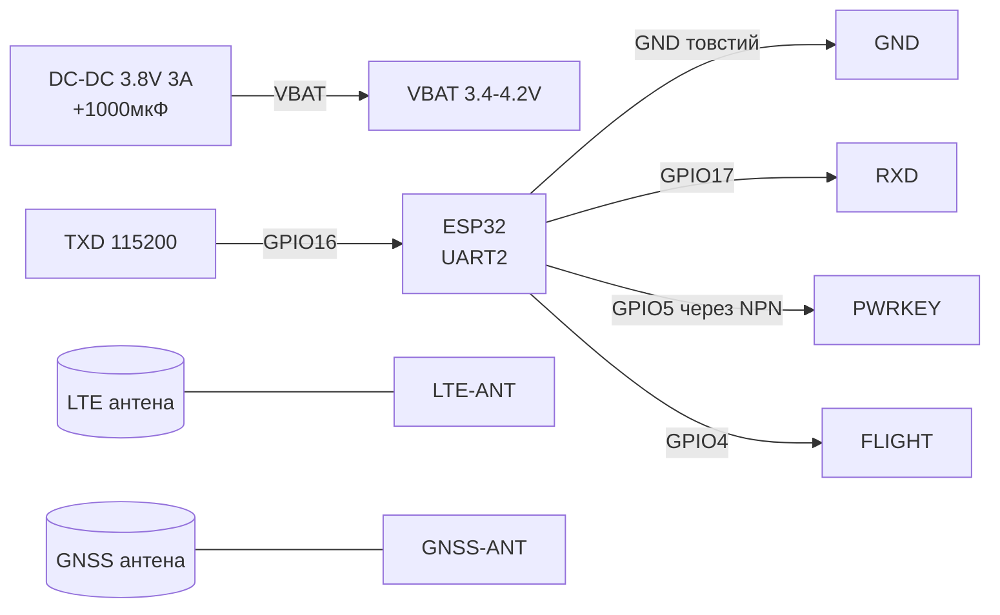
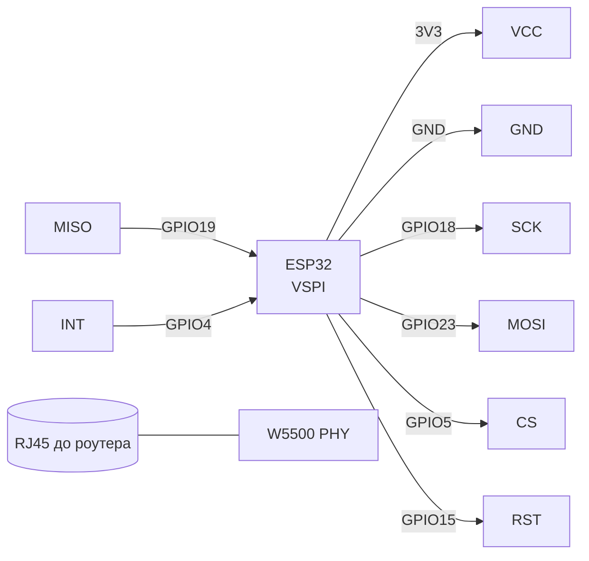
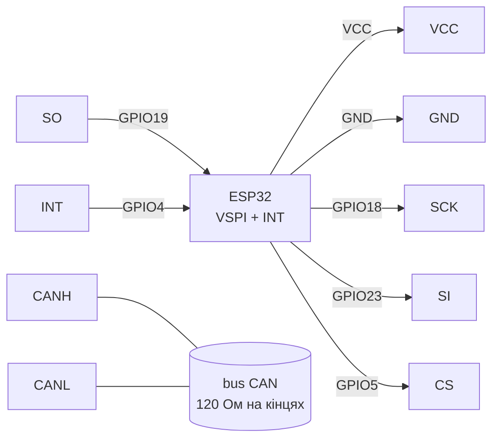

# SIM7600E 4G LTE / W5500 Ethernet / MCP2515 CAN - важка артилерія зв'язку

> [!info] Призначення
> Нотатка про канали «високого рівня»: **SIM7600E** (4G LTE + GNSS, MQTT/HTTP безпосередньо with ESP32 per UART), **W5500** (апаратний TCP/IP Ethernet per SPI - стабільніший for ENC28J60), **MCP2515 + TJA1050** (CAN 2.0B per SPI for авто/промисловості). Спільне: усі вимагають уважного живлення and дають надійний канал туди, де Wi-Fi немає або заборонено.

Характеристики (порівняльна table):

| module | Стандарт | Інтерфейс | Живлення | Особливості |
| --- | --- | --- | --- | --- |
| SIM7600E-H | LTE Cat-1 / 4G + GNSS | UART 115200 (USB-diagnostics) | VBAT 3.4-4.2V, піки 3A! | MQTT/HTTP/FTP AT-команди, слот nano-SIM, антени LTE + GNSS |
| W5500 | 10/100 Ethernet, апаратний TCP/IP | SPI до 80 МГц (реально 20-30) | 3.3V, ~150 мА | 8 сокетів, бібліотека Ethernet (Arduino), RST + INT |
| MCP2515 + TJA1050 | CAN 2.0B 5 кбіт/с-1 Мбіт/с | SPI + INT | module 5V (логіка MISO 3.3V ок) або версія 3.3V | Кварц 8 МГц, термінатор 120 Ом, H/L диференційна пара |

Навігація: UART [[04-Interfaces/01-UART|UART]], SPI [[04-Interfaces/02-SPI|SPI]], живлення [[02-Power-Supply/01-Lancjugi-zhivlennya]], SIM800L/GPS [[EN/12-Comm-Modules/03-SIM800L-GPS.en]], start [[EN/Home.en]].

## Purpose

SIM7600E 4G LTE / W5500 Ethernet / MCP2515 CAN - важка артилерія зв'язку - SIM7600E 4G LTE (UART, VBAT 3A!); Легенда пінів модуля SIM7600E; AT-команди SIM7600E (базові,. SIM7600E 4G LTE / W5500 Ethernet / MCP2515 CAN - важка артилерія зв'язку. Навігація: UART [[04-Interfaces/01-UART|UART]], SPI [[04-Interfaces/02-SPI|SPI]], живлення [[02-Power-Supply/01-Lancjugi-zhivlennya]], SIM800L/GPS 12-Comm-Modules/03-SIM800L-GPS, start Home.

## 1. SIM7600E 4G LTE (UART, VBAT 3A!)

Старший брат SIM800L: справжній 4G + GPS on борту. Головна відмінність from SIM800L - живлення **3.4-4.2V** (типово 3.8V) and піки **до 3A** in момент реєстрації in мережі. from USB-UART DevKit живити ЗАБОРОНЕНО - окремий DC-DC 5V→3.8V 3A + електроліт 1000 мкФ.

Увімкнення: імпульс **PWRKEY LOW ≥1 с** (кнопка on платі або GPIO via транзистор). Статус: **NETLIGHT** блимає (повільно = зареєстровано), **FLIGHT** (режим польоту).

![[assets/img/sim7600-scheme.png|500]]
*Fig. SIM7600E - окремий БЖ 3.8V 3A, PWRKEY імпульс, антени LTE+GNSS.*

### Module pin legend SIM7600E

| Пін | Тип | Куди | Примітка |
| --- | --- | --- | --- |
| VBAT (3.4-4.2V) | Живлення вхід | DC-DC 3.8V 3A окремий! | not 5V and not 3.3V: 5V вбиває, 3.3V дає перезавантаження on реєстрації; електроліт 1000 мкФ + кераміка 100 нФ біля VBAT |
| GND | Земля | GND (товстий провід!) | Спільна земля with ESP32; струм 3A - провід ≥0.5 мм², короткий |
| TXD | Вихід UART | GPIO16 (RX2) | 115200 8N1; рівень 3.3V/1.8V залежно from плати - via дільник/перетворювач рівнів for потреби |
| RXD | Вхід UART | GPIO17 (TX2) | Перехресно; деякі плати 1.8V-логіка - потрібен level-shifter |
| PWRKEY | Вхід, active low | GPIO5 (via NPN/кнопка) | Імпульс LOW 1-2 с = on/off; not тримати постійно LOW |
| FLIGHT | Вхід, active high | GPIO4 або NC | HIGH = режим польоту (радіо вимкнено); for роботи - LOW/GND |
| NETLIGHT / STATUS | Вихід індикації | LED / GPIO (опційно) | Блимає 1 Гц = пошук мережі, 1 раз/3 с = зареєстровано |
| LTE-ANT / GNSS-ANT | RF (IPEX) | Антени with комплекту | without LTE-антени реєстрації not буде; GNSS-антена - активна, винести до вікна |

### AT-команди SIM7600E (базові, `\r\n`)

Формат шпаргалок in базі єдиний: `Команда → Відповідь OK → that означає → typical error` (див. також зведену шпаргалку in [[EN/12-Comm-Modules/03-SIM800L-GPS.en]] and повну on 35 команд in [[EN/12-Comm-Modules/18-Cellular-LoRa-2.en]]).

| Команда | Відповідь OK | that означає | typical error |
| --- | --- | --- | --- |
| `AT` | `OK` | Ping модема | Тиша: baud/порт/живлення |
| `AT+CPIN?` | `+CPIN: READY` | SIM готова | `SIM PIN`: ввести PIN або зняти CLCK |
| `AT+CSQ` | `+CSQ: 20,99` | Рівень (≥10 ок) | 99,99: немає антени/мережі |
| `AT+CREG?` / `AT+CEREG?` | `+CEREG: 0,1` | Зареєстровано | 0,2 довго: антена/SIM/діапазон |
| `AT+CGATT=1` | `OK` | Приєднано data | ERROR: немає реєстрації - спочатку CREG |
| `AT+CSTT="apn"` | `OK` | APN оператора | APN with великої літери - відмова |
| `AT+CIICR` | `OK` | Data-with'єднання активне | Чекати до 30 с; ні - APN/покриття |
| `AT+CIFSR` | `10.x.x.x` | IP видано | ERROR: спочатку CIICR |
| `AT+CIPSTART="TCP","broker",1883` | `CONNECT OK` | TCP відкрито | `CONNECT FAIL`: broker/порт/файрвол |
| `AT+CGPS=1` | `OK` | GNSS увімкнено | Координати: `AT+CGPSINFO`; without антени - нулі |

### ASCII schematic

```text
ESP32 DevKit              SIM7600E
─────────────              ────────
DC-DC 3.8V 3A ──────────►  VBAT (3.4-4.2V! +1000мкФ біля піна)
GND (товстий!) ═════════   GND
GPIO16 (RX2) ◄──────────   TXD (115200)
GPIO17 (TX2) ──────────►   RXD
GPIO5 ──[NPN]──────────►   PWRKEY (LOW 1-2с = on/off)
GPIO4 ─────────────────►   FLIGHT (LOW=робота)
                           LTE-ANT ══► антена (ОБОВ'ЯЗКОВО!)
                           GNSS-ANT ═► GPS-антена до вікна
                           nano-SIM в слот (зняти PIN на телефоні!)

ЗАБОРОНЕНО: живити VBAT від 5V / 3V3 DevKit / USB-UART!
```

### Mermaid



## 2. W5500 Ethernet (SPI, апаратний TCP/IP)

Чип Wiznet with апаратним стеком: TCP/UDP/DHCP/DNS without навантаження on ESP32. on відміну from ENC28J60 - стабільний on 100 Мбіт, бібліотека Arduino `Ethernet` (W5500 підтримується with v2.0). Режим: SPI Mode 0, до 33 МГц (рекоменд. 14-28 МГц).

![[assets/img/w5500-scheme.png|500]]
*Fig. W5500 - SPI on VSPI, RST and INT обов'язкові, RJ45 with трансформатором on платі.*

### Module pin legend W5500

| Пін | Тип | Куди | Примітка |
| --- | --- | --- | --- |
| VCC 3.3V | Живлення вхід | 3V3 | Тільки 3.3V, ~150 мА; піки at лінку - електроліт 100 мкФ; див. [[02-Power-Supply/01-Lancjugi-zhivlennya]] |
| GND | Земля | GND | Спільна земля |
| SCK | Вхід SPI | GPIO18 | VSPI SCK, до 33 МГц |
| MISO | Вихід SPI | GPIO19 | VSPI MISO |
| MOSI | Вхід SPI | GPIO23 | VSPI MOSI |
| CS / SCS | Вхід SPI | GPIO5 | Chip select |
| RST | Вхід, active low | GPIO15 | Апаратний reset: LOW 10 мс at startі; without нього після brownout зависає |
| INT | Вихід, active low | GPIO4 | Переривання сокетів; можна NC (polling), але with INT економія CPU |
| RJ45 | Ethernet | Вита пара до роутера | Link/Activity LED on роз'ємі: зелений=лінк, жовтий=активність |

### ASCII schematic

```text
ESP32 DevKit              W5500
─────────────              ─────
3V3 ────────────────────►  VCC 3.3V (+100мкФ!)
GND ────────────────────   GND
GPIO18 (SCK) ───────────►  SCK
GPIO23 (MOSI) ──────────►  MOSI
GPIO19 (MISO) ◄──────────  MISO
GPIO5 (CS) ─────────────►  CS/SCS
GPIO15 ─────────────────►  RST (LOW 10мс при startі)
GPIO4 ◄─────────────────   INT (опційно, але рекомендовано)
                           RJ45 ══► роутер (вита пара)
```

### Mermaid



## 3. MCP2515 CAN (SPI) + TJA1050

CAN-контролер MCP2515 (SPI) + трансивер TJA1050 (диференційна bus CANH/CANL). Швидкість типово 125/250/500 кбіт/с (авто - 500 кбіт/с for легкових OBD-II запитів, 250 - вантажні/J1939). Кварц on модулі **8 МГц** (рідше 16 МГц - звірити with `MCP_8MHZ` / `MCP_16MHZ` in коді!). Термінатор **120 Ом** джампером `J1` - замкнути on двох крайніх вузлах.

### Module pin legend MCP2515

| Пін | Тип | Куди | Примітка |
| --- | --- | --- | --- |
| VCC | Живлення вхід | 5V (сині модулі) або 3V3 (зелені 3.3V-версії) | Синій module 5V: MISO вихід 3.3V-сумісний (дільник всередині) - безпосередньо ок; краще купити 3.3V-версію щоб not гріти голову |
| GND | Земля | GND | Спільна земля |
| CS | Вхід SPI | GPIO5 | Chip select |
| SO (MISO) | Вихід SPI | GPIO19 | Дані до ESP32 |
| SI (MOSI) | Вхід SPI | GPIO23 | Дані from ESP32 |
| SCK | Вхід SPI | GPIO18 | SPI до 10 МГц |
| INT | Вихід, active low | GPIO4 | Переривання прийому кадру - обов'язково for прийому without втрат |
| CANH / CANL | Диференційна пара | Вита пара до шини CAN | H/L not міняти місцями! Термінатор 120 Ом (J1) on крайніх вузлах |
| J1 (120R) | Джампер | Замкнути/розімкнути | Замкнути ТІЛЬКИ on 2 крайніх вузлах шини |

### ASCII schematic

```text
ESP32 DevKit              MCP2515+TJA1050
─────────────              ──────────────
5V або 3V3 ─────────────►  VCC (за версією плати!)
GND ────────────────────   GND
GPIO18 (SCK) ───────────►  SCK
GPIO23 (MOSI) ──────────►  SI
GPIO19 (MISO) ◄──────────  SO
GPIO5 (CS) ─────────────►  CS
GPIO4 ◄─────────────────   INT (обов'язково для RX!)
                           CANH ══► вита пара ══► CANH шини
                           CANL ══► вита пара ══► CANL шини
                           J1 [замкнути] якщо вузол крайній (120 Ом)

Увага: кварц 8МГц → MCP_8MHZ у коді! Якщо 16МГц → MCP_16MHZ.
```

### Mermaid



## Code

### Arduino (SIM7600E - MQTT publish via AT, спрощено)

```cpp
// SIM7600: TX->16, RX->17, PWRKEY->5, 115200. APN замінити на свій!
#define PWRKEY 5
void modemSend(const char* cmd, uint32_t wait = 1000) {
  Serial2.println(cmd);
  delay(wait);
  while (Serial2.available()) Serial.write(Serial2.read());
}
void setup() {
  Serial.begin(115200);
  Serial2.begin(115200, SERIAL_8N1, 16, 17);
  pinMode(PWRKEY, OUTPUT); digitalWrite(PWRKEY, HIGH);
  digitalWrite(PWRKEY, LOW); delay(1500); digitalWrite(PWRKEY, HIGH); // on
  delay(5000);
  modemSend("AT", 500);
  modemSend("AT+CPIN?", 500);
  modemSend("AT+CEREG?", 1000);
  modemSend("AT+CSTT=\"internet\"", 1000); // APN!
  modemSend("AT+CIICR", 3000);
  modemSend("AT+CIFSR", 1000);
  modemSend("AT+CIPSTART=\"TCP\",\"test.mosquitto.org\",1883", 3000);
  // Далі: CIP SEND з MQTT CONNECT/PUBLISH байтами (див. приклад TinyGSM).
}
void loop() {}
```

> [!tip] for продакшену використовуйте **TinyGSM** (`#define TINY_GSM_MODEM_SIM7600`): `modem.gprsConnect("internet")`, `mqtt.publish()` - without ручного складання AT.

### Arduino (W5500 WebClient - бібліотека Ethernet)

```cpp
#include <SPI.h>
#include <Ethernet.h>
byte mac[] = {0xDE, 0xAD, 0xBE, 0xEF, 0xFE, 0x01};
#define W5500_CS 5
#define W5500_RST 15
EthernetClient client;
void setup() {
  Serial.begin(115200);
  pinMode(W5500_RST, OUTPUT);
  digitalWrite(W5500_RST, LOW); delay(10); digitalWrite(W5500_RST, HIGH); delay(500);
  Ethernet.init(W5500_CS);
  SPI.begin(18, 19, 23, W5500_CS);
  if (Ethernet.begin(mac) == 0) { Serial.println("DHCP fail"); Ethernet.begin(mac, IPAddress(192,168,1,50)); }
  Serial.print("IP: "); Serial.println(Ethernet.localIP());
  if (client.connect("example.com", 80)) {
    client.println("GET / HTTP/1.0"); client.println("Host: example.com"); client.println();
    while (client.connected()) { while (client.available()) Serial.write(client.read()); }
    client.stop();
  }
}
void loop() { Ethernet.maintain(); delay(1000); }
```

### Arduino (MCP2515 CAN-send - бібліотека mcp_can)

```cpp
#include <SPI.h>
#include <mcp_can.h>
#define CAN_CS 5
#define CAN_INT 4
MCP_CAN CAN(CAN_CS);
void setup() {
  Serial.begin(115200);
  pinMode(CAN_INT, INPUT);
  SPI.begin(18, 19, 23, CAN_CS);
  // УВАГА: MCP_8MHZ або MCP_16MHZ — за кварцом на ТВОЇЙ платі!
  while (CAN.begin(MCP_ANY, CAN_500KBPS, MCP_8MHZ) != CAN_OK) { Serial.println("CAN init fail"); delay(500); }
  CAN.setMode(MCP_NORMAL);
  Serial.println("CAN OK 500kbps");
}
void loop() {
  byte d[8] = {0x01, 0x02, 0x03, 0x04, 0, 0, 0, 0};
  CAN.sendMsgBuf(0x100, 0, 8, d); // ID 0x100, стандартний кадр, 8 байт
  delay(500);
  if (!digitalRead(CAN_INT)) {
    long unsigned id; byte len; byte rx[8];
    CAN.readMsgBuf(&id, &len, rx);
    Serial.printf("RX ID=0x%lX len=%d\n", id, len);
  }
}
```

### ESP-IDF (W5500 via esp_eth, esp-idf ≥4.4)

```c
#include "esp_eth.h"
#include "esp_eth_mac_spi.h"
#include "esp_eth_phy_w5500.h"
// W5500 як esp_eth netif: mac_spi + phy_w5500, CS=5, INT=4, RST=15.
// Повний приклад: examples/ethernet/basic в ESP-IDF.
// Ключові кроки: spi_bus_add_device(VSPI) → eth_w5500_config_t → esp_eth_new_mac_spi()
// → esp_eth_new_phy_w5500() → esp_eth_driver_install() → esp_netif_attach().
void app_main(void) {
    // TODO: скопіювати examples/ethernet/basic, замінити піни:
    // .cs_gpio_num = 5, .int_gpio_num = 4, .sck=18, .miso=19, .mosi=23.
}
```

### MicroPython (W5500 - драйвер мережі, firmwares with w5500)

```python
import network, time
# Потрібна прошивка з підтримкою W5500 (network.WIZNET5K) + SPI.
from machine import SPI, Pin
spi = SPI(1, baudrate=28000000, sck=Pin(18), mosi=Pin(23), miso=Pin(19))
nic = network.WIZNET5K(spi, Pin(5), Pin(15))  # cs, rst
nic.active(True)
nic.ifconfig("dhcp")
time.sleep(2)
print("IP:", nic.ifconfig())
```

### MicroPython (MCP2515 - бібліотека mcp2515.py)

```python
from machine import SPI, Pin
import mcp2515  # community driver (rose/mcp2515-micropython)
spi = SPI(1, baudrate=10000000, sck=Pin(18), mosi=Pin(23), miso=Pin(19))
can = mcp2515.MCP2515(spi, cs=Pin(5, Pin.OUT), osc=8000000)  # 8МГц кварц!
can.set_bitrate(500000)
can.send(id=0x100, data=b"\x01\x02\x03\x04")
print("CAN TX OK")
```

## typical errors

| # | Symptom | Cause | Виправлення |
| --- | --- | --- | --- |
| 1 | SIM7600 перезавантажується at `CEREG`/`CIICR` | Живлення from DevKit/USB, піки 3A просаджують VBAT | Окремий DC-DC 3.8V 3A + 1000 мкФ біля VBAT, товстий GND |
| 2 | `+CPIN: NOT READY` / `SIM not inserted` | Nano-SIM without адаптера-контакту / PIN-code on SIM | Зняти PIN on телефоні; протерти контакти; вставити до клацання |
| 3 | `+CSQ: 0,0` / немає реєстрації | without LTE-антени; антена in приміщенні without вікон | Накрутити антену; винести до вікна; verify діапазони оператора (E-версія = Європа) |
| 4 | W5500 `DHCP fail` / `0.0.0.0` | Немає RST-імпульсу; CS конфлікт with іншим SPI-пристроєм; кабель without лінку | RST LOW 10 мс at startі; окремий CS; Link-LED має горіти; спробувати статичний IP |
| 5 | W5500 зависає після brownout | RST not смикається at просадці | RC-ланцюг on RST або GPIO-reset перед `Ethernet.begin()`; watchdog |
| 6 | CAN `init fail` | not той кварц in коді (8 vs 16 МГц); поганий SPI | Прочитати маркування кварца; `MCP_8MHZ`/`MCP_16MHZ`; SPI <20 см |
| 7 | CAN TX є, RX немає | Термінатор J1 розімкнуто наодинці / замкнуто посередині; різна швидкість | J1 замкнути on 2 крайніх; однакова швидкість (500k) on всіх вузлах; CANH/CANL not переплутані |
| 8 | CAN гріється TJA1050 | CANH/CANL коротять on 12V авто; переплутано VCC 5V/3.3V | verify шину мультиметром (60 Ом між H/L at 2 термінаторах); правильний VCC for версією плати |

![[assets/img/lte-eth-can-scheme.png|500]]
*Fig. Загальна схема: SIM7600 on UART2, W5500 and MCP2515 on спільному VSPI with різними CS.*

## Official sources

- [SIM7600X-H - даташити (SIMCom)](https://www.simcom.com/product/SIM7600X-H.html) - AT Manual, Hardware Design, VBAT 3.4-4.2V, фото.
- [W5500 - сторінка продукту with фото (WIZnet)](https://wiznet.io/products/ethernet-chips/w5500) - модулі, плати.
- [W5500 - документація with кодом (WIZnet)](https://docs.wiznet.io/Product/Chip/Ethernet/W5500) - ioLibrary приклади.
- [MCP2515 - даташит (PDF, Microchip)](https://ww1.microchip.com/downloads/en/DeviceDoc/MCP2515-Stand-Alone-CAN-Controller-with-SPI-20001801J.pdf) - регістри, маски/фільтри CAN.

## See also

- [[04-Interfaces/01-UART|UART]] - UART2 for SIM7600, швидкість 115200
- [[04-Interfaces/02-SPI|SPI]] - спільний VSPI for W5500 + MCP2515 (різні CS)
- [[02-Power-Supply/01-Lancjugi-zhivlennya]] - DC-DC 3.8V 3A, електроліти, товстий GND
- [[EN/12-Comm-Modules/03-SIM800L-GPS.en]] - молодший брат SIM7600 (2G, живлення 4V 2A)
- [[EN/12-Comm-Modules/01-RC522-RFID.en]] - SPI-практики (довжина, CS)
- [[EN/12-Comm-Modules/04-RS485-CAN-Ethernet-Kamera.en]] - RS485/CAN-кадр, термінатори
- [[EN/Home.en]] - startова сторінка довідника
