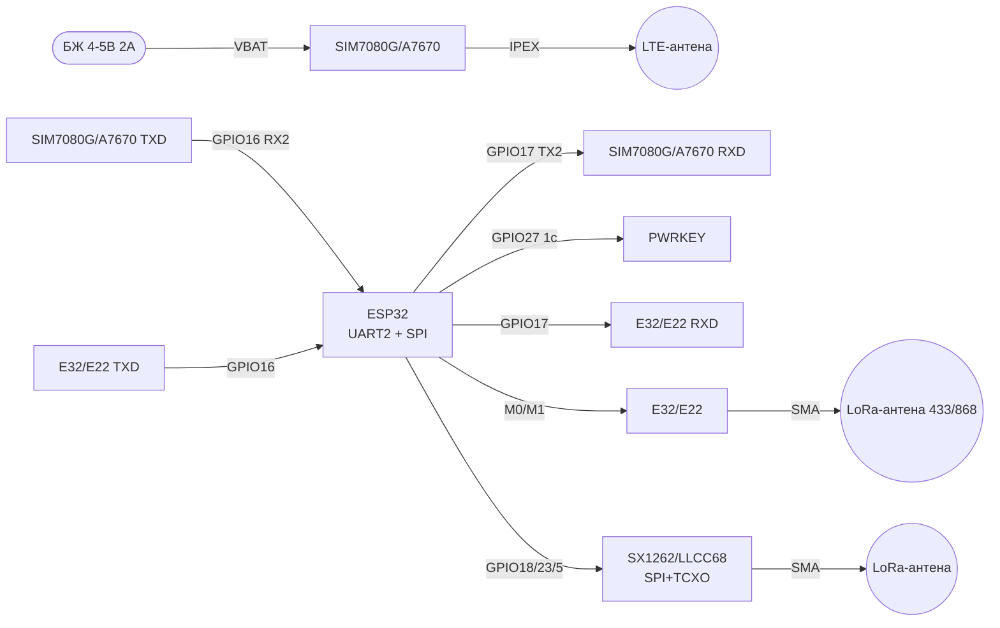

# Стільниковий та UART-радіо - SIM7080G, A7670, LoRa-UART E32, SX1262, HC-11

## Purpose

Далекобійний зв'язок for ESP32 without WiFi: NB-IoT/Cat-M module SIM7080G with GNSS,
4G-наступник SIM800 - A7670 (Cat-1, голос/SMS/дані),
UART LoRa-модеми E32-TTL-100 / E22 / RYLR998 (AT-команди, режими M0/M1, адресація AT+ADDRESS),
SPI-трансивери SX1262/LLCC68 with TCXO for точного LoRa,
but також оглядово HC-11 / JDY-40 / CC1310 / nRF52840.
База: SIM800L/GPS - [[EN/12-Comm-Modules/03-SIM800L-GPS.en]], NRF24/LoRa SPI - [[EN/12-Comm-Modules/02-NRF24-LoRa.en]],
SIM7600/4G - [[EN/12-Comm-Modules/07-SIM7600-W5500-MCP2515.en]], BT/Sub-GHz - [[EN/12-Comm-Modules/06-HC05-HM10-CC1101-HC12.en]].

> ЗАСТЕРЕЖЕННЯ ПРО АНТЕНИ: антени LTE (700-2700 МГц, роз'єм IPEX/SMA) and LoRa (433/868 МГц)
> not взаємозамінні! Передача in чужу антену = КСХ > 3, перегрів PA, вихід with ладу.
> LoRa/SIM-module without антени not вмикати in TX!

## Характеристики

| module | Мережа / діапазон | Інтерфейс | Живлення | Особливість |
| --- | --- | --- | --- | --- |
| SIM7080G | Cat-M1 + NB-IoT + GNSS, багатодіапазонний LTE | UART (AT), USB | 2.7-4.8 in, типово 4 in! Пік 2 but | PSM/eDRX - 10 років from батареї; PWRKEY for startу |
| A7670 (A7670E/G/SA) | 4G LTE Cat-1 + 2G fallback, голос/SMS/GNSS (залежить from субверсії) | UART (AT), USB | 3.4-4.2 in, пік 2 but | Наступник SIM800: ті ж AT-команди, сучасні мережі (2G вимикають!) |
| E32-TTL-100 (SX1276) | LoRa 410-441 МГц, 20 дБм | UART 1200-115200 + M0/M1 | 2.3-5.5 in (версії 3.3/5 in) | Прозорий/фіксований режими, адреса and канал per повітрю |
| E22 (SX1262) | LoRa 410-493 / 850-930 МГц, 22 дБм | UART + M0/M1 + AUX | 2.3-5.5 in | Новіший for E32: менше споживання, далі зв'язок |
| RYLR998 (RYLR896) | LoRa 868/915 МГц, AT-команди | UART 115200, AT+ADDRESS/AT+SEND | 3.3 in | Найпростіший start: адресована доставка with коробки |
| SX1262 / LLCC68 | LoRa 150-960 МГц, +22 дБм, −148 дБм | SPI + DIO1/BUSY/RESET | 3.3 in, TCXO on модулі | Точна частота (TCXO), LoRaWAN-стек, потрібна бібліотека RadioLib |
| HC-11 (CC1101) | FSK 433 МГц, −112 дБм | UART 9600-115200, AT | 3.3-5 in | Дешевий прозорий міст, without LoRa-модуляції |
| JDY-40 | 2.4 ГГц, пропрієтарний | UART, AT | 3.3 in | Заміна дроту on короткі дистанції |
| CC1310 / nRF52840 | Sub-1 ГГц (CC1310) / 2.4 ГГц + BLE + 802.15.4 (nRF52840) | SPI / UART, SoC | 3.3 in | SoC with радіо: прошивка замість AT-модему |

## Легенда пінів модуля

### SIM7080G (плата розробника / breakout)

| Pin | Label | Type | To ESP32 | Note |
| --- | --- | --- | --- | --- |
| 1 | VBAT | Живлення вхід | 4 in БЖ 2 but (DC-DC!) | not 3V3 DevKit! Пік 2 but at реєстрації in мережі |
| 2 | GND | Земля | GND | Товстий провід, common ground |
| 3 | TXD (модуля) | Вихід UART | GPIO16 (RX2 ESP32) | Перехресно TX→RX, 115200 |
| 4 | RXD (модуля) | Вхід UART | GPIO17 (TX2 ESP32) | Перехресно RX←TX |
| 5 | PWRKEY | Вхід, active low | GPIO27 | Імпульс LOW ≥1 с = увімкнення/вимкнення! |
| 6 | RESET | Вхід, active low | GPIO14 або NC | Аварійний скид ≥100 мс |
| 7 | STATUS | Вихід цифровий | GPIO34 (тільки вхід!) | HIGH = module увімкнено |
| 8 | NETLIGHT | Вихід | LED або NC | Блимання = статус мережі (64 мс ON/300 мс = пошук) |
| 9 | SIM_DATA/RST/CLK | SIM-картка | Тримач Nano-SIM on платі | NB-IoT SIM with підтримкою Cat-M/NB! |
| 10 | ANT_LTE | ВЧ-вихід | LTE-антена IPEX/SMA | ТІЛЬКИ LTE-антена, not LoRa! |
| 11 | ANT_GNSS | ВЧ-вихід | GNSS-антена (активна 3 in) | Окрема антена/комбо, вид on небо |

### A7670 (плата розробника)

| Pin | Label | Type | To ESP32 | Note |
| --- | --- | --- | --- | --- |
| 1 | VBAT | Живлення вхід | 5 in 2 but (свій DC-DC до 4 in) або 4 in | Пік 2 but! USB DevKit not тягне |
| 2 | GND | Земля | GND | Спільна земля |
| 3 | TXD | Вихід UART | GPIO16 (RX2) | Перехресно, 115200 |
| 4 | RXD | Вхід UART | GPIO17 (TX2) | Перехресно |
| 5 | PWRKEY | Вхід | GPIO27 | Імпульс LOW ~1 с for startу (how SIM800!) |
| 6 | RESET | Вхід | GPIO14 або NC | Аварійний скид |
| 7 | STATUS | Вихід | GPIO34 | HIGH = увімкнено |
| 8 | SIM-картка | Тримач | Nano-SIM 4G | Звичайна IoT/мобільна SIM |
| 9 | ANT | ВЧ-вихід | LTE-антена 700-2700 МГц | not LoRa-антена! |
| 10 | SPK/MIC | Аудіо | Динамік/мікрофон | Тільки версії with голосом (A7670E/SA) |

> A7670 - спадкоємець SIM800: AT-команди `AT+CPIN`, `AT+CSQ`, `AT+CGATT`, `AT+HTTP*` ті ж самі,
> але мережа 4G Cat-1 (2G in Україні/ЄС вимикають - SIM800 помирає, A7670 живе).

### E32-TTL-100 / E22 (LoRa-UART, режими M0/M1)

| Pin | Label | Type | To ESP32 | Note |
| --- | --- | --- | --- | --- |
| 1 | VCC | Живлення вхід | 3V3 або 5V (for версією!) | verify маркування плати |
| 2 | GND | Земля | GND | Спільна земля |
| 3 | TXD (модуля) | Вихід UART | GPIO16 (RX2) | Перехресно |
| 4 | RXD (модуля) | Вхід UART | GPIO17 (TX2) | Перехресно |
| 5 | M0 | Вхід режиму | GPIO27 | M0/M1: 00 норма, 11 сон, 10 WOR, 01 конфіг |
| 6 | M1 | Вхід режиму | GPIO14 | Перемикати тільки in сні! |
| 7 | AUX | Вихід, open-drain | GPIO34 + pull-up | HIGH = готовий; LOW = зайнятий TX/RX |
| 8 | ANT | ВЧ-вихід | LoRa-антена 433/868 МГц | Своя частота! not LTE-антена! |

Режими M0/M1:

| M1 | M0 | Режим | Призначення |
| --- | --- | --- | --- |
| 0 | 0 | Нормальний (Normal) | Прозора передача UART↔LoRa |
| 0 | 1 | WOR (пробудження) | Економія: періодичне прокидання |
| 1 | 0 | Енергозбереження (Power-saving) | Тільки прийом WOR-кадрів |
| 1 | 1 | Сон/configuration (Sleep) | AT-налаштування адреси/каналу/потужності |

`AT+ADDRESS`, `AT+NETWORKID`, `AT+BAND` - via UART in режимі Sleep; чекати AUX=HIGH після кожної команди!

### RYLR998 (LoRa AT-модем)

| Pin | Label | Type | To ESP32 | Note |
| --- | --- | --- | --- | --- |
| 1 | VCC | Живлення вхід | 3V3 | Тільки 3.3 in! |
| 2 | GND | Земля | GND | Спільна земля |
| 3 | TX | Вихід UART | GPIO16 (RX2) | 115200 for замовчуванням |
| 4 | RX | Вхід UART | GPIO17 (TX2) | `AT+SEND=<addr>,<len>,<data>` |
| 5 | RESET | Вхід | GPIO14 або NC | Скид |
| 6 | ANT | ВЧ-вихід | 868/915 МГц антена | Своя частота! |

`AT+ADDRESS=1`, `AT+NETWORKID=5`, `AT+BAND=868000000` - пара модулів with однаковим NETWORKID бачить одне одного.

### SX1262 / LLCC68 (SPI, TCXO)

| Pin | Label | Type | To ESP32 | Note |
| --- | --- | --- | --- | --- |
| 1 | VCC | Живлення вхід | 3V3 | Тільки 3.3 in, TX ~120 мА |
| 2 | GND | Земля | GND | Земля + екран антени |
| 3 | SCK | Вхід SPI | GPIO18 | До 8 МГц |
| 4 | MOSI | Вхід SPI | GPIO23 | ESP32 → радіо |
| 5 | MISO | Вихід SPI | GPIO19 | Радіо → ESP32 |
| 6 | NSS | Вхід CS | GPIO5 | Chip Select |
| 7 | RESET | Вхід reset | GPIO25 | Active low, імпульс at init |
| 8 | BUSY | Вихід | GPIO26 | HIGH = чіп зайнятий, чекати! |
| 9 | DIO1 | Вихід переривання | GPIO32 | RX Done / TX Done / CAD |
| 10 | ANT | ВЧ-вихід | LoRa-антена своєї частоти | without АНТЕНИ not ВМИКАТИ TX! |

> LLCC68 = здешевлений SX1262 without LoRaWAN-сертифікації (регістри ті ж, бібліотека RadioLib та ж).
> TCXO on модулі обов'язковий for LoRaWAN (дрейф without TCXO рве join).

## Схема підключення

| ESP32 | SIM7080G / A7670 | E32/E22/RYLR998 | SX1262/LLCC68 |
| --- | --- | --- | --- |
| GND | GND (товстий провід!) | GND | GND |
| GPIO16 (RX2) | TXD модуля | TXD модуля | - |
| GPIO17 (TX2) | RXD модуля | RXD модуля | - |
| GPIO27 | PWRKEY (імпульс 1 с!) | M0 | - |
| GPIO14 | RESET (опційно) | M1 | - |
| GPIO34 (вхід) | STATUS | AUX (+pull-up) | - |
| GPIO18/23/19/5 | - | - | SCK/MOSI/MISO/NSS |
| GPIO25 | - | - | RESET |
| GPIO26 | - | - | BUSY |
| GPIO32 | - | - | DIO1 |
| БЖ 4 in 2 but | VBAT SIM7080G | - | - |
| БЖ 5 in 2 but / 4 in | VBAT A7670 | - | - |
| 3V3/5V | - | VCC E32/E22 | - |
| 3V3 | - | VCC RYLR998 | VCC SX1262 |

Живлення стільникових - окремий DC-DC with запасом 2 but, див. [[02-Power-Supply/01-Lancjugi-zhivlennya]].
UART - [[04-Interfaces/01-UART|UART]], SPI - [[04-Interfaces/02-SPI|SPI]]. Baud стільникових and RYLR998: 115200 8N1.

### ASCII schematic

```text
ESP32 DevKit              SIM7080G (Cat-M/NB-IoT+GNSS, 4В!)
------------              -------------------------------
GND ═════════════════════ GND (товстий провід!)
GPIO16 (RX2) ◄──────────── TXD (115200)
GPIO17 (TX2) ────────────► RXD
GPIO27 ─────────────────► PWRKEY (LOW 1с = start!)
GPIO14 ─────────────────► RESET (опційно)
GPIO34 ◄───────────────── STATUS (HIGH=ON)
[БЖ 4В 2А] ─────────────► VBAT (НЕ 3V3 DevKit! пік 2А!)
ANT_LTE ──► LTE-антена (НЕ LoRa!)  ANT_GNSS ──► GNSS-антена
SIM: NB-IoT/Cat-M тариф! AT: CPIN→CSQ→CGATT→CNACT→HTTP

ESP32 DevKit              A7670 (4G-наступник SIM800)
------------              --------------------------
GND ═════════════════════ GND
GPIO16 ◄────────────────── TXD
GPIO17 ──────────────────► RXD
GPIO27 ─────────────────► PWRKEY (LOW ~1с)
[БЖ 5В 2А] ─────────────► VBAT (пік 2А при дзвінку/attach!)
ANT ──► LTE-антена 700-2700 МГц (НЕ LoRa!)
AT ті ж, що SIM800: AT+CPIN, AT+CSQ, AT+CGATT, AT+CMGS (SMS)

ESP32 DevKit              E32-TTL-100 / E22 (LoRa-UART)
------------              ---------------------------
GND ────────────────────► GND
GPIO16 ◄───────────────── TXD
GPIO17 ─────────────────► RXD
GPIO27 ─────────────────► M0
GPIO14 ─────────────────► M1 (режими: 00 норма, 11 конфіг!)
GPIO34 ◄───────────────── AUX (HIGH=готовий, чекати після AT!)
3V3/5V ─────────────────► VCC (за версією плати!)
ANT ──► LoRa-антена 433/868 МГц (НЕ LTE!) БЕЗ АНТЕНИ НЕ TX!

ESP32 DevKit              SX1262 / LLCC68 (SPI + TCXO)
------------              ---------------------------
3V3 ────────────────────► VCC (тільки 3.3В!)
GND ────────────────────► GND
GPIO18 ─────────────────► SCK
GPIO23 ─────────────────► MOSI
GPIO19 ◄───────────────── MISO
GPIO5 ──────────────────► NSS
GPIO25 ─────────────────► RESET
GPIO26 ◄───────────────── BUSY (чекати LOW перед командою!)
GPIO32 ◄───────────────── DIO1 (переривання)
ANT ──► LoRa-антена своєї частоти! TCXO на модулі для LoRaWAN.
```

### Mermaid



![[assets/img/cellular-nbiot-uartlora-scheme.png|600]]
*Fig. SIM7080G/A7670 per UART with окремим живленням, E32/E22 with M0/M1/AUX, SX1262 per SPI. Місце під схему - див. [[assets/README]].*

## Code ESP-IDF

```c
#include "driver/uart.h"
#include "driver/gpio.h"
#include "freertos/FreeRTOS.h"
#include "freertos/task.h"
#include <string.h>

#define MODEM_UART UART_NUM_2
#define PIN_PWRKEY 27

static void at_send(const char *cmd)
{
    uart_write_bytes(MODEM_UART, cmd, strlen(cmd));
    uart_write_bytes(MODEM_UART, "\r\n", 2);
}

static void at_read(int ms)
{
    uint8_t buf[256];
    int n = uart_read_bytes(MODEM_UART, buf, sizeof(buf) - 1, ms / portTICK_PERIOD_MS);
    if (n > 0) { buf[n] = 0; printf("MODEM: %s\n", buf); }
}

void app_main(void)
{
    uart_config_t u = {.baud_rate = 115200, .data_bits = UART_DATA_8_BITS,
                       .parity = UART_PARITY_DISABLE, .stop_bits = UART_STOP_BITS_1,
                       .flow_ctrl = UART_HW_FLOWCTRL_DISABLE};
    uart_param_config(MODEM_UART, &u);
    uart_set_pin(MODEM_UART, 17, 16, UART_PIN_NO_CHANGE, UART_PIN_NO_CHANGE);
    uart_driver_install(MODEM_UART, 2048, 2048, 0, NULL, 0);

    // PWRKEY: імпульс LOW 1 с (SIM7080G/A7670)
    gpio_config_t g = {.pin_bit_mask = 1ULL << PIN_PWRKEY, .mode = GPIO_MODE_OUTPUT};
    gpio_config(&g);
    gpio_set_level(PIN_PWRKEY, 1); vTaskDelay(500 / portTICK_PERIOD_MS);
    gpio_set_level(PIN_PWRKEY, 0); vTaskDelay(1200 / portTICK_PERIOD_MS);
    gpio_set_level(PIN_PWRKEY, 1); vTaskDelay(3000 / portTICK_PERIOD_MS);

    // SIM7080G: перевірка → рівень → attach → PDP → HTTP GET
    at_send("AT"); vTaskDelay(500 / portTICK_PERIOD_MS); at_read(500);
    at_send("AT+CPIN?"); at_read(500);
    at_send("AT+CSQ"); at_read(500);
    at_send("AT+CGATT=1"); at_read(2000);
    at_send("AT+CNACT=0,1"); at_read(3000);  // PDP-контекст
    // RYLR998/E32 у Sleep-режимі: AT+ADDRESS=1, AT+NETWORKID=5, чекати AUX=HIGH!
}
```

## Code Arduino

```cpp
#include <HardwareSerial.h>
HardwareSerial Modem(2);  // UART2: RX=16, TX=17
#define PIN_PWRKEY 27
#define PIN_STATUS 34

void at(const String &cmd, int wait_ms = 800) {
  Modem.println(cmd);
  unsigned long t = millis();
  while (millis() - t < (unsigned long)wait_ms) {
    if (Modem.available()) Serial.write(Modem.read());
  }
  Serial.println();
}

void modem_powerkey() {
  pinMode(PIN_PWRKEY, OUTPUT);
  digitalWrite(PIN_PWRKEY, HIGH); delay(500);
  digitalWrite(PIN_PWRKEY, LOW); delay(1200);  // імпульс 1 с!
  digitalWrite(PIN_PWRKEY, HIGH); delay(3000);
}

void setup() {
  Serial.begin(115200);
  Modem.begin(115200, SERIAL_8N1, 16, 17);
  pinMode(PIN_STATUS, INPUT);
  modem_powerkey();
  Serial.printf("STATUS=%d (1=ON)\n", digitalRead(PIN_STATUS));

  // --- SIM7080G NB-IoT ---
  at("AT"); at("AT+CPIN?"); at("AT+CSQ");
  at("AT+COPS?", 2000);
  at("AT+CGATT=1", 3000);
  at("AT+CNACT=0,1", 3000);

  // --- A7670 HTTP GET (після attach) ---
  // at("AT+HTTPINIT"); at("AT+HTTPPARA=\"URL\",\"http://example.com\"");
  // at("AT+HTTPACTION=0", 5000); at("AT+HTTPTERM");

  // --- RYLR998: адресована доставка ---
  // at("AT+ADDRESS=1"); at("AT+NETWORKID=5"); at("AT+BAND=868000000");
  // at("AT+SEND=2,5,HELLO");  // вузлу з ADDRESS=2, 5 байт
}

void loop() {
  // Міст USB↔модем для ручних AT-команд:
  while (Serial.available()) Modem.write(Serial.read());
  while (Modem.available()) Serial.write(Modem.read());
}
```

## Code MicroPython

```python
from machine import UART, Pin
import time

modem = UART(2, baudrate=115200, tx=17, rx=16, timeout=500)
pwrkey = Pin(27, Pin.OUT, value=1)
status = Pin(34, Pin.IN)

def at(cmd, wait=1.0):
    modem.write(cmd + "\r\n")
    time.sleep(wait)
    r = modem.read()
    print(cmd, "->", r.decode(errors="ignore") if r else "<тиша>")
    return r

# Старт модуля імпульсом PWRKEY
pwrkey.value(0); time.sleep(1.2); pwrkey.value(1); time.sleep(3)
print("STATUS:", status.value())

at("AT")
at("AT+CPIN?")
at("AT+CSQ")
at("AT+CGATT=1", 3)

# E32 у режимі Sleep (M0=1,M1=1): configuration адреси
m0, m1 = Pin(27, Pin.OUT), Pin(14, Pin.OUT)
aux = Pin(34, Pin.IN)
m0.value(1); m1.value(1); time.sleep_ms(100)
at("AT+ADDRESS=1")
while aux.value() == 0:  # чекати готовності!
    time.sleep_ms(50)
m0.value(0); m1.value(0)  # назад у Normal

# SX1262 по SPI — через RadioLib-порт або sx126x-драйвер:
# from sx1262 import SX1262
# sx = SX1262(spi_bus=2, clk=18, mosi=23, miso=19, cs=5, irq=32, rst=25, gpio=26)
# sx.begin(freq=868.0, bw=125.0, sf=9)  # БЕЗ АНТЕНИ НЕ ВИКЛИКАТИ!
```

## typical errors

AT-шпаргалки єдиного формату (команда → відповідь → зміст → error): зведена SIM800 - [[EN/12-Comm-Modules/03-SIM800L-GPS.en]], базова 4G - [[EN/12-Comm-Modules/07-SIM7600-W5500-MCP2515.en]], повна 35 команд - [[EN/12-Comm-Modules/18-Cellular-LoRa-2.en]]. Нижче - специфічні граблі цієї ноти:

1. **SIM7080G from 3V3 DevKit** → вічні ребути at attach. Пік 2 but! Окремий DC-DC 4 in 2 but + електроліт 470+ мкФ.
2. **without імпульсу PWRKEY** → тиша in UART. SIM7080G/A7670 startують тільки імпульсом LOW ~1 с, not появою живлення.
3. **Звичайна SIM without NB-IoT** → `+CGATT: 0`. for SIM7080G потрібен тариф/оператор with Cat-M/NB-IoT покриттям.
4. **LTE-антена on LoRa and навпаки** → КСХ > 3, смерть PA. Антени маркуються частотою: LTE 700-2700 МГц, LoRa 433/868 МГц.
5. **TX without антени** → перегрів вихідного каскаду. Правило: накрутив антену → живлення → AT → TX.
6. **TX-TX / RX-RX** → тиша. UART перехресно: TX модуля → RX ESP32 (GPIO16).
7. **E32 конфігурують in Normal-режимі** → AT ігноруються. M0=1/M1=1 (Sleep), чекати AUX=HIGH після кожної команди.
8. **AUX not перевіряють** → обрізані кадри. AUX=LOW означає «зайнятий»: not слати наступну команду/пакет.
9. **SIM800-code without змін on A7670** → частково працює, але HTTP/SMS-команди версійно відрізняються. Звірити AT Manual саме A7670.
10. **SX1262 without очікування BUSY** → биті команди. Перед кожною SPI-командою чекати BUSY=LOW.
11. **LLCC68 with LoRaWAN-стеком SX1262 without правок** → join not проходить. verify таблицю частот/TCXO in конфігу радіо.

## Official sources

- [SIM7080G - сторінка продукту with фото (SIMCom)](https://www.simcom.com/product/SIM7080G.html) - Cat-M/NB-IoT/GNSS, PSM/eDRX, AT Manual.
- [SIM7600X-H - даташити 4G-сім'ї (SIMCom)](https://www.simcom.com/product/SIM7600X-H.html) - AT Manual, VBAT 3.4-4.2 in, той же AT-підхід, that in A7670.
- [SX1262 - сторінка продукту (Semtech)](https://www.semtech.com/products/wireless-rf/lora-connect/sx1262) - +22 дБм, −148 дБм, даташит.
- [ESP32 + LoRa - туторіал with кодом (RNT)](https://randomnerdtutorials.com/esp32-lora-rfm95-transceiver-arduino-ide/) - Sender/Receiver, антена обов'язково.
- [ESP-IDF UART - документація with кодом (Espressif)](https://docs.espressif.com/projects/esp-idf/en/latest/esp32/api-reference/peripherals/uart.html) - uart_param_config, AT-обмін.

## See also

- [[EN/Home.en]]
- [[EN/12-Comm-Modules/02-NRF24-LoRa.en]]
- [[EN/12-Comm-Modules/03-SIM800L-GPS.en]]
- [[EN/12-Comm-Modules/06-HC05-HM10-CC1101-HC12.en]]
- [[EN/12-Comm-Modules/07-SIM7600-W5500-MCP2515.en]]
- [[04-Interfaces/01-UART|UART]]
- [[04-Interfaces/02-SPI|SPI]]
- [[02-Power-Supply/01-Lancjugi-zhivlennya]]
- [[02-Power-Supply/02-LDO-DC-DC]]
- [[99-Additions/02-Troubleshooting-FAQ]]
