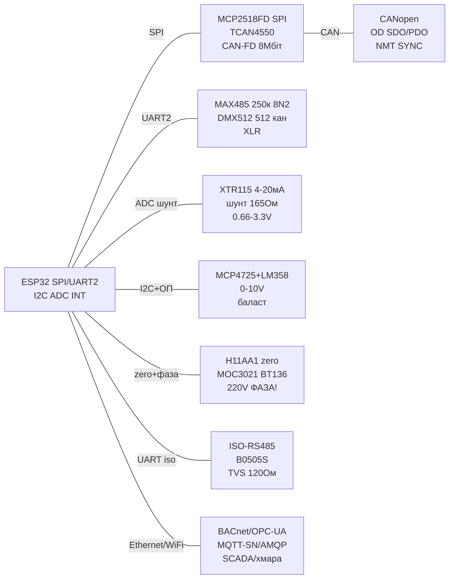

# Industrial fieldbus: CANopen / DMX512 / KNX / DALI / 4-20 мА / 0-10 in / TRIAC / BACnet / CAN-FD

![[assets/img/industrial-fieldbus-scheme.png|600]]
*Fig. 1. Цеховий вузол ESP32: CANopen/CAN-FD, DMX-світло, петля 4-20 мА, димер 0-10 in, TRIAC with zero-cross, ізольований RS485 - with гальванічною розв'язкою from 220 in.*

> [!danger] 220 in - СМЕРТЕЛЬНО НЕБЕЗПЕЧНО!
> TRIAC-димер, zero-cross детектор and БЖ 220 in - this мережева напруга! Монтаж тільки at вимкненому автоматі, check індикатором, корпус IP54+, запобіжник + варистор on вході. Нуль (N) and земля (PE) - not одне й те саме! without досвіду with мережами 220 in - not повторювати, віддати електрику. ESP32-сторона завжди via оптопари (MOC3021/PC817/H11AA1) + ізольований DC-DC.
>
> [!warning] Ізоляція обов'язкова!
> Цех = довгі лінії + перешкоди + різні потенціали земель. RS485/CAN without ізоляції згорають першими. Правило: логіка ESP32 ↔ (ADuM/ISO + ізольований DC-DC) ↔ польова сторона. Пробита ізоляція = пробитий ESP32 and пожежа in щиті.

## Purpose

Цехова нота-міст from [[12-Comm-Modules/04-RS485-CAN-Ethernet-Kamera|RS485/CAN-камери]] та [[04-Interfaces/05-CAN-TWAI-RS485]] до промислових шин: CANopen (об'єктний словник, SDO/PDO оглядово), DMX512 (сценічне світло via MAX485 on 250 кбод!), KNX/DALI оглядово (that живе in будівлях), струмова петля 4-20 мА (передавач XTR115 + прийом шунтом 165 Ом → 3.3 in!), димер 0-10 in (ЦАП + ОП), TRIAC-димер with детектором переходу via нуль (MOC3021 + H11AA1!, ІЗОЛЯЦІЯ), оглядова table BACnet/OPC-UA/MQTT-SN/AMQP «that for цеху», CAN-FD контролери MCP2518FD/TCAN4550 та ізольовані RS485-модулі. Живлення - тільки via [[02-Power-Supply/01-Lancjugi-zhivlennya]] with захистом.

> Де that живе: станок/робот - CANopen; сцена/клуб - DMX512; будівля/офіс - KNX/DALI/BACnet; датчики тиску/рівня on 100+ м - 4-20 мА; старі світильники/вентилятори - 0-10 in; лампи розжарювання/ТЕНи - TRIAC with zero-cross; хмари/ SCADA - OPC-UA/MQTT.

## Характеристики

| Параметр | CANopen (CC/FD) | DMX512 | KNX / DALI (оглядово) |
| --- | --- | --- | --- |
| Фізичний рівень | CAN ISO 11898-2, 10 кбіт-1 Мбіт (CC) / до 8 Мбіт дані (FD) | RS485 + UART 250 кбод 8N2! | KNX: вита пара 9600 + 30 in; DALI: 2 дроти 1200 бод, 16 in |
| Модель даних | Об'єктний словник (OD): індекси 0x1000-0x9FFF | 512 каналів-слотів, кадр BREAK+MAB | KNX: групові адреси; DALI: 64 адреси + 16 груп |
| Сервіси | SDO (configuration) / PDO (реальний час) / NMT / SYNC / EMCY / Heartbeat | Постійний потік кадрів ~44 Гц, without підтверджень | KNX: телеграми; DALI: команди лампам/баластам |
| Адресація | Node-ID 1-127, COB-ID | Універс 1-512, startова адреса приладу | KNX: area.line.device; DALI: short address |
| Довжина | До 1000 м (on низьких бодах), 120 Ом термінатори | До 300-1200 м, 120 Ом, 32 прилади on сегмент! | KNX до 1000 м/сегмент; DALI до 300 м |
| ESP32 | TWAI (CC) + MCP2518FD/TCAN4550 (FD!) | UART + MAX485 (DE завжди TX!) | Шлюзи/мости (not GPIO безпосередньо!) |

| Параметр | Петля 4-20 мА (XTR115) | Прийом 4-20 мА (шунт!) | Димер 0-10 in |
| --- | --- | --- | --- |
| Передавач | XTR115: 2-провідний, Vref 2.5 in, живлення петлі 7.5-36 in | Шунт 165 Ом → 0.66-3.3 in for ADC ESP32! | ЦАП MCP4725 → ОП LM358 → 0-10 in |
| Струм / точність | 4 мА = 0%, 20 мА = 100%, обрив = 0 мА (diagnostics!) | 4 мА×165 Ом = 0.66 in; 20 мА×165 Ом = 3.30 in | 0 in = min, 10 in = max, вхідний опір баласта ~100 кОм |
| Ізоляція | Рекомендовано ISO124/AMC1301 | TVS + RC + ОП-буфер | ОП with живленням 12 in + опторазв'язка PWM-альтернативи |
| protection | Обмеження струму, зворотна полярність | PTC + TVS 5 in on ADC! | Діод Шотткі, обмеження 11 in |
| Застосування | Датчики тиску/температури/рівня in цех | ESP32 приймає цехові датчики | Драйвери LED/вентилятори/заслінки |

| Параметр | TRIAC-димер + zero-cross (MOC3021!) | CAN-FD MCP2518FD / TCAN4550 | Ізольований RS485 |
| --- | --- | --- | --- |
| key | BT136/BTA16 + MOC3021 (random-phase!) / MOC3041 (zero-cross вбудований); BTA24 - до 25 but in ізольованому корпусі for ламп/ТЕНів понад 2 кВт | SPI→CAN-FD до 8 Мбіт дані, 32 FIFO | ISO1410 / ADM2587E / MAX14850 + iso-DC-DC |
| Детектор нуля | H11AA1/PC814 + 2×100 кОм до 220 in! | Кварц 20/40 МГц, INT | ADuM1201 + ізольований 5 in |
| Керування | Фазова відсічка: затримка 0-10 мс після zero | SPI 10-20 МГц, переривання | DE/RE + термінатор 120 Ом |
| Навантаження | R (лампи/ТЕНи); L/C - тільки зі снабером! | CANH/CANL вита пара | A/B вита пара + GND-екран |
| protection | Запобіжник + варистор + снабер 100 Ом+100 нФ | TVS CAN, спільний GND шини | TVS A/B, газорозрядники on вулиці |

| Протокол «that for цеху» | Рівень | Транспорт | Коли брати |
| --- | --- | --- | --- |
| Modbus RTU/TCP | Поле/цех | RS485 / Ethernet | Насоси, лічильники, ПЛК - перший вибір |
| CANopen | Поле/маbus | CAN | Приводи, енкодери, модулі вводу |
| DMX512 | Сцена | RS485-250к | Світло, дим, лебідки сцени |
| KNX | Будівля | Вита пара 30 in | Освітлення/жалюзі/клімат офісу |
| DALI-2 | Будівля/світло | 2 дроти 16 in | Адресні світильники, аварійне світло |
| BACnet MS/TP-IP | Будівля/BMS | RS485 / IP | Вентиляція, чилери, облік енергії |
| OPC-UA | Цех/SCADA | TCP | Історія, аларми, MES/шлюз до хмари |
| MQTT / MQTT-SN | IoT/цех | TCP / UDP | Телеметрія ESP32 → broker → SCADA |
| AMQP | IT/черги | TCP | Надійні черги між сервісами (not поле!) |

## Легенда пінів модуля

| MAX485 → DMX512 (перепрошивка!) | Призначення | Куди |
| --- | --- | --- |
| VCC / GND | 5 in (MAX485) / 3.3 in (MAX3485!) | 5V / GND |
| DI / RO | TX / RX UART | GPIO17 / GPIO16 (UART2 250 кбод 8N2!) |
| DE + RE (міст!) | TX-режим завжди for DMX-передавача | VCC via 1 кОм (передавач!) / GPIO4 (приймач) |
| A / B | DMX+ / DMX− (XLR-3: 1=GND, 2=−, 3=+) | Вита пара, 120 Ом on кінцях! |

| XTR115 (петля) | Призначення | Куди |
| --- | --- | --- |
| LOOP+ / LOOP− | Петля 7.5-36 in from цехового БЖ! | Цеховий БЖ + датчик |
| VIN / IRET | Вхід напруги / повернення струму | Дільник from сенсора + GND петлі |
| VREF 2.5 in | Опора/збудження моста | Міст тензодатчика |
| VREG 5 in | Живлення зовнішнього ОП | ОП/сенсор (ліміт ~10 мА!) |

| Прийом 4-20 мА (шунт 165 Ом!) | Призначення | Куди |
| --- | --- | --- |
| LOOP+ → R165 → LOOP− | 4 мА→0.66 in, 20 мА→3.30 in | R165 прецизійний 0.1%! |
| Середина R → RC → ADC | 1 кОм + 100 нФ + TVS 3.6 in | GPIO36 (ADC1!) via повторювач |
| GND петлі → GND ESP32 | Тільки via ізоляцію/диф! | Краще AMC1301/ISO124! |

| 0-10 in димер | Призначення | Куди |
| --- | --- | --- |
| MCP4725 VOUT 0-3.3 in | ЦАП I2C 0x60 | GPIO21 / GPIO22 |
| LM358 ×3 | Підсилення 0-3.3 → 0-10 in | Живлення ОП 12-15 in! |
| OUT 0-10 in / GND | До баласта/драйвера | Екран, TVS 12 in |

| TRIAC + zero-cross (220 in!) | Призначення | Куди |
| --- | --- | --- |
| H11AA1 AC1/AC2 | 220 in via 2×100 кОм 0.5 Вт! | Мережа L/N + запобіжник! |
| H11AA1 OUT | Імпульс 100 Гц (кожен нуль!) | GPIO34 (вхід!) + pull-up |
| MOC3021 LED | Керування (10-15 мА!) | GPIO25 via 330 Ом |
| MOC3021 TRIAC | Запалювання BT136 | Gate BT136 + снабер! |
| BT136 A1/A2 | Силовий key 220 in | L → навантаження → N, радіатор! |

| MCP2518FD / TCAN4550 (CAN-FD) | Призначення | Куди |
| --- | --- | --- |
| VCC / GND | 3.3 in | 3V3 / GND + 100 нФ ×2 |
| SCK/SI/SO/CS | SPI 10-20 МГц | GPIO18/23/19/5 ([[04-Interfaces/02-SPI | SPI]]) |
| INT | Переривання кадрів | GPIO27 |
| CANH / CANL | Шина FD, 120 Ом! | Вита пара, TVS |
| STBY (TCAN4550) | Режим трансивера | GPIO (HIGH = standby) |

| Ізольований RS485 | Призначення | Куди |
| --- | --- | --- |
| VCC-logic / GND-logic | 3.3 in ESP32 | 3V3 / GND |
| DI / RO / DE/RE | UART + керування | GPIO17 / GPIO16 / GPIO4 |
| VCC-iso / GND-iso | Ізольовані 5 in (B0505S!) | Польова сторона, окремий GND! |
| A / B | Польова пара + TVS | Вита пара + 120 Ом |

## Схема підключення

| ESP32 | CAN/CAN-FD | DMX/RS485-iso | 4-20 мА / 0-10 in | TRIAC/zero | Примітка |
| --- | --- | --- | --- | --- | --- |
| 3V3 | MCP2518FD VCC | Logic VCC | MCP4725 VCC | MOC LED via 330 Ом | Логіка 3.3 in |
| 5V-iso | - | ISO VCC (B0505S!) | ADS/ОП цифра | - | Ізольовані 5 in! |
| GND | GND | Logic GND | GND | GND логіки | Польовий GND окремо! |
| GPIO18/19/23/5 | SPI CAN-FD | - | SPI ADS1256 | - | Шина SPI |
| GPIO27 | CAN-FD INT | - | ADS DRDY | - | Переривання |
| GPIO16/17 | - | RO/DI UART2 | - | - | UART2: DMX 250к 8N2! |
| GPIO4 | - | DE+RE | - | - | HIGH=TX |
| GPIO21/22 | - | - | MCP4725 I2C | - | ЦАП 0-10 in |
| GPIO36 | - | - | Шунт 165 Ом → ADC! | - | 0.66-3.3 in |
| GPIO34 | - | - | - | H11AA1 zero | Вхід 100 Гц |
| GPIO25 | - | - | - | MOC3021 LED | Фаза 0-10 мс! |
| CANH/L, A/B | Вита пара 120 Ом | Вита пара 120 Ом | Петля цехова | 220 in L/N | TVS + запобіжники! |

### ASCII schematic

```text
  ESP32-DevKitC              Цехові модулі                  Поле
 +---------------+     +----------------------+     ------------------
 | GPIO18/23/19/5|---->SCK/SI/SO/CS (MCP2518FD SPI 20МГц, INT->G27)
 |               |     CANH/CANL --вита пара--> CANopen bus [120 Ом x2]
 | GPIO16/17 (U2)|---->RO/DI (ISO-RS485 / DMX MAX485, 250к 8N2 для DMX!)
 | GPIO4         |---->DE+RE (HIGH=TX)   A/B --вита пара--> DMX-прилади
 | 3V3/GND       |---->logic VCC/GND     B0505S -> iso-5V (ІЗОЛЯЦІЯ!)
 | GPIO21/22     |---->MCP4725 -> LM358 x3 -> 0-10V -> баласт
 | GPIO36 (ADC1) |<---- шунт 165 Ом (4мА=0.66V,20мА=3.3V!) <- петля XTR115
 | GPIO34        |<---- H11AA1 (220V через 2x100k!) ZERO-CROSS 100Гц
 | GPIO25 --330R |---->MOC3021 -> Gate BT136 -> ЛАМПА/ТЕН 220V!
 +---------------+     +----------------------+     ------------------
  220V: запобіжник + варистор + снабер! Корпус закритий! N і PE не плутати!
  Петля 4-20мА живиться від ЦЕХОВОГО БЖ 24V, не від ESP32!
```

### Mermaid



## Code ESP-IDF

```c
#include "driver/uart.h"
#include "driver/twai.h"
#include "driver/adc.h"
#include "driver/gpio.h"
#include "esp_log.h"
static const char *TAG = "ind";

// DMX512-передавач: UART2 250000 8N2 + BREAK (>88 мкс LOW!)
static void dmx_send(uint8_t *slots, int n) {
    uart_set_line_inverse(UART_NUM_2, UART_SIGNAL_TXD_INV);
    // BREAK: тримати TX LOW ~100 мкс, MAB ~12 мкс, далі start-код 0x00 + 512 слотів
    uart_write_bytes(UART_NUM_2, "\x00", 1);
    uart_write_bytes(UART_NUM_2, (char*)slots, n);
}
// CANopen heartbeat (TWAI classic): COB-ID 0x700+ID, 1 байт state
static void canopen_hb(uint8_t node, uint8_t state) {
    twai_message_t m = {.identifier=0x700+node,.data_length_code=1,.data={state}};
    twai_transmit(&m, 100);
}
// 4-20 мА прийом: шунт 165 Ом -> 0.66..3.30 В -> ADC -> мА -> %
static float loop_pct(void) {
    int raw = adc1_get_raw(ADC1_CHANNEL_0); // GPIO36
    float v = raw * 3.3 / 4095.0;
    float ma = v / 165.0 * 1000.0; // шунт 165 Ом!
    return (ma - 4.0) / 16.0 * 100.0;
}
// TRIAC: zero-cross на GPIO34 (100 Гц), затримка фази 0-10000 мкс
static volatile int phase_us = 5000;
static void IRAM_ATTR zero_isr(void *a) {
    esp_rom_delay_us(phase_us);
    gpio_set_level(25, 1); esp_rom_delay_us(50); gpio_set_level(25, 0);
}

void app_main(void) {
    // UART2 DMX
    uart_config_t u = {.baud_rate=250000,.data_bits=UART_DATA_8_BITS,
        .parity=UART_PARITY_DISABLE,.stop_bits=UART_STOP_BITS_2,
        .flow_ctrl=UART_HW_FLOWCTRL_DISABLE,.source_clk=UART_SCLK_DEFAULT};
    uart_param_config(UART_NUM_2,&u);
    uart_set_pin(UART_NUM_2,17,16,-1,4); // TX,RX,DE
    uart_driver_install(UART_NUM_2,1024,0,0,NULL,0);
    // TWAI CANopen 250 кбіт
    twai_general_config_t g = TWAI_GENERAL_CONFIG_DEFAULT(5, 4, TWAI_MODE_NORMAL);
    twai_timing_config_t t = TWAI_TIMING_CONFIG_250KBITS();
    twai_filter_config_t f = TWAI_FILTER_CONFIG_ACCEPT_ALL();
    twai_driver_install(&g,&t,&f); twai_start();
    adc1_config_width(ADC_WIDTH_BIT_12);
    adc1_config_channel_atten(ADC1_CHANNEL_0, ADC_ATTEN_DB_11);
    gpio_set_direction(25, GPIO_MODE_OUTPUT); // MOC3021
    gpio_set_direction(34, GPIO_MODE_INPUT);
    gpio_set_intr_type(34, GPIO_INTR_POSEDGE);
    gpio_install_isr_service(0);
    gpio_isr_handler_add(34, zero_isr, NULL);
    uint8_t dmx[8] = {0,128,255,64,0,0,0,0};
    for (;;) {
        dmx_send(dmx, 8);
        canopen_hb(0x05, 0x05); // operational
        ESP_LOGI(TAG, "loop=%.1f%% phase=%d", loop_pct(), phase_us);
        vTaskDelay(pdMS_TO_TICKS(500));
    }
}
// MCP2518FD/TCAN4550: SPI-драйвер (coryjfowler/mcp2518fd), 20 МГц, INT-обробка FIFO.
// BACnet/OPC-UA/MQTT-SN: через Ethernet/W5500 або Wi-Fi, див. таблицю «що для цеху».
```

## Code Arduino

```cpp
#include <Wire.h>
#include <driver/twai.h>
#include <Adafruit_MCP4725.h>

Adafruit_MCP4725 dac;
#define DE_RE 4
#define ZERO 34
#define TRIAC 25
#define ECHO_ADC 36
volatile int phaseUs = 5000;

void IRAM_ATTR onZero() {
  delayMicroseconds(phaseUs); // фаза 0-10000 мкс!
  digitalWrite(TRIAC, HIGH); delayMicroseconds(50); digitalWrite(TRIAC, LOW);
}

void setup() {
  Serial.begin(115200);
  // DMX512-передавач: 250 кбод 8N2, DE завжди TX
  Serial2.begin(250000, SERIAL_8N2, 16, 17);
  pinMode(DE_RE, OUTPUT); digitalWrite(DE_RE, HIGH);
  pinMode(TRIAC, OUTPUT);
  pinMode(ZERO, INPUT);
  attachInterrupt(ZERO, onZero, RISING); // H11AA1: 100 Гц!

  // CANopen heartbeat через TWAI classic 250 кбіт
  twai_general_config_t g = TWAI_GENERAL_CONFIG_DEFAULT((gpio_num_t)5, (gpio_num_t)4, TWAI_MODE_NORMAL);
  twai_timing_config_t t = TWAI_TIMING_CONFIG_250KBITS();
  twai_filter_config_t f = TWAI_FILTER_CONFIG_ACCEPT_ALL();
  twai_driver_install(&g, &t, &f); twai_start();

  Wire.begin(21, 22);
  dac.begin(0x60); // 0-10 В через LM358 x3
  dac.setVoltage(2048, false); // ~5 В на виході димера
  analogReadResolution(12);
}

void loop() {
  // DMX кадр: BREAK + MAB + start 0x00 + слоти (спрощено через Serial2)
  Serial2.write(0x00); // start-код
  for (int i = 0; i < 8; i++) Serial2.write(i * 32);

  // 4-20 мА: шунт 165 Ом!
  int raw = analogRead(ECHO_ADC);
  float v = raw * 3.3 / 4095.0;
  float ma = v / 165.0 * 1000.0;
  float pct = (ma - 4.0) / 16.0 * 100.0;
  Serial.printf("loop=%.2fmA (%.0f%%) phase=%d\n", ma, pct, phaseUs);

  // CANopen heartbeat node 5 operational
  twai_message_t m; m.identifier = 0x705; m.data_length_code = 1; m.data[0] = 0x05;
  twai_transmit(&m, 10);
  // MCP2518FD (CAN-FD): бібліотека mcp2518fd, SPI 20 МГц, читати FIFO по INT
  delay(500);
}
```

## Code MicroPython

```python
from machine import Pin, UART, I2C, ADC
import time

# DMX512: UART 250 кбод 8N2, передавач (DE=HIGH)
de = Pin(4, Pin.OUT, value=1)
dmx = UART(2, 250000, bits=8, parity=None, stop=2, rx=16, tx=17)
i2c = I2C(0, scl=Pin(22), sda=Pin(21), freq=100000)
adc = ADC(Pin(36)); adc.atten(ADC.ATTEN_11DB)
triac = Pin(25, Pin.OUT, value=0)
zero = Pin(34, Pin.IN)
phase_us = 5000

def dac(v12, addr=0x60):
    i2c.writeto(addr, bytes([0x40, (v12 >> 4) & 0xFF, (v12 << 4) & 0xF0]))

def loop_pct():
    raw = adc.read()
    v = raw * 3.3 / 4095.0
    ma = v / 165.0 * 1000.0  # шунт 165 Ом -> 3.3V!
    return ma, (ma - 4.0) / 16.0 * 100.0

def zero_cb(p):
    # УВАГА: у перериванні мінімум коду! Фаза — блокуюча, для продакшену — RMT/timer!
    time.sleep_us(phase_us)
    triac.on(); time.sleep_us(50); triac.off()

zero.irq(trigger=Pin.IRQ_RISING, handler=zero_cb)
dac(2048)  # ~5 В на 0-10В димері

while True:
    dmx.write(b"\x00" + bytes([i * 32 for i in range(8)]))  # start + 8 слотів
    ma, pct = loop_pct()
    print("loop={:.2f}mA {:.0f}% phase={}".format(ma, pct, phase_us))
    # CANopen SDO/PDO на MicroPython — через TWAI немає API: тільки шлюз UART->Linux/CAN!
    # MCP2518FD — тільки C/Arduino; у MicroPython — сирий SPI-драйвер власноруч.
    time.sleep_ms(500)
```

### EtherCAT / PROFINET: чому ESP32 там гість

| Параметр | EtherCAT | PROFINET IRT |
| --- | --- | --- |
| Цикл | До 100 мкс, кадри «on льоту» | 250 мкс - 1 мс, синхронізований |
| PHY | Звичайний Ethernet, але спец-контролер (LAN9252!) | Звичайний Ethernet + стек |
| ESP32-роль | ТІЛЬКИ шлюз: LAN9252 per SPI → Modbus/MQTT далі | Шлюз/diagnostics, not учасник реального часу |
| Практика | ESP32 + LAN9252 = EtherCAT-slave for телеметрії (not for керування осями!) |

```text
Чесна межа: мікросекундні цикли вимагають апаратного контролера і RTOS-стека
з сертифікацією; ESP32 без спец-PHY встигає тільки «слухати і переказувати».
Для керування приводами з ESP32 — CANopen (див. вище) або Modbus TCP.
```

### EL817 - другий оптрон після PC817

| Параметр | PC817 (Sharp) | EL817 (Everlight) |
| --- | --- | --- |
| Призначення | Універсальна оптоізоляція цифра/аналог | Pin-to-pin аналог PC817 |
| CTR | 50-600 % (ранги A-D) | 50-600 % (ранги A-D) |
| Напруга ізоляції | 5 кВ | 5 кВ |
| Коли брати | that є in наявності - взаємозамінні; ранг CTR дивитись in маркуванні (C/D for малих струмів) |

```text
ESP32 GPIO ──[R 220–1к]──► LED оптопари ──► GND
Вихід: фототранзистор з pull-up до 3.3V (або 5V-сторона для TRIAC-драйвера MOC3021)
R розрахувати: If = 5–10 мА (не 20 «за звичкою» — CTR вистачить, а LED житиме довше)
```

## typical errors

| № | error | Symptom | Solution |
| --- | --- | --- | --- |
| 1 | Робота with 220 in without ізоляції/автомата | Удар струмом, пожежа | Автомат + індикатор + оптопари + закритий корпус; N/PE not плутати! |
| 2 | MOC3041 for димування | «Тільки вкл/викл» | MOC3041 - zero-cross (реле!), for фазового димера - тільки MOC3021 (random-phase!) |
| 3 | TRIAC without снабера on вентиляторі | Самовключення, гул | Снабер 100 Ом + 100 нФ + варистор; L-навантаження - TDA1085C або частотник! |
| 4 | Zero on кожен напівперіод without фільтра | Мерехтіння 100 Гц | Фільтр + гістерезис фази; затримка строго 0-10 мс; RMT-таймер замість delay in ISR! |
| 5 | DMX on 115200 8N1 | Прилади мовчать | DMX строго 250 кбод 8N2 + BREAK! DE передавача завжди HIGH! |
| 6 | DMX without термінатора / 64 прилади | Мерехтіння каналів | 120 Ом on кінцях, ≤32 прилади on сегмент, далі - сплітер/підсилювач! |
| 7 | Шунт 250 Ом for 5 in АЦП | ADC ESP32 вмер | for 3.3 in - строго 165 Ом (20 мА→3.3 in)! TVS 3.6 in + RC on вході! |
| 8 | Петля живиться from ESP32 | 0 мА, датчик мовчить | Петля - from цехового 24 in! ESP32 тільки приймає via шунт/ізоляцію! |
| 9 | 0-10 in from GPIO безпосередньо | Баласт not реагує/смердить | GPIO 3.3 in ≠ 10 in! ЦАП + ОП with живленням 12 in, спільна GND! |
| 10 | CAN without другого вузла/термінатора | bus-off | Мінімум 2 вузли + 2×120 Ом; вимкнена bus CANH-CANL ≈ 60 Ом! |
| 11 | CAN-FD on TWAI ESP32 | Немає FD-кадрів | ESP32-TWAI - тільки classic! FD - тільки MCP2518FD/TCAN4550 per SPI! |
| 12 | Неізольований RS485 in цеху | Згорілий MAX485 + ESP32 | ISO1410/ADM2587E + B0505S + TVS; екран до PE in одній точці! |
| 13 | KNX/DALI безпосередньо до GPIO | Згоріло все | KNX 30 in / DALI 16 in - тільки сертифіковані трансивери/шлюзи! |
| 14 | OPC-UA прямо on ESP32 without TLS | Злами/падіння | OPC-UA - on шлюзі (RPi/ПК), ESP32 - MQTT/Modbus до шлюзу! |
| 15 | PC817/EL817 without розрахунку If | 20 мА «for звичкою», деградація LED | If 5-10 мА for CTR-рангом; ранг дивитись in маркуванні |

## Official sources

- [CANopen - база знань and специфікації (CAN in Automation, CiA)](https://www.can-cia.org/can-knowledge/canopen) - об'єктний словник, SDO/PDO, NMT, профілі.
- [XTR115 - даташит передавача 4-20 мА (Texas Instruments)](https://www.ti.com/product/XTR115) - петля 7.5-36 in, Vref 2.5 in, IRET.
- [CAN Bus BFF - гайд with кодом MCP2515 (Adafruit Learn)](https://learn.adafruit.com/adafruit-can-bus-bff) - SPI→CAN, термінатор 120 Ом, 1 Мбіт.
- [W5500 - документація Ethernet-чіпа for шлюзів (WIZnet Docs)](https://docs.wiznet.io/Product/Chip/Ethernet/W5500) - TCP/IP-стек for BACnet/OPC-UA/MQTT-шлюзів.

### Ізольований вимір високої напруги: AMC1301 (example)

```text
Задача: міряти 0–400V DC шину без гальванічного зв'язку з ESP32.
  Шина 400V ──[дільник 390к/10к]──► AMC1301 (ізольований підсилювач, gain 8) ──►
  ──► диференційно в ADS1115/ESP32-ADC.
  Ізоляція 5 кВ всередині чипа; сторони живляться ОКРЕМО (ізольований DC-DC!).
  Альтернатива дешевше: ZMPT101B (AC) / PZEM (готовий) — див. 10-15 і 10-21.
  Без ізоляції високовольтний вимір = шлях до спаленого ESP32 і удару струмом!
```

## See also

- [[Home|Головна карта довідника]]
- [[12-Comm-Modules/04-RS485-CAN-Ethernet-Kamera|RS485/CAN/Ethernet/Камера]]
- [[04-Interfaces/05-CAN-TWAI-RS485|CAN/TWAI/RS485 шини]]
- [[02-Power-Supply/01-Lancjugi-zhivlennya|Ланцюги живлення]]
- [[04-Interfaces/01-UART|UART bus]]
- [[04-Interfaces/02-SPI|SPI bus]]
- [[10-Sensors/25-Mag-IMU-2|Магнітометри/IMU-2]]
- [[10-Sensors/26-Light-UV-IRArray-ToF|Світло/УФ/тепловізори/ToF]]
- [[10-Sensors/27-Time-Mem-IO-DAC|RTC/пам'ять/IO/ЦАП]]
- [[12-Comm-Modules/10-Industrial|Ця нота (якір графа)]]
- [[13-Power-Modules/02-Level-Shifters|Level-shifters]]
- [[99-Additions/02-Troubleshooting-FAQ|FAQ]]
