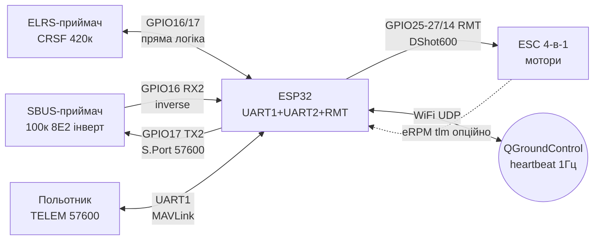

# RC-протоколи - SBUS / CRSF-ELRS / IBUS / MAVLink / DShot

## Purpose

ESP32 часто працює другим бортовим контролером поруч із RC-приймачем або польотником:
читає канали керування (SBUS/CRSF/IBUS), слухає телеметрію (S.Port/F.Port/CRSF-tlm/MAVLink),
генерує сигнали for регуляторів (DShot via RMT) або виступає MAVLink-вузлом
(телеметрійний міст до QGroundControl). Нота зводить формати кадрів, швидкості UART,
вимоги до інверсії сигналу та Ready парсери SBUS and MAVLink-heartbeat.

## Характеристики

| Протокол | Призначення | UART | Кадр | Каналів | Інверсія | Хто говорить |
| --- | --- | --- | --- | --- | --- | --- |
| SBUS (Futaba/FrSky) | канали RX→FC | 100000 8E2 | 25 байт, ~7-14 мс | 16 + 2 digital | ТАК, інвертований | приймач → ESP32 |
| Fast SBUS | канали, швидкий режим | 200000 8E2 | 25 байт | 16 + 2 | ТАК | приймач → ESP32 |
| CRSF (Crossfire/ELRS) | канали + телеметрія | 420000 8N1 | до 64 байт, CRC8-DVB-S2 | 16 | НІ | обидва напрямки |
| IBUS (FlySky) | канали RX→FC | 115200 8N1 | 32 байти, checksum | 14 | НІ | приймач → ESP32 |
| IBUS-телеметрія | сенсори → RX | 115200 8N1 | запит/відповідь | - | НІ | ESP32 → приймач |
| MAVLink v1/v2 | команди + телеметрія | будь-which (тип. 57600) | 8/12+ байт overhead | - | НІ | борт ↔ GCS |
| DShot150/300/600/1200 | FC → ESC | цифровий, not UART! | 16 біт + CRC4 | 1 thr/лінія | НІ | ESP32 → регулятор |
| S.Port (FrSky) | телеметрія | 57600 інверт. | polling per ID | - | ТАК | ESP32 → приймач |
| F.Port / F.Port2 | канали + телеметрія | 115200 інверт. | один провід | 16 | ТАК | обидва напрямки |

> DShot - not UART-протокол: this синхронна цифрова послідовність with власним таймінгом
> (біт = 1.67 мкс at DShot600). on ESP32 генерується via RMT або MCPWM,
> див. [[07-Timers/01-Timeri-MCPWM-PCNT-RMT]].

## SBUS - інвертований UART 100к 8E2

SBUS - де-факто стандарт передачі каналів: один провід несе 16 пропорційних каналів
(11 біт кожен: діапазон 0-2047, центр ~1024; FrSky видає 172-1811 at ±100%) плюс
2 цифрові канали (CH17/CH18), біт втрати кадру та біт failsafe. Кадр 25 байт:

- Байт[0]: заголовок `0x0F`.
- Байти[1-22]: 16 каналів × 11 біт, упаковані молодшим бітом уперед (LSB).
- Байт[23]: біти 0-1 = CH17/CH18, біт 2 = frame lost (`0x04`), біт 3 = failsafe (`0x08`).
- Байт[24]: футер `0x00` (in SBUS2 - `0x04`, ігнорувати).

Параметри лінії: **100000 бод, 8 біт даних, парність EVEN, 2 стоп-біти (8E2)**,
логіка **інвертована** (idle = LOW). Кадри йдуть кожні ~7-14 мс.

### Інвертор - обов'язковий

ESP32-UART for замовчуванням чекає non-inverted idle-HIGH, but SBUS-приймач видає
інверсію. Варіанти:

1. **Апаратна інверсія ESP32** (рекомендовано): `uart_set_line_inverse_mask()` in ESP-IDF
   або `Serial2.begin(100000, SERIAL_8E2, rx, tx, true)` in Arduino - останній аргумент
   вмикає інверсію on матриці GPIO, жодного транзистора not треба.
2. **Зовнішній інвертор**: один NPN (2N3904/BC547 with двома резисторами) або вентиль
   74HC14/74HCT14 (Шмітт - чистіші фронти on довгому дроті). Один каскад інвертує,
   два каскади повертають пряму логіку - for SBUS потрібен ОДИН каскад.
3. **Неінвертований вихід приймача**: деякі FrSky-приймачі мають окремий pad
   with прямою логікою (напр. неінвертований S.Port/SBUS on платі) - тоді інверсія
   вимикається, дивись схему конкретної плати.

> Failsafe SBUS (`0x08` in байті 23) - this not втрата одного кадру, but команда
> «приймач in аварійному режимі»: глушити мотори / тримати останні канали залежно
> from логіки апарата. Завжди обробляй цей біт окремо from `frame lost`.

### Module pin legend SBUS-приймача (типово FrSky R-XSR / XM+)

| Pin | Label | Type | To ESP32 | Note |
| --- | --- | --- | --- | --- |
| 1 | 5V (VIN) | Живлення 5 in | 5V (VUSB) плати | Приймач хоче 4-10 in; from 3V3 not живити - просідання and failsafe! |
| 2 | GND | Земля | GND | Спільна земля обов'язкова |
| 3 | SBUS_out | Вихід, інвертований UART | GPIO16 (RX2) via інверсію | 100000 8E2; in IDF - inverse mask, in Arduino - `inverted=true` |
| 4 | S.Port | Вхід/вихід, інвертований | GPIO17 (TX2) for потреби | Телеметрія 57600 інверт.; якщо not треба - not підключати |
| 5 | CH1-CH3 (PWM) | Виходи PWM | - | Звичайні серво-виходи приймача; ESP32 їх not читає |

Пояснення:

- **Живлення 5 in:** приймач живиться from 5 in шини (BEC регулятора або USB-5V).
  Логічний рівень SBUS - 3.3 in толерантний до входу ESP32, дільник not потрібен.
- **Один провід каналів:** усі 16 каналів мультиплексовані in одному кадрі -
  саме therefore SBUS вигідніший for 16 PWM-дротів, див. [[11-Vivid/06-PCA9685-MG996R-28BYJ48-TMC2209]].
- **S.Port окремо:** телеметрійний порт приймача - півдуплекс with polling-ом,
  описаний in розділі S.Port/F.Port нижче.

## CRSF / ELRS - 420к + телеметрія

CRSF (TBS Crossfire) - повнодуплексний протокол: канали RX→FC and телеметрія FC→RX
in одному UART on **420000 бод 8N1, without інверсії**. ExpressLRS говорить тим самим
CRSF «per дротах» між приймачем and польотником, but радіоефір in нього свій
(LoRa/FLRC/FSK, packet rate до 1000 Гц). Кадр CRSF:

- Байт[0]: адреса пристрою (`0xC8` - польотник, `0xEE` - передавач).
- Байт[1]: довжина (тип + payload + CRC).
- Байт[2]: тип (`0x16` - RC-канали, `0x08` - лінк-статистика, `0x02` - GPS,
  `0x08/0x21` - батарея/attitude тощо).
- Payload: RC-канали - 16 × 11 біт (how SBUS), діапазон 172-1811, центр 992.
- Останній байт: CRC8-DVB-S2 from поля «тип + payload».

Телеметрійні кадри шле ESP32/польотник НАЗАД in приймач тим самим UART (TX-лінія):
напруга/струм (`0x08`), GPS (`0x02`), attitude (`0x1E`), flight mode (`0x21`).
ELRS-додатково: MAVLink-телеметрія поверх того ж лінка (режим Airport/MAVLink).

### Pin legend ELRS-приймача (типово Happymodel EP / BetaFPV Nano)

| Pin | Label | Type | To ESP32 | Note |
| --- | --- | --- | --- | --- |
| 1 | 5V | Живлення 5 in | 5V плати | Деякі nano-приймачі мають LDO and терплять 5 in; verify напис on платі! |
| 2 | GND | Земля | GND | Спільна земля |
| 3 | TX (RX on FC) | Вихід 420к | GPIO16 (RX2) | Канали + телеметрія from приймача; 3.3 in логіка |
| 4 | RX (TX on FC) | Вхід 420к | GPIO17 (TX2) | Телеметрія ESP32 → приймач; перехресно TX→RX |
| 5 | Boot/Bind | Кнопка | - | Утримати at вмиканні = режим binding / WiFi-оновлення |

Пояснення:

- **Перехрест:** TX приймача → RX ESP32, RX приймача → TX ESP32 (how звичайний UART,
  див. [[04-Interfaces/01-UART|UART]]). Обидва напрямки працюють одночасно - півдуплекс not потрібен.
- **without інверсії:** CRSF - пряма логіка, інверсні прапорці ВИМКНУТИ.
- **Швидкість 420000:** нестандартний бод - ESP32 (апаратний UART) тримає його точно;
  програмний Serial - ні, тільки `HardwareSerial`.

## IBUS - FlySky, 115200 without інверсії

IBUS (FlySky FS-i6/FS-iA6B): **115200 8N1, пряма логіка**, кадр 32 байти кожні ~7 мс:

- Байти[0-1]: `0x20 0x40` (довжина 0x20 = 32, команда 0x40 = канали).
- Байти[2-29]: 14 каналів × uint16 little-endian (1000-2000, центр 1500).
- Байти[30-31]: контрольна сума `0xFFFF` мінус сума всіх попередніх байт.

Телеметрія IBUS - окремі кадри-запити (`0x04 0x81/0x90...`) on тій самій або другій
лінії; сенсори відповідають своїм ID. for простого читання стіків достатньо RX-лінії.

## MAVLink - heartbeat, GPS_RAW, команди, QGroundControl

MAVLink v1 (8 байт overhead: `FE len seq sysid compid msgid payload[0..n] cksum[2]`)
and v2 (12 байт overhead + опційний signature) - стандарт телеметрії автопілотів
(ArduPilot/PX4) and GCS типу QGroundControl. Мінімум for «я живий»:

1. **HEARTBEAT (#0):** шлється ~1 Гц; поля: custom_mode (uint32), type (напр. 6 =
   GCS, 2 = квад), autopilot (8 = invalid for not-автопилота), base_mode,
   system_status (4 = active), mavlink_version (3). without heartbeat QGC not покаже вузол.
2. **GPS_RAW_INT (#24):** lat/lon (int32, degE7), alt (мм), eph/epv, vel, cog, sats.
3. **SYS_STATUS (#1) / ATTITUDE (#30) / VFR_HUD (#74):** батарея, кути, швидкість.
4. **Команди:** COMMAND_LONG (#76) - arm/disarm (cmd 400), takeoff; MISSION_ITEM (#39).

Контрольна сума: CRC-16/X.25 from `len..payload` + extra-байти (seed on msgid:
for HEARTBEAT extra = 50). without правильного extra QGC мовчки відкине пакет -
найчастіша error самописних реалізацій.

ESP32-роль: міст UART→WiFi (MAVLink with польотника in UDP до QGC on планшеті) або
сенсорний вузол (sysid вільний, напр. 51, compid 158) that шле GPS_RAW/BATTERY.

## DShot - цифровий протокол ESC (чому not PWM)

Класичний PWM (1000-2000 мкс, 50-490 Гц) вимагає калібрування кінців, пливе from
температури and несе ~1-2 мкс джитера. DShot передає **число 0-2047** цифровим кадром
16 біт: 11 біт тяги + 1 біт запиту телеметрії + 4 біт CRC (x^4+x^3+x^2+x+1).
Швидкості: DShot150/300/600/1200 (бітрейт кбод), кадр ~27 мкс незалежно from значення.

- **without калібрування:** 0 = стоп, 2047 = повна тяга завжди; значення 1-47 зарезервовані
  (beacon, реверс 3D, налаштування).
- **CRC on кожен кадр:** пошкоджений кадр відкидається замість смикання мотором.
- **Bidirectional DShot:** телеметрія with ESC (eRPM, errors) тією ж лінією in вікні
  після кадру - потрібен вхід захоплення (PCNT/RMT), див. [[07-Timers/01-Timeri-MCPWM-PCNT-RMT]].
- **Чому not PWM on ESP32:** LEDC-PWM має джитер APB-клоку and роздільність, прив'язану
  до частоти; DShot via RMT дає біт-точний таймінг without участі CPU.

### Pin legend ESC with DShot (типово BLHeli_32 4-in-1)

| Pin | Label | Type | To ESP32 | Note |
| --- | --- | --- | --- | --- |
| 1 | BAT+ / VCC | Силове 7-25 in | LiPo / PDB | not 5V плати! Спільна земля with ESP32 обов'язкова |
| 2 | GND | Силова земля | GND (зірка до PDB) | Товстий провід; сигнальна земля окремою жилой до ESP32-GND |
| 3 | S1-S4 (DShot) | Вхід цифровий | GPIO25/26/27/14 (RMT TX) | 3.3 in логіка; довжина <15 см, without «соплів» уздовж силових |
| 4 | TLM (бідирект.) | Двонапрямна | вільний GPIO (RMT RX) | Опційно: eRPM-телеметрія; without неї - not підключати |
| 5 | 5V/BEC | Вихід 5 in | 5V ESP32-плати (опційно) | BEC 4-in-1 часто слабкий - приймач краще живити окремо |

## S.Port / F.Port - телеметрія оглядово

- **S.Port (Smart Port):** інвертований 57600, півдуплекс, polling: приймач опитує
  ID сенсорів (0x1B - ролі), сенсор відповідає кадром 8 байт + AppID
  (напр. 0x0200 - напруга, 0x0800 - GPS). Один ESP32 може емулювати кілька сенсорів.
- **F.Port:** канали + телеметрія in ОДНОМУ дроті, 115200 інвертований;
  кадр керування how SBUS + вікно відповіді телеметрії (S.Port-кадри всередині).
- **F.Port2:** швидша двоспрямована версія під нові приймачі Archer.
- Практика: for DIY-телеметрії батареї/GPS простіше взяти CRSF-телеметрію або
  MAVLink, ніж реалізовувати S.Port-polling with нуля.

## Схема

![[assets/img/rc-protocols-sbus-mavlink-scheme.png|600]]
*Fig. SBUS via інверсію UART2, CRSF повним дуплексом, DShot via RMT on ESC.
Місце під схему - див. [[assets/README]].*

### ASCII schematic

```text
SBUS-приймач (інверсія!)         ESP32 DevKit
────────────────────────         ────────────
5V  ──────────────────────────►  5V (VUSB)
GND ───────────────────────────  GND
SBUS_out ──[інверсія]─────────►  GPIO16 (RX2, 100000 8E2)
        варіант А: inverse_mask / inverted=true (без деталей!)
        варіант Б: 1×NPN або 1×74HC14 (ОДИН каскад!)
S.Port ──[інверсія, опційно]──►  GPIO17 (TX2, 57600 інверт.)

ELRS-приймач (пряма логіка!)     ESP32 DevKit
────────────────────────────     ────────────
5V  ──────────────────────────►  5V
GND ───────────────────────────  GND
TX ───────────────────────────►  GPIO16 (RX2, 420000 8N1, БЕЗ інверсії)
RX ◄───────────────────────────  GPIO17 (TX2, телеметрія назад)

ESC 4-в-1 (DShot via RMT)        ESP32 DevKit
─────────────────────────        ────────────
BAT+ ──► LiPo (НЕ плата!)
GND ───► PDB-зірка ───► GND плати
S1..S4 ◄── GPIO25/26/27/14 (RMT TX, DShot600)
TLM ◄──► вільний GPIO (RMT RX, опційно eRPM)

MAVLink-міст                     ESP32
───────────                      ─────
Польотник TELEM2 (57600) ──► UART1 ──► WiFi UDP ──► QGC (планшет/ПК)
sysid вільний (напр. 51), HEARTBEAT 1 Гц обов'язково!
```

### Mermaid



## Code ESP-IDF - парсер SBUS + MAVLink-heartbeat

```c
#include "driver/uart.h"
#include "esp_timer.h"
#include <string.h>

// --- SBUS: UART2, 100000 8E2, інвертований RX ---
#define SBUS_UART UART_NUM_2
#define SBUS_RX 16
#define SBUS_LEN 25

static void sbus_init(void) {
    uart_config_t cfg = {
        .baud_rate = 100000,
        .data_bits = UART_DATA_8_BITS,
        .parity = UART_PARITY_EVEN,
        .stop_bits = UART_STOP_BITS_2,
        .flow_ctrl = UART_HW_FLOWCTRL_DISABLE,
        .source_clk = UART_SCLK_DEFAULT,
    };
    uart_param_config(SBUS_UART, &cfg);
    uart_set_pin(SBUS_UART, UART_PIN_NO_CHANGE, SBUS_RX,
                 UART_PIN_NO_CHANGE, UART_PIN_NO_CHANGE);
    // Ключове: інверсія RX на матриці GPIO — без зовнішнього транзистора
    uart_set_line_inverse_mask(SBUS_UART, UART_SIGNAL_RXD_INV);
    uart_driver_install(SBUS_UART, 512, 0, 0, NULL, 0);
}

// Розпакування 16×11 біт, повертає false якщо нема заголовка/футера
static bool sbus_decode(const uint8_t *f, uint16_t ch[16],
                        bool *lost, bool *failsafe, bool *ch17, bool *ch18) {
    if (f[0] != 0x0F || (f[24] != 0x00 && f[24] != 0x04)) return false;
    for (int i = 0; i < 16; i++) {
        int bit = i * 11, val = 0;
        for (int b = 0; b < 11; b++)
            if (f[1 + ((bit + b) >> 3)] & (1 << ((bit + b) & 7)))
                val |= (1 << b);
        ch[i] = val; // 0..2047
    }
    *ch17 = f[23] & 0x01; *ch18 = f[23] & 0x02;
    *lost = f[23] & 0x04; *failsafe = f[23] & 0x08;
    return true;
}

// --- MAVLink v1 HEARTBEAT: CRC-X.25 + extra 50 ---
static uint16_t crc_x25(const uint8_t *d, int n, uint16_t crc) {
    for (int i = 0; i < n; i++) {
        crc ^= d[i];
        for (int b = 0; b < 8; b++)
            crc = (crc & 1) ? (crc >> 1) ^ 0x8408 : (crc >> 1);
    }
    return crc;
}

static int mav_heartbeat(uint8_t *out, uint8_t seq, uint8_t sysid) {
    uint8_t payload[9] = {0,0,0,0, 2, 8, 0, 4, 3}; // quad, invalid AP, active, v3
    out[0] = 0xFE; out[1] = 9; out[2] = seq;
    out[3] = sysid; out[4] = 158; out[5] = 0;      // msgid 0 = HEARTBEAT
    memcpy(&out[6], payload, 9);
    uint16_t crc = crc_x25(&out[1], 14, 0xFFFF);
    uint8_t extra = 50;
    crc = crc_x25(&extra, 1, crc);
    out[15] = crc & 0xFF; out[16] = crc >> 8;
    return 17;
}
```

## Code Arduino - SBUS + MAVLink-heartbeat

```cpp
#include <HardwareSerial.h>
HardwareSerial sbusSer(2); // UART2
uint8_t sbus[25]; int sIdx = 0;
uint16_t ch[16];

void setup() {
    Serial.begin(115200);
    // true = інверсія: SBUS без зовнішніх деталей
    sbusSer.begin(100000, SERIAL_8E2, 16, -1, true);
    // MAVLink-вихід до QGC/радіомодема:
    Serial1.begin(57600, SERIAL_8N1, 18, 19);
}

void loop() {
    while (sbusSer.available()) {
        uint8_t b = sbusSer.read();
        if (sIdx == 0 && b != 0x0F) continue; // ресинхронізація
        sbus[sIdx++] = b;
        if (sIdx == 25) {
            sIdx = 0;
            if (sbus[24] == 0x00 || sbus[24] == 0x04) {
                for (int i = 0; i < 16; i++) {
                    int bit = i * 11, v = 0;
                    for (int k = 0; k < 11; k++)
                        if (sbus[1 + ((bit + k) >> 3)] & (1 << ((bit + k) & 7)))
                            v |= (1 << k);
                    ch[i] = v;
                }
                bool fs = sbus[23] & 0x08;
                Serial.printf("CH1=%d CH2=%d FS=%d\n", ch[0], ch[1], fs);
            }
        }
    }
    static uint32_t t = 0;
    if (millis() - t > 1000) { t = millis(); mavSendHeartbeat(); }
}

// CRC-X.25, extra 50 для msgid 0
uint16_t crcX25(const uint8_t *d, int n, uint16_t crc) {
    for (int i = 0; i < n; i++) {
        crc ^= d[i];
        for (int b = 0; b < 8; b++) crc = (crc & 1) ? (crc >> 1) ^ 0x8408 : crc >> 1;
    }
    return crc;
}
void mavSendHeartbeat() {
    uint8_t p[17];
    uint8_t pay[9] = {0,0,0,0, 2, 8, 0, 4, 3};
    static uint8_t seq = 0;
    p[0]=0xFE; p[1]=9; p[2]=seq++; p[3]=51; p[4]=158; p[5]=0;
    memcpy(&p[6], pay, 9);
    uint16_t c = crcX25(&p[1], 14, 0xFFFF);
    uint8_t e = 50; c = crcX25(&e, 1, c);
    p[15]=c&0xFF; p[16]=c>>8;
    Serial1.write(p, 17);
}
```

## Code MicroPython - парсер SBUS

```python
from machine import UART
import time

# invert=UART.INV_RX вмикає інверсію RX на ESP32 — транзистор не потрібен
sbus = UART(2, baudrate=100000, bits=8, parity=0, stop=2, rx=16, invert=UART.INV_RX)
mav = UART(1, baudrate=57600, rx=18, tx=19)

def sbus_read():
    if sbus.any() < 25:
        return None
    f = sbus.read(25)
    if not f or f[0] != 0x0F or f[24] not in (0x00, 0x04):
        sbus.read()  # викинути байт, ресинхронізація
        return None
    ch = []
    for i in range(16):
        bit = i * 11
        v = 0
        for k in range(11):
            if f[1 + ((bit + k) >> 3)] & (1 << ((bit + k) & 7)):
                v |= (1 << k)
        ch.append(v)
    flags = f[23]
    return ch, bool(flags & 0x04), bool(flags & 0x08)

def crc_x25(data, crc=0xFFFF):
    for b in data:
        crc ^= b
        for _ in range(8):
            crc = (crc >> 1) ^ 0x8408 if crc & 1 else crc >> 1
    return crc & 0xFFFF

_seq = 0
def mav_heartbeat(sysid=51):
    global _seq
    pay = bytes([0, 0, 0, 0, 2, 8, 0, 4, 3])
    hdr = bytes([0xFE, 9, _seq & 0xFF, sysid, 158, 0])
    _seq += 1
    c = crc_x25(hdr[1:] + pay)
    c = crc_x25(bytes([50]), c)
    mav.write(hdr + pay + bytes([c & 0xFF, c >> 8]))

while True:
    r = sbus_read()
    if r:
        ch, lost, fs = r
        print("CH1", ch[0], "CH2", ch[1], "LOST", lost, "FS", fs)
    mav_heartbeat()
    time.sleep(1)  # heartbeat 1 Гц; SBUS читати частіше в реальному коді!
```

## typical errors

1. **SBUS-сміття/тиша** → забута інверсія. Увімкнути inverse mask / `inverted=true` /
   `invert=INV_RX` або впаяти ОДИН каскад інвертора; два каскади = знову інверсія!
2. **not ті стоп-біти/парність SBUS** → `SERIAL_8N1` замість `SERIAL_8E2`: кадри начебто
   є, але CRC-логіка пливе and канали стрибають. verify 100000-8E2.
3. **Живлення приймача from 3V3** → просідання, циклічні failsafe. Тільки 5 in.
4. **CRSF on програмному Serial** → 420000 бод тримає лише апаратний UART (UART1/UART2).
5. **MAVLink without extra-CRC** → QGC ігнорує heartbeat. Extra for #0 = 50, рахувати X.25.
6. **MAVLink without heartbeat 1 Гц** → QGC not показує вузол взагалі, хоч GPS_RAW and йде.
7. **DShot біт-бенгом via delayMicroseconds** → джитер, зрив моторів. Тільки RMT/MCPWM.
8. **Довгі сигнальні дроти до ESC уздовж силових** → наведення, хибні кадри.
   Сигнал <15 см, кручена пара with землею.
9. **Ігнорування біта failsafe SBUS** → коптер летить on останніх каналах at втраті
   лінка. Біт `0x08` = глушити/саджати негайно.
10. **Спільний UART for SBUS and логів** → `Serial` (USB) тримати for дебага, RC -
    строго on UART1/UART2, див. [[04-Interfaces/01-UART|UART]].

## Official sources

- [MAVLink Developer Guide](https://mavlink.io/en/) - формат кадрів v1/v2, HEARTBEAT, GPS_RAW, extra-CRC.
- [ExpressLRS getting started](https://www.expresslrs.org/quick-start/getting-started/) - CRSF-протокол, packet rate, телеметрія, MAVLink-режим.
- [QGroundControl docs](https://docs.qgroundcontrol.com/master/en/) - GCS for перевірки heartbeat/телеметрії.
- [bolderflight/sbus - бібліотека and опис кадру](https://github.com/bolderflight/sbus) - SBUS 100000 8E2, інверсія on ESP32.
- [Betaflight setup guide](https://betaflight.com/docs/wiki/getting-started/setup-guide) - DShot/ESC-практика, failsafe-логіка польотника.

- BC547 Datasheet (onsemi, пошук PDF): [BC547 search](https://www.alldatasheet.com/view.jsp?Searchword=BC547) - NPN for ключів/інверторів PPM.

## See also

- [[EN/Home.en]]
- [[04-Interfaces/01-UART|UART]]
- [[07-Timers/01-Timeri-MCPWM-PCNT-RMT]]
- [[11-Vivid/06-PCA9685-MG996R-28BYJ48-TMC2209]]
- [[EN/12-Comm-Modules/13-Camera-Streaming.en]]
- [[11-Vivid/12-LVGL-SquareLine]]
- [[EN/12-Comm-Modules/04-RS485-CAN-Ethernet-Kamera.en]]
- [[05-Radio/01-WiFi-STA-AP]]
- [[99-Additions/01-Pinout-tablici]]
- [[99-Additions/02-Troubleshooting-FAQ]]
