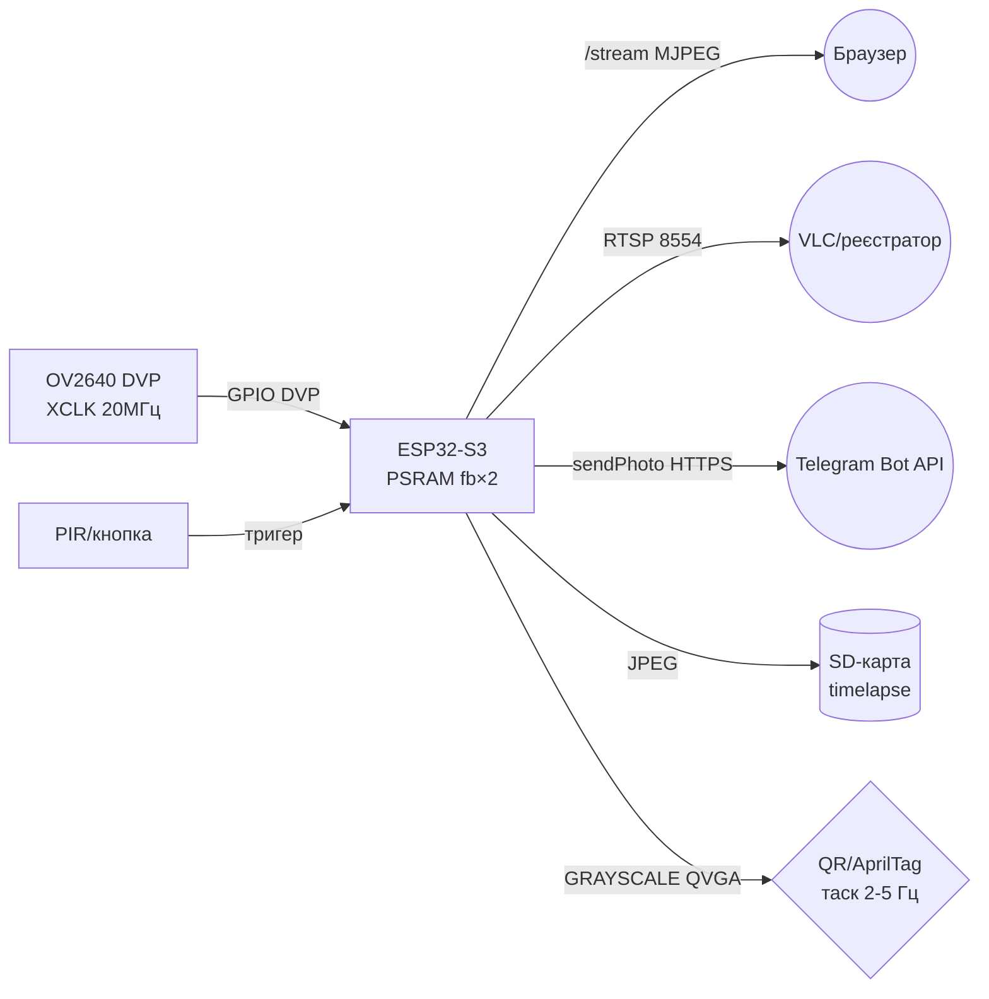

# Камера OV2640 - MJPEG-стрим, RTSP, QR/AprilTag, Timelapse, Telegram

## Purpose

ESP32-S3 with PSRAM + OV2640 - найдешевша WiFi-камера: MJPEG-стрим in браузері,
одиночні кадри `/capture`, RTSP for відеореєстраторів, розпізнавання QR and AprilTag
прямо on борту, timelapse on SD-карту та відправка фото in Telegram. Нота покриває
налаштування `esp32-camera`, різницю `/capture` vs `/stream`, вимоги до світла
and фокуса та Ready коди стримера трьома мовами.

## Характеристики

| Режим | Шлях | Формат | PSRAM | Кадр/с | Застосування |
| --- | --- | --- | --- | --- | --- |
| Фото | `/capture` | JPEG | бажано | for запитом | Telegram, timelapse, детекція |
| Стрим | `/stream` | MJPEG multipart | обов'язково | 5-25 | перегляд in браузері |
| RTSP | `:8554/mjpeg/1` | RTP/JPEG | обов'язково | 5-15 | VLC, реєстратор, Home Assistant |
| QR-скан | кадр in пам'яті | GRAYSCALE | бажано | 2-5 | коди доступу, маркування |
| AprilTag | кадр in пам'яті | GRAYSCALE | бажано | 1-5 | навігація роботів |
| Timelapse | JPEG on SD | JPEG | обов'язково | 1 / N с | будівництво, рослини |

Залізо-мінімум: плата ESP32-S3 with PSRAM (S3R8 and більше), OV2640 (2 Мп, 1600×1200),
живлення 5 in / 1 but (стрим + WiFi їдять 300-500 мА піками), конденсатор 47-100 мкФ
for живленням камери. without PSRAM - лише QQVGA and ніякого стримінгу, деталі пінів -
див. [[EN/12-Comm-Modules/04-RS485-CAN-Ethernet-Kamera.en]].

> OV2640 має фіксований фокус with заводу: різкість on ~50 см-нескінченність.
> for QR зблизька об'єктив треба ВИКРУТИТИ (проти годинникової on 1/4-1/2 оберта)
> and зафіксувати краплею лаку. without цього коди with 10 см not читаються взагалі.
> OV5640 (5 Мп, автофокусні версії) - апгрейд OV2640 on therefore самому DVP-сокеті,
> але вимагає більше PSRAM and дає більший кадр (менший FPS on therefore самому WiFi).

## MJPEG-стрим with OV2640

Архітектура `esp32-camera` + `esp_httpd`:

- **part-асинхрон:** HTTP-сервер віддає `multipart/x-mixed-replace;boundary=...`,
  кожен part - JPEG-кадр із заголовком `Content-Length`. Браузер малює кадри
  per мірі надходження, окремий потік not потрібен.
- **Буфер PSRAM:** `fb_count = 2` (подвійна буферизація: поки один кадр летить
  in WiFi, сенсор пише наступний). `jpeg_quality = 10-12` (менше число = краща
  якість = більший кадр = менше FPS). Роздільність стріму SVGA (800×600) -
  золота середина між деталізацією and FPS; UXGA душить WiFi.
- **`/capture` vs `/stream`:** `/capture` = один `esp_camera_fb_get()` + відповідь
  `image/jpeg` (for Telegram/timelapse/детекції); `/stream` = нескінченний цикл
  in хендлері (for очей). not смикати `/capture` під час активного `/stream` on
  одному fb - буде `fb alloc failed`, беріть `fb_count = 2`.
- **PSRAM DMA (S3):** `CONFIG_CAMERA_PSRAM_DMA` - прискорює запис кадрів in PSRAM;
  without нього JPEG SVGA все одно працює, але RGB/GRAYSCALE великих розмірів рветься.

### Pin legend камерної плати (ESP32-S3 + OV2640, типово Freenove)

| Пін плати | Призначення | Тип | Куди / примітка |
| --- | --- | --- | --- |
| 5V / 3V3 | Живлення камери | Силове | 5 in from USB/BEC + конденсатор 47-100 мкФ; 3V3-пін плати not тягне стрим |
| GND | Земля | Земля | Коротка земля, спільна with WiFi-антеною (not різати полігон!) |
| GPIO38/39 | SCCB SCL/SDA | I2C конфігурації | Регістри сенсора; швидкість 100 кГц достатньо |
| GPIO40/41/42 | VSYNC/HREF/PCLK | Синхронізація DVP | Короткі доріжки, not вести поруч with антеною |
| GPIO8-GPIO20 | D0-D7 дані DVP | Паралельна bus | Мапа залежить from плати - звіряти with `camera_pins.h`! |
| GPIO45 | XCLK 20 МГц | Мастер-клок | Генерує S3; тремтіння = плаваючі кольори |
| BOOT/USB | Прошивка | USB-Serial | Утримати BOOT at заливці, якщо немає auto-reset |
| SD (SPI/SDIO) | Карта пам'яті | SD 1-біт/4-біт | Timelapse and буфер фото; див. [[08-Memory/02-Filesystem | Файлові системи]] |

Пояснення:

- **Конденсатор for живленням:** пік струму сенсора + WiFi TX просаджує шину -
  коричневий `brownout` and ребут саме in момент `/capture`. 100 мкФ біля роз'єму камери.
- **Мапа DVP:** in різних вендорів (Freenove/Waveshare/Espressif) D0-D7 сидять on
  різних GPIO - брати `CAMERA_MODEL_...` with прикладу CameraWebServer під СВОЮ плату.
- **Антенна зона:** not класти камеру/дроти поверх керамічної антени S3 -
  падає RSSI and рветься стрим.

## RTSP оглядово (Micro-RTSP)

MJPEG in браузері - for людей; for машин (VLC, motionEye, реєстратор) - RTSP.
Бібліотека Micro-RTSP (geeksville) - RTSP-сервер for ESP32: слухає TCP 8554,
on `broadcastCurrentFrame()` віддає JPEG-кадр how RTP-пак.wav потік.

- Один клієнт одночасно (обмеження бібліотеки) - for одного реєстратора ок.
- Затримка VLC for замовчуванням ~1 с (буфер `--network-caching`); for «живого»
  зменшити кеш клієнта, but not ганяти FPS.
- RTSP and HTTP-стрим одночасно - тільки with `fb_count = 2` and SVGA або нижче,
  інакше сторожа (`task watchdog`) вбиває цикл.
- URL типово `rtsp://<ip>:8554/mjpeg/1`.

## QR / qrcode + AprilTag - кадри in GRAYSCALE

Детекція працює not with JPEG, but with розпакованим кадром in відтінках сірого:

1. `esp_camera_fb_get()` with `pixel_format = PIXFORMAT_GRAYSCALE`, роздільність
   QVGA (320×240) - швидко and вистачає for кодів до 1-2 м.
2. QR-декодер (quirc-порт / Nayuki-генератор for ПЕЧАТКИ кодів, декодер - quirc)
   їсть буфер безпосередньо; JPEG-кадр спочатку `frame2jpg`→jpg2gray - повільно, уникати.
3. AprilTag (бібліотека AprilTag, сімейство `tag36h11`): точне 3D-положення мітки
   відносно камери - навігація роботів, посадка дрона. Працює on S3 ~1-5 FPS
   in QVGA; більше роздільність = квадратичне зростання часу.
4. Світло: детекторам потрібна рівномірна освітленість without відблисків;
   in темряві вмикати підсвітний LED плати (GPIO, PWM-диммінг) або ІЧ-підсвітку.

> not ганяйте детекцію on кожному кадрі стріму: окремий FreeRTOS-таск with періодом
> 200-500 мс + останній доступний fb (`CAMERA_GRAB_LATEST`). Інакше стрим
> перетвориться on слайд-шоу.

## Timelapse on SD

Цикл: глибокий сон (або `delay`) N секунд → пробудження → `/capture` →
запис `/timelapse/IMG_xxxx.jpg` on SD → назад in сон. Нюанси:

- Імена файлів with інкрементом in NVS/EEPROM, щоб not перезаписувати після ребута.
- SD in режимі 1-біт вистачає (JPEG ~50-150 кБ), живлення карти - стабільні 3.3 in.
- Довгий timelapse (доба+) - живлення from павербанка via 5V-пін, USB-порт
  комп'ютера not потягне піки WiFi (хоча timelapse зазвичай without WiFi).
- Збірка відео: `ffmpeg -framerate 30 -i IMG_%04d.jpg out.mp4` вже on ПК.
- Файлова система and знос карти - див. [[08-Memory/02-Filesystem|Файлові системи]].

## Telegram-фото

ESP32 шле фото via Bot API `sendPhoto` (multipart/form-data, ліміт ~10 МБ,
наші JPEG - сотні кБ): тригер (PIR/кнопка/команда `/photo` via `getUpdates`)
→ `/capture` → HTTPS POST on `https://api.telegram.org/bot<token>/sendPhoto`.
Нюанси: потрібен коректний час (NTP, інакше TLS рветься), токен зберігати in NVS,
but not in коді; for відео - `sendVideo` not тягне MJPEG, тільки MP4 (ESP32 not кодує -
not використовувати). Сповіщення/голосові - див. [[15-Protocols/07-Notify-Voice]].

## Вимоги освітлення and фокуса

- **Світло:** OV2640 without ІЧ-фільтра «бачить» in темряві погано; мінімум for кольору -
  звичайне кімнатне освітлення. on вулиці вночі - ІЧ-прожектор 850 нм + зняти
  ІЧ-фільтр (незворотно!) або чутливіший OV5640.
- **Експозиція:** `sensor->set_exposure_ctrl(1)`, нічний режим `set_night_mode(1)`;
  автоекспозиція «дихає» at timelapse - for рівних кадрів зафіксувати
  `set_aec_value()` після прогріву 2 с.
- **Фокус:** заводський - дальній; QR/макро - викрутити об'єктив and зафіксувати.
  check: роздрукувати QR 5×5 см, дистанція 20 см, має читатися миттєво.
- **Баланс білого:** авто (+сонячно/хмарно пресети) - for timelapse зафіксувати
  `set_whitebal(1)` + `set_wb_mode()`, інакше кадри «стрибають» for кольором.

## Схема

![[assets/img/camera-streaming-mjpeg-scheme.png|600]]
*Fig. S3-камера: MJPEG-стрим in браузер, RTSP in реєстратор, фото in Telegram and on SD.
Місце під схему - див. [[assets/README]].*

### ASCII schematic

```text
ESP32-S3-CAM (PSRAM!)          Периферія / мережа
─────────────────────          ─────────────────
5V ──────────────────►  живлення (+100мкФ до GND біля камери!)
GND ──────────────────  GND
OV2640 DVP ──► GPIO8-20/38-42/45 (VSYNC/HREF/PCLK/D0-D7/XCLK 20МГц)
SD-карта ──► SPI/SDIO (timelapse IMG_xxxx.jpg, 1-біт вистачає)
PIR/кнопка ──► GPIO (тригер Telegram-фото)
Підсвітний LED ──► GPIO (PWM-диммінг для нічного QR)

WiFi STA ──► /capture (JPEG, один кадр)
         ──► /stream (MJPEG multipart, браузер)
         ──► :8554/mjpeg/1 (RTSP, VLC/реєстратор)
         ──► HTTPS api.telegram.org (sendPhoto, NTP обов'язково!)
```

### Mermaid



## Code ESP-IDF - MJPEG-стример

```c
#include "esp_camera.h"
#include "esp_http_server.h"

#define PART_BOUNDARY "123456789000000000000987654321"
static const char *_CT = "multipart/x-mixed-replace;boundary=" PART_BOUNDARY;
static const char *_BDR = "\r\n--" PART_BOUNDARY "\r\n";
static const char *_PART = "Content-Type: image/jpeg\r\nContent-Length: %u\r\n\r\n";

// Плата Freenove S3: звірити D0-D7 з camera_pins.h СВОЄЇ плати!
#define CAM_D0 11
#define CAM_D1 9
// ... (повна мапа — див. приклад camera_example esp32-camera)

static camera_config_t cam_cfg = {
    .pin_xclk = 45, .pin_sccb_sda = 39, .pin_sccb_scl = 38,
    .pin_vsync = 40, .pin_href = 41, .pin_pclk = 42,
    .xclk_freq_hz = 20000000,
    .ledc_timer = LEDC_TIMER_0, .ledc_channel = LEDC_CHANNEL_0,
    .pixel_format = PIXFORMAT_JPEG,
    .frame_size = FRAMESIZE_SVGA, // 800x600 — баланс FPS/деталізація
    .jpeg_quality = 11,
    .fb_count = 2,                // подвійна буферизація для стріму
    .grab_mode = CAMERA_GRAB_LATEST,
};

static esp_err_t stream_handler(httpd_req_t *req) {
    httpd_resp_set_type(req, _CT);
    char part[64];
    while (true) {
        camera_fb_t *fb = esp_camera_fb_get();
        if (!fb) break;
        int hlen = snprintf(part, sizeof(part), _PART, fb->len);
        if (httpd_resp_send_chunk(req, _BDR, strlen(_BDR)) != ESP_OK ||
            httpd_resp_send_chunk(req, part, hlen) != ESP_OK ||
            httpd_resp_send_chunk(req, (char*)fb->buf, fb->len) != ESP_OK) {
            esp_camera_fb_return(fb);
            break; // клієнт відключився
        }
        esp_camera_fb_return(fb);
    }
    return ESP_OK;
}

static esp_err_t capture_handler(httpd_req_t *req) {
    camera_fb_t *fb = esp_camera_fb_get();
    if (!fb) { httpd_resp_send_500(req); return ESP_FAIL; }
    httpd_resp_set_type(req, "image/jpeg");
    esp_err_t r = httpd_resp_send(req, (char*)fb->buf, fb->len);
    esp_camera_fb_return(fb);
    return r;
}

void app_main(void) {
    ESP_ERROR_CHECK(esp_camera_init(&cam_cfg));
    httpd_handle_t srv = NULL;
    httpd_config_t hcfg = HTTPD_DEFAULT_CONFIG();
    httpd_start(&srv, &hcfg);
    httpd_uri_t u_cap = {.uri="/capture", .method=HTTP_GET,
                         .handler=capture_handler};
    httpd_uri_t u_stm = {.uri="/stream", .method=HTTP_GET,
                         .handler=stream_handler};
    httpd_register_uri_handler(srv, &u_cap);
    httpd_register_uri_handler(srv, &u_stm);
}
```

## Code Arduino - стример + Telegram-фото

```cpp
#include "esp_camera.h"
#include <WiFi.h>
#include <WiFiClientSecure.h>
// Мапа пінів Freenove S3 — ВЗЯТИ З ПРИКЛАДУ ПІД СВОЮ ПЛАТУ!
#define PWDN -1
#include "camera_pins.h" // CAMERA_MODEL_... з CameraWebServer

void camInit() {
  camera_config_t c;
  c.pin_pwdn = CAM_PIN_PWDN; c.pin_reset = CAM_PIN_RESET;
  c.pin_xclk = CAM_PIN_XCLK; c.pin_sccb_sda = CAM_PIN_SIOD;
  c.pin_sccb_scl = CAM_PIN_SIOC;
  c.pin_d7 = CAM_PIN_D7; c.pin_d6 = CAM_PIN_D6; c.pin_d5 = CAM_PIN_D5;
  c.pin_d4 = CAM_PIN_D4; c.pin_d3 = CAM_PIN_D3; c.pin_d2 = CAM_PIN_D2;
  c.pin_d1 = CAM_PIN_D1; c.pin_d0 = CAM_PIN_D0;
  c.pin_vsync = CAM_PIN_VSYNC; c.pin_href = CAM_PIN_HREF;
  c.pin_pclk = CAM_PIN_PCLK;
  c.xclk_freq_hz = 20000000;
  c.ledc_timer = LEDC_TIMER_0; c.ledc_channel = LEDC_CHANNEL_0;
  c.pixel_format = PIXFORMAT_JPEG;
  c.frame_size = FRAMESIZE_SVGA;
  c.jpeg_quality = 11; c.fb_count = 2;
  c.grab_mode = CAMERA_GRAB_LATEST;
  esp_camera_init(&c);
  sensor_t *s = esp_camera_sensor_get();
  s->set_brightness(s, 0); s->set_saturation(s, 0);
}

// Відправка кадру в Telegram sendPhoto (токен — з NVS, не в код!)
void sendPhoto(const char *token, const char *chatId) {
  camera_fb_t *fb = esp_camera_fb_get();
  if (!fb) return;
  WiFiClientSecure cli; cli.setInsecure(); // для продакшн — setCACert!
  if (!cli.connect("api.telegram.org", 443)) {
    esp_camera_fb_return(fb); return;
  }
  String head = "--p\r\nContent-Disposition: form-data; name=\"chat_id\"\r\n\r\n"
                + String(chatId) + "\r\n--p\r\nContent-Disposition: form-data;"
                + " name=\"photo\"; filename=\"esp.jpg\"\r\nContent-Type: image/jpeg\r\n\r\n";
  String tail = "\r\n--p--\r\n";
  uint32_t len = head.length() + fb->len + tail.length();
  cli.print("POST /bot" + String(token) + "/sendPhoto HTTP/1.1\r\nHost: api.telegram.org\r\n"
            "Content-Type: multipart/form-data; boundary=p\r\nContent-Length: "
            + String(len) + "\r\nConnection: close\r\n\r\n");
  cli.print(head);
  cli.write(fb->buf, fb->len);
  cli.print(tail);
  esp_camera_fb_return(fb);
  while (cli.available()) Serial.write(cli.read());
}
void setup() { Serial.begin(115200); camInit(); /* + WiFi + NTP! */ }
void loop() { /* /capture /stream хендлери як у CameraWebServer */ }
```

## Code MicroPython - capture + timelapse

```python
# MicroPython: драйвер камери обмежений — для стріму краще Arduino/IDF.
# Тут: одиночні кадри + timelapse на SD + тригер Telegram (через urequests).
import camera, machine, time, os, urequests

# Ініціалізація OV2640 (піни — ПІД СВОЮ S3-ПЛАТУ!)
camera.init(0, d0=11, d1=9, d2=8, d3=10, d4=12, d5=18, d6=17, d7=16,
            format=camera.JPEG, framesize=camera.FRAME_SVGA,
            xclk_freq=camera.XCLK_20MHz, href=41, vsync=40,
            reset=-1, pwdn=-1, sioc=38, siod=39, xclk=45, pclk=42)
camera.quality(11)

pir = machine.Pin(13, machine.Pin.IN)

def capture(path):
    buf = camera.capture()  # JPEG-байтстрінг
    with open(path, "wb") as f:
        f.write(buf)
    print("saved", path, len(buf))

# Timelapse: кадр кожні 30 с з інкрементом імені
n = 0
try:
    n = max([int(f[4:8]) for f in os.listdir("/sd/tl")]) + 1
except Exception:
    pass
while True:
    if pir.value():  # рух — позаплановий кадр + Telegram
        capture("/sd/tl/evt_%04d.jpg" % n)
        # urequests.post("https://api.telegram.org/bot<token>/sendPhoto", ...)
    capture("/sd/tl/img_%04d.jpg" % n)
    n += 1
    time.sleep(30)
```

### GC0328 - бюджетна VGA-камера

| Параметр | GC0328 |
| --- | --- |
| Сенсор | GalaxyCore, 640×480 VGA, rolling shutter |
| Інтерфейс | DVP (how OV2640, ті ж піни ESP32-CAM) |
| Живлення | 2.8 in ядро (on платі свій LDO), I/O 1.8/2.8 in |
| Коли брати | Заміна OV2640 там, де ціна важливіша for якість картинки; перед покупкою verify підтримку сенсора in поточній версії драйвера esp32-camera |

> GC0328 vs OV2640: дешевша, гірша чутливість in темряві, той же роз'єм - перепайка 1-in-1 on платах ESP32-CAM клонів.

## typical errors

1. **`fb alloc failed` / ребут on UXGA** → немає PSRAM або він вимкнений in menuconfig.
   Тільки плата S3R8+, PSRAM 80 МГц + конденсатор живлення.
2. **Коричневий brownout at `/capture`** → пік WiFi+сенсор. Конденсатор 100 мкФ,
   живлення 5 in / 1 but, короткі дроти.
3. **Білий/рожевий кадр, смуги** → неправильна мапа D0-D7 (чужа плата in `CAMERA_MODEL`)
   або довгі «соплі» DVP. Взяти мапу вендора плати.
4. **GC0328 замість OV2640 without зміни драйвера** → чорний кадр. Сенсори not взаємозамінні прошивкою: SCCB-профіль and мапа пінів під конкретний сенсор.
5. **Стрим 1 FPS** → UXGA + quality 5 + один fb. SVGA, quality 10-12, `fb_count = 2`.
6. **`/capture` під час `/stream` вішає** → один fb on двох споживачів. `fb_count = 2`
   - `CAMERA_GRAB_LATEST`.
7. **QR not читається зблизька** → заводський фокус on даль. Викрутити об'єктив,
   зафіксувати лаком; кадри for детекції - GRAYSCALE QVGA, not JPEG!
8. **Telegram: TLS handshake failed** → not виставлений час. Спочатку NTP-синхронізація,
   потім HTTPS.
9. **RTSP затримка секунди** → буфер VLC, not ESP32. Зменшити network-caching клієнта.
10. **Timelapse «стрибає» for кольором** → авто-WB/експозиція. Зафіксувати WB and AEC
   після прогріву.
11. **Сторожевой task watchdog in стрим-циклі** → немає поступок планувальнику at RTSP +
    детекція in одному ядрі. Детекцію - окремим таском with паузою, див. example вище.

## Official sources

- [OV2640 - OmniVision](https://www.ovt.com/sensors/OV2640) - 2 Мп, DVP, формати виводу.
- [OV5640 - OmniVision](https://www.ovt.com/sensors/OV5640) - 5 Мп, автофокус-версії.
- [esp32-camera - драйвер and приклади (Espressif)](https://github.com/espressif/esp32-camera) - init, fb_count, PSRAM DMA, MJPEG-хендлери.
- [Micro-RTSP - RTSP-сервер for ESP32](https://github.com/geeksville/Micro-RTSP) - OV2640Streamer, broadcastCurrentFrame.
- [Telegram Bot API - sendPhoto](https://core.telegram.org/bots/api) - multipart-відправка фото, ліміти.
- [AprilTag - візуальні мітки (UMich)](https://april.eecs.umich.edu/software/apriltag) - сімейства тегів, 3D-поза.
- [QR-Code-generator - генерація QR (Nayuki)](https://github.com/nayuki/QR-Code-generator) - друк власних кодів (C/C++, MIT).

## See also

- [[EN/Home.en]]
- [[EN/12-Comm-Modules/04-RS485-CAN-Ethernet-Kamera.en]]
- [[08-Memory/02-Filesystem|Файлові системи]]
- [[15-Protocols/07-Notify-Voice]]
- [[EN/12-Comm-Modules/12-RC-Protocols.en]]
- [[11-Vivid/12-LVGL-SquareLine]]
- [[05-Radio/01-WiFi-STA-AP]]
- [[04-Interfaces/07-SD-SDIO]]
- [[99-Additions/02-Troubleshooting-FAQ]]
