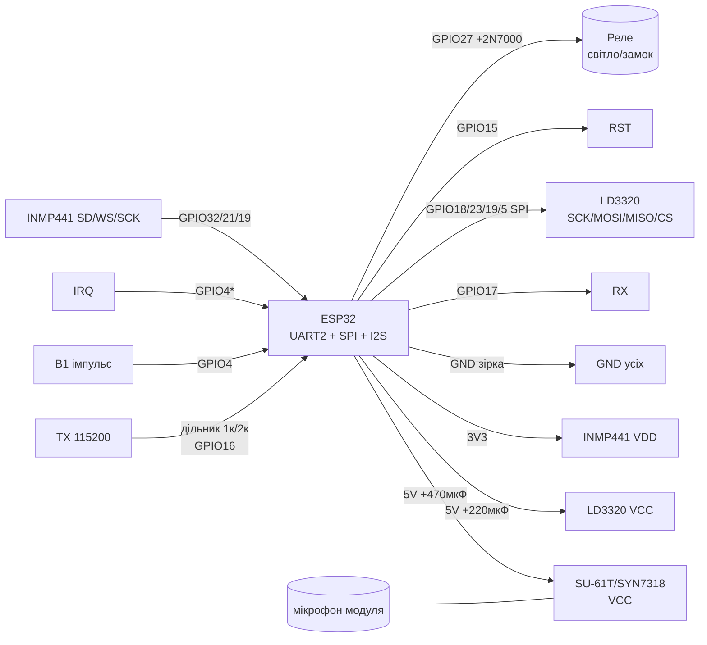

# Офлайн-голос on ESP32 - LD3320, SU-61T/SU-20T, CI-03T/CI-40T/UNI3588/SYN7318

> [!info] Призначення
> Нотатка про голосові модулі, that розпізнають команди **without інтернету and without нейромережі on самому ESP32**: **LD3320** (розпізнавання without навчання, SPI, фіксований список ключових слів), **SU-61T / SU-20T** (дешеві UART/GPIO-тригери with PWM-виходами), **CI-03T / CI-40T / UNI3588 / SYN7318** (розумні UART-модулі with протоколом кадрів, that самі керують реле via команди). Спільне: ESP32 тут - лише виконавець (читає UART/SPI/GPIO and клацає реле), but «вуха» - окремий чип. for нейромережевого голосу on самому ESP32 див. [[EN/12-Comm-Modules/11-TinyML-Voice.en]].

Огляд шин: [[04-Interfaces/01-UART|UART]], звук [[04-Interfaces/04-I2S|I2S]], радар/голос [[EN/12-Comm-Modules/08-LD2410-UWB-IR-Voice.en]], повний хмарно-локальний assistant [[15-Protocols/10-Voice-Assistant]], start [[EN/Home.en]].

## Purpose

Коротко: дати пристрою голосове керування там, де немає WiFi, немає сервера and немає місця for TinyML - гараж, підвал, дача, іграшка. module слухає мікрофон сам and повідомляє ESP32 готовий результат: номер ключового слова (LD3320 per SPI), байт команди (SU-61T per UART), текстовий кадр (SYN7318 per UART) або готовий HIGH-імпульс on піні (SU-20T, CI-03T GPIO).

| Параметр | Значення |
| --- | --- |
| Інтерфейс | UART (SU-61T/SU-20T/CI-03T/CI-40T/UNI3588/SYN7318), SPI (LD3320), GPIO/PWM (усі how тригери) |
| Живлення модуля | 5V (LD3320, SU-серія, більшість CI/SYN плат) або 3.3V (голі чипи CI-03T, SYN7318) |
| Рівень сигналів | 3.3V (обов'язково for ESP32; TX модуля 5V → дільник або level-shifter!) |
| Сумісність | ESP32 / S2 / S3 / C3 / C6 (будь-which - навантаження нульове, парсинг UART) |
| Мікрофон | Штатний електрет/MEMS on модулі + опційно зовнішній INMP441 for ESP32-сторони |

Коли брати офлайн-module, but not ESP-SR/TinyML:

- немає PSRAM and немає S3 (звичайний ESP32-WROOM, ESP32-C3) - module знімає навантаження;
- треба 2-5 команд «увімкни/вимкни» with реакцією <1 с without WiFi;
- живлення батарейне and ESP32 спить - module будить його піном (B1-B6, IO1…);
- мова команд - китайська/англійська with коробки (рідні словники модулів).

Коли not брати:

- потрібне вільне мовлення («постав таймер on вечерю») - this [[15-Protocols/10-Voice-Assistant]] (Assist + Whisper);
- потрібна українська with коробки - in цих модулів її або немає, або треба шити свій словник (див. розділ 5);
- потрібна реакція on конкретний голос (speaker ID) - жоден with модулів диктора not розрізняє.

## Характеристики

| module / чип | Принцип | Словник | Інтерфейс до ESP32 | Живлення | Дальність мікрофона | Мова with коробки |
| --- | --- | --- | --- | --- | --- | --- |
| LD3320 | Speaker-independent, without навчання, MFCC+DTW on чипі | ~10-50 ключових слів (шиються списком, EN/CN піньїнь) | SPI (команди+читання результату) + IRQ | 5V (плата) / 3.3V (чип) | 2-4 м (електрет with плати) | EN, CN (піньїнь) |
| SU-61T | NPU офлайн, прошивка WiseLight | ~50-100 команд + автовідповідь TTS | UART 115200 (текст `+ASR:`) + B1-B6 GPIO | 5V, ~150 мА | 3-5 м | CN, EN (обмежено) |
| SU-20T | Молодший брат SU-61T, менше flash | ~15-30 команд | UART 115200 + GPIO-імпульси | 5V, ~120 мА | 3-5 м | CN, EN (обмежено) |
| CI-03T | ASR-чип + TTS-відповідь, сценарії реле on борту | ~15 ключових слів + прямі дії on реле | UART 9600/115200 (кадри `AA 55 …`) + IO1-IO4 | 3.3V (чип) / 5V (плата) | 3-8 м (with MEMS) | CN, EN |
| CI-40T | Старший CI: більше GPIO, PWM, сценарії | ~30-50 команд, сцени «вкл/викл/яскравість» | UART + 8×GPIO + PWM | 5V (плата) | 3-8 м | CN, EN |
| UNI3588 (Unisound) | Повноцінний Voice SoC, UART-протокол with контрольною сумою | 100+ команд, діалоги, TTS | UART 115200 (кадри with довжиною+CRC) | 5V, ~200 мА | 5-8 м (масив до 2 мікрофонів) | CN, EN |
| SYN7318 (Synochip) | ASR+TTS, найдокладніший UART-протокол | 100+ команд, переривання, статус-кадри | UART 115200 8N1 (кадри `FD …`, статус `FC …`) | 3.3-5V, ~170 мА | 5-10 м | CN, EN |

> [!warning] 3.3V логіка!
> Усі GPIO ESP32 - 3.3V, **not 5V-толерантні**. TX голосових модулів on платах 5V часто видає 5V-рівень: ставте дільник 1к/2к або TXS0108E між TX модуля and RX ESP32. Перевірте мультиметром HIGH перед першим вмиканням. Живлення 5V - тільки on VCC модуля, ніколи on GPIO.

![[assets/img/offline-voice-uart-scheme.png|600]]
*Fig. Типовий стенд: Voice module (5V, UART 115200) → дільник → ESP32 RX2 → парсер кадру → реле/світло; LD3320 - окремо per SPI.*

## Порівняння «that чує кожен»: 15 слів vs 100+

| Клас | Представники | Скільки команд реально | how задаються | Типовий example словника | Ціна errors |
| --- | --- | --- | --- | --- | --- |
| Мінімум (~15 слів) | SU-20T, CI-03T | 10-15 + пробудження | Прошивка in WiseLight / AT-команди CI | «сяо ду сяо ду» (wake) → «кай ден» (світло вкл), «гуань ден» (викл), «да кай», «гуань бі» | Плутає схожі склади («кай» vs «гай») - розносіть команди фонетично |
| Середній (~50 слів) | LD3320, SU-61T, CI-40T | 30-50 | Список рядків in коді (LD3320) / словник WiseLight | LD3320: «turn on light», «turn off light», «open door», «play music», «volume up/down», «hello robot»… (див. список нижче) | LD3320 without перенавчання - вимову not змінити, тільки замінити слово |
| Максимум (100+ слів) | UNI3588, SYN7318 | 100-300, вкладені меню («режим кондиціонера → температура → швидкість») | Конфігуратор виробника / hex-table команд | SYN7318: коди 0x01-0x64 on команди + статус-кадри назад («виконано», «not зрозумів», «повторіть») | Довгий словник = довший час пошуку (~0.5-1 с) and більше хибних спрацювань in шумі |

Правило вибору: порахуйте команди включно зі словом-пробудженням. До 12 - беріть SU-20T/CI-03T (найдешевше, GPIO without коду). 12-50 - LD3320 (якщо треба SPI and свій список) або SU-61T (якщо треба UART-рядок). Понад 50, діалоги, статуси - SYN7318/UNI3588.

## 1. LD3320 - розпізнавання without навчання (SPI, список ключових слів!)

LD3320 - чип, that робить фонемне розпізнавання прямо on кристалі: закладаєте список слів (піньїнь for китайської, літери for англійської), чип слухає and повертає індекс слова. Навчання on голос користувача **not потрібне** (speaker-independent) - and this ж обмеження: свій акцент чи українську «with нуля» not додати, лише підміняти слова зі схожою фонетикою.

how працює конвеєр:

1. ESP32 per SPI записує in LD3320 список ключових слів (регістри 0x05-0xBD, формат: довжина + ASCII/піньїнь + термінатор);
2. команда `0x87` - start розпізнавання (режим MP3/мікрофон, регістр MIC вибирає вхід);
3. чип піднімає **IRQ** (активний LOW) коли «почув» - ESP32 читає регістр `0xC5` (індекс слова) and `0xC3` (впевненість/статус);
4. команда `0x87` повторно - наступний цикл прослуховування.

### Список ключових слів LD3320 (example EN-словника, шиється in коді)

```text
IDX  Ключове слово (як шити в регістри)   Дія в прошивці ESP32
---  ----------------------------------   --------------------
0    "XIAO DU" (wake, піньїнь)             Пробудження: LED blink, перехід у режим команд на 8 с
1    "KAI DENG" (піньїнь «увімкни світло») Реле ON (GPIO27 HIGH)
2    "GUAN DENG" (піньїнь «вимкни»)        Реле OFF (GPIO27 LOW)
3    "TURN ON LIGHT" (EN)                  Реле ON (дубль англійською)
4    "TURN OFF LIGHT" (EN)                 Реле OFF
5    "OPEN DOOR"                           Серво/замок імпульс 1 с
6    "CLOSE DOOR"                          Серво/замок назад
7    "PLAY MUSIC"                          DFPlayer play (див. 11-Vivid/08)
8    "STOP"                                DFPlayer stop / все викл
9    "VOLUME UP"                           Гучність + (DFPlayer/MAX98357)
10   "VOLUME DOWN"                         Гучність −
11   "HELLO ROBOT"                         TTS-вітання / LED-анимація
```

> [!tip] Фонетика важливіша for зміст
> LD3320 розрізняє склади, not значення. not закладайте пари «kai deng / guan deng» поруч with «kai men» - перші склади зіллються. Розносьте команди: різні перші склади, різна довжина (1 склад vs 3 склади), wake-слово завжди найдовше and найунікальніше.

## Легенда пінів модуля LD3320 (плата with мікрофоном)

| Пін модуля | Тип | Куди on ESP32 | Примітка |
| --- | --- | --- | --- |
| VCC 5V | Живлення вхід | 5V | 5V, пік ~120 мА at розпізнаванні; електроліт 220 мкФ біля VCC |
| GND | Земля | GND | Спільна земля, коротка |
| SCK | Вхід SPI | GPIO18 | SPI до 4 МГц; дроти <10 см |
| MOSI (SI) | Вхід SPI | GPIO23 | Запис словника and команд |
| MISO (SO) | Вихід SPI | GPIO19 | Читання статусу/індексу; рівень 3.3V with плати - безпечно |
| CS (NSS) | Вхід SPI | GPIO5 | Chip select, active low |
| IRQ | Вихід, active low | GPIO4 (переривання!) | LOW = слово розпізнано; підтяжка 10к до 3.3V якщо плата without неї |
| RST | Вхід, active low | GPIO15 | Reset: LOW 10 мс at startі, потім HIGH |
| MIC+ / MIC− | Аналог вхід | Штатний електрет плати | **not подовжувати!** module ставити ближче до користувача |
| SPK | Вихід аудіо | NC / динамік 8 Ом (опційно) | Звуковий відгук «підтверджено» without ESP32 |

## 2. SU-61T / SU-20T - PWM/GPIO-тригери

SU-серія (Ai-Thinker, чип головного контролера + NPU) прошивається in візуальному середовищі **WiseLight**: обираєте команди зі словника, призначаєте кожній дію - UART-рядок назовні, HIGH-імпульс on пін B1-B6 або PWM on LED-піни. ESP32 in найпростішому варіанті взагалі not парсить текст: кожна команда - окрема пін.

Різниця SU-61T vs SU-20T:

| Параметр | SU-61T | SU-20T |
| --- | --- | --- |
| Flash під словник | ~2 МБ (50-100 команд + TTS-відповіді) | ~1 МБ (15-30 команд, короткі відповіді) |
| Виходи | B1-B6 GPIO + PWM0/1 + UART | B1-B4 GPIO + UART (PWM спрощений) |
| Споживання | ~150 мА | ~120 мА |
| Коли брати | Кімната, сцени, Voice відгук | Коридор/гараж: 2-4 команди, мінімум коду |

Два режими роботи with ESP32:

- **GPIO-режим (without парсингу):** B1 → реле світла, B2 → ворота, B3 → сирена. ESP32 читає `digitalRead` або взагалі not потрібен - B-піни тягнуть реле via транзистор безпосередньо.
- **UART-режим (with парсингом):** TX модуля шле `+ASR: <команда>\r\n` on 115200; ESP32 парсить рядок (code in розділі «code») - гнучкіше, один дріт даних.

## Легенда пінів модуля SU-61T / SU-20T

| Пін модуля | Тип | Куди on ESP32 | Примітка |
| --- | --- | --- | --- |
| VCC 5V | Живлення вхід | 5V | 5V; електроліт 470 мкФ - module чутливий до просадок WiFi-сусідів per шині |
| GND | Земля | GND | Спільна земля |
| TX | Вихід UART | GPIO16 (RX2) via дільник 1к/2к! | 115200 8N1, формат `+ASR: kai deng\r\n`; HIGH може бути 5V - міряти! |
| RX | Вхід UART | GPIO17 (TX2) | Команди синтезу відповіді with ESP32 (`{play:3}` - залежить from firmwares WiseLight) |
| B1-B6 (SU-61T) / B1-B4 (SU-20T) | Виходи GPIO, HIGH-імпульс ~500 мс | GPIO4/13/14/… або безпосередньо on транзистор реле | Кожній команді - свій пін in WiseLight; струм піни <10 мА - реле тільки via key! |
| PWM0 / PWM1 | Вихід ШІМ | LED-стрічка via MOSFET / NC | Диммування голосом («яскравіше/темніше») without ESP32 |
| MIC+ / MIC− | Аналог | Штатний мікрофон | not подовжувати; отвір корпусу навпроти капсюля |

## 3. CI-03T / CI-40T / UNI3588 / SYN7318 - UART-протоколи: формат кадрів, baud, команди on реле

this «розумні» модулі: самі ведуть діалог (перепитують, підтверджують), but ESP32 отримує Ready коди команд and шле назад коди дій. Протокол in всіх - UART 8N1, але формат кадру різний. Розберемо кожен.

### 3.1 CI-03T / CI-40T (кадри `AA 55 …`, 9600/115200)

| Параметр кадру | Значення |
| --- | --- |
| Baud | 9600 (заводський) або 115200 (AT-команда `AT+BAUD=115200`) |
| Формат | `AA 55 LEN CMD DATA… SUM` - заголовок 2 байти, довжина, code, дані, контрольна сума (сума байтів LEN+CMD+DATA молодший байт) |
| module → ESP32 | `CMD=0x01` результат: `DATA[0]` = ID команди (0x01 світло вкл, 0x02 викл, 0x03 ворота…); `DATA[1]` = впевненість 0-100 |
| ESP32 → module | `CMD=0x02` дія: ті ж ID - примусово озвучити/виконати сцену; `CMD=0x05` запит статусу |
| Wake | `CMD=0x00 DATA=0x01` - почуто wake-слово, далі чекати команду 6 с |

example байтів (CI-03T, команда «світло вкл», ID=0x01, впевненість 92=0x5C):

```text
module → ESP32:  AA 55 03 01 01 5C 60
                 ││ │  │  │  │  └─ SUM = (03+01+01+5C) & FF = 0x60
                 ││ │  │  │  └─ впевненість 0x5C = 92
                 ││ │  │  └─ ID команди 0x01
                 ││ │  └─ CMD 0x01 = результат розпізнавання
                 ││ └─ LEN = 3 (CMD+DATA…)
                 │└─ заголовок
                 └─ заголовок
ESP32 → реле:    digitalWrite(27, HIGH)
```

### 3.2 UNI3588 (Unisound, кадри with довжиною + CRC16, 115200)

| Параметр кадру | Значення |
| --- | --- |
| Baud | 115200 8N1 |
| Формат | `FE F8 LEN_H LEN_L CMD SEQ DATA… CRC16_H CRC16_L` - CRC16-Modbus per полю CMD+SEQ+DATA |
| module → ESP32 | `CMD=0x10` подія: `DATA[0..1]` = ID команди (до 1000+), `DATA[2]` = сцена/контекст |
| ESP32 → module | `CMD=0x20` виконати дію + озвучити: ID + параметр (яскравість 0-100, кут серво…) |
| Статус назад | module шле `CMD=0x11` ACK після кожної прийнятої ESP32-команди - чекати ACK 200 мс, інакше повтор |

### 3.3 SYN7318 (Synochip, кадри `FD …` / статуси `FC …`, 115200)

Найдокладніший протокол - окремі кадри команд and окремі кадри статусу, плюс команда переривання мовлення.

| Параметр кадру | Значення |
| --- | --- |
| Baud | 115200 8N1 (фіксований) |
| Команда module → ESP32 | `FD LEN CMD DATA… CS` - `CMD=0x01` розпізнано: `DATA[0]` = code команди 0x01-0x64; `CS` = XOR усіх байтів після FD |
| Статус module → ESP32 | `FC LEN ST CS` - `ST`: `0x01` почав слухати, `0x02` почув мову, `0x03` виконав, `0x04` not зрозумів (повторіть), `0x05` таймаут очікування |
| ESP32 → module | `FD LEN 0x02 ID CS` - виконати+озвучити команду ID; `FD 01 0x09 F8` - стоп/перервати озвучку (баржа!); `FD 02 0x03 VOL CS` - гучність 0-9 |
| Реле безпосередньо | Коди 0x01-0x08 можна замапити on виходи P0-P7 модуля in конфігураторі - реле клацає without ESP32 взагалі |

example сесії SYN7318 (світло вкл, ID=0x03):

```text
користувач:  «сяо чжі, кай ден»
module → ESP32:  FC 01 01 FB        (почав слухати, CS=XOR)
module → ESP32:  FC 01 02 F8        (почув мову)
module → ESP32:  FD 02 01 03 FF     (розпізнано ID 0x03, CS=02^01^03=0x00… див. точну формулу в мануалі!)
ESP32 → реле:    GPIO27 HIGH + відповідь модулю:
ESP32 → module:  FD 02 02 03 F9     (підтвердити+озвучити «світло увімкнено»)
module → ESP32:  FC 01 03 F9        (виконав)
```

> [!warning] Контрольні суми - різні in всіх!
> CI: сума; UNI3588: CRC16-Modbus; SYN7318: XOR. not копіюйте парсер with одного модуля on інший - звіряйте with мануалом конкретної плати. Невірна CS = module мовчить in відповідь, and this виглядає how «згорів», хоча винен один байт.

### Команди on реле: зведена table ID (example проєкту «кімната»)

| ID | Команда (CN піньїнь / EN) | ESP32-дія | module |
| --- | --- | --- | --- |
| 0x01 | kai deng / turn on light | GPIO27 HIGH (світло) | Усі |
| 0x02 | guan deng / turn off light | GPIO27 LOW | Усі |
| 0x03 | kai men / open door | Імпульс замок 1 с (GPIO14) | CI-40T/SYN7318/UNI3588 |
| 0x04 | guan men / close door | Імпульс назад | CI-40T/SYN7318/UNI3588 |
| 0x05 | da kai feng shan / fan on | Вентилятор реле (GPIO26) | SU-61T/SYN7318/UNI3588 |
| 0x06 | яскравіше (liang yi dian / brighter) | PWM +10% (LEDC) | CI-40T/SU-61T |
| 0x07 | тьмяніше (an yi dian / dimmer) | PWM −10% (LEDC) | CI-40T/SU-61T |
| 0x08 | bao jing / alarm | Сирена + MQTT (див. [[15-Protocols/01-MQTT | MQTT]]) | SYN7318/UNI3588 |

## 4. Шум and мікрофон: чому INMP441 згадується in ноті про модулі

Voice module має свій мікрофон - але ESP32-сторона часто теж слухає (підтвердження команди, гучність кімнати, запис логу). Правило: **цифровий I2S-мікрофон INMP441 замість аналогового MAX9814/електрета in АЦП** - WiFi-наводки 100 Гц вбивають аналог, but I2S дає чисті 16 кГц/24 біт. Детально bus - [[04-Interfaces/04-I2S|I2S]], нейромережевий стек - [[EN/12-Comm-Modules/11-TinyML-Voice.en]].

Практика боротьби with шумом for офлайн-модулів:

1. module - ближче до людини (1-3 м), далі from телевізора/витяжки мінімум 2 м;
2. Живлення модуля - окремий LDO або LC-фільтр: шипіння DC-DC звучить for ASR how «ш-ш-ш» and маскує шиплячі команди;
3. Корпус: отвір 2-3 мм навпроти капсюля, поролон-пиловологозахист not заклеювати плівкою;
4. Поріг/впевненість: ігнорувати результати with confidence <70 (CI, SYN7318 шлють впевненість in кадрі!);
5. Дзеркальні команди («увімкни/вимкни») розносити фонетично, not логікою.

## Легенда пінів модуля INMP441 (I2S-мікрофон ESP32-сторони)

| Пін INMP441 | Тип | Куди on ESP32 | Примітка |
| --- | --- | --- | --- |
| VDD | Живлення вхід | 3V3 | Тільки 3.3V! 100 нФ до GND біля модуля |
| GND | Земля | GND | Коротка, спільна; not вести повз DC-DC |
| SD (DOUT) | Вихід дані I2S | GPIO32 (I2S DIN) | Потік 16 кГц/24 біт; підтяжка not потрібна |
| WS | Вхід кадр | GPIO21 (I2S WS) | 16 кГц; <10 см |
| SCK (BCK) | Вхід біт-клок | GPIO19 (I2S BCK) | ~1 МГц |
| L/R | Вибір каналу | GND = Left | Другий мікрофон (стерео-матриця) - on 3V3 = Right |

## Схема підключення

| ESP32 DevKit | SU-61T / SYN7318 (UART) | LD3320 (SPI) | INMP441 (I2S) | Примітка |
| --- | --- | --- | --- | --- |
| 5V (VIN) | VCC 5V (+470 мкФ!) | VCC 5V (+220 мкФ!) | - | Два електроліти - per одному біля кожного модуля |
| 3V3 | - | - | VDD (+100 нФ) | Тільки цифра 3.3V |
| GND | GND | GND | GND | Спільна земля, зірка |
| GPIO16 (RX2) | TX via дільник 1к/2к! | - | - | verify HIGH мультиметром |
| GPIO17 (TX2) | RX | - | - | 3.3V достатньо for входу 5V-модуля |
| GPIO4 | B1 (імпульс команди) | IRQ (переривання) | - | Один або другий - not обидва on пін! |
| GPIO18/23/19/5 | - | SCK/MOSI/MISO/CS | - | SPI <10 см |
| GPIO15 | - | RST | - | LOW 10 мс at startі |
| GPIO21/19/32 | - | - | WS/SCK/SD | I2S; SCK можна спільний for частотою |
| GPIO27 | Реле (via транзистор!) | Реле (via транзистор!) | - | Пін модуля/module реле: струм котушки not with GPIO |

> [!warning] Реле - тільки via key
> GPIO ESP32 дає 12 мА, котушка реле 5V бере 70-90 мА. Між GPIO and реле - N-MOSFET (2N7000/АО3400) або готовий module реле with оптопарою. B-піни голосових модулів - так само слабкі (<10 мА).

### ASCII schematic

```text
                    5V ──┬──[470мкФ]──► SU-61T/SYN7318 VCC
                         └──[220мкФ]──► LD3320 VCC
                    3V3 ──[100нФ]───► INMP441 VDD
                    GND ────────────► GND усіх модулів (зірка!)

SU-61T/SYN7318 TX (5V!) ──[1к]──┬──► ESP32 GPIO16 (RX2)
                                └──[2к]──► GND        (дільник 5V→3.3V!)
ESP32 GPIO17 (TX2) ────────────► SU-61T/SYN7318 RX
SU-61T B1 ─────────────────────► ESP32 GPIO4 (HIGH-імпульс команди)

LD3320 SCK/MOSI/MISO/CS ───────► ESP32 GPIO18/23/19/5 (SPI, <10см!)
LD3320 IRQ ────────────────────► ESP32 GPIO4* (АБО B1, не обидва!)
LD3320 RST ────────────────────► ESP32 GPIO15
LD3320 MIC → штатний електрет (не подовжувати!)

INMP441 SD/WS/SCK ─────────────► ESP32 GPIO32/21/19 (I2S 16кГц)
ESP32 GPIO27 ──[2N7000]──► Реле 5V ──► Світло/замок/вентилятор
```

### Mermaid



## Code ESP-IDF (UART-парсер: SU-61T рядки + SYN7318 кадри + CI кадри)

```c
#include <string.h>
#include "driver/uart.h"
#include "driver/gpio.h"
#include "esp_log.h"
static const char *TAG = "VOICE";
#define UART_NUM UART_NUM_2
#define RX_PIN 16
#define TX_PIN 17
#define RELAY_PIN 27
#define BUF 512

static void do_cmd(int id) {
    // Таблиця ID → дія (див. розділ 3, таблиця ID).
    switch (id) {
    case 0x01: gpio_set_level(RELAY_PIN, 1); ESP_LOGI(TAG, "Світло ON"); break;
    case 0x02: gpio_set_level(RELAY_PIN, 0); ESP_LOGI(TAG, "Світло OFF"); break;
    case 0x03: ESP_LOGI(TAG, "Двері: імпульс замка"); break; // + gpio імпульс
    default: ESP_LOGW(TAG, "Невідомий ID 0x%02X", id); break;
    }
}

// SU-61T: рядок "+ASR: kai deng\r\n" → мапимо текст на ID.
static void parse_su_line(const char *line) {
    if (strncmp(line, "+ASR:", 5) != 0) return;
    const char *cmd = line + 5;
    while (*cmd == ' ') cmd++;
    ESP_LOGI(TAG, "SU: '%s'", cmd);
    if (strstr(cmd, "kai deng") || strstr(cmd, "turn on")) do_cmd(0x01);
    else if (strstr(cmd, "guan deng") || strstr(cmd, "turn off")) do_cmd(0x02);
    else ESP_LOGW(TAG, "SU: невідома команда");
}

// SYN7318: кадр FD LEN CMD DATA.. CS (CS = XOR байтів після FD).
static void parse_syn7318(const uint8_t *f, int n) {
    if (n < 4 || f[0] != 0xFD) return;
    uint8_t cs = 0;
    for (int i = 1; i < n - 1; i++) cs ^= f[i];
    if (cs != f[n - 1]) { ESP_LOGW(TAG, "SYN: погана CS"); return; }
    if (f[2] == 0x01) { // розпізнано
        ESP_LOGI(TAG, "SYN: ID 0x%02X", f[3]);
        do_cmd(f[3]);
    } else if (f[0] == 0xFC) {
        ESP_LOGI(TAG, "SYN: статус 0x%02X", f[2]);
    }
}

// CI-03T: кадр AA 55 LEN CMD DATA.. SUM (SUM = молодший байт суми).
static void parse_ci(const uint8_t *f, int n) {
    if (n < 6 || f[0] != 0xAA || f[1] != 0x55) return;
    uint8_t s = 0;
    for (int i = 2; i < n - 1; i++) s += f[i];
    if (s != f[n - 1]) { ESP_LOGW(TAG, "CI: погана SUM"); return; }
    if (f[3] == 0x01) {
        ESP_LOGI(TAG, "CI: ID 0x%02X conf %d", f[4], f[5]);
        if (f[5] < 70) { ESP_LOGW(TAG, "CI: низька впевненість, ігнор"); return; }
        do_cmd(f[4]);
    }
}

void app_main(void) {
    gpio_set_direction(RELAY_PIN, GPIO_MODE_OUTPUT);
    uart_config_t c = { .baud_rate = 115200, .data_bits = UART_DATA_8_BITS,
        .parity = UART_PARITY_DISABLE, .stop_bits = UART_STOP_BITS_1,
        .flow_ctrl = UART_HW_FLOWCTRL_DISABLE, .source_clk = UART_SCLK_DEFAULT };
    uart_param_config(UART_NUM, &c);
    uart_set_pin(UART_NUM, TX_PIN, RX_PIN, -1, -1);
    uart_driver_install(UART_NUM, BUF, BUF, 0, NULL, 0);
    uint8_t b[BUF]; char line[128]; int lp = 0;
    while (1) {
        int n = uart_read_bytes(UART_NUM, b, sizeof(b), pdMS_TO_TICKS(100));
        for (int i = 0; i < n; i++) {
            // Рядковий протокол SU: накопичуємо до \n.
            if (lp < (int)sizeof(line) - 1) line[lp++] = (char)b[i];
            if (b[i] == '\n' || lp >= (int)sizeof(line) - 1) {
                line[lp] = 0; parse_su_line(line); lp = 0;
            }
        }
        // Бінарні кадри SYN/CI: шукаємо заголовки в тому ж буфері.
        for (int i = 0; i + 5 < n; i++) {
            if (b[i] == 0xFD) parse_syn7318(&b[i], b[i+1] + 2);
            if (b[i] == 0xAA && b[i+1] == 0x55) parse_ci(&b[i], b[i+2] + 3);
        }
    }
}
```

## Code Arduino (той же парсер + LD3320-SPI каркас + B-піни)

```cpp
#include <SPI.h>
#define RX2 16
#define TX2 17
#define RELAY 27
#define LD_CS 5
#define LD_IRQ 4
#define LD_RST 15
#define B1_PIN 13  // SU B1 сюди (якщо GPIO-режим)

void doCmd(int id) {
  switch (id) {
    case 0x01: digitalWrite(RELAY, HIGH); Serial.println("Світло ON"); break;
    case 0x02: digitalWrite(RELAY, LOW);  Serial.println("Світло OFF"); break;
    case 0x03: Serial.println("Двері: імпульс"); break;
    default: Serial.printf("Невідомий ID 0x%02X\n", id); break;
  }
}

// --- LD3320 SPI: запис/читання регістра ---
void ldWrite(uint8_t reg, uint8_t val) {
  digitalWrite(LD_CS, LOW);
  SPI.transfer(0x04); SPI.transfer(reg); SPI.transfer(val);
  digitalWrite(LD_CS, HIGH);
}
uint8_t ldRead(uint8_t reg) {
  digitalWrite(LD_CS, LOW);
  SPI.transfer(0x05); SPI.transfer(reg);
  uint8_t v = SPI.transfer(0x00);
  digitalWrite(LD_CS, HIGH);
  return v;
}
// Закласти список слів: для кожного слова пишемо ASCII по регістрах 0x05..,
// деталі адрес — мануал LD3320 (V3.0), після списку — команда startу 0x87.
void ldStartRecognize() {
  ldWrite(0x37, 0x04); delay(5);
  ldWrite(0x1C, 0x09); // MIC-вхід
  ldWrite(0x87, 0x01); // start
}

void parseSU(const String &line) {
  if (!line.startsWith("+ASR:")) return;
  String cmd = line.substring(5); cmd.trim();
  Serial.println("SU: " + cmd);
  if (cmd.indexOf("kai deng") >= 0 || cmd.indexOf("turn on") >= 0) doCmd(0x01);
  else if (cmd.indexOf("guan deng") >= 0 || cmd.indexOf("turn off") >= 0) doCmd(0x02);
  else Serial.println("SU: невідома команда");
}

void parseSYN(const uint8_t *f, int n) {
  if (n < 4 || f[0] != 0xFD) return;
  uint8_t cs = 0;
  for (int i = 1; i < n - 1; i++) cs ^= f[i];
  if (cs != f[n - 1]) { Serial.println("SYN: погана CS"); return; }
  if (f[2] == 0x01) doCmd(f[3]);
}

void setup() {
  Serial.begin(115200);
  Serial2.begin(115200, SERIAL_8N1, RX2, TX2);
  pinMode(RELAY, OUTPUT);
  pinMode(B1_PIN, INPUT);
  // LD3320 SPI:
  pinMode(LD_CS, OUTPUT); digitalWrite(LD_CS, HIGH);
  pinMode(LD_RST, OUTPUT);
  digitalWrite(LD_RST, LOW); delay(10); digitalWrite(LD_RST, HIGH); delay(10);
  pinMode(LD_IRQ, INPUT_PULLUP);
  SPI.begin(18, 19, 23, LD_CS);
  SPI.setFrequency(2000000);
  // ldWrite(...словник...); ldStartRecognize(); // після закладки слів
  Serial.println("Voice ready: SU/SYN/CI + LD3320");
}

void loop() {
  // 1. SU-рядки з Serial2.
  static String line;
  while (Serial2.available()) {
    char c = (char)Serial2.read();
    if (c == '\n') { parseSU(line); line = ""; }
    else if (c != '\r') line += c;
  }
  // 2. LD3320 IRQ → читаємо індекс слова.
  if (digitalRead(LD_IRQ) == LOW) {
    uint8_t idx = ldRead(0xC5);
    Serial.printf("LD3320: слово #%d\n", idx);
    doCmd(idx + 1); // маппинг індекс→ID під свій словник!
    ldWrite(0x29, 0x00); ldWrite(0x02, 0x00); // скидання переривання
    ldStartRecognize(); // наступний цикл
    delay(50);
  }
  // 3. B1-імпульс (GPIO-режим SU без парсингу).
  static bool prev = false;
  bool cur = digitalRead(B1_PIN);
  if (cur && !prev) { Serial.println("B1: команда 1"); doCmd(0x01); }
  prev = cur;
  delay(5);
}
```

## Code MicroPython (UART-парсер + B-піни + IRQ-заглушка LD3320)

```python
from machine import UART, Pin, SPI
import time

RELAY = Pin(27, Pin.OUT)
B1 = Pin(13, Pin.IN)  # SU B1 (GPIO-режим)

voice = UART(2, baudrate=115200, rx=16, tx=17, timeout=50)

def do_cmd(cid):
    if cid == 0x01:
        RELAY.on(); print("Світло ON")
    elif cid == 0x02:
        RELAY.off(); print("Світло OFF")
    elif cid == 0x03:
        print("Двері: імпульс")
    else:
        print("Невідомий ID 0x%02X" % cid)

def parse_su(line):
    # line: b'+ASR: kai deng'
    try:
        s = line.decode().strip()
    except UnicodeError:
        return
    if not s.startswith("+ASR:"):
        return
    cmd = s[5:].strip()
    print("SU:", cmd)
    if "kai deng" in cmd or "turn on" in cmd:
        do_cmd(0x01)
    elif "guan deng" in cmd or "turn off" in cmd:
        do_cmd(0x02)
    else:
        print("SU: невідома команда")

def parse_syn(frame):
    # frame: bytes починаючи з 0xFD, довжина frame[1]+2
    if len(frame) < 4 or frame[0] != 0xFD:
        return
    cs = 0
    for b in frame[1:-1]:
        cs ^= b
    if cs != frame[-1]:
        print("SYN: погана CS"); return
    if frame[2] == 0x01:
        print("SYN: ID 0x%02X" % frame[3])
        do_cmd(frame[3])

def parse_ci(frame):
    # frame: AA 55 LEN CMD DATA.. SUM
    if len(frame) < 6 or frame[0] != 0xAA or frame[1] != 0x55:
        return
    if (sum(frame[2:-1]) & 0xFF) != frame[-1]:
        print("CI: погана SUM"); return
    if frame[3] == 0x01:
        cid, conf = frame[4], frame[5]
        print("CI: ID 0x%02X conf %d" % (cid, conf))
        if conf < 70:
            print("CI: низька впевненість, ігнор"); return
        do_cmd(cid)

# LD3320 по SPI в MicroPython — лише каркас: повний драйвер словника
# це десятки регістрів, робіть на Arduino/IDF. Тут тільки детект IRQ.
LD_IRQ = Pin(4, Pin.IN, Pin.PULL_UP)
def on_ld(pin):
    print("LD3320: IRQ! Читайте 0xC5 по SPI (див. Arduino-приклад)")
LD_IRQ.irq(trigger=Pin.IRQ_FALLING, handler=on_ld)

prev_b1 = 0
print("Voice ready")
while True:
    if voice.any():
        raw = voice.readline()
        if raw:
            if raw[:5] == b"+ASR:":
                parse_su(raw)
            else:
                # Сирий бінарний потік: шукаємо заголовки FD / AA 55.
                for i in range(len(raw) - 5):
                    if raw[i] == 0xFD:
                        ln = raw[i + 1] + 2
                        parse_syn(raw[i:i + ln])
                    if raw[i] == 0xAA and raw[i + 1] == 0x55:
                        ln = raw[i + 2] + 3
                        parse_ci(raw[i:i + ln])
    cur = B1.value()
    if cur and not prev_b1:
        print("B1: команда 1"); do_cmd(0x01)
    prev_b1 = cur
    time.sleep_ms(5)
```

Детальніше про середовища: [[00-Start/05-Vibir-seredovischa|Вибір середовища]].

## typical errors

| # | Symptom | Cause | Виправлення |
| --- | --- | --- | --- |
| 1 | Сміття замість `+ASR:` in моніторі | Різний baud (module 9600, ESP32 115200) або переплутані RX/TX | Зрівняти baud (`AT+BAUD` for CI; Serial2.begin той же); поміняти RX/TX місцями |
| 2 | ESP32 гріється / порт мовчить після TX модуля | 5V TX модуля безпосередньо in GPIO | Дільник 1к/2к або TXS0108E; verify HIGH мультиметром до підключення |
| 3 | SYN7318/UNI3588 мовчить після моєї команди | Невірна контрольна сума (XOR vs CRC16 vs сума) | Перерахувати CS for мануалом саме цієї плати; вивести hex кадру in лог |
| 4 | CI-03T відповідає, але команди «not ті» | Заводський словник китайською, ID not збігаються with таблицею | Прочитати мануал плати (ID in виробника!), перемапити `do_cmd` |
| 5 | LD3320: IRQ взагалі not падає | not записано словник / not дано start 0x87 / MIC not той вхід | verify запис регістрів читанням назад; регістр 0x1C = MIC; дати start |
| 6 | LD3320 чує тільки впритул | Електрет далеко, немає отвору in корпусі, шум БЖ | module ближче 2 м; отвір 2-3 мм; окремий LDO; говорити чітко перші склади |
| 7 | SU-61T плутає «кай/гуань» | Схожі перші склади + шум | Рознести команди фонетично; додати wake-слово; електроліт 470 мкФ |
| 8 | module перезавантажується коли ESP32 вмикає WiFi | Спільний слабкий 5V, просадка at TX-піках 500 мА | Окремий БЖ 5V 2A; електроліти біля кожного VCC; GND зіркою |
| 9 | B1-імпульс дрижить (подвійні спрацювання) | Довгий дріт ловить наводки, немає дебаунса | Дебаунс 300 мс in коді; кручена пара B1+GND; pull-down 10к |
| 10 | SYN7318 озвучка not переривається | not послано стоп-кадр `FD 01 0x09` (баржа) | Слати стоп перед новою командою; гучність `0x03` not вище 7 in квартирі |
| 11 | Працює вдень, ввечері «глухне» | Телевізор/витяжка маскують команди; confidence <70 | module подалі from динаміків 2 м+; ігнорувати conf<70; нічний словник коротший |
| 12 | MicroPython губить початок кадру | `readline()` ріже бінарні кадри per `\n` всередині | Читати `read()` блоками and шукати заголовки FD/AA55 вручну (how in прикладі) |
| 13 | Реле клацає, але світло not вмикається | GPIO безпосередньо on котушку реле, пін просів | key 2N7000/оптопара між GPIO and реле; окреме 5V on котушку |
| 14 | Все працює on столі, in корпусі - ні | Мікрофон заклеєно плівкою/поролоном, динамік поруч дає заводку | Отвір навпроти капсюля; динамік відгуку подалі from мікрофона; тест in зібраному корпусі |

## Official sources

- [ESP-SR - розпізнавання мови Espressif (WakeNet, MultiNet, AFE)](https://docs.espressif.com/projects/esp-sr/en/latest/) - коли офлайн-модуля мало and треба нейромережевий стек on S3.
- [ESP-Skainet - Voice assistant Espressif (приклади wake word + команди)](https://github.com/espressif/esp-skainet) - еталонні приклади `wake_word_detection`, `cn/en_speech_commands_recognition`.
- [Grove Speech Recognizer - Wiki (ISD9160, протокол 9600, table команд)](https://wiki.seeedstudio.com/Grove-Speech_Recognizer/) - найближчий документований аналог SU/CI-модулів: формат відповіді «байт = команда».
- [TDK InvenSense - мікрофони (даташити INMP441 та аналоги)](https://www.invensense.com/wp-content/uploads/2015/02/INMP441.pdf) - електричні параметри I2S-мікрофона ESP32-сторони.
- [ESPHome micro_wake_word - wake word on пристрої](https://esphome.io/components/micro_wake_word.html) - альтернатива залізним модулям: wake word прямо on ESP32.
- [Home Assistant Assist - голосове керування будинком](https://www.home-assistant.io/voice_control/) - куди віддавати команди далі, коли виросли with офлайн-словника.
- [Vosk - офлайн STT-тулкіт (20+ мов, Raspberry Pi)](https://alphacephei.com/vosk/) - серверна альтернатива for складних фраз without хмари.

> [!note] Про даташити LD3320 / SYN7318 / UNI3588 / CI-03T
> Єдиних англомовних сторінок виробників in цих чипів немає - шукайте PDF for точним маркуванням плати («SYN7318 datasheet v1.4», «CI-03T AT command set», «UNI3588 UART protocol», «LD3320 datasheet V3.0») in постачальника плати. Формат кадру завжди звіряйте with паперовим мануалом саме вашої ревізії плати, but not with цієї нотатки.

## See also

- [[EN/Home.en]]
- [[04-Interfaces/01-UART|UART]] - швидкості, парсери кадрів, дільники рівнів
- [[04-Interfaces/04-I2S|I2S]] - INMP441, чистий цифровий звук замість АЦП
- [[12-Comm-Modules/11-TinyML-Voice|TinyML/Голос]] - ESP-SR, WakeNet «Hi ESP», нейромережі on S3
- [[12-Comm-Modules/08-LD2410-UWB-IR-Voice|Радар/UWB/IR/SU-03T]] - SU-03T how попередник SU-61T, присутність per радару
- [[15-Protocols/10-Voice-Assistant|Voice-Assistant]] - повний конвеєр Assist: коли офлайн-словника вже мало
- [[15-Protocols/01-MQTT|MQTT]] - відправка розпізнаних команд in будинок
- [[11-Vivid/08-DFPlayer-MAX98357-Nextion-LCD2004|Звук/HMI]] - DFPlayer-відгук on команду
