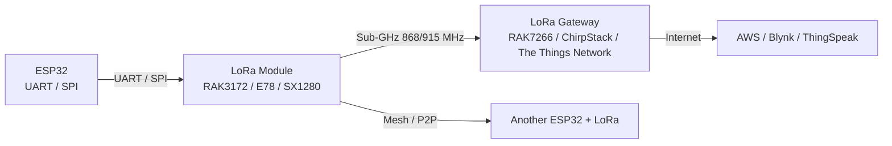

# Cellular Cat-1 and LoRa-2 - EC200U / Air724UG / RAK3172 / SX1280 / LR1121

## Purpose

Long-range communication for ESP32 where there is no WiFi: LTE Cat-1 / Cat-1bis (EC200U, Air724UG, M5311, ML302 - replacement for dying 2G) for MQTT / HTTP directly to cloud, and second-generation LoRa (E78, RAK3172 with STM32WLE, SX1280 at 2.4 GHz, LR1121 sub-GHz + 2.4 GHz + satellite) for low-power mesh / point-to-point.

![[assets/img/cellular-lora-2-scheme.png|600]]
*Fig. ESP32 with LTE Cat-1 (EC200U / Air724) for MQTT to cloud, and LoRa (RAK3172 / E78 / SX1280) for local mesh / long-range without internet; both share UART / SPI / power branches.*

Links to [[EN/Home.en]], [[EN/12-Comm-Modules/09-Cellular-NBIoT-UARTLoRa.en]], [[EN/12-Comm-Modules/07-SIM7600-W5500-MCP2515.en]], [[EN/12-Comm-Modules/18-Cellular-LoRa-2.en]] (self), [[04-Interfaces/01-UART|UART]], [[02-Power-Supply/01-Lancjugi-zhivlennya]].

## Characteristics (Comparison Table)

| Module | Type | Interface | Power | Data / Range | Notes |
| --- | --- | --- | --- | --- | --- |
| EC200U (Quectel) | LTE Cat-1 / Cat-1bis | UART / USB / M.2 | 3.3-4.2V | 10-50 kbps / 1-5 km | Direct MQTT / HTTP, good coverage |
| Air724UG (Airmodem) | LTE Cat-1 / NB-IoT | UART / USB | 3.3V | 10-50 kbps / 1-5 km | Budget Cat-1, low power, compact |
| M5311 (Quectel) | LTE Cat-1 / NB-IoT | UART / USB | 3.3V | 10-50 kbps / 1-5 km | Multi-mode, low cost, stable |
| BC25 / ML302 | LTE Cat-1 / Cat-M1 | UART / USB | 3.3V | 10-50 kbps / 1-5 km | Very low cost, basic features |
| RAK3172 (RAKwireless) | LoRa + STM32WLE | UART / SPI / USB | 3.3V / 5V | 0.3-50 kbps / 2-15 km (sub-GHz) | Mesh / long-range low-power |
| RAK3172 (RAKwireless) | LoRa + STM32WLE | UART / SPI / USB | 3.3V / 5V | 0.3-50 kbps / 2-15 km (sub-GHz) | Mesh / long-range low-power |
| E78 (Ebyte) | LoRa / LoRaWAN | UART / SPI | 3.3V | 0.3-50 kbps / 2-15 km | Low cost LoRa module |
| SX1280 (Semtech) | LoRa 2.4 GHz | SPI / UART | 3.3V | 0.3-50 kbps / 1-3 km (2.4 GHz) | High speed, short range, mesh |
| LR1121 (Semtech) | LoRa sub-GHz + 2.4 GHz + sat | SPI / UART | 3.3V | 0.3-50 kbps / 2-15 km | Multi-band, satellite option |

> [!tip] LTE Cat-1 vs LoRa Choice
> LTE Cat-1 when you need direct internet / MQTT / HTTP without gateways (but requires SIM / data plan, ~2-10 EUR/month). LoRa when you need long-range (2-15 km) with very low power and no data plan (but requires gateway / mesh for internet).

## 1. LTE Cat-1 / Cat-1bis for Direct Cloud

```text
ESP32 -> UART (9600 / 115200) -> EC200U / Air724 -> LTE network -> MQTT / HTTP -> AWS / Azure / ThingSpeak / Blynk
                                                      -> SMS / USSD (if data fails)
```

```python
# MicroPython: EC200U MQTT connect (simplified; use umqtt / mqtt library for full)
from machine import UART
import time

cell = UART(2, baudrate=115200, rx=16, tx=17)
cell.write(b"AT+CREG?\r\n")
# ... parse registration, APN, MQTT connect via AT commands or TCP/IP stack in module
```

> [!warning] 2G Is Dying - Replace with Cat-1 / NB-IoT
> Many operators are shutting down 2G / 3G. Use LTE Cat-1 / Cat-M1 / NB-IoT (EC200U / Air724UG / M5311) for long-term support. Check local operator coverage (e.g. Orange / Vodafone / Telecom in EU; AT&T / Verizon / T-Mobile in US).

## 2. LoRa Second Generation

LoRa (Long Range, 868 MHz EU / 915 MHz US / 433 MHz ISM) uses chirp spread spectrum. New modules: RAK3172 (STM32WLE + SX1262), E78, SX1280 (2.4 GHz), LR1121 (multi-band + satellite).



> [!tip] LoRa Bandwidth / Spreading Factor
> SF 7 (fast, short range, high data) / SF 12 (slow, long range, low data). For 2-15 km: SF 10-12, BW 125 kHz, coding rate 4/5, TX power 20 dBm (100 mW). For mesh / high rate: SF 7, BW 250 kHz, shorter range.

## 3. Integration (ESP32 + All Long-Range)

```text
ESP32 UART2 -> EC200U / Air724 (LTE Cat-1) -> MQTT / HTTP
ESP32 UART1 -> RAK3172 / E78 (LoRa) -> Gateway / Mesh / P2P
ESP32 UART3 -> GPS / Fingerprint (see 20-NFC-Biometry-2)
ESP32 SPI -> ENC28J60 / W5500 / PN5180 (see 19-Wired-2 / 15-RFID-Advanced)
```

```c
// ESP32 (Arduino): LoRa init with RAK3172 (UART mode) / SX1280 (SPI mode) - simplified
#include <LoRa.h>

void setup() {
  LoRa.begin(868E6); // EU 868 MHz
  LoRa.setSpreadingFactor(12);
  LoRa.setTxPower(20);
}

void loop() {
  LoRa.beginPacket();
  LoRa.print("{\"temp\":23.4,\"id\":1}");
  LoRa.endPacket();
  delay(10000);
}
```

## 4. Power Branches and Wiring

```text
3.3V Main (ESP32): ESP32 + LoRa logic / UART / SPI
5V / 3.7V Li-Ion (external, 2000 mAh+): LTE module peak (2-3 A during TX / registration) -> needs 2 A+ LDO or battery
5V / USB adapter: LTE / LoRa module when powered from adapter / charger
GND Common: All modules share GND; use star topology from ESP32 GND pin
```

> [!warning] LTE Peak Current
> During network registration / TCP connection / MQTT publish, EC200U / Air724 can draw 2-3 A peak for 100-500 ms. Use a 3.3V LDO with 3 A capability or a dedicated battery / 5V adapter with strong LDO. Do not run from ESP32 3.3V rail alone; ESP32 can supply ~500 mA max (Wi-Fi active) — far below LTE peak.

```text
3.3V Main (ESP32): ESP32 + LoRa logic / UART
5V / 3.7V Li-Ion (external): LTE module peak (2-3 A during TX / registration) -> needs 2 A+ LDO or battery
5V / USB: LTE / LoRa module when powered from adapter
GND Common: All modules share GND; star topology
```

> [!warning] LTE Peak Current
> During network registration / TCP connection / MQTT publish, EC200U / Air724 can draw 2-3 A peak for 100-500 ms. Use a 3.3V LDO with 3 A capability or a dedicated battery / 5V adapter with strong LDO. Do not run from ESP32 3.3V rail alone.

## 5. Budget / Module Selection

| Need | Module | Price | Notes |
| --- | --- | --- | --- |
| Direct MQTT / HTTP / SMS | EC200U / Air724 / M5311 | 20-60 USD | Needs SIM / data plan |
| Mesh / local long-range / no SIM | RAK3172 / E78 / SX1280 / LR1121 | 15-40 USD | Needs gateway or mesh |
| Multi-mode (LTE + LoRa) | RAK3172 + EC200U (dual ESP32) | 40-100 USD | Best flexibility |
| Satellite option | LR1121 + satellite service | 50-100 USD | For remote areas |

## 6. Module Selection Guide

| Use Case | Recommended Module | Reason | Estimated Cost |
| --- | --- | --- | --- |
| Direct MQTT / HTTP / SMS / cloud | EC200U / Air724UG / M5311 | Simple UART / AT commands, direct web | 20-60 USD + SIM |
| Remote area / no internet / long-range | RAK3172 / E78 / SX1280 / LR1121 | 2-15 km, very low power, no data plan | 15-40 USD |
| Multi-mode (LTE + LoRa on same site) | RAK3172 + EC200U (dual ESP32) | Flexibility: cloud when available, mesh when not | 40-100 USD |
| Satellite backup / extreme remote | LR1121 + satellite service | Multi-band + satellite option | 50-100 USD + service |
| Low-cost demo / education | E78 / BC25 / M5311 | Cheap modules, easy UART integration | 10-30 USD |

> [!tip] Start with a Single Module
> For first project: choose one technology (LTE or LoRa) based on coverage and budget. Add the second only when needed. Mixing both on one ESP32 is possible but requires separate UART / SPI and careful power planning.

## References

- EC200U / Air724UG / M5311 / ML302 datasheets
- RAK3172 / E78 / SX1280 / LR1121 datasheets
- LoRa spec (LoRa Alliance)
- LTE Cat-1 / NB-IoT specs (3GPP)
- MQTT / HTTP / NTRIP / Blynk / ThingSpeak docs
- ESP32 UART / SPI / Wi-Fi / 4G (SIM7600) docs
